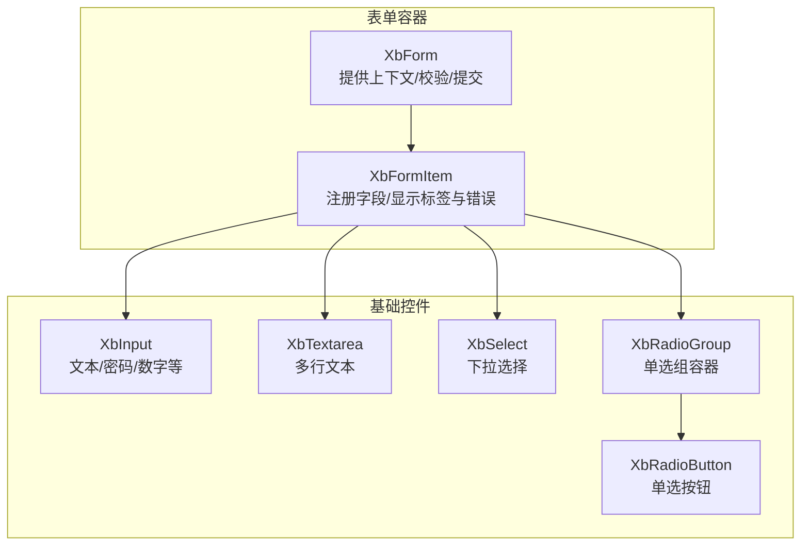
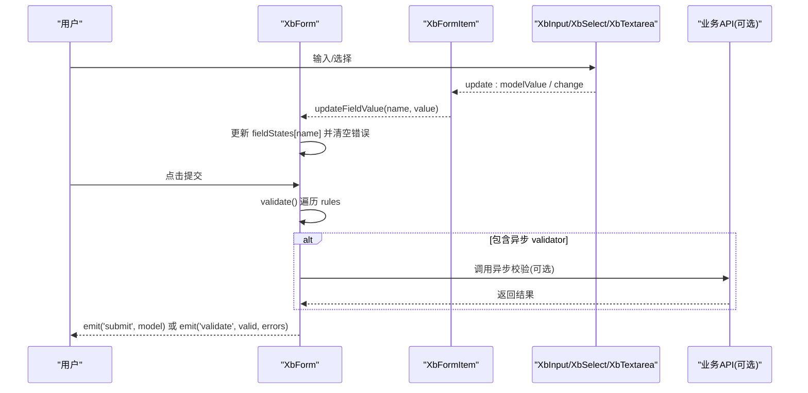
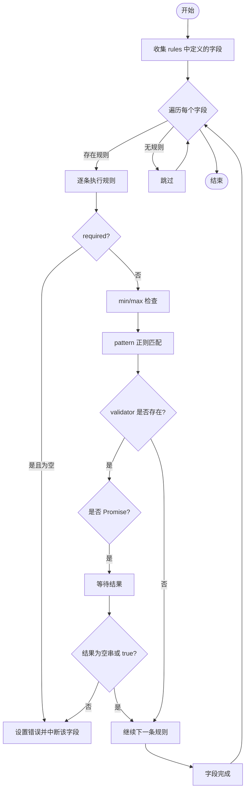
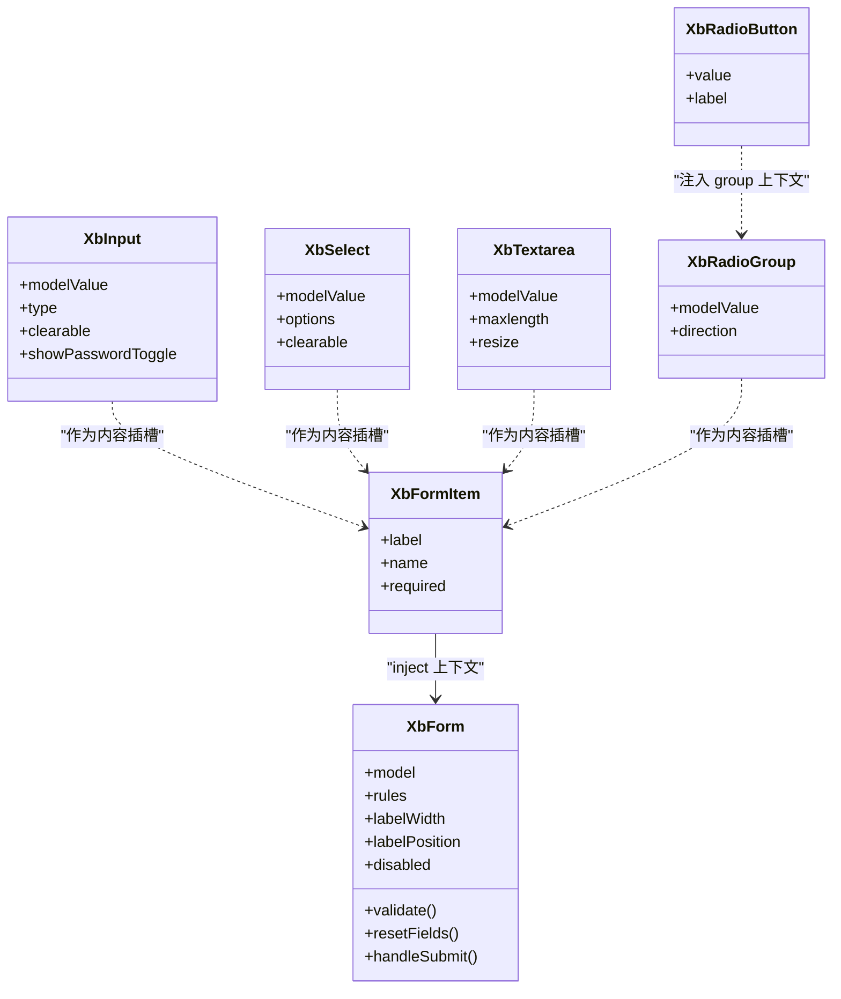

# 表单组件

<cite>
**本文引用的文件**   
- [XbForm/index.vue](file://frontend/src/xbUi/XbForm/index.vue)
- [XbFormItem/index.vue](file://frontend/src/xbUi/XbFormItem/index.vue)
- [XbInput/index.vue](file://frontend/src/xbUi/XbInput/index.vue)
- [XbSelect/index.vue](file://frontend/src/xbUi/XbSelect/index.vue)
- [XbTextarea/index.vue](file://frontend/src/xbUi/XbTextarea/index.vue)
- [XbRadioButton/index.vue](file://frontend/src/xbUi/XbRadioButton/index.vue)
- [XbRadioGroup/index.vue](file://frontend/src/xbUi/XbRadioGroup/index.vue)
- [XbForm/types.ts](file://frontend/src/xbUi/XbForm/types.ts)
- [XbSelect/types.ts](file://frontend/src/xbUi/XbSelect/types.ts)
- [EmailView.vue](file://frontend/src/layouts/components/TopBar/LoginModal/EmailView.vue)
</cite>

## 目录
1. [简介](#简介)
2. [项目结构](#项目结构)
3. [核心组件](#核心组件)
4. [架构总览](#架构总览)
5. [详细组件分析](#详细组件分析)
6. [依赖关系分析](#依赖关系分析)
7. [性能与体验优化](#性能与体验优化)
8. [故障排查指南](#故障排查指南)
9. [结论](#结论)
10. [附录：复杂表单构建示例](#附录复杂表单构建示例)

## 简介
本文件面向积木云AI创作平台的前端表单体系，系统性梳理 XbForm、XbFormItem、XbInput、XbSelect、XbTextarea、单选/多选（XbRadioGroup + XbRadioButton）等组件的设计与实现。文档覆盖表单验证机制、数据绑定模式、异步校验处理、错误提示展示、动态表单与条件渲染、批量操作与提交流程，以及性能优化、用户体验与可访问性支持建议。

## 项目结构
表单相关代码位于前端 UI 库 xbUi 目录下，采用“容器-表单项-基础控件”的分层组织方式：
- 容器与上下文：XbForm 提供表单上下文、统一校验与提交；XbFormItem 负责标签、错误信息展示与字段注册。
- 基础输入控件：XbInput、XbTextarea、XbSelect、XbRadioGroup + XbRadioButton 提供双向绑定与交互能力。
- 类型定义：XbForm/types.ts 定义规则与字段状态；XbSelect/types.ts 定义选项类型。

图表来源
- [XbForm/index.vue:1-164](file://frontend/src/xbUi/XbForm/index.vue#L1-L164)
- [XbFormItem/index.vue:1-80](file://frontend/src/xbUi/XbFormItem/index.vue#L1-L80)
- [XbInput/index.vue:1-177](file://frontend/src/xbUi/XbInput/index.vue#L1-L177)
- [XbSelect/index.vue:1-271](file://frontend/src/xbUi/XbSelect/index.vue#L1-L271)
- [XbTextarea/index.vue:1-168](file://frontend/src/xbUi/XbTextarea/index.vue#L1-L168)
- [XbRadioGroup/index.vue:1-43](file://frontend/src/xbUi/XbRadioGroup/index.vue#L1-L43)
- [XbRadioButton/index.vue:1-110](file://frontend/src/xbUi/XbRadioButton/index.vue#L1-L110)

章节来源
- [XbForm/index.vue:1-164](file://frontend/src/xbUi/XbForm/index.vue#L1-L164)
- [XbFormItem/index.vue:1-80](file://frontend/src/xbUi/XbFormItem/index.vue#L1-L80)
- [XbInput/index.vue:1-177](file://frontend/src/xbUi/XbInput/index.vue#L1-L177)
- [XbSelect/index.vue:1-271](file://frontend/src/xbUi/XbSelect/index.vue#L1-L271)
- [XbTextarea/index.vue:1-168](file://frontend/src/xbUi/XbTextarea/index.vue#L1-L168)
- [XbRadioGroup/index.vue:1-43](file://frontend/src/xbUi/XbRadioGroup/index.vue#L1-L43)
- [XbRadioButton/index.vue:1-110](file://frontend/src/xbUi/XbRadioButton/index.vue#L1-L110)

## 核心组件
- XbForm
  - 职责：维护表单上下文、字段状态、集中式校验与提交；通过 provide/inject 向子项传递 labelWidth、labelPosition、disabled 等全局配置。
  - 关键能力：
    - 字段注册/注销：registerField/unregisterField
    - 值更新与联动：updateFieldValue 同步到 model 并标记 touched、清空错误
    - 单字段校验：validateField 支持 required/min/max/pattern/validator
    - 全量校验：validate 遍历 rules，支持同步与异步 validator（Promise）
    - 提交封装：handleSubmit 自动触发 validate，成功后 emit submit
- XbFormItem
  - 职责：渲染 label、插槽内容、错误消息；在挂载时向父表单注册字段，卸载时注销。
  - 行为：根据 formContext 的 labelPosition/labelWidth 调整布局；读取 getFieldError 显示错误。
- XbInput
  - 职责：通用输入框，支持 type、clearable、showPasswordToggle、prefix/suffix/hint 插槽、尺寸控制、键盘事件透传。
  - 数据流：v-model 双向绑定，内部通过 update:modelValue 与 input/focus/blur/clear/keydown 事件对外暴露。
- XbSelect
  - 职责：下拉选择器，支持 clearable、size、自定义选中/选项插槽、向上/向下展开定位、多实例互斥关闭。
  - 数据流：v-model 双向绑定，change/clear 事件；Teleport 至 body 避免层级遮挡。
- XbTextarea
  - 职责：多行文本域，支持 maxlength 计数、resize 方向控制、top/bottom 插槽、clearable。
  - 数据流：v-model 双向绑定，input/focus/blur/clear 事件。
- XbRadioGroup + XbRadioButton
  - 职责：单选组容器与单选按钮；RadioGroup 通过 provide 共享 value/disabled/name/change，RadioButton 注入后计算选中态并触发 change。
  - 数据流：v-model 双向绑定，change 事件；支持水平/垂直排列。

章节来源
- [XbForm/index.vue:1-164](file://frontend/src/xbUi/XbForm/index.vue#L1-L164)
- [XbFormItem/index.vue:1-80](file://frontend/src/xbUi/XbFormItem/index.vue#L1-L80)
- [XbInput/index.vue:1-177](file://frontend/src/xbUi/XbInput/index.vue#L1-L177)
- [XbSelect/index.vue:1-271](file://frontend/src/xbUi/XbSelect/index.vue#L1-L271)
- [XbTextarea/index.vue:1-168](file://frontend/src/xbUi/XbTextarea/index.vue#L1-L168)
- [XbRadioGroup/index.vue:1-43](file://frontend/src/xbUi/XbRadioGroup/index.vue#L1-L43)
- [XbRadioButton/index.vue:1-110](file://frontend/src/xbUi/XbRadioButton/index.vue#L1-L110)

## 架构总览
表单系统采用“容器-表单项-控件”三层协作：
- 容器层（XbForm）：提供上下文、集中校验、统一提交。
- 表单项层（XbFormItem）：负责字段注册、标签与错误展示。
- 控件层（XbInput/XbSelect/XbTextarea/Radio*）：负责具体交互与 v-model 双向绑定。

图表来源
- [XbForm/index.vue:81-156](file://frontend/src/xbUi/XbForm/index.vue#L81-L156)
- [XbFormItem/index.vue:15-25](file://frontend/src/xbUi/XbFormItem/index.vue#L15-L25)
- [XbInput/index.vue:69-88](file://frontend/src/xbUi/XbInput/index.vue#L69-L88)
- [XbSelect/index.vue:115-124](file://frontend/src/xbUi/XbSelect/index.vue#L115-L124)
- [XbTextarea/index.vue:58-77](file://frontend/src/xbUi/XbTextarea/index.vue#L58-L77)

## 详细组件分析

### XbForm 表单容器
- 设计要点
  - 使用 reactive 维护 fieldStates，记录每个字段的 value/error/touched。
  - provide 暴露 registerField/unregisterField/updateFieldValue/validateField/getFieldError/isFieldTouched 等方法。
  - 内置同步校验规则：required/min/max/pattern/validator。
  - 支持异步 validator：Promise<boolean|string>，失败时返回错误字符串或 false。
  - 暴露方法：validate/resetFields handleSubmit，供外部调用。
- 数据流
  - 子项通过 updateFieldValue 将值写入 props.model 对应键，同时更新 fieldStates。
  - 校验失败时，fieldStates[name].error 被设置，XbFormItem 读取并展示。
- 复杂度
  - 全量校验时间复杂度 O(N*R)，N 为字段数，R 为每条规则的个数。
  - 空间复杂度 O(N)。

图表来源
- [XbForm/index.vue:45-134](file://frontend/src/xbUi/XbForm/index.vue#L45-L134)

章节来源
- [XbForm/index.vue:1-164](file://frontend/src/xbUi/XbForm/index.vue#L1-L164)
- [XbForm/types.ts:1-15](file://frontend/src/xbUi/XbForm/types.ts#L1-L15)

### XbFormItem 表单项
- 设计要点
  - 在 onMounted 时向父表单注册字段，onBeforeUnmount 注销。
  - 根据 formContext.labelPosition/labelWidth 决定布局样式。
  - 读取 formContext.getFieldError(name) 显示错误信息。
- 交互
  - 支持必填星号显示、左侧/顶部标签布局。

章节来源
- [XbFormItem/index.vue:1-80](file://frontend/src/xbUi/XbFormItem/index.vue#L1-L80)

### XbInput 输入框
- 设计要点
  - 支持多种 type（text/password/email/number 等），密码可见切换。
  - 支持 prefix/suffix/hint 插槽、clearable、maxlength、tabindex、size。
  - 事件透传：input/focus/blur/clear/keydown。
- 数据绑定
  - v-model 双向绑定，内部通过 update:modelValue 更新父级值。

章节来源
- [XbInput/index.vue:1-177](file://frontend/src/xbUi/XbInput/index.vue#L1-L177)

### XbSelect 下拉选择
- 设计要点
  - Teleport 至 body，避免 z-index 与 overflow 问题。
  - 智能定位：当下方空间不足时向上展开；监听 resize/scroll 保持对齐。
  - 多实例互斥：通过自定义事件通知其他实例关闭自身下拉。
  - 支持 clearable、size、自定义选中/选项插槽。
- 数据绑定
  - v-model 双向绑定，change/clear 事件。

章节来源
- [XbSelect/index.vue:1-271](file://frontend/src/xbUi/XbSelect/index.vue#L1-L271)
- [XbSelect/types.ts:1-9](file://frontend/src/xbUi/XbSelect/types.ts#L1-L9)

### XbTextarea 文本域
- 设计要点
  - 支持 maxlength 计数、resize 方向控制、top-left/top-right/bottom-left/bottom-right 插槽。
  - 支持 clearable、readonly/disabled。
- 数据绑定
  - v-model 双向绑定，input/focus/blur/clear 事件。

章节来源
- [XbTextarea/index.vue:1-168](file://frontend/src/xbUi/XbTextarea/index.vue#L1-L168)

### XbRadioGroup + XbRadioButton 单选
- 设计要点
  - RadioGroup 通过 provide 共享 value/disabled/name/change，RadioButton 注入后计算选中态。
  - 支持水平/垂直排列，尺寸 sm/md/lg。
- 数据绑定
  - v-model 双向绑定，change 事件。

章节来源
- [XbRadioGroup/index.vue:1-43](file://frontend/src/xbUi/XbRadioGroup/index.vue#L1-L43)
- [XbRadioButton/index.vue:1-110](file://frontend/src/xbUi/XbRadioButton/index.vue#L1-L110)

## 依赖关系分析
- 组件耦合
  - XbFormItem 强依赖 XbForm 提供的上下文（provide/inject）。
  - 基础控件（XbInput/XbSelect/XbTextarea/Radio*）与 XbFormItem 松耦合，仅通过 v-model 与事件进行数据通信。
- 外部依赖
  - XbSelect 依赖 DOM 测量与窗口事件（resize/scroll/click）。
  - XbInput 依赖图标组件用于密码切换与清除按钮。
- 潜在循环依赖
  - 当前未发现循环引用；XbForm 不直接依赖具体控件，仅通过上下文接口交互。

图表来源
- [XbForm/index.vue:1-164](file://frontend/src/xbUi/XbForm/index.vue#L1-L164)
- [XbFormItem/index.vue:1-80](file://frontend/src/xbUi/XbFormItem/index.vue#L1-L80)
- [XbInput/index.vue:1-177](file://frontend/src/xbUi/XbInput/index.vue#L1-L177)
- [XbSelect/index.vue:1-271](file://frontend/src/xbUi/XbSelect/index.vue#L1-L271)
- [XbTextarea/index.vue:1-168](file://frontend/src/xbUi/XbTextarea/index.vue#L1-L168)
- [XbRadioGroup/index.vue:1-43](file://frontend/src/xbUi/XbRadioGroup/index.vue#L1-L43)
- [XbRadioButton/index.vue:1-110](file://frontend/src/xbUi/XbRadioButton/index.vue#L1-L110)

章节来源
- [XbForm/index.vue:1-164](file://frontend/src/xbUi/XbForm/index.vue#L1-L164)
- [XbFormItem/index.vue:1-80](file://frontend/src/xbUi/XbFormItem/index.vue#L1-L80)
- [XbInput/index.vue:1-177](file://frontend/src/xbUi/XbInput/index.vue#L1-L177)
- [XbSelect/index.vue:1-271](file://frontend/src/xbUi/XbSelect/index.vue#L1-L271)
- [XbTextarea/index.vue:1-168](file://frontend/src/xbUi/XbTextarea/index.vue#L1-L168)
- [XbRadioGroup/index.vue:1-43](file://frontend/src/xbUi/XbRadioGroup/index.vue#L1-L43)
- [XbRadioButton/index.vue:1-110](file://frontend/src/xbUi/XbRadioButton/index.vue#L1-L110)

## 性能与体验优化
- 表单校验
  - 优先使用同步规则（required/min/max/pattern），减少不必要的异步请求。
  - 对耗时校验（如唯一性检查）使用防抖/节流，并在 validator 中返回 Promise。
- 渲染与定位
  - XbSelect 使用 Teleport 与固定定位，避免重排重绘；仅在打开时计算位置，滚动/缩放时增量更新。
- 交互反馈
  - 输入/选择后立即清空错误，提升流畅度；聚焦态高亮边框与阴影增强可达性。
- 可访问性
  - 为输入控件提供 tabindex、aria-* 扩展点（可在上层组合时补充）。
  - 错误信息以段落形式紧邻控件输出，便于屏幕阅读器朗读。
- 内存与事件
  - XbSelect 在卸载时移除 document/window 事件监听，防止泄漏。

[本节为通用指导，无需列出具体文件来源]

## 故障排查指南
- 字段未注册/错误不显示
  - 确认 XbFormItem 包裹了控件且 name 属性正确；确保在父表单内。
  - 参考：[XbFormItem/index.vue:15-25](file://frontend/src/xbUi/XbFormItem/index.vue#L15-L25)
- 校验不生效
  - 检查 rules 结构与字段名一致；异步 validator 需返回 Promise。
  - 参考：[XbForm/index.vue:81-134](file://frontend/src/xbUi/XbForm/index.vue#L81-L134)
- 下拉定位异常
  - 检查是否在滚动容器或 fixed 父级中；必要时手动触发 updateDropdownPosition。
  - 参考：[XbSelect/index.vue:67-92](file://frontend/src/xbUi/XbSelect/index.vue#L67-L92)
- 密码不可见/清除按钮不出现
  - 确认 showPasswordToggle/clearable 与 disabled/readonly 状态。
  - 参考：[XbInput/index.vue:49-88](file://frontend/src/xbUi/XbInput/index.vue#L49-L88)

章节来源
- [XbFormItem/index.vue:15-25](file://frontend/src/xbUi/XbFormItem/index.vue#L15-L25)
- [XbForm/index.vue:81-134](file://frontend/src/xbUi/XbForm/index.vue#L81-L134)
- [XbSelect/index.vue:67-92](file://frontend/src/xbUi/XbSelect/index.vue#L67-L92)
- [XbInput/index.vue:49-88](file://frontend/src/xbUi/XbInput/index.vue#L49-L88)

## 结论
本表单体系以 XbForm 为核心，结合 XbFormItem 与一系列基础控件，实现了声明式的数据绑定与灵活的校验机制。通过上下文注入与事件驱动，组件间解耦清晰、可扩展性强。配合合理的异步校验策略与定位优化，可满足复杂业务场景下的表单需求。

[本节为总结性内容，无需列出具体文件来源]

## 附录：复杂表单构建示例
以下示例基于仓库中的实际用法，演示如何组合表单组件完成常见场景。

- 登录弹窗（邮箱验证码登录）
  - 使用 XbFormItem 包裹 XbInput，组合前缀图标与快捷按钮，实现邮箱地址、验证码、图形验证码输入。
  - 参考路径：[EmailView.vue:110-153](file://frontend/src/layouts/components/TopBar/LoginModal/EmailView.vue#L110-L153)

- 资产筛选与搜索
  - 使用 XbInput 作为搜索框，结合列表与分页组件，实现关键词过滤与标签筛选。
  - 参考路径：[AssetsPage/index.vue:108-120](file://frontend/src/views/AssetsPage/index.vue#L108-L120)

- 动态表单与条件渲染
  - 通过 v-if/v-for 动态生成 XbFormItem 与控件，结合 XbForm.rules 动态绑定校验规则。
  - 参考思路：在父组件中维护 fields 数组与 rules 对象，按需渲染。

- 批量操作
  - 在表格或网格视图中勾选多条记录，结合 XbConfirmModal 与批量 API 完成删除/移动等操作。
  - 参考思路：维护 selectedIds 数组，批量提交前进行二次确认。

- 表单提交处理
  - 使用 XbForm.handleSubmit 或 ref 调用 validate，通过后组装 payload 提交后端。
  - 参考路径：[XbForm/index.vue:143-156](file://frontend/src/xbUi/XbForm/index.vue#L143-L156)

[本节为使用示例说明，无需列出具体文件来源]