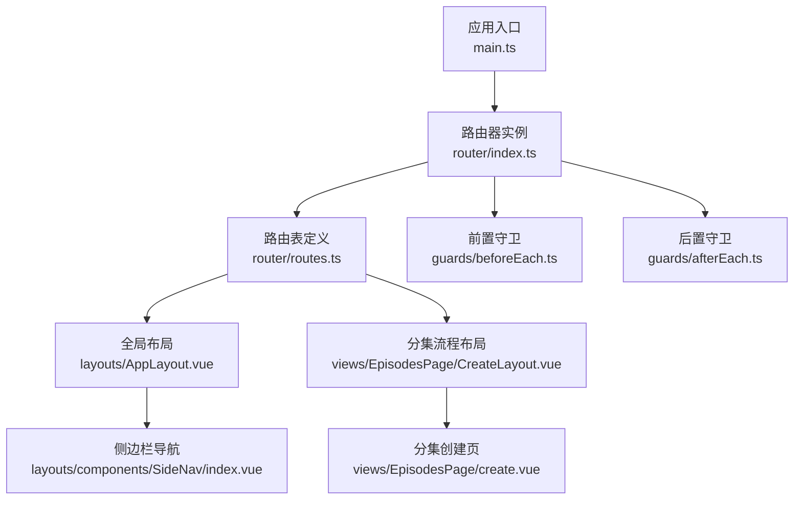
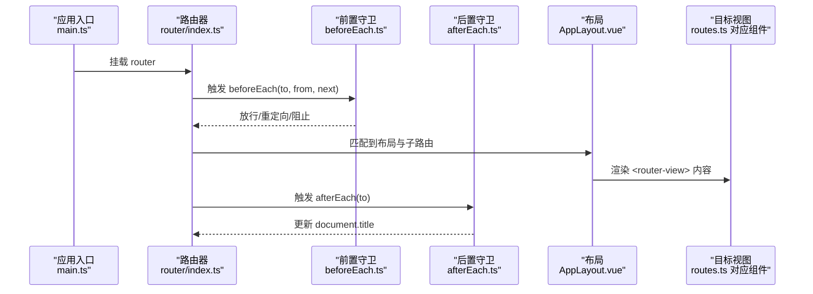
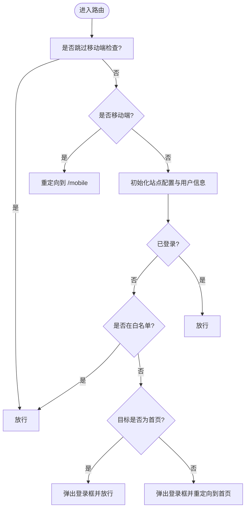
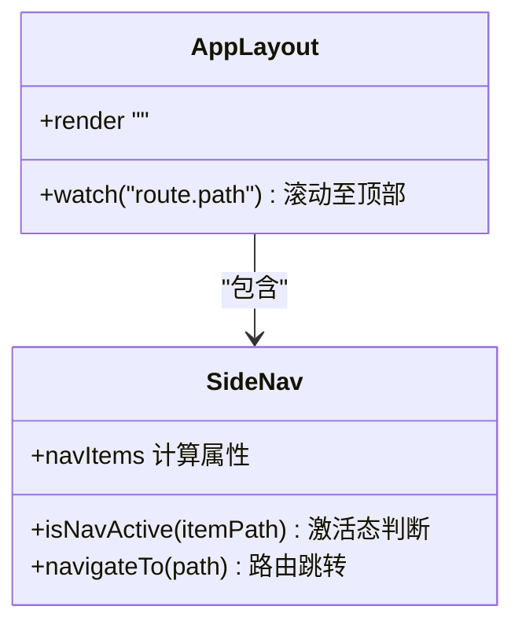
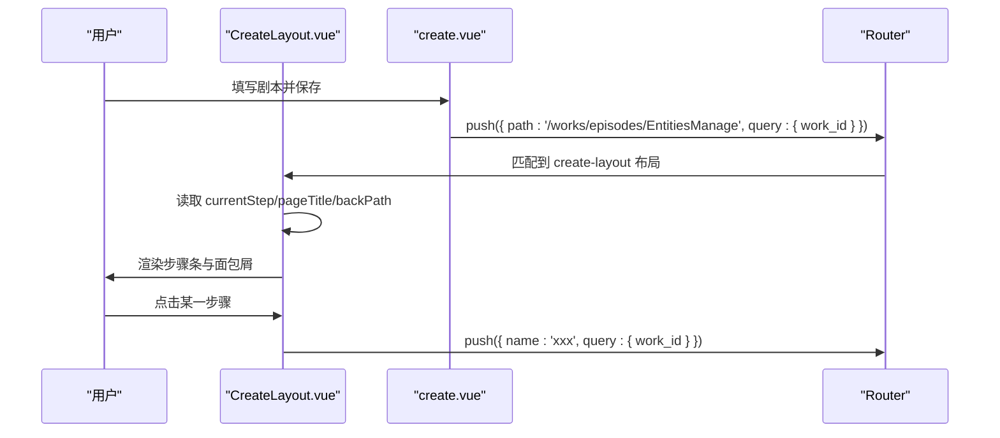
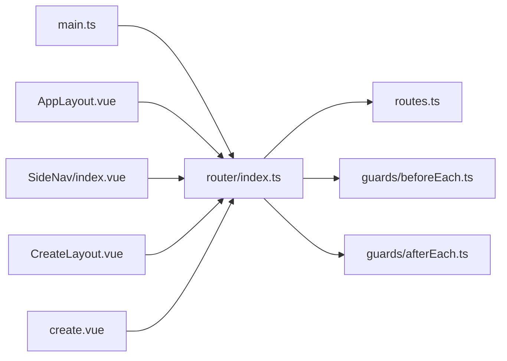

# 路由系统与导航控制

<cite>
**本文引用的文件**   
- [frontend/src/router/index.ts](file://frontend/src/router/index.ts)
- [frontend/src/router/routes.ts](file://frontend/src/router/routes.ts)
- [frontend/src/router/guards/beforeEach.ts](file://frontend/src/router/guards/beforeEach.ts)
- [frontend/src/router/guards/afterEach.ts](file://frontend/src/router/guards/afterEach.ts)
- [frontend/src/main.ts](file://frontend/src/main.ts)
- [frontend/src/layouts/AppLayout.vue](file://frontend/src/layouts/AppLayout.vue)
- [frontend/src/layouts/components/SideNav/index.vue](file://frontend/src/layouts/components/SideNav/index.vue)
- [frontend/src/views/EpidodesPage/CreateLayout.vue](file://frontend/src/views/EpisodesPage/CreateLayout.vue)
- [frontend/src/views/EpisodesPage/create.vue](file://frontend/src/views/EpisodesPage/create.vue)
</cite>

## 目录
1. [简介](#简介)
2. [项目结构](#项目结构)
3. [核心组件](#核心组件)
4. [架构总览](#架构总览)
5. [详细组件分析](#详细组件分析)
6. [依赖关系分析](#依赖关系分析)
7. [性能与优化](#性能与优化)
8. [故障排查指南](#故障排查指南)
9. [结论](#结论)
10. [附录：最佳实践与扩展建议](#附录最佳实践与扩展建议)

## 简介
本文件面向积木云AI创作平台的前端路由系统，系统性梳理基于 Vue Router 的路由配置、动态路由生成、嵌套路由设计、懒加载策略、路由守卫（beforeEach、afterEach）机制、权限与登录校验、页面访问控制、参数传递与查询字符串处理、面包屑导航实现，以及移动端适配与 SEO 优化策略。文档以源码为依据，提供可视化图示与可追溯的“章节来源”，帮助开发者快速理解并扩展路由能力。

## 项目结构
前端路由相关代码集中在 frontend/src/router 目录下，配合布局与视图层完成导航与页面渲染。

图表来源
- [frontend/src/main.ts:1-21](file://frontend/src/main.ts#L1-L21)
- [frontend/src/router/index.ts:1-15](file://frontend/src/router/index.ts#L1-L15)
- [frontend/src/router/routes.ts:1-110](file://frontend/src/router/routes.ts#L1-L110)
- [frontend/src/router/guards/beforeEach.ts:1-54](file://frontend/src/router/guards/beforeEach.ts#L1-L54)
- [frontend/src/router/guards/afterEach.ts:1-19](file://frontend/src/router/guards/afterEach.ts#L1-L19)
- [frontend/src/layouts/AppLayout.vue:1-50](file://frontend/src/layouts/AppLayout.vue#L1-L50)
- [frontend/src/layouts/components/SideNav/index.vue:1-106](file://frontend/src/layouts/components/SideNav/index.vue#L1-L106)
- [frontend/src/views/EpisodesPage/CreateLayout.vue:1-71](file://frontend/src/views/EpisodesPage/CreateLayout.vue#L1-L71)
- [frontend/src/views/EpisodesPage/create.vue:1-215](file://frontend/src/views/EpisodesPage/create.vue#L1-L215)

章节来源
- [frontend/src/router/index.ts:1-15](file://frontend/src/router/index.ts#L1-L15)
- [frontend/src/router/routes.ts:1-110](file://frontend/src/router/routes.ts#L1-L110)
- [frontend/src/router/guards/beforeEach.ts:1-54](file://frontend/src/router/guards/beforeEach.ts#L1-L54)
- [frontend/src/router/guards/afterEach.ts:1-19](file://frontend/src/router/guards/afterEach.ts#L1-L19)
- [frontend/src/main.ts:1-21](file://frontend/src/main.ts#L1-L21)
- [frontend/src/layouts/AppLayout.vue:1-50](file://frontend/src/layouts/AppLayout.vue#L1-L50)
- [frontend/src/layouts/components/SideNav/index.vue:1-106](file://frontend/src/layouts/components/SideNav/index.vue#L1-L106)
- [frontend/src/views/EpisodesPage/CreateLayout.vue:1-71](file://frontend/src/views/EpisodesPage/CreateLayout.vue#L1-L71)
- [frontend/src/views/EpisodesPage/create.vue:1-215](file://frontend/src/views/EpisodesPage/create.vue#L1-L215)

## 核心组件
- 路由器初始化与历史模式
  - 使用 Hash 历史模式，便于部署到静态站点或无后端重写场景。
  - 在初始化时注册前置与后置守卫。
- 路由表与懒加载
  - 所有页面组件均采用函数式 import 进行按需加载，减少首屏体积。
  - 通过 children 构建嵌套路由，统一布局与子页面组合。
- 路由守卫
  - beforeEach：设备类型检测、白名单放行、未登录拦截与提示、站点与用户信息预取。
  - afterEach：根据 meta.title 与站点配置动态设置 document.title。
- 布局与导航联动
  - AppLayout 作为主布局，包含侧边栏与顶部栏，并在路由切换时滚动至顶部。
  - SideNav 根据当前路径高亮菜单项，并根据站点配置动态显示/隐藏入口。
- 分集流程与面包屑
  - CreateLayout 作为多步骤流程容器，结合 route.meta.currentStep/pageTitle/backPath 渲染步骤条与面包屑。
  - create 页面保存后通过 query 传递 work_id 进入后续步骤。

章节来源
- [frontend/src/router/index.ts:1-15](file://frontend/src/router/index.ts#L1-L15)
- [frontend/src/router/routes.ts:1-110](file://frontend/src/router/routes.ts#L1-L110)
- [frontend/src/router/guards/beforeEach.ts:1-54](file://frontend/src/router/guards/beforeEach.ts#L1-L54)
- [frontend/src/router/guards/afterEach.ts:1-19](file://frontend/src/router/guards/afterEach.ts#L1-L19)
- [frontend/src/layouts/AppLayout.vue:1-50](file://frontend/src/layouts/AppLayout.vue#L1-L50)
- [frontend/src/layouts/components/SideNav/index.vue:1-106](file://frontend/src/layouts/components/SideNav/index.vue#L1-L106)
- [frontend/src/views/EpisodesPage/CreateLayout.vue:1-71](file://frontend/src/views/EpisodesPage/CreateLayout.vue#L1-L71)
- [frontend/src/views/EpisodesPage/create.vue:1-215](file://frontend/src/views/EpisodesPage/create.vue#L1-L215)

## 架构总览
下图展示从应用启动到路由解析、守卫执行、布局渲染与页面切换的整体流程。

图表来源
- [frontend/src/main.ts:1-21](file://frontend/src/main.ts#L1-L21)
- [frontend/src/router/index.ts:1-15](file://frontend/src/router/index.ts#L1-L15)
- [frontend/src/router/guards/beforeEach.ts:1-54](file://frontend/src/router/guards/beforeEach.ts#L1-L54)
- [frontend/src/router/guards/afterEach.ts:1-19](file://frontend/src/router/guards/afterEach.ts#L1-L19)
- [frontend/src/layouts/AppLayout.vue:1-50](file://frontend/src/layouts/AppLayout.vue#L1-L50)
- [frontend/src/router/routes.ts:1-110](file://frontend/src/router/routes.ts#L1-L110)

## 详细组件分析

### 路由器初始化与历史模式
- 使用 createWebHashHistory，适合静态托管环境。
- 集中注册 before/after 守卫，保持路由逻辑清晰。

章节来源
- [frontend/src/router/index.ts:1-15](file://frontend/src/router/index.ts#L1-L15)

### 路由表与懒加载策略
- 根级路由 /mobile 用于移动端专用页面，meta.skipMobileCheck 跳过设备检查。
- 主布局 / 下嵌套多个业务模块：首页、作品管理、资产、市场、社区、帮助中心等。
- 分集流程采用独立布局 /works/episodes/create-layout，其子路由共享步骤条与面包屑。
- 所有页面组件均通过 () => import(...) 实现路由级懒加载，降低首屏包体。

章节来源
- [frontend/src/router/routes.ts:1-110](file://frontend/src/router/routes.ts#L1-L110)

### 路由守卫机制（beforeEach、afterEach）
- 设备检测与移动端适配
  - 通过 UA、屏幕宽度与触摸能力判断移动端；若命中且目标路由未标记 skipMobileCheck，则重定向到 /mobile。
- 白名单与登录校验
  - 白名单路由无需登录即可访问。
  - 未登录访问非白名单路由时：首页弹出登录框并允许进入；其他页面跳转首页并弹出登录框。
- 数据预取
  - 在进入页面之前拉取站点配置与用户信息，确保页面渲染所需数据可用。
- 标题更新
  - 根据 to.meta.title 与站点配置拼接 document.title，首页与非首页分别处理。

图表来源
- [frontend/src/router/guards/beforeEach.ts:1-54](file://frontend/src/router/guards/beforeEach.ts#L1-L54)
- [frontend/src/router/guards/afterEach.ts:1-19](file://frontend/src/router/guards/afterEach.ts#L1-L19)

章节来源
- [frontend/src/router/guards/beforeEach.ts:1-54](file://frontend/src/router/guards/beforeEach.ts#L1-L54)
- [frontend/src/router/guards/afterEach.ts:1-19](file://frontend/src/router/guards/afterEach.ts#L1-L19)

### 布局与导航联动
- AppLayout
  - 监听 route.path 变化，切换路由时将主内容区滚动至顶部，提升体验一致性。
  - 使用 <router-view> 渲染子路由，支持过渡动画。
- SideNav
  - 根据 siteConfig 动态显示/隐藏“资产市场”和“社区动态”入口。
  - 精确匹配当前路径，避免父级路径误匹配子路径。

图表来源
- [frontend/src/layouts/AppLayout.vue:1-50](file://frontend/src/layouts/AppLayout.vue#L1-L50)
- [frontend/src/layouts/components/SideNav/index.vue:1-106](file://frontend/src/layouts/components/SideNav/index.vue#L1-L106)

章节来源
- [frontend/src/layouts/AppLayout.vue:1-50](file://frontend/src/layouts/AppLayout.vue#L1-L50)
- [frontend/src/layouts/components/SideNav/index.vue:1-106](file://frontend/src/layouts/components/SideNav/index.vue#L1-L106)

### 分集流程与面包屑导航
- CreateLayout
  - 读取 route.meta.currentStep/pageTitle/backPath 渲染步骤条与面包屑。
  - 点击步骤通过 router.push({ name, query }) 切换子路由，query 中携带 work_id 贯穿流程。
- create 页面
  - 表单校验通过后保存工作，随后跳转到实体管理页并附带 work_id。

图表来源
- [frontend/src/views/EpisodesPage/CreateLayout.vue:1-71](file://frontend/src/views/EpisodesPage/CreateLayout.vue#L1-L71)
- [frontend/src/views/EpisodesPage/create.vue:1-215](file://frontend/src/views/EpisodesPage/create.vue#L1-L215)

章节来源
- [frontend/src/views/EpisodesPage/CreateLayout.vue:1-71](file://frontend/src/views/EpisodesPage/CreateLayout.vue#L1-L71)
- [frontend/src/views/EpisodesPage/create.vue:1-215](file://frontend/src/views/EpisodesPage/create.vue#L1-L215)

### 路由参数与查询字符串处理
- 路径参数
  - 当前路由表未使用动态段（如 :id），如需新增可按需添加。
- 查询字符串
  - 分集流程通过 query.work_id 在工作间传递上下文，CreateLayout 在各步骤间复用该参数。
- 编程式导航
  - 使用 router.push({ name/path, query }) 进行跳转，保证状态持久化于 URL。

章节来源
- [frontend/src/views/EpisodesPage/CreateLayout.vue:1-71](file://frontend/src/views/EpisodesPage/CreateLayout.vue#L1-L71)
- [frontend/src/views/EpisodesPage/create.vue:1-215](file://frontend/src/views/EpisodesPage/create.vue#L1-L215)

### 移动端适配与 SEO 优化策略
- 移动端适配
  - 前置守卫内对 UA、屏幕宽度与触摸能力进行综合判断，命中则重定向到 /mobile 专用页面。
  - 目标路由可通过 meta.skipMobileCheck 显式跳过设备检查。
- SEO 优化
  - 当前使用 Hash 历史模式，不利于搜索引擎抓取；建议在生产环境切换为 History 模式，并配合服务端将未知路径回退到 index.html。
  - 利用 afterEach 动态设置 document.title，有助于搜索引擎识别页面主题。
  - 可在各路由 meta 中补充 description、keywords 等元信息，并通过 DOM 操作或 head 管理库注入。

章节来源
- [frontend/src/router/guards/beforeEach.ts:1-54](file://frontend/src/router/guards/beforeEach.ts#L1-L54)
- [frontend/src/router/guards/afterEach.ts:1-19](file://frontend/src/router/guards/afterEach.ts#L1-L19)
- [frontend/src/router/index.ts:1-15](file://frontend/src/router/index.ts#L1-L15)

## 依赖关系分析
- 入口 main.ts 挂载 Pinia、Router 与 UI 插件，并注册全局事件处理器，使 HTTP 错误码能触发登录弹窗等交互。
- 路由层依赖站点配置与用户状态，在 beforeEach 中预取数据，保障页面渲染所需上下文。
- 布局与导航组件通过 useRoute/useRouter 与路由系统解耦协作。

图表来源
- [frontend/src/main.ts:1-21](file://frontend/src/main.ts#L1-L21)
- [frontend/src/router/index.ts:1-15](file://frontend/src/router/index.ts#L1-L15)
- [frontend/src/router/routes.ts:1-110](file://frontend/src/router/routes.ts#L1-L110)
- [frontend/src/router/guards/beforeEach.ts:1-54](file://frontend/src/router/guards/beforeEach.ts#L1-L54)
- [frontend/src/router/guards/afterEach.ts:1-19](file://frontend/src/router/guards/afterEach.ts#L1-L19)
- [frontend/src/layouts/AppLayout.vue:1-50](file://frontend/src/layouts/AppLayout.vue#L1-L50)
- [frontend/src/layouts/components/SideNav/index.vue:1-106](file://frontend/src/layouts/components/SideNav/index.vue#L1-L106)
- [frontend/src/views/EpisodesPage/CreateLayout.vue:1-71](file://frontend/src/views/EpisodesPage/CreateLayout.vue#L1-L71)
- [frontend/src/views/EpisodesPage/create.vue:1-215](file://frontend/src/views/EpisodesPage/create.vue#L1-L215)

章节来源
- [frontend/src/main.ts:1-21](file://frontend/src/main.ts#L1-L21)
- [frontend/src/router/index.ts:1-15](file://frontend/src/router/index.ts#L1-L15)
- [frontend/src/router/routes.ts:1-110](file://frontend/src/router/routes.ts#L1-L110)
- [frontend/src/router/guards/beforeEach.ts:1-54](file://frontend/src/router/guards/beforeEach.ts#L1-L54)
- [frontend/src/router/guards/afterEach.ts:1-19](file://frontend/src/router/guards/afterEach.ts#L1-L19)
- [frontend/src/layouts/AppLayout.vue:1-50](file://frontend/src/layouts/AppLayout.vue#L1-L50)
- [frontend/src/layouts/components/SideNav/index.vue:1-106](file://frontend/src/layouts/components/SideNav/index.vue#L1-L106)
- [frontend/src/views/EpisodesPage/CreateLayout.vue:1-71](file://frontend/src/views/EpisodesPage/CreateLayout.vue#L1-L71)
- [frontend/src/views/EpisodesPage/create.vue:1-215](file://frontend/src/views/EpisodesPage/create.vue#L1-L215)

## 性能与优化
- 路由级懒加载
  - 所有页面组件采用函数式 import，按路由拆分打包，显著降低首屏体积。
- 预取关键数据
  - 在 beforeEach 中提前拉取站点配置与用户信息，避免页面二次请求导致的闪烁。
- 平滑过渡与滚动复位
  - 布局层监听路由变化并滚动至顶部，提升用户体验一致性。
- 生产环境建议
  - 将 history 模式切换为 createWebHistory，并配置服务端回退到 index.html，利于 SEO 与分享链接稳定性。
  - 对大型第三方库进一步做按需引入与 Tree-shaking。

[本节为通用指导，不直接分析具体文件]

## 故障排查指南
- 移动端无法进入预期页面
  - 检查目标路由是否设置了 skipMobileCheck；确认设备检测逻辑是否符合预期。
- 未登录被反复重定向
  - 确认白名单路由名称是否正确；检查用户登录态初始化是否成功。
- 页面标题不正确
  - 检查路由 meta.title 是否存在；确认站点配置 web_name/web_title 是否返回。
- 面包屑或步骤条异常
  - 核对 route.meta.currentStep/pageTitle/backPath 是否随路由正确传递；检查 query.work_id 是否保留。

章节来源
- [frontend/src/router/guards/beforeEach.ts:1-54](file://frontend/src/router/guards/beforeEach.ts#L1-L54)
- [frontend/src/router/guards/afterEach.ts:1-19](file://frontend/src/router/guards/afterEach.ts#L1-L19)
- [frontend/src/views/EpisodesPage/CreateLayout.vue:1-71](file://frontend/src/views/EpisodesPage/CreateLayout.vue#L1-L71)

## 结论
本项目基于 Vue Router 构建了清晰、可扩展的路由体系：通过懒加载与嵌套路由组织页面结构，借助前置与后置守卫实现设备适配、登录校验与标题管理，结合布局与导航组件形成一致的交互体验。分集流程通过路由 meta 与 query 参数串联多步骤任务，具备良好的可维护性与扩展性。建议在后续迭代中完善 SEO 元信息、引入 History 模式与服务端回退，并持续优化首屏性能与可观测性。

[本节为总结性内容，不直接分析具体文件]

## 附录：最佳实践与扩展建议
- 动态路由生成
  - 可从后端菜单接口生成路由表，结合白名单与权限字段在 beforeEach 中动态注册路由。
- 细粒度权限控制
  - 在路由 meta 中增加 roles/permissions，在 beforeEach 中比对用户角色与资源权限。
- 全局错误与重试
  - 结合全局事件总线与 HTTP 拦截器，统一处理 401/403/301/302 等状态码，必要时自动刷新 token 并重试请求。
- SEO 增强
  - 在 afterEach 中同步更新 meta description、keywords、og:title、og:image 等标签，提升社交分享与搜索可见性。

[本节为概念性内容，不直接分析具体文件]