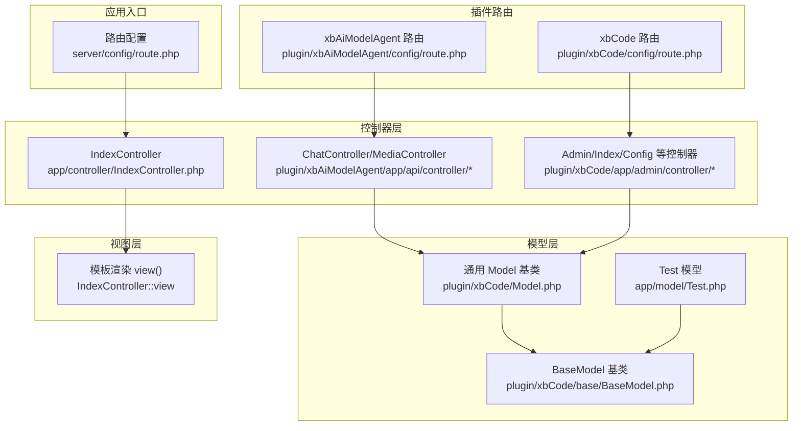
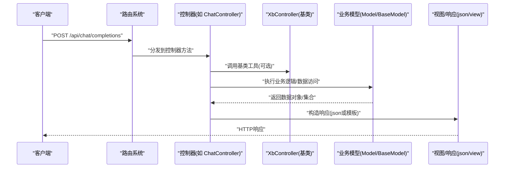
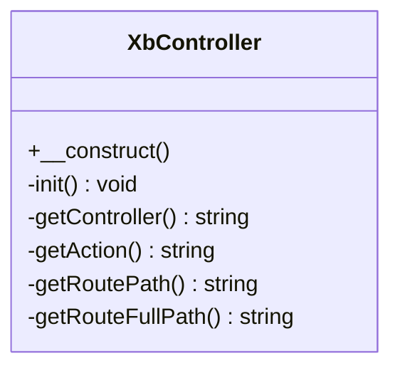
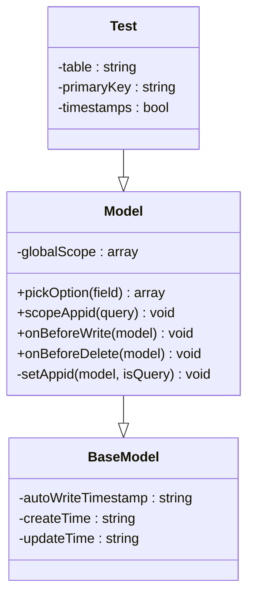
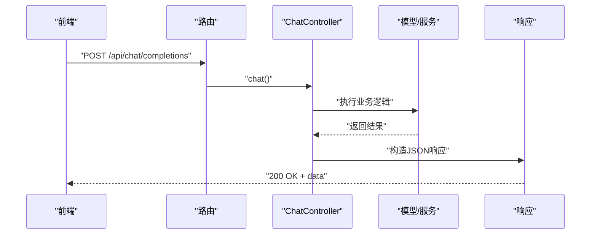
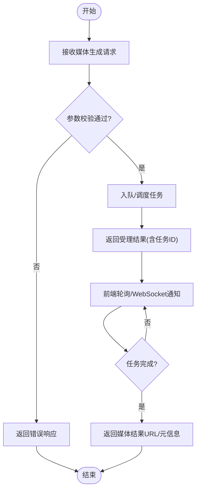
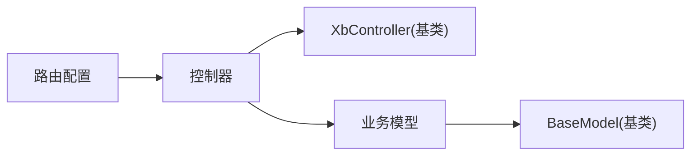

# MVC架构模式

<cite>
**本文引用的文件**   
- [IndexController.php](file://server/app/controller/IndexController.php)
- [Test.php](file://server/app/model/Test.php)
- [route.php](file://server/config/route.php)
- [XbController.php](file://server/plugin\xbCode\XbController.php)
- [Model.php](file://server/plugin\xbCode\Model.php)
- [BaseModel.php](file://server/plugin\xbCode\base\BaseModel.php)
- [route.php（xbAiModelAgent）](file://server/plugin\xbAiModelAgent\config\route.php)
- [route.php（xbCode）](file://server/plugin\xbCode\config\route.php)
</cite>

## 目录
1. [简介](#简介)
2. [项目结构](#项目结构)
3. [核心组件](#核心组件)
4. [架构总览](#架构总览)
5. [详细组件分析](#详细组件分析)
6. [依赖关系分析](#依赖关系分析)
7. [性能考虑](#性能考虑)
8. [故障排查指南](#故障排查指南)
9. [结论](#结论)
10. [附录](#附录)

## 简介
本文件面向积木云AI创作平台，系统化阐述基于MVC（模型-视图-控制器）的架构模式与前后端分离API设计规范。文档聚焦以下目标：
- 明确控制器层、模型层、视图层的职责边界与设计原则
- 解释RESTful API控制器规范、数据模型定义与业务逻辑封装
- 说明路由映射机制、参数验证与响应格式化
- 提供可复用的MVC组件开发示例，展示前后端分离的数据流转

## 项目结构
后端采用Webman框架，结合插件化组织业务模块。MVC相关关键位置如下：
- 控制器：位于 app/controller 与 plugin/*/app/*/controller
- 模型：位于 app/model 与 plugin/*/app/model，并继承通用基类
- 视图：通过 view() 渲染模板或返回JSON
- 路由：全局 route.php 与各插件 config/route.php 集中声明

图示来源
- [route.php:1-22](file://server/config/route.php#L1-L22)
- [route.php（xbAiModelAgent）:1-13](file://server/plugin\xbAiModelAgent\config\route.php#L1-L13)
- [route.php（xbCode）:1-70](file://server/plugin\xbCode\config\route.php#L1-L70)
- [IndexController.php:1-43](file://server/app/controller/IndexController.php#L1-L43)
- [Test.php:1-29](file://server/app/model/Test.php#L1-L29)
- [Model.php:1-116](file://server/plugin\xbCode\Model.php#L1-L116)
- [BaseModel.php:1-36](file://server/plugin\xbCode\base\BaseModel.php#L1-L36)

章节来源
- [route.php:1-22](file://server/config/route.php#L1-L22)
- [route.php（xbAiModelAgent）:1-13](file://server/plugin\xbAiModelAgent\config\route.php#L1-L13)
- [route.php（xbCode）:1-70](file://server/plugin\xbCode\config\route.php#L1-L70)
- [IndexController.php:1-43](file://server/app/controller/IndexController.php#L1-L43)
- [Test.php:1-29](file://server/app/model/Test.php#L1-L29)
- [Model.php:1-116](file://server/plugin\xbCode\Model.php#L1-L116)
- [BaseModel.php:1-36](file://server/plugin\xbCode\base\BaseModel.php#L1-L36)

## 核心组件
- 控制器基类 XbController：提供统一的初始化、控制器与方法名解析、完整路由路径获取等能力，便于在控制器中复用公共行为。
- 模型基类 BaseModel：统一开启自动时间戳及字段命名约定，简化模型定义。
- 通用模型 Model：在 BaseModel 基础上扩展全局查询范围、写入前事件、删除前事件，以及选择器数据生成方法。
- 示例控制器 IndexController：演示HTML直出、模板渲染与JSON响应三种返回方式。
- 示例模型 Test：展示表名、主键、时间戳开关等基础模型配置。

章节来源
- [XbController.php:1-110](file://server/plugin\xbCode\XbController.php#L1-L110)
- [BaseModel.php:1-36](file://server/plugin\xbCode\base\BaseModel.php#L1-L36)
- [Model.php:1-116](file://server/plugin\xbCode\Model.php#L1-L116)
- [IndexController.php:1-43](file://server/app/controller/IndexController.php#L1-L43)
- [Test.php:1-29](file://server/app/model/Test.php#L1-L29)

## 架构总览
下图展示了从HTTP请求到控制器、模型、视图的端到端流程，体现MVC分层与前后端分离的API设计。

图示来源
- [route.php（xbAiModelAgent）:1-13](file://server/plugin\xbAiModelAgent\config\route.php#L1-L13)
- [XbController.php:1-110](file://server/plugin\xbCode\XbController.php#L1-L110)
- [Model.php:1-116](file://server/plugin\xbCode\Model.php#L1-L116)
- [BaseModel.php:1-36](file://server/plugin\xbCode\base\BaseModel.php#L1-L36)
- [IndexController.php:1-43](file://server/app/controller/IndexController.php#L1-L43)

## 详细组件分析

### 控制器层设计与RESTful规范
- 职责边界
  - 接收请求、参数校验、编排业务、组装响应
  - 不直接操作数据库，仅调用模型或服务
- RESTful建议
  - 使用名词资源与HTTP动词表达意图，如 GET /api/models、POST /api/media/generate
  - 状态码语义清晰，错误信息结构化
- 现有实践
  - xbAiModelAgent 插件将聊天与媒体生成接口以 POST 暴露于 /api/* 路径
  - xbCode 插件为后台管理提供一组路由，支持静态资源与安装流程

章节来源
- [route.php（xbAiModelAgent）:1-13](file://server/plugin\xbAiModelAgent\config\route.php#L1-L13)
- [route.php（xbCode）:1-70](file://server/plugin\xbCode\config\route.php#L1-L70)

#### 控制器基类 XbController
- 功能要点
  - 引入 JsonTrait、ViewsTrait、ConfigTrait、FieldsTrait 等能力
  - 提供 getController/getAction/getRoutePath/getRouteFullPath 等辅助方法
  - 构造时执行 init，便于子类扩展初始化逻辑
- 适用场景
  - 统一获取当前控制器与方法名、拼接模块路径
  - 在中间件或日志记录中复用

图示来源
- [XbController.php:1-110](file://server/plugin\xbCode\XbController.php#L1-L110)

章节来源
- [XbController.php:1-110](file://server/plugin\xbCode\XbController.php#L1-L110)

### 模型层设计与数据访问
- 职责边界
  - 数据建模、CRUD、查询范围、事件钩子
  - 不处理HTTP细节，只返回领域对象或数组
- 基类体系
  - BaseModel：统一时间戳字段与格式
  - Model：扩展全局查询范围、写入/删除前事件、选择器数据生成
- 示例模型
  - Test：展示表名、主键、时间戳开关等基础配置

图示来源
- [BaseModel.php:1-36](file://server/plugin\xbCode\base\BaseModel.php#L1-L36)
- [Model.php:1-116](file://server/plugin\xbCode\Model.php#L1-L116)
- [Test.php:1-29](file://server/app/model/Test.php#L1-L29)

章节来源
- [BaseModel.php:1-36](file://server/plugin\xbCode\base\BaseModel.php#L1-L36)
- [Model.php:1-116](file://server/plugin\xbCode\Model.php#L1-L116)
- [Test.php:1-29](file://server/app/model/Test.php#L1-L29)

### 视图层与响应格式化
- 视图职责
  - 渲染模板或输出JSON
  - 保持无副作用，避免业务逻辑
- 现有示例
  - IndexController 提供 HTML直出、模板渲染、JSON响应三种返回方式
- 建议
  - API场景优先返回JSON；页面场景使用模板渲染
  - 统一响应结构，包含 code/msg/data 等字段

章节来源
- [IndexController.php:1-43](file://server/app/controller/IndexController.php#L1-L43)

### 路由映射机制
- 全局路由
  - server/config/route.php 作为总入口，可按需注册
- 插件路由
  - 各插件在自身 config/route.php 中声明路由，实现模块化与解耦
- 典型模式
  - 后台管理：/admin 或 /install 分组路由
  - 开放API：/api/* 命名空间隔离

章节来源
- [route.php:1-22](file://server/config/route.php#L1-L22)
- [route.php（xbCode）:1-70](file://server/plugin\xbCode\config\route.php#L1-L70)
- [route.php（xbAiModelAgent）:1-13](file://server/plugin\xbAiModelAgent\config\route.php#L1-L13)

### 参数验证与错误处理
- 验证策略
  - 在控制器或API层进行入参校验，失败即返回结构化错误
- 参考实现
  - xbCode 插件提供 xbValidate 函数与多个 Validate 类，用于集中式规则校验
- 建议
  - 按场景划分验证规则，避免重复校验
  - 错误消息国际化与前端友好提示

章节来源
- [route.php（xbCode）:1-70](file://server/plugin\xbCode\config\route.php#L1-L70)

### 前后端分离API示例：文本聊天
- 路由：POST /api/chat/completions
- 流程：客户端发起请求 → 路由分发至 ChatController.chat → 调用模型完成对话 → 返回JSON结果

图示来源
- [route.php（xbAiModelAgent）:1-13](file://server/plugin\xbAiModelAgent\config\route.php#L1-L13)

章节来源
- [route.php（xbAiModelAgent）:1-13](file://server/plugin\xbAiModelAgent\config\route.php#L1-L13)

### 前后端分离API示例：媒体生成
- 路由：POST /api/media/generate
- 流程：上传/生成任务 → 异步队列处理（如有）→ 回调或轮询获取结果

图示来源
- [route.php（xbAiModelAgent）:1-13](file://server/plugin\xbAiModelAgent\config\route.php#L1-L13)

章节来源
- [route.php（xbAiModelAgent）:1-13](file://server/plugin\xbAiModelAgent\config\route.php#L1-L13)

## 依赖关系分析
- 控制器对模型存在单向依赖，遵循“薄控制器”原则
- 模型继承自通用基类，形成稳定的数据访问契约
- 路由与控制器松耦合，通过配置文件声明式绑定
- 插件化路由使不同业务域独立演进

图示来源
- [route.php（xbCode）:1-70](file://server/plugin\xbCode\config\route.php#L1-L70)
- [route.php（xbAiModelAgent）:1-13](file://server/plugin\xbAiModelAgent\config\route.php#L1-L13)
- [XbController.php:1-110](file://server/plugin\xbCode\XbController.php#L1-L110)
- [Model.php:1-116](file://server/plugin\xbCode\Model.php#L1-L116)
- [BaseModel.php:1-36](file://server/plugin\xbCode\base\BaseModel.php#L1-L36)

章节来源
- [route.php（xbCode）:1-70](file://server/plugin\xbCode\config\route.php#L1-L70)
- [route.php（xbAiModelAgent）:1-13](file://server/plugin\xbAiModelAgent\config\route.php#L1-L13)
- [XbController.php:1-110](file://server/plugin\xbCode\XbController.php#L1-L110)
- [Model.php:1-116](file://server/plugin\xbCode\Model.php#L1-L116)
- [BaseModel.php:1-36](file://server/plugin\xbCode\base\BaseModel.php#L1-L36)

## 性能考虑
- 路由匹配：尽量使用精确路由与分组，减少通配符带来的额外开销
- 模型查询：合理使用全局查询范围与缓存（如字段缓存），避免N+1查询
- 响应体积：API默认返回最小必要字段，分页与过滤前置到服务端
- 异步任务：耗时操作（如媒体生成）入队处理，缩短首响应时间

## 故障排查指南
- 路由未命中
  - 检查插件路由是否已加载，确认路径与方法签名一致
- 控制器无法实例化
  - 核对命名空间与类名后缀，确保基类方法未被覆盖导致异常
- 模型字段缺失
  - 确认表结构与模型字段映射，必要时刷新字段缓存
- 参数校验失败
  - 定位具体 Validate 规则，检查必填项与类型约束

章节来源
- [route.php（xbCode）:1-70](file://server/plugin\xbCode\config\route.php#L1-L70)
- [route.php（xbAiModelAgent）:1-13](file://server/plugin\xbAiModelAgent\config\route.php#L1-L13)
- [Model.php:1-116](file://server/plugin\xbCode\Model.php#L1-L116)

## 结论
本项目通过清晰的MVC分层与插件化路由，实现了前后端分离的API架构。控制器专注编排与响应，模型负责数据与领域逻辑，视图仅承担呈现。配合统一的基类与验证机制，既保证了可扩展性，也提升了可维护性与团队协作效率。

## 附录
- 最佳实践清单
  - 控制器只做“协调者”，不写SQL
  - 模型定义表名、主键、时间戳等元信息
  - 路由按模块拆分，API统一 /api 前缀
  - 参数校验集中化，错误信息结构化
  - 大对象与列表分页返回，控制响应体大小