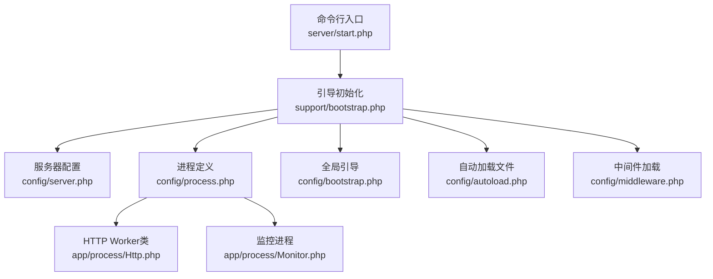
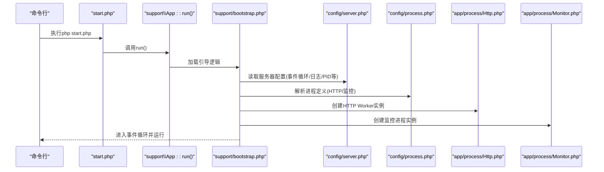
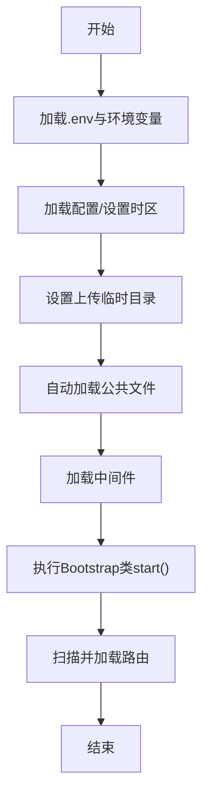
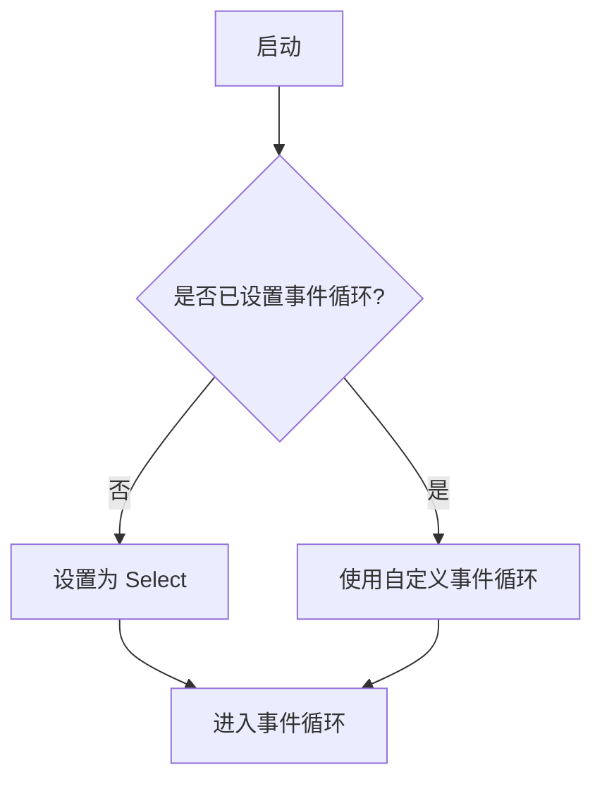
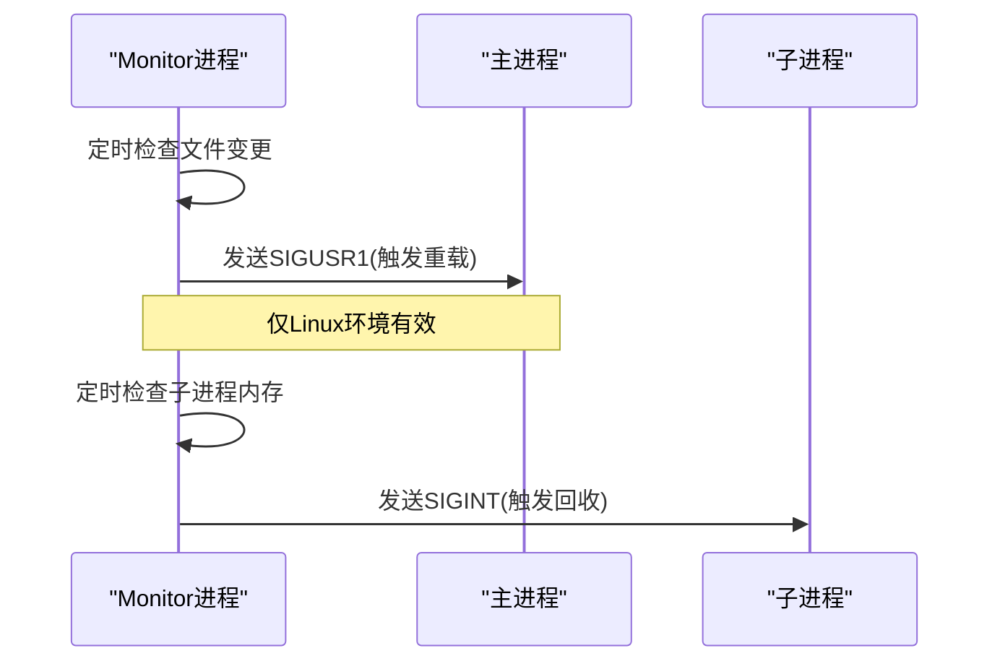
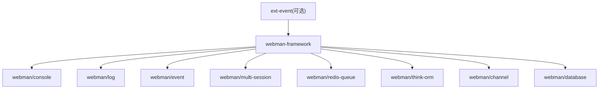

# Webman框架集成

<cite>
**本文引用的文件**   
- [start.php](file://server/start.php)
- [support/bootstrap.php](file://server/support/bootstrap.php)
- [config/server.php](file://server/config/server.php)
- [config/process.php](file://server/config/process.php)
- [app/process/Http.php](file://server/app/process/Http.php)
- [app/process/Monitor.php](file://server/app/process/Monitor.php)
- [config/bootstrap.php](file://server/config/bootstrap.php)
- [config/autoload.php](file://server/config/autoload.php)
- [config/middleware.php](file://server/config/middleware.php)
- [composer.json](file://server/composer.json)
</cite>

## 目录
1. [简介](#简介)
2. [项目结构](#项目结构)
3. [核心组件](#核心组件)
4. [架构总览](#架构总览)
5. [详细组件分析](#详细组件分析)
6. [依赖关系分析](#依赖关系分析)
7. [性能与调优](#性能与调优)
8. [故障排查指南](#故障排查指南)
9. [结论](#结论)
10. [附录：配置项速查](#附录配置项速查)

## 简介
本文件面向积木云AI创作平台的后端服务，基于Webman（Workerman）构建高性能异步HTTP服务器。文档聚焦以下目标：
- 进程模型与Worker进程管理
- 事件循环机制与选择策略
- 应用启动流程、服务注册机制、进程间通信
- 服务器配置选项、进程池调优、内存管理策略
- 配置文件示例与性能优化建议
- 如何扩展Webman核心功能

## 项目结构
本项目采用Webman标准结构，关键入口与配置如下：
- 命令行入口：server/start.php
- 引导初始化：server/support/bootstrap.php
- 服务器参数：server/config/server.php
- 自定义进程：server/config/process.php 与 app/process/*
- 插件与中间件加载：server/config/bootstrap.php、server/config/middleware.php、server/config/autoload.php
- 依赖声明：server/composer.json



图示来源
- [start.php:1-6](file://server/start.php#L1-L6)
- [support/bootstrap.php:1-147](file://server/support/bootstrap.php#L1-L147)
- [config/server.php:1-12](file://server/config/server.php#L1-L12)
- [config/process.php:1-43](file://server/config/process.php#L1-L43)
- [app/process/Http.php:1-10](file://server/app/process/Http.php#L1-L10)
- [app/process/Monitor.php:1-306](file://server/app/process/Monitor.php#L1-L306)
- [config/bootstrap.php:1-19](file://server/config/bootstrap.php#L1-L19)
- [config/autoload.php:1-22](file://server/config/autoload.php#L1-L22)
- [config/middleware.php:1-12](file://server/config/middleware.php#L1-L12)

章节来源
- [start.php:1-6](file://server/start.php#L1-L6)
- [support/bootstrap.php:1-147](file://server/support/bootstrap.php#L1-L147)
- [config/server.php:1-12](file://server/config/server.php#L1-L12)
- [config/process.php:1-43](file://server/config/process.php#L1-L43)
- [app/process/Http.php:1-10](file://server/app/process/Http.php#L1-L10)
- [app/process/Monitor.php:1-306](file://server/app/process/Monitor.php#L1-L306)
- [config/bootstrap.php:1-19](file://server/config/bootstrap.php#L1-L19)
- [config/autoload.php:1-22](file://server/config/autoload.php#L1-L22)
- [config/middleware.php:1-12](file://server/config/middleware.php#L1-L12)

## 核心组件
- 启动器：通过命令行入口调用支持层App::run()，进入Webman控制台与应用生命周期。
- 引导器：统一完成错误处理、时区、上传临时目录、自动加载文件、中间件、Bootstrap类、路由扫描等。
- HTTP Worker：继承Webman\App作为HTTP服务进程，承载请求处理。
- 监控进程：监听代码变更与内存使用，触发重载或回收子进程。
- 服务器配置：事件循环、PID/状态/日志输出路径、最大包大小等。
- 进程定义：声明monitor进程及可重载范围、扩展名、平台特性开关。

章节来源
- [start.php:1-6](file://server/start.php#L1-L6)
- [support/bootstrap.php:1-147](file://server/support/bootstrap.php#L1-L147)
- [app/process/Http.php:1-10](file://server/app/process/Http.php#L1-L10)
- [app/process/Monitor.php:1-306](file://server/app/process/Monitor.php#L1-L306)
- [config/server.php:1-12](file://server/config/server.php#L1-L12)
- [config/process.php:1-43](file://server/config/process.php#L1-L43)

## 架构总览
下图展示了从命令行到HTTP请求处理的完整链路，包括进程模型与事件循环。



图示来源
- [start.php:1-6](file://server/start.php#L1-L6)
- [support/bootstrap.php:1-147](file://server/support/bootstrap.php#L1-L147)
- [config/server.php:1-12](file://server/config/server.php#L1-L12)
- [config/process.php:1-43](file://server/config/process.php#L1-L43)
- [app/process/Http.php:1-10](file://server/app/process/Http.php#L1-L10)
- [app/process/Monitor.php:1-306](file://server/app/process/Monitor.php#L1-L306)

## 详细组件分析

### 启动流程与引导阶段
- 命令行入口加载Composer自动加载器后，调用支持层App::run()进入Webman控制台。
- 引导阶段完成：
  - 设置默认事件循环为Select（若未显式指定）。
  - 安装错误处理器，将PHP错误转为异常。
  - 加载.env环境变量（存在且可用时）。
  - 清理并加载配置，设置时区。
  - 设置上传临时目录，避免警告。
  - 按autoload.files顺序include公共函数与基础类。
  - 加载中间件（含静态资源中间件）。
  - 遍历config/bootstrap.php中注册的Bootstrap类，依次调用start($worker)。
  - 扫描plugin/*/config与根config，加载路由。



图示来源
- [support/bootstrap.php:1-147](file://server/support/bootstrap.php#L1-L147)
- [config/bootstrap.php:1-19](file://server/config/bootstrap.php#L1-L19)
- [config/autoload.php:1-22](file://server/config/autoload.php#L1-L22)
- [config/middleware.php:1-12](file://server/config/middleware.php#L1-L12)

章节来源
- [support/bootstrap.php:1-147](file://server/support/bootstrap.php#L1-L147)
- [config/bootstrap.php:1-19](file://server/config/bootstrap.php#L1-L19)
- [config/autoload.php:1-22](file://server/config/autoload.php#L1-L22)
- [config/middleware.php:1-12](file://server/config/middleware.php#L1-L12)

### 进程模型与Worker管理
- HTTP Worker：app/process/Http.php继承Webman\App，作为HTTP服务进程。
- 监控进程：app/process/Monitor.php负责：
  - 文件变更检测（定时轮询），在Linux下向主进程发送信号以触发重载。
  - 内存监控（定时检查子进程RSS，超过阈值则发送SIGINT进行回收）。
  - 提供暂停/恢复监控的锁文件机制。
- 进程定义：config/process.php声明monitor进程及其监听目录、扩展名、平台能力开关。

```mermaid
classDiagram
class Http {
+继承 Webman\\App
+处理HTTP请求
}
class Monitor {
+__construct(monitorDir, monitorExtensions, options)
+checkAllFilesChange() bool
+checkMemory(memoryLimit) void
+pause()/resume()/isPaused()
-getMasterPid() int
-getMemoryLimit(limit) int
}
class ProcessConfig {
+monitor : { handler, reloadable, constructor }
}
Http <|-- Webman_App : "继承"
ProcessConfig --> Monitor : "实例化"
```

图示来源
- [app/process/Http.php:1-10](file://server/app/process/Http.php#L1-L10)
- [app/process/Monitor.php:1-306](file://server/app/process/Monitor.php#L1-L306)
- [config/process.php:1-43](file://server/config/process.php#L1-L43)

章节来源
- [app/process/Http.php:1-10](file://server/app/process/Http.php#L1-L10)
- [app/process/Monitor.php:1-306](file://server/app/process/Monitor.php#L1-L306)
- [config/process.php:1-43](file://server/config/process.php#L1-L43)

### 事件循环机制
- 默认事件循环：若未显式配置event_loop，引导阶段将默认设置为Select。
- 可选高性能扩展：composer.json建议安装ext-event以获得更好性能。
- 服务器配置中的event_loop字段可用于覆盖默认实现。



图示来源
- [support/bootstrap.php:1-147](file://server/support/bootstrap.php#L1-L147)
- [config/server.php:1-12](file://server/config/server.php#L1-L12)
- [composer.json:69-71](file://server/composer.json#L69-L71)

章节来源
- [support/bootstrap.php:1-147](file://server/support/bootstrap.php#L1-L147)
- [config/server.php:1-12](file://server/config/server.php#L1-L12)
- [composer.json:69-71](file://server/composer.json#L69-L71)

### 服务注册与中间件
- 自动加载文件：config/autoload.php集中引入公共函数与基础类。
- Bootstrap类：config/bootstrap.php列出需要在全局启动时执行的类，由引导阶段依次调用start($worker)。
- 中间件：config/middleware.php定义全局中间件链，包含插件中间件与静态资源中间件。

章节来源
- [config/autoload.php:1-22](file://server/config/autoload.php#L1-L22)
- [config/bootstrap.php:1-19](file://server/config/bootstrap.php#L1-L19)
- [config/middleware.php:1-12](file://server/config/middleware.php#L1-L12)

### 进程间通信与重载机制
- 文件变更触发重载：Monitor进程检测到受控目录下的文件修改后，在Linux环境下向主进程发送SIGUSR1信号，触发热重载。
- 内存超限回收：Monitor周期检查子进程RSS，超过阈值则发送SIGINT，促使子进程退出并由主进程重启。
- 监控开关：根据运行模式与操作系统特性，可选择启用文件监控与内存监控。



图示来源
- [app/process/Monitor.php:1-306](file://server/app/process/Monitor.php#L1-L306)
- [config/process.php:1-43](file://server/config/process.php#L1-L43)

章节来源
- [app/process/Monitor.php:1-306](file://server/app/process/Monitor.php#L1-L306)
- [config/process.php:1-43](file://server/config/process.php#L1-L43)

## 依赖关系分析
- 运行时依赖：workerman/webman-framework为核心，webman/console用于命令行入口，webman/log、webman/event等为生态组件。
- 可选高性能扩展：ext-event被建议以提升事件循环性能。
- 第三方库：JWT、验证码、缓存、ORM、队列、工作流、消息、存储SDK等。



图示来源
- [composer.json:31-68](file://server/composer.json#L31-L68)
- [composer.json:69-71](file://server/composer.json#L69-L71)

章节来源
- [composer.json:31-68](file://server/composer.json#L31-L68)
- [composer.json:69-71](file://server/composer.json#L69-L71)

## 性能与调优
- 事件循环选择
  - 默认Select适用于通用场景；生产环境建议安装ext-event以获得更高吞吐与更低延迟。
  - 可通过config/server.php的event_loop字段指定具体实现。
- 进程模型与数量
  - HTTP Worker数量应与CPU核数匹配，避免过多上下文切换；I/O密集型可适当增加。
  - 监控进程独立于HTTP Worker，避免阻塞业务处理。
- 内存管理
  - 利用Monitor的内存监控能力，设置合理阈值，防止长驻进程内存泄漏累积。
  - 结合PHP memory_limit与Monitor阈值，确保子进程在超限时被回收。
- 网络与包大小
  - 调整max_package_size以适应大文件上传或大响应体，注意与Nginx/反向代理限制保持一致。
- 日志与IO
  - 合理配置stdout_file与log_file路径，避免磁盘IO瓶颈；生产环境建议使用外部日志收集。
- 中间件与引导开销
  - 减少不必要的自动加载与全局初始化，按需加载插件与中间件，缩短启动时间。

[本节为通用指导，不直接分析具体文件]

## 故障排查指南
- 无法重载
  - 确认exec未被disable_functions禁用；否则文件监控会关闭。
  - 仅在Linux下支持向主进程发送信号触发重载。
- 监控无效
  - 检查monitorDir与monitorExtensions是否正确；确认平台特性开关enable_file_monitor与enable_memory_monitor。
- 内存未回收
  - 确认memory_limit配置与Monitor阈值；检查/proc路径可读性与子进程列表获取是否正常。
- 端口占用或启动失败
  - 检查pid_file与status_file路径权限；确认端口未被占用。
- 日志缺失
  - 检查stdout_file与log_file目录是否存在且可写。

章节来源
- [app/process/Monitor.php:1-306](file://server/app/process/Monitor.php#L1-L306)
- [config/server.php:1-12](file://server/config/server.php#L1-L12)

## 结论
本项目基于Webman构建了高可用的异步HTTP服务，具备完善的进程模型、事件循环与监控能力。通过合理的配置与调优，可在积木云AI创作平台的高并发场景中提供稳定、高效的API服务能力。建议在部署前明确事件循环、进程数量、内存阈值与日志策略，并在开发期充分利用监控进程的热重载能力提升迭代效率。

[本节为总结性内容，不直接分析具体文件]

## 附录：配置项速查
- 服务器配置（config/server.php）
  - event_loop：事件循环实现类名（留空表示使用默认）
  - stop_timeout：优雅停止超时秒数
  - pid_file：主进程PID文件路径
  - status_file：主进程状态文件路径
  - stdout_file：标准输出日志路径
  - log_file：Workerman内部日志路径
  - max_package_size：最大数据包大小（字节）
- 进程定义（config/process.php）
  - monitor.handler：监控进程处理器类
  - monitor.reloadable：是否允许重载
  - monitor.constructor.monitorDir：监控目录数组
  - monitor.constructor.monitorExtensions：监控扩展名数组
  - monitor.constructor.options.enable_file_monitor：是否启用文件监控
  - monitor.constructor.options.enable_memory_monitor：是否启用内存监控
- 引导与自动加载
  - config/bootstrap.php：全局Bootstrap类列表
  - config/autoload.php：公共文件自动加载列表
  - config/middleware.php：全局中间件链

章节来源
- [config/server.php:1-12](file://server/config/server.php#L1-L12)
- [config/process.php:1-43](file://server/config/process.php#L1-L43)
- [config/bootstrap.php:1-19](file://server/config/bootstrap.php#L1-L19)
- [config/autoload.php:1-22](file://server/config/autoload.php#L1-L22)
- [config/middleware.php:1-12](file://server/config/middleware.php#L1-L12)