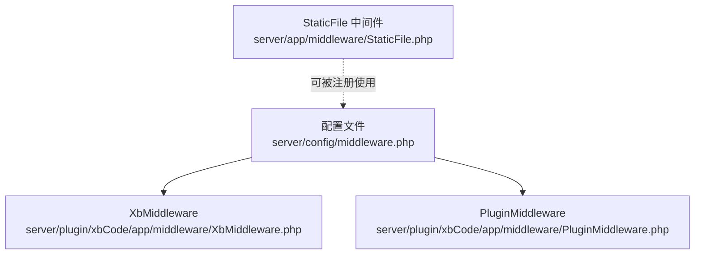
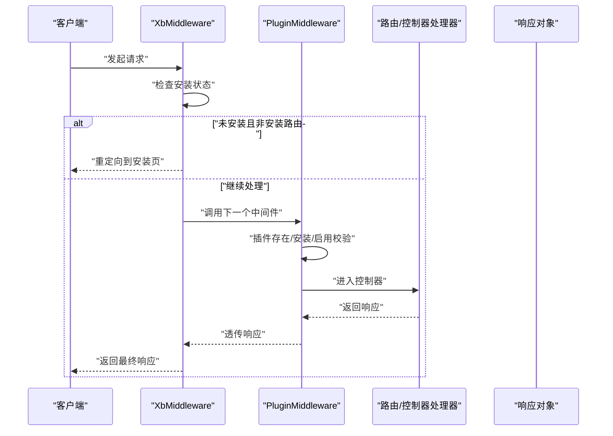
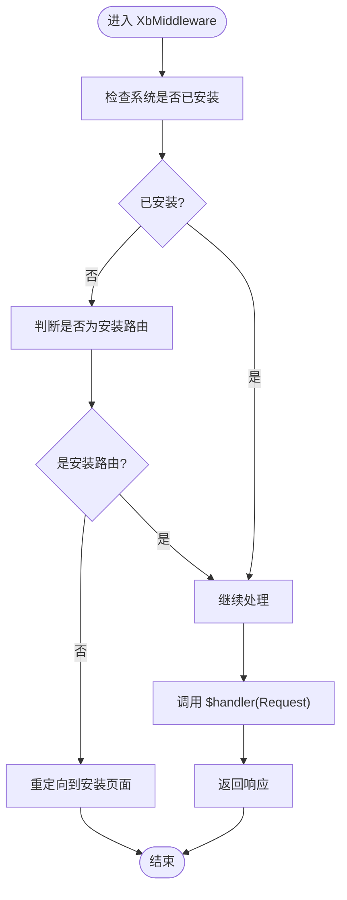
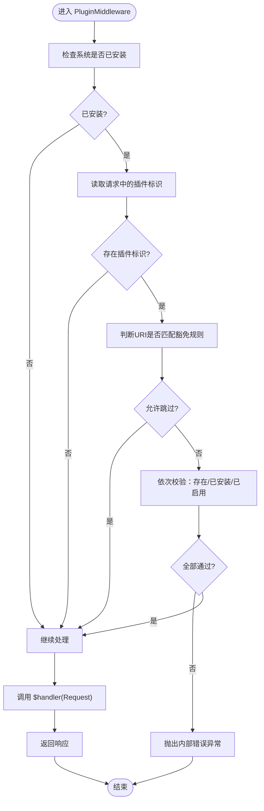
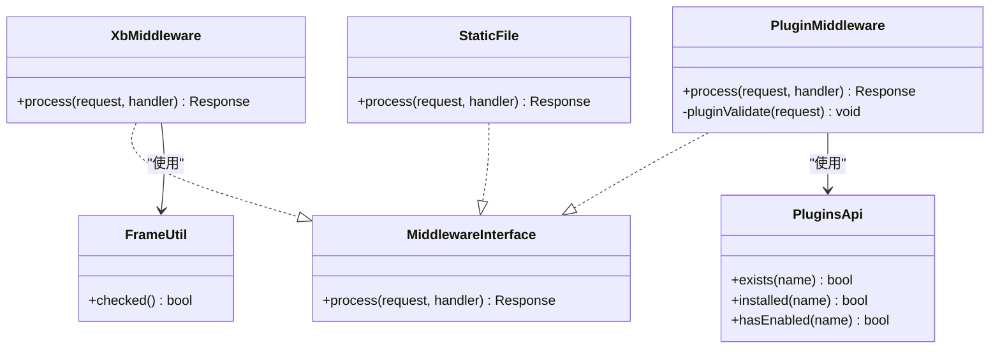

# 中间件系统

<cite>
**本文引用的文件**   
- [server/config/middleware.php](file://server/config/middleware.php)
- [server/app/middleware/StaticFile.php](file://server/app/middleware/StaticFile.php)
- [server/plugin/xbCode/app/middleware/XbMiddleware.php](file://server/plugin/xbCode/app/middleware/XbMiddleware.php)
- [server/plugin/xbCode/app/middleware/PluginMiddleware.php](file://server/plugin/xbCode/app/middleware/PluginMiddleware.php)
</cite>

## 目录
1. [简介](#简介)
2. [项目结构](#项目结构)
3. [核心组件](#核心组件)
4. [架构总览](#架构总览)
5. [详细组件分析](#详细组件分析)
6. [依赖关系分析](#依赖关系分析)
7. [性能考虑](#性能考虑)
8. [故障排查指南](#故障排查指南)
9. [结论](#结论)
10. [附录](#附录)

## 简介
本文件面向积木云AI创作平台的后端中间件系统，聚焦以下目标：
- 解释请求处理管道机制与中间件执行顺序
- 说明上下文传递方式（Request/Response）
- 梳理内置中间件能力（静态文件服务、安装检测、插件校验等）
- 给出自定义中间件开发规范与最佳实践
- 描述中间件生命周期、错误处理机制与性能监控集成建议
- 提供在中间件中访问请求对象和响应对象的示例路径

## 项目结构
中间件相关代码主要分布在应用层与插件层：
- 全局中间件注册位于配置中心
- 应用级中间件用于通用能力（如静态资源安全拦截）
- 插件级中间件用于框架与插件生态的校验与治理

图表来源
- [server/config/middleware.php:1-12](file://server/config/middleware.php#L1-L12)
- [server/plugin/xbCode/app/middleware/XbMiddleware.php:1-43](file://server/plugin/xbCode/app/middleware/XbMiddleware.php#L1-L43)
- [server/plugin/xbCode/app/middleware/PluginMiddleware.php:1-79](file://server/plugin/xbCode/app/middleware/PluginMiddleware.php#L1-L79)
- [server/app/middleware/StaticFile.php:1-43](file://server/app/middleware/StaticFile.php#L1-L43)

章节来源
- [server/config/middleware.php:1-12](file://server/config/middleware.php#L1-L12)

## 核心组件
- 全局中间件注册表
  - 通过配置返回中间件类名列表，决定请求进入控制器前的处理链。
- 安装检测中间件
  - 负责检查系统是否完成安装，未安装时重定向至安装入口。
- 插件校验中间件
  - 对带插件标识的请求进行存在性、已安装、已启用状态校验。
- 静态文件中间件
  - 提供基础的安全策略（禁止访问隐藏文件），并可扩展跨域头设置等。

章节来源
- [server/config/middleware.php:1-12](file://server/config/middleware.php#L1-L12)
- [server/plugin/xbCode/app/middleware/XbMiddleware.php:1-43](file://server/plugin/xbCode/app/middleware/XbMiddleware.php#L1-L43)
- [server/plugin/xbCode/app/middleware/PluginMiddleware.php:1-79](file://server/plugin/xbCode/app/middleware/PluginMiddleware.php#L1-L79)
- [server/app/middleware/StaticFile.php:1-43](file://server/app/middleware/StaticFile.php#L1-L43)

## 架构总览
Webman 的中间件采用“洋葱模型”，请求从外层进入，逐层穿越到控制器，再按相反顺序返回响应。当前项目中，全局中间件注册了 XbMiddleware 与 PluginMiddleware；StaticFile 作为应用级中间件可按需加入注册表。

图表来源
- [server/plugin/xbCode/app/middleware/XbMiddleware.php:1-43](file://server/plugin/xbCode/app/middleware/XbMiddleware.php#L1-L43)
- [server/plugin/xbCode/app/middleware/PluginMiddleware.php:1-79](file://server/plugin/xbCode/app/middleware/PluginMiddleware.php#L1-L79)

## 详细组件分析

### 全局中间件注册表
- 作用
  - 定义全局生效的中间件类名数组，控制请求在进入业务逻辑前必须经过的处理步骤。
- 关键点
  - 返回值为数组，元素为中间件类的完全限定名。
  - 若初始化异常则回退为空数组，保证服务可用性。

章节来源
- [server/config/middleware.php:1-12](file://server/config/middleware.php#L1-L12)

### 安装检测中间件（XbMiddleware）
- 职责
  - 在未安装状态下，将除安装路由外的所有请求重定向至安装流程。
- 执行时机
  - 在请求进入后续中间件与控制器之前执行。
- 上下文访问
  - 通过 Request 对象获取路径信息，结合工具方法判断安装状态。
- 返回值
  - 不满足条件时返回重定向响应；否则调用 $handler($request) 继续处理并返回响应。

图表来源
- [server/plugin/xbCode/app/middleware/XbMiddleware.php:1-43](file://server/plugin/xbCode/app/middleware/XbMiddleware.php#L1-L43)

章节来源
- [server/plugin/xbCode/app/middleware/XbMiddleware.php:1-43](file://server/plugin/xbCode/app/middleware/XbMiddleware.php#L1-L43)

### 插件校验中间件（PluginMiddleware）
- 职责
  - 针对携带插件标识的请求，校验插件是否存在、是否已安装、是否已启用。
- 特殊豁免
  - 当请求 URI 包含特定预览资源后缀时跳过校验。
- 异常处理
  - 校验失败抛出内部服务器错误异常，由上层统一捕获并返回错误响应。
- 执行时机
  - 在安装检测之后，进入控制器之前。

图表来源
- [server/plugin/xbCode/app/middleware/PluginMiddleware.php:1-79](file://server/plugin/xbCode/app/middleware/PluginMiddleware.php#L1-L79)

章节来源
- [server/plugin/xbCode/app/middleware/PluginMiddleware.php:1-79](file://server/plugin/xbCode/app/middleware/PluginMiddleware.php#L1-L79)

### 静态文件中间件（StaticFile）
- 职责
  - 阻止访问以点号开头的路径，防止敏感文件泄露；预留跨域响应头设置位置。
- 适用场景
  - 作为全局或路由级中间件，增强静态资源访问安全性。
- 扩展点
  - 可在返回响应前后注入通用响应头、日志埋点、性能计时等。

章节来源
- [server/app/middleware/StaticFile.php:1-43](file://server/app/middleware/StaticFile.php#L1-L43)

### 自定义中间件开发规范
- 接口约定
  - 实现 Webman 中间件接口，提供 process(Request, callable): Response 方法。
- 执行顺序
  - 先执行前置逻辑，再调用 $handler($request)，最后对响应进行后置处理。
- 上下文访问
  - 通过 Request 对象访问路径、URI、参数、头部等信息。
  - 通过 Response 对象设置状态码、头部、内容等。
- 短路返回
  - 若无需继续处理（如鉴权失败、重定向），直接返回 Response 中断管道。
- 异常处理
  - 业务异常应抛出，交由全局异常处理器统一格式化输出。
- 注册方式
  - 在全局中间件配置中追加类名，或在路由/控制器级别按需挂载。

章节来源
- [server/config/middleware.php:1-12](file://server/config/middleware.php#L1-L12)
- [server/plugin/xbCode/app/middleware/XbMiddleware.php:1-43](file://server/plugin/xbCode/app/middleware/XbMiddleware.php#L1-L43)
- [server/plugin/xbCode/app/middleware/PluginMiddleware.php:1-79](file://server/plugin/xbCode/app/middleware/PluginMiddleware.php#L1-L79)
- [server/app/middleware/StaticFile.php:1-43](file://server/app/middleware/StaticFile.php#L1-L43)

## 依赖关系分析
- 中间件与配置
  - 配置文件中声明的中间件类将被加载并按顺序执行。
- 中间件与工具/服务
  - 安装检测与插件校验依赖工具类与 API 服务，用于读取系统状态与插件元数据。
- 中间件与异常
  - 插件校验失败抛出内部错误异常，由全局异常处理器接管。

图表来源
- [server/plugin/xbCode/app/middleware/XbMiddleware.php:1-43](file://server/plugin/xbCode/app/middleware/XbMiddleware.php#L1-L43)
- [server/plugin/xbCode/app/middleware/PluginMiddleware.php:1-79](file://server/plugin/xbCode/app/middleware/PluginMiddleware.php#L1-L79)
- [server/app/middleware/StaticFile.php:1-43](file://server/app/middleware/StaticFile.php#L1-L43)

章节来源
- [server/config/middleware.php:1-12](file://server/config/middleware.php#L1-L12)
- [server/plugin/xbCode/app/middleware/XbMiddleware.php:1-43](file://server/plugin/xbCode/app/middleware/XbMiddleware.php#L1-L43)
- [server/plugin/xbCode/app/middleware/PluginMiddleware.php:1-79](file://server/plugin/xbCode/app/middleware/PluginMiddleware.php#L1-L79)
- [server/app/middleware/StaticFile.php:1-43](file://server/app/middleware/StaticFile.php#L1-L43)

## 性能考虑
- 中间件顺序优化
  - 将轻量、快速失败的中间件置于前端（如安装检测、白名单放行），减少不必要的 I/O。
- 避免阻塞操作
  - 不要在中间件中进行耗时同步网络请求或复杂计算；必要时异步化或缓存结果。
- 响应头与序列化
  - 仅在必要时修改响应头或序列化数据，避免重复编解码。
- 监控埋点
  - 在中间件的前后记录时间戳，统计各阶段耗时，便于定位瓶颈。

[本节为通用指导，不涉及具体文件分析]

## 故障排查指南
- 常见症状
  - 未安装状态下访问任意页面均被重定向至安装页。
  - 插件相关接口报“插件不存在/未安装/未启用”。
  - 访问隐藏文件路径返回禁止访问。
- 排查要点
  - 确认全局中间件是否正确注册。
  - 检查插件标识是否在请求中正确传递。
  - 核对插件状态（存在、安装、启用）。
  - 查看异常堆栈与日志，定位抛出的内部错误。

章节来源
- [server/plugin/xbCode/app/middleware/XbMiddleware.php:1-43](file://server/plugin/xbCode/app/middleware/XbMiddleware.php#L1-L43)
- [server/plugin/xbCode/app/middleware/PluginMiddleware.php:1-79](file://server/plugin/xbCode/app/middleware/PluginMiddleware.php#L1-L79)
- [server/app/middleware/StaticFile.php:1-43](file://server/app/middleware/StaticFile.php#L1-L43)

## 结论
本项目基于 Webman 的中间件机制构建了清晰的请求处理管道：安装检测与插件校验作为关键前置环节，保障系统可用性与插件生态安全；静态文件中间件提供基础安全防护。通过统一的中间件接口与配置化注册，开发者可以便捷地扩展鉴权、限流、审计、监控等横切能力。

[本节为总结性内容，不涉及具体文件分析]

## 附录
- 中间件生命周期
  - 进入：解析请求 -> 按注册顺序执行每个中间件的前置逻辑
  - 穿越：调用 $handler($request) 进入下一层
  - 返回：按逆序执行后置逻辑，组装最终响应
- 在中间件中访问请求与响应
  - 访问请求：通过 process 方法的第一个参数 Request 对象
  - 构造响应：通过 response()/redirect() 等工厂函数或直接 new Response
  - 修改响应：在调用 $handler($request) 后对返回的 Response 对象进行设置
- 参考实现路径
  - 安装检测：[server/plugin/xbCode/app/middleware/XbMiddleware.php:1-43](file://server/plugin/xbCode/app/middleware/XbMiddleware.php#L1-L43)
  - 插件校验：[server/plugin/xbCode/app/middleware/PluginMiddleware.php:1-79](file://server/plugin/xbCode/app/middleware/PluginMiddleware.php#L1-L79)
  - 静态文件防护：[server/app/middleware/StaticFile.php:1-43](file://server/app/middleware/StaticFile.php#L1-L43)
  - 全局注册：[server/config/middleware.php:1-12](file://server/config/middleware.php#L1-L12)