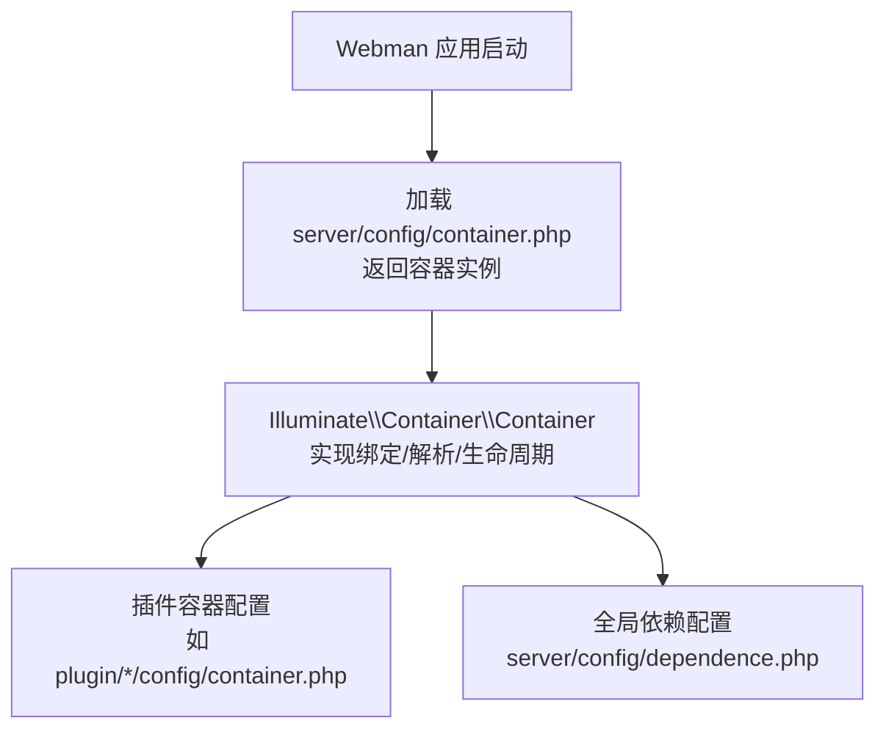
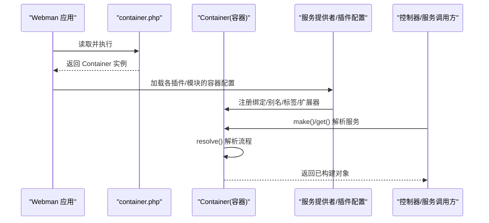
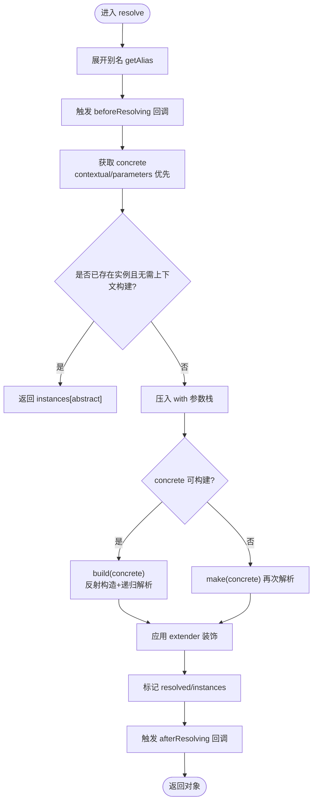
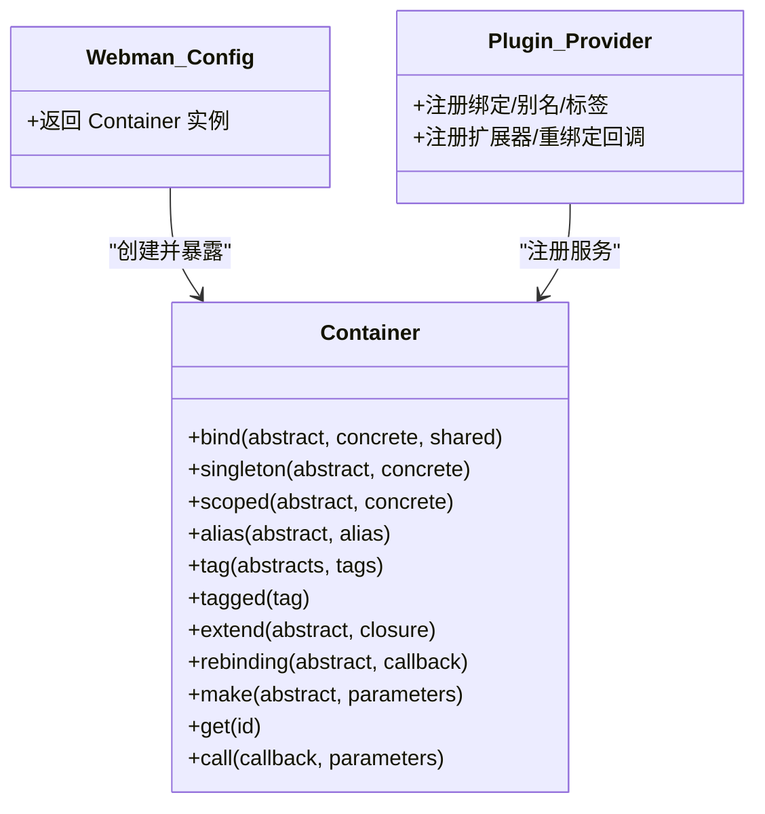

# 依赖注入容器

<cite>
**本文引用的文件**   
- [server/config/container.php](file://server/config/container.php)
- [server/config/dependence.php](file://server/config/dependence.php)
- [vendor/illuminate/container/Container.php](file://vendor/illuminate/container/Container.php)
</cite>

## 目录
1. [简介](#简介)
2. [项目结构](#项目结构)
3. [核心组件](#核心组件)
4. [架构总览](#架构总览)
5. [详细组件分析](#详细组件分析)
6. [依赖关系分析](#依赖关系分析)
7. [性能考量](#性能考量)
8. [故障排查指南](#故障排查指南)
9. [结论](#结论)
10. [附录](#附录)

## 简介
本文件面向“积木云AI创作平台”的后端服务，聚焦于依赖注入容器的注册机制、实例化策略与生命周期管理。系统基于 Webman 的容器配置入口，结合 Illuminate Container 实现服务绑定、解析、单例/作用域实例、工厂模式与服务提供者扩展点等能力。文档将帮助开发者理解：
- 如何在容器中注册服务（绑定、别名、标签）
- 如何解析服务（自动装配、上下文绑定、参数覆盖）
- 单例与作用域的生命周期差异
- 循环依赖的检测与处理
- 版本管理与扩展点（extend、rebinding、tag/tagged）

## 项目结构
后端采用 Webman 框架，容器由配置文件引入并返回一个全局可用的容器实例；业务插件通过各自的 container.php 或依赖配置文件进行服务注册。Illuminate Container 提供完整的 DI 能力，包括绑定、解析、事件钩子、上下文绑定、标签与扩展器等。

图表来源
- [server/config/container.php:1-15](file://server/config/container.php#L1-L15)
- [server/config/dependence.php:1-15](file://server/config/dependence.php#L1-L15)
- [vendor/illuminate/container/Container.php:18-116](file://vendor/illuminate/container/Container.php#L18-L116)

章节来源
- [server/config/container.php:1-15](file://server/config/container.php#L1-L15)
- [server/config/dependence.php:1-15](file://server/config/dependence.php#L1-L15)

## 核心组件
- 容器实例：由 Webman 在启动时创建并暴露为全局可用，后续所有服务解析均基于该实例。
- 绑定与解析：支持字符串类名、闭包工厂、上下文绑定、别名与标签。
- 生命周期：
  - 单例（singleton）：进程内唯一实例，首次解析后缓存。
  - 作用域（scoped）：按请求/任务范围共享，结束后释放。
  - 普通绑定（bind）：每次解析新建实例。
- 扩展点：extend、rebinding、before/after resolving 回调，便于装饰器与版本切换。

章节来源
- [vendor/illuminate/container/Container.php:240-432](file://vendor/illuminate/container/Container.php#L240-L432)
- [vendor/illuminate/container/Container.php:443-613](file://vendor/illuminate/container/Container.php#L443-L613)

## 架构总览
下图展示从应用启动到服务解析的关键路径，以及容器内部状态流转。

图表来源
- [server/config/container.php:1-15](file://server/config/container.php#L1-L15)
- [vendor/illuminate/container/Container.php:729-800](file://vendor/illuminate/container/Container.php#L729-L800)

## 详细组件分析

### 服务注册机制（绑定、别名、标签）
- 绑定（bind/singleton/scoped/bindIf/singletonIf/scopedIf）
  - bind：非共享绑定，默认每次解析新建实例。
  - singleton：单例绑定，首次解析后缓存至 instances。
  - scoped：作用域绑定，标记为 shared 并在当前作用域内复用。
  - If 系列：仅在未绑定时注册，避免覆盖。
- 别名（alias/isAlias/getAlias）
  - 为抽象类型设置别名，解析时先展开别名再查找具体实现。
- 标签（tag/tagged）
  - 对多个抽象类型打标签，批量解析集合型服务。

章节来源
- [vendor/illuminate/container/Container.php:240-432](file://vendor/illuminate/container/Container.php#L240-L432)
- [vendor/illuminate/container/Container.php:509-567](file://vendor/illuminate/container/Container.php#L509-L567)

### 实例化策略与自动装配
- 自动装配（反射构造）
  - 当 concrete 为类名且无显式闭包时，容器使用反射分析构造函数参数，递归解析依赖。
- 上下文绑定（when/addContextualBinding/contextual）
  - 针对具体类的某个接口注入不同实现，解决同一接口在不同上下文的差异化需求。
- 参数覆盖（with/buildStack）
  - 通过 with 传入额外参数，buildStack 用于检测构建过程中的循环依赖。

章节来源
- [vendor/illuminate/container/Container.php:353-363](file://vendor/illuminate/container/Container.php#L353-L363)
- [vendor/illuminate/container/Container.php:648-693](file://vendor/illuminate/container/Container.php#L648-L693)

### 生命周期管理（单例、作用域、普通）
- 单例
  - 首次解析后将实例存入 instances，后续直接返回。
  - instance 可手动注入已有实例，并触发 rebinding 回调。
- 作用域
  - 标记为 shared 并在当前作用域内复用，适合请求级/任务级上下文。
- 普通绑定
  - 每次解析都走 build 流程，适合无状态或需要隔离状态的组件。

章节来源
- [vendor/illuminate/container/Container.php:387-432](file://vendor/illuminate/container/Container.php#L387-L432)
- [vendor/illuminate/container/Container.php:467-485](file://vendor/illuminate/container/Container.php#L467-L485)

### 服务提供者模式的实现
- 通过各插件的 config/container.php 或依赖配置文件集中注册服务，形成“服务提供者”。
- 在应用启动阶段统一加载这些配置，完成绑定、别名、标签与扩展器的初始化。
- 可通过 extend/rebinding 在服务解析前后进行增强或替换，实现版本切换与装饰器模式。

章节来源
- [server/config/container.php:1-15](file://server/config/container.php#L1-L15)
- [vendor/illuminate/container/Container.php:443-458](file://vendor/illuminate/container/Container.php#L443-L458)
- [vendor/illuminate/container/Container.php:576-613](file://vendor/illuminate/container/Container.php#L576-L613)

### 解析过程与流程图

图表来源
- [vendor/illuminate/container/Container.php:763-800](file://vendor/illuminate/container/Container.php#L763-L800)

### 循环依赖检测与处理
- 检测机制
  - 使用 buildStack 记录正在构建的类，若发现重复则抛出 CircularDependencyException。
- 常见场景
  - A 依赖 B，B 又依赖 A；或更深的环状依赖链。
- 处理建议
  - 重构依赖方向，引入中间层或服务聚合器。
  - 使用懒解析（闭包/工厂）延迟依赖获取。
  - 使用接口解耦与上下文绑定拆分实现。

章节来源
- [vendor/illuminate/container/Container.php:648-669](file://vendor/illuminate/container/Container.php#L648-L669)
- [vendor/illuminate/container/Container.php:763-772](file://vendor/illuminate/container/Container.php#L763-L772)

### 服务版本管理与扩展点
- 版本切换
  - 使用 alias 将抽象指向不同实现类，或在运行时通过 rebinding 动态替换。
- 装饰器/增强
  - 使用 extend 包装现有服务，增加日志、缓存、权限校验等横切逻辑。
- 事件钩子
  - beforeResolving/resolving/afterResolving 可在解析前后插入自定义逻辑。

章节来源
- [vendor/illuminate/container/Container.php:558-567](file://vendor/illuminate/container/Container.php#L558-L567)
- [vendor/illuminate/container/Container.php:576-613](file://vendor/illuminate/container/Container.php#L576-L613)
- [vendor/illuminate/container/Container.php:443-458](file://vendor/illuminate/container/Container.php#L443-L458)

## 依赖关系分析
- 耦合与内聚
  - 容器与业务代码松耦合，通过接口/抽象类型解耦；插件通过配置集中注册，提升内聚性。
- 外部依赖
  - 基于 Illuminate Container 的实现，具备成熟的 DI 特性与异常体系。
- 潜在循环依赖
  - 需关注跨插件的服务互相引用，建议使用接口与上下文绑定降低耦合。

图表来源
- [server/config/container.php:1-15](file://server/config/container.php#L1-L15)
- [vendor/illuminate/container/Container.php:240-613](file://vendor/illuminate/container/Container.php#L240-L613)

章节来源
- [server/config/container.php:1-15](file://server/config/container.php#L1-L15)
- [vendor/illuminate/container/Container.php:240-613](file://vendor/illuminate/container/Container.php#L240-L613)

## 性能考量
- 单例优先：对重量级资源（数据库连接、HTTP 客户端、缓存客户端）使用 singleton 减少重复创建开销。
- 作用域合理：对请求级上下文（用户会话、事务上下文）使用 scoped，避免跨请求污染。
- 延迟解析：复杂依赖使用闭包/工厂延迟构建，缩短启动时间。
- 缓存解析结果：容器内部已缓存 instances 与 resolved 状态，避免重复反射与构建。
- 避免过度装饰：过多 extend 会引入额外开销，按需使用。

## 故障排查指南
- 常见问题
  - 未找到绑定：检查 abstract 是否正确、别名是否生效、插件配置是否加载。
  - 循环依赖异常：查看 buildStack 中的类顺序，定位环状依赖并进行重构。
  - 解析失败：确认构造函数参数类型提示完整，必要时使用上下文绑定或参数覆盖。
- 诊断步骤
  - 使用 bound/isAlias/resolved 等方法检查容器状态。
  - 使用 rebinding/extend 在关键服务上打印解析链路。
  - 借助 tagged 批量验证某组服务的可用性。

章节来源
- [vendor/illuminate/container/Container.php:178-238](file://vendor/illuminate/container/Container.php#L178-L238)
- [vendor/illuminate/container/Container.php:648-693](file://vendor/illuminate/container/Container.php#L648-L693)

## 结论
本项目的依赖注入容器以 Webman 的容器配置为入口，依托 Illuminate Container 提供了完善的绑定、解析与生命周期管理能力。通过单例、作用域与工厂模式，配合服务提供者、扩展器与事件钩子，可实现高内聚、低耦合、易扩展的系统架构。建议在开发中遵循接口优先、延迟解析与合理生命周期原则，以获得更好的性能与可维护性。

## 附录
- 常用 API 速查
  - 绑定：bind、singleton、scoped、bindIf、singletonIf、scopedIf
  - 解析：make、get、factory、call、wrap
  - 别名与标签：alias、isAlias、tag、tagged
  - 扩展与事件：extend、rebinding、refresh、before/after resolving
- 示例路径（不含代码内容）
  - 容器初始化入口：[server/config/container.php](file://server/config/container.php)
  - 全局依赖占位配置：[server/config/dependence.php](file://server/config/dependence.php)
  - 容器核心实现：[vendor/illuminate/container/Container.php](file://vendor/illuminate/container/Container.php)