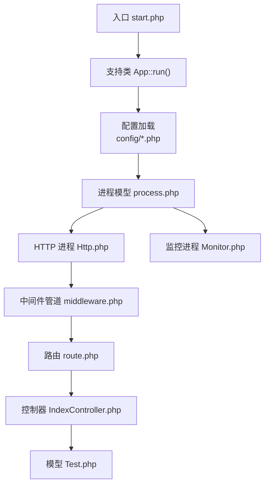
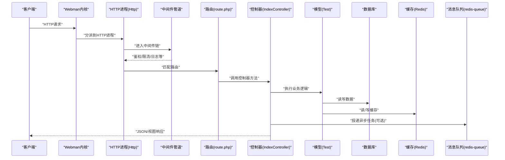
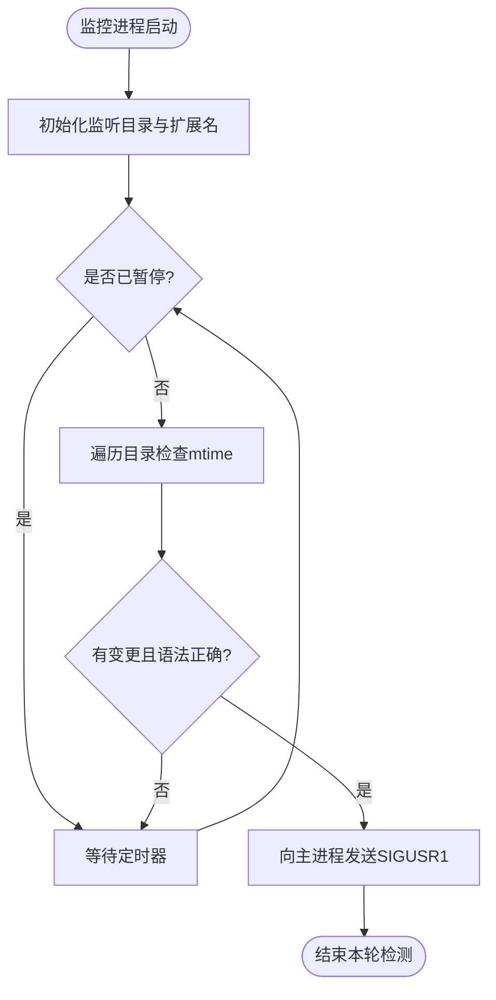
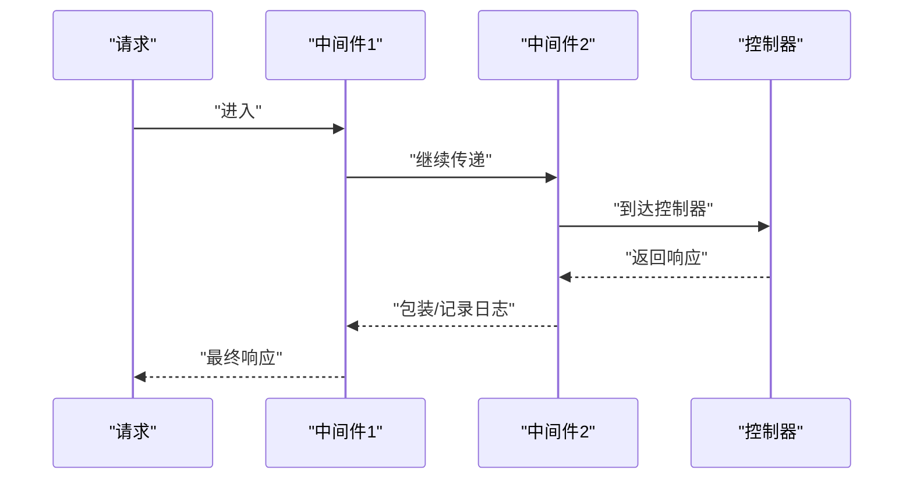
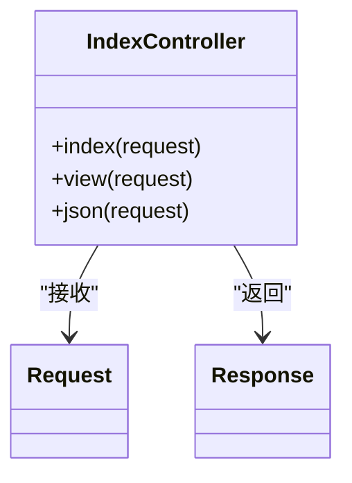
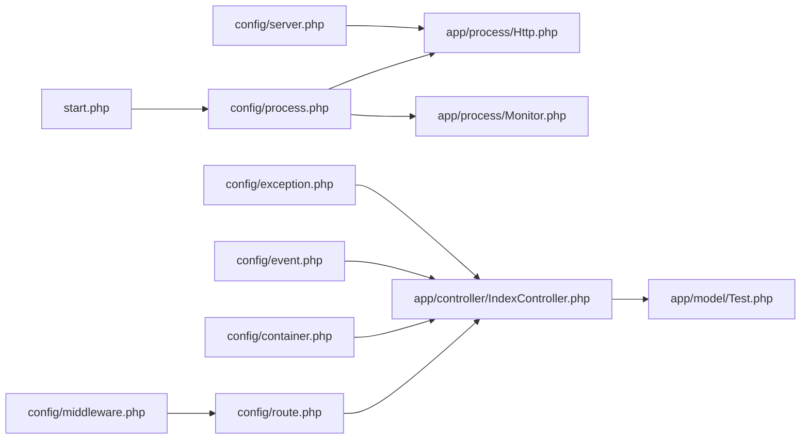

# 后端架构设计

<cite>
**本文引用的文件**   
- [start.php](file://server/start.php)
- [config/server.php](file://server/config/server.php)
- [config/process.php](file://server/config/process.php)
- [app/process/Http.php](file://server/app/process/Http.php)
- [app/process/Monitor.php](file://server/app/process/Monitor.php)
- [config/middleware.php](file://server/config/middleware.php)
- [config/container.php](file://server/config/container.php)
- [config/event.php](file://server/config/event.php)
- [config/exception.php](file://server/config/exception.php)
- [config/route.php](file://server/config/route.php)
- [app/controller/IndexController.php](file://server/app/controller/IndexController.php)
- [app/model/Test.php](file://server/app/model/Test.php)
</cite>

## 目录
1. [简介](#简介)
2. [项目结构](#项目结构)
3. [核心组件](#核心组件)
4. [架构总览](#架构总览)
5. [详细组件分析](#详细组件分析)
6. [依赖关系分析](#依赖关系分析)
7. [性能考量](#性能考量)
8. [故障排查指南](#故障排查指南)
9. [结论](#结论)
10. [附录](#附录)

## 简介
本文件为积木云AI创作平台的后端架构设计文档，围绕基于Webman的高性能异步架构展开，涵盖进程模型、请求处理流程、中间件管道机制、MVC分层、依赖注入容器、服务提供者模式、事件驱动架构、API路由设计、认证授权机制、错误处理策略、日志记录系统与缓存策略，并给出架构图与数据流向图，说明微服务化设计理念与服务间通信机制。

## 项目结构
后端采用Webman框架，入口脚本启动应用，通过配置中心加载服务器参数、进程模型、中间件、异常处理器、事件与路由等。插件体系以“plugin”目录组织，各插件提供独立的路由、控制器、模型、队列、定时任务与设置项，形成可插拔的微服务化能力。

图表来源
- [start.php:1-6](file://server/start.php#L1-L6)
- [config/process.php:17-42](file://server/config/process.php#L17-L42)
- [app/process/Http.php:1-10](file://server/app/process/Http.php#L1-L10)
- [app/process/Monitor.php:1-306](file://server/app/process/Monitor.php#L1-L306)
- [config/middleware.php:1-12](file://server/config/middleware.php#L1-L12)
- [config/route.php:1-22](file://server/config/route.php#L1-L22)
- [app/controller/IndexController.php:1-43](file://server/app/controller/IndexController.php#L1-L43)
- [app/model/Test.php:1-29](file://server/app/model/Test.php#L1-L29)

章节来源
- [start.php:1-6](file://server/start.php#L1-L6)
- [config/server.php:1-12](file://server/config/server.php#L1-L12)
- [config/process.php:1-43](file://server/config/process.php#L1-L43)
- [config/middleware.php:1-12](file://server/config/middleware.php#L1-L12)
- [config/route.php:1-22](file://server/config/route.php#L1-L22)

## 核心组件
- 进程模型
  - HTTP进程：继承Webman的App，作为主工作进程承载HTTP请求。
  - 监控进程：监听代码变更与内存使用，触发热重载或回收子进程，保障开发体验与运行稳定性。
- 中间件管道：全局中间件按顺序执行，实现鉴权、限流、日志、跨域等横切关注点。
- 依赖注入容器：默认返回Webman\Container实例，用于统一解析与注入服务。
- 事件系统：通过event.php注册事件与监听器，支撑解耦的业务扩展。
- 异常处理：通过exception.php绑定全局异常处理器，统一错误响应与日志输出。
- 路由系统：route.php集中定义RESTful API路由，结合控制器方法完成业务编排。
- MVC分层：controller负责请求编排，model封装数据访问，view渲染视图（可选）。

章节来源
- [app/process/Http.php:1-10](file://server/app/process/Http.php#L1-L10)
- [app/process/Monitor.php:1-306](file://server/app/process/Monitor.php#L1-L306)
- [config/middleware.php:1-12](file://server/config/middleware.php#L1-L12)
- [config/container.php:1-15](file://server/config/container.php#L1-L15)
- [config/event.php:1-6](file://server/config/event.php#L1-L6)
- [config/exception.php:1-17](file://server/config/exception.php#L1-L17)
- [config/route.php:1-22](file://server/config/route.php#L1-L22)
- [app/controller/IndexController.php:1-43](file://server/app/controller/IndexController.php#L1-L43)
- [app/model/Test.php:1-29](file://server/app/model/Test.php#L1-L29)

## 架构总览
下图展示从请求进入至响应的完整链路，包括进程模型、中间件、路由、控制器、模型与外部依赖（数据库、缓存、消息队列）的交互。

图表来源
- [config/server.php:1-12](file://server/config/server.php#L1-L12)
- [config/process.php:17-42](file://server/config/process.php#L17-L42)
- [app/process/Http.php:1-10](file://server/app/process/Http.php#L1-L10)
- [config/middleware.php:1-12](file://server/config/middleware.php#L1-L12)
- [config/route.php:1-22](file://server/config/route.php#L1-L22)
- [app/controller/IndexController.php:1-43](file://server/app/controller/IndexController.php#L1-L43)
- [app/model/Test.php:1-29](file://server/app/model/Test.php#L1-L29)

## 详细组件分析

### 进程模型与生命周期
- HTTP进程
  - 职责：承载HTTP请求，遵循Webman的请求生命周期，执行中间件、路由分发与控制器处理。
  - 关键点：继承自Webman\App，作为标准HTTP工作进程。
- 监控进程
  - 职责：周期性扫描指定目录的文件变更，触发主进程热重载；同时监控子进程内存占用，超过阈值则回收。
  - 关键点：支持暂停/恢复监控、仅对自动加载文件进行热重载、Linux下通过信号通知主进程。

图表来源
- [config/process.php:17-42](file://server/config/process.php#L17-L42)
- [app/process/Monitor.php:1-306](file://server/app/process/Monitor.php#L1-L306)

章节来源
- [config/process.php:1-43](file://server/config/process.php#L1-L43)
- [app/process/Http.php:1-10](file://server/app/process/Http.php#L1-L10)
- [app/process/Monitor.php:1-306](file://server/app/process/Monitor.php#L1-L306)

### 中间件管道机制
- 全局中间件列表在middleware.php中定义，所有请求在进入路由前依次经过这些中间件。
- 典型用途：鉴权、权限校验、限流、CORS、请求日志、审计、灰度发布等。
- 建议：将耗时操作放入异步任务，避免阻塞请求链路。

图表来源
- [config/middleware.php:1-12](file://server/config/middleware.php#L1-L12)

章节来源
- [config/middleware.php:1-12](file://server/config/middleware.php#L1-L12)

### 依赖注入容器与服务提供者模式
- 容器：container.php返回Webman\Container实例，用于统一解析与注入服务。
- 服务提供者：建议在插件或服务模块中注册服务到容器，并在需要时通过容器解析，降低耦合。
- 最佳实践：
  - 将第三方SDK、缓存、队列、ORM等抽象为服务接口，提供默认实现。
  - 通过容器绑定单例或工厂，控制生命周期与作用域。

章节来源
- [config/container.php:1-15](file://server/config/container.php#L1-L15)

### 事件驱动架构
- 事件注册：event.php用于集中注册事件与监听器。
- 使用场景：订单创建后发送通知、生成资源索引、统计埋点、异步任务触发等。
- 建议：
  - 事件命名清晰表达领域语义。
  - 监听器尽量幂等，配合队列保证可靠性。

章节来源
- [config/event.php:1-6](file://server/config/event.php#L1-L6)

### API路由设计与控制器
- 路由：在route.php中集中声明RESTful API路径与方法映射。
- 控制器：IndexController示例展示了返回HTML、视图与JSON的能力，实际项目中应拆分为领域控制器。
- 建议：
  - 路由分组与版本化（如/api/v1）。
  - 控制器只做编排，业务下沉至Service层。

图表来源
- [config/route.php:1-22](file://server/config/route.php#L1-L22)
- [app/controller/IndexController.php:1-43](file://server/app/controller/IndexController.php#L1-L43)

章节来源
- [config/route.php:1-22](file://server/config/route.php#L1-L22)
- [app/controller/IndexController.php:1-43](file://server/app/controller/IndexController.php#L1-L43)

### 数据访问与模型
- 模型：Test.php继承support\Model，定义表名、主键与时间戳行为。
- ORM集成：通过think-orm配置连接数据库，支持查询构建器与事务。
- 建议：
  - 引入Repository或Service层封装复杂查询与事务边界。
  - 合理使用缓存与读写分离提升吞吐。

章节来源
- [app/model/Test.php:1-29](file://server/app/model/Test.php#L1-L29)

### 认证与授权机制
- 建议方案：
  - 使用JWT令牌进行无状态认证，中间件校验签名与过期时间。
  - 基于RBAC的权限控制，在中间件或控制器基类中校验角色与资源。
  - 敏感接口增加IP白名单与频率限制。
- 落地位置：
  - 认证中间件：解析Header中的Token，注入当前用户上下文。
  - 授权中间件：根据路由元数据与用户角色判断是否允许访问。

[本节为通用设计建议，不直接分析具体文件]

### 错误处理策略
- 全局异常处理器：exception.php绑定统一Handler，捕获未处理异常并输出标准化错误响应。
- 建议：
  - 区分业务异常与系统异常，分别记录不同级别日志。
  - 对外只暴露必要信息，内部附带堆栈与追踪ID。

章节来源
- [config/exception.php:1-17](file://server/config/exception.php#L1-L17)

### 日志记录系统
- 日志配置：server.php中定义stdout_file与log_file路径，便于集中收集。
- 建议：
  - 结构化日志（JSON），包含trace_id、user_id、耗时、状态码等。
  - 分级输出（info/warn/error），并按模块拆分文件。

章节来源
- [config/server.php:1-12](file://server/config/server.php#L1-L12)

### 缓存策略
- 技术选型：Redis作为分布式缓存，结合Think Cache配置。
- 策略建议：
  - 热点数据短TTL+主动失效，冷数据长TTL。
  - 多级缓存：本地内存+Redis，注意一致性。
  - 缓存穿透/雪崩防护：布隆过滤器、随机过期、互斥锁。

[本节为通用设计建议，不直接分析具体文件]

### 微服务化设计与服务间通信
- 插件即微服务：每个plugin具备独立路由、控制器、模型、队列与配置，可按需部署与扩缩容。
- 服务间通信：
  - 同步：HTTP/REST或gRPC（通过插件内HTTP客户端或网关转发）。
  - 异步：redis-queue消息队列，生产者投递任务，消费者独立进程消费。
- 治理：
  - 统一网关聚合路由与鉴权。
  - 配置中心管理多环境配置。
  - 可观测性：链路追踪、指标采集、告警。

[本节为通用设计建议，不直接分析具体文件]

## 依赖关系分析
- 进程与配置
  - start.php引导应用，process.php定义HTTP与监控进程。
  - server.php定义进程级参数（PID、日志、包大小等）。
- 中间件与路由
  - middleware.php定义全局中间件链。
  - route.php定义API路由，指向控制器方法。
- 容器与事件
  - container.php提供DI容器。
  - event.php注册事件与监听器。
- 异常与日志
  - exception.php绑定全局异常处理器。
  - server.php配置日志输出路径。

图表来源
- [start.php:1-6](file://server/start.php#L1-L6)
- [config/process.php:1-43](file://server/config/process.php#L1-L43)
- [app/process/Http.php:1-10](file://server/app/process/Http.php#L1-L10)
- [app/process/Monitor.php:1-306](file://server/app/process/Monitor.php#L1-L306)
- [config/server.php:1-12](file://server/config/server.php#L1-L12)
- [config/middleware.php:1-12](file://server/config/middleware.php#L1-L12)
- [config/route.php:1-22](file://server/config/route.php#L1-L22)
- [app/controller/IndexController.php:1-43](file://server/app/controller/IndexController.php#L1-L43)
- [app/model/Test.php:1-29](file://server/app/model/Test.php#L1-L29)
- [config/container.php:1-15](file://server/config/container.php#L1-L15)
- [config/event.php:1-6](file://server/config/event.php#L1-L6)
- [config/exception.php:1-17](file://server/config/exception.php#L1-L17)

章节来源
- [start.php:1-6](file://server/start.php#L1-L6)
- [config/server.php:1-12](file://server/config/server.php#L1-L12)
- [config/process.php:1-43](file://server/config/process.php#L1-L43)
- [config/middleware.php:1-12](file://server/config/middleware.php#L1-L12)
- [config/route.php:1-22](file://server/config/route.php#L1-L22)
- [config/container.php:1-15](file://server/config/container.php#L1-L15)
- [config/event.php:1-6](file://server/config/event.php#L1-L6)
- [config/exception.php:1-17](file://server/config/exception.php#L1-L17)
- [app/process/Http.php:1-10](file://server/app/process/Http.php#L1-L10)
- [app/process/Monitor.php:1-306](file://server/app/process/Monitor.php#L1-L306)
- [app/controller/IndexController.php:1-43](file://server/app/controller/IndexController.php#L1-L43)
- [app/model/Test.php:1-29](file://server/app/model/Test.php#L1-L29)

## 性能考量
- 进程模型
  - 合理设置worker数量与max_request，避免内存泄漏导致频繁重启。
  - 监控进程定期回收高内存子进程，保障长期稳定。
- 中间件优化
  - 减少I/O与序列化开销，必要时异步化。
  - 开启连接复用与HTTP/2。
- 数据库与缓存
  - 使用连接池与慢查询优化，热点数据走缓存。
  - 批量写入与分页查询，避免大事务。
- 队列与异步
  - 削峰填谷，将耗时任务（图片转码、AI推理）入队处理。
  - 消费者水平扩展，按QPS动态扩容。
- 网络与IO
  - 调整max_package_size与TCP参数，适配大文件上传与流式响应。

[本节为通用指导，不直接分析具体文件]

## 故障排查指南
- 常见问题
  - 端口占用或权限不足：检查pid_file与日志文件路径。
  - 热重载无效：确认exec函数未被禁用，仅自动加载文件可热重载。
  - 内存溢出：监控进程会尝试回收，但需定位泄漏点并修复。
- 定位步骤
  - 查看stdout与workerman日志，定位异常堆栈。
  - 通过status_file与进程树观察Worker状态。
  - 临时关闭监控，复现问题后再逐步启用。

章节来源
- [config/server.php:1-12](file://server/config/server.php#L1-L12)
- [app/process/Monitor.php:1-306](file://server/app/process/Monitor.php#L1-L306)

## 结论
本项目基于Webman构建高性能异步后端，采用进程模型与中间件管道实现高吞吐与可扩展性；通过插件化实现微服务化能力，结合事件与队列达成解耦与弹性伸缩。建议持续完善依赖注入与服务治理、统一异常与日志规范、强化缓存与队列策略，以提升整体稳定性与可维护性。

## 附录
- 关键配置清单
  - 服务器参数：server.php（事件循环、超时、PID/状态文件、日志路径、包大小）
  - 进程模型：process.php（HTTP与监控进程）
  - 中间件：middleware.php（全局中间件链）
  - 容器：container.php（DI容器）
  - 事件：event.php（事件与监听器）
  - 异常：exception.php（全局异常处理器）
  - 路由：route.php（API路由）

章节来源
- [config/server.php:1-12](file://server/config/server.php#L1-L12)
- [config/process.php:1-43](file://server/config/process.php#L1-L43)
- [config/middleware.php:1-12](file://server/config/middleware.php#L1-L12)
- [config/container.php:1-15](file://server/config/container.php#L1-L15)
- [config/event.php:1-6](file://server/config/event.php#L1-L6)
- [config/exception.php:1-17](file://server/config/exception.php#L1-L17)
- [config/route.php:1-22](file://server/config/route.php#L1-L22)