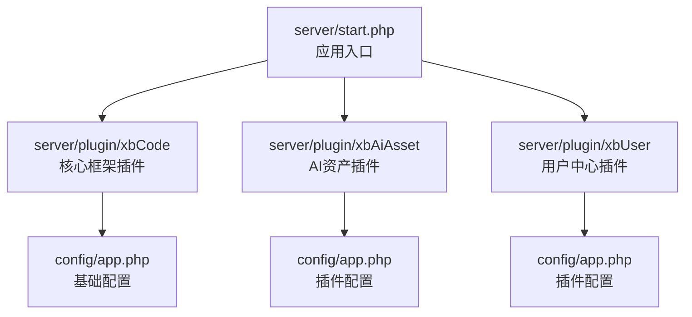
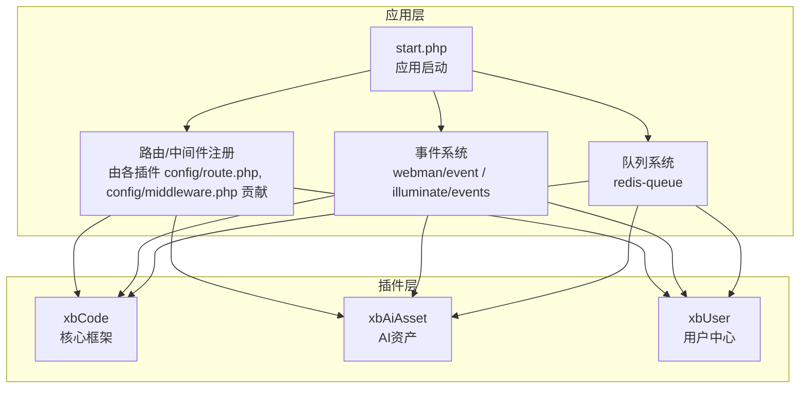
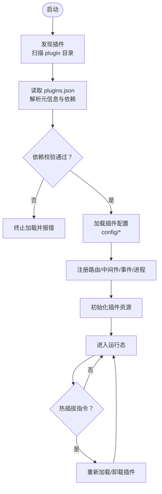
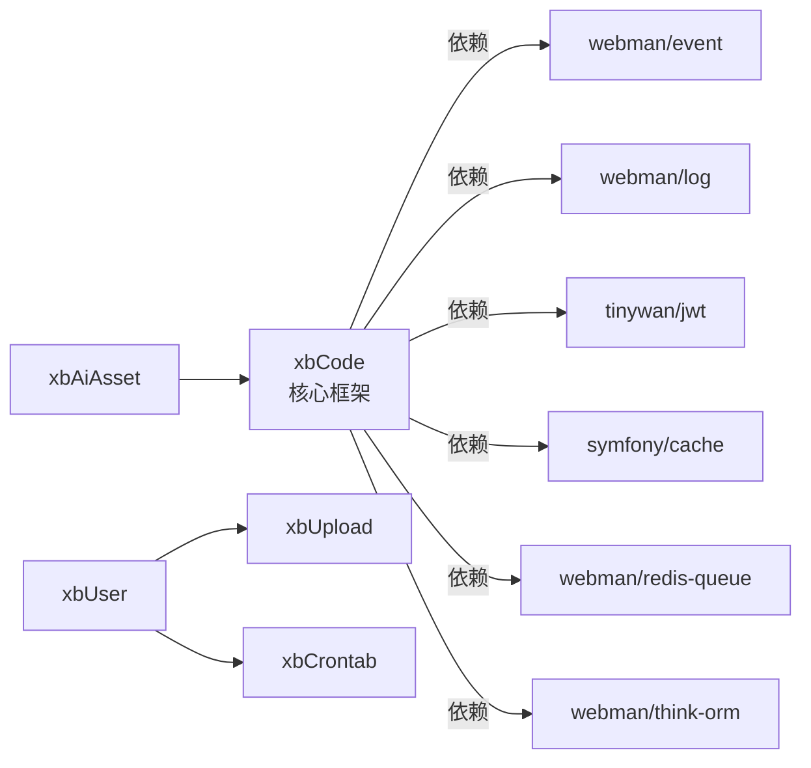

# 插件化架构

<cite>
**本文引用的文件**   
- [server/start.php](file://server/start.php)
- [server/plugin/xbCode/plugins.json](file://server/plugin/xbCode/plugins.json)
- [server/plugin/xbAiAsset/plugins.json](file://server/plugin/xbAiAsset/plugins.json)
- [server/plugin/xbUser/plugins.json](file://server/plugin/xbUser/plugins.json)
- [server/plugin/xbCode/config/app.php](file://server/plugin/xbCode/config/app.php)
- [server/plugin/xbAiAsset/config/app.php](file://server/plugin/xbAiAsset/config/app.php)
- [server/plugin/xbUser/config/app.php](file://server/plugin/xbUser/config/app.php)
</cite>

## 目录
1. [简介](#简介)
2. [项目结构](#项目结构)
3. [核心组件](#核心组件)
4. [架构总览](#架构总览)
5. [详细组件分析](#详细组件分析)
6. [依赖关系分析](#依赖关系分析)
7. [性能考虑](#性能考虑)
8. [故障排查指南](#故障排查指南)
9. [结论](#结论)
10. [附录](#附录)

## 简介
本文件面向积木云AI创作平台的插件化架构，围绕以下目标展开：
- 插件生命周期管理（发现、加载、初始化、运行、卸载）
- 热插拔机制（运行时启用/禁用与动态扩展）
- 插件间通信（事件总线、队列、API网关）
- 插件目录结构与配置文件规范（plugins.json、config/*）
- API钩子系统（路由、中间件、控制器、事件监听器）
- 安装/卸载流程、权限控制、依赖管理
- 可插拔功能模块与扩展点设计示例

说明：本文基于仓库中现有插件（如 xbCode、xbAiAsset、xbUser）的目录与配置进行归纳总结，并结合通用插件化最佳实践给出建议性实现方案。

## 项目结构
服务器端采用 Webman 框架，插件位于 server/plugin 目录下，每个插件为独立目录，包含自身的路由、控制器、模型、配置、脚本等。核心入口在 server/start.php，负责启动应用并加载各插件能力。

图表来源
- [server/start.php:1-6](file://server/start.php#L1-L6)
- [server/plugin/xbCode/config/app.php:1-7](file://server/plugin/xbCode/config/app.php#L1-L7)
- [server/plugin/xbAiAsset/config/app.php:1-10](file://server/plugin/xbAiAsset/config/app.php#L1-L10)
- [server/plugin/xbUser/config/app.php:1-10](file://server/plugin/xbUser/config/app.php#L1-L10)

章节来源
- [server/start.php:1-6](file://server/start.php#L1-L6)

## 核心组件
- 插件清单与元数据：每个插件根目录提供 plugins.json，描述标题、版本、作者、主页、依赖声明等。
- 插件配置：每个插件通过 config/* 提供覆盖或补充的配置项，例如 app.php 中的调试开关、控制器后缀等。
- 插件依赖：xbCode 作为核心框架插件，在 plugins.json 中声明了众多第三方包映射；其他插件可通过 plugins.json 的 plugins 字段声明对其它插件的依赖。

章节来源
- [server/plugin/xbCode/plugins.json:1-34](file://server/plugin/xbCode/plugins.json#L1-L34)
- [server/plugin/xbAiAsset/plugins.json:1-9](file://server/plugin/xbAiAsset/plugins.json#L1-L9)
- [server/plugin/xbUser/plugins.json:1-12](file://server/plugin/xbUser/plugins.json#L1-L12)
- [server/plugin/xbCode/config/app.php:1-7](file://server/plugin/xbCode/config/app.php#L1-L7)
- [server/plugin/xbAiAsset/config/app.php:1-10](file://server/plugin/xbAiAsset/config/app.php#L1-L10)
- [server/plugin/xbUser/config/app.php:1-10](file://server/plugin/xbUser/config/app.php#L1-L10)

## 架构总览
整体架构以“应用入口 + 插件集合”为核心，插件通过标准目录与配置文件暴露能力，并通过事件、队列、API 等方式进行交互。

图表来源
- [server/start.php:1-6](file://server/start.php#L1-L6)
- [server/plugin/xbCode/plugins.json:1-34](file://server/plugin/xbCode/plugins.json#L1-L34)

## 详细组件分析

### 插件清单与依赖管理（plugins.json）
- 作用：定义插件元信息（标题、版本、作者、主页）、composer 依赖映射、以及插件间依赖。
- 关键字段：
  - title/version/author/home_url/desc：用于展示与识别
  - composer：类名到包的映射，便于自动引入与版本约束
  - plugins：插件级依赖，键为被依赖插件标识，值为说明文本
- 示例参考：
  - xbCode 作为核心框架插件，声明了大量第三方包映射
  - xbUser 声明了对 xbUpload、xbCrontab 的依赖

章节来源
- [server/plugin/xbCode/plugins.json:1-34](file://server/plugin/xbCode/plugins.json#L1-L34)
- [server/plugin/xbUser/plugins.json:1-12](file://server/plugin/xbUser/plugins.json#L1-L12)
- [server/plugin/xbAiAsset/plugins.json:1-9](file://server/plugin/xbAiAsset/plugins.json#L1-L9)

### 插件配置体系（config/*）
- 统一入口：每个插件提供 config/app.php，用于设置调试模式、控制器后缀、复用策略等。
- 扩展配置：除 app.php 外，还可提供 route.php、middleware.php、event.php、process.php 等，分别贡献路由、中间件、事件、进程等能力。
- 覆盖策略：建议遵循“插件配置优先于全局配置”，并在启动阶段合并。

章节来源
- [server/plugin/xbCode/config/app.php:1-7](file://server/plugin/xbCode/config/app.php#L1-L7)
- [server/plugin/xbAiAsset/config/app.php:1-10](file://server/plugin/xbAiAsset/config/app.php#L1-L10)
- [server/plugin/xbUser/config/app.php:1-10](file://server/plugin/xbUser/config/app.php#L1-L10)

### 插件目录结构规范
- 推荐结构（结合现有插件归纳）：
  - api：对外接口控制器或 API 服务
  - app：业务逻辑（控制器、模型、队列任务等）
  - config：插件配置（app.php、route.php、middleware.php 等）
  - enum：枚举定义
  - public：静态资源
  - setting：后台设置页相关
  - skills：技能/模板
  - data：数据字典或种子数据
  - install.sql/update.sql：数据库迁移脚本
  - plugins.json：插件清单
- 约定优于配置：通过统一命名与位置，降低耦合度，提升可维护性。

章节来源
- [server/plugin/xbAiAsset/plugins.json:1-9](file://server/plugin/xbAiAsset/plugins.json#L1-L9)
- [server/plugin/xbUser/plugins.json:1-12](file://server/plugin/xbUser/plugins.json#L1-L12)

### API 钩子系统（路由、中间件、控制器、事件）
- 路由钩子：插件通过 config/route.php 注册路由，支持 RESTful 与模块化组织。
- 中间件钩子：插件通过 config/middleware.php 注入鉴权、限流、日志等中间件。
- 控制器钩子：插件在 app/api/controller 下实现具体控制器，遵循统一后缀与命名空间。
- 事件钩子：使用 webman/event 或 illuminate/events 发布/订阅事件，实现解耦通信。
- 队列钩子：通过 redis-queue 提交异步任务，处理耗时操作（如生成、下载、转码）。

章节来源
- [server/plugin/xbCode/plugins.json:1-34](file://server/plugin/xbCode/plugins.json#L1-L34)

### 插件生命周期管理
- 发现：扫描 server/plugin 下所有插件目录，读取 plugins.json 获取元信息与依赖。
- 校验：检查依赖是否满足（包括 composer 包与插件依赖），不满足则拒绝加载。
- 加载：按依赖顺序加载插件配置（config/*），注册路由、中间件、事件、进程等。
- 初始化：执行插件初始化逻辑（如缓存预热、索引构建）。
- 运行：响应请求、消费队列、调度定时任务。
- 卸载：停止相关进程、清理临时资源、回滚数据库变更（可选）。

[此图为概念流程图，无需图表来源]

### 热插拔机制
- 触发方式：通过管理端 API 或命令行触发插件启用/禁用。
- 安全边界：
  - 仅允许受控进程执行热插拔
  - 热插拔前进行快照与回滚预案
  - 严格校验插件签名与完整性
- 执行步骤：
  - 停止受影响的服务或隔离请求
  - 卸载旧版本插件（释放资源、断开连接）
  - 加载新版本插件（重新注册路由、中间件、事件）
  - 验证健康状态并恢复流量

[本节为概念性说明，无需章节来源]

### 插件间通信
- 事件总线：通过 webman/event 或 illuminate/events 发布领域事件，订阅者按需处理。
- 队列通道：通过 redis-queue 提交跨插件任务，避免同步阻塞。
- API 网关：插件通过统一的 API 路径访问其他插件能力，配合鉴权中间件控制访问范围。
- 共享配置：通过 config 合并机制共享必要配置，避免硬编码。

章节来源
- [server/plugin/xbCode/plugins.json:1-34](file://server/plugin/xbCode/plugins.json#L1-L34)

### 安装/卸载流程
- 安装：
  - 上传插件包至 server/plugin/{plugin_id}
  - 校验 plugins.json 与 composer 依赖
  - 执行 install.sql 创建表结构与初始数据
  - 注册路由、中间件、事件、进程
  - 输出安装结果与错误信息
- 卸载：
  - 停止插件相关进程
  - 清理缓存与临时文件
  - 可选择回滚数据库变更（提供 update.sql 反向脚本）
  - 移除路由与中间件注册

[本节为概念性说明，无需章节来源]

### 权限控制
- 鉴权中间件：在 config/middleware.php 中注入 JWT 或会话鉴权中间件。
- 角色与资源：结合用户中心插件（xbUser）提供的角色与权限模型，限制插件 API 访问。
- 插件级权限：在 plugins.json 中声明所需权限标签，启动时校验。

章节来源
- [server/plugin/xbUser/plugins.json:1-12](file://server/plugin/xbUser/plugins.json#L1-L12)

### 依赖管理
- Composer 依赖：在 plugins.json 的 composer 字段声明类到包的映射，便于自动引入与版本约束。
- 插件依赖：在 plugins.json 的 plugins 字段声明对其他插件的依赖，确保加载顺序与可用性。
- 冲突检测：启动时检测版本兼容性与冲突，提前失败并提示修复建议。

章节来源
- [server/plugin/xbCode/plugins.json:1-34](file://server/plugin/xbCode/plugins.json#L1-L34)
- [server/plugin/xbUser/plugins.json:1-12](file://server/plugin/xbUser/plugins.json#L1-L12)

### 插件开发示例（可插拔功能模块与扩展点）
- 新增一个 AI 渲染插件：
  - 目录：server/plugin/xbRender
  - 清单：plugins.json（声明标题、版本、依赖 xbAiAsset、xbUser）
  - 配置：config/app.php、config/route.php、config/middleware.php
  - 路由：在 config/route.php 注册 /render 系列接口
  - 控制器：app/api/controller/RenderController.php
  - 事件：发布 RenderStarted/RenderCompleted 事件
  - 队列：提交渲染任务到 redis-queue
  - 权限：通过 xbUser 的角色与权限模型控制访问
- 接入现有扩展点：
  - 事件扩展：订阅 AssetCreated 事件，触发素材预处理
  - 中间件扩展：注入自定义鉴权或审计中间件
  - 路由扩展：在 admin 后台增加渲染管理页面

[本节为概念性说明，无需章节来源]

## 依赖关系分析
- 核心框架插件 xbCode 声明了大量第三方包，涵盖事件、日志、JWT、验证码、环境变量、工作流、进程、多会话、ThinkORM、Redis 队列、HTTP 客户端、部署工具等。
- 业务插件（如 xbAiAsset、xbUser）通过 plugins.json 的 plugins 字段声明对其它插件的依赖，形成清晰的依赖图。

图表来源
- [server/plugin/xbCode/plugins.json:1-34](file://server/plugin/xbCode/plugins.json#L1-L34)
- [server/plugin/xbUser/plugins.json:1-12](file://server/plugin/xbUser/plugins.json#L1-L12)

章节来源
- [server/plugin/xbCode/plugins.json:1-34](file://server/plugin/xbCode/plugins.json#L1-L34)
- [server/plugin/xbUser/plugins.json:1-12](file://server/plugin/xbUser/plugins.json#L1-L12)

## 性能考虑
- 懒加载：仅在需要时加载插件配置与资源，减少启动开销。
- 路由缓存：生产环境缓存路由表，避免每次请求重复解析。
- 事件去重与节流：防止热点事件导致风暴。
- 队列背压：合理设置消费者数量与重试策略，避免内存溢出。
- 配置合并优化：增量更新配置，避免全量重建。

[本节为通用指导，无需章节来源]

## 故障排查指南
- 启动失败：
  - 检查 plugins.json 语法与必填字段
  - 核对 composer 依赖是否可用
  - 查看启动日志定位异常堆栈
- 路由未生效：
  - 确认 config/route.php 是否正确注册
  - 检查中间件是否拦截请求
- 事件未触发：
  - 确认事件名称与订阅者一致
  - 检查事件总线是否初始化成功
- 队列堆积：
  - 检查消费者进程是否存活
  - 调整并发数与重试策略

[本节为通用指导，无需章节来源]

## 结论
积木云AI创作平台通过标准化的插件目录与配置文件，结合事件、队列与路由/中间件钩子，构建了可扩展、可插拔的后端架构。以 xbCode 为核心框架插件，辅以 xbAiAsset、xbUser 等业务插件，形成了清晰的依赖关系与职责边界。建议在后续迭代中完善热插拔与安全校验，进一步提升系统的弹性与可运维性。

## 附录
- 关键文件路径参考：
  - 应用入口：server/start.php
  - 插件清单：server/plugin/*/plugins.json
  - 插件配置：server/plugin/*/config/app.php

章节来源
- [server/start.php:1-6](file://server/start.php#L1-L6)
- [server/plugin/xbCode/plugins.json:1-34](file://server/plugin/xbCode/plugins.json#L1-L34)
- [server/plugin/xbAiAsset/plugins.json:1-9](file://server/plugin/xbAiAsset/plugins.json#L1-L9)
- [server/plugin/xbUser/plugins.json:1-12](file://server/plugin/xbUser/plugins.json#L1-L12)
- [server/plugin/xbCode/config/app.php:1-7](file://server/plugin/xbCode/config/app.php#L1-L7)
- [server/plugin/xbAiAsset/config/app.php:1-10](file://server/plugin/xbAiAsset/config/app.php#L1-L10)
- [server/plugin/xbUser/config/app.php:1-10](file://server/plugin/xbUser/config/app.php#L1-L10)