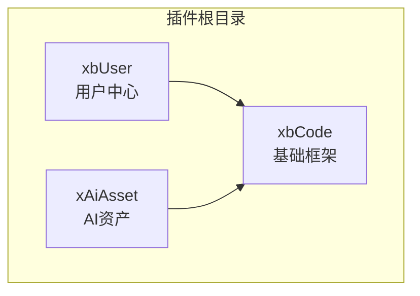
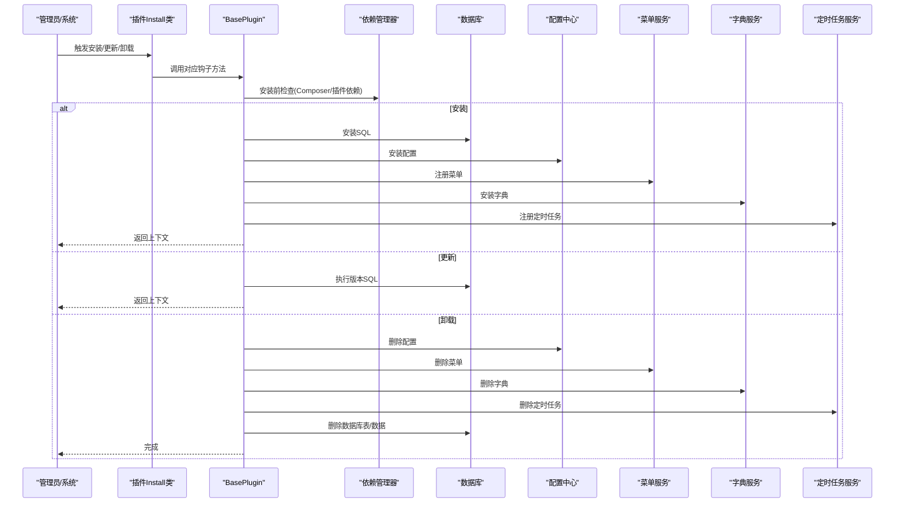
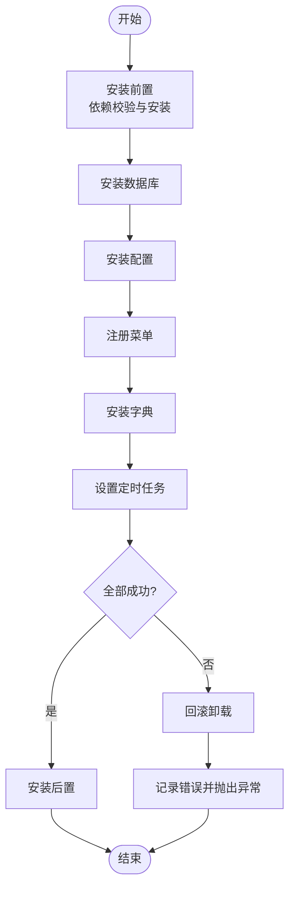
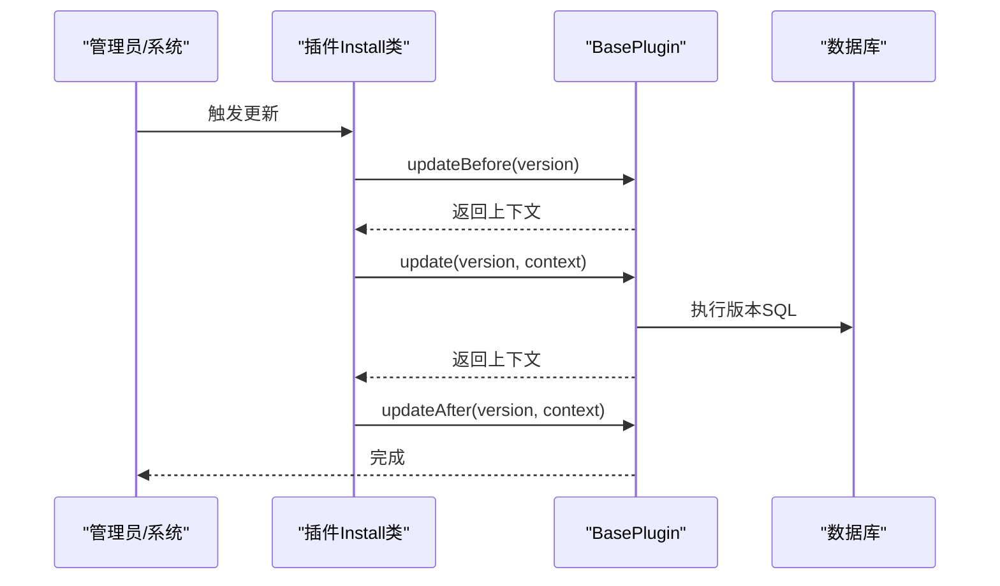
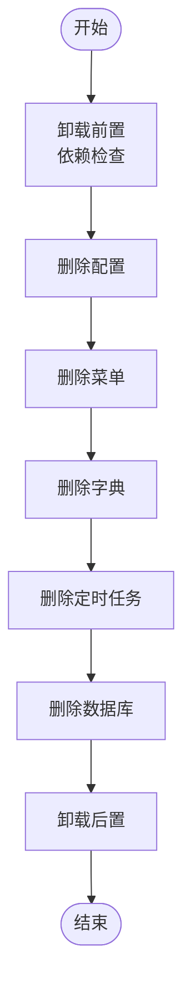
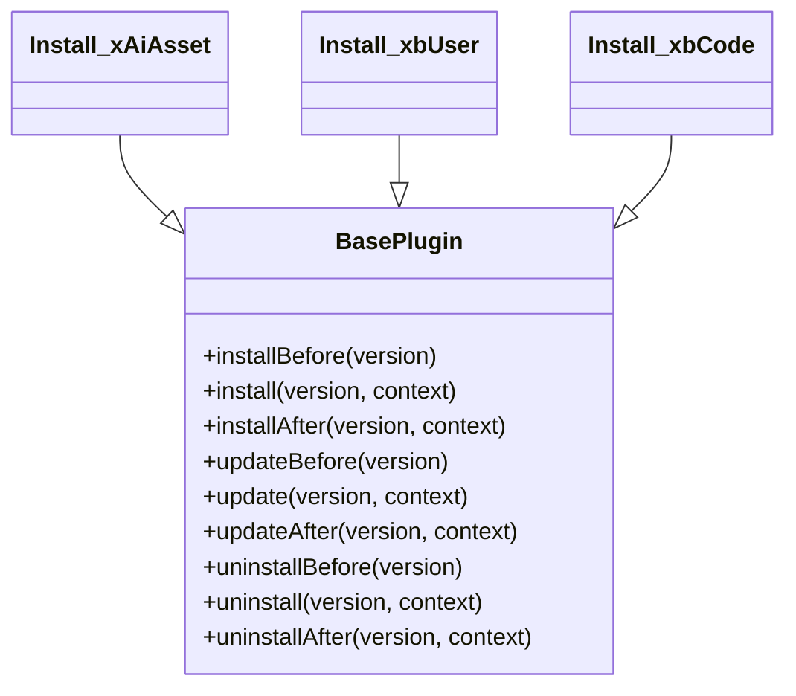
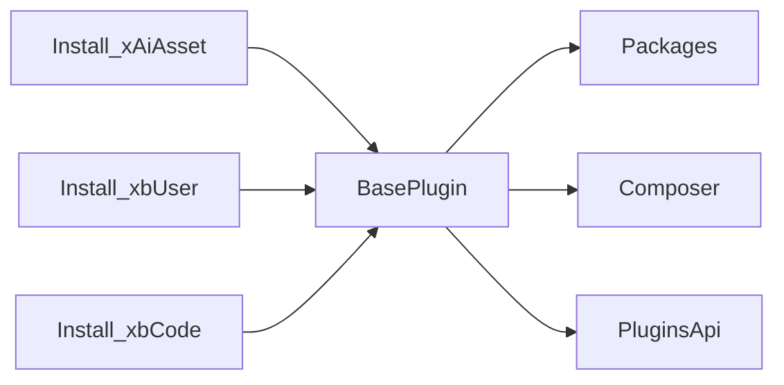

# 插件生命周期管理

<cite>
**本文引用的文件**
- [BasePlugin.php](file://server/plugin\xbCode\base\BasePlugin.php)
- [Install.php（xbAiAsset）](file://server/plugin\xbAiAsset\api\Install.php)
- [Install.php（xbUser）](file://server/plugin\xbUser\api\Install.php)
- [Install.php（xbCode）](file://server/plugin\xbCode\api\Install.php)
- [plugins.json（xbCode）](file://server/plugin\xbCode\plugins.json)
- [plugins.json（xbUser）](file://server/plugin\xbUser\plugins.json)
- [plugins.json（xAiAsset）](file://server/plugin\xbAiAsset\plugins.json)
</cite>

## 目录
1. [简介](#简介)
2. [项目结构](#项目结构)
3. [核心组件](#核心组件)
4. [架构总览](#架构总览)
5. [详细组件分析](#详细组件分析)
6. [依赖分析](#依赖分析)
7. [性能考虑](#性能考虑)
8. [故障排查指南](#故障排查指南)
9. [结论](#结论)
10. [附录](#附录)

## 简介
本文件面向积木云AI创作平台的插件开发者与管理者，系统化阐述插件的完整生命周期：安装前检查、依赖验证、数据库初始化、配置加载、菜单注册、字典安装、定时任务设置；更新机制的版本控制与数据迁移策略；以及卸载流程的数据清理与资源回收。文档同时提供各阶段可实现的钩子方法说明与示例路径，帮助你在不同阶段执行自定义逻辑。

## 项目结构
插件体系位于 server/plugin 目录下，每个插件以独立目录组织，包含 api、config、data、enum、public、setting、skills 等标准目录。核心框架能力由 xbCode 插件提供，其他业务插件（如 xbUser、xAiAsset）在其基础上扩展。

图表来源
- [BasePlugin.php](file://server/plugin\xbCode\base\BasePlugin.php)
- [plugins.json（xbCode）](file://server/plugin\xbCode\plugins.json)
- [plugins.json（xbUser）](file://server/plugin\xbUser\plugins.json)
- [plugins.json（xAiAsset）](file://server/plugin\xbAiAsset\plugins.json)

章节来源
- [BasePlugin.php](file://server/plugin\xbCode\base\BasePlugin.php)
- [plugins.json（xbCode）](file://server/plugin\xbCode\plugins.json)
- [plugins.json（xbUser）](file://server/plugin\xbUser\plugins.json)
- [plugins.json（xAiAsset）](file://server/plugin\xbAiAsset\plugins.json)

## 核心组件
- BasePlugin：插件基类，统一封装安装/更新/卸载的前置、主流程、后置钩子，并协调数据库、配置、菜单、字典、定时任务的安装与卸载。
- Install 子类：各插件在 api/Install.php 中继承 BasePlugin，按需覆盖 install/update/uninstall 等方法，实现插件级定制逻辑。
- plugins.json：声明插件元信息、Composer 依赖与其他插件依赖，用于前置校验与依赖解析。

章节来源
- [BasePlugin.php](file://server/plugin\xbCode\base\BasePlugin.php)
- [Install.php（xAiAsset）](file://server/plugin\xbAiAsset\api\Install.php)
- [Install.php（xbUser）](file://server/plugin\xbUser\api\Install.php)
- [Install.php（xbCode）](file://server/plugin\xbCode\api\Install.php)
- [plugins.json（xbCode）](file://server/plugin\xbCode\plugins.json)
- [plugins.json（xbUser）](file://server/plugin\xbUser\plugins.json)
- [plugins.json（xAiAsset）](file://server/plugin\xbAiAsset\plugins.json)

## 架构总览
下图展示插件生命周期关键阶段与调用关系，包括安装前检查、依赖验证、数据库初始化、配置加载、菜单注册、字典安装、定时任务设置，以及更新与卸载流程。

图表来源
- [BasePlugin.php](file://server/plugin\xbCode\base\BasePlugin.php)

## 详细组件分析

### 安装生命周期
- 安装前置 installBefore
  - 负责 Composer 依赖检测与安装、插件依赖检测与安装。
  - 若检测到缺失依赖，将尝试自动安装或抛出异常终止流程。
- 安装主流程 install
  - 顺序执行：数据库初始化、配置加载、菜单注册、字典安装、定时任务设置。
  - 任一环节失败会触发回滚：调用 uninstall 进行数据清理，并记录错误日志后抛出异常。
- 安装后置 installAfter
  - 可用于安装后的额外业务初始化（例如缓存预热、索引重建等）。

图表来源
- [BasePlugin.php](file://server/plugin\xbCode\base\BasePlugin.php)

章节来源
- [BasePlugin.php](file://server/plugin\xbCode\base\BasePlugin.php)
- [Install.php（xAiAsset）](file://server/plugin\xbAiAsset\api\Install.php)

### 更新生命周期
- 更新前置 updateBefore
  - 可返回上下文数据供后续步骤使用。
- 更新主流程 update
  - 执行版本 SQL（增量迁移），支持多版本逐步升级。
  - 异常时记录日志并抛出异常，不自动回滚。
- 更新后置 updateAfter
  - 基于上下文进行收尾工作（如缓存刷新、索引重建等）。

图表来源
- [BasePlugin.php](file://server/plugin\xbCode\base\BasePlugin.php)

章节来源
- [BasePlugin.php](file://server/plugin\xbCode\base\BasePlugin.php)
- [Install.php（xbUser）](file://server/plugin\xbUser\api\Install.php)

### 卸载生命周期
- 卸载前置 uninstallBefore
  - 检查是否存在其他插件依赖当前插件，若有则阻止卸载。
- 卸载主流程 uninstall
  - 顺序执行：删除配置、删除菜单、删除字典、删除定时任务、删除数据库。
  - 异常时记录日志并抛出异常。
- 卸载后置 uninstallAfter
  - 可用于释放外部资源（如临时文件、队列消费者等）。

图表来源
- [BasePlugin.php](file://server/plugin\xbCode\base\BasePlugin.php)

章节来源
- [BasePlugin.php](file://server/plugin\xbCode\base\BasePlugin.php)
- [Install.php（xbCode）](file://server/plugin\xbCode\api\Install.php)

### 钩子方法与自定义逻辑示例
- 安装阶段
  - 覆盖 install 方法，在父类安装完成后追加自定义逻辑（例如创建默认数据、初始化第三方服务等）。
  - 参考路径：[Install.php（xAiAsset）](file://server/plugin\xbAiAsset\api\Install.php)
- 更新阶段
  - 覆盖 update 方法，编写版本迁移脚本（按版本号递增执行）。
  - 参考路径：[Install.php（xbUser）](file://server/plugin\xbUser\api\Install.php)
- 卸载阶段
  - 覆盖 uninstall 方法，在父类卸载完成后执行额外清理（如删除上传目录、清理缓存等）。
  - 参考路径：[Install.php（xbCode）](file://server/plugin\xbCode\api\Install.php)

章节来源
- [Install.php（xAiAsset）](file://server/plugin\xbAiAsset\api\Install.php)
- [Install.php（xbUser）](file://server/plugin\xbUser\api\Install.php)
- [Install.php（xbCode）](file://server/plugin\xbCode\api\Install.php)

### 依赖与版本控制
- 插件元信息与依赖
  - plugins.json 中定义 title、version、author、desc、home_url、composer、plugins 等字段。
  - composer 字段声明 PHP 包依赖；plugins 字段声明对其他插件的依赖及描述。
- 依赖校验
  - 安装前置会先校验 Composer 依赖，再校验插件依赖；缺失时将尝试自动安装或抛出异常。
- 版本控制
  - 通过 version 字段标识插件版本；更新流程依据版本执行对应的 SQL 迁移。

图表来源
- [BasePlugin.php](file://server/plugin\xbCode\base\BasePlugin.php)
- [Install.php（xAiAsset）](file://server/plugin\xbAiAsset\api\Install.php)
- [Install.php（xbUser）](file://server/plugin\xbUser\api\Install.php)
- [Install.php（xbCode）](file://server/plugin\xbCode\api\Install.php)

章节来源
- [plugins.json（xbCode）](file://server/plugin\xbCode\plugins.json)
- [plugins.json（xbUser）](file://server/plugin\xbUser\plugins.json)
- [plugins.json（xAiAsset）](file://server/plugin\xbAiAsset\plugins.json)
- [BasePlugin.php](file://server/plugin\xbCode\base\BasePlugin.php)

## 依赖分析
- 直接依赖
  - 所有插件的 Install 类均继承自 BasePlugin，复用统一的安装/更新/卸载流程。
- 间接依赖
  - BasePlugin 内部通过 Packages、Composer、PluginsApi 等工具类完成依赖解析与安装。
- 潜在风险
  - 若插件间存在循环依赖，将在卸载前置或安装前置被拦截，避免不一致状态。
  - 更新流程未内置自动回滚，需确保版本 SQL 幂等与可重入。

图表来源
- [BasePlugin.php](file://server/plugin\xbCode\base\BasePlugin.php)
- [Install.php（xAiAsset）](file://server/plugin\xbAiAsset\api\Install.php)
- [Install.php（xbUser）](file://server/plugin\xbUser\api\Install.php)
- [Install.php（xbCode）](file://server/plugin\xbCode\api\Install.php)

章节来源
- [BasePlugin.php](file://server/plugin\xbCode\base\BasePlugin.php)

## 性能考虑
- 批量操作
  - 数据库初始化与迁移建议分批提交，避免长事务锁表。
- 幂等设计
  - 更新 SQL 应保证幂等，支持重复执行而不产生副作用。
- 资源释放
  - 卸载后置中及时关闭连接、清理缓存与临时文件，防止资源泄漏。
- 依赖安装
  - Composer 安装耗时较长，建议在安装前置阶段异步化或提供进度反馈。

## 故障排查指南
- 安装失败
  - 检查安装前置是否通过（Composer 与插件依赖）。
  - 查看错误日志，定位具体失败的阶段（数据库、配置、菜单、字典、定时任务）。
  - 注意：安装失败会触发回滚，确认回滚是否完全。
- 更新失败
  - 检查版本 SQL 是否正确且幂等。
  - 查看更新日志，确认是否在某个版本迁移中断。
- 卸载失败
  - 检查是否有其他插件依赖当前插件。
  - 确认配置、菜单、字典、定时任务、数据库是否按顺序清理。

章节来源
- [BasePlugin.php](file://server/plugin\xbCode\base\BasePlugin.php)

## 结论
积木云插件生命周期通过 BasePlugin 提供了标准化的安装、更新、卸载流程，并在各阶段暴露钩子方法，便于扩展与定制。开发者应在安装前置做好依赖校验，在更新阶段保证迁移幂等，在卸载阶段彻底清理资源。遵循本文档的流程与最佳实践，可有效提升插件的可维护性与稳定性。

## 附录
- 常用目录约定
  - config：插件配置文件
  - data：静态数据与字典
  - setting/tabs：后台配置面板定义
  - public：静态资源
  - skills：技能/模板
- 参考路径
  - 安装示例：[Install.php（xAiAsset）](file://server/plugin\xbAiAsset\api\Install.php)
  - 更新示例：[Install.php（xbUser）](file://server/plugin\xbUser\api\Install.php)
  - 卸载示例：[Install.php（xbCode）](file://server/plugin\xbCode\api\Install.php)
  - 插件元信息：[plugins.json（xbCode）](file://server/plugin\xbCode\plugins.json)、[plugins.json（xbUser）](file://server/plugin\xbUser\plugins.json)、[plugins.json（xAiAsset）](file://server/plugin\xbAiAsset\plugins.json)