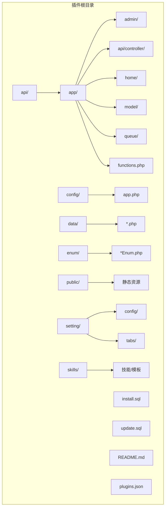
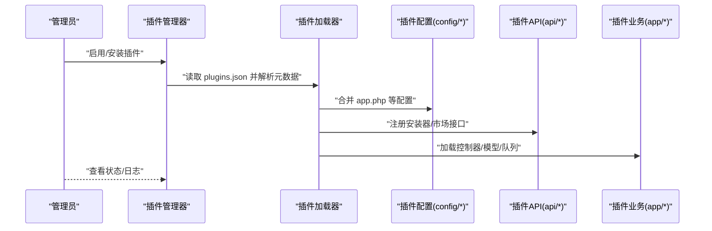
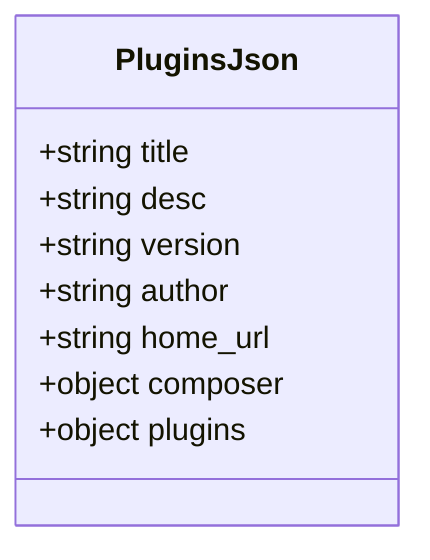
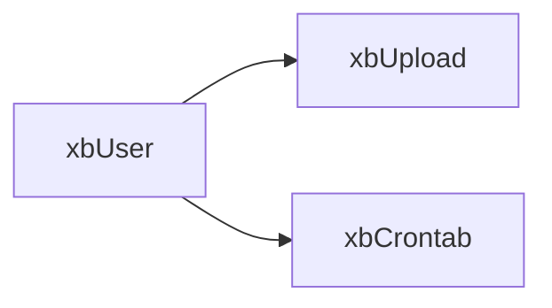

# 插件目录结构规范

<cite>
**本文引用的文件**   
- [server/plugin/xbCode/plugins.json](file://server/plugin/xbCode/plugins.json)
- [server/plugin/xbUser/plugins.json](file://server/plugin/xbUser/plugins.json)
- [server/plugin/xbAiAsset/plugins.json](file://server/plugin/xbAiAsset/plugins.json)
- [server/plugin/xbAiModelAgent/plugins.json](file://server/plugin/xbAiModelAgent/plugins.json)
- [server/plugin/xbCode/config/app.php](file://server/plugin/xbCode/config/app.php)
- [server/plugin/xbAiAsset/config/app.php](file://server/plugin/xbAiAsset/config/app.php)
- [server/plugin/xbUser/config/app.php](file://server/plugin/xbUser/config/app.php)
- [server/plugin/xbCode/README.md](file://server/plugin/xbCode/README.md)
- [server/plugin/xbAiAsset/README.md](file://server/plugin/xbAiAsset/README.md)
- [server/plugin/xbUser/README.md](file://server/plugin/xbUser/README.md)
</cite>

## 目录
1. [简介](#简介)
2. [项目结构](#项目结构)
3. [核心组件](#核心组件)
4. [架构总览](#架构总览)
5. [详细组件分析](#详细组件分析)
6. [依赖分析](#依赖分析)
7. [性能考虑](#性能考虑)
8. [故障排查指南](#故障排查指南)
9. [结论](#结论)
10. [附录](#附录)

## 简介
本规范面向积木云AI创作平台的插件体系，定义标准插件的目录组织方式与约定，覆盖 api、app、config、data、enum、public、setting、skills 等核心目录的职责与文件规范；明确 plugins.json 配置的结构与字段含义（含元数据、版本信息、依赖声明）；并提供命名约定、代码组织最佳实践以及完整的插件模板结构与配置文件示例。

## 项目结构
标准插件根目录位于 server/plugin/{插件标识}，每个插件遵循统一的目录约定。以下为推荐的最小可用结构：

- api：插件对外暴露的业务接口类或安装脚本入口（如 Install.php、MarketApi.php 等）
- app：业务实现层，通常包含 admin、api、home 等子模块及 model、queue、functions.php 等
- config：插件配置项（app.php、route.php、middleware.php、menu.php、dict.php、redis.php、log.php、view.php、translation.php、static.php、process.php、autoload.php、container.php、exception.php、xbcode.php 等）
- data：静态数据或初始化数据（如 groups.php、models.php 等）
- enum：枚举定义（如 AssetTypeEnum.php、TaskLogStatusEnum.php 等）
- public：插件对外静态资源（图片、样式、脚本等）
- setting：系统设置相关（config/tabs 下按页面维度组织表单与标签页）
- skills：技能/工作流编排或提示词模板等扩展能力
- install.sql / update.sql：数据库初始化与升级脚本
- README.md：插件说明文档
- plugins.json：插件元数据与依赖声明

[此图为概念性结构示意，不直接映射具体源码文件]

## 核心组件
本节聚焦插件的核心目录职责与文件规范，结合仓库中已有插件的实际结构进行总结。

- api
  - 作用：插件对外暴露的 API 类、安装器、市场接口等
  - 常见文件：Install.php、MarketApi.php、*Api.php
  - 建议：以功能域为粒度拆分文件，保持单一职责；安装器负责建表、初始化数据与路由注册

- app
  - 作用：业务逻辑与控制器、模型、队列任务等
  - 常见子目录：
    - admin：后台管理控制器与视图
    - api/controller：对外 API 控制器
    - home：前台页面控制器
    - model：数据模型
    - queue：异步任务消费者
    - functions.php：全局函数与辅助方法
  - 建议：控制器按领域划分；模型使用 ORM 风格；队列任务独立文件并注册到进程

- config
  - 作用：插件配置项与框架集成配置
  - 常见文件：
    - app.php：应用基础配置（调试开关、控制器后缀、复用策略等）
    - route.php、middleware.php、menu.php、dict.php、redis.php、log.php、view.php、translation.php、static.php、process.php、autoload.php、container.php、exception.php、xbcode.php
  - 建议：所有可配置项集中于此，避免硬编码；通过环境变量注入敏感值

- data
  - 作用：静态数据与种子数据
  - 常见文件：groups.php、models.php 等
  - 建议：仅存放不可变或低变更的数据；复杂数据迁移放入 install/update 脚本

- enum
  - 作用：统一枚举定义
  - 常见文件：*Enum.php
  - 建议：使用类常量或枚举类型，提供清晰的键值映射与描述

- public
  - 作用：对外静态资源
  - 建议：按功能域分目录，避免污染根目录

- setting
  - 作用：系统设置界面与表单定义
  - 常见结构：config/tabs 下按页面维度组织表单与标签页
  - 建议：表单字段与校验规则集中管理，便于维护

- skills
  - 作用：技能/工作流编排或提示词模板
  - 建议：以 JSON/YAML 形式定义流程节点与参数，配合运行时引擎执行

- 其他
  - install.sql / update.sql：数据库初始化与增量升级
  - README.md：使用说明、依赖、安装步骤
  - plugins.json：插件元数据与依赖声明

章节来源
- [server/plugin/xbCode/README.md:1-148](file://server/plugin/xbCode/README.md#L1-L148)
- [server/plugin/xbAiAsset/README.md:1-38](file://server/plugin/xbAiAsset/README.md#L1-L38)
- [server/plugin/xbUser/README.md:1-77](file://server/plugin/xbUser/README.md#L1-L77)

## 架构总览
插件在系统中的加载与运行路径如下：

[此图为概念性流程示意，不直接映射具体源码文件]

## 详细组件分析

### 插件元数据与依赖声明（plugins.json）
- 字段说明
  - title：插件名称
  - desc：插件描述
  - version：版本号（语义化版本）
  - author：作者
  - home_url：插件主页或文档地址
  - composer：Composer 依赖映射（键为命名空间，值为包名与版本约束）
  - plugins：插件间依赖（键为目标插件标识，值为依赖说明）
- 参考示例
  - 核心框架插件 xbCode 展示了完整的 composer 依赖映射
  - 用户插件 xbUser 展示了插件间依赖声明
  - AI资产与模型代理插件展示了最小元数据集合

图表来源
- [server/plugin/xbCode/plugins.json:1-34](file://server/plugin/xbCode/plugins.json#L1-L34)
- [server/plugin/xbUser/plugins.json:1-12](file://server/plugin/xbUser/plugins.json#L1-L12)
- [server/plugin/xbAiAsset/plugins.json:1-9](file://server/plugin/xbAiAsset/plugins.json#L1-L9)
- [server/plugin/xbAiModelAgent/plugins.json:1-9](file://server/plugin/xbAiModelAgent/plugins.json#L1-L9)

章节来源
- [server/plugin/xbCode/plugins.json:1-34](file://server/plugin/xbCode/plugins.json#L1-L34)
- [server/plugin/xbUser/plugins.json:1-12](file://server/plugin/xbUser/plugins.json#L1-L12)
- [server/plugin/xbAiAsset/plugins.json:1-9](file://server/plugin/xbAiAsset/plugins.json#L1-L9)
- [server/plugin/xbAiModelAgent/plugins.json:1-9](file://server/plugin/xbAiModelAgent/plugins.json#L1-L9)

### 应用配置（config/app.php）
- 作用：定义插件应用级基础配置，如调试模式、控制器后缀、控制器复用策略等
- 建议：
  - 使用环境变量注入敏感或环境相关配置
  - 保持默认值合理，便于本地开发与生产部署
  - 与其他配置项保持一致的组织方式

章节来源
- [server/plugin/xbCode/config/app.php:1-7](file://server/plugin/xbCode/config/app.php#L1-L7)
- [server/plugin/xbAiAsset/config/app.php:1-10](file://server/plugin/xbAiAsset/config/app.php#L1-L10)
- [server/plugin/xbUser/config/app.php:1-10](file://server/plugin/xbUser/config/app.php#L1-L10)

### 插件安装与生命周期（api/Install.php）
- 作用：执行数据库初始化、菜单注册、路由绑定、权限分配等
- 建议：
  - 将 SQL 操作集中在 install.sql/update.sql，PHP 侧只做调用与事务控制
  - 提供幂等的安装逻辑，支持重复安装与回滚
  - 记录安装日志，便于问题追踪

[本节为通用实践说明，未直接分析具体文件]

### 对外API与控制器（api/* 与 app/api/controller/*）
- 作用：暴露 RESTful 接口，供前端或其他服务调用
- 建议：
  - 按领域划分控制器，单一职责
  - 输入校验与错误码统一处理
  - 鉴权与限流在中间件层完成

[本节为通用实践说明，未直接分析具体文件]

### 数据模型与枚举（app/model/* 与 enum/*）
- 作用：封装数据访问与业务实体；统一枚举定义
- 建议：
  - 模型与表一一对应，字段注释清晰
  - 枚举集中管理，避免魔法值

[本节为通用实践说明，未直接分析具体文件]

### 队列与进程（app/queue/* 与 config/process.php）
- 作用：异步任务消费与进程管理
- 建议：
  - 任务类独立文件，失败重试与死信队列完善
  - 进程配置与监控告警配套

[本节为通用实践说明，未直接分析具体文件]

### 设置与表单（setting/config 与 setting/tabs）
- 作用：系统设置界面与表单定义
- 建议：
  - 表单字段与校验规则集中管理
  - 多语言与国际化支持

[本节为通用实践说明，未直接分析具体文件]

### 静态资源与公共目录（public/）
- 作用：对外静态资源
- 建议：
  - 按功能域分目录，避免污染根目录
  - 资源版本化与缓存策略

[本节为通用实践说明，未直接分析具体文件]

### 技能与工作流（skills/）
- 作用：技能/工作流编排或提示词模板
- 建议：
  - 以结构化格式定义流程节点与参数
  - 提供校验与预览能力

[本节为通用实践说明，未直接分析具体文件]

## 依赖分析
- 插件内依赖
  - 通过 plugins.json 的 plugins 字段声明对其他插件的依赖关系
  - 通过 composer 字段声明 PHP 包依赖（命名空间到包的映射）
- 插件间依赖
  - 用户插件依赖上传与定时任务插件，体现典型组合式能力

图表来源
- [server/plugin/xbUser/plugins.json:1-12](file://server/plugin/xbUser/plugins.json#L1-L12)

章节来源
- [server/plugin/xbUser/plugins.json:1-12](file://server/plugin/xbUser/plugins.json#L1-L12)

## 性能考虑
- 控制器复用与实例化策略在 app.php 中可配置，按需开启以提升吞吐
- 队列任务批量处理与批大小调优，避免长事务与内存泄漏
- 静态资源 CDN 与缓存头优化
- 数据库索引与查询优化，避免全表扫描
- 插件热重载与懒加载，减少启动开销

[本节为通用指导，未直接分析具体文件]

## 故障排查指南
- 常见问题
  - 插件未启用：检查 plugins.json 是否完整且版本兼容
  - 依赖缺失：核对 composer 依赖映射与实际安装的包
  - 路由/菜单未生效：确认 route.php/menu.php 是否正确注册
  - 数据库初始化失败：检查 install.sql 语法与权限
- 定位手段
  - 查看插件日志与系统日志
  - 启用调试模式，观察异常堆栈
  - 使用命令行工具验证插件状态与依赖

[本节为通用指导，未直接分析具体文件]

## 结论
通过统一的目录结构与 plugins.json 元数据规范，积木云AI创作平台可实现插件的可插拔、可组合与可观测。建议在团队内推广本规范，并在 CI 中加入插件结构校验与依赖一致性检查，确保交付质量。

[本节为总结性内容，未直接分析具体文件]

## 附录

### 插件模板结构（示例）
- 根目录
  - plugins.json
  - README.md
  - install.sql
  - update.sql
- 目录
  - api/
  - app/admin/
  - app/api/controller/
  - app/home/
  - app/model/
  - app/queue/
  - app/functions.php
  - config/
  - data/
  - enum/
  - public/
  - setting/config/
  - setting/tabs/
  - skills/

[此模板为概念性结构示意，不直接映射具体源码文件]

### plugins.json 字段清单与示例要点
- 必填字段
  - title、version、author
- 可选字段
  - desc、home_url、composer、plugins
- 示例要点
  - 核心框架插件展示完整 composer 依赖映射
  - 用户插件展示插件间依赖声明
  - AI资产与模型代理插件展示最小元数据集合

章节来源
- [server/plugin/xbCode/plugins.json:1-34](file://server/plugin/xbCode/plugins.json#L1-L34)
- [server/plugin/xbUser/plugins.json:1-12](file://server/plugin/xbUser/plugins.json#L1-L12)
- [server/plugin/xbAiAsset/plugins.json:1-9](file://server/plugin/xbAiAsset/plugins.json#L1-L9)
- [server/plugin/xbAiModelAgent/plugins.json:1-9](file://server/plugin/xbAiModelAgent/plugins.json#L1-L9)

### 文件命名约定
- 控制器：*Controller.php
- API 类：*Api.php
- 模型：*Model.php
- 枚举：*Enum.php
- 配置：*.php（小写下划线或驼峰均可，但需一致）
- 数据：*.php（返回数组或对象）
- 队列任务：*Task.php 或 *Consumer.php
- 安装脚本：Install.php
- 静态资源：按功能域分目录，文件名使用小写连字符

[本节为通用约定，未直接分析具体文件]

### 代码组织最佳实践
- 单一职责与高内聚低耦合
- 配置外置与环境变量注入
- 错误码与异常分层处理
- 单元测试与集成测试覆盖关键路径
- 文档与变更日志同步更新

[本节为通用实践，未直接分析具体文件]