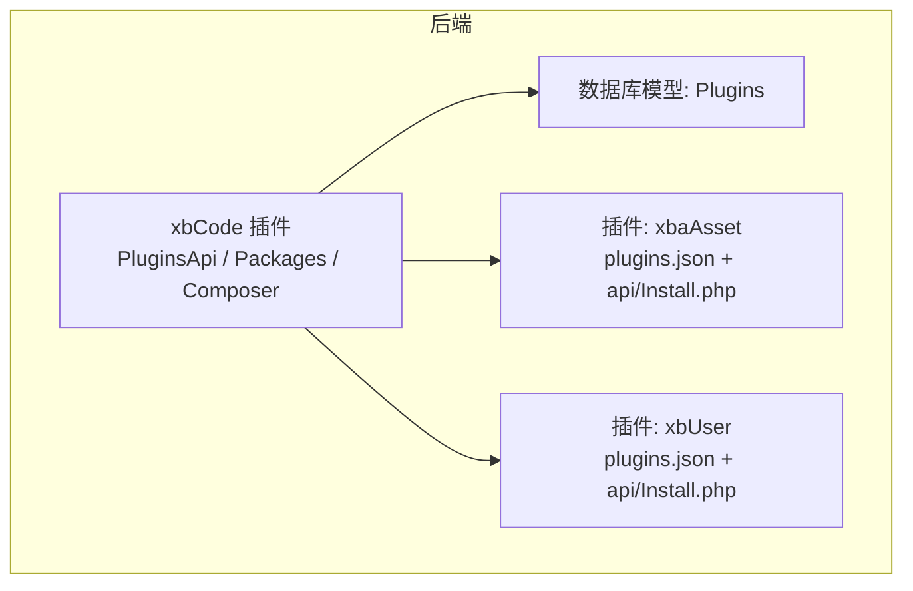
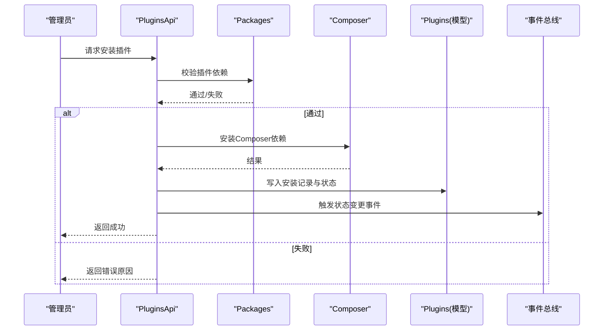
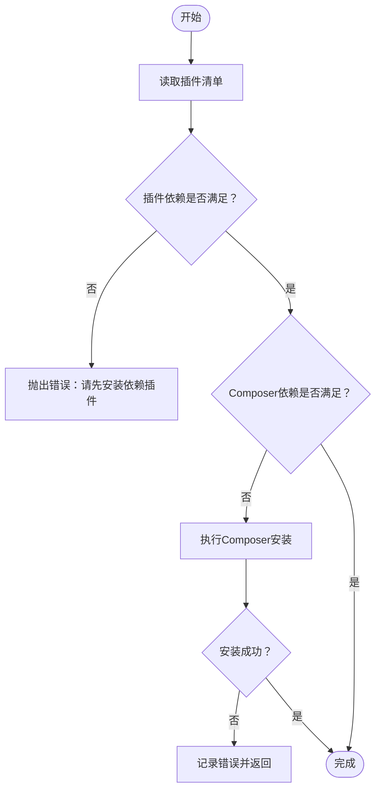
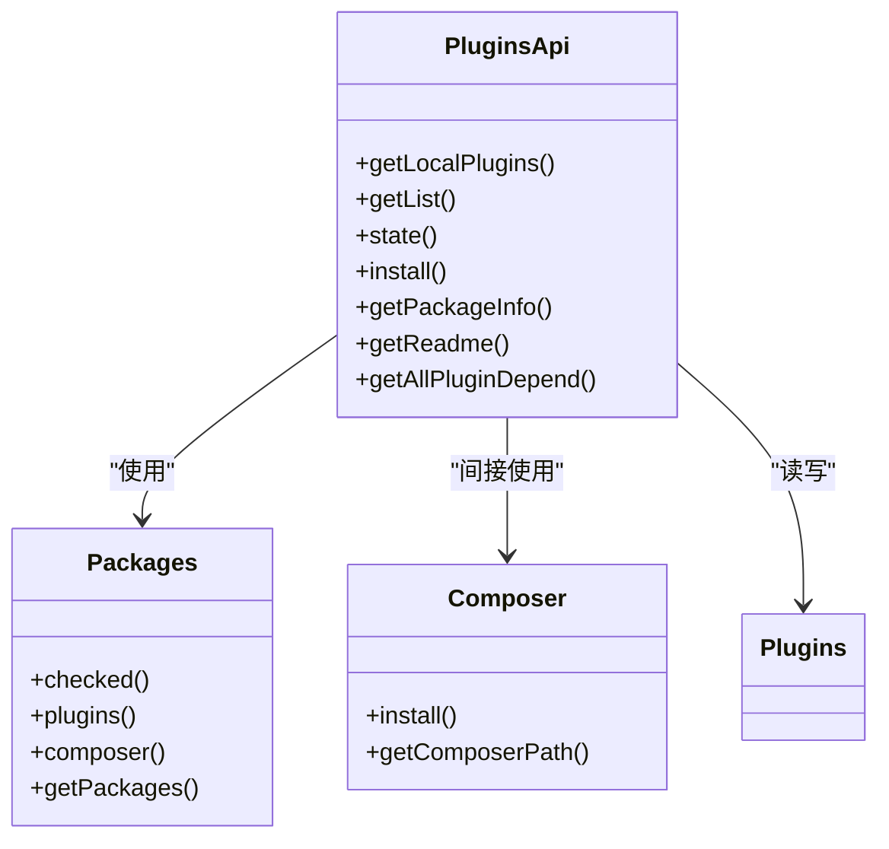

# 插件管理系统

<cite>
**本文引用的文件**   
- [PluginsApi.php](file://server/plugin\xbCode\api\PluginsApi.php)
- [Packages.php](file://server/plugin\xbCode\api\Packages.php)
- [Composer.php](file://server/plugin\xbCode\api\Composer.php)
- [Install.php（xbAiAsset）](file://server/plugin\xbAiAsset\api\Install.php)
- [Install.php（xbUser）](file://server/plugin\xbUser\api\Install.php)
- [plugins.json（xbCode）](file://server/plugin\xbCode\plugins.json)
- [plugins.json（xbAiAsset）](file://server/plugin\xbAiAsset\plugins.json)
- [plugins.json（xbUser）](file://server/plugin\xbUser\plugins.json)
- [Plugins.php（模型）](file://server/plugin\xbCode\app\model\Plugins.php)
</cite>

## 目录
1. [简介](#简介)
2. [项目结构](#项目结构)
3. [核心组件](#核心组件)
4. [架构总览](#架构总览)
5. [详细组件分析](#详细组件分析)
6. [依赖分析](#依赖分析)
7. [性能考虑](#性能考虑)
8. [故障排查指南](#故障排查指南)
9. [结论](#结论)
10. [附录：API与前端交互设计](#附录api与前端交互设计)

## 简介
本文件为积木云AI创作平台的“插件管理系统”技术文档，聚焦于插件的安装、卸载、更新、导出等管理功能；说明插件包打包格式、版本兼容性检查、依赖解析机制；并给出插件商店集成、在线安装流程、批量操作支持的设计建议。同时提供插件管理的API接口说明与前端界面交互设计要点，以及权限控制、安全验证、审计日志等企业级特性建议。

## 项目结构
后端采用基于Webman的插件化架构，插件统一位于 server/plugin/{插件标识} 目录，每个插件根目录包含 plugins.json 描述元数据，可选 api/Install.php 实现生命周期钩子。核心插件 xbCode 提供插件管理API、依赖检测与Composer安装能力。

图表来源
- [PluginsApi.php](file://server/plugin\xbCode\api\PluginsApi.php)
- [Packages.php](file://server/plugin\xbCode\api\Packages.php)
- [Composer.php](file://server/plugin\xbCode\api\Composer.php)
- [Install.php（xbAiAsset）](file://server/plugin\xbAiAsset\api\Install.php)
- [Install.php（xbUser）](file://server/plugin\xbUser\api\Install.php)
- [Plugins.php（模型）](file://server/plugin\xbCode\app\model\Plugins.php)

章节来源
- [PluginsApi.php](file://server/plugin\xbCode\api\PluginsApi.php)
- [Packages.php](file://server/plugin\xbCode\api\Packages.php)
- [Composer.php](file://server/plugin\xbCode\api\Composer.php)
- [Install.php（xbAiAsset）](file://server/plugin\xbAiAsset\api\Install.php)
- [Install.php（xbUser）](file://server/plugin\xbUser\api\Install.php)
- [Plugins.php（模型）](file://server/plugin\xbCode\app\model\Plugins.php)

## 核心组件
- 插件清单与元数据
  - 每个插件根目录包含 plugins.json，定义标题、版本、作者、描述、composer 依赖、plugins 依赖等字段。
  - 示例参考：[plugins.json（xbCode）](file://server/plugin\xbCode\plugins.json)、[plugins.json（xbAiAsset）](file://server/plugin\xbAiAsset\plugins.json)、[plugins.json（xbUser）](file://server/plugin\xbUser\plugins.json)。
- 插件生命周期钩子
  - 通过 api/Install.php 暴露 install/update/uninstall 等方法，继承基础类以复用系统能力。
  - 示例参考：[Install.php（xbAiAsset）](file://server/plugin\xbAiAsset\api\Install.php)、[Install.php（xbUser）](file://server/plugin\xbUser\api\Install.php)。
- 插件管理API
  - 提供本地插件列表、已安装/启用列表、状态切换、依赖校验、包信息读取、README获取、缓存刷新、事件触发等能力。
  - 参考：[PluginsApi.php](file://server/plugin\xbCode\api\PluginsApi.php)。
- 依赖与包管理
  - 插件间依赖与第三方Composer依赖的检测与安装。
  - 参考：[Packages.php](file://server/plugin\xbCode\api\Packages.php)、[Composer.php](file://server/plugin\xbCode\api\Composer.php)。
- 持久化模型
  - 插件安装记录与状态存储。
  - 参考：[Plugins.php（模型）](file://server/plugin\xbCode\app\model\Plugins.php)。

章节来源
- [plugins.json（xbCode）](file://server/plugin\xbCode\plugins.json)
- [plugins.json（xbAiAsset）](file://server/plugin\xbAiAsset\plugins.json)
- [plugins.json（xbUser）](file://server/plugin\xbUser\plugins.json)
- [Install.php（xbAiAsset）](file://server/plugin\xbAiAsset\api\Install.php)
- [Install.php（xbUser）](file://server/plugin\xbUser\api\Install.php)
- [PluginsApi.php](file://server/plugin\xbCode\api\PluginsApi.php)
- [Packages.php](file://server/plugin\xbCode\api\Packages.php)
- [Composer.php](file://server/plugin\xbCode\api\Composer.php)
- [Plugins.php（模型）](file://server/plugin\xbCode\app\model\Plugins.php)

## 架构总览
插件管理系统围绕“清单驱动+依赖校验+生命周期钩子”展开：
- 清单驱动：从各插件目录的 plugins.json 解析元数据与依赖。
- 依赖校验：先校验插件依赖，再校验Composer依赖。
- 生命周期：在 install/update/uninstall 中执行具体业务逻辑。
- 状态与缓存：维护插件安装与启用状态，并提供缓存加速列表查询。
- 事件扩展：状态变更时触发事件，便于外部监听与联动。

图表来源
- [PluginsApi.php](file://server/plugin\xbCode\api\PluginsApi.php)
- [Packages.php](file://server/plugin\xbCode\api\Packages.php)
- [Composer.php](file://server/plugin\xbCode\api\Composer.php)
- [Plugins.php（模型）](file://server/plugin\xbCode\app\model\Plugins.php)

## 详细组件分析

### 插件清单与元数据（plugins.json）
- 关键字段
  - title/version/author/desc：基本信息
  - composer：第三方包映射（类名 => 包名）
  - plugins：插件依赖（插件标识 => 显示名称）
- 解析与校验
  - 读取路径：plugin/{name}/plugins.json
  - 必填字段校验：title、version、author、desc
  - 生成辅助字段：name、create_time/create_at、preview/preview_path、readme/has_readme、plugins_list/composer_list
- 参考实现
  - 清单读取与校验：[PluginsApi.php](file://server/plugin\xbCode\api\PluginsApi.php)
  - 配置读取与版本处理：[Packages.php](file://server/plugin\xbCode\api\Packages.php)
  - 清单样例：[plugins.json（xbCode）](file://server/plugin\xbCode\plugins.json)、[plugins.json（xbAiAsset）](file://server/plugin\xbAiAsset\plugins.json)、[plugins.json（xbUser）](file://server/plugin\xbUser\plugins.json)

章节来源
- [PluginsApi.php](file://server/plugin\xbCode\api\PluginsApi.php)
- [Packages.php](file://server/plugin\xbCode\api\Packages.php)
- [plugins.json（xbCode）](file://server/plugin\xbCode\plugins.json)
- [plugins.json（xbAiAsset）](file://server/plugin\xbAiAsset\plugins.json)
- [plugins.json（xbUser）](file://server/plugin\xbUser\plugins.json)

### 插件依赖与Composer依赖
- 插件依赖
  - 校验目标插件是否存在且已安装
  - 若未满足，抛出明确错误提示
- Composer依赖
  - 扫描所有或指定插件的 composer 映射
  - 自动调用系统命令安装缺失依赖
  - 需要 shell_exec/exec 可用，且系统存在 composer 可执行文件
- 参考实现
  - 插件依赖检查：[Packages.php](file://server/plugin\xbCode\api\Packages.php)
  - Composer依赖检查与安装：[Composer.php](file://server/plugin\xbCode\api\Composer.php)

图表来源
- [Packages.php](file://server/plugin\xbCode\api\Packages.php)
- [Composer.php](file://server/plugin\xbCode\api\Composer.php)

章节来源
- [Packages.php](file://server/plugin\xbCode\api\Packages.php)
- [Composer.php](file://server/plugin\xbCode\api\Composer.php)

### 插件生命周期（安装/更新/卸载）
- 安装
  - 写入插件记录与初始状态
  - 触发安装钩子（由插件自身实现）
- 更新
  - 更新版本号与元数据
  - 触发更新钩子
- 卸载
  - 清理安装记录
  - 触发卸载钩子
- 参考实现
  - 安装/更新/卸载钩子入口：[Install.php（xbAiAsset）](file://server/plugin\xbAiAsset\api\Install.php)、[Install.php（xbUser）](file://server/plugin\xbUser\api\Install.php)
  - 安装记录与状态设置：[PluginsApi.php](file://server/plugin\xbCode\api\PluginsApi.php)、[Plugins.php（模型）](file://server/plugin\xbCode\app\model\Plugins.php)

章节来源
- [Install.php（xbAiAsset）](file://server/plugin\xbAiAsset\api\Install.php)
- [Install.php（xbUser）](file://server/plugin\xbUser\api\Install.php)
- [PluginsApi.php](file://server/plugin\xbCode\api\PluginsApi.php)
- [Plugins.php（模型）](file://server/plugin\xbCode\app\model\Plugins.php)

### 插件包导入与预览
- 包格式
  - 仅支持 zip 压缩包
  - 包内必须包含 plugins.json，否则视为不完整
- 包信息提取
  - 解压后定位 plugins.json，解码并进行参数校验
  - 将 name 注入到返回数据中
- 预览图
  - 要求插件目录包含 preview.svg，否则报错
- 参考实现
  - 包校验与信息提取：[PluginsApi.php](file://server/plugin\xbCode\api\PluginsApi.php)

章节来源
- [PluginsApi.php](file://server/plugin\xbCode\api\PluginsApi.php)

### 插件状态管理与缓存
- 状态值
  - 10：未启用；20：已启用
- 状态切换
  - 更新数据库状态，刷新缓存，并触发事件
- 列表与筛选
  - 提供本地列表、已安装列表、已启用列表
  - 内置排序与系统插件标记
- 参考实现
  - 状态切换与事件：[PluginsApi.php](file://server/plugin\xbCode\api\PluginsApi.php)

章节来源
- [PluginsApi.php](file://server/plugin\xbCode\api\PluginsApi.php)

## 依赖分析
- 组件耦合
  - PluginsApi 聚合了清单解析、依赖检查、状态管理、事件触发等职责
  - Packages 专注依赖校验（插件与Composer）
  - Composer 负责环境探测与命令执行
- 外部依赖
  - Webman 事件总线
  - Think Cache 缓存
  - PHP ZipArchive、shell_exec/exec、系统 composer
- 潜在风险
  - 命令执行依赖需确保服务器安全策略允许
  - 大插件包解压与IO操作可能影响响应时间

图表来源
- [PluginsApi.php](file://server/plugin\xbCode\api\PluginsApi.php)
- [Packages.php](file://server/plugin\xbCode\api\Packages.php)
- [Composer.php](file://server/plugin\xbCode\api\Composer.php)
- [Plugins.php（模型）](file://server/plugin\xbCode\app\model\Plugins.php)

章节来源
- [PluginsApi.php](file://server/plugin\xbCode\api\PluginsApi.php)
- [Packages.php](file://server/plugin\xbCode\api\Packages.php)
- [Composer.php](file://server/plugin\xbCode\api\Composer.php)
- [Plugins.php（模型）](file://server/plugin\xbCode\app\model\Plugins.php)

## 性能考虑
- 列表缓存
  - 插件列表通过缓存键存储，减少频繁IO与JSON解析开销
  - 状态变更后主动刷新缓存
- 依赖安装
  - Composer 安装属于阻塞型操作，建议在后台任务或异步队列中执行
- 包导入
  - 大zip解压与文件遍历耗时较长，建议分片处理与进度反馈

## 故障排查指南
- 常见错误
  - 插件包不完整：缺少 plugins.json
  - 插件包格式错误：非 zip 格式
  - 预览图缺失：缺少 preview.svg
  - 依赖未满足：插件依赖或Composer依赖未安装
  - 命令不可用：shell_exec/exec 被禁用或 composer 未安装
- 定位方法
  - 查看异常消息中的错误码与提示
  - 检查对应插件目录结构与文件完整性
  - 确认服务器环境与函数可用性

章节来源
- [PluginsApi.php](file://server/plugin\xbCode\api\PluginsApi.php)
- [Packages.php](file://server/plugin\xbCode\api\Packages.php)
- [Composer.php](file://server/plugin\xbCode\api\Composer.php)

## 结论
本插件管理系统以清单为中心，结合依赖校验与生命周期钩子，提供了完整的插件管理能力。通过缓存与事件机制提升性能与可扩展性。面向企业级场景，建议补充权限控制、签名校验、审计日志与批量操作能力，并完善商店集成与在线安装流程。

## 附录：API与前端交互设计

### 插件管理API（建议）
- 列出本地插件
  - 方法：GET
  - 路径：/api/plugins/local
  - 说明：返回本地插件清单（含安装/启用状态、是否有配置、是否有README等）
- 获取已安装插件
  - 方法：GET
  - 路径：/api/plugins/installed
- 获取已启用插件
  - 方法：GET
  - 路径：/api/plugins/enabled
- 获取插件详情
  - 方法：GET
  - 路径：/api/plugins/{name}
  - 说明：包含元数据、依赖列表、预览图路径、README内容等
- 获取插件README
  - 方法：GET
  - 路径：/api/plugins/{name}/readme
- 设置插件状态
  - 方法：POST
  - 路径：/api/plugins/{name}/state
  - 参数：value=10|20
- 安装插件（本地）
  - 方法：POST
  - 路径：/api/plugins/install
  - 参数：name, state=10|20
- 卸载插件
  - 方法：POST
  - 路径：/api/plugins/{name}/uninstall
- 上传并安装插件包
  - 方法：POST
  - 路径：/api/plugins/upload
  - 参数：file(zip)
  - 说明：校验zip与plugins.json，解析并安装
- 获取包信息（不安装）
  - 方法：POST
  - 路径：/api/plugins/package/info
  - 参数：file(zip), name
- 依赖预检
  - 方法：POST
  - 路径：/api/plugins/check-deps
  - 参数：name
  - 说明：返回插件依赖与Composer依赖检查结果
- 批量操作
  - 方法：POST
  - 路径：/api/plugins/batch
  - 动作：install|uninstall|enable|disable
  - 参数：names[]

注意：以上为接口设计建议，实际路由与控制器需在项目中注册。

### 前端界面交互设计
- 插件市场页
  - 展示插件卡片（标题、版本、作者、预览图、标签）
  - 支持搜索、分类、排序
  - 点击查看详情（含README）
- 插件详情页
  - 展示元数据、依赖关系、安装状态
  - 提供“安装/启用/禁用/卸载/更新”按钮
  - 显示依赖预检结果与错误提示
- 上传安装
  - 拖拽上传zip包，实时校验并显示解析结果
  - 安装过程显示进度与日志
- 批量操作
  - 勾选多个插件，批量启用/禁用/卸载
  - 二次确认与失败重试
- 权限与安全
  - 仅管理员可见安装/卸载入口
  - 操作前进行权限校验与二次确认
  - 关键操作记录审计日志

### 插件商店集成与在线安装流程
- 商店服务
  - 提供插件索引与版本信息（REST API）
  - 提供签名校验与下载链接
- 在线安装流程
  - 选择插件 -> 拉取清单 -> 依赖预检 -> 下载zip -> 本地解压 -> 安装与启用 -> 刷新缓存
- 批量安装
  - 支持一次选择多个插件，串行或并行安装，失败回滚或继续

### 权限控制、安全验证与审计日志（企业级特性建议）
- 权限控制
  - 基于角色的访问控制（RBAC），限制安装/卸载/启停等操作
- 安全验证
  - 插件包签名校验（如RSA/ECDSA）
  - 白名单源与HTTPS强制
  - 沙箱运行与最小权限原则
- 审计日志
  - 记录操作人、时间、IP、操作类型、插件标识、结果与错误信息
  - 支持导出与告警