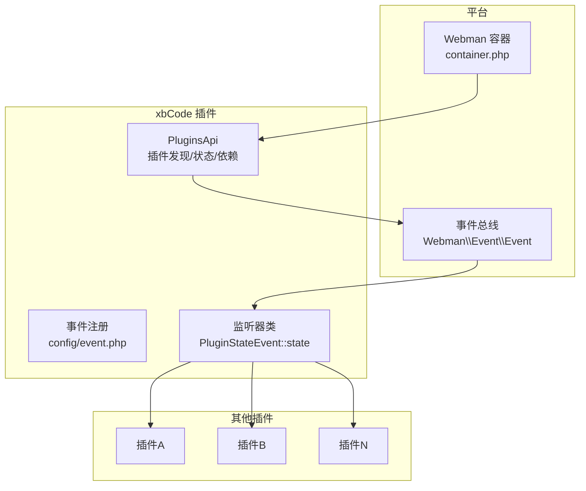
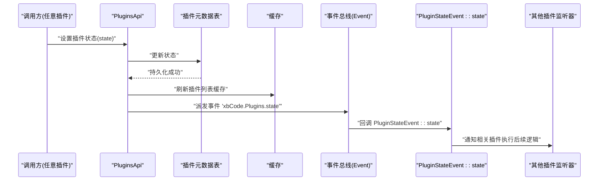
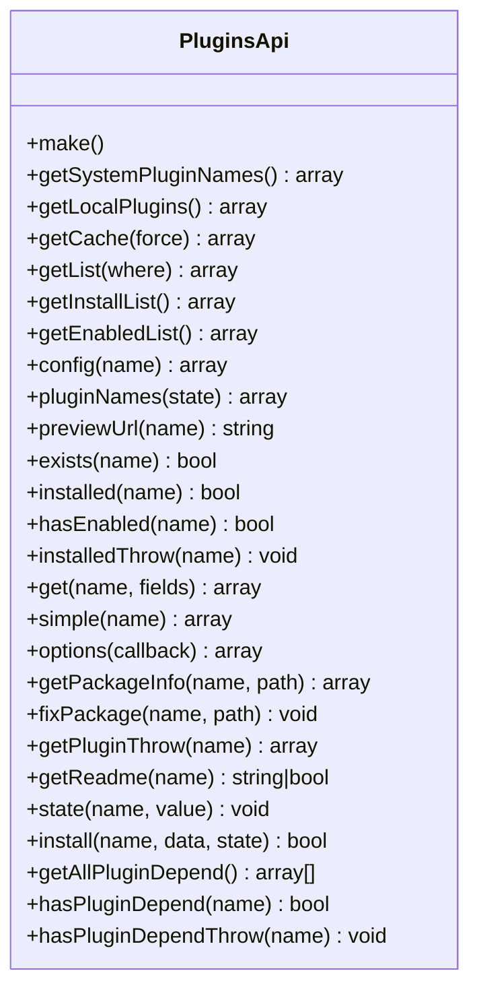
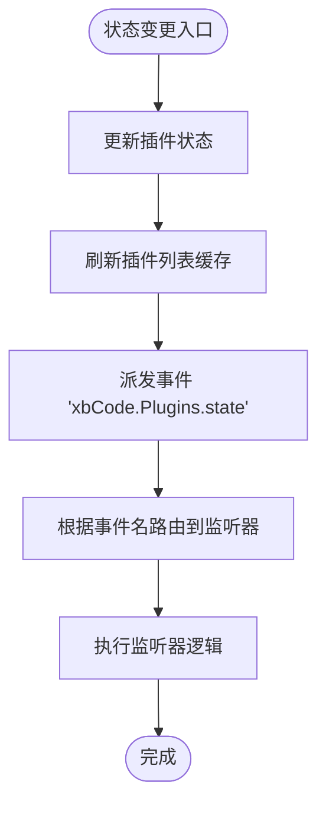
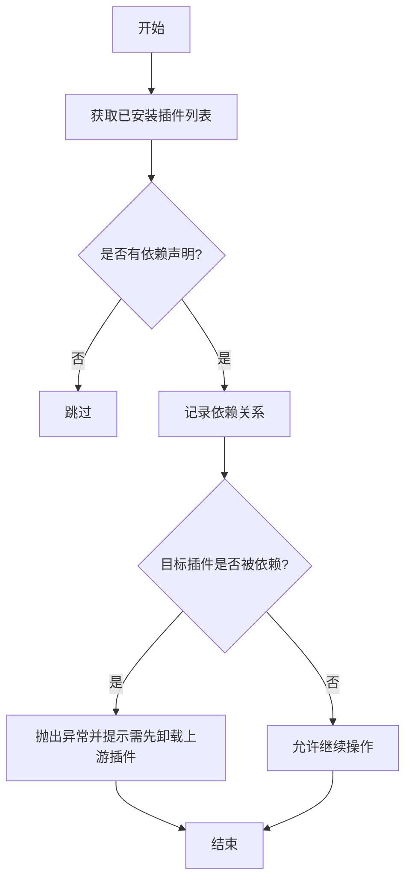
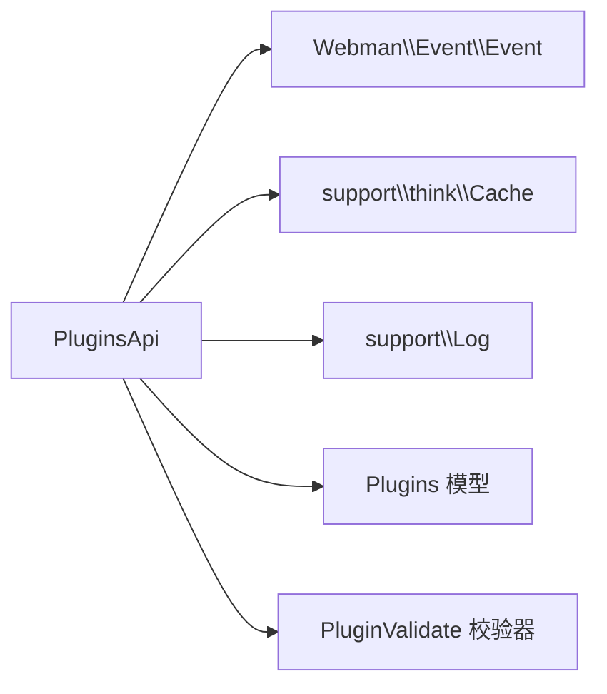

# 插件间通信机制

<cite>
**本文引用的文件**
- [PluginsApi.php](file://server/plugin\xbCode\api\PluginsApi.php)
- [event.php（xbCode）](file://server/plugin\xbCode\config\event.php)
- [event.php（全局）](file://server/config/event.php)
- [container.php（全局）](file://server/config/container.php)
- [container.php（xbCode）](file://server/plugin\xbCode\config\container.php)
</cite>

## 目录
1. [简介](#简介)
2. [项目结构](#项目结构)
3. [核心组件](#核心组件)
4. [架构总览](#架构总览)
5. [详细组件分析](#详细组件分析)
6. [依赖分析](#依赖分析)
7. [性能考虑](#性能考虑)
8. [故障排查指南](#故障排查指南)
9. [结论](#结论)
10. [附录](#附录)

## 简介
本文件面向积木云AI创作平台的插件体系，系统化阐述插件间的通信机制与能力边界。重点覆盖：
- 插件发现、状态查询、依赖管理
- 事件总线机制与消息传递模式
- 服务层抽象设计与接口规范
- 错误处理策略
- 解耦的模块通信与依赖注入实践

## 项目结构
围绕“插件间通信”的关键代码集中在 xbCode 插件中，提供统一的 PluginsApi 能力，并通过 Webman Event 实现跨插件的事件驱动通信；容器配置用于依赖注入。

图示来源
- [PluginsApi.php:1-684](file://server/plugin\xbCode\api\PluginsApi.php#L1-L684)
- [event.php（xbCode）:1-7](file://server/plugin\xbCode\config\event.php#L1-L7)
- [container.php（全局）:1-15](file://server/config/container.php#L1-L15)

章节来源
- [PluginsApi.php:1-684](file://server/plugin\xbCode\api\PluginsApi.php#L1-L684)
- [event.php（xbCode）:1-7](file://server/plugin\xbCode\config\event.php#L1-L7)
- [container.php（全局）:1-15](file://server/config/container.php#L1-L15)

## 核心组件
- 插件API服务层：统一暴露插件发现、状态查询、依赖管理等能力，作为插件间调用的基础设施。
- 事件总线：基于 Webman\Event\Event 发布订阅模型，实现插件间的异步解耦通信。
- 容器与依赖注入：通过 Webman\Container 在应用启动时完成服务实例化与注入，降低耦合度。

章节来源
- [PluginsApi.php:1-684](file://server/plugin\xbCode\api\PluginsApi.php#L1-L684)
- [container.php（全局）:1-15](file://server/config/container.php#L1-L15)

## 架构总览
下图展示“插件状态变更”这一典型场景下的调用链与事件传播路径。

图示来源
- [PluginsApi.php:578-598](file://server/plugin\xbCode\api\PluginsApi.php#L578-L598)
- [event.php（xbCode）:1-7](file://server/plugin\xbCode\config\event.php#L1-L7)

## 详细组件分析

### 插件API服务层（PluginsApi）
职责与能力
- 插件发现：扫描本地插件清单，解析 plugins.json，返回插件基础信息。
- 状态查询：获取已安装/已启用列表，支持按字段筛选。
- 依赖管理：汇总所有插件依赖，检测是否被其他插件依赖，阻止破坏性卸载。
- 生命周期钩子：在状态变更时触发事件，供其他插件响应。

关键方法说明（节选）
- 列表与缓存
  - getLocalPlugins/getPlugins/getCache/getList：读取本地插件清单并构建排序后的列表，结合缓存提升性能。
  - getInstallList/getEnabledList：便捷获取已安装/已启用列表。
- 存在性与可用性
  - exists/installed/hasEnabled：判断插件是否存在、是否安装、是否启用。
  - installedThrow/hasPluginDependThrow：在不符合条件时抛出异常，便于上层快速失败。
- 详情与选项
  - get/simple/options：获取插件详情（可过滤字段）、精简信息、生成下拉选项。
- 包校验与预览
  - verifyPackage/getPackageInfo/previewUrl：校验插件包完整性，生成预览图URL。
- 状态与安装
  - state/install：更新状态并刷新缓存，同时派发事件。
- 依赖分析
  - getAllPluginDepend/hasPluginDepend：统计依赖关系，防止误删。

图示来源
- [PluginsApi.php:1-684](file://server/plugin\xbCode\api\PluginsApi.php#L1-L684)

章节来源
- [PluginsApi.php:76-136](file://server/plugin\xbCode\api\PluginsApi.php#L76-L136)
- [PluginsApi.php:144-177](file://server/plugin\xbCode\api\PluginsApi.php#L144-L177)
- [PluginsApi.php:266-311](file://server/plugin\xbCode\api\PluginsApi.php#L266-L311)
- [PluginsApi.php:337-381](file://server/plugin\xbCode\api\PluginsApi.php#L337-L381)
- [PluginsApi.php:411-462](file://server/plugin\xbCode\api\PluginsApi.php#L411-L462)
- [PluginsApi.php:578-598](file://server/plugin\xbCode\api\PluginsApi.php#L578-L598)
- [PluginsApi.php:633-684](file://server/plugin\xbCode\api\PluginsApi.php#L633-L684)

### 事件总线与消息传递
- 事件命名空间：使用“xbCode.Plugins.state”作为插件状态变更事件名，避免与其他系统事件冲突。
- 事件注册：在插件配置中声明事件到监听器的映射，由框架在运行时加载。
- 监听器实现：监听器类负责接收事件载荷并协调其他插件行为。

图示来源
- [PluginsApi.php:578-598](file://server/plugin\xbCode\api\PluginsApi.php#L578-L598)
- [event.php（xbCode）:1-7](file://server/plugin\xbCode\config\event.php#L1-L7)

章节来源
- [PluginsApi.php:578-598](file://server/plugin\xbCode\api\PluginsApi.php#L578-L598)
- [event.php（xbCode）:1-7](file://server/plugin\xbCode\config\event.php#L1-L7)

### 依赖管理与安全卸载
- 依赖收集：遍历已安装插件，提取其声明的依赖项，形成依赖图谱。
- 子依赖检测：判断某插件是否被其他插件依赖，若存在则禁止直接卸载。
- 安全卸载流程：先解除依赖，再执行卸载，确保系统稳定性。

图示来源
- [PluginsApi.php:633-684](file://server/plugin\xbCode\api\PluginsApi.php#L633-L684)

章节来源
- [PluginsApi.php:633-684](file://server/plugin\xbCode\api\PluginsApi.php#L633-L684)

### 服务层抽象与接口规范
- 统一入口：通过 PluginsApi.make() 或依赖注入获取实例，屏蔽底层实现细节。
- 输入输出契约：
  - 输入参数以字符串标识、数组条件为主，保持简单明确。
  - 返回值以结构化数组为主，包含必要字段与可选扩展字段。
- 错误约定：
  - 对非法状态值、缺失文件、解析失败等场景抛出异常，便于上层捕获与降级。
  - 敏感调试信息仅在调试模式下记录日志，避免泄露。

章节来源
- [PluginsApi.php:53-57](file://server/plugin\xbCode\api\PluginsApi.php#L53-L57)
- [PluginsApi.php:337-358](file://server/plugin\xbCode\api\PluginsApi.php#L337-L358)
- [PluginsApi.php:578-598](file://server/plugin\xbCode\api\PluginsApi.php#L578-L598)

### 依赖注入与解耦通信
- 容器初始化：通过 container.php 返回 Webman\Container 实例，为后续依赖注入提供支撑。
- 插件内容器：各插件可维护自己的容器配置，按需注册服务。
- 解耦通信建议：
  - 优先使用事件总线进行跨插件通信，避免直接硬编码依赖。
  - 需要同步调用时，通过 PluginsApi 提供的稳定接口访问共享能力。

章节来源
- [container.php（全局）:1-15](file://server/config/container.php#L1-L15)
- [container.php（xbCode）:1-3](file://server/plugin\xbCode\config\container.php#L1-L3)

## 依赖分析
- 外部依赖
  - Webman\Event\Event：事件总线核心，用于跨插件广播与监听。
  - support\think\Cache：缓存读写，用于插件列表缓存。
  - support\Log：日志记录，用于调试信息落盘。
- 内部依赖
  - plugin\xbCode\app\model\Plugins：插件元数据持久化模型。
  - plugin\xbCode\app\validate\PluginValidate：插件包参数校验。

图示来源
- [PluginsApi.php:1-684](file://server/plugin\xbCode\api\PluginsApi.php#L1-L684)

章节来源
- [PluginsApi.php:1-684](file://server/plugin\xbCode\api\PluginsApi.php#L1-L684)

## 性能考虑
- 列表缓存：插件列表通过缓存键存储，减少重复IO与解析开销。
- 增量刷新：状态变更后仅刷新缓存，避免全量重建。
- 精简字段：simple 方法支持过滤冗余字段，降低传输体积。
- 依赖计算：依赖图谱仅在必要时构建，避免频繁全量扫描。

章节来源
- [PluginsApi.php:144-153](file://server/plugin\xbCode\api\PluginsApi.php#L144-L153)
- [PluginsApi.php:592-598](file://server/plugin\xbCode\api\PluginsApi.php#L592-L598)
- [PluginsApi.php:367-381](file://server/plugin\xbCode\api\PluginsApi.php#L367-L381)

## 故障排查指南
- 常见异常与定位
  - 插件不存在/未安装：检查插件标识与安装记录，确认 plugins.json 完整。
  - 状态值错误：确认传入的状态码为合法枚举值。
  - 依赖冲突：当尝试卸载被依赖插件时，先卸载上游插件。
- 日志与调试
  - 在调试模式下，异常信息会被记录至日志，便于回溯。
  - 可通过事件监听器打印事件载荷，验证事件是否正确分发。

章节来源
- [PluginsApi.php:337-358](file://server/plugin\xbCode\api\PluginsApi.php#L337-L358)
- [PluginsApi.php:578-598](file://server/plugin\xbCode\api\PluginsApi.php#L578-L598)
- [PluginsApi.php:674-684](file://server/plugin\xbCode\api\PluginsApi.php#L674-L684)

## 结论
通过 PluginsApi 提供的统一能力与事件总线机制，积木云平台实现了插件间的低耦合通信与高内聚管理。依赖图谱与安全卸载策略进一步保障了系统的稳定性与可演进性。建议在新增插件时遵循事件驱动与接口契约，充分利用容器与缓存优化性能。

## 附录

### 插件间调用示例（路径指引）
- 查询已启用插件列表
  - 参考路径：[PluginsApi.php:194-197](file://server/plugin\xbCode\api\PluginsApi.php#L194-L197)
- 检查插件是否已安装
  - 参考路径：[PluginsApi.php:282-292](file://server/plugin\xbCode\api\PluginsApi.php#L282-L292)
- 获取插件详情（精简字段）
  - 参考路径：[PluginsApi.php:367-381](file://server/plugin\xbCode\api\PluginsApi.php#L367-L381)
- 设置插件状态并触发事件
  - 参考路径：[PluginsApi.php:578-598](file://server/plugin\xbCode\api\PluginsApi.php#L578-L598)
- 事件监听器注册
  - 参考路径：[event.php（xbCode）:1-7](file://server/plugin\xbCode\config\event.php#L1-L7)