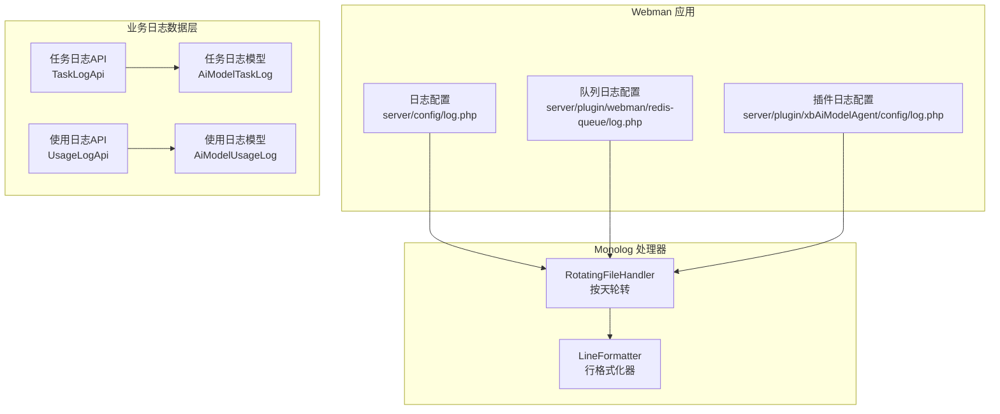
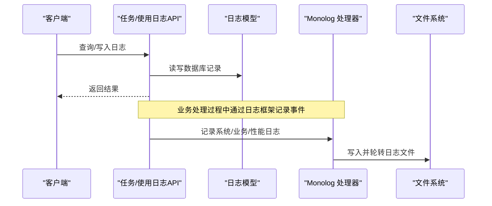
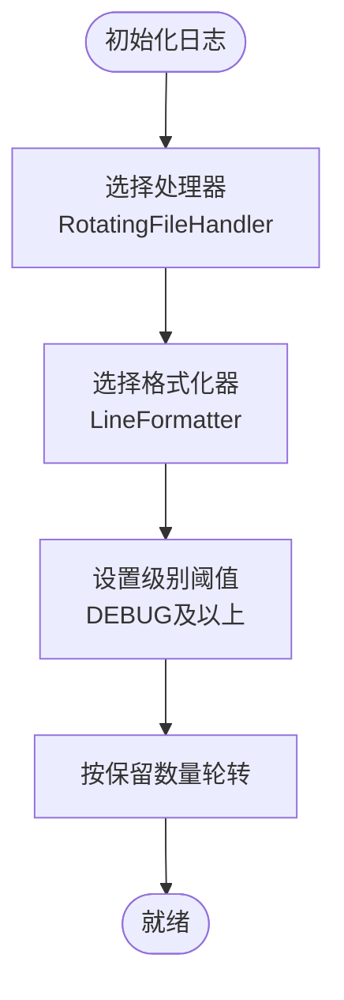
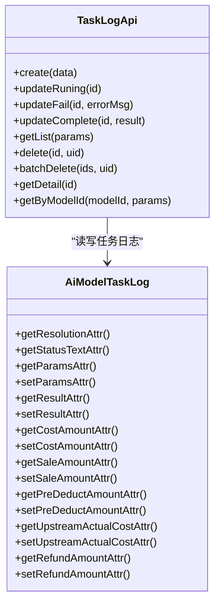
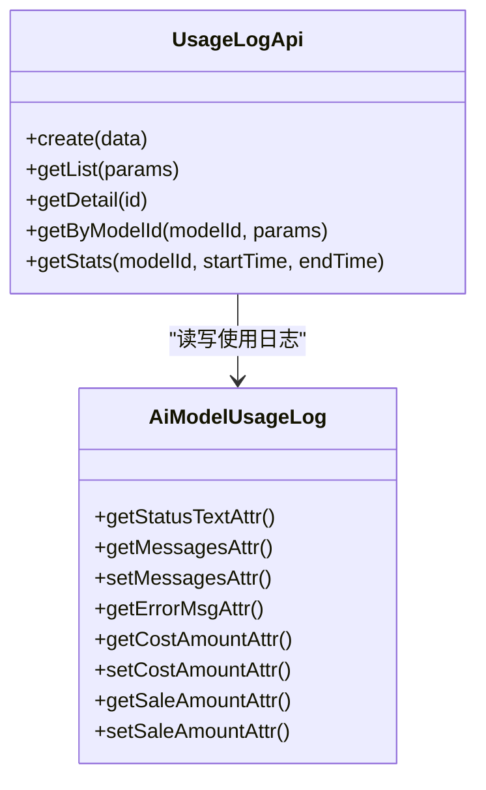
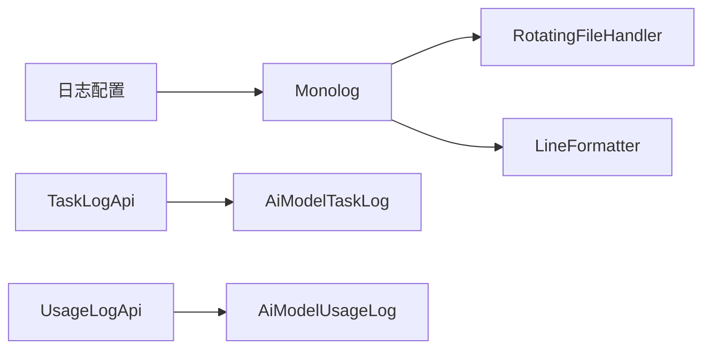

# 日志监控系统

<cite>
**本文引用的文件**   
- [server/config/log.php](file://server/config/log.php)
- [server/plugin/webman/redis-queue/log.php](file://server/plugin/webman/redis-queue/log.php)
- [server/plugin/xbAiModelAgent/config/log.php](file://server/plugin/xbAiModelAgent/config/log.php)
- [server/plugin/xbAiModelAgent/api/TaskLogApi.php](file://server/plugin/xbAiModelAgent/api/TaskLogApi.php)
- [server/plugin/xbAiModelAgent/api/UsageLogApi.php](file://server/plugin/xbAiModelAgent/api/UsageLogApi.php)
- [server/plugin/xbAiModelAgent/app/model/AiModelTaskLog.php](file://server/plugin/xbAiModelAgent/app/model/AiModelTaskLog.php)
- [server/plugin/xbAiModelAgent/app/model/AiModelUsageLog.php](file://server/plugin/xbAiModelAgent/app/model/AiModelUsageLog.php)
</cite>

## 目录
1. [简介](#简介)
2. [项目结构](#项目结构)
3. [核心组件](#核心组件)
4. [架构总览](#架构总览)
5. [详细组件分析](#详细组件分析)
6. [依赖分析](#依赖分析)
7. [性能考虑](#性能考虑)
8. [故障排查指南](#故障排查指南)
9. [结论](#结论)
10. [附录](#附录)

## 简介
本文件为积木云AI创作平台的“日志监控系统”文档，聚焦以下目标：
- 多级别日志记录与轮转策略
- 结构化日志格式规范
- 业务日志、系统日志、性能日志的分类收集与分析
- 日志查询接口与监控指标采集
- 告警规则配置建议
- 基于日志的问题诊断与性能优化方法

说明：当前仓库已实现基于 Monolog 的日志框架与任务/使用日志的数据模型与API。本文在现有实现基础上，给出扩展与落地方案，确保可观测性与可运维性。

## 项目结构
后端采用 webman + Monolog 作为日志基础设施；插件 xbAiModelAgent 提供 AI 任务日志与使用日志的数据模型与查询接口。前端未包含日志采集与可视化能力，本文主要围绕后端日志体系展开。

图表来源
- [server/config/log.php:15-32](file://server/config/log.php#L15-L32)
- [server/plugin/webman/redis-queue/log.php:18-25](file://server/plugin/webman/redis-queue/log.php#L18-L25)
- [server/plugin/xbAiModelAgent/config/log.php:4-20](file://server/plugin/xbAiModelAgent/config/log.php#L4-L20)
- [server/plugin/xbAiModelAgent/api/TaskLogApi.php:1-263](file://server/plugin/xbAiModelAgent/api/TaskLogApi.php#L1-L263)
- [server/plugin/xbAiModelAgent/api/UsageLogApi.php:1-153](file://server/plugin/xbAiModelAgent/api/UsageLogApi.php#L1-L153)
- [server/plugin/xbAiModelAgent/app/model/AiModelTaskLog.php:1-211](file://server/plugin/xbAiModelAgent/app/model/AiModelTaskLog.php#L1-L211)
- [server/plugin/xbAiModelAgent/app/model/AiModelUsageLog.php:1-111](file://server/plugin/xbAiModelAgent/app/model/AiModelUsageLog.php#L1-L111)

章节来源
- [server/config/log.php:15-32](file://server/config/log.php#L15-L32)
- [server/plugin/webman/redis-queue/log.php:18-25](file://server/plugin/webman/redis-queue/log.php#L18-L25)
- [server/plugin/xbAiModelAgent/config/log.php:4-20](file://server/plugin/xbAiModelAgent/config/log.php#L4-L20)

## 核心组件
- 日志框架与处理器
  - 使用 Monolog 的 RotatingFileHandler 进行文件输出与自动轮转，默认保留最近若干份日志文件，便于回溯与归档。
  - 使用 LineFormatter 输出单行文本日志，时间戳格式统一。
- 日志分类与级别
  - 系统日志：进程启动、错误堆栈、异常捕获等。
  - 业务日志：任务创建、状态变更、结果回写、费用结算等。
  - 性能日志：耗时、吞吐、资源占用等关键指标。
- 业务日志数据层
  - 任务日志（AiModelTaskLog）：记录一次AI任务的完整生命周期与结果。
  - 使用日志（AiModelUsageLog）：记录模型调用用量、Token统计与计费相关字段。
- 日志查询接口
  - 任务日志API：支持分页、多维度筛选（用户、模型、模态、状态、时间范围）、详情与删除。
  - 使用日志API：支持分页、维度筛选、详情与按模型聚合统计。

章节来源
- [server/config/log.php:15-32](file://server/config/log.php#L15-L32)
- [server/plugin/xbAiModelAgent/api/TaskLogApi.php:155-188](file://server/plugin/xbAiModelAgent/api/TaskLogApi.php#L155-L188)
- [server/plugin/xbAiModelAgent/api/UsageLogApi.php:59-87](file://server/plugin/xbAiModelAgent/api/UsageLogApi.php#L59-L87)
- [server/plugin/xbAiModelAgent/app/model/AiModelTaskLog.php:22-211](file://server/plugin/xbAiModelAgent/app/model/AiModelTaskLog.php#L22-L211)
- [server/plugin/xbAiModelAgent/app/model/AiModelUsageLog.php:20-111](file://server/plugin/xbAiModelAgent/app/model/AiModelUsageLog.php#L20-L111)

## 架构总览
下图展示从请求到日志落盘与业务日志持久化的整体链路。

图表来源
- [server/plugin/xbAiModelAgent/api/TaskLogApi.php:1-263](file://server/plugin/xbAiModelAgent/api/TaskLogApi.php#L1-L263)
- [server/plugin/xbAiModelAgent/api/UsageLogApi.php:1-153](file://server/plugin/xbAiModelAgent/api/UsageLogApi.php#L1-L153)
- [server/config/log.php:15-32](file://server/config/log.php#L15-L32)

## 详细组件分析

### 日志框架与轮转策略
- 处理器：RotatingFileHandler
  - 作用：将日志写入文件并按保留数量自动轮转，避免单文件无限增长。
  - 配置位置：
    - 全局：server/config/log.php
    - 队列：server/plugin/webman/redis-queue/log.php
    - 插件：server/plugin/xbAiModelAgent/config/log.php
- 格式化器：LineFormatter
  - 作用：统一输出单行日志，包含时间戳等基础信息。
- 级别控制：DEBUG 及以上级别均可输出，可按需调整。

图表来源
- [server/config/log.php:15-32](file://server/config/log.php#L15-L32)
- [server/plugin/webman/redis-queue/log.php:18-25](file://server/plugin/webman/redis-queue/log.php#L18-L25)
- [server/plugin/xbAiModelAgent/config/log.php:4-20](file://server/plugin/xbAiModelAgent/config/log.php#L4-L20)

章节来源
- [server/config/log.php:15-32](file://server/config/log.php#L15-L32)
- [server/plugin/webman/redis-queue/log.php:18-25](file://server/plugin/webman/redis-queue/log.php#L18-L25)
- [server/plugin/xbAiModelAgent/config/log.php:4-20](file://server/plugin/xbAiModelAgent/config/log.php#L4-L20)

### 结构化日志格式规范
建议字段（键名）与类型：
- timestamp: string，ISO8601或统一时间格式
- level: string，如 DEBUG/INFO/WARN/ERROR
- service: string，服务/模块名（如 xbAiModelAgent）
- trace_id: string，请求追踪ID（贯穿上下游）
- uid: int|string，用户标识
- model_id: string，模型标识
- action: string，动作（如 create/run/complete/fail）
- duration_ms: number，耗时毫秒
- status: string，业务状态码或枚举值
- error_code: string，错误码
- message: string，人类可读消息
- extra: object，扩展字段（按需）

说明：
- 当前使用 LineFormatter 输出单行文本，建议在业务代码中构造上述结构的对象，再序列化为JSON字符串写入日志，以便后续解析与检索。
- 对敏感字段（如密钥、口令）务必脱敏。

[本节为通用规范说明，不直接分析具体文件]

### 业务日志、系统日志、性能日志分类
- 系统日志
  - 内容：进程启动、重启、异常堆栈、外部依赖连接失败等。
  - 级别：WARN/ERROR为主，必要时DEBUG。
  - 关键字段：service、trace_id、error_code、message。
- 业务日志
  - 内容：任务创建、执行、完成、失败、费用结算等。
  - 级别：INFO为主，异常用ERROR。
  - 关键字段：uid、model_id、action、status、duration_ms。
- 性能日志
  - 内容：接口耗时、队列消费耗时、DB/缓存访问耗时、CPU/内存峰值等。
  - 级别：INFO/WARN。
  - 关键字段：duration_ms、resource_usage、extra。

[本节为通用规范说明，不直接分析具体文件]

### 任务日志数据模型与API
- 数据模型（AiModelTaskLog）
  - 软删除、附加属性（如分辨率组合、状态文本）。
  - JSON字段自动序列化/反序列化（参数、结果）。
  - 金额类字段数值化转换。
- API（TaskLogApi）
  - 创建、更新状态（运行中/失败/完成）、删除、批量删除。
  - 列表查询：支持 uid、model_id、modality、status、时间范围筛选与分页。
  - 详情获取、按模型ID查询。

图表来源
- [server/plugin/xbAiModelAgent/app/model/AiModelTaskLog.php:22-211](file://server/plugin/xbAiModelAgent/app/model/AiModelTaskLog.php#L22-L211)
- [server/plugin/xbAiModelAgent/api/TaskLogApi.php:46-263](file://server/plugin/xbAiModelAgent/api/TaskLogApi.php#L46-L263)

章节来源
- [server/plugin/xbAiModelAgent/app/model/AiModelTaskLog.php:22-211](file://server/plugin/xbAiModelAgent/app/model/AiModelTaskLog.php#L22-L211)
- [server/plugin/xbAiModelAgent/api/TaskLogApi.php:155-188](file://server/plugin/xbAiModelAgent/api/TaskLogApi.php#L155-L188)

### 使用日志数据模型与API
- 数据模型（AiModelUsageLog）
  - 状态文本获取器、消息数组序列化/反序列化。
  - 金额字段数值化转换。
- API（UsageLogApi）
  - 创建、列表查询（uid、model_id、status、时间范围）、详情。
  - 按模型ID查询。
  - 统计接口：汇总成功记录的输入/输出/总Token数与次数。

图表来源
- [server/plugin/xbAiModelAgent/app/model/AiModelUsageLog.php:20-111](file://server/plugin/xbAiModelAgent/app/model/AiModelUsageLog.php#L20-L111)
- [server/plugin/xbAiModelAgent/api/UsageLogApi.php:45-153](file://server/plugin/xbAiModelAgent/api/UsageLogApi.php#L45-L153)

章节来源
- [server/plugin/xbAiModelAgent/api/UsageLogApi.php:119-152](file://server/plugin/xbAiModelAgent/api/UsageLogApi.php#L119-L152)

### 日志查询接口定义（摘要）
- 任务日志
  - 列表：支持 uid、model_id、modality、status、start_time、end_time、分页。
  - 详情：按id获取。
  - 删除/批量删除：需要uid校验归属。
- 使用日志
  - 列表：支持 uid、model_id、status、start_time、end_time、分页。
  - 详情：按id获取。
  - 统计：按模型ID与时间范围聚合 Token 与次数。

章节来源
- [server/plugin/xbAiModelAgent/api/TaskLogApi.php:155-188](file://server/plugin/xbAiModelAgent/api/TaskLogApi.php#L155-L188)
- [server/plugin/xbAiModelAgent/api/UsageLogApi.php:59-87](file://server/plugin/xbAiModelAgent/api/UsageLogApi.php#L59-L87)
- [server/plugin/xbAiModelAgent/api/UsageLogApi.php:119-152](file://server/plugin/xbAiModelAgent/api/UsageLogApi.php#L119-L152)

### 监控指标采集建议
- 系统级
  - CPU、内存、磁盘IO、网络带宽、文件描述符数。
- 应用级
  - QPS、P95/P99延迟、错误率、重试率、超时率。
- 业务级
  - 任务成功率、平均耗时、失败原因分布、Token消耗总量、成本/收入比。
- 采集方式
  - 在业务API中埋点，将指标以结构化日志输出，由采集器抓取后入时序库（如 Prometheus/Grafana）。
  - 或使用平台自带监控进程（如有）结合日志关键字进行统计。

[本节为通用实践说明，不直接分析具体文件]

### 告警规则配置建议
- 错误率告警：单位时间内 ERROR 级别日志占比超过阈值。
- 慢请求告警：duration_ms 超过阈值（如 P95 > 2s）。
- 任务失败告警：连续失败次数或失败率超阈。
- 资源告警：磁盘空间不足、内存/CPU持续高位。
- 业务告警：Token消耗突增、成本异常波动。

[本节为通用实践说明，不直接分析具体文件]

### 日志记录示例（路径指引）
- 系统日志示例：在异常捕获处记录错误堆栈与上下文。
  - 参考路径：[server/config/log.php:15-32](file://server/config/log.php#L15-L32)
- 业务日志示例：任务创建/状态变更时记录 action、uid、model_id、status、duration_ms。
  - 参考路径：[server/plugin/xbAiModelAgent/api/TaskLogApi.php:86-148](file://server/plugin/xbAiModelAgent/api/TaskLogApi.php#L86-L148)
- 性能日志示例：在关键流程前后打点计算耗时。
  - 参考路径：[server/plugin/xbAiModelAgent/api/UsageLogApi.php:59-87](file://server/plugin/xbAiModelAgent/api/UsageLogApi.php#L59-L87)

[本节仅给出路径指引，不包含具体代码内容]

## 依赖分析
- 日志框架依赖
  - Monolog\Handler\RotatingFileHandler：负责文件输出与轮转。
  - Monolog\Formatter\LineFormatter：负责行格式化。
- 业务依赖
  - TaskLogApi 依赖 AiModelTaskLog 模型。
  - UsageLogApi 依赖 AiModelUsageLog 模型。

图表来源
- [server/config/log.php:15-32](file://server/config/log.php#L15-L32)
- [server/plugin/xbAiModelAgent/api/TaskLogApi.php:1-263](file://server/plugin/xbAiModelAgent/api/TaskLogApi.php#L1-L263)
- [server/plugin/xbAiModelAgent/api/UsageLogApi.php:1-153](file://server/plugin/xbAiModelAgent/api/UsageLogApi.php#L1-L153)

章节来源
- [server/config/log.php:15-32](file://server/config/log.php#L15-L32)
- [server/plugin/xbAiModelAgent/api/TaskLogApi.php:1-263](file://server/plugin/xbAiModelAgent/api/TaskLogApi.php#L1-L263)
- [server/plugin/xbAiModelAgent/api/UsageLogApi.php:1-153](file://server/plugin/xbAiModelAgent/api/UsageLogApi.php#L1-L153)

## 性能考虑
- 日志级别控制
  - 生产环境建议 INFO 及以上，减少 DEBUG 开销。
- 异步写入
  - 在高并发场景下，可将日志写入改为异步（如通过队列），降低主流程延迟。
- 采样与降采样
  - 对高频日志进行采样，避免风暴。
- 字段精简
  - 避免在日志中写入大对象或敏感信息，减少I/O与存储压力。
- 轮转策略
  - 合理设置保留数量与文件大小，定期归档至冷存储。

[本节为通用指导，不直接分析具体文件]

## 故障排查指南
- 快速定位
  - 通过 trace_id 串联请求全链路日志。
  - 使用任务日志API按 uid、model_id、status、时间范围筛选，缩小范围。
- 常见问题
  - 任务失败：查看 updateFail 分支的错误信息与状态。
  - 超时：检查 duration_ms 与前端超时策略是否匹配。
  - Token异常：核对 getStats 聚合结果与上游账单。
- 日志文件问题
  - 确认轮转配置生效，检查磁盘空间与权限。
  - 若出现大量重复日志，检查是否重复埋点或循环触发。

章节来源
- [server/plugin/xbAiModelAgent/api/TaskLogApi.php:109-148](file://server/plugin/xbAiModelAgent/api/TaskLogApi.php#L109-L148)
- [server/plugin/xbAiModelAgent/api/UsageLogApi.php:119-152](file://server/plugin/xbAiModelAgent/api/UsageLogApi.php#L119-L152)
- [server/config/log.php:15-32](file://server/config/log.php#L15-L32)

## 结论
本项目已具备完善的日志基础设施与业务日志数据层。通过统一的日志格式、合理的轮转策略、清晰的分类与查询接口，可有效支撑问题诊断与性能优化。建议进一步引入指标采集与告警机制，形成闭环的可观测体系。

[本节为总结性内容，不直接分析具体文件]

## 附录
- 术语
  - 任务日志：记录一次AI任务的生命周期与结果。
  - 使用日志：记录模型调用的用量与计费相关数据。
  - 轮转：按时间或大小切分日志文件，保留历史副本。
- 最佳实践
  - 所有关键路径必须记录结构化日志。
  - 对外部依赖调用增加错误码与重试次数。
  - 定期复盘告警规则，避免误报与漏报。

[本节为补充说明，不直接分析具体文件]