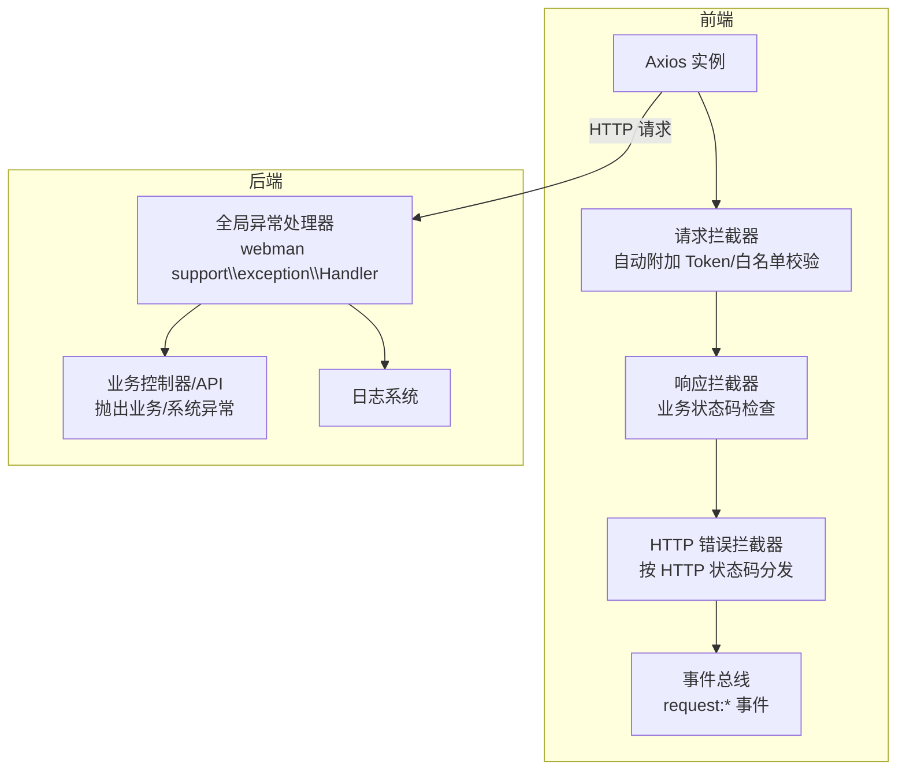
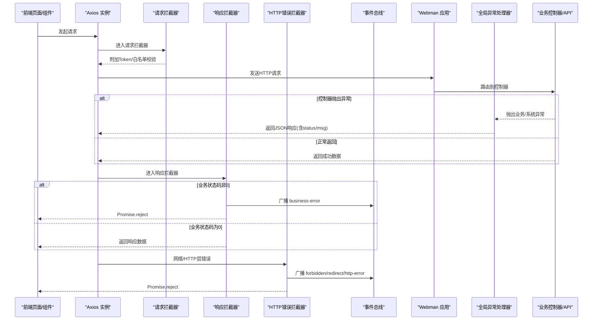
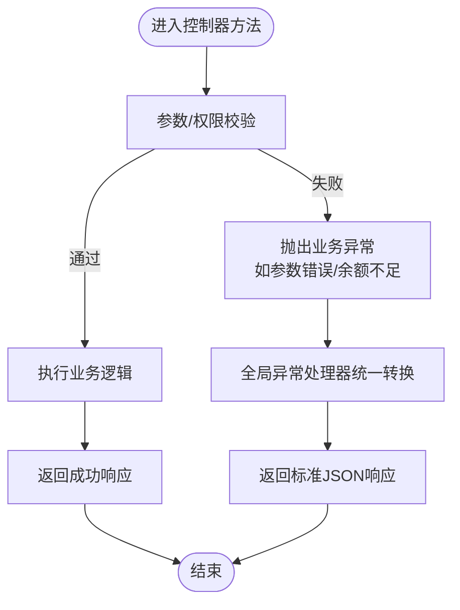
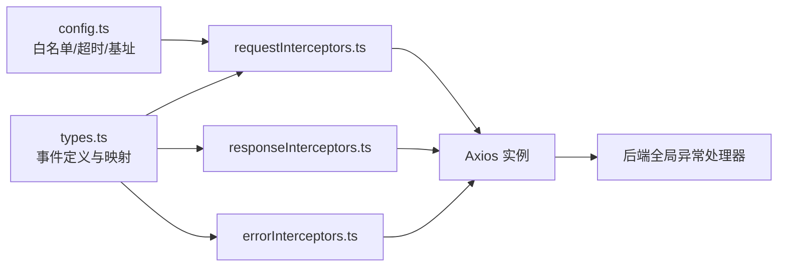

# 错误处理策略

<cite>
**本文引用的文件**
- [server/config/exception.php](file://server/config/exception.php)
- [frontend/src/utils/request/errorInterceptors.ts](file://frontend/src/utils/request/errorInterceptors.ts)
- [frontend/src/utils/request/responseInterceptors.ts](file://frontend/src/utils/request/responseInterceptors.ts)
- [frontend/src/utils/request/requestInterceptors.ts](file://frontend/src/utils/request/requestInterceptors.ts)
- [frontend/src/utils/request/types.ts](file://frontend/src/utils/request/types.ts)
- [frontend/src/utils/request/config.ts](file://frontend/src/utils/request/config.ts)
- [server/plugin/xbAiModelAgent/api/ChatApi.php](file://server/plugin/xbAiModelAgent/api/ChatApi.php)
- [server/plugin/xbAiModelAgent/api/MediaApi.php](file://server/plugin/xbAiModelAgent/api/MediaApi.php)
- [server/plugin/xbAiModelAgent/api/TaskLogApi.php](file://server/plugin/xbAiModelAgent/api/TaskLogApi.php)
- [server/plugin/xbAiModelAgent/app/api/controller/ChatController.php](file://server/plugin/xbAiModelAgent/app/api/controller/ChatController.php)
- [server/plugin/xbAiModelAgent/app/api/controller/MediaController.php](file://server/plugin/xbAiModelAgent/app/api/controller/MediaController.php)
- [server/plugin/xbAiModelAgent/app/api/controller/ModelLogController.php](file://server/plugin/xbAiModelAgent/app/api/controller/ModelLogController.php)
</cite>

## 目录
1. [引言](#引言)
2. [项目结构](#项目结构)
3. [核心组件](#核心组件)
4. [架构总览](#架构总览)
5. [详细组件分析](#详细组件分析)
6. [依赖关系分析](#依赖关系分析)
7. [性能与稳定性考量](#性能与稳定性考量)
8. [故障排查指南](#故障排查指南)
9. [结论](#结论)
10. [附录：错误码规范与示例](#附录错误码规范与示例)

## 引言
本文件为积木云AI创作平台的错误处理策略文档，覆盖前后端统一的异常捕获、分类处理、错误码规范、日志记录与监控告警、调试信息输出以及生产环境错误屏蔽。目标是在保证用户体验的同时，提供可观测、可定位、可恢复的错误处理能力。

## 项目结构
本项目采用前后端分离架构：
- 前端基于 Vue + Axios，通过拦截器统一处理请求/响应错误，并以事件总线广播错误类型，供页面或全局监听处理。
- 后端基于 Webman（PHP），通过全局异常处理器将业务异常转换为标准 JSON 响应；控制器中抛出特定异常以表达认证失败等语义。

图表来源
- [frontend/src/utils/request/requestInterceptors.ts:1-47](file://frontend/src/utils/request/requestInterceptors.ts#L1-L47)
- [frontend/src/utils/request/responseInterceptors.ts:1-24](file://frontend/src/utils/request/responseInterceptors.ts#L1-L24)
- [frontend/src/utils/request/errorInterceptors.ts:1-57](file://frontend/src/utils/request/errorInterceptors.ts#L1-L57)
- [frontend/src/utils/request/types.ts:1-40](file://frontend/src/utils/request/types.ts#L1-L40)
- [server/config/exception.php:1-17](file://server/config/exception.php#L1-L17)

章节来源
- [frontend/src/utils/request/requestInterceptors.ts:1-47](file://frontend/src/utils/request/requestInterceptors.ts#L1-L47)
- [frontend/src/utils/request/responseInterceptors.ts:1-24](file://frontend/src/utils/request/responseInterceptors.ts#L1-L24)
- [frontend/src/utils/request/errorInterceptors.ts:1-57](file://frontend/src/utils/request/errorInterceptors.ts#L1-L57)
- [frontend/src/utils/request/types.ts:1-40](file://frontend/src/utils/request/types.ts#L1-L40)
- [server/config/exception.php:1-17](file://server/config/exception.php#L1-L17)

## 核心组件
- 全局异常处理器（后端）
  - 通过配置映射默认异常处理器，用于统一捕获未处理异常并返回标准化响应。
- 前端请求拦截器
  - 自动设置通用请求头、Token 注入、白名单放行、非白名单无 Token 拒绝。
- 前端响应拦截器
  - 对业务状态码进行统一判断，触发“业务错误”事件并拒绝 Promise。
- 前端 HTTP 错误拦截器
  - 根据 HTTP 状态码分发到不同事件（403、301/302、其他）。
- 事件模型与名称映射
  - 定义统一的错误事件负载结构与事件名映射，便于集中式监听与处理。

章节来源
- [server/config/exception.php:1-17](file://server/config/exception.php#L1-L17)
- [frontend/src/utils/request/requestInterceptors.ts:1-47](file://frontend/src/utils/request/requestInterceptors.ts#L1-L47)
- [frontend/src/utils/request/responseInterceptors.ts:1-24](file://frontend/src/utils/request/responseInterceptors.ts#L1-L24)
- [frontend/src/utils/request/errorInterceptors.ts:1-57](file://frontend/src/utils/request/errorInterceptors.ts#L1-L57)
- [frontend/src/utils/request/types.ts:1-40](file://frontend/src/utils/request/types.ts#L1-L40)

## 架构总览
下图展示一次 API 调用从前端发起、经过拦截器、到达后端控制器、再由全局异常处理器统一返回的完整链路。

图表来源
- [frontend/src/utils/request/requestInterceptors.ts:1-47](file://frontend/src/utils/request/requestInterceptors.ts#L1-L47)
- [frontend/src/utils/request/responseInterceptors.ts:1-24](file://frontend/src/utils/request/responseInterceptors.ts#L1-L24)
- [frontend/src/utils/request/errorInterceptors.ts:1-57](file://frontend/src/utils/request/errorInterceptors.ts#L1-L57)
- [frontend/src/utils/request/types.ts:1-40](file://frontend/src/utils/request/types.ts#L1-L40)
- [server/config/exception.php:1-17](file://server/config/exception.php#L1-L17)

## 详细组件分析

### 后端全局异常处理与控制器异常
- 全局异常处理器
  - 通过配置文件将空键映射至支持库的默认处理器，用于统一捕获未处理异常并生成标准响应。
- 控制器中的异常使用
  - 在 AI 模型相关 API 中，常见于参数校验失败、资源不存在、余额不足、任务状态更新失败等场景，抛出运行时异常或自定义认证异常。
  - 认证类异常由中间件或控制器抛出，用于表示未登录或权限不足。

图表来源
- [server/config/exception.php:1-17](file://server/config/exception.php#L1-L17)
- [server/plugin/xbAiModelAgent/api/ChatApi.php:61-78](file://server/plugin/xbAiModelAgent/api/ChatApi.php#L61-L78)
- [server/plugin/xbAiModelAgent/api/MediaApi.php:52-61](file://server/plugin/xbAiModelAgent/api/MediaApi.php#L52-L61)
- [server/plugin/xbAiModelAgent/api/TaskLogApi.php:67-145](file://server/plugin/xbAiModelAgent/api/TaskLogApi.php#L67-L145)
- [server/plugin/xbAiModelAgent/app/api/controller/ChatController.php:54-54](file://server/plugin/xbAiModelAgent/app/api/controller/ChatController.php#L54-L54)
- [server/plugin/xbAiModelAgent/app/api/controller/MediaController.php:93-93](file://server/plugin/xbAiModelAgent/app/api/controller/MediaController.php#L93-L93)
- [server/plugin/xbAiModelAgent/app/api/controller/ModelLogController.php:38-53](file://server/plugin/xbAiModelAgent/app/api/controller/ModelLogController.php#L38-L53)

章节来源
- [server/config/exception.php:1-17](file://server/config/exception.php#L1-L17)
- [server/plugin/xbAiModelAgent/api/ChatApi.php:61-78](file://server/plugin/xbAiModelAgent/api/ChatApi.php#L61-L78)
- [server/plugin/xbAiModelAgent/api/MediaApi.php:52-61](file://server/plugin/xbAiModelAgent/api/MediaApi.php#L52-L61)
- [server/plugin/xbAiModelAgent/api/TaskLogApi.php:67-145](file://server/plugin/xbAiModelAgent/api/TaskLogApi.php#L67-L145)
- [server/plugin/xbAiModelAgent/app/api/controller/ChatController.php:54-54](file://server/plugin/xbAiModelAgent/app/api/controller/ChatController.php#L54-L54)
- [server/plugin/xbAiModelAgent/app/api/controller/MediaController.php:93-93](file://server/plugin/xbAiModelAgent/app/api/controller/MediaController.php#L93-L93)
- [server/plugin/xbAiModelAgent/app/api/controller/ModelLogController.php:38-53](file://server/plugin/xbAiModelAgent/app/api/controller/ModelLogController.php#L38-L53)

### 前端请求拦截器（Token 注入与白名单）
- 功能要点
  - 自动设置 accept、X-Requested-With、Content-Type（FormData 除外）。
  - 白名单接口无需 Token；非白名单若无 Token 则直接拒绝并提示重新登录。
  - 为后续鉴权与审计提供基础上下文。
- 建议
  - 白名单应最小化且受控，避免敏感接口被绕过。
  - 对 Token 获取函数进行健壮性保护，防止空指针导致请求中断。

章节来源
- [frontend/src/utils/request/requestInterceptors.ts:1-47](file://frontend/src/utils/request/requestInterceptors.ts#L1-L47)
- [frontend/src/utils/request/config.ts:1-39](file://frontend/src/utils/request/config.ts#L1-L39)

### 前端响应拦截器（业务错误）
- 功能要点
  - 当响应体业务状态码不为 0 时，广播“business-error”事件并拒绝 Promise。
  - 携带 message、status、url、response 等上下文，便于上层统一处理。
- 建议
  - 业务状态码应与后端约定一致，避免歧义。
  - 对于可重试的业务错误（如限流），可在监听处实现退避重试。

章节来源
- [frontend/src/utils/request/responseInterceptors.ts:1-24](file://frontend/src/utils/request/responseInterceptors.ts#L1-L24)
- [frontend/src/utils/request/types.ts:1-40](file://frontend/src/utils/request/types.ts#L1-L40)

### 前端 HTTP 错误拦截器（网络/HTTP层）
- 功能要点
  - 针对 403 广播“forbidden”，301/302 分别广播重定向事件，其他错误广播“http-error”。
  - 附带 URL、状态码、响应体等上下文，便于定位问题。
- 建议
  - 对重定向事件，可根据 location 执行跳转或刷新。
  - 对网络错误，可提供用户友好的提示与重试入口。

章节来源
- [frontend/src/utils/request/errorInterceptors.ts:1-57](file://frontend/src/utils/request/errorInterceptors.ts#L1-L57)
- [frontend/src/utils/request/types.ts:1-40](file://frontend/src/utils/request/types.ts#L1-L40)

### 事件模型与名称映射
- 设计要点
  - 统一事件负载 RequestEventDetail，包含 type、message、status、url、response。
  - 通过 requestEventNameMap 将错误类型映射到具体事件名，降低耦合。
- 建议
  - 新增错误类型时，同步扩展类型定义与映射表，保持强类型约束。

章节来源
- [frontend/src/utils/request/types.ts:1-40](file://frontend/src/utils/request/types.ts#L1-L40)

## 依赖关系分析
- 前端模块间依赖
  - 请求/响应/错误拦截器均依赖 types.ts 的事件定义与映射。
  - 请求拦截器依赖 config.ts 的白名单与 baseURL 配置。
- 前后端契约
  - 后端通过全局异常处理器返回标准 JSON（含 status/msg），前端据此判定业务成功与否。
  - 认证失败通过特定异常（如未登录）在后端表达，前端通过 403/401 或业务状态码感知。

图表来源
- [frontend/src/utils/request/types.ts:1-40](file://frontend/src/utils/request/types.ts#L1-L40)
- [frontend/src/utils/request/requestInterceptors.ts:1-47](file://frontend/src/utils/request/requestInterceptors.ts#L1-L47)
- [frontend/src/utils/request/responseInterceptors.ts:1-24](file://frontend/src/utils/request/responseInterceptors.ts#L1-L24)
- [frontend/src/utils/request/errorInterceptors.ts:1-57](file://frontend/src/utils/request/errorInterceptors.ts#L1-L57)
- [frontend/src/utils/request/config.ts:1-39](file://frontend/src/utils/request/config.ts#L1-L39)
- [server/config/exception.php:1-17](file://server/config/exception.php#L1-L17)

章节来源
- [frontend/src/utils/request/types.ts:1-40](file://frontend/src/utils/request/types.ts#L1-L40)
- [frontend/src/utils/request/requestInterceptors.ts:1-47](file://frontend/src/utils/request/requestInterceptors.ts#L1-L47)
- [frontend/src/utils/request/responseInterceptors.ts:1-24](file://frontend/src/utils/request/responseInterceptors.ts#L1-L24)
- [frontend/src/utils/request/errorInterceptors.ts:1-57](file://frontend/src/utils/request/errorInterceptors.ts#L1-L57)
- [frontend/src/utils/request/config.ts:1-39](file://frontend/src/utils/request/config.ts#L1-L39)
- [server/config/exception.php:1-17](file://server/config/exception.php#L1-L17)

## 性能与稳定性考量
- 超时与重试
  - 前端默认超时时间适中，建议在业务层对幂等请求实现指数退避重试，避免雪崩。
- 白名单控制
  - 白名单匹配支持通配符，但应避免过于宽泛的正则导致性能损耗。
- 日志与监控
  - 后端全局异常处理器应接入结构化日志与指标上报，关键错误需触发告警。
- 降级与熔断
  - 对第三方服务（如 AIGC 任务创建）失败时，快速失败并返回友好提示，必要时启用降级策略。

[本节为通用指导，不直接分析具体文件]

## 故障排查指南
- 常见问题定位
  - 未登录/权限不足：关注 403/401 事件与后端认证异常抛出点。
  - 业务错误：查看“business-error”事件的 response.msg 与后端抛出的异常消息。
  - 网络错误：查看“http-error”事件的原始响应与网络栈信息。
- 调试信息输出
  - 前端：在事件监听处打印 url、status、message、response，结合浏览器网络面板定位。
  - 后端：在全局异常处理器中记录堆栈、请求ID、用户标识、入参摘要（脱敏）。
- 生产环境错误屏蔽
  - 前端：仅向用户展示友好提示，不暴露内部细节。
  - 后端：对外只返回必要字段，堆栈与敏感信息写入日志系统。

章节来源
- [frontend/src/utils/request/responseInterceptors.ts:1-24](file://frontend/src/utils/request/responseInterceptors.ts#L1-L24)
- [frontend/src/utils/request/errorInterceptors.ts:1-57](file://frontend/src/utils/request/errorInterceptors.ts#L1-L57)
- [server/config/exception.php:1-17](file://server/config/exception.php#L1-L17)

## 结论
通过前后端协同的统一错误处理机制，平台实现了：
- 一致的异常分类与事件驱动处理
- 标准化的业务响应格式
- 完善的调试信息与生产安全
- 可扩展的错误码体系与监控告警能力

建议持续完善错误码字典、日志采样与告警阈值，提升整体可观测性与稳定性。

[本节为总结，不直接分析具体文件]

## 附录：错误码规范与示例
- 错误码分层
  - HTTP 层：401 未授权、403 禁止访问、404 未找到、5xx 服务端错误。
  - 业务层：status=0 表示成功；非 0 表示失败，msg 描述原因。
- 推荐业务错误码范围（示例）
  - 1xxx：参数校验错误
  - 2xxx：权限与认证错误
  - 3xxx：资源不存在或状态非法
  - 4xxx：外部依赖或服务不可用
  - 5xxx：系统内部错误
- 示例场景
  - 参数缺失：抛出运行时异常，后端返回业务错误，前端广播 business-error。
  - 余额不足：抛出业务异常，前端提示充值。
  - 任务状态更新失败：抛出业务异常，前端提示稍后重试或联系管理员。
  - 未登录访问受限接口：后端抛出认证异常，前端收到 403/401，广播 forbidden/unauthorized。

章节来源
- [server/plugin/xbAiModelAgent/api/ChatApi.php:61-78](file://server/plugin/xbAiModelAgent/api/ChatApi.php#L61-L78)
- [server/plugin/xbAiModelAgent/api/MediaApi.php:52-61](file://server/plugin/xbAiModelAgent/api/MediaApi.php#L52-L61)
- [server/plugin/xbAiModelAgent/api/TaskLogApi.php:67-145](file://server/plugin/xbAiModelAgent/api/TaskLogApi.php#L67-L145)
- [server/plugin/xbAiModelAgent/app/api/controller/ChatController.php:54-54](file://server/plugin/xbAiModelAgent/app/api/controller/ChatController.php#L54-L54)
- [server/plugin/xbAiModelAgent/app/api/controller/MediaController.php:93-93](file://server/plugin/xbAiModelAgent/app/api/controller/MediaController.php#L93-L93)
- [server/plugin/xbAiModelAgent/app/api/controller/ModelLogController.php:38-53](file://server/plugin/xbAiModelAgent/app/api/controller/ModelLogController.php#L38-L53)
- [frontend/src/utils/request/responseInterceptors.ts:1-24](file://frontend/src/utils/request/responseInterceptors.ts#L1-L24)
- [frontend/src/utils/request/errorInterceptors.ts:1-57](file://frontend/src/utils/request/errorInterceptors.ts#L1-L57)