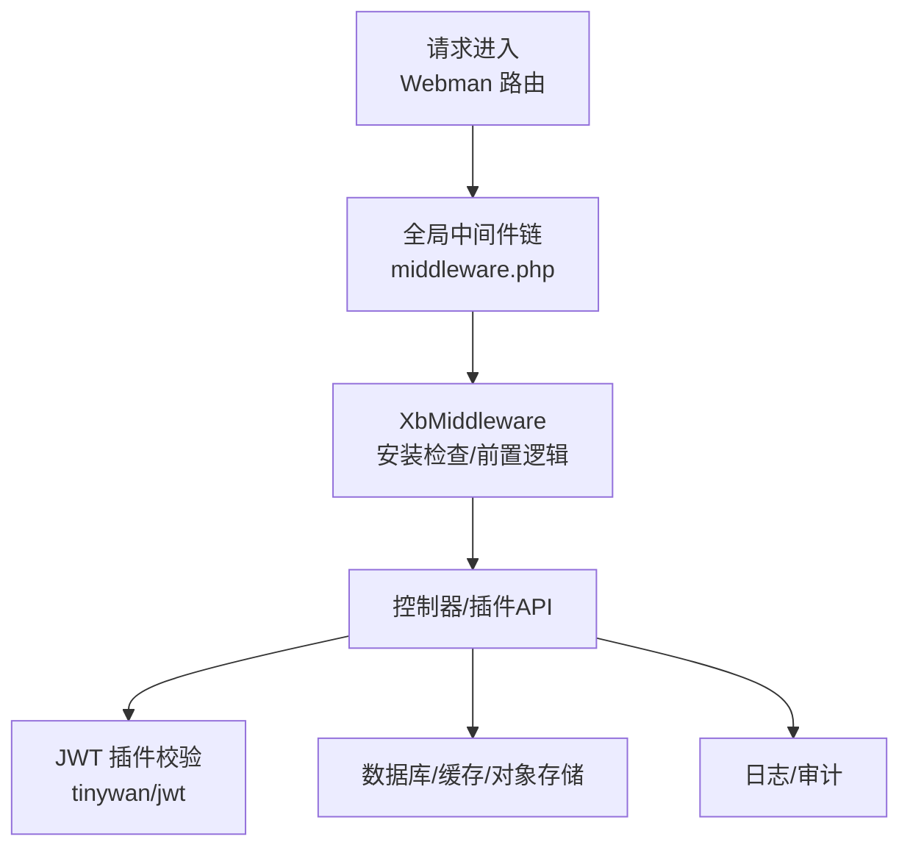
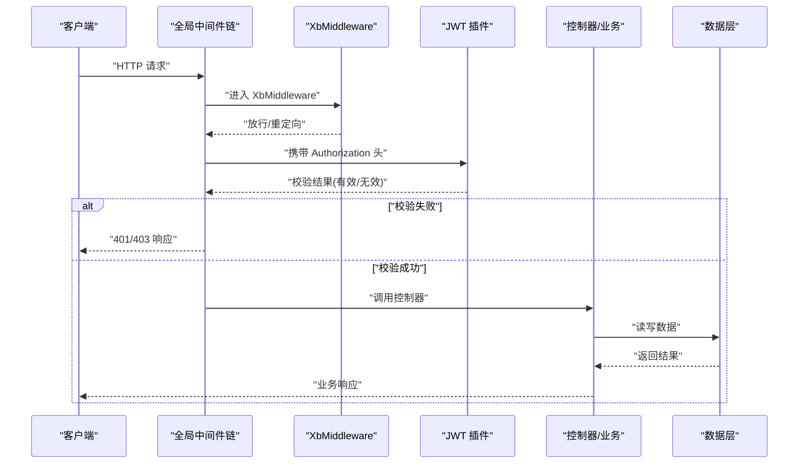
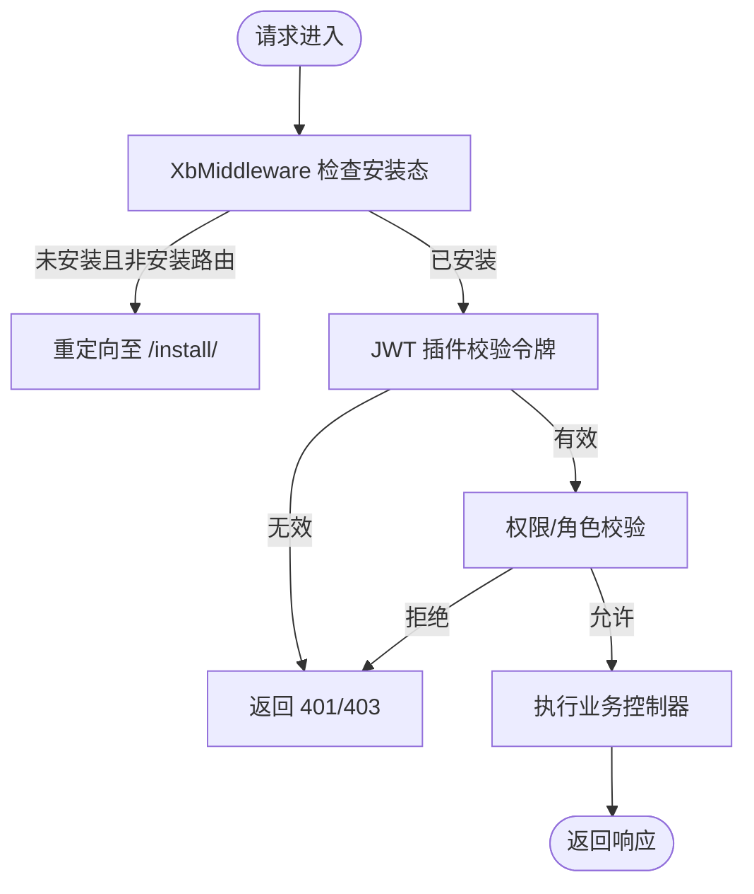
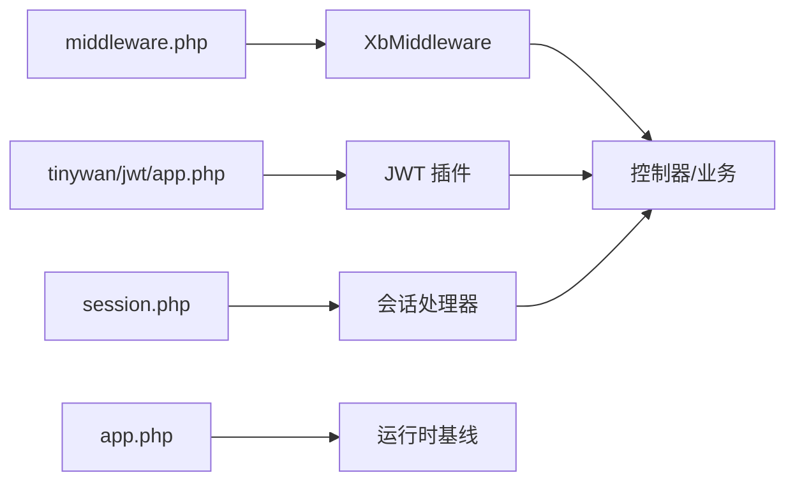

# 安全架构设计

<cite>
**本文引用的文件**   
- [server/config/middleware.php](file://server/config/middleware.php)
- [server/plugin/xbCode/app/middleware/XbMiddleware.php](file://server/plugin/xbCode/app/middleware/XbMiddleware.php)
- [server/config/plugin/tinywan/jwt/app.php](file://server/config/plugin/tinywan/jwt/app.php)
- [server/config/session.php](file://server/config/session.php)
- [server/config/app.php](file://server/config/app.php)
</cite>

## 目录
1. [引言](#引言)
2. [项目结构](#项目结构)
3. [核心组件](#核心组件)
4. [架构总览](#架构总览)
5. [详细组件分析](#详细组件分析)
6. [依赖关系分析](#依赖关系分析)
7. [性能与安全权衡](#性能与安全权衡)
8. [故障排查指南](#故障排查指南)
9. [结论](#结论)
10. [附录：配置与最佳实践清单](#附录配置与最佳实践清单)

## 引言
本文件面向积木云AI创作平台的安全架构设计与落地方案，围绕以下目标展开：
- 认证与授权：JWT 无状态认证、会话管理、基于中间件的访问控制。
- 威胁防护：CSRF、XSS、SQL 注入等常见攻击面防护策略。
- 数据保护：敏感信息加密存储、密钥管理与传输安全。
- 可观测性：安全审计日志、异常与错误处理。
- 运维配置：安全相关配置示例与生产环境加固建议。

## 项目结构
后端采用 Webman 框架，插件化组织业务模块；安全能力通过全局中间件与插件配置组合实现。关键位置如下：
- 全局中间件注册：server/config/middleware.php
- 权限与安装检查中间件：server/plugin/xbCode/app/middleware/XbMiddleware.php
- JWT 插件配置：server/config/plugin/tinywan/jwt/app.php
- 会话配置（可选）：server/config/session.php
- 应用基础配置（时区、调试开关等）：server/config/app.php

图表来源
- [server/config/middleware.php:1-12](file://server/config/middleware.php#L1-L12)
- [server/plugin/xbCode/app/middleware/XbMiddleware.php:1-43](file://server/plugin/xbCode/app/middleware/XbMiddleware.php#L1-L43)
- [server/config/plugin/tinywan/jwt/app.php:1-37](file://server/config/plugin/tinywan/jwt/app.php#L1-L37)

章节来源
- [server/config/middleware.php:1-12](file://server/config/middleware.php#L1-L12)
- [server/plugin/xbCode/app/middleware/XbMiddleware.php:1-43](file://server/plugin/xbCode/app/middleware/XbMiddleware.php#L1-L43)
- [server/config/plugin/tinywan/jwt/app.php:1-37](file://server/config/plugin/tinywan/jwt/app.php#L1-L37)
- [server/config/session.php:1-66](file://server/config/session.php#L1-L66)
- [server/config/app.php:1-13](file://server/config/app.php#L1-L13)

## 核心组件
- 全局中间件链：在 middleware.php 中统一注册，确保所有请求经过统一的预处理流程。
- XbMiddleware：负责安装态检测与通用前置逻辑，可作为后续鉴权、限流、审计的挂载点。
- JWT 插件（tinywan/jwt）：提供令牌签发、校验、刷新、单设备限制、缓存等能力。
- 会话配置（session.php）：支持文件/Redis/集群模式，用于需要会话的场景或作为辅助存储。
- 应用配置（app.php）：定义调试开关、默认时区、公共路径等影响安全的基线参数。

章节来源
- [server/config/middleware.php:1-12](file://server/config/middleware.php#L1-L12)
- [server/plugin/xbCode/app/middleware/XbMiddleware.php:1-43](file://server/plugin/xbCode/app/middleware/XbMiddleware.php#L1-L43)
- [server/config/plugin/tinywan/jwt/app.php:1-37](file://server/config/plugin/tinywan/jwt/app.php#L1-L37)
- [server/config/session.php:1-66](file://server/config/session.php#L1-L66)
- [server/config/app.php:1-13](file://server/config/app.php#L1-L13)

## 架构总览
下图展示从客户端到后端的核心安全链路：请求经全局中间件进入，XbMiddleware 执行安装态检查与通用逻辑，随后由 JWT 插件进行身份校验，最终到达控制器并访问数据层。

图表来源
- [server/config/middleware.php:1-12](file://server/config/middleware.php#L1-L12)
- [server/plugin/xbCode/app/middleware/XbMiddleware.php:1-43](file://server/plugin/xbCode/app/middleware/XbMiddleware.php#L1-L43)
- [server/config/plugin/tinywan/jwt/app.php:1-37](file://server/config/plugin/tinywan/jwt/app.php#L1-L37)

## 详细组件分析

### 认证与授权（JWT + 中间件）
- 令牌算法与密钥：HS256 对称签名，支持 RSA 公私钥对（access/refresh 双密钥对），可配置 issuer、nbf、leeway、过期时间、是否启用 refresh、是否单设备等。
- 令牌获取方式：支持从请求头读取，键名可配置。
- 中间件集成：在 middleware.php 中注册全局中间件，可在 XbMiddleware 内扩展登录态校验、角色/权限判断、IP/UA 白名单等。
- 访问控制模型：建议在 XbMiddleware 中结合用户角色与资源权限进行细粒度控制（RBAC/ABAC）。

图表来源
- [server/plugin/xbCode/app/middleware/XbMiddleware.php:1-43](file://server/plugin/xbCode/app/middleware/XbMiddleware.php#L1-L43)
- [server/config/plugin/tinywan/jwt/app.php:1-37](file://server/config/plugin/tinywan/jwt/app.php#L1-L37)

章节来源
- [server/config/middleware.php:1-12](file://server/config/middleware.php#L1-L12)
- [server/plugin/xbCode/app/middleware/XbMiddleware.php:1-43](file://server/plugin/xbCode/app/middleware/XbMiddleware.php#L1-L43)
- [server/config/plugin/tinywan/jwt/app.php:1-37](file://server/config/plugin/tinywan/jwt/app.php#L1-L37)

### 会话管理（Session）
- 存储类型：支持 file、redis、redis_cluster，生产建议使用 Redis 提升并发与一致性。
- Cookie 安全属性：http_only、secure、same_site 等可按需开启，配合 HTTPS 使用 secure=true。
- 生命周期：lifetime 与 cookie_lifetime 分别控制服务端与会话 Cookie 有效期。
- 适用场景：若系统以 JWT 为主，则 Session 可用于临时凭证、验证码、风控上下文等。

章节来源
- [server/config/session.php:1-66](file://server/config/session.php#L1-L66)

### 应用基线与运行时安全
- 调试开关：APP_DEBUG 在生产应关闭，避免泄露堆栈与内部路径。
- 时区：Asia/Shanghai，保证审计日志时间一致。
- 公共路径与运行目录隔离：public 仅暴露静态资源，runtime 存放运行时产物，减少误暴露风险。

章节来源
- [server/config/app.php:1-13](file://server/config/app.php#L1-L13)

## 依赖关系分析
- 中间件依赖：XbMiddleware 依赖工具类进行安装态检查；JWT 插件依赖配置中的密钥与算法。
- 配置耦合：JWT 插件的 access/refresh 密钥、过期时间、是否单设备、缓存前缀等直接影响认证行为。
- 会话与 JWT 并存：可同时存在，但应避免在同一请求中混用导致状态不一致。

图表来源
- [server/config/middleware.php:1-12](file://server/config/middleware.php#L1-L12)
- [server/plugin/xbCode/app/middleware/XbMiddleware.php:1-43](file://server/plugin/xbCode/app/middleware/XbMiddleware.php#L1-L43)
- [server/config/plugin/tinywan/jwt/app.php:1-37](file://server/config/plugin/tinywan/jwt/app.php#L1-L37)
- [server/config/session.php:1-66](file://server/config/session.php#L1-L66)
- [server/config/app.php:1-13](file://server/config/app.php#L1-L13)

章节来源
- [server/config/middleware.php:1-12](file://server/config/middleware.php#L1-L12)
- [server/plugin/xbCode/app/middleware/XbMiddleware.php:1-43](file://server/plugin/xbCode/app/middleware/XbMiddleware.php#L1-L43)
- [server/config/plugin/tinywan/jwt/app.php:1-37](file://server/config/plugin/tinywan/jwt/app.php#L1-L37)
- [server/config/session.php:1-66](file://server/config/session.php#L1-L66)
- [server/config/app.php:1-13](file://server/config/app.php#L1-L13)

## 性能与安全权衡
- JWT 无状态校验开销低，适合水平扩展；但需妥善管理密钥轮换与黑名单（如需强制下线）。
- 单设备限制会引入额外缓存/存储查询，需评估 QPS 与延迟。
- 将 Session 切换为 Redis 可降低磁盘 I/O 压力，提高跨节点一致性。
- 合理设置 leeway 与过期时间，平衡用户体验与安全性。

[本节为通用指导，不直接分析具体文件]

## 故障排查指南
- 401/403 频繁出现：检查 JWT 算法、密钥、issuer、leeway、请求头键名是否与配置一致；确认是否启用了单设备限制导致旧令牌失效。
- 安装页面无法访问：确认 XbMiddleware 的安装检查逻辑与路由匹配，必要时调整白名单路径。
- 会话丢失或不一致：核对 session 存储类型与连接参数，确认 http_only、secure、same_site 与前端 Cookie 设置一致。
- 调试信息泄露：确保 APP_DEBUG 在生产关闭，避免输出敏感堆栈。

章节来源
- [server/config/plugin/tinywan/jwt/app.php:1-37](file://server/config/plugin/tinywan/jwt/app.php#L1-L37)
- [server/plugin/xbCode/app/middleware/XbMiddleware.php:1-43](file://server/plugin/xbCode/app/middleware/XbMiddleware.php#L1-L43)
- [server/config/session.php:1-66](file://server/config/session.php#L1-L66)
- [server/config/app.php:1-13](file://server/config/app.php#L1-L13)

## 结论
当前代码库提供了 JWT 认证与全局中间件的基础能力，结合 XbMiddleware 可扩展出完善的鉴权、审计与安全防护体系。生产环境应重点完善：
- 严格密钥管理与轮换机制
- 全链路 HTTPS 与 Cookie 安全属性
- 输入校验与输出编码（防 XSS/注入）
- 操作审计与异常告警
- 最小权限原则与接口级鉴权

[本节为总结性内容，不直接分析具体文件]

## 附录：配置与最佳实践清单

- JWT 配置要点
  - 算法与密钥：优先使用强随机密钥；如启用 RSA，请妥善保管私钥。
  - 过期与刷新：合理设置 access_exp 与 refresh_exp，按需启用 refresh_disable。
  - 单设备与缓存：is_single_device 与 cache_token_ttl 根据业务需求调整。
  - 令牌来源：is_support_get_token_key 指定请求头键名，避免与常规 Authorization 冲突。

- 会话配置要点
  - 存储：生产推荐 redis/redis_cluster，并配置独立数据库与密码。
  - Cookie：http_only=true，HTTPS 下 secure=true，same_site 按跨域策略设置。
  - 生命周期：lifetime 与 cookie_lifetime 分离控制，避免过长驻留。

- 应用基线
  - APP_DEBUG=false（生产）
  - default_timezone=Asia/Shanghai
  - public_path 仅暴露静态资源，禁止暴露源码与配置文件

- 威胁防护建议
  - CSRF：对写操作启用同源校验、Referer/SameSite 策略、自定义 Token 校验。
  - XSS：对所有用户输入进行输出编码，启用 CSP，禁用危险 HTML 标签。
  - SQL 注入：使用 ORM 参数绑定，禁止拼接 SQL；对复杂查询做白名单过滤。
  - 上传安全：校验 MIME 与魔数，限制大小与类型，存储于不可执行目录或对象存储。
  - 速率限制：对登录、短信、生成任务等接口实施 IP/用户维度限流。
  - 敏感信息：密钥、凭据走环境变量或密钥管理服务，不在代码与日志中明文打印。

- 安全审计与监控
  - 记录登录、登出、权限变更、敏感操作与异常事件。
  - 集中收集日志，关联请求 ID、用户标识、IP、UA、耗时。
  - 对异常与失败尝试进行阈值告警。

[本节为通用指导，不直接分析具体文件]