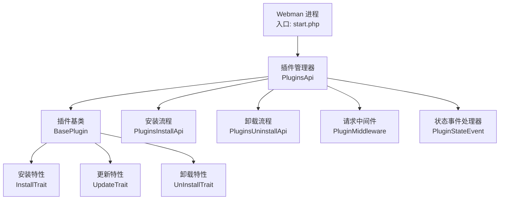
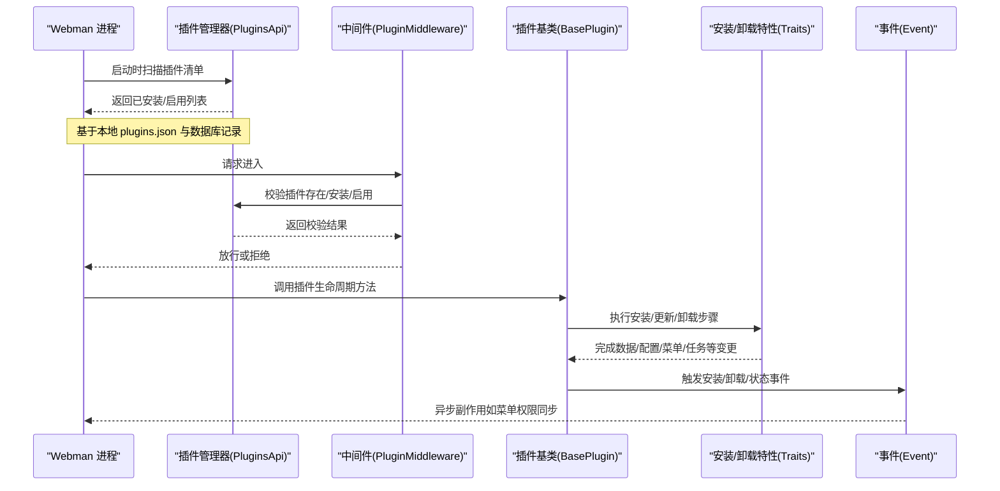
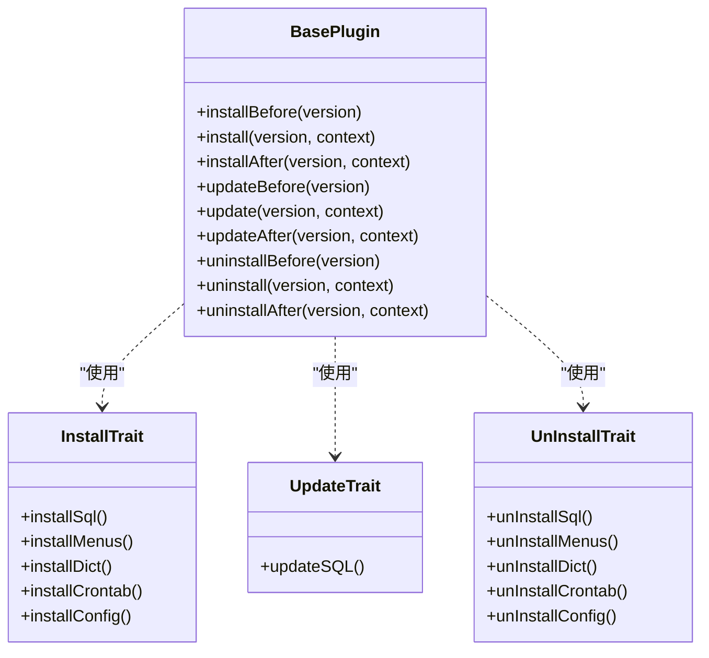
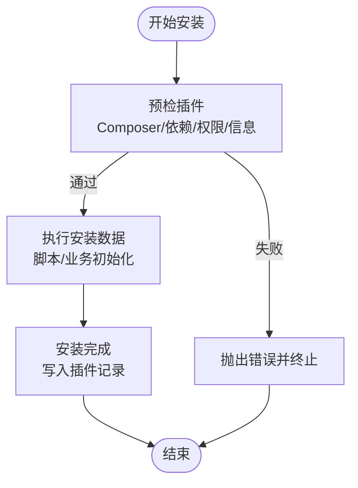
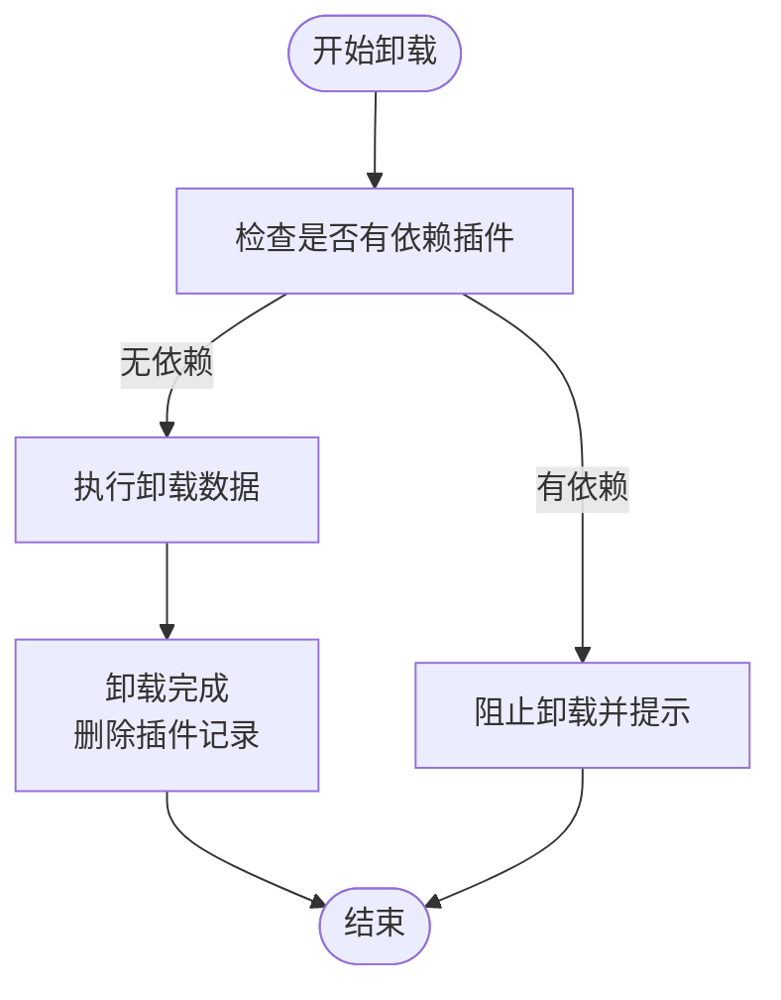
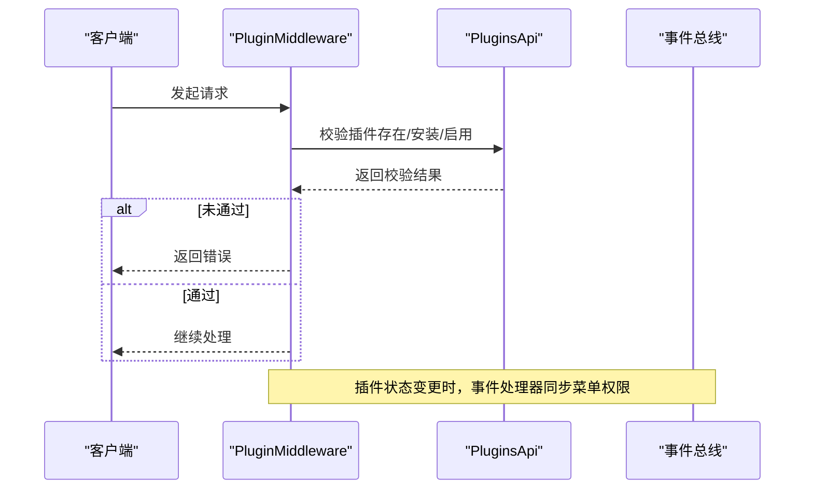
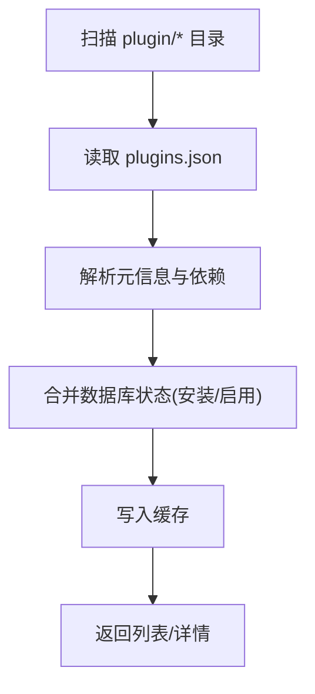
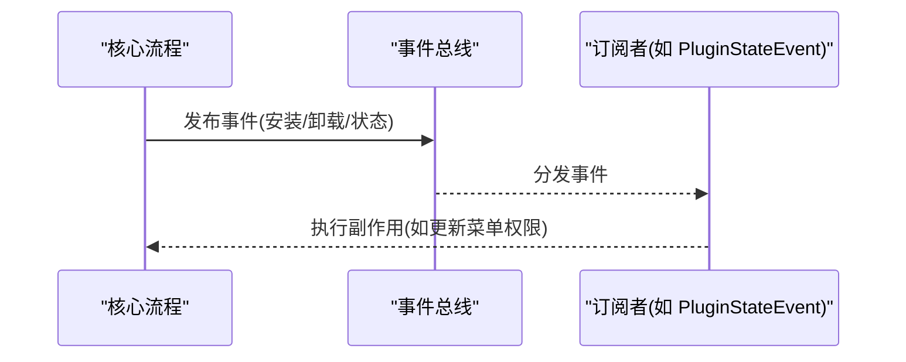
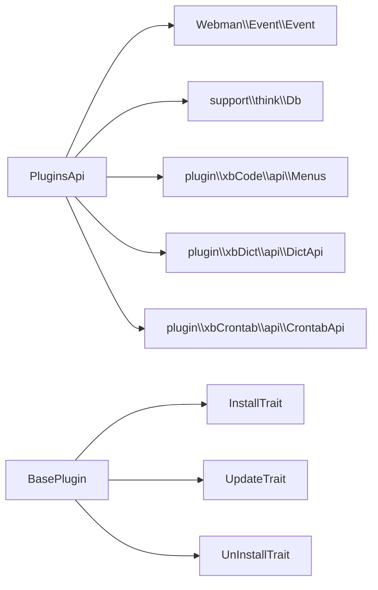

# 插件系统架构

<cite>
**本文引用的文件**   
- [server/start.php](file://server/start.php)
- [server/config/plugin/webman/event/app.php](file://server/config/plugin/webman/event/app.php)
- [server/plugin/xbCode/base/BasePlugin.php](file://server/plugin/xbCode/base/BasePlugin.php)
- [server/plugin/xbCode/api/PluginsApi.php](file://server/plugin/xbCode/api/PluginsApi.php)
- [server/plugin/xbCode/api/PluginsInstallApi.php](file://server/plugin/xbCode/api/PluginsInstallApi.php)
- [server/plugin/xbCode/api/PluginsUninstallApi.php](file://server/plugin/xbCode/api/PluginsUninstallApi.php)
- [server/plugin/xbCode/app/middleware/PluginMiddleware.php](file://server/plugin/xbCode/app/middleware/PluginMiddleware.php)
- [server/plugin/xbCode/event/PluginStateEvent.php](file://server/plugin/xbCode/event/PluginStateEvent.php)
- [server/plugin/xbCode/base/plugin/InstallTrait.php](file://server/plugin/xbCode/base/plugin/InstallTrait.php)
- [server/plugin/xbCode/base/plugin/UpdateTrait.php](file://server/plugin/xbCode/base/plugin/UpdateTrait.php)
- [server/plugin/xbCode/base/plugin/UnInstallTrait.php](file://server/plugin/xbCode/base/plugin/UnInstallTrait.php)
</cite>

## 目录
1. [简介](#简介)
2. [项目结构](#项目结构)
3. [核心组件](#核心组件)
4. [架构总览](#架构总览)
5. [详细组件分析](#详细组件分析)
6. [依赖分析](#依赖分析)
7. [性能考虑](#性能考虑)
8. [故障排查指南](#故障排查指南)
9. [结论](#结论)
10. [附录](#附录)

## 简介
本文件面向积木云AI创作平台的后端插件体系，围绕 Webman 插件系统的核心原理进行系统化说明。重点覆盖：
- 插件生命周期管理（安装、更新、卸载）
- 插件注册与发现机制
- 依赖解析与加载顺序
- 插件目录结构与配置文件规范
- API 接口定义与中间件注册
- 事件监听机制
- 热插拔实现原理
- 插件间通信机制
- 权限控制与版本管理
- 开发规范与最佳实践

## 项目结构
本项目采用“应用 + 插件”的模块化组织方式。Webman 作为运行内核，通过入口脚本启动；插件以独立目录存放于 server/plugin 下，每个插件包含自身的路由、控制器、模型、配置、资源等。核心插件 xbCode 提供插件管理能力（安装、卸载、启用/禁用、依赖检查、菜单/字典/定时任务集成等）。

图表来源
- [server/start.php:1-6](file://server/start.php#L1-L6)
- [server/plugin/xbCode/api/PluginsApi.php:1-684](file://server/plugin/xbCode/api/PluginsApi.php#L1-L684)
- [server/plugin/xbCode/base/BasePlugin.php:1-350](file://server/plugin/xbCode/base/BasePlugin.php#L1-L350)
- [server/plugin/xbCode/api/PluginsInstallApi.php:1-122](file://server/plugin/xbCode/api/PluginsInstallApi.php#L1-L122)
- [server/plugin/xbCode/api/PluginsUninstallApi.php:1-85](file://server/plugin/xbCode/api/PluginsUninstallApi.php#L1-L85)
- [server/plugin/xbCode/app/middleware/PluginMiddleware.php:1-79](file://server/plugin/xbCode/app/middleware/PluginMiddleware.php#L1-L79)
- [server/plugin/xbCode/event/PluginStateEvent.php:1-45](file://server/plugin/xbCode/event/PluginStateEvent.php#L1-L45)
- [server/plugin/xbCode/base/plugin/InstallTrait.php:1-173](file://server/plugin/xbCode/base/plugin/InstallTrait.php#L1-L173)
- [server/plugin/xbCode/base/plugin/UpdateTrait.php:1-48](file://server/plugin/xbCode/base/plugin/UpdateTrait.php#L1-L48)
- [server/plugin/xbCode/base/plugin/UnInstallTrait.php:1-173](file://server/plugin/xbCode/base/plugin/UnInstallTrait.php#L1-L173)

章节来源
- [server/start.php:1-6](file://server/start.php#L1-L6)

## 核心组件
- 插件管理器（PluginsApi）
  - 负责插件清单扫描、信息解析、缓存、状态管理、依赖检测、预览图路径生成、README 读取等。
- 插件基类（BasePlugin）
  - 为具体插件提供统一的安装/更新/卸载生命周期钩子与前置后置处理。
- 安装/卸载流程（PluginsInstallApi / PluginsUninstallApi）
  - 将安装/卸载拆分为步骤化执行，并在关键节点触发事件。
- 插件中间件（PluginMiddleware）
  - 在请求链路中校验插件存在性、安装状态与启用状态，保障安全访问。
- 状态事件处理器（PluginStateEvent）
  - 响应插件启用/禁用事件，联动后台菜单权限状态同步。
- 安装/更新/卸载特性（InstallTrait / UpdateTrait / UnInstallTrait）
  - 封装数据库、菜单、字典、定时任务、配置项的安装与清理逻辑。

章节来源
- [server/plugin/xbCode/api/PluginsApi.php:1-684](file://server/plugin/xbCode/api/PluginsApi.php#L1-L684)
- [server/plugin/xbCode/base/BasePlugin.php:1-350](file://server/plugin/xbCode/base/BasePlugin.php#L1-L350)
- [server/plugin/xbCode/api/PluginsInstallApi.php:1-122](file://server/plugin/xbCode/api/PluginsInstallApi.php#L1-L122)
- [server/plugin/xbCode/api/PluginsUninstallApi.php:1-85](file://server/plugin/xbCode/api/PluginsUninstallApi.php#L1-L85)
- [server/plugin/xbCode/app/middleware/PluginMiddleware.php:1-79](file://server/plugin/xbCode/app/middleware/PluginMiddleware.php#L1-L79)
- [server/plugin/xbCode/event/PluginStateEvent.php:1-45](file://server/plugin/xbCode/event/PluginStateEvent.php#L1-L45)
- [server/plugin/xbCode/base/plugin/InstallTrait.php:1-173](file://server/plugin/xbCode/base/plugin/InstallTrait.php#L1-L173)
- [server/plugin/xbCode/base/plugin/UpdateTrait.php:1-48](file://server/plugin/xbCode/base/plugin/UpdateTrait.php#L1-L48)
- [server/plugin/xbCode/base/plugin/UnInstallTrait.php:1-173](file://server/plugin/xbCode/base/plugin/UnInstallTrait.php#L1-L173)

## 架构总览
下图展示了从 Webman 启动到插件能力生效的整体流程，包括插件发现、安装/卸载、中间件校验、事件驱动的状态同步。

图表来源
- [server/start.php:1-6](file://server/start.php#L1-L6)
- [server/plugin/xbCode/api/PluginsApi.php:1-684](file://server/plugin/xbCode/api/PluginsApi.php#L1-L684)
- [server/plugin/xbCode/app/middleware/PluginMiddleware.php:1-79](file://server/plugin/xbCode/app/middleware/PluginMiddleware.php#L1-L79)
- [server/plugin/xbCode/base/BasePlugin.php:1-350](file://server/plugin/xbCode/base/BasePlugin.php#L1-L350)
- [server/plugin/xbCode/base/plugin/InstallTrait.php:1-173](file://server/plugin/xbCode/base/plugin/InstallTrait.php#L1-L173)
- [server/plugin/xbCode/base/plugin/UnInstallTrait.php:1-173](file://server/plugin/xbCode/base/plugin/UnInstallTrait.php#L1-L173)
- [server/plugin/xbCode/event/PluginStateEvent.php:1-45](file://server/plugin/xbCode/event/PluginStateEvent.php#L1-L45)

## 详细组件分析

### 插件基类与生命周期（BasePlugin 与 Traits）
- 设计要点
  - 通过 InstallTrait/UpdateTrait/UnInstallTrait 组合出统一的生命周期方法 install/update/uninstall 及其前后置钩子。
  - 安装前会尝试拉取 Composer 依赖并校验插件依赖是否满足；安装过程按“数据库→配置→菜单→字典→定时任务”的顺序执行，异常时回滚卸载。
  - 更新流程支持按版本号执行 SQL 迁移；卸载流程反向清理相关资源。
- 复杂度与健壮性
  - 安装/卸载均具备事务式回滚语义（异常捕获后触发卸载），保证一致性。
  - 对可选依赖（如字典、定时任务）做了存在性与启用状态判断，避免强耦合。

图表来源
- [server/plugin/xbCode/base/BasePlugin.php:1-350](file://server/plugin/xbCode/base/BasePlugin.php#L1-L350)
- [server/plugin/xbCode/base/plugin/InstallTrait.php:1-173](file://server/plugin/xbCode/base/plugin/InstallTrait.php#L1-L173)
- [server/plugin/xbCode/base/plugin/UpdateTrait.php:1-48](file://server/plugin/xbCode/base/plugin/UpdateTrait.php#L1-L48)
- [server/plugin/xbCode/base/plugin/UnInstallTrait.php:1-173](file://server/plugin/xbCode/base/plugin/UnInstallTrait.php#L1-L173)

章节来源
- [server/plugin/xbCode/base/BasePlugin.php:1-350](file://server/plugin/xbCode/base/BasePlugin.php#L1-L350)
- [server/plugin/xbCode/base/plugin/InstallTrait.php:1-173](file://server/plugin/xbCode/base/plugin/InstallTrait.php#L1-L173)
- [server/plugin/xbCode/base/plugin/UpdateTrait.php:1-48](file://server/plugin/xbCode/base/plugin/UpdateTrait.php#L1-L48)
- [server/plugin/xbCode/base/plugin/UnInstallTrait.php:1-173](file://server/plugin/xbCode/base/plugin/UnInstallTrait.php#L1-L173)

### 插件安装流程（PluginsInstallApi）
- 步骤化执行
  - 预检：检查 Composer 环境、插件包结构、依赖、目录权限、插件信息合法性，并触发预检事件。
  - 安装数据：执行脚本与安装逻辑，触发安装事件。
  - 安装完成：写入插件记录，触发完成事件。
- 事件驱动
  - 在关键阶段通过事件总线广播，便于扩展点接入（例如日志、审计、通知）。

图表来源
- [server/plugin/xbCode/api/PluginsInstallApi.php:1-122](file://server/plugin/xbCode/api/PluginsInstallApi.php#L1-L122)

章节来源
- [server/plugin/xbCode/api/PluginsInstallApi.php:1-122](file://server/plugin/xbCode/api/PluginsInstallApi.php#L1-L122)

### 插件卸载流程（PluginsUninstallApi）
- 步骤化执行
  - 卸载数据：执行脚本与清理逻辑，触发卸载事件。
  - 卸载完成：删除插件记录，触发完成事件。
- 安全性
  - 卸载前会检查是否存在其他插件依赖当前插件，防止误删导致系统不稳定。

图表来源
- [server/plugin/xbCode/api/PluginsUninstallApi.php:1-85](file://server/plugin/xbCode/api/PluginsUninstallApi.php#L1-L85)
- [server/plugin/xbCode/api/PluginsApi.php:633-684](file://server/plugin/xbCode/api/PluginsApi.php#L633-L684)

章节来源
- [server/plugin/xbCode/api/PluginsUninstallApi.php:1-85](file://server/plugin/xbCode/api/PluginsUninstallApi.php#L1-L85)
- [server/plugin/xbCode/api/PluginsApi.php:633-684](file://server/plugin/xbCode/api/PluginsApi.php#L633-L684)

### 插件中间件与权限控制（PluginMiddleware）
- 职责
  - 在请求进入时校验目标插件是否存在、是否已安装、是否已启用。
  - 结合框架内置的“开发模式检测”，在非生产环境可跳过部分校验。
- 权限联动
  - 插件启用/禁用会通过事件同步后台菜单规则状态，确保前端可见性与访问控制一致。

图表来源
- [server/plugin/xbCode/app/middleware/PluginMiddleware.php:1-79](file://server/plugin/xbCode/app/middleware/PluginMiddleware.php#L1-L79)
- [server/plugin/xbCode/event/PluginStateEvent.php:1-45](file://server/plugin/xbCode/event/PluginStateEvent.php#L1-L45)
- [server/plugin/xbCode/api/PluginsApi.php:578-598](file://server/plugin/xbCode/api/PluginsApi.php#L578-L598)

章节来源
- [server/plugin/xbCode/app/middleware/PluginMiddleware.php:1-79](file://server/plugin/xbCode/app/middleware/PluginMiddleware.php#L1-L79)
- [server/plugin/xbCode/event/PluginStateEvent.php:1-45](file://server/plugin/xbCode/event/PluginStateEvent.php#L1-L45)
- [server/plugin/xbCode/api/PluginsApi.php:578-598](file://server/plugin/xbCode/api/PluginsApi.php#L578-L598)

### 插件注册与发现机制（PluginsApi）
- 清单扫描
  - 遍历 server/plugin/*/plugins.json，解析插件元信息（名称、版本、作者、描述、依赖等）。
- 状态与排序
  - 根据数据库记录计算安装/启用状态，并设置排序字段，优先展示已安装且启用的插件。
- 缓存策略
  - 使用缓存键存储插件列表，减少重复 IO 与解析开销。
- 依赖解析
  - 解析插件内声明的第三方包依赖与插件依赖，并提供依赖关系查询与冲突检测。

图表来源
- [server/plugin/xbCode/api/PluginsApi.php:76-136](file://server/plugin/xbCode/api/PluginsApi.php#L76-L136)
- [server/plugin/xbCode/api/PluginsApi.php:144-153](file://server/plugin/xbCode/api/PluginsApi.php#L144-L153)
- [server/plugin/xbCode/api/PluginsApi.php:484-548](file://server/plugin/xbCode/api/PluginsApi.php#L484-L548)

章节来源
- [server/plugin/xbCode/api/PluginsApi.php:76-136](file://server/plugin/xbCode/api/PluginsApi.php#L76-L136)
- [server/plugin/xbCode/api/PluginsApi.php:144-153](file://server/plugin/xbCode/api/PluginsApi.php#L144-L153)
- [server/plugin/xbCode/api/PluginsApi.php:484-548](file://server/plugin/xbCode/api/PluginsApi.php#L484-L548)

### 事件系统与插件间通信
- 事件发布
  - 安装/卸载/状态变更等关键动作通过事件总线发布，订阅者可异步处理副作用（如日志、审计、通知、缓存刷新）。
- 典型事件
  - 安装预检、安装执行、安装完成
  - 卸载执行、卸载完成
  - 插件状态变更（启用/禁用）
- 订阅者示例
  - 插件状态事件处理器会根据插件标识与菜单配置，批量更新后台菜单规则状态，保证权限与功能开关一致。

图表来源
- [server/plugin/xbCode/api/PluginsInstallApi.php:77-82](file://server/plugin/xbCode/api/PluginsInstallApi.php#L77-L82)
- [server/plugin/xbCode/api/PluginsInstallApi.php:94-99](file://server/plugin/xbCode/api/PluginsInstallApi.php#L94-L99)
- [server/plugin/xbCode/api/PluginsInstallApi.php:118-120](file://server/plugin/xbCode/api/PluginsInstallApi.php#L118-L120)
- [server/plugin/xbCode/api/PluginsUninstallApi.php:52-56](file://server/plugin/xbCode/api/PluginsUninstallApi.php#L52-L56)
- [server/plugin/xbCode/api/PluginsUninstallApi.php:78-82](file://server/plugin/xbCode/api/PluginsUninstallApi.php#L78-L82)
- [server/plugin/xbCode/api/PluginsApi.php:594-598](file://server/plugin/xbCode/api/PluginsApi.php#L594-L598)
- [server/plugin/xbCode/event/PluginStateEvent.php:29-43](file://server/plugin/xbCode/event/PluginStateEvent.php#L29-L43)

章节来源
- [server/plugin/xbCode/api/PluginsInstallApi.php:77-82](file://server/plugin/xbCode/api/PluginsInstallApi.php#L77-L82)
- [server/plugin/xbCode/api/PluginsInstallApi.php:94-99](file://server/plugin/xbCode/api/PluginsInstallApi.php#L94-L99)
- [server/plugin/xbCode/api/PluginsInstallApi.php:118-120](file://server/plugin/xbCode/api/PluginsInstallApi.php#L118-L120)
- [server/plugin/xbCode/api/PluginsUninstallApi.php:52-56](file://server/plugin/xbCode/api/PluginsUninstallApi.php#L52-L56)
- [server/plugin/xbCode/api/PluginsUninstallApi.php:78-82](file://server/plugin/xbCode/api/PluginsUninstallApi.php#L78-L82)
- [server/plugin/xbCode/api/PluginsApi.php:594-598](file://server/plugin/xbCode/api/PluginsApi.php#L594-L598)
- [server/plugin/xbCode/event/PluginStateEvent.php:29-43](file://server/plugin/xbCode/event/PluginStateEvent.php#L29-L43)

### 插件目录结构与配置文件规范
- 目录约定
  - 插件根目录位于 server/plugin/<插件名>
  - 清单文件：plugins.json（必填）
  - 安装脚本：api/Install.php（继承 BasePlugin，实现 config 等）
  - 资源与文档：preview.svg、README.md/readme.md
  - 配置与设置：config/*.php、setting/**/*.php
  - 路由与控制器：app/**、api/**
  - 枚举与工具：enum/**、utils/**
- 配置文件要点
  - menu.php：定义后台菜单结构，用于安装/卸载时同步
  - crontab.php：定义定时任务，需依赖 xbCrontab 插件
  - dict.php：定义字典数据，需依赖 xbDict 插件
  - setting 下的 tabs 与普通配置：安装时自动写入配置中心

章节来源
- [server/plugin/xbCode/base/plugin/InstallTrait.php:53-109](file://server/plugin/xbCode/base/plugin/InstallTrait.php#L53-L109)
- [server/plugin/xbCode/base/plugin/InstallTrait.php:117-172](file://server/plugin/xbCode/base/plugin/InstallTrait.php#L117-L172)
- [server/plugin/xbCode/base/plugin/UnInstallTrait.php:54-124](file://server/plugin/xbCode/base/plugin/UnInstallTrait.php#L54-L124)
- [server/plugin/xbCode/base/plugin/UnInstallTrait.php:132-172](file://server/plugin/xbCode/base/plugin/UnInstallTrait.php#L132-L172)

### API 接口定义与中间件注册
- 插件 API
  - 插件内部通过 api/ 目录暴露控制器或服务，供外部调用。
- 中间件注册
  - 插件可通过自身的 middleware.php 注册中间件，或在应用层集中注册。
  - 插件中间件可在请求进入时执行插件级校验、鉴权、限流等。

章节来源
- [server/plugin/xbCode/app/middleware/PluginMiddleware.php:1-79](file://server/plugin/xbCode/app/middleware/PluginMiddleware.php#L1-L79)

### 热插拔实现原理
- 运行时切换
  - 通过修改插件状态（启用/禁用）并触发事件，中间件即时生效，无需重启进程。
- 资源隔离
  - 插件的资源（路由、控制器、模型、静态资源）通过命名空间与路径隔离，避免相互污染。
- 事件解耦
  - 借助事件总线，状态变更的副作用（如菜单权限同步）异步执行，提升用户体验。

章节来源
- [server/plugin/xbCode/api/PluginsApi.php:578-598](file://server/plugin/xbCode/api/PluginsApi.php#L578-L598)
- [server/plugin/xbCode/event/PluginStateEvent.php:29-43](file://server/plugin/xbCode/event/PluginStateEvent.php#L29-L43)
- [server/plugin/xbCode/app/middleware/PluginMiddleware.php:51-78](file://server/plugin/xbCode/app/middleware/PluginMiddleware.php#L51-L78)

### 插件间通信机制
- 事件总线
  - 通过事件发布/订阅实现松耦合通信，适用于跨插件的通知与协作。
- 共享服务
  - 插件可通过公共 API（如 PluginsApi）获取系统级信息（插件列表、状态、依赖等）。
- 配置共享
  - 通过配置中心读写共享配置项，实现参数级通信。

章节来源
- [server/plugin/xbCode/api/PluginsApi.php:144-153](file://server/plugin/xbCode/api/PluginsApi.php#L144-L153)
- [server/plugin/xbCode/api/PluginsApi.php:389-401](file://server/plugin/xbCode/api/PluginsApi.php#L389-L401)

### 权限控制与版本管理
- 权限控制
  - 插件启用/禁用会联动后台菜单规则状态，确保前端导航与访问控制一致。
- 版本管理
  - 插件元信息包含 version 字段；更新流程支持按版本执行 SQL 迁移脚本。
  - 卸载前检查依赖关系，避免破坏其他插件。

章节来源
- [server/plugin/xbCode/event/PluginStateEvent.php:29-43](file://server/plugin/xbCode/event/PluginStateEvent.php#L29-L43)
- [server/plugin/xbCode/base/plugin/UpdateTrait.php:28-47](file://server/plugin/xbCode/base/plugin/UpdateTrait.php#L28-L47)
- [server/plugin/xbCode/api/PluginsApi.php:633-684](file://server/plugin/xbCode/api/PluginsApi.php#L633-L684)

## 依赖分析
- 组件耦合
  - PluginsApi 是插件生态的核心枢纽，被安装/卸载流程、中间件、事件处理器广泛依赖。
  - BasePlugin 通过 Trait 组合复用安装/更新/卸载逻辑，降低重复代码。
- 外部依赖
  - 事件系统：Webman\Event\Event
  - 数据库：support\think\Db、plugin\xbCode\api\Mysql
  - 菜单/字典/定时任务：plugin\xbCode\api\Menus、plugin\xbDict\api\DictApi、plugin\xbCrontab\api\CrontabApi
- 潜在循环依赖
  - 通过事件与 API 抽象解耦，避免直接强引用导致的循环依赖。

图表来源
- [server/plugin/xbCode/api/PluginsApi.php:1-684](file://server/plugin/xbCode/api/PluginsApi.php#L1-L684)
- [server/plugin/xbCode/base/BasePlugin.php:1-350](file://server/plugin/xbCode/base/BasePlugin.php#L1-L350)
- [server/plugin/xbCode/base/plugin/InstallTrait.php:1-173](file://server/plugin/xbCode/base/plugin/InstallTrait.php#L1-L173)
- [server/plugin/xbCode/base/plugin/UpdateTrait.php:1-48](file://server/plugin/xbCode/base/plugin/UpdateTrait.php#L1-L48)
- [server/plugin/xbCode/base/plugin/UnInstallTrait.php:1-173](file://server/plugin/xbCode/base/plugin/UnInstallTrait.php#L1-L173)

章节来源
- [server/plugin/xbCode/api/PluginsApi.php:1-684](file://server/plugin/xbCode/api/PluginsApi.php#L1-L684)
- [server/plugin/xbCode/base/BasePlugin.php:1-350](file://server/plugin/xbCode/base/BasePlugin.php#L1-L350)

## 性能考虑
- 缓存优化
  - 插件列表与状态使用缓存键存储，减少频繁 IO 与解析。
- 按需加载
  - 仅在需要时引入插件配置与资源，避免全局加载带来的开销。
- 事件异步
  - 将非关键路径的副作用（如日志、通知）放入事件队列，缩短主流程耗时。
- 依赖预检
  - 在安装前进行环境与依赖检查，尽早失败，避免无效操作。

[本节为通用指导，不直接分析具体文件]

## 故障排查指南
- 常见问题
  - 插件目录不可读/不可写：检查文件系统权限。
  - 缺少 preview.svg 或 README：补全必要资源。
  - 依赖缺失：先安装依赖插件或 Composer 包。
  - 状态不同步：检查事件订阅者与菜单权限同步逻辑。
- 定位建议
  - 查看安装/卸载事件日志，确认各步骤执行情况。
  - 使用调试模式输出异常堆栈，快速定位问题。
  - 核对 plugins.json 与数据库记录的一致性。

章节来源
- [server/plugin/xbCode/api/PluginsInstallApi.php:53-83](file://server/plugin/xbCode/api/PluginsInstallApi.php#L53-L83)
- [server/plugin/xbCode/api/PluginsApi.php:484-548](file://server/plugin/xbCode/api/PluginsApi.php#L484-L548)
- [server/plugin/xbCode/base/BasePlugin.php:164-189](file://server/plugin/xbCode/base/BasePlugin.php#L164-L189)

## 结论
本插件系统以 Webman 为核心，通过清晰的目录规范、标准化的生命周期钩子、事件驱动的解耦机制以及严格的依赖与权限控制，实现了高可扩展、易维护的插件生态。开发者遵循规范即可快速构建高质量插件，平台方也能稳定地管理插件的全生命周期。

[本节为总结性内容，不直接分析具体文件]

## 附录
- 插件开发规范（建议）
  - 每个插件必须包含 plugins.json、preview.svg、api/Install.php。
  - 使用 BasePlugin 提供的生命周期方法，避免自行实现复杂安装/卸载逻辑。
  - 通过事件总线进行跨插件通信，保持低耦合。
  - 合理拆分配置与设置，遵循 setting 目录结构。
  - 做好异常处理与日志记录，便于问题追踪。
- 最佳实践
  - 安装/卸载幂等：多次执行应保持一致结果。
  - 依赖最小化：仅声明必要依赖，避免过度耦合。
  - 版本兼容：升级脚本需考虑向下兼容。
  - 安全校验：中间件中严格校验插件状态与权限。

[本节为通用指导，不直接分析具体文件]