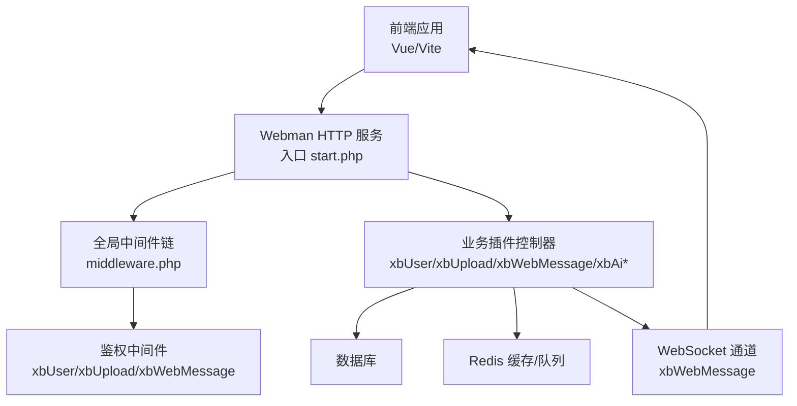
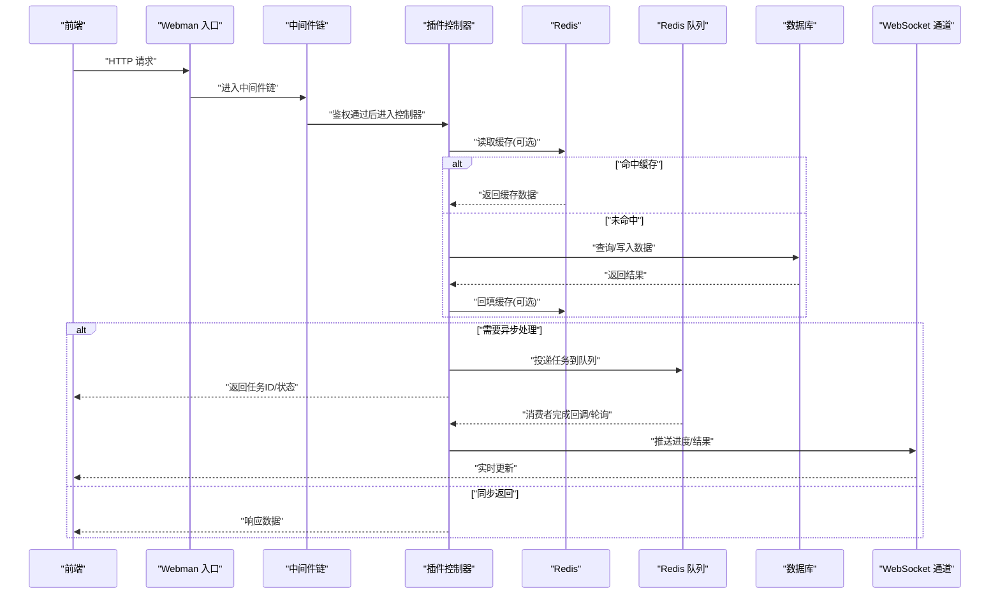
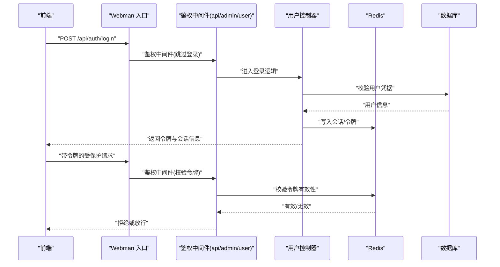
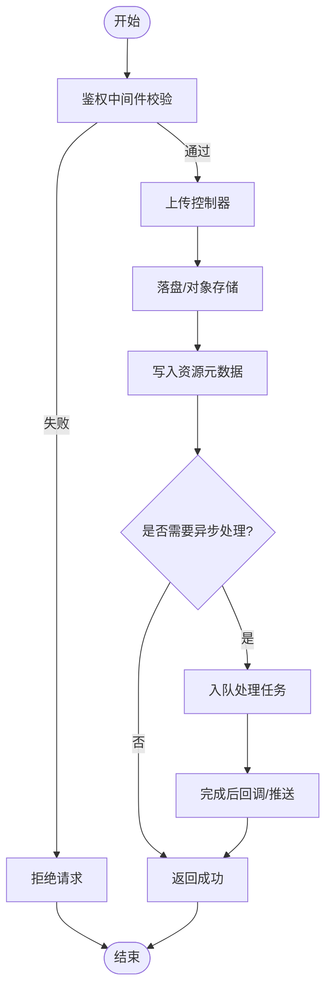
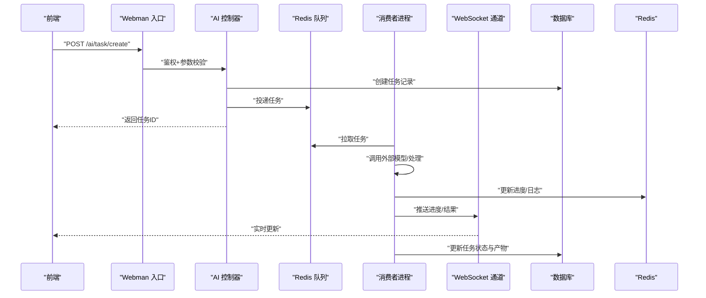
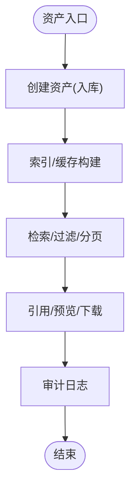
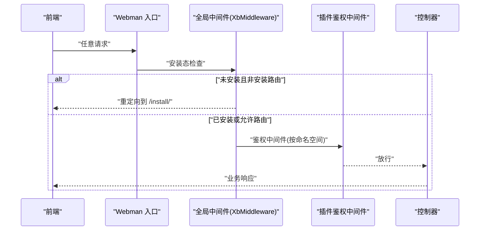
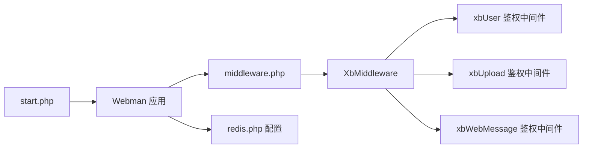

# 数据流设计

<cite>
**本文引用的文件**   
- [start.php](file://server/start.php)
- [middleware.php](file://server/config/middleware.php)
- [redis.php](file://server/config/redis.php)
- [XbMiddleware.php](file://server/plugin\xbCode\app\middleware\XbMiddleware.php)
- [xbUser middleware.php](file://server/plugin\xbUser\config\middleware.php)
- [xbUpload middleware.php](file://server/plugin\xbUpload\config\middleware.php)
- [xbWebMessage middleware.php](file://server/plugin\xbWebMessage\config\middleware.php)
</cite>

## 目录
1. [引言](#引言)
2. [项目结构](#项目结构)
3. [核心组件](#核心组件)
4. [架构总览](#架构总览)
5. [详细组件分析](#详细组件分析)
6. [依赖关系分析](#依赖关系分析)
7. [性能考虑](#性能考虑)
8. [故障排查指南](#故障排查指南)
9. [结论](#结论)
10. [附录](#附录)

## 引言
本文件面向积木云AI创作平台的数据流设计与实现，聚焦前后端交互、HTTP请求处理、WebSocket实时通信、文件上传下载流、缓存与队列、消息传递机制，以及数据一致性、事务处理、并发控制与数据同步等关键主题。文档通过架构图、序列图与时序图，系统梳理用户认证、AI任务处理、资产管理等核心流程的数据流转路径，帮助读者快速理解并指导后续优化与扩展。

## 项目结构
本项目采用前后端分离的插件化架构：
- 前端（Vue + Vite）：提供页面、状态管理、API调用封装、路由守卫、事件总线等。
- 后端（基于 Webman 的 PHP 应用）：以插件形式组织业务域，如 xbUser（用户）、xbUpload（上传）、xbWebMessage（消息）、xbAiModelAgent（AI模型代理）、xbAiAsset（资产）等；中间件统一鉴权与安装检查；Redis 作为缓存与队列支撑。

图表来源
- [start.php:1-6](file://server/start.php#L1-L6)
- [middleware.php:1-12](file://server/config/middleware.php#L1-L12)
- [xbUser middleware.php:1-13](file://server/plugin\xbUser\config\middleware.php#L1-L13)
- [xbUpload middleware.php:1-15](file://server/plugin\xbUpload\config\middleware.php#L1-L15)
- [xbWebMessage middleware.php:1-16](file://server/plugin\xbWebMessage\config\middleware.php#L1-L16)

章节来源
- [start.php:1-6](file://server/start.php#L1-L6)
- [middleware.php:1-12](file://server/config/middleware.php#L1-L12)

## 核心组件
- 启动与路由
  - 应用入口加载自动加载器并启动 Webman 应用，承载 HTTP 与 WebSocket 服务。
- 中间件体系
  - 全局安装检查与权限校验中间件，按插件维度挂载 admin/user/api 三类鉴权中间件。
- 缓存与队列
  - Redis 连接池配置，用于缓存热点数据与异步任务队列。
- 插件能力
  - 用户认证与授权、文件上传下载、消息推送、AI 任务编排与执行、资产管理等。

章节来源
- [start.php:1-6](file://server/start.php#L1-L6)
- [XbMiddleware.php:1-43](file://server/plugin\xbCode\app\middleware\XbMiddleware.php#L1-L43)
- [xbUser middleware.php:1-13](file://server/plugin\xbUser\config\middleware.php#L1-L13)
- [xbUpload middleware.php:1-15](file://server/plugin\xbUpload\config\middleware.php#L1-L15)
- [xbWebMessage middleware.php:1-16](file://server/plugin\xbWebMessage\config\middleware.php#L1-L16)
- [redis.php:1-17](file://server/config/redis.php#L1-L17)

## 架构总览
整体数据流遵循“前端 -> Webman -> 中间件 -> 插件控制器 -> 存储/缓存/队列/WS”的链路。关键特性：
- 统一鉴权：admin/user/api 三套鉴权中间件在各自命名空间下生效。
- 安装态检查：首次访问拦截并引导至安装流程。
- 异步化：长耗时 AI 任务入队，消费者处理完成后通过 WebSocket 推送结果。
- 缓存优先：热点配置、字典、统计等走 Redis，降低数据库压力。

图表来源
- [start.php:1-6](file://server/start.php#L1-L6)
- [middleware.php:1-12](file://server/config/middleware.php#L1-L12)
- [xbUser middleware.php:1-13](file://server/plugin\xbUser\config\middleware.php#L1-L13)
- [xbUpload middleware.php:1-15](file://server/plugin\xbUpload\config\middleware.php#L1-L15)
- [xbWebMessage middleware.php:1-16](file://server/plugin\xbWebMessage\config\middleware.php#L1-L16)
- [redis.php:1-17](file://server/config/redis.php#L1-L17)

## 详细组件分析

### 用户认证与鉴权数据流
- 登录流程
  - 前端提交用户名/密码或第三方凭证至用户插件接口。
  - 中间件进行基础校验后进入控制器，验证成功后签发令牌并写入会话/缓存。
  - 后续请求携带令牌，鉴权中间件解析并注入当前用户上下文。
- 权限控制
  - 按 admin/user/api 分组挂载不同鉴权中间件，确保后台、前台与开放接口隔离。
- 安全要点
  - 令牌有效期、刷新策略、黑名单与限流需结合 Redis 实现。

图表来源
- [xbUser middleware.php:1-13](file://server/plugin\xbUser\config\middleware.php#L1-L13)
- [redis.php:1-17](file://server/config/redis.php#L1-L17)

章节来源
- [xbUser middleware.php:1-13](file://server/plugin\xbUser\config\middleware.php#L1-L13)

### 文件上传与下载数据流
- 上传流程
  - 前端分片/直传或经服务端中转，上传接口由 xbUpload 插件提供。
  - 鉴权中间件校验通过后，控制器将文件落盘或转存对象存储，记录元数据到数据库。
  - 可选：将大文件处理任务入队，完成后更新资源状态。
- 下载流程
  - 前端发起下载请求，鉴权通过后控制器生成临时链接或直接流式输出。
  - 可结合 CDN/对象存储签名直出，减轻服务器带宽压力。

图表来源
- [xbUpload middleware.php:1-15](file://server/plugin\xbUpload\config\middleware.php#L1-L15)

章节来源
- [xbUpload middleware.php:1-15](file://server/plugin\xbUpload\config\middleware.php#L1-L15)

### AI 任务处理与实时反馈
- 任务创建
  - 前端提交提示词/参数，AI 插件控制器校验并持久化任务记录，返回任务 ID。
- 异步执行
  - 控制器将任务投递到 Redis 队列，消费者拉取并调用外部模型服务。
- 进度与结果
  - 消费者处理过程中将进度写入 Redis，并通过 WebSocket 推送给前端。
  - 完成后更新任务状态与产出物地址，前端展示结果。

图表来源
- [redis.php:1-17](file://server/config/redis.php#L1-L17)
- [xbWebMessage middleware.php:1-16](file://server/plugin\xbWebMessage\config\middleware.php#L1-L16)

章节来源
- [redis.php:1-17](file://server/config/redis.php#L1-L17)
- [xbWebMessage middleware.php:1-16](file://server/plugin\xbWebMessage\config\middleware.php#L1-L16)

### 资产管理数据流
- 资产创建
  - 由 AI 任务或手动上传产生，控制器写入资产表并关联标签、分类等元数据。
- 资产检索
  - 列表/搜索走缓存层加速，分页与排序在数据库层完成。
- 资产使用
  - 引用时校验权限与归属，必要时触发审计日志。

[此图为概念性流程图，不直接映射具体源码文件]

### 全局安装检查与中间件链
- 安装检查
  - 全局中间件在进入控制器前检测安装状态，未安装则重定向至安装页。
- 中间件组合
  - 各插件按需挂载 admin/user/api 鉴权中间件，形成细粒度访问控制。

图表来源
- [XbMiddleware.php:1-43](file://server/plugin\xbCode\app\middleware\XbMiddleware.php#L1-L43)
- [xbUser middleware.php:1-13](file://server/plugin\xbUser\config\middleware.php#L1-L13)
- [xbUpload middleware.php:1-15](file://server/plugin\xbUpload\config\middleware.php#L1-L15)
- [xbWebMessage middleware.php:1-16](file://server/plugin\xbWebMessage\config\middleware.php#L1-L16)

章节来源
- [XbMiddleware.php:1-43](file://server/plugin\xbCode\app\middleware\XbMiddleware.php#L1-L43)
- [middleware.php:1-12](file://server/config/middleware.php#L1-L12)

## 依赖关系分析
- 启动依赖
  - 入口脚本加载自动加载器并启动应用，所有插件与中间件在此阶段注册。
- 中间件依赖
  - 全局中间件依赖框架工具类；插件鉴权中间件依赖用户模块提供的鉴权能力。
- 运行时依赖
  - Redis 作为缓存与队列的共享介质，贯穿认证、任务、消息与缓存场景。

图表来源
- [start.php:1-6](file://server/start.php#L1-L6)
- [middleware.php:1-12](file://server/config/middleware.php#L1-L12)
- [XbMiddleware.php:1-43](file://server/plugin\xbCode\app\middleware\XbMiddleware.php#L1-L43)
- [xbUser middleware.php:1-13](file://server/plugin\xbUser\config\middleware.php#L1-L13)
- [xbUpload middleware.php:1-15](file://server/plugin\xbUpload\config\middleware.php#L1-L15)
- [xbWebMessage middleware.php:1-16](file://server/plugin\xbWebMessage\config\middleware.php#L1-L16)
- [redis.php:1-17](file://server/config/redis.php#L1-L17)

章节来源
- [start.php:1-6](file://server/start.php#L1-L6)
- [middleware.php:1-12](file://server/config/middleware.php#L1-L12)
- [redis.php:1-17](file://server/config/redis.php#L1-L17)

## 性能考虑
- 连接池与超时
  - Redis 连接池大小、等待与空闲超时需根据 QPS 与延迟目标调优。
- 缓存策略
  - 热点数据（配置、字典、统计）采用短 TTL 与版本号失效，避免脏读。
- 队列削峰
  - 高并发场景下，AI 任务与媒体处理全部入队，消费者水平扩展。
- 传输优化
  - 大文件直传对象存储，服务端仅负责元数据与鉴权；下载启用 CDN 与断点续传。

[本节为通用建议，不直接分析具体文件]

## 故障排查指南
- 安装态问题
  - 若频繁被重定向至安装页，检查全局中间件的安装态判断逻辑与路由白名单。
- 鉴权失败
  - 确认对应命名空间的鉴权中间件是否挂载，令牌是否过期或被拉黑。
- Redis 异常
  - 检查 host/port/password/db 配置与连接池参数；监控连接数与慢查询。
- 队列堆积
  - 观察消费者数量与消费速率，必要时扩容消费者实例或调整队列优先级。
- WebSocket 断连
  - 检查心跳与重连策略，确认消息通道中间件是否正确挂载。

章节来源
- [XbMiddleware.php:1-43](file://server/plugin\xbCode\app\middleware\XbMiddleware.php#L1-L43)
- [xbUser middleware.php:1-13](file://server/plugin\xbUser\config\middleware.php#L1-L13)
- [xbUpload middleware.php:1-15](file://server/plugin\xbUpload\config\middleware.php#L1-L15)
- [xbWebMessage middleware.php:1-16](file://server/plugin\xbWebMessage\config\middleware.php#L1-L16)
- [redis.php:1-17](file://server/config/redis.php#L1-L17)

## 结论
本数据流设计围绕“统一入口、分层鉴权、异步解耦、缓存优先、实时推送”展开，覆盖用户认证、AI 任务处理与资产管理等核心场景。通过中间件与插件化架构，系统具备良好的可扩展性与可维护性；借助 Redis 与 WebSocket，实现了高性能与低延迟的交互体验。后续可在幂等性、补偿机制与可观测性方面持续完善。

## 附录
- 术语
  - 中间件：请求/响应处理管道中的横切逻辑。
  - 消费者：从队列拉取任务并执行的独立进程。
  - 直传：客户端直接与对象存储交互，绕过应用服务器。
- 参考配置
  - Redis 连接池与默认库选择见配置文件。

章节来源
- [redis.php:1-17](file://server/config/redis.php#L1-L17)