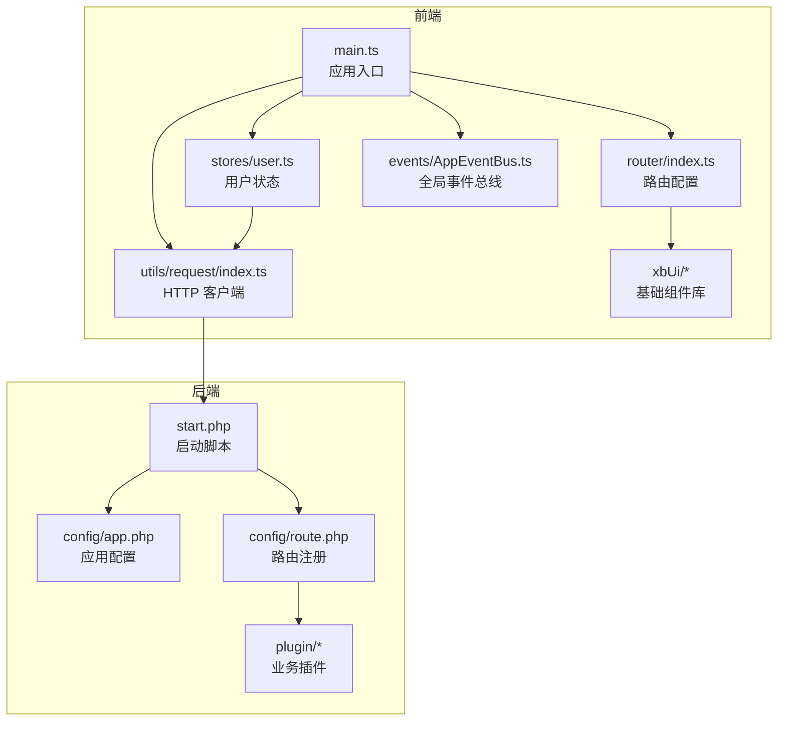
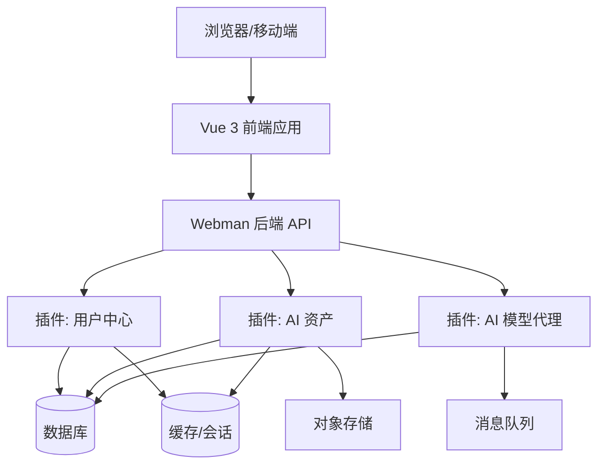
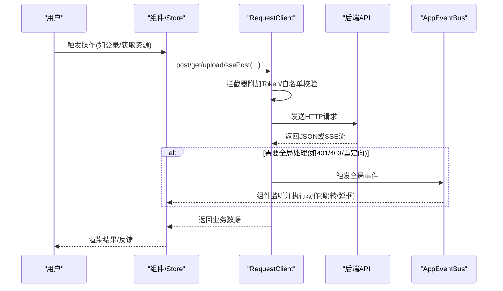
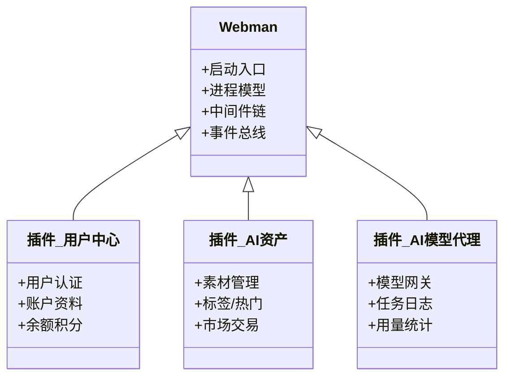
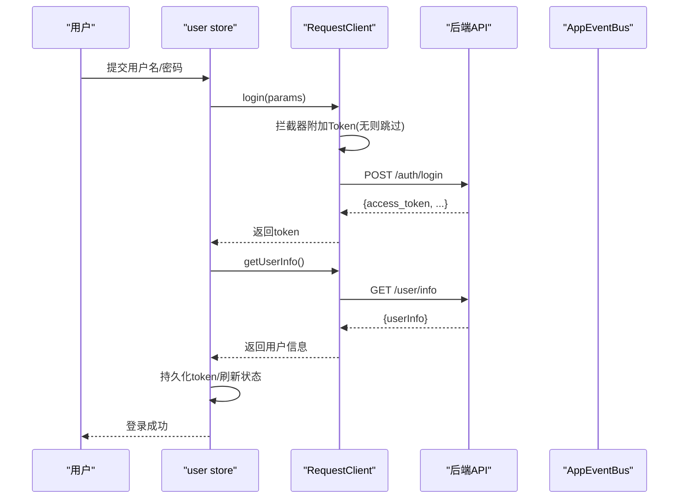
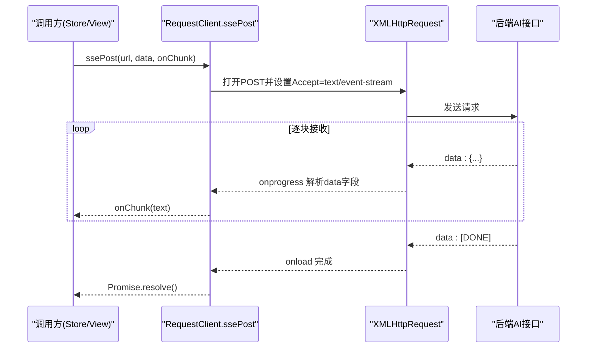
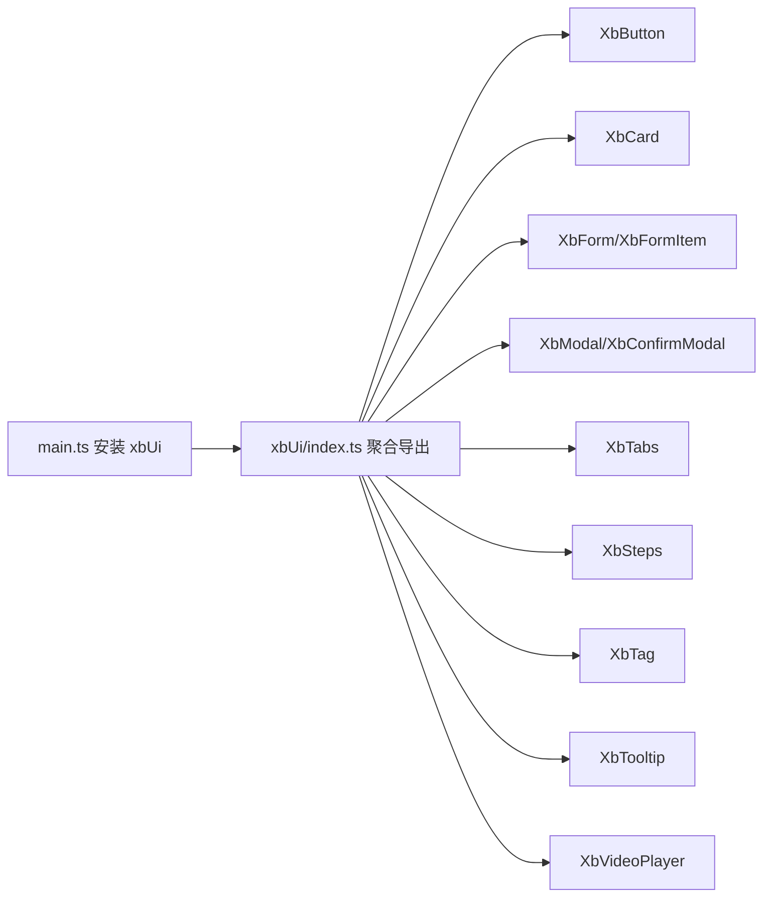
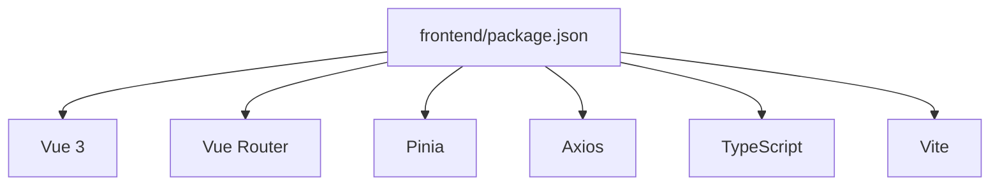
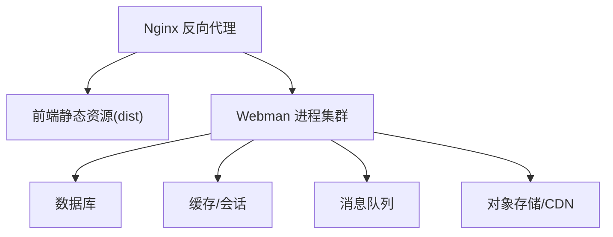

# 架构设计

<cite>
**本文引用的文件**   
- [frontend/src/main.ts](file://frontend/src/main.ts)
- [frontend/src/App.vue](file://frontend/src/App.vue)
- [frontend/src/router/index.ts](file://frontend/src/router/index.ts)
- [frontend/src/utils/request/index.ts](file://frontend/src/utils/request/index.ts)
- [frontend/src/events/AppEventBus.ts](file://frontend/src/events/AppEventBus.ts)
- [frontend/src/stores/user.ts](file://frontend/src/stores/user.ts)
- [frontend/package.json](file://frontend/package.json)
- [server/start.php](file://server/start.php)
- [server/config/app.php](file://server/config/app.php)
- [server/config/route.php](file://server/config/route.php)
- [server/plugin/xbAiModelAgent/plugins.json](file://server/plugin/xbAiModelAgent/plugins.json)
- [server/plugin/xbAiAsset/plugins.json](file://server/plugin/xbAiAsset/plugins.json)
- [server/plugin/xbUser/plugins.json](file://server/plugin/xbUser/plugins.json)
</cite>

## 目录
1. [引言](#引言)
2. [项目结构](#项目结构)
3. [核心组件](#核心组件)
4. [架构总览](#架构总览)
5. [详细组件分析](#详细组件分析)
6. [依赖关系分析](#依赖关系分析)
7. [性能与可扩展性](#性能与可扩展性)
8. [部署拓扑与基础设施](#部署拓扑与基础设施)
9. [故障排查指南](#故障排查指南)
10. [结论](#结论)

## 引言
本文件为积木云AI创作平台的架构设计文档，面向前后端分离、插件化与微服务化演进目标。重点覆盖：
- 系统边界与职责划分
- Vue 3 前端应用架构（路由、状态管理、UI 组件体系、HTTP 客户端）
- Webman 后端架构（进程模型、插件机制、中间件与事件）
- 数据流向与关键交互序列
- 技术决策与约束
- 基础设施需求与部署拓扑
- 可扩展性与演进建议

## 项目结构
仓库采用前后端分离组织方式：
- frontend：基于 Vue 3 + Vite + TypeScript 的前端工程，包含路由、Pinia 状态管理、自定义 UI 组件库 xbUi、统一 HTTP 客户端与事件总线。
- server：基于 Webman 的 PHP 后端，提供 REST API 与后台能力；通过 plugin 目录承载业务插件（如用户中心、AI 资产、AI 模型代理等）。

图表来源
- [frontend/src/main.ts:1-21](file://frontend/src/main.ts#L1-L21)
- [frontend/src/router/index.ts:1-15](file://frontend/src/router/index.ts#L1-L15)
- [frontend/src/utils/request/index.ts:1-237](file://frontend/src/utils/request/index.ts#L1-L237)
- [frontend/src/events/AppEventBus.ts:1-109](file://frontend/src/events/AppEventBus.ts#L1-L109)
- [server/start.php:1-6](file://server/start.php#L1-L6)
- [server/config/app.php:1-13](file://server/config/app.php#L1-L13)
- [server/config/route.php:1-22](file://server/config/route.php#L1-L22)

章节来源
- [frontend/src/main.ts:1-21](file://frontend/src/main.ts#L1-L21)
- [frontend/src/router/index.ts:1-15](file://frontend/src/router/index.ts#L1-L15)
- [server/start.php:1-6](file://server/start.php#L1-L6)
- [server/config/app.php:1-13](file://server/config/app.php#L1-L13)
- [server/config/route.php:1-22](file://server/config/route.php#L1-L22)

## 核心组件
- 前端应用入口与装配
  - 应用初始化、插件式 UI 组件库安装、路由与 Pinia 注入、全局事件处理器注册。
- 路由与守卫
  - 使用 Hash 历史模式，集中注册 beforeEach/afterEach 钩子，实现鉴权与跳转控制。
- 状态管理（Pinia）
  - 以 user store 为代表，封装登录态、用户信息、绑定关系、头像与昵称更新等。
- HTTP 客户端
  - 基于 Axios 封装，统一拦截器、白名单校验、Token 注入、错误广播、SSE 流式请求与上传进度。
- 事件总线
  - 基于 window CustomEvent 的全局事件总线，桥接 HTTP 拦截器与 UI 行为（如弹出登录框）。
- 后端启动与配置
  - Webman 启动脚本加载框架，应用配置定义时区、公共路径、运行时路径等。
- 插件化架构
  - 各业务域以插件形式存在，plugins.json 描述元信息与依赖，便于热插拔与独立维护。

章节来源
- [frontend/src/main.ts:1-21](file://frontend/src/main.ts#L1-L21)
- [frontend/src/router/index.ts:1-15](file://frontend/src/router/index.ts#L1-L15)
- [frontend/src/stores/user.ts:1-327](file://frontend/src/stores/user.ts#L1-L327)
- [frontend/src/utils/request/index.ts:1-237](file://frontend/src/utils/request/index.ts#L1-L237)
- [frontend/src/events/AppEventBus.ts:1-109](file://frontend/src/events/AppEventBus.ts#L1-L109)
- [server/start.php:1-6](file://server/start.php#L1-L6)
- [server/config/app.php:1-13](file://server/config/app.php#L1-L13)
- [server/plugin/xbUser/plugins.json:1-12](file://server/plugin/xbUser/plugins.json#L1-L12)

## 架构总览
系统采用“前后端分离 + 插件化”的总体架构：
- 前端：Vue 3 + Vite + TypeScript + Pinia + Vue Router + 自研 xbUi 组件库 + 统一 HTTP 客户端与事件总线。
- 后端：Webman 高并发 PHP 框架，按插件拆分业务域，支持中间件、事件、队列与定时任务。
- 通信：RESTful JSON 接口为主，结合 SSE 用于 AI 流式输出；文件上传走专用接口并返回可访问 URL。

图表来源
- [frontend/src/main.ts:1-21](file://frontend/src/main.ts#L1-L21)
- [server/start.php:1-6](file://server/start.php#L1-L6)
- [server/config/app.php:1-13](file://server/config/app.php#L1-L13)
- [server/plugin/xbUser/plugins.json:1-12](file://server/plugin/xbUser/plugins.json#L1-L12)
- [server/plugin/xbAiAsset/plugins.json:1-9](file://server/plugin/xbAiAsset/plugins.json#L1-L9)
- [server/plugin/xbAiModelAgent/plugins.json:1-9](file://server/plugin/xbAiModelAgent/plugins.json#L1-L9)

## 详细组件分析

### 前端应用架构
- 应用入口与装配
  - 创建 Vue 应用实例，注入 Pinia、Router、xbUi 组件库，注册全局事件处理器后挂载到 DOM。
- 路由与守卫
  - 使用 createWebHashHistory，集中注册 before/after 钩子，实现鉴权、重定向与页面级埋点。
- 状态管理（Pinia）
  - 以用户域为例，封装登录、注册、密码重置、绑定解绑、头像与昵称更新、本地 token 持久化与并发初始化保护。
- HTTP 客户端
  - 统一 baseURL、超时、白名单、Token 注入、响应体解包、错误事件广播；提供 upload 与 ssePost 方法。
- 事件总线
  - 基于 window CustomEvent，提供 emit/on/off/once 及快捷方法（未授权、禁止、重定向、显示登录弹窗）。

图表来源
- [frontend/src/utils/request/index.ts:1-237](file://frontend/src/utils/request/index.ts#L1-L237)
- [frontend/src/events/AppEventBus.ts:1-109](file://frontend/src/events/AppEventBus.ts#L1-L109)
- [frontend/src/stores/user.ts:1-327](file://frontend/src/stores/user.ts#L1-L327)

章节来源
- [frontend/src/main.ts:1-21](file://frontend/src/main.ts#L1-L21)
- [frontend/src/router/index.ts:1-15](file://frontend/src/router/index.ts#L1-L15)
- [frontend/src/stores/user.ts:1-327](file://frontend/src/stores/user.ts#L1-L327)
- [frontend/src/utils/request/index.ts:1-237](file://frontend/src/utils/request/index.ts#L1-L237)
- [frontend/src/events/AppEventBus.ts:1-109](file://frontend/src/events/AppEventBus.ts#L1-L109)

### 后端架构与插件化
- 启动与配置
  - start.php 作为 CLI 入口，加载框架与应用；app.php 定义调试开关、时区、公共/运行时路径、控制器后缀等。
- 路由与中间件
  - route.php 为路由注册入口，配合中间件实现鉴权、限流、日志等横切关注点。
- 插件化
  - 每个插件拥有独立 plugins.json 描述元信息，可按需启用/禁用；典型插件包括用户中心、AI 资产、AI 模型代理等。
- 进程与扩展
  - Webman 基于 Workerman 的高并发模型，支持常驻进程、多进程 Worker、Channel、Queue、Console 命令等。

图表来源
- [server/start.php:1-6](file://server/start.php#L1-L6)
- [server/config/app.php:1-13](file://server/config/app.php#L1-L13)
- [server/config/route.php:1-22](file://server/config/route.php#L1-L22)
- [server/plugin/xbUser/plugins.json:1-12](file://server/plugin/xbUser/plugins.json#L1-L12)
- [server/plugin/xbAiAsset/plugins.json:1-9](file://server/plugin/xbAiAsset/plugins.json#L1-L9)
- [server/plugin/xbAiModelAgent/plugins.json:1-9](file://server/plugin/xbAiModelAgent/plugins.json#L1-L9)

章节来源
- [server/start.php:1-6](file://server/start.php#L1-L6)
- [server/config/app.php:1-13](file://server/config/app.php#L1-L13)
- [server/config/route.php:1-22](file://server/config/route.php#L1-L22)
- [server/plugin/xbUser/plugins.json:1-12](file://server/plugin/xbUser/plugins.json#L1-L12)
- [server/plugin/xbAiAsset/plugins.json:1-9](file://server/plugin/xbAiAsset/plugins.json#L1-L9)
- [server/plugin/xbAiModelAgent/plugins.json:1-9](file://server/plugin/xbAiModelAgent/plugins.json#L1-L9)

### 关键流程时序

#### 用户登录流程

图表来源
- [frontend/src/stores/user.ts:1-327](file://frontend/src/stores/user.ts#L1-L327)
- [frontend/src/utils/request/index.ts:1-237](file://frontend/src/utils/request/index.ts#L1-L237)

#### SSE 流式对话流程

图表来源
- [frontend/src/utils/request/index.ts:123-227](file://frontend/src/utils/request/index.ts#L123-L227)

### 组件系统设计（xbUi）
- 定位：轻量级、可组合的基础组件集合，服务于平台通用交互（按钮、卡片、表单、模态、分页、步骤、标签、提示等）。
- 组织：按功能拆分子目录，提供 index.ts 聚合导出，便于按需引入与打包优化。
- 集成：在应用入口统一安装，使全局可用。

图表来源
- [frontend/src/main.ts:1-21](file://frontend/src/main.ts#L1-L21)

章节来源
- [frontend/src/main.ts:1-21](file://frontend/src/main.ts#L1-L21)

## 依赖关系分析
- 前端依赖
  - Vue 3、Vue Router、Pinia、Axios、TypeScript、Vite、TailwindCSS 等。
- 后端依赖
  - Webman 框架、Workerman 进程模型、可选 Redis/队列/缓存等（由插件按需引入）。
- 插件间依赖
  - 用户中心插件声明对“储存引擎”“定时任务”等插件的依赖，体现松耦合的组合式架构。

图表来源
- [frontend/package.json:1-35](file://frontend/package.json#L1-L35)

章节来源
- [frontend/package.json:1-35](file://frontend/package.json#L1-L35)
- [server/plugin/xbUser/plugins.json:1-12](file://server/plugin/xbUser/plugins.json#L1-L12)

## 性能与可扩展性
- 前端
  - 使用 Vite 构建与开发体验优化；按需引入 xbUi 组件减少体积；Pinia 单例状态避免重复初始化；SSE 流式输出降低首屏等待。
- 后端
  - Webman 基于协程/进程模型，适合高并发 I/O；插件化隔离业务域，利于水平扩展与灰度发布；中间件与事件机制解耦横切逻辑。
- 可扩展性
  - 新增业务域以插件形式接入；通过路由与中间件进行权限与限流；通过事件与队列异步化耗时任务（如生成、转码、分发）。

## 部署拓扑与基础设施
- 运行环境
  - Node.js（前端构建）、PHP 运行时（Webman）、Nginx（反向代理与静态资源）、MySQL/Redis（持久化与缓存）、对象存储（图片/视频）。
- 部署要点
  - 前端构建产物由 Nginx 静态托管；后端以 CLI 启动 Webman 进程；通过 Nginx 将 /api 转发至后端；静态资源与上传文件走 CDN/对象存储。
- 监控与日志
  - 应用日志、访问日志、错误告警；关键指标 QPS、延迟、错误率、队列堆积等。

## 故障排查指南
- 登录态异常
  - 检查 Token 是否写入/读取正确；确认白名单接口是否误判；观察全局事件是否触发 401/403。
- 网络与跨域
  - 核对 baseURL、CORS 配置、Nginx 转发规则；上传接口需确保 FormData 字段名一致。
- SSE 流中断
  - 检查服务端 Accept 头与文本流格式；确认 onChunk 回调中解析逻辑与 [DONE] 终止条件。
- 插件问题
  - 核对 plugins.json 元信息与依赖；查看运行时日志与队列消费情况。

章节来源
- [frontend/src/utils/request/index.ts:1-237](file://frontend/src/utils/request/index.ts#L1-L237)
- [frontend/src/events/AppEventBus.ts:1-109](file://frontend/src/events/AppEventBus.ts#L1-L109)
- [frontend/src/stores/user.ts:1-327](file://frontend/src/stores/user.ts#L1-L327)

## 结论
本项目以“前后端分离 + 插件化”为核心，前端以 Vue 3 生态为基础，构建出高内聚低耦合的应用层；后端依托 Webman 的高并发特性与插件机制，形成可扩展的业务域边界。通过统一的 HTTP 客户端与事件总线，前后端协作清晰、可观测性强。后续可在以下方向持续演进：
- 前端：引入更完善的错误边界与性能监控；完善 xbUi 主题与国际化。
- 后端：完善插件生命周期与版本治理；引入服务发现与链路追踪；强化安全与审计。
- 运维：容器化与编排、蓝绿/金丝雀发布、全链路压测与容量规划。