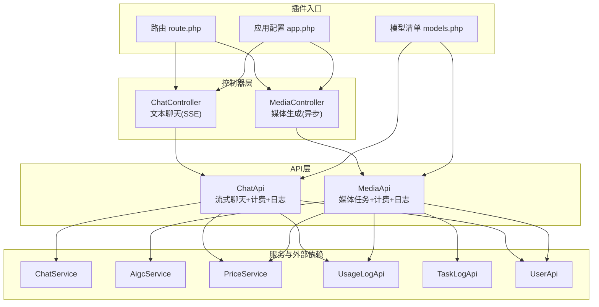
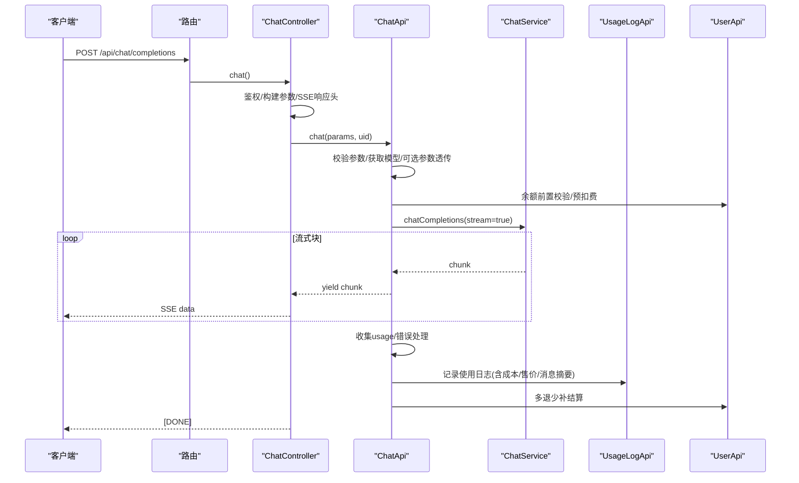
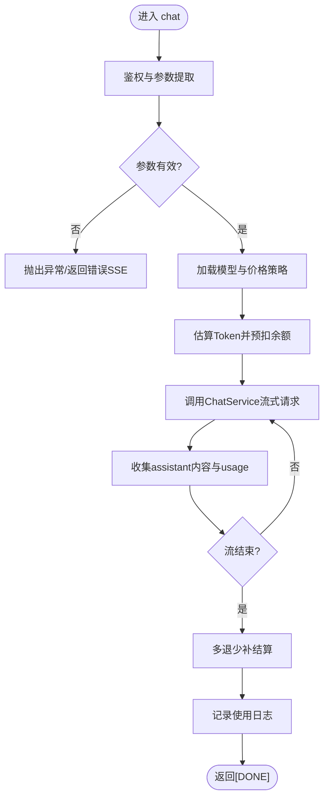
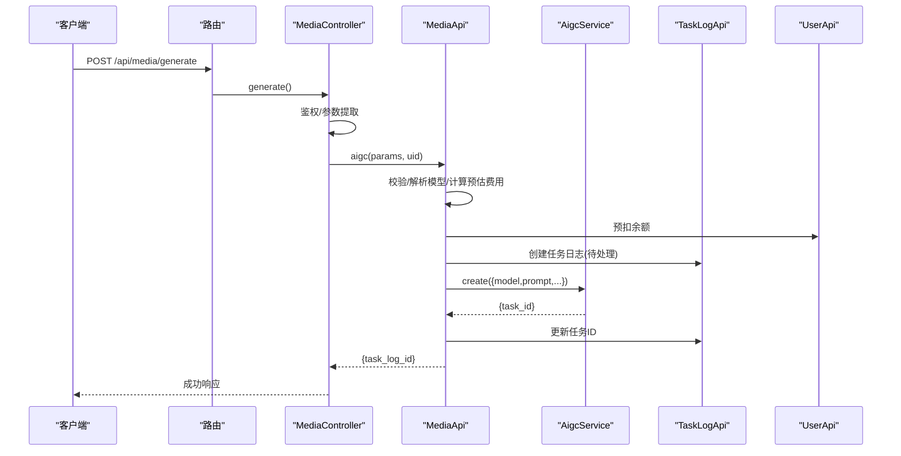
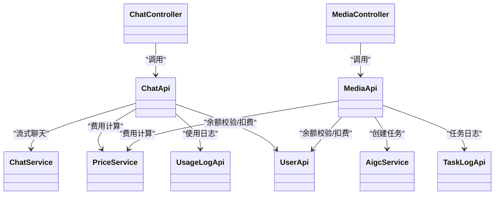

# AI模型代理

<cite>
**本文引用的文件**
- [README.md](file://server/plugin/xbAiModelAgent/README.md)
- [app.php](file://server/plugin/xbAiModelAgent/config/app.php)
- [route.php](file://server/plugin/xbAiModelAgent/config/route.php)
- [models.php](file://server/plugin/xbAiModelAgent/data/models.php)
- [ChatController.php](file://server/plugin/xbAiModelAgent/app/api/controller/ChatController.php)
- [MediaController.php](file://server/plugin/xbAiModelAgent/app/api/controller/MediaController.php)
- [ChatApi.php](file://server/plugin/xbAiModelAgent/api/ChatApi.php)
- [MediaApi.php](file://server/plugin/xbAiModelAgent/api/MediaApi.php)
</cite>

## 目录
1. [简介](#简介)
2. [项目结构](#项目结构)
3. [核心组件](#核心组件)
4. [架构总览](#架构总览)
5. [详细组件分析](#详细组件分析)
6. [依赖关系分析](#依赖关系分析)
7. [性能与并发优化](#性能与并发优化)
8. [故障排查指南](#故障排查指南)
9. [结论](#结论)
10. [附录：接入开发指南](#附录接入开发指南)

## 简介
本模块为积木云AI创作平台的“AI模型代理”插件，提供统一AI模型接入网关、多模型路由、流式文本聊天、媒体生成任务创建、计费统计与成本控制等能力。通过控制器层暴露标准接口，API层完成参数校验、费用预估与预扣、调用下游服务并记录使用日志；数据层以配置化方式维护模型清单与价格策略，便于快速接入OpenAI、Claude、Gemini、通义千问、百川、智谱等多厂商模型。

## 项目结构
该插件采用Webman框架的插件化组织方式，按功能分层：
- 配置层：应用基础配置、路由注册、模型清单与枚举
- 控制器层：HTTP入口，负责鉴权、参数透传、SSE响应头设置
- API层：业务编排，包含模型解析、费用计算、预扣费、日志记录、任务投递
- 服务层（外部依赖）：ChatService、AigcService、PriceService、UsageLogApi、TaskLogApi、UserApi等

图示来源
- [route.php:1-13](file://server/plugin/xbAiModelAgent/config/route.php#L1-L13)
- [app.php:1-10](file://server/plugin/xbAiModelAgent/config/app.php#L1-L10)
- [models.php:1-800](file://server/plugin/xbAiModelAgent/data/models.php#L1-L800)
- [ChatController.php:1-116](file://server/plugin/xbAiModelAgent/app/api/controller/ChatController.php#L1-L116)
- [MediaController.php:1-100](file://server/plugin/xbAiModelAgent/app/api/controller/MediaController.php#L1-L100)
- [ChatApi.php:1-287](file://server/plugin/xbAiModelAgent/api/ChatApi.php#L1-L287)
- [MediaApi.php:1-203](file://server/plugin/xbAiModelAgent/api/MediaApi.php#L1-L203)

章节来源
- [README.md:1-38](file://server/plugin/xbAiModelAgent/README.md#L1-L38)
- [app.php:1-10](file://server/plugin/xbAiModelAgent/config/app.php#L1-L10)
- [route.php:1-13](file://server/plugin/xbAiModelAgent/config/route.php#L1-L13)
- [models.php:1-800](file://server/plugin/xbAiModelAgent/data/models.php#L1-L800)

## 核心组件
- 路由与控制器
  - 文本聊天：POST /api/chat/completions，返回SSE流式响应
  - 媒体生成：POST /api/media/generate，创建图片/音频/视频生成任务
- API编排
  - ChatApi：参数校验、模型解析、预扣费、流式转发、用量收集、结算与日志
  - MediaApi：参数校验、模型解析、费用预估与预扣、任务创建与失败退款、任务日志
- 数据与配置
  - models.php：集中定义模型ID、模态、渠道、价格策略等
  - app.php：插件基础运行配置
- 外部依赖
  - ChatService/AigcService：第三方模型适配与服务调用
  - PriceService：基于模型价格策略的费用计算
  - UsageLogApi/TaskLogApi：使用日志与任务日志持久化
  - UserApi：用户余额校验与扣费/退款

章节来源
- [route.php:1-13](file://server/plugin/xbAiModelAgent/config/route.php#L1-L13)
- [ChatController.php:1-116](file://server/plugin/xbAiModelAgent/app/api/controller/ChatController.php#L1-L116)
- [MediaController.php:1-100](file://server/plugin/xbAiModelAgent/app/api/controller/MediaController.php#L1-L100)
- [ChatApi.php:1-287](file://server/plugin/xbAiModelAgent/api/ChatApi.php#L1-L287)
- [MediaApi.php:1-203](file://server/plugin/xbAiModelAgent/api/MediaApi.php#L1-L203)
- [models.php:1-800](file://server/plugin/xbAiModelAgent/data/models.php#L1-L800)

## 架构总览
整体采用“控制器→API→服务”的分层架构，结合配置化的模型清单与价格策略，实现多模型统一接入与计费闭环。

图示来源
- [route.php:1-13](file://server/plugin/xbAiModelAgent/config/route.php#L1-L13)
- [ChatController.php:1-116](file://server/plugin/xbAiModelAgent/app/api/controller/ChatController.php#L1-L116)
- [ChatApi.php:1-287](file://server/plugin/xbAiModelAgent/api/ChatApi.php#L1-L287)

## 详细组件分析

### 文本聊天（SSE流式）
- 入口与协议
  - 路由映射至ChatController.chat
  - 设置SSE响应头，逐块推送Server-Sent Events，结束标记为[DONE]
- 参数与透传
  - 支持temperature、top_p、n、max_tokens、stop、penalties、tools、tool_choice、response_format、seed、reasoning_effort等
- 计费与日志
  - 根据模型prices估算Token并预扣余额
  - 流结束后汇总usage，执行多退少补，写入使用日志

图示来源
- [ChatController.php:1-116](file://server/plugin/xbAiModelAgent/app/api/controller/ChatController.php#L1-L116)
- [ChatApi.php:1-287](file://server/plugin/xbAiModelAgent/api/ChatApi.php#L1-L287)

章节来源
- [ChatController.php:1-116](file://server/plugin/xbAiModelAgent/app/api/controller/ChatController.php#L1-L116)
- [ChatApi.php:1-287](file://server/plugin/xbAiModelAgent/api/ChatApi.php#L1-L287)

### 媒体生成（异步任务）
- 入口与协议
  - 路由映射至MediaController.generate
  - 表单参数model/prompt/尺寸/时长/反向提示词/参考图等
- 流程要点
  - 参数校验与模型解析
  - 依据模态与规格选择价格策略，进行费用预估与预扣
  - 调用AigcService创建任务，更新任务日志并返回task_log_id
  - 若创建失败，退回已预扣余额并记录失败原因

图示来源
- [route.php:1-13](file://server/plugin/xbAiModelAgent/config/route.php#L1-L13)
- [MediaController.php:1-100](file://server/plugin/xbAiModelAgent/app/api/controller/MediaController.php#L1-L100)
- [MediaApi.php:1-203](file://server/plugin/xbAiModelAgent/api/MediaApi.php#L1-L203)

章节来源
- [MediaController.php:1-100](file://server/plugin/xbAiModelAgent/app/api/controller/MediaController.php#L1-L100)
- [MediaApi.php:1-203](file://server/plugin/xbAiModelAgent/api/MediaApi.php#L1-L203)

### 模型配置与多模型支持
- 模型清单
  - models.php集中定义模型ID、名称、模态、状态、图标、描述、排序与价格策略
  - 价格策略支持按单位（如Token、区间、每张、视频规格）、输入输出单价、最小/最大价、分辨率/时长维度定价
- 多模型路由
  - 通过model字段在API层动态解析到具体第三方模型标识，配合ChatService/AigcService完成实际调用
- 扩展建议
  - 新增模型时，仅需在models.php追加条目，并在服务层实现对应适配即可

章节来源
- [models.php:1-800](file://server/plugin/xbAiModelAgent/data/models.php#L1-L800)

## 依赖关系分析
- 控制器依赖API层，API层依赖服务层与外部API（UserApi、UsageLogApi、TaskLogApi）
- 模型清单作为静态配置被API层读取，驱动费用计算与路由逻辑
- 关键耦合点
  - ChatApi对ChatService的流式调用与UsageLogApi的落库
  - MediaApi对AigcService的任务创建与TaskLogApi的状态管理
  - 两者均依赖PriceService进行费用计算，依赖UserApi进行余额操作

图示来源
- [ChatController.php:1-116](file://server/plugin/xbAiModelAgent/app/api/controller/ChatController.php#L1-L116)
- [MediaController.php:1-100](file://server/plugin/xbAiModelAgent/app/api/controller/MediaController.php#L1-L100)
- [ChatApi.php:1-287](file://server/plugin/xbAiModelAgent/api/ChatApi.php#L1-L287)
- [MediaApi.php:1-203](file://server/plugin/xbAiModelAgent/api/MediaApi.php#L1-L203)

章节来源
- [ChatController.php:1-116](file://server/plugin/xbAiModelAgent/app/api/controller/ChatController.php#L1-L116)
- [MediaController.php:1-100](file://server/plugin/xbAiModelAgent/app/api/controller/MediaController.php#L1-L100)
- [ChatApi.php:1-287](file://server/plugin/xbAiModelAgent/api/ChatApi.php#L1-L287)
- [MediaApi.php:1-203](file://server/plugin/xbAiModelAgent/api/MediaApi.php#L1-L203)

## 性能与并发优化
- 流式传输
  - 使用SSE降低首字节延迟，提升交互体验；避免中间缓存缓冲
- 预扣与结算
  - 预扣减少欠费风险；流结束后多退少补保证公平计费
- 并发控制
  - 建议在服务层引入令牌桶/滑动窗口限流，保护上游模型配额
  - 对长耗时媒体任务采用队列异步处理，避免阻塞HTTP连接
- 资源管理
  - 合理设置超时与重试上限，防止雪崩
  - 对大响应体启用分块传输，减少内存占用
- 可观测性
  - 完善指标采集（QPS、P95/P99延迟、错误率、费用转化率），辅助容量规划

[本节为通用指导，不直接分析具体文件]

## 故障排查指南
- 常见错误
  - 未登录或鉴权失败：检查uid来源与中间件
  - 模型不存在：核对models.php中model_id是否一致
  - 余额不足：确认预扣逻辑与UserApi返回码
  - 任务创建失败：查看TaskLogApi失败原因与退款记录
- 定位方法
  - 查看ChatApi/MediaApi抛出的异常信息
  - 检查UsageLogApi/TaskLogApi中的status与error_msg字段
  - 核对SSE流中是否收到[DONE]与usage事件
- 恢复策略
  - 对瞬时错误增加指数退避重试
  - 对余额类错误及时提示充值或降级模型

章节来源
- [ChatApi.php:1-287](file://server/plugin/xbAiModelAgent/api/ChatApi.php#L1-L287)
- [MediaApi.php:1-203](file://server/plugin/xbAiModelAgent/api/MediaApi.php#L1-L203)

## 结论
本插件通过统一的控制器与API层，将多模型接入、流式响应、费用预估与结算、日志记录等能力解耦，形成可扩展的AI模型代理网关。借助配置化的模型清单与价格策略，能够快速接入多家第三方模型，并提供良好的用户体验与成本可控的计费体系。

[本节为总结性内容，不直接分析具体文件]

## 附录：接入开发指南
- 新增模型接入步骤
  1. 在models.php中添加模型条目，填写model_id、modality、价格策略等
  2. 在服务层实现对应模型的适配（ChatService/AigcService）
  3. 验证路由与控制器参数透传是否正确
  4. 测试SSE流式与任务创建流程，确认日志与计费正确
- 最佳实践
  - 严格校验必填参数，避免空指针与类型错误
  - 对上游调用增加超时与重试上限，避免长时间阻塞
  - 对敏感信息（密钥、签名）使用环境变量或密钥管理服务
  - 对高价值模型设置更严格的限额与风控策略
- 监控与告警
  - 关注错误率突增、延迟升高、费用异常波动
  - 建立模型可用性看板与SLA指标

[本节为通用指导，不直接分析具体文件]