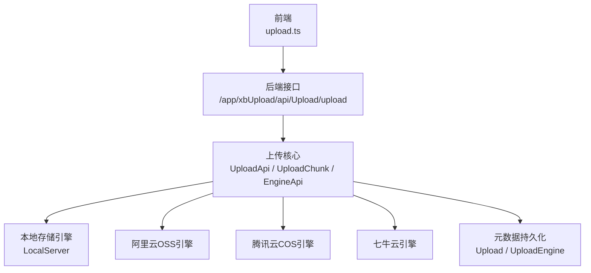
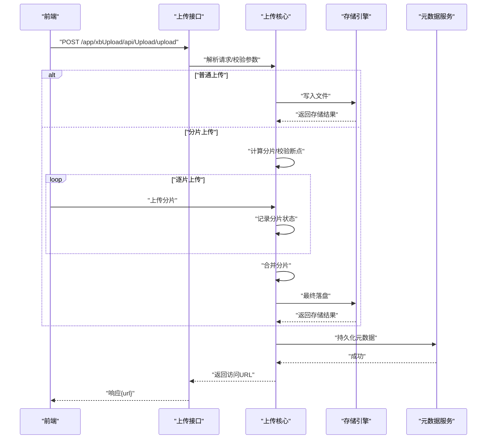
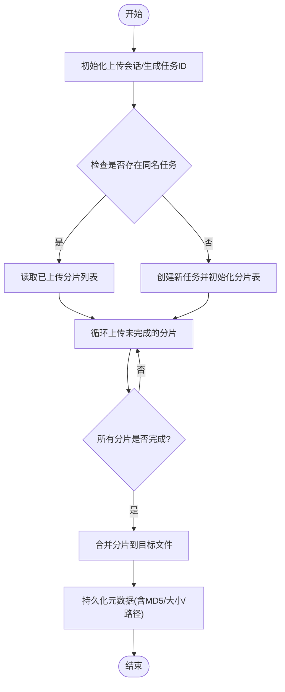
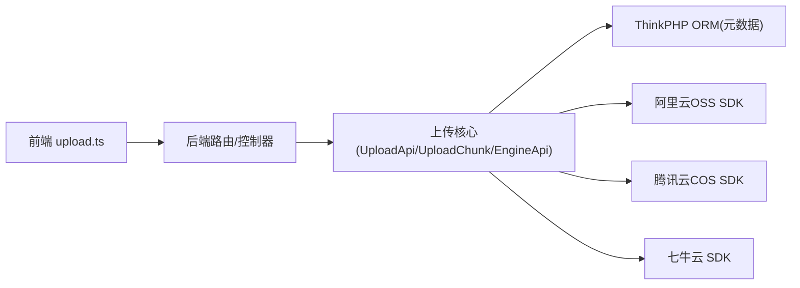

# 上传服务

<cite>
**本文引用的文件**   
- [frontend/src/api/upload.ts](file://frontend/src/api/upload.ts)
- [server/plugin/xbUpload/README.md](file://server/plugin/xbUpload/README.md)
- [server/plugin/xbUpload/setting/config/upload.php](file://server/plugin/xbUpload/setting/config/upload.php)
- [server/plugin/xbUploadCos/setting/config/upload.php](file://server/plugin/xbUploadCos/setting/config/upload.php)
- [server/plugin/xbUploadOss/setting/config/upload.php](file://server/plugin/xbUploadOss/setting/config/upload.php)
- [server/plugin/xbUploadQiniu/setting/config/upload.php](file://server/plugin/xbUploadQiniu/setting/config/upload.php)
</cite>

## 目录
1. [简介](#简介)
2. [项目结构](#项目结构)
3. [核心组件](#核心组件)
4. [架构总览](#架构总览)
5. [详细组件分析](#详细组件分析)
6. [依赖分析](#依赖分析)
7. [性能考虑](#性能考虑)
8. [故障排查指南](#故障排查指南)
9. [结论](#结论)
10. [附录](#附录)

## 简介
本技术文档围绕积木云AI创作平台的“上传服务”模块，系统性阐述多存储引擎架构、断点续传与分片上传策略、统一抽象层实现、大文件处理方案、安全校验与病毒扫描集成思路、以及存储成本优化实践。同时提供存储引擎扩展开发指南与部署配置说明，帮助开发者快速理解并高效扩展上传能力。

## 项目结构
上传服务采用前后端分离的插件化架构：
- 前端通过统一的上传API发起请求，支持进度回调与中断控制。
- 后端以插件形式提供上传能力，内置本地存储与可扩展的云存储驱动（阿里云OSS、腾讯云COS、七牛云等），并通过管理后台进行引擎切换与配置。

图表来源
- [frontend/src/api/upload.ts:1-24](file://frontend/src/api/upload.ts#L1-L24)
- [server/plugin/xbUpload/README.md:38-46](file://server/plugin/xbUpload/README.md#L38-L46)

章节来源
- [frontend/src/api/upload.ts:1-24](file://frontend/src/api/upload.ts#L1-L24)
- [server/plugin/xbUpload/README.md:1-69](file://server/plugin/xbUpload/README.md#L1-L69)

## 核心组件
- 统一上传入口：对外暴露标准化上传接口，支持单文件与并发上传，内置类型与大小校验。
- 分片上传与断点续传：将大文件切分为多个片段上传，服务端记录已存在片段，支持合并与续传。
- 多引擎抽象层：基于驱动模式封装不同存储后端，提供一致的上传、删除、URL生成等能力。
- 文件元数据管理：持久化文件信息（原始名、保存路径、大小、MIME、引擎、MD5等），便于检索与管理。
- 管理后台：可视化查看、搜索、删除文件；一键切换激活的存储引擎。

章节来源
- [server/plugin/xbUpload/README.md:15-46](file://server/plugin/xbUpload/README.md#L15-L46)

## 架构总览
上传服务整体由“前端调用—后端路由—核心逻辑—存储引擎—元数据持久化”构成。核心逻辑负责参数校验、分片编排、断点续传、合并与回写元数据；存储引擎负责具体落盘或对象存储操作；管理后台提供运维与配置能力。

图表来源
- [frontend/src/api/upload.ts:15-23](file://frontend/src/api/upload.ts#L15-L23)
- [server/plugin/xbUpload/README.md:38-46](file://server/plugin/xbUpload/README.md#L38-L46)

## 详细组件分析

### 前端上传客户端
- 职责：封装HTTP上传，支持进度回调与中断控制，统一调用后端上传接口。
- 关键点：字段名约定为“file”，可传入onProgress与abortController以实现进度与取消。

章节来源
- [frontend/src/api/upload.ts:1-24](file://frontend/src/api/upload.ts#L1-L24)

### 后端上传核心
- 上传入口：提供全局上传调用入口，负责参数校验、分片编排、合并与元数据回写。
- 分片与断点：维护分片索引与状态，支持重复上传时跳过已完成分片，提升稳定性与效率。
- 引擎调度：根据当前激活引擎选择对应存储实现，屏蔽底层差异。

章节来源
- [server/plugin/xbUpload/README.md:38-46](file://server/plugin/xbUpload/README.md#L38-L46)

### 存储引擎抽象层
- 设计模式：驱动模式，定义统一接口（上传、删除、获取URL等），各引擎独立实现。
- 默认引擎：本地服务器存储，适合开发与测试环境。
- 云存储扩展：阿里云OSS、腾讯云COS、七牛云等作为可选引擎，在后台可切换。

章节来源
- [server/plugin/xbUpload/README.md:24-32](file://server/plugin/xbUpload/README.md#L24-L32)

### 文件元数据模型
- 内容：记录原始文件名、保存路径、文件大小、MIME类型、存储引擎、MD5校验值等。
- 用途：支撑文件库管理、检索、审计与迁移。

章节来源
- [server/plugin/xbUpload/README.md:29-32](file://server/plugin/xbUpload/README.md#L29-L32)

### 管理后台与配置
- 功能：文件库管理（查看、搜索、删除）、引擎设置（启用/禁用、参数配置）。
- 安装与初始化：按提示执行数据库脚本，启用插件后完成基础配置。

章节来源
- [server/plugin/xbUpload/README.md:48-53](file://server/plugin/xbUpload/README.md#L48-L53)

### 分片上传与断点续传流程

[本节为概念性流程图，不直接映射具体源码文件]

## 依赖分析
- 前端依赖：上传API调用位于前端API层，统一走request工具类。
- 后端依赖：上传核心依赖Webman框架的文件上传能力与ThinkPHP ORM进行元数据持久化。
- 外部依赖：云存储SDK（如阿里云OSS、腾讯云COS、七牛云）通过各自插件引入。

图表来源
- [frontend/src/api/upload.ts:15-23](file://frontend/src/api/upload.ts#L15-L23)
- [server/plugin/xbUpload/README.md:38-46](file://server/plugin/xbUpload/README.md#L38-L46)

章节来源
- [frontend/src/api/upload.ts:1-24](file://frontend/src/api/upload.ts#L1-L24)
- [server/plugin/xbUpload/README.md:33-46](file://server/plugin/xbUpload/README.md#L33-L46)

## 性能考虑
- 分片大小与并发：合理设置分片大小与并发数，平衡网络开销与内存占用。
- 断点续传：利用分片状态避免重复传输，显著降低失败重试成本。
- 流式处理：对超大文件采用流式读写，减少峰值内存。
- 缓存与去重：基于MD5进行文件去重，避免重复存储与处理。
- 存储分层：热数据使用高性能对象存储，冷数据归档至低成本存储。

[本节为通用性能建议，不直接分析具体文件]

## 故障排查指南
- 上传失败：检查网络连通性与后端日志，确认分片状态与合并结果。
- 权限问题：本地存储需确保存储目录具备读写权限。
- 大小限制：调整php.ini中的上传大小相关参数，必要时配合Nginx/Apache配置。
- 引擎不可用：核对云存储密钥、Bucket/域名等配置是否正确。

章节来源
- [server/plugin/xbUpload/README.md:65-69](file://server/plugin/xbUpload/README.md#L65-L69)

## 结论
上传服务通过统一抽象层与插件化引擎设计，实现了跨多种存储后端的稳定上传能力，并结合分片与断点续传显著提升大文件上传的可靠性与效率。结合元数据管理与后台配置，平台可在保证安全与可观测性的前提下灵活扩展新的存储后端，满足多样化业务场景与成本优化需求。

## 附录

### 存储引擎扩展开发指南
- 步骤概览：
  - 在engine目录下新建引擎实现类，继承统一基类。
  - 实现必要接口：上传、删除、获取URL、健康检查等。
  - 注册引擎并在后台启用，完成参数配置。
- 参考路径：
  - 引擎目录与命名空间说明见插件说明文档。

章节来源
- [server/plugin/xbUpload/README.md:38-46](file://server/plugin/xbUpload/README.md#L38-L46)

### 部署与配置说明
- 安装与初始化：
  - 在后台插件市场安装并启用插件。
  - 执行install.sql初始化数据表。
- 基本配置：
  - 前往“设置 > 储存设置”配置默认引擎与参数。
  - 本地存储需确保public/storage目录可写。
- 环境变量与配置文件：
  - 各引擎的配置项可通过对应setting/config下的配置文件进行覆盖与扩展。

章节来源
- [server/plugin/xbUpload/README.md:48-53](file://server/plugin/xbUpload/README.md#L48-L53)
- [server/plugin/xbUpload/setting/config/upload.php](file://server/plugin/xbUpload/setting/config/upload.php)
- [server/plugin/xbUploadCos/setting/config/upload.php](file://server/plugin/xbUploadCos/setting/config/upload.php)
- [server/plugin/xbUploadOss/setting/config/upload.php](file://server/plugin/xbUploadOss/setting/config/upload.php)
- [server/plugin/xbUploadQiniu/setting/config/upload.php](file://server/plugin/xbUploadQiniu/setting/config/upload.php)