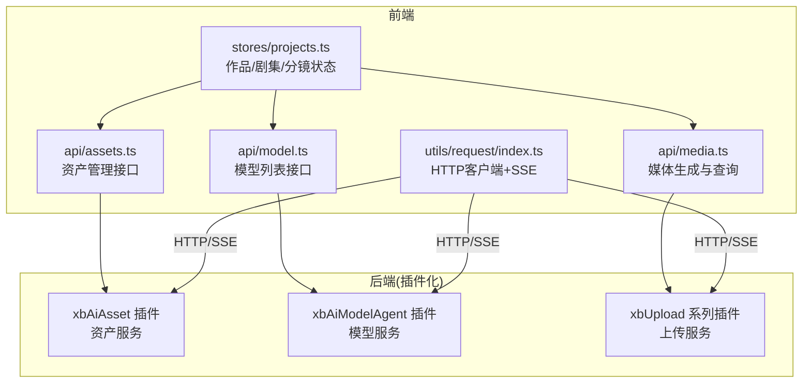
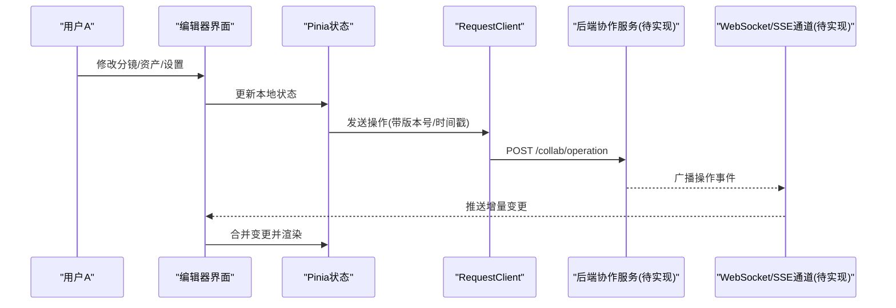
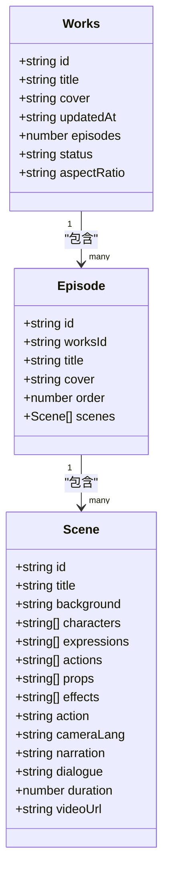
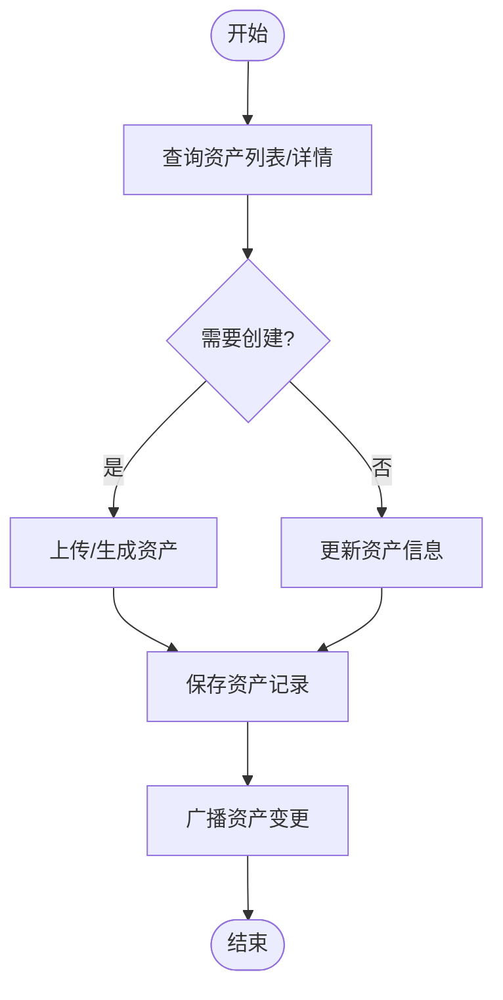
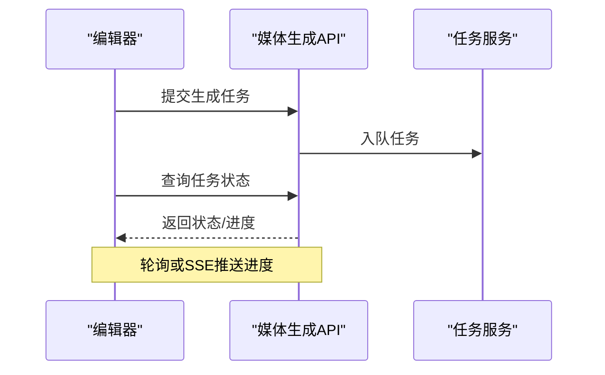
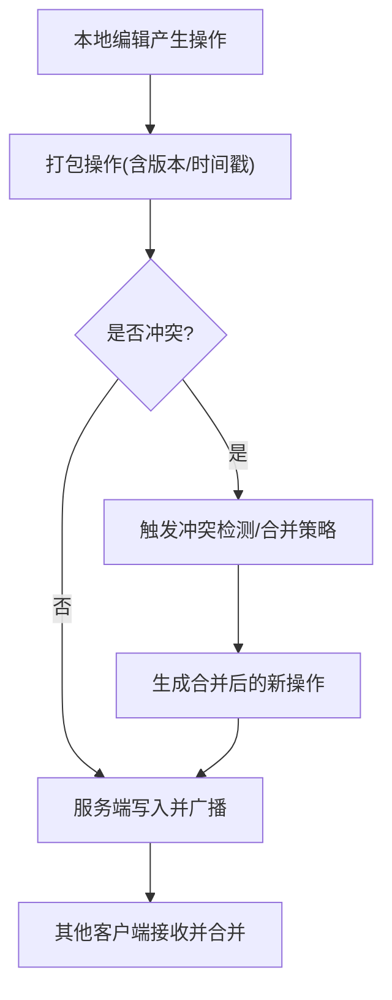
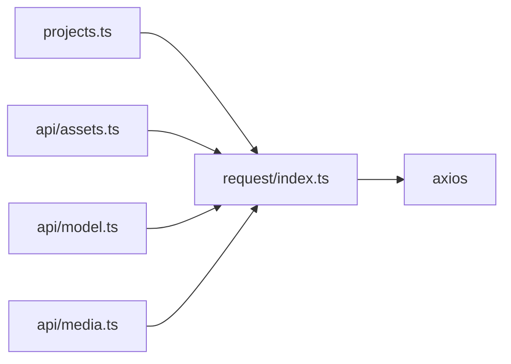

# 协作创作

<cite>
**本文引用的文件**   
- [projects.ts](file://frontend/src/stores/projects.ts)
- [assets.ts](file://frontend/src/api/assets.ts)
- [model.ts](file://frontend/src/api/model.ts)
- [media.ts](file://frontend/src/api/media.ts)
- [index.ts](file://frontend/src/utils/request/index.ts)
</cite>

## 目录
1. [简介](#简介)
2. [项目结构](#项目结构)
3. [核心组件](#核心组件)
4. [架构总览](#架构总览)
5. [详细组件分析](#详细组件分析)
6. [依赖分析](#依赖分析)
7. [性能考虑](#性能考虑)
8. [故障排查指南](#故障排查指南)
9. [结论](#结论)
10. [附录](#附录)

## 简介
本文件面向积木云AI创作平台的“协作创作”模块，围绕项目管理、分镜编辑系统、实体管理（资产）与进度跟踪等核心能力进行系统化说明。文档重点阐述：
- 多人协同编辑的实现方案与数据模型
- 实时同步机制与版本冲突解决思路
- 工作流管理、权限控制、评论反馈与导出分享的技术要点
- 最佳实践与用户体验优化建议

说明：当前仓库中协作相关的前端状态与API已具备基础骨架，但尚未发现服务端协作/实时同步的具体实现代码。因此，本文在基于现有代码的基础上，给出可落地的扩展设计与实施建议，确保读者能据此完成端到端的协作功能落地。

## 项目结构
前端采用 Vue + Pinia 的状态管理模式，通过统一的请求客户端封装网络层；后端为 webman 插件化架构，包含资产、模型、上传等多个插件。协作创作相关的核心文件包括：
- 作品/剧集/分镜的本地状态管理
- 资产与模型的 API 定义
- 媒体生成任务与查询接口
- 统一 HTTP 客户端（含 SSE 流式支持）

图表来源
- [projects.ts:1-279](file://frontend/src/stores/projects.ts#L1-L279)
- [assets.ts:1-135](file://frontend/src/api/assets.ts#L1-L135)
- [model.ts:1-106](file://frontend/src/api/model.ts#L1-L106)
- [media.ts:1-57](file://frontend/src/api/media.ts#L1-L57)
- [index.ts:1-237](file://frontend/src/utils/request/index.ts#L1-L237)

章节来源
- [projects.ts:1-279](file://frontend/src/stores/projects.ts#L1-L279)
- [assets.ts:1-135](file://frontend/src/api/assets.ts#L1-L135)
- [model.ts:1-106](file://frontend/src/api/model.ts#L1-L106)
- [media.ts:1-57](file://frontend/src/api/media.ts#L1-L57)
- [index.ts:1-237](file://frontend/src/utils/request/index.ts#L1-L237)

## 核心组件
- 作品/剧集/分镜状态管理
  - 提供作品增删改查、剧集加载与新增、分镜场景的批量新增、排序与删除等操作，数据结构清晰，便于后续接入真实数据源与协作逻辑。
- 资产管理接口
  - 定义资产类型、来源、CRUD 接口与分页参数，支撑角色、道具、音效、视频等素材的统一管理。
- 模型列表接口
  - 提供模型分组筛选、分页查询，用于选择 AI 生成能力（图像/音频/视频）。
- 媒体生成与查询
  - 定义图片/音频/视频的生成参数与任务查询接口，配合进度跟踪展示生成状态。
- 统一请求客户端
  - 封装 Axios，提供 GET/POST/PUT/DELETE、文件上传进度回调、SSE 流式读取能力，为实时协作与流式输出奠定基础。

章节来源
- [projects.ts:1-279](file://frontend/src/stores/projects.ts#L1-L279)
- [assets.ts:1-135](file://frontend/src/api/assets.ts#L1-L135)
- [model.ts:1-106](file://frontend/src/api/model.ts#L1-L106)
- [media.ts:1-57](file://frontend/src/api/media.ts#L1-L57)
- [index.ts:1-237](file://frontend/src/utils/request/index.ts#L1-L237)

## 架构总览
协作创作的整体架构由“前端状态 + 统一网络层 + 后端插件服务”构成。协作的关键在于将本地状态变更转化为可序列化操作，并通过网络层推送至服务端，再由服务端广播给其他协作者。

图表来源
- [index.ts:123-227](file://frontend/src/utils/request/index.ts#L123-L227)
- [projects.ts:173-279](file://frontend/src/stores/projects.ts#L173-L279)

## 详细组件分析

### 项目管理与分镜编辑
- 数据结构
  - 作品 Works：标识、标题、封面、更新时间、集数、状态、宽高比
  - 剧集 Episode：所属作品ID、标题、封面、排序、分镜列表
  - 分镜 Scene：背景、角色/表情/动作/道具/特效、镜头语言、旁白/对话、时长、视频地址等
- 关键操作
  - 新建/删除/更新作品
  - 加载/新增剧集
  - 新增/批量新增/重排/删除分镜
- 协作扩展点
  - 为每个变更附加操作元信息（操作者、时间戳、版本号），以便服务端做冲突检测与合并
  - 使用操作日志（Operation Log）驱动 CRDT 或 OT 合并策略

图表来源
- [projects.ts:7-70](file://frontend/src/stores/projects.ts#L7-L70)

章节来源
- [projects.ts:7-70](file://frontend/src/stores/projects.ts#L7-L70)
- [projects.ts:137-279](file://frontend/src/stores/projects.ts#L137-L279)

### 实体管理（资产）
- 资产类型与来源
  - 类型：场景图片、人物角色、物品道具、人物音色、事件音效、视频资产
  - 来源：AI生成、自主上传、市场购买
- 接口能力
  - 列表查询（分页、过滤）、详情获取、创建、更新、删除
- 协作扩展点
  - 资产归属与版本：记录创建者、最后修改者、版本哈希
  - 资源锁定：编辑资产时加锁，避免并发覆盖
  - 变更通知：资产更新后向项目成员广播

图表来源
- [assets.ts:1-135](file://frontend/src/api/assets.ts#L1-L135)

章节来源
- [assets.ts:1-135](file://frontend/src/api/assets.ts#L1-L135)

### 进度跟踪机制（媒体生成）
- 生成任务
  - 支持图片/音频/视频生成参数配置
  - 提交任务后轮询或拉取任务状态
- 进度展示
  - 前端根据任务状态显示“排队/生成中/完成/失败”，并提供重试与错误提示
- 协作扩展点
  - 任务队列共享：同一项目内成员可见任务进度
  - 结果缓存与复用：相同输入命中缓存，减少重复生成

图表来源
- [media.ts:1-57](file://frontend/src/api/media.ts#L1-L57)

章节来源
- [media.ts:1-57](file://frontend/src/api/media.ts#L1-L57)

### 实时同步与冲突解决（设计建议）
- 传输通道
  - 优先使用 WebSocket 建立双向通道；若受限，可使用 SSE 作为单向推送通道
  - 利用现有 RequestClient 的 SSE 能力进行服务端推送解析
- 操作建模
  - 将每次编辑抽象为“操作对象”（如插入分镜、修改字段、移动顺序），附带操作者、时间戳、版本号
- 冲突解决
  - 推荐 CRDT（如 Yjs 风格）或 OT（Operational Transformation）策略
  - 服务端维护最终一致视图，客户端仅接收增量并合并
- 一致性保证
  - 幂等性：相同操作多次执行不改变最终结果
  - 去抖与批处理：高频小改动合并为批次，降低带宽压力
  - 断线续传：离线期间缓存本地操作，重连后回放

[本节为概念性设计，无需源码映射]

### 工作流管理与权限控制（设计建议）
- 工作流
  - 定义项目阶段（策划/分镜/制作/审核/发布），不同阶段开放不同编辑能力
  - 节点审批：关键步骤需负责人确认后方可流转
- 权限模型
  - 基于角色的访问控制（RBAC）：所有者、管理员、编辑者、审阅者、观众
  - 资源级权限：对特定资产/分镜/剧集设置读写权限
- 审计与追溯
  - 记录所有关键操作的审计日志，支持回溯与回滚

[本节为概念性设计，无需源码映射]

### 评论反馈与导出分享（设计建议）
- 评论反馈
  - 针对分镜/资产/剧集添加评论，支持@成员、富文本、附件
  - 评论与任务关联，形成闭环
- 导出分享
  - 支持导出项目快照（JSON/ZIP），包含分镜、资产引用、版本信息
  - 生成只读分享链接，限制下载与二次编辑

[本节为概念性设计，无需源码映射]

## 依赖分析
- 前端内部依赖
  - stores/projects.ts 依赖 api/* 与 utils/request/index.ts
  - api/* 均依赖 request 实例发起网络请求
- 外部依赖
  - axios 作为底层 HTTP 库
  - 后端插件：xbAiAsset、xbAiModelAgent、xbUpload 系列

图表来源
- [projects.ts:1-279](file://frontend/src/stores/projects.ts#L1-L279)
- [assets.ts:1-135](file://frontend/src/api/assets.ts#L1-L135)
- [model.ts:1-106](file://frontend/src/api/model.ts#L1-L106)
- [media.ts:1-57](file://frontend/src/api/media.ts#L1-L57)
- [index.ts:1-237](file://frontend/src/utils/request/index.ts#L1-L237)

章节来源
- [projects.ts:1-279](file://frontend/src/stores/projects.ts#L1-L279)
- [assets.ts:1-135](file://frontend/src/api/assets.ts#L1-L135)
- [model.ts:1-106](file://frontend/src/api/model.ts#L1-L106)
- [media.ts:1-57](file://frontend/src/api/media.ts#L1-L57)
- [index.ts:1-237](file://frontend/src/utils/request/index.ts#L1-L237)

## 性能考虑
- 批量操作与去抖
  - 对频繁的小改动（如分镜字段微调）进行批处理与去抖，减少网络往返
- 增量同步
  - 仅传输差异（diff），避免全量同步导致带宽与CPU开销
- 缓存策略
  - 资产与模型列表采用短期缓存；生成任务结果按输入哈希缓存
- 大文件上传
  - 使用分片上传与断点续传，结合进度回调提升体验
- 渲染优化
  - 虚拟滚动长列表（分镜/资产），按需加载预览图

[本节为通用指导，无需源码映射]

## 故障排查指南
- 网络与鉴权
  - 检查 Token 是否正确注入到请求头
  - 非白名单接口未登录将被拒绝（SSE 路径同样校验）
- 错误拦截
  - 统一响应拦截器负责错误处理与事件广播，定位问题时可查看全局错误日志
- 上传异常
  - 关注 onProgress 回调与 AbortController 的使用，必要时中止并重试
- SSE 流式
  - 检查服务端是否返回 text/event-stream 与 data: 行格式
  - 注意缓冲区拼接与 [DONE] 终止信号的处理

章节来源
- [index.ts:46-58](file://frontend/src/utils/request/index.ts#L46-L58)
- [index.ts:132-227](file://frontend/src/utils/request/index.ts#L132-L227)

## 结论
当前前端已具备协作创作的基础数据模型与网络能力。为实现完整的多人协作体验，建议在以下方面推进：
- 引入操作建模与冲突解决策略（CRDT/OT）
- 构建实时通道（WebSocket/SSE）与服务端广播
- 完善权限与工作流引擎，保障流程合规与数据安全
- 强化进度跟踪与导出分享，提升团队协作效率与交付质量

[本节为总结性内容，无需源码映射]

## 附录
- 术语
  - 分镜：构成剧集的最小叙事单元，包含画面、台词、镜头语言等
  - 资产：项目中使用的图片、音频、视频、音效等素材
  - 操作日志：记录用户对资源的每一次变更，用于审计与合并
- 参考实现位置
  - 作品/剧集/分镜状态：[projects.ts:1-279](file://frontend/src/stores/projects.ts#L1-L279)
  - 资产管理接口：[assets.ts:1-135](file://frontend/src/api/assets.ts#L1-L135)
  - 模型列表接口：[model.ts:1-106](file://frontend/src/api/model.ts#L1-L106)
  - 媒体生成与查询：[media.ts:1-57](file://frontend/src/api/media.ts#L1-L57)
  - 请求客户端与SSE：[index.ts:1-237](file://frontend/src/utils/request/index.ts#L1-L237)