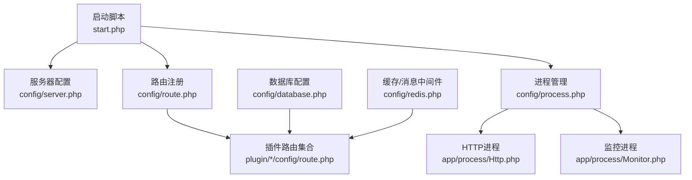
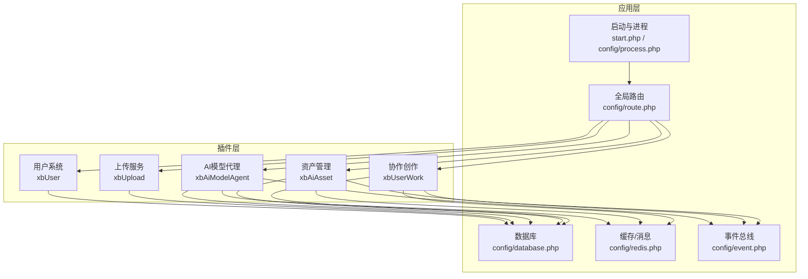
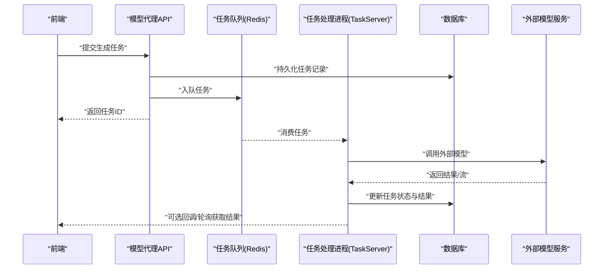
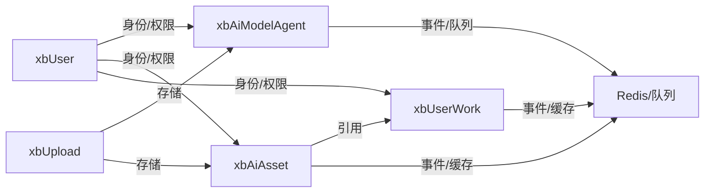

# 核心功能模块

<cite>
**本文引用的文件**   
- [server/README.md](file://server/README.md)
- [server/start.php](file://server/start.php)
- [server/config/server.php](file://server/config/server.php)
- [server/config/route.php](file://server/config/route.php)
- [server/config/database.php](file://server/config/database.php)
- [server/config/redis.php](file://server/config/redis.php)
- [server/config/event.php](file://server/config/event.php)
- [server/config/process.php](file://server/config/process.php)
- [server/app/process/Http.php](file://server/app/process/Http.php)
- [server/app/process/Monitor.php](file://server/app/process/Monitor.php)
- [server/plugin/xbUser/plugins.json](file://server/plugin/xbUser/plugins.json)
- [server/plugin/xbUser/config/route.php](file://server/plugin/xbUser/config/route.php)
- [server/plugin/xbUpload/plugins.json](file://server/plugin/xbUpload/plugins.json)
- [server/plugin/xbUpload/config/route.php](file://server/plugin/xbUpload/config/route.php)
- [server/plugin/xbAiModelAgent/plugins.json](file://server/plugin/xbAiModelAgent/plugins.json)
- [server/plugin/xbAiModelAgent/config/route.php](file://server/plugin/xbAiModelAgent/config/route.php)
- [server/plugin/xbAiModelAgent/process/TaskServer.php](file://server/plugin/xbAiModelAgent/process/TaskServer.php)
- [server/plugin/xbAiAsset/plugins.json](file://server/plugin/xbAiAsset/plugins.json)
- [server/plugin/xbAiAsset/config/route.php](file://server/plugin/xbAiAsset/config/route.php)
- [server/plugin/xbUserWork/plugins.json](file://server/plugin/xbUserWork/plugins.json)
- [server/plugin/xbUserWork/config/route.php](file://server/plugin/xbUserWork/config/route.php)
</cite>

## 目录
1. [简介](#简介)
2. [项目结构](#项目结构)
3. [核心组件](#核心组件)
4. [架构总览](#架构总览)
5. [详细组件分析](#详细组件分析)
6. [依赖关系分析](#依赖关系分析)
7. [性能考量](#性能考量)
8. [故障排查指南](#故障排查指南)
9. [结论](#结论)
10. [附录](#附录)

## 简介
本文件面向积木云AI创作平台的核心功能模块，聚焦用户系统、AI模型代理、资产管理、上传服务、协作创作与资产市场等关键能力。文档从设计理念、职责边界、数据流转、接口规范与扩展机制入手，结合插件化架构与Webman进程模型，给出模块间依赖关系、集成方式与最佳实践指导，帮助开发者快速理解并高效扩展平台能力。

## 项目结构
后端采用基于Webman的渐进式动态页面构建渲染框架，以插件为基本单元组织业务域。核心入口由启动脚本加载配置与进程，各插件通过自身路由与API暴露能力，共享数据库、Redis、事件与队列等基础设施。

图表来源
- [server/start.php](file://server/start.php)
- [server/config/server.php](file://server/config/server.php)
- [server/config/route.php](file://server/config/route.php)
- [server/config/process.php](file://server/config/process.php)
- [server/app/process/Http.php](file://server/app/process/Http.php)
- [server/app/process/Monitor.php](file://server/app/process/Monitor.php)
- [server/config/database.php](file://server/config/database.php)
- [server/config/redis.php](file://server/config/redis.php)

章节来源
- [server/README.md:1-148](file://server/README.md#L1-L148)
- [server/start.php](file://server/start.php)
- [server/config/server.php](file://server/config/server.php)
- [server/config/route.php](file://server/config/route.php)
- [server/config/process.php](file://server/config/process.php)
- [server/app/process/Http.php](file://server/app/process/Http.php)
- [server/app/process/Monitor.php](file://server/app/process/Monitor.php)
- [server/config/database.php](file://server/config/database.php)
- [server/config/redis.php](file://server/config/redis.php)

## 核心组件
- 用户系统（xbUser）：提供用户认证、权限与基础资料管理，作为其他插件的身份与上下文来源。
- 上传服务（xbUpload）：统一文件上传抽象，支持多存储引擎（本地、OSS、COS、七牛等），对外暴露标准上传接口。
- AI模型代理（xbAiModelAgent）：封装多模态模型调用、任务编排、计费与使用统计，提供聊天、媒体生成、任务日志与用量查询等API。
- 资产管理（xbAiAsset）：围绕AI产出的素材进行生命周期管理，包括标签、热门、上架下架、收藏与交易相关能力。
- 协作创作（xbUserWork）：面向用户作品的协作编辑、版本管理与分享，支撑多人协同创作流程。
- 资产市场（xbAiAsset.Market*）：在资产基础上提供商品化能力，如上架、购买、订单与点赞等。

章节来源
- [server/plugin/xbUser/plugins.json](file://server/plugin/xbUser/plugins.json)
- [server/plugin/xbUpload/plugins.json](file://server/plugin/xbUpload/plugins.json)
- [server/plugin/xbAiModelAgent/plugins.json](file://server/plugin/xbAiModelAgent/plugins.json)
- [server/plugin/xbAiAsset/plugins.json](file://server/plugin/xbAiAsset/plugins.json)
- [server/plugin/xbUserWork/plugins.json](file://server/plugin/xbUserWork/plugins.json)

## 架构总览
整体采用“应用 + 插件”的分层架构：
- 应用层：负责进程调度、全局配置、中间件与通用能力。
- 插件层：按业务域划分，各自维护路由、控制器、模型、枚举与服务。
- 基础设施：数据库、Redis、事件总线、任务队列与外部存储。

图表来源
- [server/start.php](file://server/start.php)
- [server/config/process.php](file://server/config/process.php)
- [server/config/route.php](file://server/config/route.php)
- [server/config/database.php](file://server/config/database.php)
- [server/config/redis.php](file://server/config/redis.php)
- [server/config/event.php](file://server/config/event.php)
- [server/plugin/xbUser/plugins.json](file://server/plugin/xbUser/plugins.json)
- [server/plugin/xbUpload/plugins.json](file://server/plugin/xbUpload/plugins.json)
- [server/plugin/xbAiModelAgent/plugins.json](file://server/plugin/xbAiModelAgent/plugins.json)
- [server/plugin/xbAiAsset/plugins.json](file://server/plugin/xbAiAsset/plugins.json)
- [server/plugin/xbUserWork/plugins.json](file://server/plugin/xbUserWork/plugins.json)

## 详细组件分析

### 用户系统（xbUser）
- 职责边界
  - 用户注册登录、会话与令牌管理、角色与权限控制、用户资料维护。
  - 为其他插件提供统一的鉴权上下文与用户标识。
- 数据流转
  - 前端请求携带令牌访问受保护接口；后端校验令牌后注入用户上下文至后续处理链。
- 接口规范
  - 通过插件路由集中注册，遵循REST风格，返回统一响应体。
- 扩展机制
  - 新增第三方登录、自定义字段或权限策略时，优先在插件内扩展，避免侵入应用层。

章节来源
- [server/plugin/xbUser/plugins.json](file://server/plugin/xbUser/plugins.json)
- [server/plugin/xbUser/config/route.php](file://server/plugin/xbUser/config/route.php)

### 上传服务（xbUpload）
- 职责边界
  - 统一文件上传入口、分片/断点续传、类型与大小校验、安全扫描与元信息提取。
  - 抽象存储引擎，支持本地、阿里云OSS、腾讯云COS、七牛云等。
- 数据流转
  - 客户端获取预签名或直接上传；服务端记录文件元数据到数据库，并在Redis中缓存热点信息。
- 接口规范
  - 提供创建上传任务、分片上传、合并完成、查询进度与下载直链等接口。
- 扩展机制
  - 新增存储引擎需实现统一接口契约，并通过配置切换默认引擎。

章节来源
- [server/plugin/xbUpload/plugins.json](file://server/plugin/xbUpload/plugins.json)
- [server/plugin/xbUpload/config/route.php](file://server/plugin/xbUpload/config/route.php)

### AI模型代理（xbAiModelAgent）
- 职责边界
  - 模型接入与适配、提示词模板管理、任务编排与状态机、计费与用量统计、任务日志。
  - 提供聊天、图像/视频生成、任务查询与使用记录等API。
- 数据流转
  - 前端发起生成请求 -> 模型代理创建任务 -> 写入任务表与Redis队列 -> 后台TaskServer消费执行 -> 结果回写与回调通知。
- 接口规范
  - 统一的任务提交与查询接口，包含模型参数、输入内容、输出格式与回调地址。
- 扩展机制
  - 新增模型通过适配器接入；新增模态（文本/图像/视频）通过枚举与处理器扩展。

图表来源
- [server/plugin/xbAiModelAgent/config/route.php](file://server/plugin/xbAiModelAgent/config/route.php)
- [server/plugin/xbAiModelAgent/process/TaskServer.php](file://server/plugin/xbAiModelAgent/process/TaskServer.php)
- [server/config/redis.php](file://server/config/redis.php)

章节来源
- [server/plugin/xbAiModelAgent/plugins.json](file://server/plugin/xbAiModelAgent/plugins.json)
- [server/plugin/xbAiModelAgent/config/route.php](file://server/plugin/xbAiModelAgent/config/route.php)
- [server/plugin/xbAiModelAgent/process/TaskServer.php](file://server/plugin/xbAiModelAgent/process/TaskServer.php)

### 资产管理（xbAiAsset）
- 职责边界
  - 素材入库、分类与标签、热门与推荐、审核与可见性控制、收藏与点赞。
  - 与上传服务解耦，仅持有资源引用与元数据。
- 数据流转
  - 上传完成后回调资产服务，建立资产记录；前台展示走列表/详情/搜索接口。
- 接口规范
  - 提供资产的CRUD、标签管理、热门标签、市场关联等接口。
- 扩展机制
  - 新增资产类型或标签策略，通过枚举与事件扩展。

章节来源
- [server/plugin/xbAiAsset/plugins.json](file://server/plugin/xbAiAsset/plugins.json)
- [server/plugin/xbAiAsset/config/route.php](file://server/plugin/xbAiAsset/config/route.php)

### 协作创作（xbUserWork）
- 职责边界
  - 作品空间、成员邀请与权限、版本管理、评论与批注、发布与分享。
- 数据流转
  - 成员操作触发版本增量更新，变更落库并同步至协作缓存。
- 接口规范
  - 作品CRUD、成员管理、版本对比与合并、协作事件订阅。
- 扩展机制
  - 通过事件总线广播协作变更，供审计、通知与缓存失效使用。

章节来源
- [server/plugin/xbUserWork/plugins.json](file://server/plugin/xbUserWork/plugins.json)
- [server/plugin/xbUserWork/config/route.php](file://server/plugin/xbUserWork/config/route.php)

### 资产市场（xbAiAsset.Market*）
- 职责边界
  - 资产商品化：上架/下架、定价、订单、支付与交付、评价与点赞。
- 数据流转
  - 买家下单 -> 扣费/冻结额度 -> 生成订单 -> 交付资产访问权限 -> 结算与对账。
- 接口规范
  - 商品列表、详情、下单、支付回调、订单查询与退款。
- 扩展机制
  - 支付渠道与结算规则通过策略模式扩展。

章节来源
- [server/plugin/xbAiAsset/plugins.json](file://server/plugin/xbAiAsset/plugins.json)
- [server/plugin/xbAiAsset/config/route.php](file://server/plugin/xbAiAsset/config/route.php)

## 依赖关系分析
- 插件间依赖
  - xbAiModelAgent 依赖 xbUpload（产出物存储）、xbUser（身份与配额）。
  - xbAiAsset 依赖 xbUpload（素材存储）、xbUser（归属与权限）。
  - xbUserWork 依赖 xbUser（成员与权限）、xbAiAsset（引用素材）。
- 基础设施依赖
  - 所有插件共享数据库与Redis；异步任务通过事件与队列解耦。

图表来源
- [server/plugin/xbUser/plugins.json](file://server/plugin/xbUser/plugins.json)
- [server/plugin/xbUpload/plugins.json](file://server/plugin/xbUpload/plugins.json)
- [server/plugin/xbAiModelAgent/plugins.json](file://server/plugin/xbAiModelAgent/plugins.json)
- [server/plugin/xbAiAsset/plugins.json](file://server/plugin/xbAiAsset/plugins.json)
- [server/plugin/xbUserWork/plugins.json](file://server/plugin/xbUserWork/plugins.json)
- [server/config/redis.php](file://server/config/redis.php)

章节来源
- [server/config/redis.php](file://server/config/redis.php)
- [server/config/event.php](file://server/config/event.php)

## 性能考量
- 进程模型
  - Webman常驻内存，HTTP与后台任务分离，提升吞吐与稳定性。
- 缓存与队列
  - 热点数据与任务入队优先走Redis，降低数据库压力。
- 存储分层
  - 大文件走对象存储，数据库仅存元数据；CDN加速静态资源。
- 幂等与重试
  - 任务与支付接口需具备幂等设计，失败重试与死信队列保障可靠性。
- 限流与熔断
  - 对外部模型调用与上传接口实施限流与熔断，防止雪崩。

[本节为通用性能建议，不直接分析具体文件]

## 故障排查指南
- 常见问题定位
  - 启动失败：检查进程配置与端口占用。
  - 路由未命中：确认插件已启用且路由文件正确注册。
  - 任务不执行：核对Redis连接与TaskServer进程是否运行。
  - 上传失败：检查存储引擎配置与网络连通性。
- 日志与监控
  - 查看运行时日志与错误堆栈；关注慢查询与异常告警。
- 恢复策略
  - 重启对应进程；清理阻塞任务；回滚最近变更并验证。

章节来源
- [server/app/process/Http.php](file://server/app/process/Http.php)
- [server/app/process/Monitor.php](file://server/app/process/Monitor.php)

## 结论
积木云AI创作平台以插件化为核心，将用户、上传、模型代理、资产、协作与市场等能力解耦为独立模块，借助Webman进程模型与Redis/数据库等基础设施，形成高内聚、低耦合、可扩展的系统架构。遵循统一的接口规范与扩展机制，可在保证稳定性的同时快速迭代业务特性。

## 附录
- 环境要求与部署要点可参考项目根说明文档。

章节来源
- [server/README.md:1-148](file://server/README.md#L1-L148)