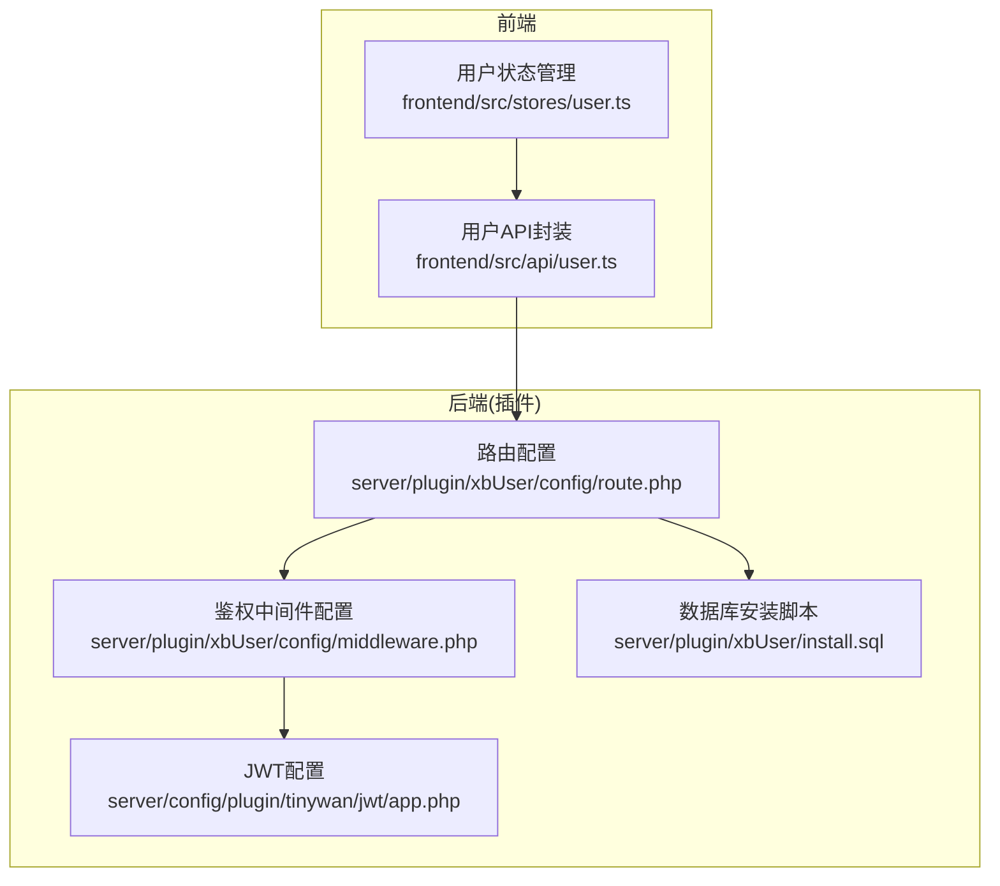
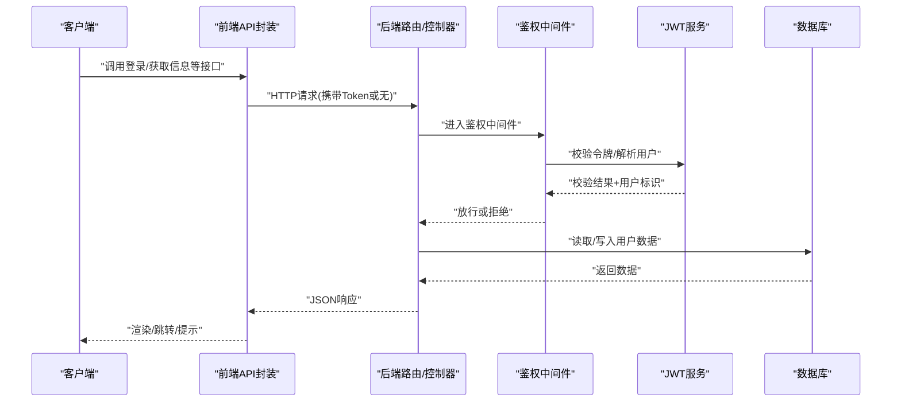
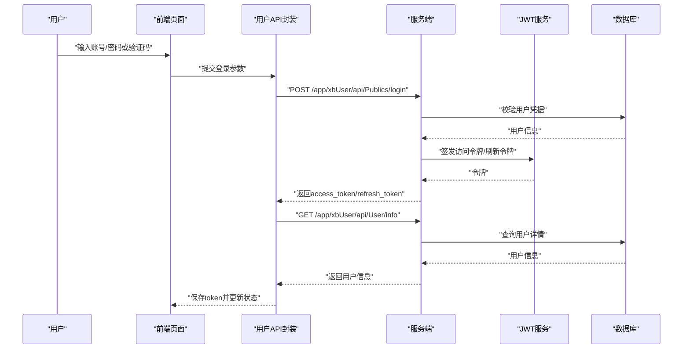
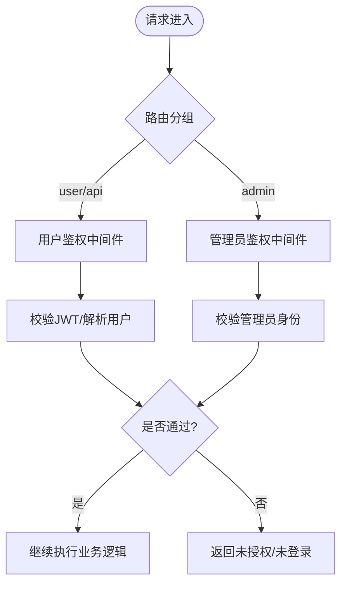
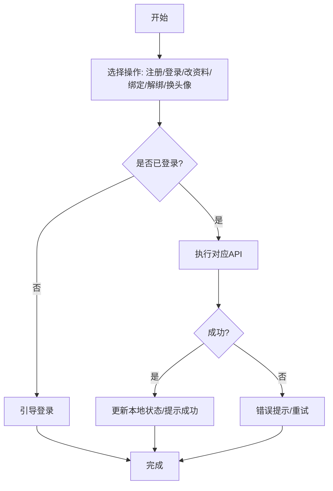
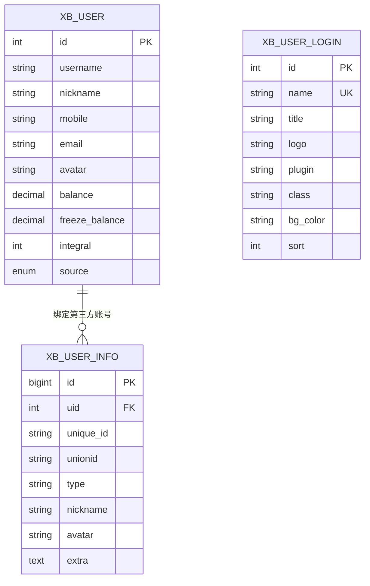
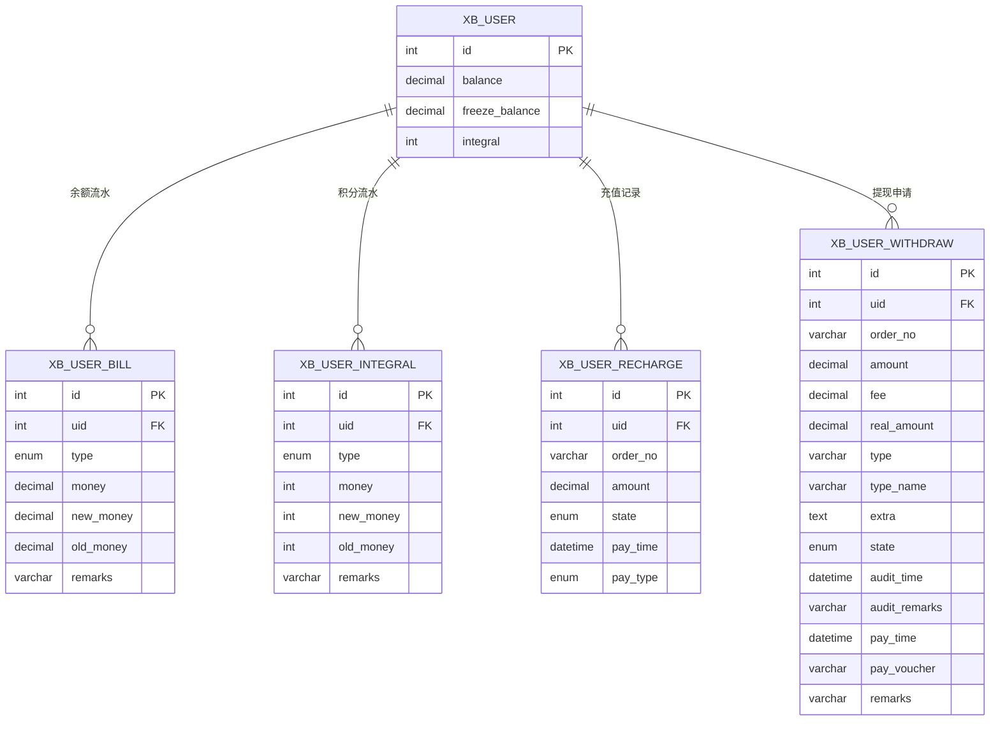
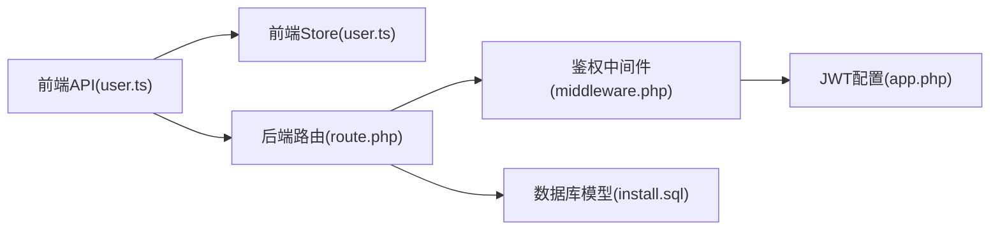

# 用户系统

<cite>
**本文引用的文件**
- [frontend/src/api/user.ts](file://frontend/src/api/user.ts)
- [frontend/src/stores/user.ts](file://frontend/src/stores/user.ts)
- [server/plugin/xbUser/install.sql](file://server/plugin/xbUser/install.sql)
- [server/config/plugin/tinywan/jwt/app.php](file://server/config/plugin/tinywan/jwt/app.php)
- [server/plugin/xbUser/config/middleware.php](file://server/plugin/xbUser/config/middleware.php)
- [server/plugin/xbUser/config/route.php](file://server/plugin/xbUser/config/route.php)
</cite>

## 目录
1. [简介](#简介)
2. [项目结构](#项目结构)
3. [核心组件](#核心组件)
4. [架构总览](#架构总览)
5. [详细组件分析](#详细组件分析)
6. [依赖分析](#依赖分析)
7. [性能考虑](#性能考虑)
8. [故障排查指南](#故障排查指南)
9. [结论](#结论)
10. [附录](#附录)

## 简介
本文件面向“积木云AI创作平台”的用户系统，聚焦以下能力：
- 认证与鉴权：账号密码、手机验证码、邮箱验证码登录；JWT令牌签发与校验；第三方平台（微信、抖音等）集成扩展点。
- 权限控制：基于中间件的访问控制策略，为不同客户端类型提供统一鉴权入口。
- 用户信息管理：注册、登录、资料修改、头像上传、绑定/解绑手机号/邮箱/微信等。
- 积分与余额：账户余额、冻结余额、积分的增扣记录与对账表设计。
- 账单与提现：充值记录、提现申请、审核与打款凭证管理。
- API规范与安全策略：接口路径、请求参数、响应结构、安全建议与最佳实践。

## 项目结构
前端通过统一的API封装调用后端用户中心插件提供的REST接口；后端采用Webman框架，用户功能以插件形式组织，包含路由、中间件、数据模型与安装脚本。

图表来源
- [server/plugin/xbUser/config/route.php:1-11](file://server/plugin/xbUser/config/route.php#L1-L11)
- [server/plugin/xbUser/config/middleware.php:1-13](file://server/plugin/xbUser/config/middleware.php#L1-L13)
- [server/config/plugin/tinywan/jwt/app.php:1-37](file://server/config/plugin/tinywan/jwt/app.php#L1-L37)
- [server/plugin/xbUser/install.sql:1-133](file://server/plugin/xbUser/install.sql#L1-L133)
- [frontend/src/api/user.ts:1-226](file://frontend/src/api/user.ts#L1-L226)
- [frontend/src/stores/user.ts:1-327](file://frontend/src/stores/user.ts#L1-L327)

章节来源
- [server/plugin/xbUser/config/route.php:1-11](file://server/plugin/xbUser/config/route.php#L1-L11)
- [server/plugin/xbUser/config/middleware.php:1-13](file://server/plugin/xbUser/config/middleware.php#L1-L13)
- [server/config/plugin/tinywan/jwt/app.php:1-37](file://server/config/plugin/tinywan/jwt/app.php#L1-L37)
- [server/plugin/xbUser/install.sql:1-133](file://server/plugin/xbUser/install.sql#L1-L133)
- [frontend/src/api/user.ts:1-226](file://frontend/src/api/user.ts#L1-L226)
- [frontend/src/stores/user.ts:1-327](file://frontend/src/stores/user.ts#L1-L327)

## 核心组件
- 前端用户API封装：定义注册、登录、获取用户信息、修改资料、重置密码、图形验证码、手机/邮箱验证码登录、退出登录等接口调用与类型定义。
- 前端用户状态管理：集中管理登录态、用户信息、Token存取、第三方绑定、头像与昵称更新等业务编排。
- 后端鉴权中间件：按客户端分组挂载用户侧鉴权中间件，实现统一鉴权拦截。
- JWT配置：算法、密钥、过期时间、单设备限制、缓存前缀等。
- 数据库模型：用户主表、账单、第三方绑定、积分流水、登录方式、充值、提现等表结构。

章节来源
- [frontend/src/api/user.ts:1-226](file://frontend/src/api/user.ts#L1-L226)
- [frontend/src/stores/user.ts:1-327](file://frontend/src/stores/user.ts#L1-L327)
- [server/plugin/xbUser/config/middleware.php:1-13](file://server/plugin/xbUser/config/middleware.php#L1-L13)
- [server/config/plugin/tinywan/jwt/app.php:1-37](file://server/config/plugin/tinywan/jwt/app.php#L1-L37)
- [server/plugin/xbUser/install.sql:1-133](file://server/plugin/xbUser/install.sql#L1-L133)

## 架构总览
整体流程：前端发起请求 -> 路由分发 -> 鉴权中间件校验JWT -> 控制器处理业务 -> 读写数据库 -> 返回JSON响应。

图表来源
- [server/plugin/xbUser/config/route.php:1-11](file://server/plugin/xbUser/config/route.php#L1-L11)
- [server/plugin/xbUser/config/middleware.php:1-13](file://server/plugin/xbUser/config/middleware.php#L1-L13)
- [server/config/plugin/tinywan/jwt/app.php:1-37](file://server/config/plugin/tinywan/jwt/app.php#L1-L37)
- [frontend/src/api/user.ts:1-226](file://frontend/src/api/user.ts#L1-L226)

## 详细组件分析

### 认证与登录流程
- 支持三种登录方式：账号密码、手机验证码、邮箱验证码。
- 登录成功后返回访问令牌与刷新令牌，前端持久化并用于后续请求。
- 退出登录时清除本地令牌并重置状态。

图表来源
- [frontend/src/api/user.ts:150-226](file://frontend/src/api/user.ts#L150-L226)
- [frontend/src/stores/user.ts:87-170](file://frontend/src/stores/user.ts#L87-L170)
- [server/config/plugin/tinywan/jwt/app.php:1-37](file://server/config/plugin/tinywan/jwt/app.php#L1-L37)

章节来源
- [frontend/src/api/user.ts:150-226](file://frontend/src/api/user.ts#L150-L226)
- [frontend/src/stores/user.ts:87-170](file://frontend/src/stores/user.ts#L87-L170)
- [server/config/plugin/tinywan/jwt/app.php:1-37](file://server/config/plugin/tinywan/jwt/app.php#L1-L37)

### 权限控制与中间件
- 用户端鉴权中间件在“user”和“api”两组中启用，确保受保护接口需携带有效令牌。
- 管理员端使用独立中间件组，避免越权访问。

图表来源
- [server/plugin/xbUser/config/middleware.php:1-13](file://server/plugin/xbUser/config/middleware.php#L1-L13)

章节来源
- [server/plugin/xbUser/config/middleware.php:1-13](file://server/plugin/xbUser/config/middleware.php#L1-L13)

### 用户信息管理
- 注册：支持邀请码、图形验证码、邮箱/短信验证码等可选条件。
- 登录态初始化：页面刷新时根据本地Token拉取用户信息，失败则清理状态。
- 资料修改：支持单字段更新与批量资料更新（昵称、头像）。
- 绑定/解绑：手机号、邮箱、微信等第三方账号绑定与解绑。
- 头像上传：先上传图片获取URL，再更新用户资料字段。

图表来源
- [frontend/src/api/user.ts:150-226](file://frontend/src/api/user.ts#L150-L226)
- [frontend/src/stores/user.ts:53-170](file://frontend/src/stores/user.ts#L53-L170)
- [frontend/src/stores/user.ts:205-298](file://frontend/src/stores/user.ts#L205-L298)

章节来源
- [frontend/src/api/user.ts:150-226](file://frontend/src/api/user.ts#L150-L226)
- [frontend/src/stores/user.ts:53-170](file://frontend/src/stores/user.ts#L53-L170)
- [frontend/src/stores/user.ts:205-298](file://frontend/src/stores/user.ts#L205-L298)

### 第三方平台集成（微信、抖音等）
- 登录方式表提供平台标识、名称、图标、插件标识、实现类命名空间等元数据，便于动态加载第三方登录实现。
- 第三方用户表记录唯一标识、unionid、类型、昵称、头像及扩展JSON，支撑多平台账号关联。
- 用户主表source字段标记注册来源，便于统计与分析。

图表来源
- [server/plugin/xbUser/install.sql:1-133](file://server/plugin/xbUser/install.sql#L1-L133)

章节来源
- [server/plugin/xbUser/install.sql:1-133](file://server/plugin/xbUser/install.sql#L1-L133)

### 积分系统与余额管理
- 余额与冻结余额：用户主表直接维护当前值，配合账单表记录每次变动的前后值与理由。
- 积分：独立流水表记录增减前后值与备注，保证可追溯。
- 充值与提现：分别有独立的订单表，记录金额、状态、支付方式、审核与打款信息。

图表来源
- [server/plugin/xbUser/install.sql:1-133](file://server/plugin/xbUser/install.sql#L1-L133)

章节来源
- [server/plugin/xbUser/install.sql:1-133](file://server/plugin/xbUser/install.sql#L1-L133)

### API接口规范（节选）
以下为前端已定义的常用接口路径与用途说明（仅列出关键项）：
- 注册：POST /app/xbUser/api/Publics/register
- 登录：POST /app/xbUser/api/Publics/login
- 获取用户信息：GET /app/xbUser/api/User/info
- 修改资料（单字段）：PUT /app/xbUser/api/User/profile
- 修改资料（昵称/头像）：PUT /app/xbUser/api/User/editProfile
- 修改密码：PUT /app/xbUser/api/User/password
- 找回密码：PUT /app/xbUser/api/Publics/findPassword
- 获取图像验证码：GET /app/xbUser/api/Publics/captcha
- 手机验证码登录：POST /app/xbUser/api/Publics/mobileLogin
- 邮箱验证码登录：POST /app/xbUser/api/Publics/emailLogin
- 退出登录：DELETE /app/xbUser/api/Publics/logout

章节来源
- [frontend/src/api/user.ts:150-226](file://frontend/src/api/user.ts#L150-L226)

### 安全策略与最佳实践
- 令牌安全
  - 使用强随机密钥与合适的算法（HS256），合理设置访问令牌与刷新令牌的过期时间。
  - 开启单设备限制或按需关闭，结合缓存前缀进行令牌生命周期管理。
- 传输安全
  - 全站HTTPS，防止中间人攻击。
  - 敏感字段（如密码）不在日志中输出。
- 输入校验
  - 严格校验用户名、手机号、邮箱格式；验证码防重放与频率限制。
- 权限隔离
  - 管理员与用户中间件分离，避免越权访问。
- 审计与对账
  - 所有余额与积分变动必须落库到对应流水表，保留旧值、新值与备注。
  - 提现与充值记录需具备幂等键（order_no）与状态机流转。

章节来源
- [server/config/plugin/tinywan/jwt/app.php:1-37](file://server/config/plugin/tinywan/jwt/app.php#L1-L37)
- [server/plugin/xbUser/config/middleware.php:1-13](file://server/plugin/xbUser/config/middleware.php#L1-L13)
- [server/plugin/xbUser/install.sql:1-133](file://server/plugin/xbUser/install.sql#L1-L133)

## 依赖分析
- 前端依赖
  - 用户API封装依赖通用请求工具与类型定义。
  - 用户状态管理依赖API封装、上传与绑定相关API。
- 后端依赖
  - 路由配置指向用户中心控制器与方法。
  - 中间件配置引入用户鉴权中间件。
  - JWT插件提供令牌签发与校验能力。
  - 安装脚本提供完整的数据模型。

图表来源
- [frontend/src/api/user.ts:1-226](file://frontend/src/api/user.ts#L1-L226)
- [frontend/src/stores/user.ts:1-327](file://frontend/src/stores/user.ts#L1-L327)
- [server/plugin/xbUser/config/route.php:1-11](file://server/plugin/xbUser/config/route.php#L1-L11)
- [server/plugin/xbUser/config/middleware.php:1-13](file://server/plugin/xbUser/config/middleware.php#L1-L13)
- [server/config/plugin/tinywan/jwt/app.php:1-37](file://server/config/plugin/tinywan/jwt/app.php#L1-L37)
- [server/plugin/xbUser/install.sql:1-133](file://server/plugin/xbUser/install.sql#L1-L133)

章节来源
- [frontend/src/api/user.ts:1-226](file://frontend/src/api/user.ts#L1-L226)
- [frontend/src/stores/user.ts:1-327](file://frontend/src/stores/user.ts#L1-L327)
- [server/plugin/xbUser/config/route.php:1-11](file://server/plugin/xbUser/config/route.php#L1-L11)
- [server/plugin/xbUser/config/middleware.php:1-13](file://server/plugin/xbUser/config/middleware.php#L1-L13)
- [server/config/plugin/tinywan/jwt/app.php:1-37](file://server/config/plugin/tinywan/jwt/app.php#L1-L37)
- [server/plugin/xbUser/install.sql:1-133](file://server/plugin/xbUser/install.sql#L1-L133)

## 性能考虑
- 令牌缓存：利用JWT插件的缓存前缀与TTL减少重复校验开销。
- 并发初始化：前端在页面刷新时合并用户信息初始化Promise，避免重复请求。
- 图片上传：先上传后更新资料字段，减少大对象在网络中的往返次数。
- 索引优化：账单、积分、提现等高频查询字段建立合适索引（如uid、state、order_no）。

[本节为通用指导，不直接分析具体文件]

## 故障排查指南
- 登录失败
  - 检查验证码是否过期或错误；确认账号密码是否正确；查看服务端日志与数据库记录。
- Token失效
  - 前端会在获取用户信息失败时清理本地Token并重置状态；必要时触发重新登录。
- 绑定/解绑异常
  - 核对验证码有效性；检查绑定关系是否存在冲突（如唯一性约束）。
- 余额/积分不一致
  - 核对流水表新旧值与备注；检查事务是否回滚；确认幂等键是否重复。
- 第三方登录问题
  - 检查登录方式表中class与plugin配置是否正确；核对第三方回调参数映射。

章节来源
- [frontend/src/stores/user.ts:53-170](file://frontend/src/stores/user.ts#L53-L170)
- [server/plugin/xbUser/install.sql:1-133](file://server/plugin/xbUser/install.sql#L1-L133)

## 结论
本用户系统以前端API封装与状态管理为核心，结合后端中间件鉴权与JWT机制，实现了完整的认证、权限、用户信息与资金/积分管理体系。通过清晰的表结构与规范的API路径，为后续扩展第三方登录、支付与风控提供了坚实基础。

[本节为总结性内容，不直接分析具体文件]

## 附录
- 示例场景
  - 新用户注册：填写账号、密码、昵称，可选择邀请码与验证码，完成后自动登录或跳转登录页。
  - 手机验证码登录：发送验证码后提交，成功后保存Token并拉取用户信息。
  - 修改头像：上传头像图片，获取URL后更新用户资料字段。
  - 申请提现：填写提现金额与方式，生成订单号并落库，等待审核与打款。
- 参考路径
  - 前端API定义与类型：[frontend/src/api/user.ts](file://frontend/src/api/user.ts)
  - 前端状态管理：[frontend/src/stores/user.ts](file://frontend/src/stores/user.ts)
  - 后端路由与中间件：[server/plugin/xbUser/config/route.php](file://server/plugin/xbUser/config/route.php)、[server/plugin/xbUser/config/middleware.php](file://server/plugin/xbUser/config/middleware.php)
  - JWT配置：[server/config/plugin/tinywan/jwt/app.php](file://server/config/plugin/tinywan/jwt/app.php)
  - 数据模型：[server/plugin/xbUser/install.sql](file://server/plugin/xbUser/install.sql)