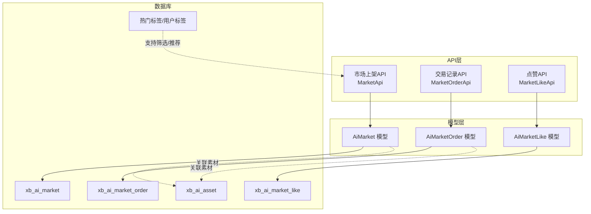
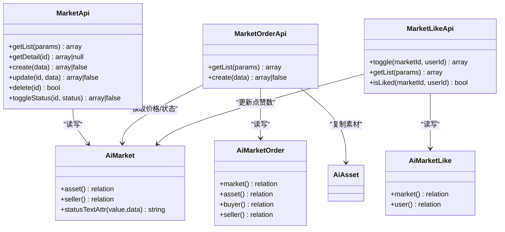
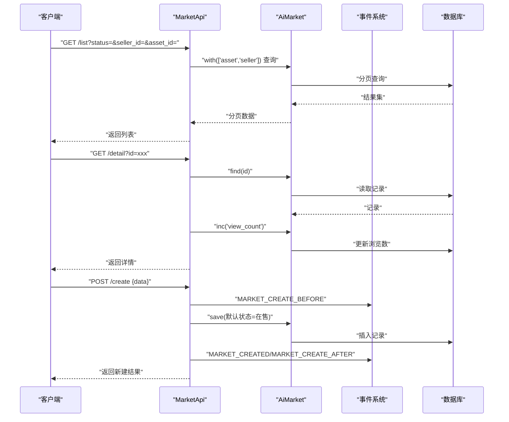
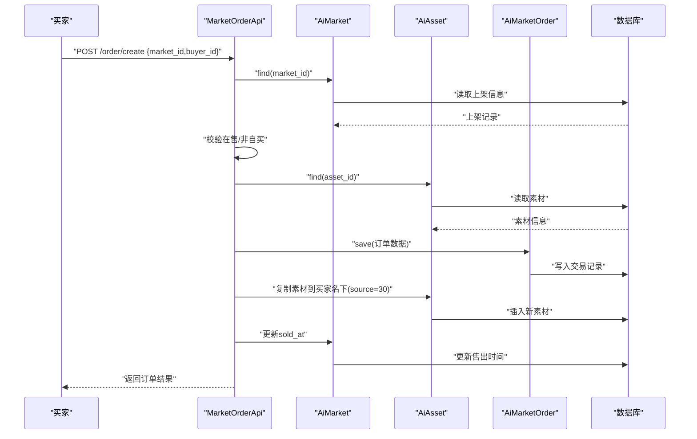
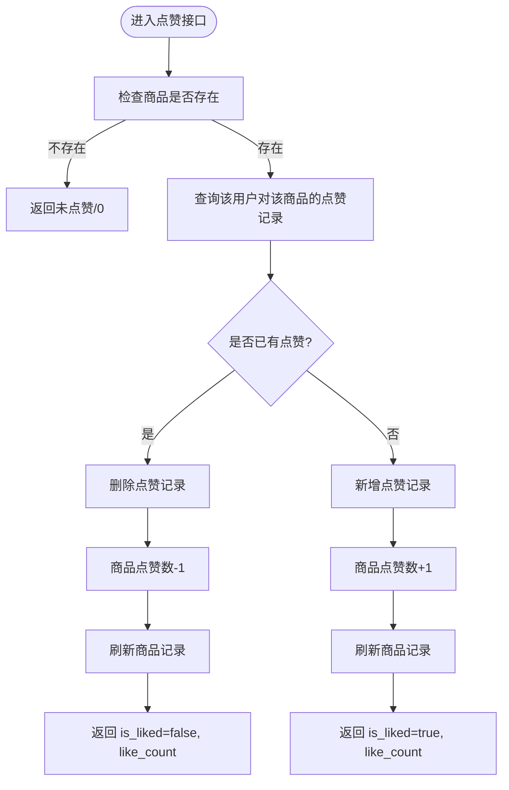
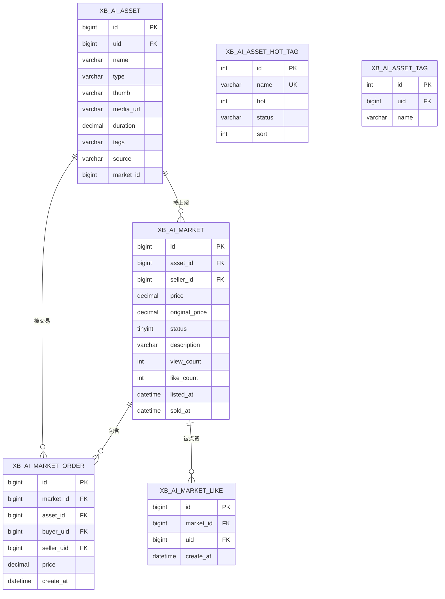
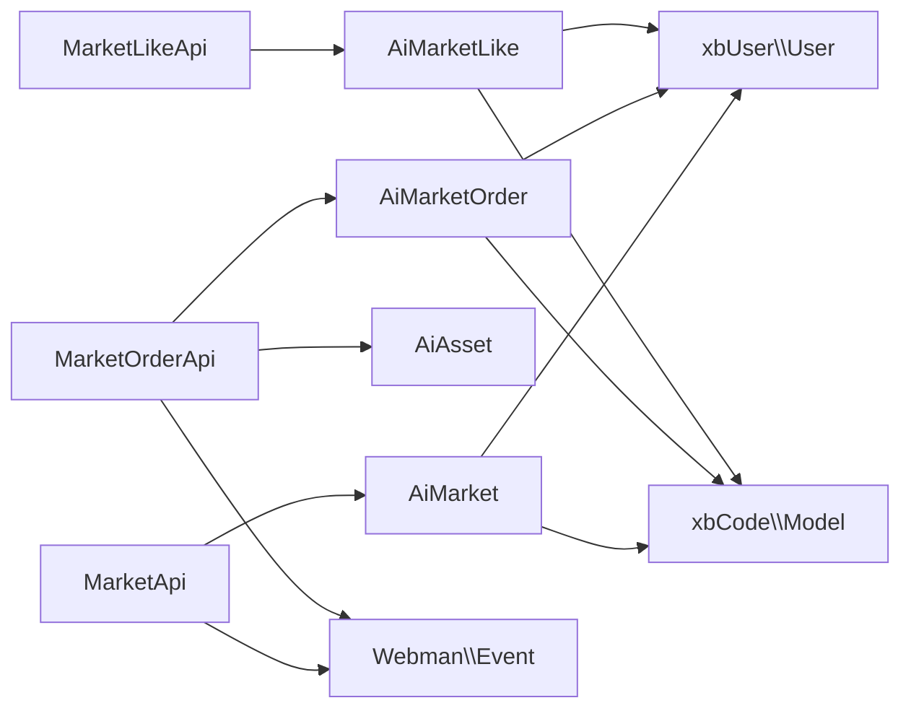

# 资产市场

<cite>
**本文引用的文件**   
- [MarketApi.php](file://server/plugin\xbAiAsset\api\MarketApi.php)
- [MarketOrderApi.php](file://server/plugin\xbAiAsset\api\MarketOrderApi.php)
- [MarketLikeApi.php](file://server/plugin\xbAiAsset\api\MarketLikeApi.php)
- [AiMarket.php](file://server/plugin\xbAiAsset\app\model\AiMarket.php)
- [AiMarketOrder.php](file://server/plugin\xbAiAsset\app\model\AiMarketOrder.php)
- [AiMarketLike.php](file://server/plugin\xbAiAsset\app\model\AiMarketLike.php)
- [install.sql](file://server/plugin\xbAiAsset\install.sql)
</cite>

## 目录
1. [简介](#简介)
2. [项目结构](#项目结构)
3. [核心组件](#核心组件)
4. [架构总览](#架构总览)
5. [详细组件分析](#详细组件分析)
6. [依赖关系分析](#依赖关系分析)
7. [性能与扩展性](#性能与扩展性)
8. [故障排查指南](#故障排查指南)
9. [结论](#结论)
10. [附录](#附录)

## 简介
本文件为积木云AI创作平台“资产市场”模块的技术与运营文档。围绕商品上架、交易处理、评价反馈（点赞）、数据展示与分析等核心能力，结合订单管理、支付集成、版权保护、收益分配与风险控制等商业化能力进行系统化说明，并提供前端展示优化、搜索推荐、用户行为分析与运营工具建议，以及商业模式设计与平台治理策略。

## 项目结构
资产市场以插件形式提供，后端采用 PHP + Webman 架构，核心由 API 层与模型层组成，数据库通过安装脚本初始化表结构。

图表来源
- [MarketApi.php:1-191](file://server/plugin\xbAiAsset\api\MarketApi.php#L1-L191)
- [MarketOrderApi.php:1-144](file://server/plugin\xbAiAsset\api\MarketOrderApi.php#L1-L144)
- [MarketLikeApi.php:1-118](file://server/plugin\xbAiAsset\api\MarketLikeApi.php#L1-L118)
- [AiMarket.php:1-51](file://server/plugin\xbAiAsset\app\model\AiMarket.php#L1-L51)
- [AiMarketOrder.php:1-63](file://server/plugin\xbAiAsset\app\model\AiMarketOrder.php#L1-L63)
- [AiMarketLike.php:1-45](file://server/plugin\xbAiAsset\app\model\AiMarketLike.php#L1-L45)
- [install.sql:1-105](file://server/plugin\xbAiAsset\install.sql#L1-L105)

章节来源
- [MarketApi.php:1-191](file://server/plugin\xbAiAsset\api\MarketApi.php#L1-L191)
- [MarketOrderApi.php:1-144](file://server/plugin\xbAiAsset\api\MarketOrderApi.php#L1-L144)
- [MarketLikeApi.php:1-118](file://server/plugin\xbAiAsset\api\MarketLikeApi.php#L1-L118)
- [AiMarket.php:1-51](file://server/plugin\xbAiAsset\app\model\AiMarket.php#L1-L51)
- [AiMarketOrder.php:1-63](file://server/plugin\xbAiAsset\app\model\AiMarketOrder.php#L1-L63)
- [AiMarketLike.php:1-45](file://server/plugin\xbAiAsset\app\model\AiMarketLike.php#L1-L45)
- [install.sql:1-105](file://server/plugin\xbAiAsset\install.sql#L1-L105)

## 核心组件
- 市场上架API：提供上架列表、详情、创建、更新、删除、状态切换等能力，并在关键节点触发事件钩子，便于扩展审计、通知、风控等逻辑。
- 交易记录API：负责下单校验、创建交易记录、复制素材到买家名下、标记售出时间等。
- 点赞API：提供点赞/取消点赞切换、是否已点赞判断、点赞列表查询，并同步更新商品点赞数。
- 模型层：定义与数据库表的映射关系及关联查询（素材、卖家、买家、用户等），并提供状态文本获取器等便捷方法。
- 数据库：包含市场上架、交易记录、点赞、素材、热门标签与用户标签等表，支撑检索、统计与推荐。

章节来源
- [MarketApi.php:1-191](file://server/plugin\xbAiAsset\api\MarketApi.php#L1-L191)
- [MarketOrderApi.php:1-144](file://server/plugin\xbAiAsset\api\MarketOrderApi.php#L1-L144)
- [MarketLikeApi.php:1-118](file://server/plugin\xbAiAsset\api\MarketLikeApi.php#L1-L118)
- [AiMarket.php:1-51](file://server/plugin\xbAiAsset\app\model\AiMarket.php#L1-L51)
- [AiMarketOrder.php:1-63](file://server/plugin\xbAiAsset\app\model\AiMarketOrder.php#L1-L63)
- [AiMarketLike.php:1-45](file://server/plugin\xbAiAsset\app\model\AiMarketLike.php#L1-L45)
- [install.sql:1-105](file://server/plugin\xbAiAsset\install.sql#L1-L105)

## 架构总览
资产市场采用“API + Model + DB”的清晰分层，API 层封装业务编排与事件分发，Model 层维护数据关系与字段计算，DB 层提供持久化与索引支持。

图表来源
- [MarketApi.php:1-191](file://server/plugin\xbAiAsset\api\MarketApi.php#L1-L191)
- [MarketOrderApi.php:1-144](file://server/plugin\xbAiAsset\api\MarketOrderApi.php#L1-L144)
- [MarketLikeApi.php:1-118](file://server/plugin\xbAiAsset\api\MarketLikeApi.php#L1-L118)
- [AiMarket.php:1-51](file://server/plugin\xbAiAsset\app\model\AiMarket.php#L1-L51)
- [AiMarketOrder.php:1-63](file://server/plugin\xbAiAsset\app\model\AiMarketOrder.php#L1-L63)
- [AiMarketLike.php:1-45](file://server/plugin\xbAiAsset\app\model\AiMarketLike.php#L1-L45)

## 详细组件分析

### 商品上架流程
- 列表与详情：支持按状态、卖家、素材ID筛选；详情访问时自动增加浏览次数。
- 创建/更新/删除：在创建、更新、删除前后均触发事件，便于接入审核、通知、风控、统计等扩展点。
- 状态切换：支持在售/下架切换，同样通过事件驱动扩展。

图表来源
- [MarketApi.php:1-191](file://server/plugin\xbAiAsset\api\MarketApi.php#L1-L191)
- [AiMarket.php:1-51](file://server/plugin\xbAiAsset\app\model\AiMarket.php#L1-L51)
- [install.sql:1-105](file://server/plugin\xbAiAsset\install.sql#L1-L105)

章节来源
- [MarketApi.php:1-191](file://server/plugin\xbAiAsset\api\MarketApi.php#L1-L191)
- [AiMarket.php:1-51](file://server/plugin\xbAiAsset\app\model\AiMarket.php#L1-L51)
- [install.sql:1-105](file://server/plugin\xbAiAsset\install.sql#L1-L105)

### 交易处理系统（下单与交付）
- 下单校验：检查商品存在且处于在售状态；禁止自买；组装交易金额来源于商品售价。
- 创建订单：写入交易记录，并将素材复制到买家账户下，标记来源为“市场购买”，同时记录关联的上架ID。
- 售出标记：更新商品售出时间，便于统计与结算。

图表来源
- [MarketOrderApi.php:1-144](file://server/plugin\xbAiAsset\api\MarketOrderApi.php#L1-L144)
- [AiMarket.php:1-51](file://server/plugin\xbAiAsset\app\model\AiMarket.php#L1-L51)
- [AiMarketOrder.php:1-63](file://server/plugin\xbAiAsset\app\model\AiMarketOrder.php#L1-L63)
- [install.sql:1-105](file://server/plugin\xbAiAsset\install.sql#L1-L105)

章节来源
- [MarketOrderApi.php:1-144](file://server/plugin\xbAiAsset\api\MarketOrderApi.php#L1-L144)
- [AiMarket.php:1-51](file://server/plugin\xbAiAsset\app\model\AiMarket.php#L1-L51)
- [AiMarketOrder.php:1-63](file://server/plugin\xbAiAsset\app\model\AiMarketOrder.php#L1-L63)
- [install.sql:1-105](file://server/plugin\xbAiAsset\install.sql#L1-L105)

### 评价反馈机制（点赞）
- 点赞切换：若已点赞则取消并减计数，否则新增点赞并加计数，返回最新点赞状态与数量。
- 是否已点赞：快速判断当前用户对某商品的点赞状态。
- 点赞列表：支持按商品或用户维度分页查询。

图表来源
- [MarketLikeApi.php:1-118](file://server/plugin\xbAiAsset\api\MarketLikeApi.php#L1-L118)
- [AiMarketLike.php:1-45](file://server/plugin\xbAiAsset\app\model\AiMarketLike.php#L1-L45)
- [AiMarket.php:1-51](file://server/plugin\xbAiAsset\app\model\AiMarket.php#L1-L51)

章节来源
- [MarketLikeApi.php:1-118](file://server/plugin\xbAiAsset\api\MarketLikeApi.php#L1-L118)
- [AiMarketLike.php:1-45](file://server/plugin\xbAiAsset\app\model\AiMarketLike.php#L1-L45)
- [AiMarket.php:1-51](file://server/plugin\xbAiAsset\app\model\AiMarket.php#L1-L51)

### 数据模型与关系
- 市场上架表：记录商品基本信息、价格、状态、浏览量、点赞数、上下架时间、售出时间等。
- 交易记录表：记录买卖双方、商品、价格、交易时间等。
- 点赞表：记录用户对商品的点赞关系，唯一约束避免重复点赞。
- 素材表：记录素材元数据与来源（AI生成/上传/市场购买）。
- 标签库：热门标签与用户标签，用于筛选与推荐。

图表来源
- [install.sql:1-105](file://server/plugin\xbAiAsset\install.sql#L1-L105)

章节来源
- [install.sql:1-105](file://server/plugin\xbAiAsset\install.sql#L1-L105)

## 依赖关系分析
- 外部依赖：
  - 用户系统：xbUser 插件的用户模型，用于关联卖家、买家与点赞用户。
  - 事件系统：Webman Event，用于在关键生命周期触发扩展点。
- 内部依赖：
  - 素材系统：xbAiAsset 的素材模型，用于复制与溯源。
  - 代码框架：xbCode 的基础模型类，提供ORM能力。

图表来源
- [MarketApi.php:1-191](file://server/plugin\xbAiAsset\api\MarketApi.php#L1-L191)
- [MarketOrderApi.php:1-144](file://server/plugin\xbAiAsset\api\MarketOrderApi.php#L1-L144)
- [MarketLikeApi.php:1-118](file://server/plugin\xbAiAsset\api\MarketLikeApi.php#L1-L118)
- [AiMarket.php:1-51](file://server/plugin\xbAiAsset\app\model\AiMarket.php#L1-L51)
- [AiMarketOrder.php:1-63](file://server/plugin\xbAiAsset\app\model\AiMarketOrder.php#L1-L63)
- [AiMarketLike.php:1-45](file://server/plugin\xbAiAsset\app\model\AiMarketLike.php#L1-L45)

章节来源
- [MarketApi.php:1-191](file://server/plugin\xbAiAsset\api\MarketApi.php#L1-L191)
- [MarketOrderApi.php:1-144](file://server/plugin\xbAiAsset\api\MarketOrderApi.php#L1-L144)
- [MarketLikeApi.php:1-118](file://server/plugin\xbAiAsset\api\MarketLikeApi.php#L1-L118)
- [AiMarket.php:1-51](file://server/plugin\xbAiAsset\app\model\AiMarket.php#L1-L51)
- [AiMarketOrder.php:1-63](file://server/plugin\xbAiAsset\app\model\AiMarketOrder.php#L1-L63)
- [AiMarketLike.php:1-45](file://server/plugin\xbAiAsset\app\model\AiMarketLike.php#L1-L45)

## 性能与扩展性
- 查询优化：
  - 使用 with 预加载关联（asset、seller、buyer、user），减少 N+1 查询。
  - 利用数据库索引（如 idx_seller_status、idx_status_type、idx_asset_id、idx_buyer、idx_seller、uk_name 等）提升筛选与排序效率。
- 计数更新：
  - 点赞与浏览采用原子递增/递减操作，降低锁竞争与并发问题。
- 事务与一致性：
  - 下单涉及多表写入（订单、素材复制、售出时间），建议引入事务保证一致性，防止部分成功导致的数据不一致。
- 可扩展点：
  - 事件钩子可用于接入风控、审计、通知、积分、优惠券、支付回调、分账等扩展逻辑。
- 缓存建议：
  - 对热门商品详情、点赞状态、浏览计数可引入 Redis 缓存，减轻数据库压力。
- 限流与防刷：
  - 对点赞、下单接口实施频率限制与幂等控制，防止恶意刷量与重复下单。

[本节为通用性能建议，不直接分析具体文件]

## 故障排查指南
- 无法下单：
  - 检查商品状态是否为在售；确认买家与卖家不为同一用户；核对价格与素材是否存在。
- 点赞异常：
  - 检查唯一约束是否生效；确认点赞计数是否与记录一致；必要时重建计数。
- 详情浏览数不增长：
  - 确认详情接口是否调用计数递增；检查数据库写入权限与连接。
- 事件未触发：
  - 检查事件监听器是否正确注册；确认事件名称与参数传递是否符合约定。

章节来源
- [MarketOrderApi.php:1-144](file://server/plugin\xbAiAsset\api\MarketOrderApi.php#L1-L144)
- [MarketLikeApi.php:1-118](file://server/plugin\xbAiAsset\api\MarketLikeApi.php#L1-L118)
- [MarketApi.php:1-191](file://server/plugin\xbAiAsset\api\MarketApi.php#L1-L191)

## 结论
资产市场模块以清晰的API与模型分层实现商品上架、交易与互动能力，并通过事件机制预留丰富的扩展空间。结合完善的数据库索引与计数优化，具备较好的性能基础。后续可在支付集成、版权保护、收益分配、风控与推荐等方面持续增强，形成完整的商业化闭环。

[本节为总结性内容，不直接分析具体文件]

## 附录

### 商业化功能实现方案（建议）
- 订单管理
  - 引入订单状态机（待支付、已支付、已发货/已交付、已完成、已退款、已关闭），统一订单生命周期管理。
  - 幂等下单：基于唯一键（买家+商品+时间窗口）防止重复下单。
- 支付集成
  - 对接第三方支付（微信/支付宝/Stripe等），通过回调异步更新订单状态与发放素材使用权。
  - 支付签名校验、超时重试、对账报表。
- 版权保护
  - 数字水印、下载链接时效与鉴权、防盗链、访问日志审计。
  - 素材指纹与哈希校验，防止篡改与盗版传播。
- 收益分配
  - 平台抽成比例配置，自动分账至卖家钱包；支持阶梯分成与活动期优惠。
  - 提现审核、手续费扣除、税务合规记录。
- 风险控制
  - 黑名单与信用评分、异常下单检测（高频、异地、设备指纹）。
  - 敏感词与图片/视频内容审核，违规下架与封禁。

[本节为概念性设计，不直接分析具体文件]

### 商品展示优化与搜索推荐
- 展示优化
  - 缩略图懒加载、CDN加速、响应式布局、SEO友好URL与结构化数据。
- 搜索与筛选
  - 支持关键词、类型、标签、价格区间、热度、销量、上新等多维筛选。
  - 全文检索与拼音/同义词扩展，提升召回率。
- 推荐算法
  - 协同过滤（用户-商品交互）、内容相似度（标签/描述）、热度加权与冷启动策略。
  - 个性化排序：点击率、转化率、停留时长、复购率等特征建模。
- 用户行为分析
  - 埋点采集曝光、点击、收藏、购买、分享等行为，构建漏斗与归因分析。
  - 实时看板与离线报表，指导运营策略与A/B测试。
- 运营工具
  - 商品置顶、限时折扣、新人券、满减、排行榜、达人专区、专题页。
  - 内容审核后台、举报与申诉流程、评论与问答社区。

[本节为概念性设计，不直接分析具体文件]

### 商业模式设计与平台治理策略
- 商业模式
  - 交易佣金模式、会员订阅模式、广告与推广位、增值服务（高级编辑/模板/算力包）。
- 平台治理
  - 准入与资质审核、知识产权声明与侵权投诉处理、争议仲裁与保证金制度。
  - 透明规则与公示、信用体系与奖惩机制、数据安全与隐私保护。

[本节为概念性设计，不直接分析具体文件]