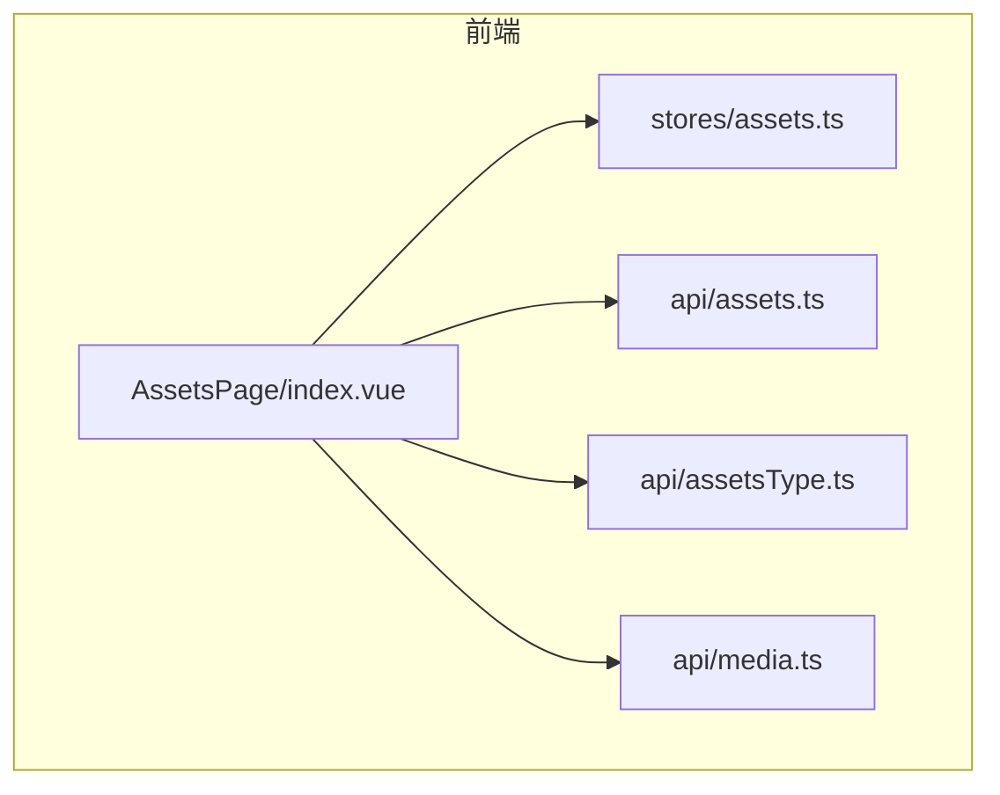
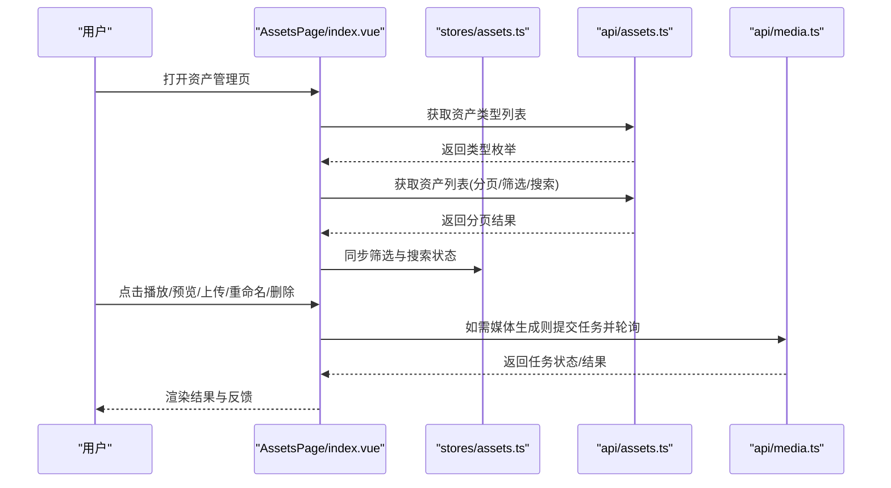
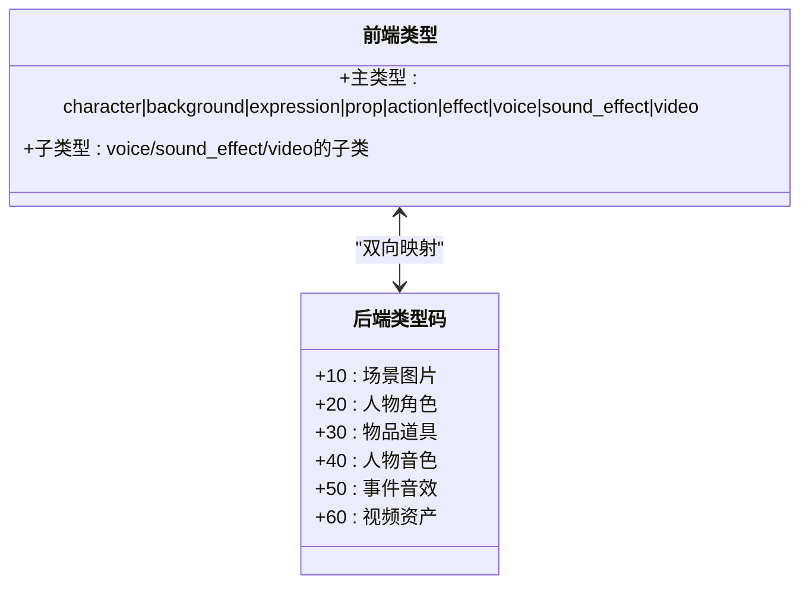
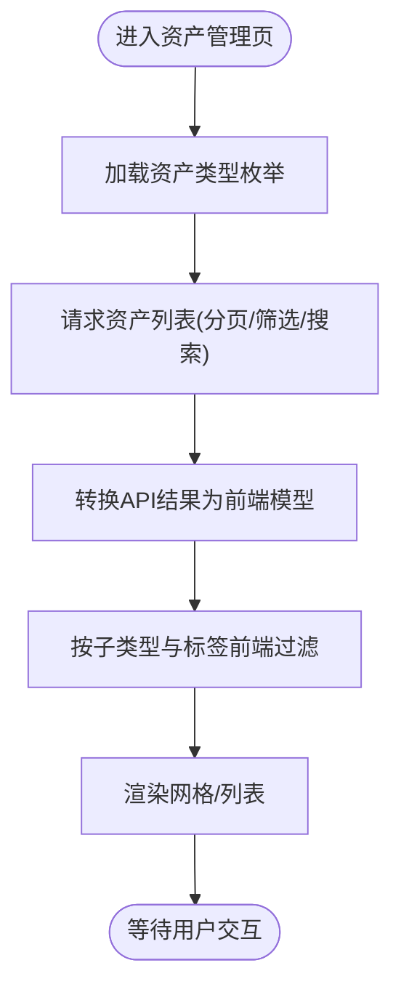
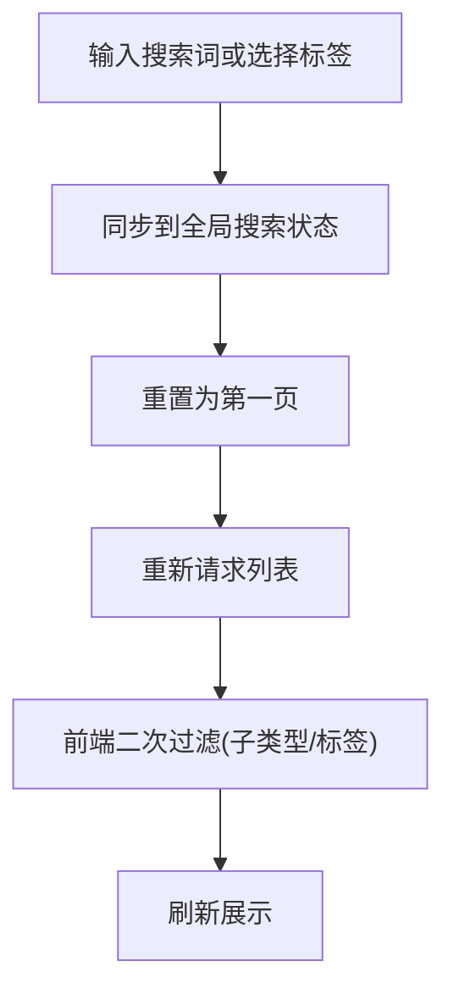
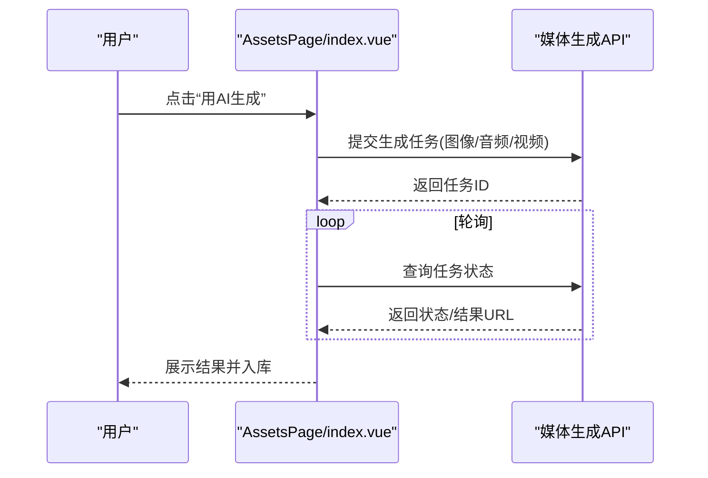
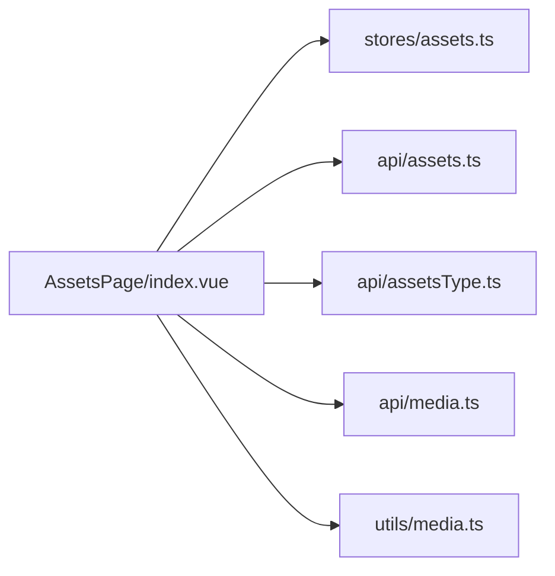

# 资产管理

<cite>
**本文引用的文件**   
- [assets.ts](file://frontend/src/api/assets.ts)
- [assetsType.ts](file://frontend/src/api/assetsType.ts)
- [media.ts](file://frontend/src/api/media.ts)
- [assets.ts（状态管理）](file://frontend/src/stores/assets.ts)
- [AssetsPage/index.vue](file://frontend/src/views/AssetsPage/index.vue)
</cite>

## 目录
1. [简介](#简介)
2. [项目结构](#项目结构)
3. [核心组件](#核心组件)
4. [架构总览](#架构总览)
5. [详细组件分析](#详细组件分析)
6. [依赖关系分析](#依赖关系分析)
7. [性能与扩展建议](#性能与扩展建议)
8. [故障排查指南](#故障排查指南)
9. [结论](#结论)

## 简介
本文件面向积木云AI创作平台的“资产管理”模块，聚焦素材资源的全生命周期管理、分类标签体系、搜索过滤、版本控制思路、上传下载服务、多媒体处理、元数据管理、权限与协作共享、索引优化、缓存策略、CDN集成与存储扩展等主题。文档基于前端现有实现进行梳理，并给出可落地的后端与基础设施扩展建议，帮助读者快速理解当前能力边界与后续演进方向。

## 项目结构
资产管理相关的前端代码主要分布在以下位置：
- API 层：封装资产列表、详情、创建、更新、删除以及类型枚举接口；媒体生成任务接口独立于资产API。
- 状态管理：维护本地素材集合、筛选条件、分页与交互状态。
- 页面视图：组合筛选侧栏、工具栏、网格/列表展示、预览与播放器弹窗、上传与重命名对话框。

图表来源
- [AssetsPage/index.vue:1-473](file://frontend/src/views/AssetsPage/index.vue#L1-L473)
- [assets.ts（状态管理）:1-161](file://frontend/src/stores/assets.ts#L1-L161)
- [assets.ts（API）:1-135](file://frontend/src/api/assets.ts#L1-L135)
- [assetsType.ts:1-27](file://frontend/src/api/assetsType.ts#L1-L27)
- [media.ts:1-57](file://frontend/src/api/media.ts#L1-L57)

章节来源
- [AssetsPage/index.vue:1-473](file://frontend/src/views/AssetsPage/index.vue#L1-L473)
- [assets.ts（状态管理）:1-161](file://frontend/src/stores/assets.ts#L1-L161)
- [assets.ts（API）:1-135](file://frontend/src/api/assets.ts#L1-L135)
- [assetsType.ts:1-27](file://frontend/src/api/assetsType.ts#L1-L27)
- [media.ts:1-57](file://frontend/src/api/media.ts#L1-L57)

## 核心组件
- 资产API封装
  - 提供资产CRUD与分页查询、类型枚举获取等能力，统一请求路径前缀与参数结构。
- 资产类型系统
  - 前端定义主类型与子类型，并通过映射表与后端数值型类型码对齐。
- 状态管理
  - 维护素材集合、筛选条件、分页、批量操作与播放状态。
- 页面视图
  - 聚合筛选、搜索、批量操作、预览与播放器、上传与重命名等交互。

章节来源
- [assets.ts（API）:1-135](file://frontend/src/api/assets.ts#L1-L135)
- [assetsType.ts:1-27](file://frontend/src/api/assetsType.ts#L1-L27)
- [assets.ts（状态管理）:1-161](file://frontend/src/stores/assets.ts#L1-L161)
- [AssetsPage/index.vue:1-473](file://frontend/src/views/AssetsPage/index.vue#L1-L473)

## 架构总览
资产管理在前端的职责边界清晰：负责用户交互、本地状态与筛选、调用后端API完成数据的增删改查与类型枚举加载。媒体生成任务通过独立接口发起异步任务并轮询状态。

图表来源
- [AssetsPage/index.vue:1-473](file://frontend/src/views/AssetsPage/index.vue#L1-L473)
- [assets.ts（API）:1-135](file://frontend/src/api/assets.ts#L1-L135)
- [assetsType.ts:1-27](file://frontend/src/api/assetsType.ts#L1-L27)
- [media.ts:1-57](file://frontend/src/api/media.ts#L1-L57)

## 详细组件分析

### 资产类型与映射
- 前端主类型包含角色、背景、表情、道具、动作、特效、音色、音效、视频等；子类型针对音色、音效、视频进一步细分。
- 与后端数值型类型码存在双向映射，用于列表筛选与API参数传递。
- 类型枚举由独立接口提供，便于动态扩展。

图表来源
- [assets.ts（状态管理）:1-161](file://frontend/src/stores/assets.ts#L1-L161)
- [assets.ts（API）:1-135](file://frontend/src/api/assets.ts#L1-L135)
- [AssetsPage/index.vue:1-473](file://frontend/src/views/AssetsPage/index.vue#L1-L473)

章节来源
- [assets.ts（状态管理）:1-161](file://frontend/src/stores/assets.ts#L1-L161)
- [assets.ts（API）:1-135](file://frontend/src/api/assets.ts#L1-L135)
- [AssetsPage/index.vue:1-473](file://frontend/src/views/AssetsPage/index.vue#L1-L473)

### 资产列表与分页
- 列表接口支持按类型、名称模糊匹配、分页参数。
- 页面在请求后对子类型与标签做二次前端过滤，提升交互体验。
- 分页控件与状态联动，切换页码时重新拉取数据。

图表来源
- [AssetsPage/index.vue:1-473](file://frontend/src/views/AssetsPage/index.vue#L1-L473)
- [assets.ts（API）:1-135](file://frontend/src/api/assets.ts#L1-L135)

章节来源
- [AssetsPage/index.vue:1-473](file://frontend/src/views/AssetsPage/index.vue#L1-L473)
- [assets.ts（API）:1-135](file://frontend/src/api/assets.ts#L1-L135)

### 搜索与标签过滤
- 支持关键词搜索（名称、标签），并与分类筛选组合使用。
- 标签搜索会同步更新输入框与全局搜索状态，确保跨组件一致性。

图表来源
- [AssetsPage/index.vue:1-473](file://frontend/src/views/AssetsPage/index.vue#L1-L473)

章节来源
- [AssetsPage/index.vue:1-473](file://frontend/src/views/AssetsPage/index.vue#L1-L473)

### 上传与下载
- 上传流程：页面内弹出上传对话框，内部完成文件上传与资产创建，成功后关闭弹窗并刷新列表。
- 下载：资产项包含媒体地址字段，可直接访问或通过浏览器下载。
- 建议：结合分片上传、断点续传、并发控制与进度回调以提升大文件体验。

章节来源
- [AssetsPage/index.vue:1-473](file://frontend/src/views/AssetsPage/index.vue#L1-L473)

### 多媒体内容处理
- 音频/视频素材点击后分别打开对应播放器弹窗，支持封面与时长显示。
- 媒体生成任务通过独立接口提交，支持图像、音频、视频三类参数，并提供任务状态查询。

图表来源
- [media.ts:1-57](file://frontend/src/api/media.ts#L1-L57)
- [AssetsPage/index.vue:1-473](file://frontend/src/views/AssetsPage/index.vue#L1-L473)

章节来源
- [media.ts:1-57](file://frontend/src/api/media.ts#L1-L57)
- [AssetsPage/index.vue:1-473](file://frontend/src/views/AssetsPage/index.vue#L1-L473)

### 元数据管理与版本控制
- 元数据：包含名称、类型、来源、封面、媒体地址、时长、标签、创建时间等。
- 版本控制：当前未显式实现版本字段与差异对比。建议引入版本号、变更日志与快照机制，支持回滚与对比。

章节来源
- [assets.ts（API）:1-135](file://frontend/src/api/assets.ts#L1-L135)
- [assets.ts（状态管理）:1-161](file://frontend/src/stores/assets.ts#L1-L161)

### 权限控制与协作共享
- 当前未见服务端鉴权逻辑暴露在前端API中。建议：
  - 基于角色的访问控制（RBAC）：私有/团队/公开可见性。
  - 分享链接与有效期、下载次数限制。
  - 审计日志记录查看、下载、编辑行为。

[本节为通用设计建议，不直接分析具体文件]

## 依赖关系分析
- AssetsPage 依赖：
  - 状态管理：维护本地素材与筛选状态。
  - API 层：资产CRUD、类型枚举、媒体生成任务。
  - 工具函数：判断音频/视频类型以决定播放器。
- 类型映射贯穿前后端，保证筛选与展示的一致性。

图表来源
- [AssetsPage/index.vue:1-473](file://frontend/src/views/AssetsPage/index.vue#L1-L473)
- [assets.ts（状态管理）:1-161](file://frontend/src/stores/assets.ts#L1-L161)
- [assets.ts（API）:1-135](file://frontend/src/api/assets.ts#L1-L135)
- [assetsType.ts:1-27](file://frontend/src/api/assetsType.ts#L1-L27)
- [media.ts:1-57](file://frontend/src/api/media.ts#L1-L57)

章节来源
- [AssetsPage/index.vue:1-473](file://frontend/src/views/AssetsPage/index.vue#L1-L473)
- [assets.ts（状态管理）:1-161](file://frontend/src/stores/assets.ts#L1-L161)
- [assets.ts（API）:1-135](file://frontend/src/api/assets.ts#L1-L135)
- [assetsType.ts:1-27](file://frontend/src/api/assetsType.ts#L1-L27)
- [media.ts:1-57](file://frontend/src/api/media.ts#L1-L57)

## 性能与扩展建议
- 索引优化
  - 数据库层：对常用筛选字段建立复合索引（类型、来源、创建时间、名称模糊索引）。
  - 搜索：引入全文检索引擎（如Elasticsearch）以支撑多字段高亮与复杂查询。
- 缓存策略
  - 热点类型枚举与静态配置采用短TTL缓存。
  - 列表首屏可结合客户端缓存与ETag/Last-Modified减少重复传输。
- CDN集成
  - 媒体文件统一走CDN，开启压缩与按需转码（缩略图、不同清晰度）。
  - 设置合理的Cache-Control与防盗链签名。
- 存储扩展
  - 对象存储抽象层：兼容多厂商（COS/OSS/Qiniu等），按业务域划分Bucket/Prefix。
  - 冷热分层：热数据就近缓存，冷数据归档至低成本存储。
- 上传下载
  - 分片上传、断点续传、并发控制、进度上报。
  - 下载限速与带宽配额，避免影响在线播放。
- 媒体处理
  - 异步转码流水线：封面抽取、音轨提取、字幕生成、水印添加。
  - 质量评估与自动审核（敏感内容检测）。
- 版本控制
  - 引入版本字段、变更摘要、差异对比与一键回滚。
  - 保留历史版本并支持按需清理。
- 协作共享
  - 细粒度权限（读/写/分享/管理），团队空间与工作流审批。
  - 评论与@提及，变更通知与订阅。

[本节为通用指导，不直接分析具体文件]

## 故障排查指南
- 列表为空或报错
  - 检查网络与鉴权是否成功，确认分页参数与筛选条件是否正确。
  - 查看错误提示与重试按钮逻辑。
- 搜索无结果
  - 确认关键词是否与名称/标签匹配，注意大小写与空格。
  - 检查前端二次过滤是否过于严格。
- 媒体无法播放
  - 校验媒体地址是否有效、跨域与CDN签名是否过期。
  - 检查浏览器兼容性（编码格式、MIME类型）。
- 上传失败
  - 检查文件大小限制、超时与重试策略。
  - 观察上传进度与错误码，定位是网络还是服务端问题。

章节来源
- [AssetsPage/index.vue:1-473](file://frontend/src/views/AssetsPage/index.vue#L1-L473)

## 结论
当前资产管理模块在前端已具备完整的素材浏览、筛选、搜索、预览与基础CRUD能力，并通过类型枚举与映射表实现了前后端一致的分类体系。建议在后续迭代中完善版本控制、权限与协作、索引与缓存、CDN与存储扩展、媒体处理流水线等能力，以支撑更大规模与更复杂的创作协作场景。