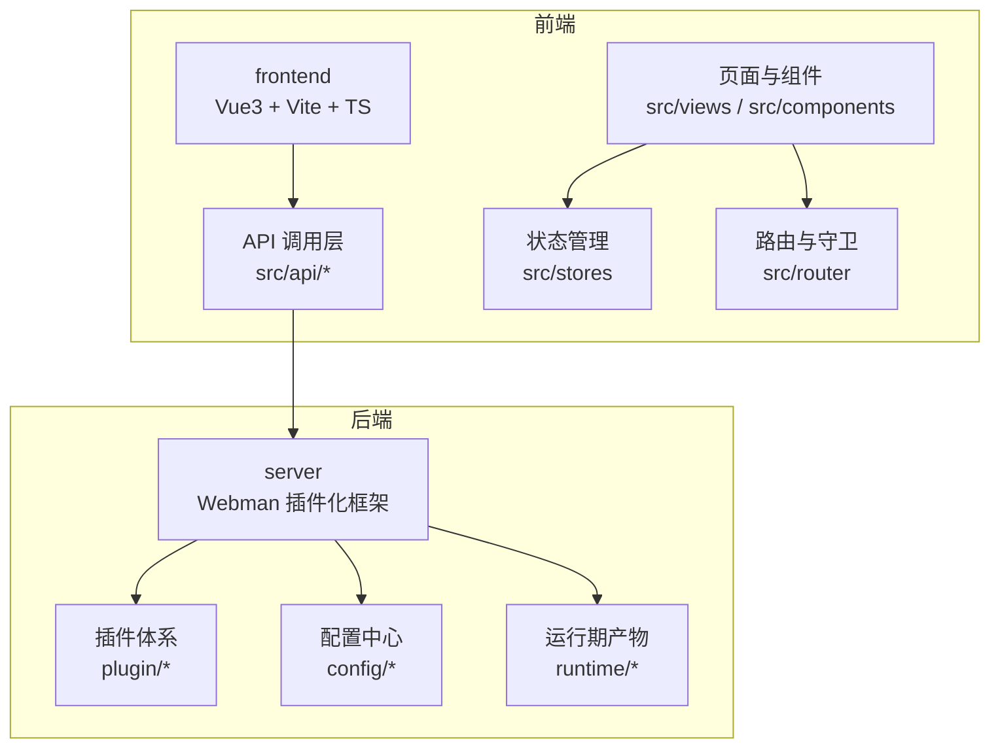
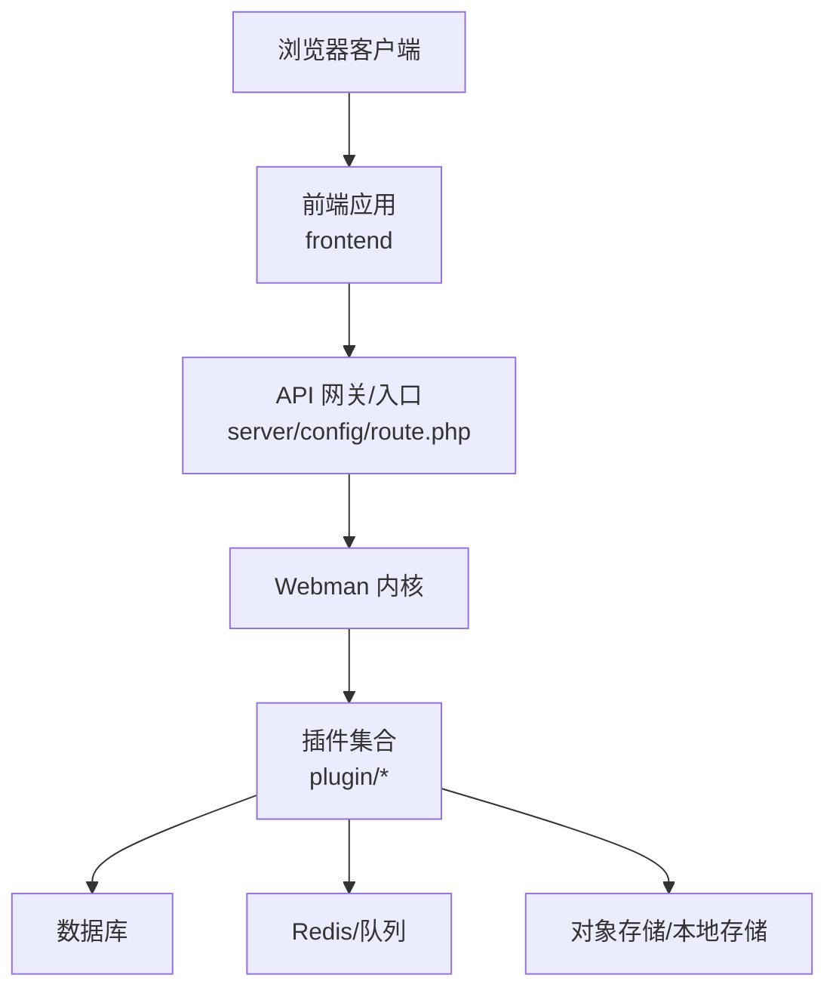
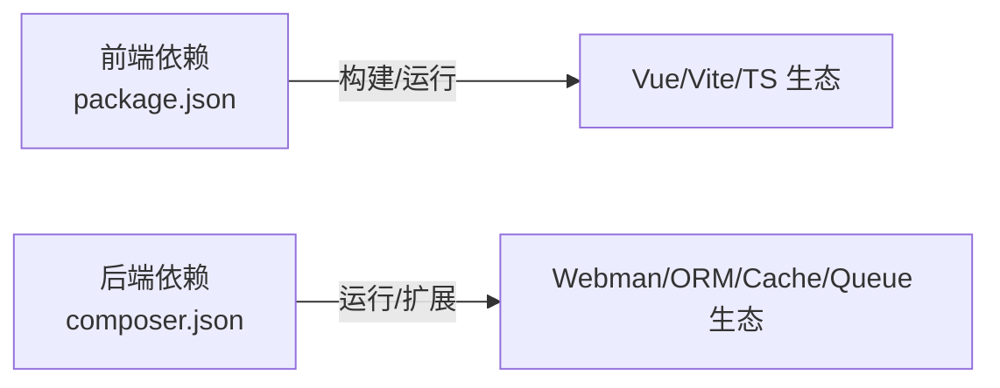

# 贡献指南

<cite>
**本文引用的文件**   
- [frontend/package.json](file://frontend/package.json)
- [server/composer.json](file://server/composer.json)
- [server/README.md](file://server/README.md)
</cite>

## 目录
1. [简介](#简介)
2. [项目结构](#项目结构)
3. [核心组件](#核心组件)
4. [架构总览](#架构总览)
5. [详细组件分析](#详细组件分析)
6. [依赖分析](#依赖分析)
7. [性能考虑](#性能考虑)
8. [故障排查指南](#故障排查指南)
9. [结论](#结论)
10. [附录](#附录)

## 简介
本贡献指南面向积木云AI创作平台的新老贡献者，旨在提供清晰的参与路径与规范说明。内容涵盖代码规范、提交流程、分支管理、版本发布流程、社区参与方式、Git工作流、代码审查标准、测试要求、文档更新规范以及贡献者行为准则。通过统一的协作约定，提升开发效率与交付质量。

## 项目结构
本项目采用前后端分离的仓库结构：
- 前端工程位于 frontend 目录，基于 Vue 3 + Vite + TypeScript 构建，使用 Pinia 进行状态管理，TailwindCSS 作为样式框架。
- 后端服务位于 server 目录，基于 Webman（PHP）插件化框架，支持多插件扩展与任务队列等能力。

[此图为概念性结构示意，不直接映射具体源码文件]

## 核心组件
- 前端工程脚本与依赖
  - 开发、构建与预览命令由 package.json 中的 scripts 定义，包含类型检查与打包流程。
  - 关键依赖包括 Vue、Vite、TypeScript、Pinia、TailwindCSS 等。
- 后端工程脚本与依赖
  - composer.json 定义了 PHP 版本约束、核心框架与第三方库，并声明了插件安装/卸载钩子脚本。
  - 支持事件、日志、缓存、数据库、Redis 队列、工作流、部署工具等生态组件。

章节来源
- [frontend/package.json:1-35](file://frontend/package.json#L1-L35)
- [server/composer.json:1-99](file://server/composer.json#L1-L99)

## 架构总览
整体架构为“前端 SPA + 后端 Webman 插件化服务”。前端通过 API 层与后端交互；后端以插件形式组织业务域，统一在 config 中注册路由、中间件、进程与队列消费者，运行时产物输出至 runtime。

[此图为概念性架构示意，不直接映射具体源码文件]

## 详细组件分析

### Git 工作流与分支策略
- 分支模型
  - main：稳定发布分支，仅接受来自 release 或 hotfix 的合并。
  - develop：集成开发分支，日常功能在此汇聚。
  - feature/*：功能分支，从 develop 切出，完成后合并回 develop。
  - release/*：预发布分支，用于冻结问题修复与回归验证。
  - hotfix/*：紧急修复分支，从 main 切出，修复后同时合并到 main 与 develop。
- 提交信息规范
  - 建议遵循 Conventional Commits：type(scope): description
  - type 示例：feat、fix、docs、style、refactor、test、chore、perf、build、ci
  - scope 可选：模块/插件名，如 xbAiModelAgent、frontend
- 变更范围控制
  - 一次提交聚焦单一职责，避免混合无关改动。
  - 大型重构拆分为多次小步提交，便于审查与回滚。

章节来源
- [server/README.md:1-148](file://server/README.md#L1-L148)

### 代码审查标准
- 可读性与一致性
  - 命名清晰、语义明确，变量/函数/类名符合语言惯例。
  - 保持缩进、空格、注释风格一致，避免无意义的空行与死代码。
- 正确性与健壮性
  - 输入校验、边界条件与异常处理完备。
  - 对外部依赖（网络、IO、第三方服务）增加超时与重试策略。
- 安全与合规
  - 敏感配置不入仓，使用环境变量或配置中心。
  - 避免硬编码密钥、SQL 拼接注入风险。
- 可维护性与可扩展性
  - 高内聚低耦合，优先复用已有组件与插件接口。
  - 新增能力尽量以插件形式实现，减少核心侵入。
- 文档与可观测性
  - 复杂逻辑补充必要注释与变更说明。
  - 关键路径埋点与日志记录，便于定位问题。

### 测试要求
- 前端
  - 单元测试：对工具函数、组合式逻辑、状态切片进行覆盖。
  - 组件测试：对关键交互组件进行断言。
  - 端到端测试：对核心用户旅程进行冒烟验证。
- 后端
  - 单元测试：控制器/服务/模型的单测覆盖核心路径。
  - 集成测试：数据库/Redis/消息队列的集成场景验证。
  - 插件隔离：确保插件间解耦，避免共享全局状态。
- 覆盖率与门禁
  - 建议设定最低覆盖率阈值，并在 CI 中执行。
  - 失败用例需及时修复，禁止带病合入。

### 文档更新规范
- 同步更新
  - 新增/修改 API 时，同步更新接口文档与示例。
  - 插件新增能力需在 README 或独立文档中说明用法与配置项。
- 版本记录
  - 变更记录按影响面分类：新功能、修复、破坏性变更、弃用提示。
  - 重大变更需提供迁移指南与回滚方案。

### 贡献者行为准则
- 尊重与包容
  - 友善沟通，理性讨论分歧，避免人身攻击。
- 透明与开放
  - 公开讨论重要决策，保留会议/讨论纪要。
- 责任与担当
  - 主动跟进问题与反馈，按时交付承诺。
- 合规与安全
  - 遵守开源协议与商业授权条款，保护用户隐私与数据安全。

### 提交流程规范
- Fork 与克隆
  - 从官方仓库 Fork，使用递归子模块拉取完整代码。
- 分支创建与提交
  - 基于分支策略创建分支，提交信息遵循规范。
- 推送与 Pull Request
  - 推送分支后发起 PR，填写变更背景、影响范围与验证步骤。
- 审查与合并
  - 至少一名维护者审查通过后方可合并。
  - 合并前确保 CI 全部通过，必要时补充截图/录屏证据。

章节来源
- [server/README.md:1-148](file://server/README.md#L1-L148)

### 版本发布流程
- 版本号规则
  - 遵循语义化版本：主版本.次版本.修订号。
  - 破坏性变更升主版本，新增兼容特性升次版本，缺陷修复升修订号。
- 发布候选
  - 从 develop 切出 release/* 分支，冻结非关键修复，完成回归测试。
- 打标签与归档
  - 在 main 上打 tag，生成发布说明与变更日志。
- 灰度与回滚
  - 先灰度小流量，观察指标稳定后再全量。
  - 准备一键回滚脚本与数据补偿方案。

章节来源
- [server/README.md:1-148](file://server/README.md#L1-L148)

### 社区参与方式
- 交流与反馈
  - 加入开发者交流群，提问前先检索历史与文档。
  - 提交 Issue 时附上复现步骤、环境信息与期望结果。
- 贡献渠道
  - 提交 Bug 修复、功能增强、文档优化与翻译。
  - 参与插件生态建设，完善插件市场与示例。
- 认可与激励
  - 定期致谢贡献者，展示优秀案例与最佳实践。

章节来源
- [server/README.md:1-148](file://server/README.md#L1-L148)

## 依赖分析
- 前端依赖
  - 构建与开发：Vite、TypeScript、vue-tsc、autoprefixer、postcss、tailwindcss。
  - 运行时：Vue、Vue Router、Pinia、Axios、图标库与拖拽组件。
- 后端依赖
  - 核心框架：Webman 及其生态（event、log、channel、redis、redis-queue）。
  - 数据与缓存：think-orm、think-cache、symfony/workflow。
  - 外部服务：短信、邮件、对象存储 SDK、JWT、验证码、Markdown 解析等。
  - 部署：Deployer 自动化部署。

章节来源
- [frontend/package.json:1-35](file://frontend/package.json#L1-L35)
- [server/composer.json:1-99](file://server/composer.json#L1-L99)

## 性能考虑
- 前端
  - 按需加载与懒路由，减少首屏体积。
  - 图片与静态资源压缩与缓存策略。
  - 列表虚拟化与分页，避免长列表卡顿。
- 后端
  - 合理使用缓存与索引，降低热点查询压力。
  - 异步任务与队列削峰填谷，避免阻塞请求线程。
  - 合理设置连接池与超时参数，提升吞吐与稳定性。

## 故障排查指南
- 常见问题定位
  - 确认环境版本与依赖是否匹配（PHP 版本、Node 版本）。
  - 检查配置文件与密钥是否正确加载。
  - 查看运行时日志与错误堆栈，定位异常源头。
- 快速恢复
  - 优先回滚到上一个稳定版本，再逐步定位问题。
  - 临时降级或关闭非核心功能，保障主流程可用。
- 预防改进
  - 完善监控告警与错误上报。
  - 建立演练机制，定期验证回滚与扩容流程。

## 结论
通过统一的代码规范、严谨的提交流程、清晰的分支策略与完善的发布流程，积木云AI创作平台能够在保证质量的同时高效迭代。鼓励社区积极参与，共建健康、可持续的开源生态。

## 附录

### 常用命令速查
- 前端
  - 启动开发服务器
  - 构建生产包
  - 预览构建产物
- 后端
  - 安装/更新依赖
  - 启动服务
  - 运行插件安装/卸载钩子

章节来源
- [frontend/package.json:1-35](file://frontend/package.json#L1-L35)
- [server/composer.json:1-99](file://server/composer.json#L1-L99)