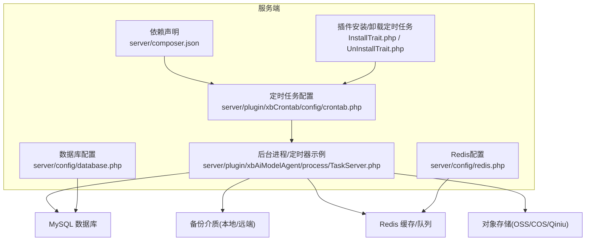
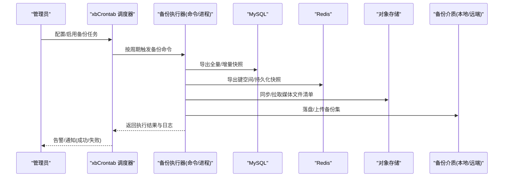
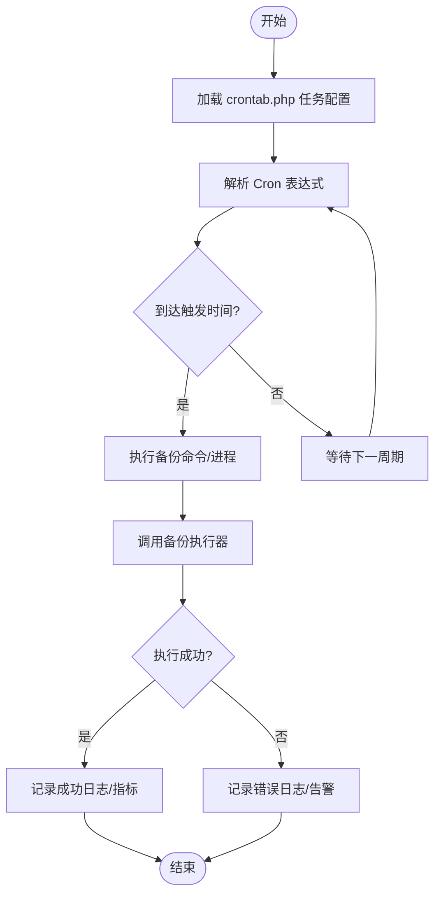
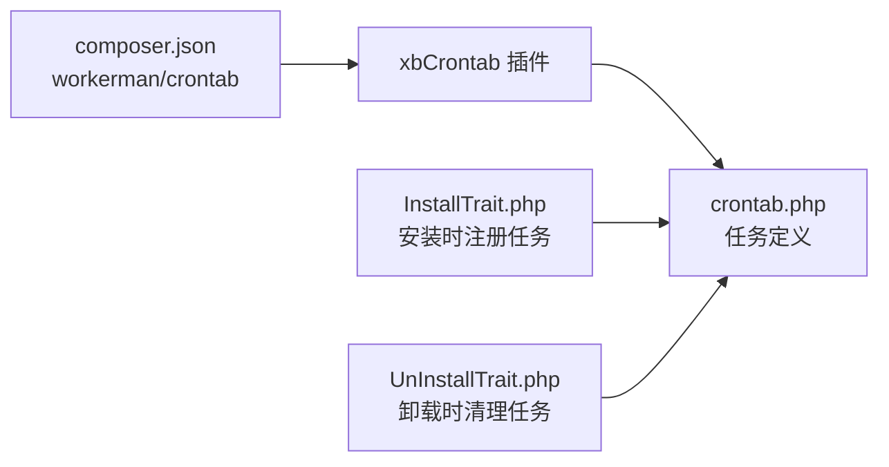

# 备份恢复

<cite>
**本文引用的文件**   
- [database.php](file://server/config/database.php)
- [redis.php](file://server/config/redis.php)
- [crontab.php](file://server/plugin/xbCrontab/config/crontab.php)
- [TaskServer.php](file://server/plugin/xbAiModelAgent/process/TaskServer.php)
- [InstallTrait.php](file://server/plugin/xbCode/base/plugin/InstallTrait.php)
- [UnInstallTrait.php](file://server/plugin/xbCode/base/plugin/UnInstallTrait.php)
- [composer.json](file://server/composer.json)
</cite>

## 目录
1. [引言](#引言)
2. [项目结构](#项目结构)
3. [核心组件](#核心组件)
4. [架构总览](#架构总览)
5. [详细组件分析](#详细组件分析)
6. [依赖分析](#依赖分析)
7. [性能考虑](#性能考虑)
8. [故障排查指南](#故障排查指南)
9. [结论](#结论)
10. [附录](#附录)

## 引言
本文件为积木云AI创作平台制定系统化的备份与恢复策略，覆盖数据库自动备份、对象存储（OSS/COS/Qiniu）文件备份、配置与代码备份、增量备份方案；同时给出定时任务配置、数据迁移与灾难恢复流程、备份验证方法、存储优化与跨地域备份最佳实践。文档基于仓库现有配置与插件能力进行设计，确保可落地执行。

## 项目结构
本项目采用前后端分离：前端静态资源位于 frontend，后端服务位于 server，业务以插件形式组织在 server/plugin 下。与备份相关的关键位置包括：
- 数据库连接配置：server/config/database.php
- Redis 连接配置：server/config/redis.php
- 定时任务框架与示例：server/plugin/xbCrontab/config/crontab.php
- 后台进程与定时器使用示例：server/plugin/xbAiModelAgent/process/TaskServer.php
- 插件安装/卸载时注册/清理定时任务的逻辑：server/plugin/xbCode/base/plugin/InstallTrait.php、UnInstallTrait.php
- 定时任务依赖包声明：server/composer.json

**图表来源**
- [database.php:1-35](file://server/config/database.php#L1-L35)
- [redis.php:1-17](file://server/config/redis.php#L1-L17)
- [crontab.php:1-32](file://server/plugin/xbCrontab/config/crontab.php#L1-L32)
- [TaskServer.php:23-103](file://server/plugin/xbAiModelAgent/process/TaskServer.php#L23-L103)
- [InstallTrait.php:86-106](file://server/plugin/xbCode/base/plugin/InstallTrait.php#L86-L106)
- [UnInstallTrait.php:85-107](file://server/plugin/xbCode/base/plugin/UnInstallTrait.php#L85-L107)
- [composer.json:49-49](file://server/composer.json#L49-L49)

**章节来源**
- [database.php:1-35](file://server/config/database.php#L1-L35)
- [redis.php:1-17](file://server/config/redis.php#L1-L17)
- [crontab.php:1-32](file://server/plugin/xbCrontab/config/crontab.php#L1-L32)
- [TaskServer.php:23-103](file://server/plugin/xbAiModelAgent/process/TaskServer.php#L23-L103)
- [InstallTrait.php:86-106](file://server/plugin/xbCode/base/plugin/InstallTrait.php#L86-L106)
- [UnInstallTrait.php:85-107](file://server/plugin/xbCode/base/plugin/UnInstallTrait.php#L85-L107)
- [composer.json:49-49](file://server/composer.json#L49-L49)

## 核心组件
- 数据库连接与池化：通过 database.php 定义 MySQL 连接参数与连接池选项，便于备份脚本直连或应用内导出。
- 缓存与队列：redis.php 提供 Redis 连接信息，可用于会话、缓存与任务队列的持久化备份。
- 定时任务框架：xbCrontab 插件提供 crontab 配置入口，支持按 Cron 表达式调度命令，适合编排备份任务。
- 后台进程与定时器：TaskServer.php 展示了独立进程中设置定时器的模式，可作为备份任务的参考实现。
- 插件生命周期集成：InstallTrait.php 与 UnInstallTrait.php 演示了安装/卸载时注册/清理定时任务的机制，可用于统一维护备份任务。

**章节来源**
- [database.php:1-35](file://server/config/database.php#L1-L35)
- [redis.php:1-17](file://server/config/redis.php#L1-L17)
- [crontab.php:1-32](file://server/plugin/xbCrontab/config/crontab.php#L1-L32)
- [TaskServer.php:23-103](file://server/plugin/xbAiModelAgent/process/TaskServer.php#L23-L103)
- [InstallTrait.php:86-106](file://server/plugin/xbCode/base/plugin/InstallTrait.php#L86-L106)
- [UnInstallTrait.php:85-107](file://server/plugin/xbCode/base/plugin/UnInstallTrait.php#L85-L107)

## 架构总览
整体备份恢复架构围绕“数据源—调度器—执行器—存储介质”展开：
- 数据源：MySQL、Redis、对象存储（OSS/COS/Qiniu）、配置文件与代码。
- 调度器：xbCrontab 定时任务框架，按 Cron 表达式触发备份命令。
- 执行器：命令行工具或 PHP 进程（参考 TaskServer.php 的定时器用法）。
- 存储介质：本地磁盘、NAS、云存储（S3/OSS/COS），并支持跨地域复制。

**图表来源**
- [crontab.php:1-32](file://server/plugin/xbCrontab/config/crontab.php#L1-L32)
- [TaskServer.php:23-103](file://server/plugin/xbAiModelAgent/process/TaskServer.php#L23-L103)
- [database.php:1-35](file://server/config/database.php#L1-L35)
- [redis.php:1-17](file://server/config/redis.php#L1-L17)

## 详细组件分析

### 数据库自动备份
- 目标：对 MySQL 进行定期全量与增量备份，保证 RPO/RTO 指标。
- 建议方案：
  - 全量备份：每日一次 mysqldump 或物理备份工具（如 Percona XtraBackup），归档至本地与远端。
  - 增量备份：开启 binlog，按小时/天归档，结合时间点恢复（PITR）。
  - 一致性：对 InnoDB 使用事务一致性导出；大表可分库分表导出。
- 关键配置点：
  - 数据库连接参数来自 database.php，备份脚本应读取相同环境变量，避免凭据不一致。
- 验证方法：
  - 校验导出文件大小与行数统计。
  - 在隔离环境导入测试，确认业务可启动。

**章节来源**
- [database.php:1-35](file://server/config/database.php#L1-L35)

### 文件存储备份（对象存储）
- 背景：媒体文件通常存放于对象存储（OSS/COS/Qiniu），需纳入备份范围。
- 建议方案：
  - 元数据与索引：将对象列表、标签、权限等元数据导出为清单文件，纳入版本控制。
  - 数据副本：利用对象存储自带的跨区域复制功能，或在云端建立冷备桶。
  - 本地镜像：对热点数据定期 rsync/sync 到本地或 NAS，缩短恢复时间。
- 注意事项：
  - 注意访问密钥与桶策略的安全管理。
  - 大对象传输建议使用断点续传与并发分片。

[本节为通用实践说明，不直接分析具体源码文件]

### 配置与代码备份
- 配置项：
  - 应用配置：server/config 下的所有 .php 配置文件。
  - 插件配置：各 plugin/*/config/*.php。
  - 运行时：runtime 目录中的缓存/临时文件一般不纳入备份，但日志可按策略保留。
- 代码与依赖：
  - 代码仓库 Git 提交记录即天然备份。
  - composer.lock 与 vendor 可通过构建产物固化，减少环境差异。
- 建议：
  - 将敏感配置（数据库、Redis、第三方密钥）放入环境变量或密钥管理服务，不在仓库中明文保存。
  - 对配置变更引入审批与回滚流程。

**章节来源**
- [database.php:1-35](file://server/config/database.php#L1-L35)
- [redis.php:1-17](file://server/config/redis.php#L1-L17)

### 增量备份方案
- 数据库增量：
  - 基于 binlog 的增量归档，配合 PITR 可实现分钟级恢复。
- 文件增量：
  - 使用对象存储事件通知或增量同步工具，仅同步变更对象。
- 缓存增量：
  - Redis 可使用 AOF/RDB 快照，并结合 key 白名单选择性导出。

[本节为通用实践说明，不直接分析具体源码文件]

### 定时任务配置与集成
- 任务定义：
  - 在 xbCrontab 的 crontab.php 中新增备份任务条目，指定 Cron 表达式与执行命令。
- 任务注册/清理：
  - 插件安装/卸载时通过 InstallTrait.php 与 UnInstallTrait.php 自动注册/删除定时任务，保持任务与插件生命周期一致。
- 进程级定时器：
  - 参考 TaskServer.php 的定时器用法，可在独立进程中周期性执行备份检查与上报。

**图表来源**
- [crontab.php:1-32](file://server/plugin/xbCrontab/config/crontab.php#L1-L32)
- [InstallTrait.php:86-106](file://server/plugin/xbCode/base/plugin/InstallTrait.php#L86-L106)
- [UnInstallTrait.php:85-107](file://server/plugin/xbCode/base/plugin/UnInstallTrait.php#L85-L107)
- [TaskServer.php:23-103](file://server/plugin/xbAiModelAgent/process/TaskServer.php#L23-L103)

**章节来源**
- [crontab.php:1-32](file://server/plugin/xbCrontab/config/crontab.php#L1-L32)
- [InstallTrait.php:86-106](file://server/plugin/xbCode/base/plugin/InstallTrait.php#L86-L106)
- [UnInstallTrait.php:85-107](file://server/plugin/xbCode/base/plugin/UnInstallTrait.php#L85-L107)
- [TaskServer.php:23-103](file://server/plugin/xbAiModelAgent/process/TaskServer.php#L23-L103)

### 数据迁移与灾难恢复流程
- 数据迁移：
  - 小版本升级：优先使用数据库迁移脚本与灰度发布，先迁移只读副本，再切换流量。
  - 大版本升级：在预生产环境完整演练，验证兼容性与回滚路径。
- 灾难恢复：
  - 选择最近的全量备份 + 增量日志恢复到目标时间点。
  - 先在隔离环境恢复，验证通过后切换流量。
  - 准备回滚预案：保留旧版本二进制与配置快照。

[本节为通用实践说明，不直接分析具体源码文件]

### 备份验证方法
- 完整性校验：
  - 计算备份文件哈希值并与生成时记录比对。
  - 校验数据库导出文件的行数、主键唯一性、外键约束。
- 可用性演练：
  - 定期在隔离环境执行恢复演练，记录恢复时长与成功率。
- 监控与告警：
  - 对备份任务的成功率、耗时、大小变化进行监控，异常即时告警。

[本节为通用实践说明，不直接分析具体源码文件]

### 存储优化与跨地域备份
- 压缩与去重：
  - 对文本类备份进行压缩；对重复对象启用去重策略。
- 分层存储：
  - 热数据近端存储，冷数据归档至低成本存储层。
- 跨地域复制：
  - 利用对象存储跨区域复制与数据库异地容灾能力，降低单点风险。
- 生命周期管理：
  - 设定保留策略（如 7 日全量+30 日增量+180 日归档），自动清理过期备份。

[本节为通用实践说明，不直接分析具体源码文件]

## 依赖分析
- 定时任务依赖：
  - composer.json 声明 workerman/crontab 作为定时任务基础依赖，xbCrontab 插件在其之上提供可视化与配置管理能力。
- 插件生命周期：
  - InstallTrait.php 与 UnInstallTrait.php 负责在安装/卸载时读写 crontab 配置，确保任务与插件状态一致。

**图表来源**
- [composer.json:49-49](file://server/composer.json#L49-L49)
- [crontab.php:1-32](file://server/plugin/xbCrontab/config/crontab.php#L1-L32)
- [InstallTrait.php:86-106](file://server/plugin/xbCode/base/plugin/InstallTrait.php#L86-L106)
- [UnInstallTrait.php:85-107](file://server/plugin/xbCode/base/plugin/UnInstallTrait.php#L85-L107)

**章节来源**
- [composer.json:49-49](file://server/composer.json#L49-L49)
- [crontab.php:1-32](file://server/plugin/xbCrontab/config/crontab.php#L1-L32)
- [InstallTrait.php:86-106](file://server/plugin/xbCode/base/plugin/InstallTrait.php#L86-L106)
- [UnInstallTrait.php:85-107](file://server/plugin/xbCode/base/plugin/UnInstallTrait.php#L85-L107)

## 性能考虑
- 备份窗口：
  - 避开业务高峰，选择低峰时段执行全量备份；增量备份频率更高但负载更低。
- 并行与分片：
  - 对大表分库分表导出；对象存储批量并发上传/下载。
- I/O 与网络：
  - 使用本地 SSD/NAS 作为中转，再异步复制到远端；合理设置带宽限制。
- 资源隔离：
  - 为备份进程设置 CPU/内存上限，避免影响在线服务。

[本节为通用实践说明，不直接分析具体源码文件]

## 故障排查指南
- 常见问题定位：
  - 任务未触发：检查 crontab.php 的 Cron 表达式与任务是否被正确注册。
  - 凭据错误：核对 database.php 与 redis.php 的环境变量与实际运行环境一致。
  - 进程异常：参考 TaskServer.php 的定时器用法，查看进程日志与退出码。
- 日志与审计：
  - 为备份任务输出结构化日志，包含开始/结束时间、数据量、错误堆栈。
  - 将关键指标上报到监控系统，设置阈值告警。

**章节来源**
- [crontab.php:1-32](file://server/plugin/xbCrontab/config/crontab.php#L1-L32)
- [database.php:1-35](file://server/config/database.php#L1-L35)
- [redis.php:1-17](file://server/config/redis.php#L1-L17)
- [TaskServer.php:23-103](file://server/plugin/xbAiModelAgent/process/TaskServer.php#L23-L103)

## 结论
通过 xbCrontab 定时任务框架与现有插件生命周期集成，结合数据库、Redis、对象存储与配置的多维度备份策略，可实现高可用的数据保护体系。建议在生产环境落地后持续进行恢复演练与容量规划，确保 RPO/RTO 满足业务要求。

## 附录
- 建议的任务清单（示例）：
  - 每日凌晨全量数据库备份
  - 每小时增量数据库备份（binlog）
  - 每日对象存储元数据清单导出
  - 每周配置与代码快照归档
  - 每月恢复演练与报告
- 安全建议：
  - 备份介质加密存储，访问密钥最小权限原则
  - 备份链路使用 HTTPS/SFTP 等安全通道

[本节为通用实践说明，不直接分析具体源码文件]