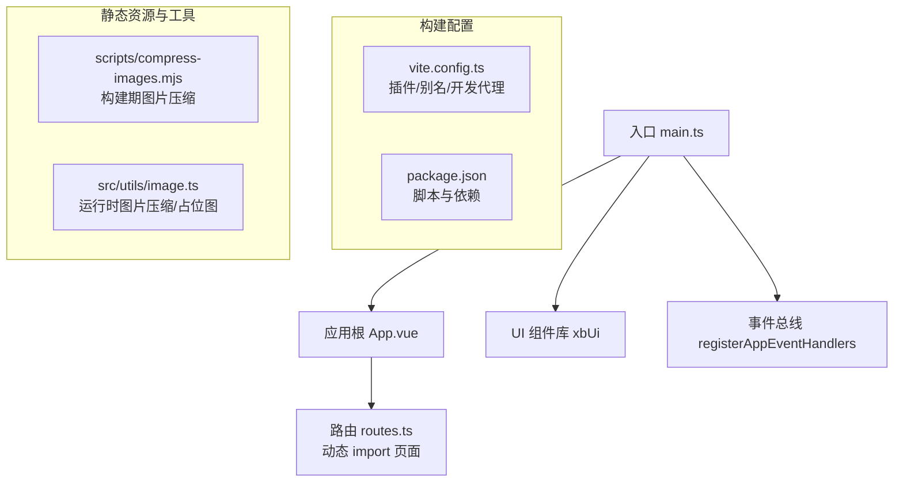
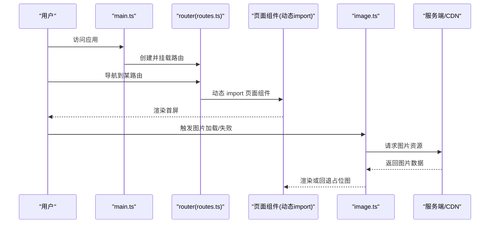
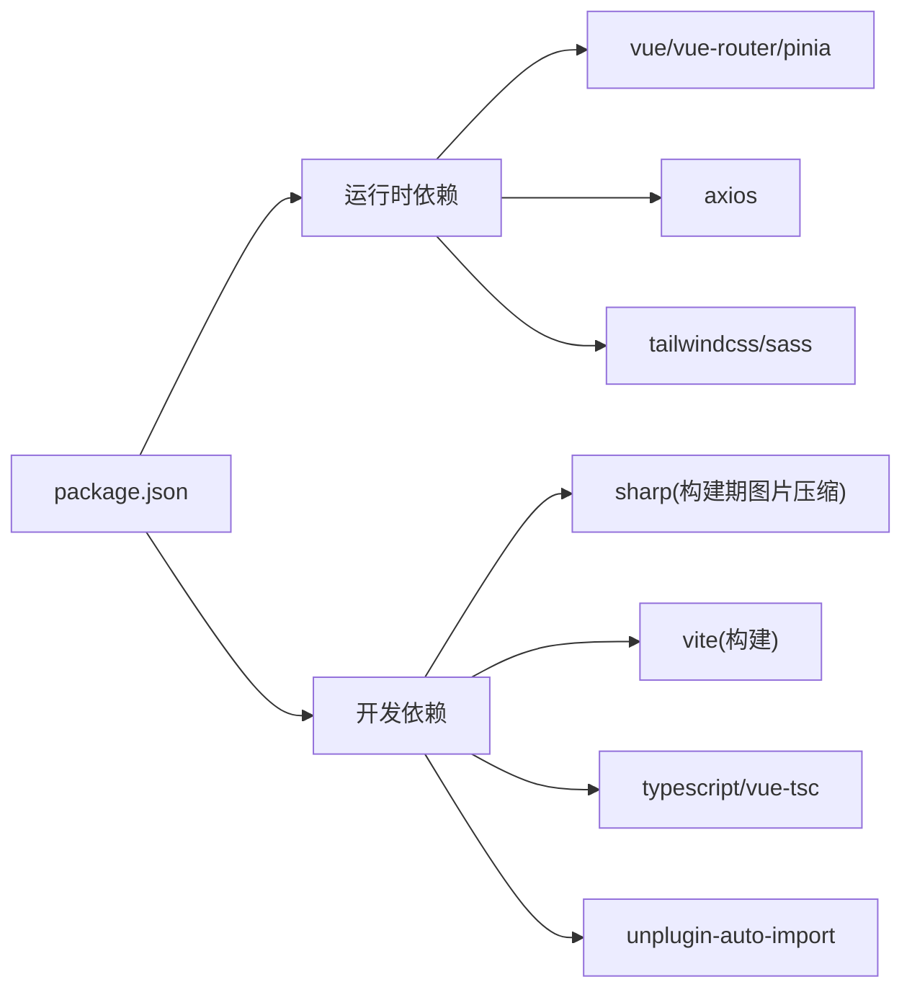

# 前端性能优化

<cite>
**本文引用的文件**
- [vite.config.ts](file://frontend/vite.config.ts)
- [package.json](file://frontend/package.json)
- [main.ts](file://frontend/src/main.ts)
- [App.vue](file://frontend/src/App.vue)
- [routes.ts](file://frontend/src/router/routes.ts)
- [image.ts](file://frontend/src/utils/image.ts)
- [compress-images.mjs](file://frontend/scripts/compress-images.mjs)
</cite>

## 目录
1. [简介](#简介)
2. [项目结构](#项目结构)
3. [核心组件](#核心组件)
4. [架构总览](#架构总览)
5. [详细组件分析](#详细组件分析)
6. [依赖分析](#依赖分析)
7. [性能考量](#性能考量)
8. [故障排查指南](#故障排查指南)
9. [结论](#结论)
10. [附录](#附录)

## 简介
本文件面向积木云AI创作平台的前端工程，聚焦构建与运行期性能优化。内容覆盖：
- Vite 构建优化（代码分割、懒加载、Tree Shaking）
- Vue 3 组件级优化（虚拟滚动、图片懒加载、Web Worker）
- 静态资源优化（图片压缩、字体优化、CDN 加速）
- 浏览器缓存策略、HTTP/2 优化
- Bundle 分析工具使用
- 前端性能监控指标与用户体验优化建议

## 项目结构
前端采用 Vite + Vue 3 + Vue Router + Pinia 技术栈，路由按页面维度进行动态导入以实现按需加载；提供图片压缩脚本与运行时图片压缩能力，便于在构建期与运行期降低资源体积。

图表来源
- [main.ts:1-21](file://frontend/src/main.ts#L1-L21)
- [App.vue:1-4](file://frontend/src/App.vue#L1-L4)
- [routes.ts:1-110](file://frontend/src/router/routes.ts#L1-L110)
- [vite.config.ts:1-32](file://frontend/vite.config.ts#L1-L32)
- [package.json:1-35](file://frontend/package.json#L1-L35)
- [compress-images.mjs:1-122](file://frontend/scripts/compress-images.mjs#L1-L122)
- [image.ts:1-106](file://frontend/src/utils/image.ts#L1-L106)

章节来源
- [vite.config.ts:1-32](file://frontend/vite.config.ts#L1-L32)
- [package.json:1-35](file://frontend/package.json#L1-L35)
- [main.ts:1-21](file://frontend/src/main.ts#L1-L21)
- [App.vue:1-4](file://frontend/src/App.vue#L1-L4)
- [routes.ts:1-110](file://frontend/src/router/routes.ts#L1-L110)

## 核心组件
- 构建与插件
  - Vite 基础配置、Vue 插件、自动导入插件、路径别名、开发服务器代理等。
- 路由与懒加载
  - 所有页面组件通过动态 import 实现路由级代码分割与按需加载。
- 图片处理
  - 构建期批量压缩脚本（sharp），运行期 Canvas 压缩与默认占位图。
- 应用初始化
  - 挂载 Pinia、Router、自定义 UI 组件库，注册全局事件处理器。

章节来源
- [vite.config.ts:1-32](file://frontend/vite.config.ts#L1-L32)
- [routes.ts:1-110](file://frontend/src/router/routes.ts#L1-L110)
- [compress-images.mjs:1-122](file://frontend/scripts/compress-images.mjs#L1-L122)
- [image.ts:1-106](file://frontend/src/utils/image.ts#L1-L106)
- [main.ts:1-21](file://frontend/src/main.ts#L1-L21)

## 架构总览
下图展示从应用启动到页面渲染的关键链路，以及懒加载与图片处理的参与点。

图表来源
- [main.ts:1-21](file://frontend/src/main.ts#L1-L21)
- [routes.ts:1-110](file://frontend/src/router/routes.ts#L1-L110)
- [image.ts:1-106](file://frontend/src/utils/image.ts#L1-L106)

## 详细组件分析

### Vite 构建优化
- 代码分割与懒加载
  - 路由级：所有页面组件均使用动态 import，天然形成独立 chunk，仅在访问时加载。
  - 建议：对大型第三方库（如富文本、可视化库）进一步使用动态 import 或分包策略。
- Tree Shaking
  - 依赖声明清晰，配合 ES Module 与生产环境压缩可最大化剔除未使用代码。
  - 建议：避免全量引入大库，优先按需引入；谨慎使用命名空间导入。
- 构建产物与缓存
  - 建议开启文件名哈希与长缓存策略（由部署层控制），确保增量更新命中缓存。
- 开发体验
  - 已配置路径别名与开发代理，提升本地联调效率。

章节来源
- [routes.ts:1-110](file://frontend/src/router/routes.ts#L1-L110)
- [vite.config.ts:1-32](file://frontend/vite.config.ts#L1-L32)
- [package.json:1-35](file://frontend/package.json#L1-L35)

### Vue 3 组件性能优化
- 虚拟滚动
  - 场景：长列表（资产列表、社区流）。
  - 方案：使用基于 IntersectionObserver 的虚拟滚动容器，仅渲染可视区域节点，显著降低 DOM 数量与重排成本。
- 图片懒加载
  - 结合路由懒加载与图片懒加载，减少首屏压力。
  - 使用 srcset/picture 适配多分辨率，结合 CDN 尺寸裁剪参数按需获取。
- Web Worker
  - 将耗时任务（如图片压缩、转码、复杂计算）迁移至 Worker，避免阻塞主线程，保持交互流畅。
  - 注意：Worker 中不可直接操作 DOM，需通过 postMessage 通信。

[本节为通用实践说明，不直接分析具体文件]

### 静态资源优化
- 图片压缩（构建期）
  - 脚本遍历 public/images 与 vibe_images，针对 PNG/JPEG/WebP 执行质量阶梯与尺寸缩放，目标单张不超过阈值，优先保留原扩展名。
  - 输出包含原始大小、最终大小、质量与最大边等信息，便于审计。
- 图片压缩（运行期）
  - 提供 Canvas 压缩函数，支持最大宽高限制、质量与输出格式选择，跨域污染时给出明确错误提示。
  - 提供内联 SVG 占位图，避免额外网络请求。
- 字体优化
  - 建议：使用 woff2 格式、subset 子集化、font-display: swap、预加载关键字体。
- CDN 加速
  - 建议：静态资源统一上 CDN，启用 HTTP/2 多路复用与 Brotli/Gzip 压缩，设置合理 Cache-Control。

章节来源
- [compress-images.mjs:1-122](file://frontend/scripts/compress-images.mjs#L1-L122)
- [image.ts:1-106](file://frontend/src/utils/image.ts#L1-L106)

### 浏览器缓存与 HTTP/2 优化
- 缓存策略
  - HTML：短缓存或 no-cache，配合版本号/哈希实现强更新。
  - JS/CSS：带内容哈希的长缓存（一年），变更即换文件名。
  - 图片/字体：长缓存，必要时使用版本查询参数或文件名哈希。
- HTTP/2
  - 启用 HTTP/2 以利用多路复用与头部压缩，减少连接开销。
  - 合并小资源为雪碧图或图标字体的同时，避免过度拆分导致请求数过多。
- 传输压缩
  - 启用 Brotli 优先，Gzip 降级；对文本类资源开启压缩。

[本节为通用实践说明，不直接分析具体文件]

### Bundle 分析工具使用方法
- 推荐工具
  - vite-bundle-visualizer：交互式查看包体构成与依赖占比。
  - rollup-plugin-visualizer：生成可视化报告。
- 使用方式
  - 安装后在 Vite 配置中引入插件，执行构建命令后打开生成的 HTML 报告。
  - 关注超大依赖、重复打包与未使用的导出项，针对性优化。

[本节为通用实践说明，不直接分析具体文件]

### 前端性能监控指标与用户体验优化
- 核心指标
  - LCP（最大内容绘制）、FID/INP（交互延迟）、CLS（累积布局偏移）、TTFB（首字节时间）、FCP（首次内容绘制）。
- 采集与上报
  - 使用 web-vitals 采集指标，结合业务埋点上报至后端或日志系统。
- 用户体验优化
  - 骨架屏与渐进式加载；错误边界与友好降级；弱网重试与断点续传；关键路径资源预取与预连接。

[本节为通用实践说明，不直接分析具体文件]

## 依赖分析
- 运行时依赖
  - Vue 3、Vue Router、Pinia、Axios、TailwindCSS、Sass、拖拽库等。
- 开发依赖
  - Vite、TypeScript、vue-tsc、PostCSS/Autoprefixer、Sharp（构建期图片处理）、unplugin-auto-import。
- 潜在优化点
  - 评估是否可按需引入大依赖；检查是否存在重复依赖；清理未使用依赖。

图表来源
- [package.json:1-35](file://frontend/package.json#L1-L35)

章节来源
- [package.json:1-35](file://frontend/package.json#L1-L35)

## 性能考量
- 首屏优化
  - 路由懒加载 + 关键 CSS 内联 + 关键字体预加载 + 首屏必要接口并行请求。
- 内存与渲染
  - 避免在组件中持有大对象引用；及时销毁监听器与定时器；长列表使用虚拟滚动。
- 网络优化
  - 资源分片与并发控制；启用 HTTP/2 与缓存；CDN 就近分发。
- 构建优化
  - 关闭不必要的 polyfill；按需引入；移除调试代码；开启压缩与 Tree Shaking。

[本节为通用实践说明，不直接分析具体文件]

## 故障排查指南
- 图片跨域污染导致压缩失败
  - 现象：Canvas toDataURL 抛出跨域污染错误。
  - 排查：确认图片服务响应头允许跨域；客户端正确设置 crossOrigin；必要时走同源或代理。
- 图片加载失败回退
  - 现象：图片无法显示。
  - 处理：统一捕获 onerror 并切换为内联占位图，保障界面稳定。
- 构建期图片压缩未生效
  - 现象：图片仍过大。
  - 排查：确认脚本目标目录存在、扩展名匹配、权限正常；检查 sharp 元数据读取是否成功。

章节来源
- [image.ts:1-106](file://frontend/src/utils/image.ts#L1-L106)
- [compress-images.mjs:1-122](file://frontend/scripts/compress-images.mjs#L1-L122)

## 结论
本项目已具备良好性能基础：路由级懒加载、构建期图片压缩与运行期图片处理能力。建议在后续迭代中持续完善：
- 引入 Bundle 分析并定期回归
- 落地虚拟滚动与图片懒加载于高频页面
- 建立前端性能监控体系与基线
- 完善缓存与 CDN 策略，结合 HTTP/2 提升吞吐

[本节为总结性内容，不直接分析具体文件]

## 附录
- 常用命令
  - 开发：pnpm dev
  - 构建：pnpm build
  - 预览：pnpm preview
  - 图标提取：pnpm extract-lobe-icons
- 相关脚本与工具
  - 构建期图片压缩：scripts/compress-images.mjs
  - 运行时图片压缩：src/utils/image.ts

章节来源
- [package.json:1-35](file://frontend/package.json#L1-L35)
- [compress-images.mjs:1-122](file://frontend/scripts/compress-images.mjs#L1-L122)
- [image.ts:1-106](file://frontend/src/utils/image.ts#L1-L106)