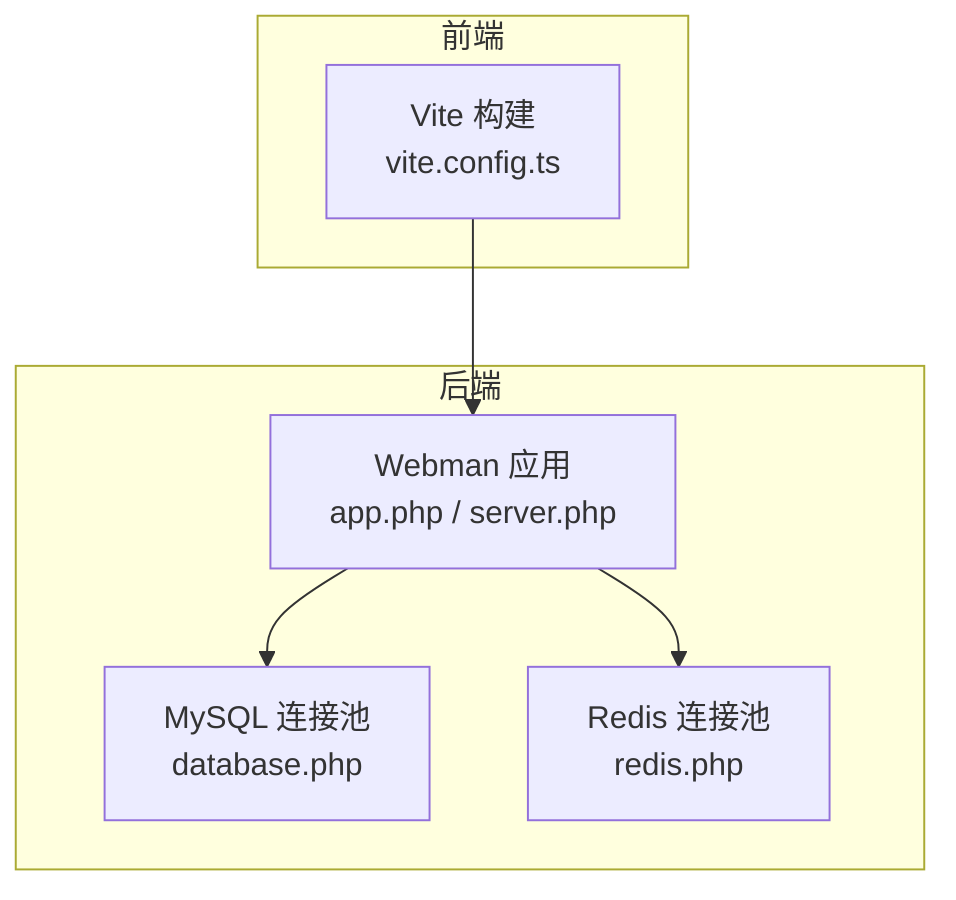
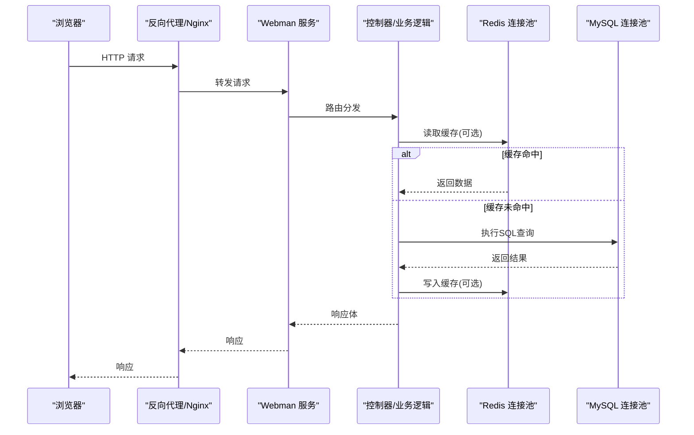
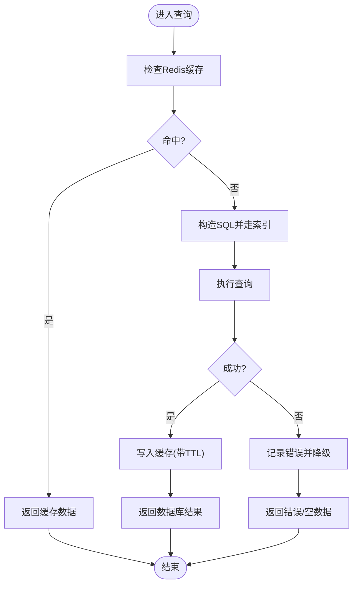
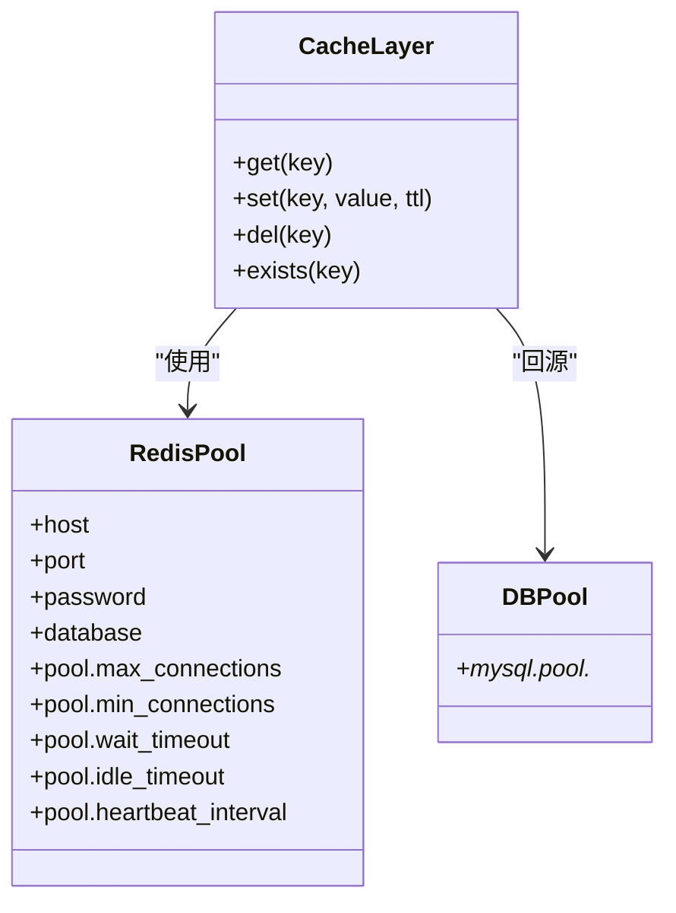
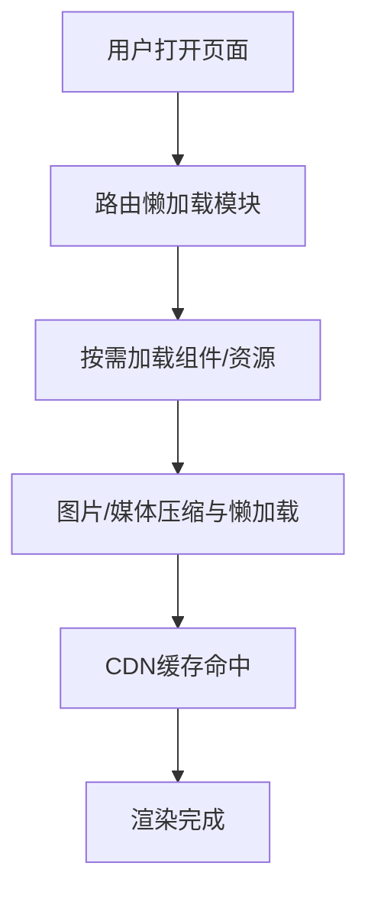
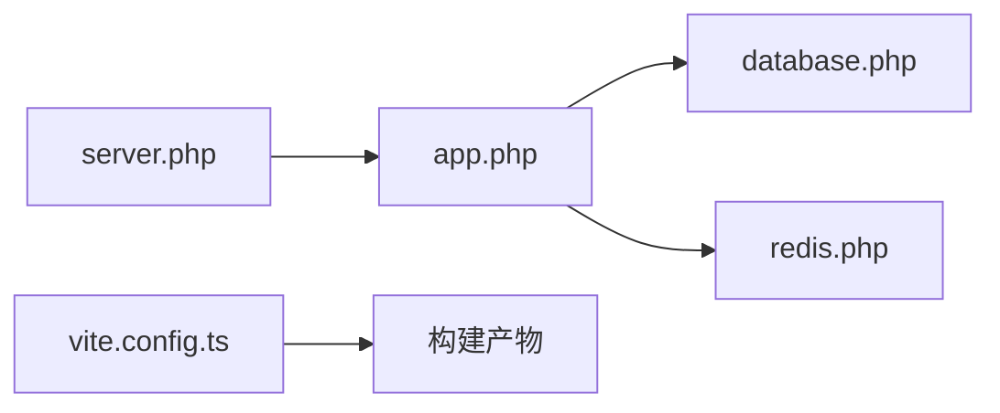

# 性能优化

<cite>
**本文引用的文件**
- [server/config/database.php](file://server/config/database.php)
- [server/config/redis.php](file://server/config/redis.php)
- [server/config/app.php](file://server/config/app.php)
- [server/config/server.php](file://server/config/server.php)
- [frontend/vite.config.ts](file://frontend/vite.config.ts)
- [server/README.md](file://server/README.md)
</cite>

## 目录
1. [简介](#简介)
2. [项目结构](#项目结构)
3. [核心组件](#核心组件)
4. [架构总览](#架构总览)
5. [详细组件分析](#详细组件分析)
6. [依赖分析](#依赖分析)
7. [性能考虑](#性能考虑)
8. [故障排查指南](#故障排查指南)
9. [结论](#结论)
10. [附录](#附录)

## 简介
本文件面向积木云AI创作平台的性能优化，围绕数据库连接池与查询优化、Redis缓存策略、前端资源压缩与懒加载、CDN加速配置、内存管理与CPU优化展开，并提供性能监控指标、瓶颈分析方法与调优建议。同时给出Apache Bench与JMeter等压测工具的使用方法与结果解读思路，帮助团队在开发、测试与生产环境持续优化系统吞吐与延迟。

## 项目结构
本项目采用前后端分离：
- 后端基于Webman（Swoole/Swow协程HTTP服务器），通过配置文件管理数据库、Redis、进程与运行时参数。
- 前端使用Vite构建Vue应用，提供开发代理与插件能力。

图示来源
- [frontend/vite.config.ts:1-32](file://frontend/vite.config.ts#L1-L32)
- [server/config/app.php:1-13](file://server/config/app.php#L1-L13)
- [server/config/server.php:1-12](file://server/config/server.php#L1-L12)
- [server/config/database.php:1-35](file://server/config/database.php#L1-L35)
- [server/config/redis.php:1-17](file://server/config/redis.php#L1-L17)

章节来源
- [server/README.md:49-56](file://server/README.md#L49-L56)

## 核心组件
- Webman 运行时与进程模型：控制事件循环、停止超时、日志与包大小限制等。
- 数据库连接池：MySQL驱动、字符集、严格模式、PDO选项与连接池参数。
- Redis连接池：主机、端口、密码、库号与连接池参数。
- Vite前端构建：插件、别名、开发代理与监听忽略规则。

章节来源
- [server/config/server.php:1-12](file://server/config/server.php#L1-L12)
- [server/config/database.php:1-35](file://server/config/database.php#L1-L35)
- [server/config/redis.php:1-17](file://server/config/redis.php#L1-L17)
- [frontend/vite.config.ts:1-32](file://frontend/vite.config.ts#L1-L32)

## 架构总览
下图展示请求从浏览器到后端的典型路径，以及数据库与缓存的交互关系。

图示来源
- [server/config/server.php:1-12](file://server/config/server.php#L1-L12)
- [server/config/database.php:1-35](file://server/config/database.php#L1-L35)
- [server/config/redis.php:1-17](file://server/config/redis.php#L1-L17)

## 详细组件分析

### 数据库连接池与查询优化
- 连接池关键参数
  - max_connections/min_connections：控制最大/最小连接数，需结合并发量与数据库承载能力评估。
  - wait_timeout/idle_timeout/heartbeat_interval：分别控制获取连接的等待时间、空闲回收时间与心跳检测间隔，避免连接泄漏与僵尸连接。
- 连接与SQL优化建议
  - 合理设置strict与charset/collation，确保一致性与索引友好。
  - 使用覆盖索引、避免SELECT *、减少回表；对热点查询建立合适索引。
  - 批量操作替代逐条插入/更新；分页查询使用游标或基于ID的范围查询。
  - 长事务拆分为短事务，降低锁竞争与连接占用。
  - 慢查询分析与EXPLAIN验证执行计划，必要时引入读写分离或分库分表。

图示来源
- [server/config/database.php:1-35](file://server/config/database.php#L1-L35)
- [server/config/redis.php:1-17](file://server/config/redis.php#L1-L17)

章节来源
- [server/config/database.php:1-35](file://server/config/database.php#L1-L35)

### Redis缓存策略
- 连接池参数与数据库类似，需根据QPS与键空间规模调整max/min连接与心跳。
- 缓存设计要点
  - 分层缓存：本地内存+Redis，热点数据优先本地。
  - 键命名规范与过期策略：按业务域划分，设置合理TTL，避免雪崩（随机化过期）。
  - 一致性：先删缓存再更新DB，或使用双写+延迟双删；读多写少场景可接受短暂不一致。
  - 数据结构选择：Hash/Sorted Set/List等，减少序列化开销。
  - 大Key与热Key治理：拆分大对象、热点Key加本地缓存或限流。

图示来源
- [server/config/redis.php:1-17](file://server/config/redis.php#L1-L17)
- [server/config/database.php:1-35](file://server/config/database.php#L1-L35)

章节来源
- [server/config/redis.php:1-17](file://server/config/redis.php#L1-L17)

### 前端资源压缩与懒加载
- 构建与打包
  - 使用Vite进行按需编译与代码分割，减少首屏体积。
  - 图片与静态资源压缩：可在构建脚本中集成压缩流程，减少传输体积。
- 懒加载与预取
  - 路由级懒加载：仅加载当前页面所需模块。
  - 组件级懒加载：大图、视频播放器、图表等重型组件按需加载。
  - 资源预取：对可能访问的路由或接口数据进行预取，提升体验。
- 开发与代理
  - 开发期通过Vite代理将API请求转发至后端，便于联调与调试。

章节来源
- [frontend/vite.config.ts:1-32](file://frontend/vite.config.ts#L1-L32)

### CDN加速配置
- 静态资源上CDN：JS/CSS/图片/字体等，开启Gzip/Brotli压缩与强缓存。
- 动态接口：可通过边缘计算或网关层做轻量缓存与鉴权。
- 缓存策略：版本化文件名+长期缓存；HTML短缓存或协商缓存。
- 回源优化：启用HTTP/2、Keep-Alive、连接复用；合理设置TTL与失效策略。

[本节为通用实践说明，不直接分析具体文件]

### 内存管理与CPU优化
- PHP/Webman
  - 合理设置进程数与每进程内存上限，避免OOM；定期重启worker以释放碎片。
  - 关闭不必要的扩展与调试输出，减少GC压力。
- 协程与I/O
  - 充分利用协程并发，避免阻塞式调用；异步处理耗时任务（队列/消息）。
- 数据库与缓存
  - 连接池大小与并发匹配；避免长事务与大事务。
  - 热点数据入缓存，降低DB压力。
- 前端
  - 减少重排重绘，虚拟列表渲染大数据；避免主线程长时间阻塞。

[本节为通用实践说明，不直接分析具体文件]

## 依赖分析
- 运行时依赖
  - Webman进程模型与事件循环：影响并发与吞吐。
  - MySQL与Redis连接池：决定外部依赖的吞吐与稳定性。
- 构建依赖
  - Vite与插件：影响构建速度与产物体积。

图示来源
- [server/config/server.php:1-12](file://server/config/server.php#L1-L12)
- [server/config/app.php:1-13](file://server/config/app.php#L1-L13)
- [server/config/database.php:1-35](file://server/config/database.php#L1-L35)
- [server/config/redis.php:1-17](file://server/config/redis.php#L1-L17)
- [frontend/vite.config.ts:1-32](file://frontend/vite.config.ts#L1-L32)

章节来源
- [server/config/server.php:1-12](file://server/config/server.php#L1-L12)
- [server/config/app.php:1-13](file://server/config/app.php#L1-L13)
- [server/config/database.php:1-35](file://server/config/database.php#L1-L35)
- [server/config/redis.php:1-17](file://server/config/redis.php#L1-L17)
- [frontend/vite.config.ts:1-32](file://frontend/vite.config.ts#L1-L32)

## 性能考虑
- 关键指标
  - 吞吐：QPS/TPS、并发连接数。
  - 延迟：P50/P95/P99 RT、首字节时间(TTFB)。
  - 资源：CPU使用率、内存占用、GC次数、连接池利用率、磁盘IO。
  - 错误：错误率、超时率、重试率。
- 瓶颈定位
  - 链路追踪：标记关键节点耗时，识别慢点。
  - 数据库：慢查询日志、执行计划、锁等待。
  - 缓存：命中率、大Key/热Key、网络往返。
  - 前端：资源体积、加载时序、渲染耗时。
- 调优建议
  - 连接池：根据峰值QPS与平均RT估算连接数，预留余量。
  - 缓存：热点数据优先缓存，设置合理TTL与防雪崩策略。
  - 前端：按需加载、资源压缩、CDN缓存、预取。
  - 进程模型：合理worker数量与单进程内存上限，避免频繁重启。

[本节为通用实践说明，不直接分析具体文件]

## 故障排查指南
- 常见问题
  - 连接池耗尽：检查max/min连接、wait_timeout与业务并发；观察连接泄漏。
  - 缓存穿透/击穿/雪崩：布隆过滤器、互斥锁、随机TTL、多级缓存。
  - 慢查询：定位TOP SQL，优化索引与语句；必要时引入只读副本。
  - 前端卡顿：分析长任务与重排重绘，拆分组件与懒加载。
- 日志与监控
  - Webman日志：stdout与workerman日志路径与轮转。
  - 数据库与Redis监控：连接数、命中率、慢查询、内存使用。
  - 前端监控：LCP/FID/CLS等核心指标。

章节来源
- [server/config/server.php:1-12](file://server/config/server.php#L1-L12)

## 结论
通过对数据库连接池与查询、Redis缓存、前端构建与懒加载、CDN与进程模型的协同优化，可以显著提升积木云AI创作平台的吞吐与用户体验。建议建立常态化压测与监控体系，持续发现瓶颈并迭代优化。

## 附录

### 性能测试方法（Apache Bench）
- 基础压测
  - 并发与请求总数：设定-c与-n参数，模拟真实并发。
  - 关注指标：Requests per second、Time per request、Transfer rate。
- 渐进加压
  - 逐步增加并发，观察吞吐与延迟拐点，定位容量上限。
- 结果分析
  - P95/P99延迟是否达标；错误率是否可控；CPU/内存/连接池是否饱和。

[本节为通用实践说明，不直接分析具体文件]

### 性能测试方法（JMeter）
- 场景设计
  - 登录、浏览、生成任务等核心链路组合；混合比例贴近真实流量。
- 指标采集
  - 吞吐量、响应时间分布、错误率、资源使用率。
- 结果分析
  - 识别热点接口与慢步骤；对比不同优化方案的效果。

[本节为通用实践说明，不直接分析具体文件]