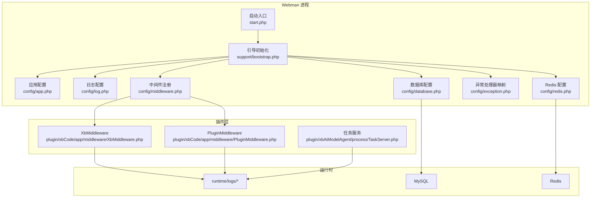
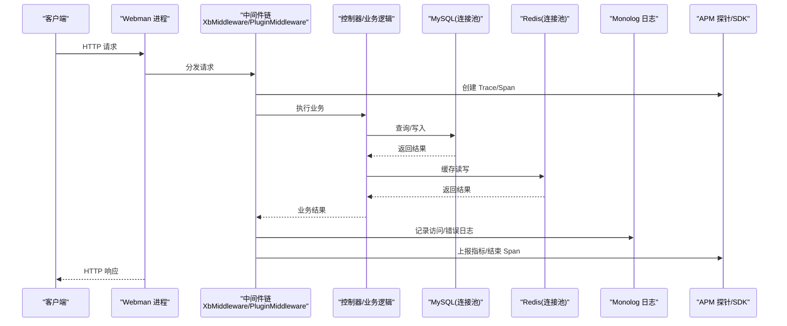
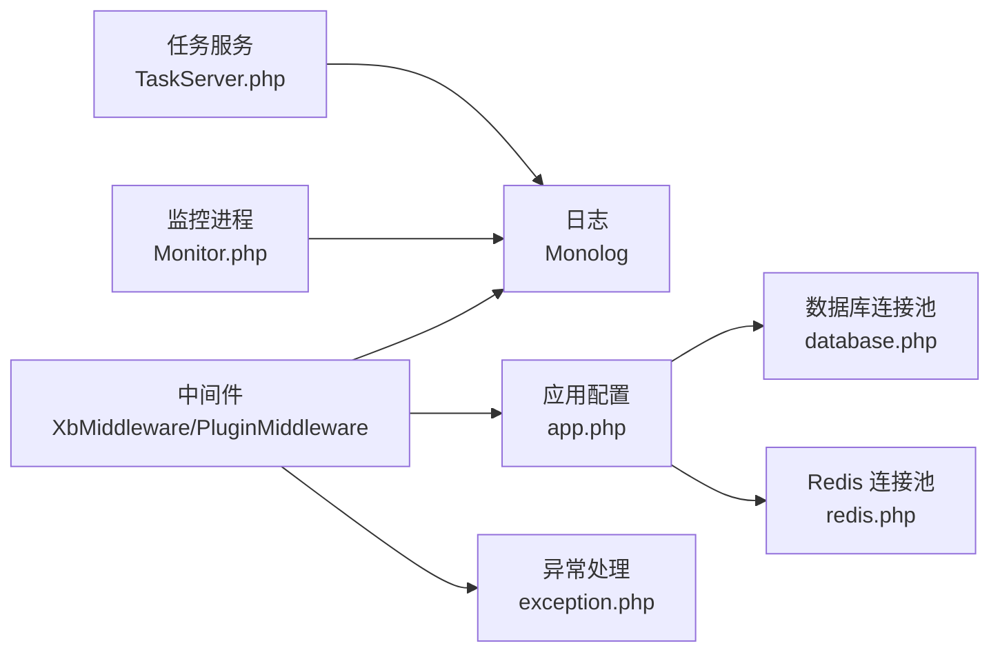

# 性能监控与分析

<cite>
**本文引用的文件**   
- [server/config/log.php](file://server/config/log.php)
- [server/config/app.php](file://server/config/app.php)
- [server/config/exception.php](file://server/config/exception.php)
- [server/config/middleware.php](file://server/config/middleware.php)
- [server/config/database.php](file://server/config/database.php)
- [server/config/redis.php](file://server/config/redis.php)
- [server/start.php](file://server/start.php)
- [server/support/bootstrap.php](file://server/support/bootstrap.php)
- [server/support/Request.php](file://server/support/Request.php)
- [server/support/Response.php](file://server/support/Response.php)
- [server/plugin/xbCode/app/middleware/XbMiddleware.php](file://server/plugin/xbCode/app/middleware/XbMiddleware.php)
- [server/plugin/xbCode/app/middleware/PluginMiddleware.php](file://server/plugin/xbCode/app/middleware/PluginMiddleware.php)
- [server/plugin/xbAiModelAgent/process/TaskServer.php](file://server/plugin/xbAiModelAgent/process/TaskServer.php)
- [server/app/process/Monitor.php](file://server/app/process/Monitor.php)
</cite>

## 目录
1. [简介](#简介)
2. [项目结构](#项目结构)
3. [核心组件](#核心组件)
4. [架构总览](#架构总览)
5. [详细组件分析](#详细组件分析)
6. [依赖关系分析](#依赖关系分析)
7. [性能考虑](#性能考虑)
8. [故障排查指南](#故障排查指南)
9. [结论](#结论)
10. [附录](#附录)

## 简介
本文件面向积木云AI创作平台的后端（基于 Webman + xbCode 插件化框架），提供一套可落地的性能监控与分析方案，覆盖：
- APM 工具集成：请求链路追踪、错误监控、性能指标采集
- 日志系统优化：日志级别控制、异步写入、日志轮转策略
- 压测与基准测试：Apache Bench、JMeter、Locust 的脚本编写与结果分析方法
- 容量规划与扩容策略：结合数据库连接池、Redis 连接池、进程模型与队列消费能力进行规划

## 项目结构
本项目采用前后端分离。后端位于 server 目录，使用 Webman 作为高性能 PHP 应用服务器，并通过 xbCode 插件体系扩展业务功能。关键配置集中在 config 目录，运行时产物在 runtime 目录。

图示来源
- [server/start.php](file://server/start.php)
- [server/support/bootstrap.php](file://server/support/bootstrap.php)
- [server/config/app.php](file://server/config/app.php)
- [server/config/log.php](file://server/config/log.php)
- [server/config/database.php](file://server/config/database.php)
- [server/config/redis.php](file://server/config/redis.php)
- [server/config/exception.php](file://server/config/exception.php)
- [server/config/middleware.php](file://server/config/middleware.php)
- [server/plugin/xbCode/app/middleware/XbMiddleware.php](file://server/plugin/xbCode/app/middleware/XbMiddleware.php)
- [server/plugin/xbCode/app/middleware/PluginMiddleware.php](file://server/plugin/xbCode/app/middleware/PluginMiddleware.php)
- [server/plugin/xbAiModelAgent/process/TaskServer.php](file://server/plugin/xbAiModelAgent/process/TaskServer.php)

章节来源
- [server/config/app.php:1-13](file://server/config/app.php#L1-L13)
- [server/config/log.php:1-33](file://server/config/log.php#L1-L33)
- [server/config/database.php:1-35](file://server/config/database.php#L1-L35)
- [server/config/redis.php:1-17](file://server/config/redis.php#L1-L17)
- [server/config/exception.php:1-17](file://server/config/exception.php#L1-L17)
- [server/config/middleware.php:1-12](file://server/config/middleware.php#L1-L12)

## 核心组件
- 应用配置与运行环境
  - 调试开关、时区、公共路径、运行时路径等由应用配置集中管理，便于在不同环境切换行为。
- 日志子系统
  - 默认使用 Monolog 的 RotatingFileHandler，按天或按数量轮转，输出到 runtime/logs/webman.log。
- 异常处理
  - 通过配置文件将未捕获异常映射到支持层的统一处理器，便于标准化错误响应与日志记录。
- 中间件链
  - 全局中间件包含 xbCode 提供的通用中间件与插件中间件，适合在此处注入链路追踪与指标采集逻辑。
- 数据访问
  - MySQL 与 Redis 均启用连接池，配置了最大/最小连接数、等待超时、空闲回收与心跳检测，直接影响吞吐与延迟。

章节来源
- [server/config/app.php:1-13](file://server/config/app.php#L1-L13)
- [server/config/log.php:1-33](file://server/config/log.php#L1-L33)
- [server/config/exception.php:1-17](file://server/config/exception.php#L1-L17)
- [server/config/middleware.php:1-12](file://server/config/middleware.php#L1-L12)
- [server/config/database.php:1-35](file://server/config/database.php#L1-L35)
- [server/config/redis.php:1-17](file://server/config/redis.php#L1-L17)

## 架构总览
下图展示了从请求进入、中间件处理、业务执行、外部依赖调用到日志与异常输出的整体流程，并标注了可扩展的 APM 埋点位置。

图示来源
- [server/config/middleware.php:1-12](file://server/config/middleware.php#L1-L12)
- [server/plugin/xbCode/app/middleware/XbMiddleware.php](file://server/plugin/xbCode/app/middleware/XbMiddleware.php)
- [server/plugin/xbCode/app/middleware/PluginMiddleware.php](file://server/plugin/xbCode/app/middleware/PluginMiddleware.php)
- [server/config/database.php:1-35](file://server/config/database.php#L1-L35)
- [server/config/redis.php:1-17](file://server/config/redis.php#L1-L17)
- [server/config/log.php:1-33](file://server/config/log.php#L1-L33)

## 详细组件分析

### 日志系统与轮转策略
- 当前实现
  - 使用 Monolog 的 RotatingFileHandler，输出至 runtime/logs/webman.log，保留最近若干份历史日志，格式为“时间戳+消息”。
- 建议优化
  - 日志级别控制：生产环境建议 INFO/WARNING/ERROR；开发/预发可使用 DEBUG。
  - 异步写入：引入异步处理器（如 Monolog 的 FingersCrossed/Buffer/Async）降低 I/O 对主线程的影响。
  - 多通道输出：除本地文件外，接入集中式日志平台（如 ELK/Loki），便于检索与告警。
  - 结构化日志：统一 JSON 格式，包含 trace_id、user_id、method、path、status、duration 等字段，便于 APM 关联。
  - 轮转策略：按大小与天数双维度轮转，避免单文件过大；清理过期日志。

章节来源
- [server/config/log.php:1-33](file://server/config/log.php#L1-L33)

### 异常处理与错误监控
- 当前实现
  - 通过 exception 配置将未捕获异常映射到 support\exception\Handler，确保统一的错误处理入口。
- 建议优化
  - 在统一处理器中：
    - 生成并注入 trace_id，贯穿请求生命周期
    - 记录结构化错误日志（堆栈、上下文、请求参数摘要）
    - 上报错误事件到 APM/错误监控平台（如 Sentry）
    - 根据状态码与错误类型决定是否降级或熔断
  - 对外响应：区分用户可见错误与内部错误，避免泄露敏感信息。

章节来源
- [server/config/exception.php:1-17](file://server/config/exception.php#L1-L17)

### 中间件与链路追踪
- 当前实现
  - 全局中间件包含 XbMiddleware 与 PluginMiddleware，适合在此处注入链路追踪与指标采集。
- 建议优化
  - 在中间件中：
    - 生成/透传 trace_id（HTTP Header 或 Cookie）
    - 记录请求开始/结束时间，计算耗时
    - 收集关键指标：QPS、P95/P99 延迟、错误率、上游依赖耗时
    - 将 trace_id 注入日志上下文，便于跨系统关联
  - 可选：集成 OpenTelemetry SDK，自动埋点 HTTP、数据库、Redis 调用。

章节来源
- [server/config/middleware.php:1-12](file://server/config/middleware.php#L1-L12)
- [server/plugin/xbCode/app/middleware/XbMiddleware.php](file://server/plugin/xbCode/app/middleware/XbMiddleware.php)
- [server/plugin/xbCode/app/middleware/PluginMiddleware.php](file://server/plugin/xbCode/app/middleware/PluginMiddleware.php)

### 数据库与 Redis 连接池
- 当前实现
  - MySQL 与 Redis 均配置连接池，包括最大/最小连接数、等待超时、空闲回收与心跳检测。
- 建议优化
  - 根据 QPS 与平均耗时估算所需连接数，合理设置 max_connections。
  - 关注 wait_timeout 与 idle_timeout，避免连接泄漏与资源浪费。
  - 监控慢查询与热点 Key，必要时增加索引或缓存策略。
  - 针对长耗时任务（如 AI 生成）使用队列与异步处理，避免阻塞请求链路。

章节来源
- [server/config/database.php:1-35](file://server/config/database.php#L1-L35)
- [server/config/redis.php:1-17](file://server/config/redis.php#L1-L17)

### 后台任务与监控进程
- 当前实现
  - 存在任务服务与监控进程相关文件，用于后台任务处理与系统监控。
- 建议优化
  - 为任务消费者添加独立指标与日志通道，隔离前台与后台负载。
  - 监控任务堆积、失败重试、死信队列等关键指标。
  - 结合系统级监控（CPU、内存、磁盘 IO、网络）进行综合诊断。

章节来源
- [server/plugin/xbAiModelAgent/process/TaskServer.php](file://server/plugin/xbAiModelAgent/process/TaskServer.php)
- [server/app/process/Monitor.php](file://server/app/process/Monitor.php)

## 依赖关系分析
- 组件耦合
  - 中间件与业务解耦，便于横向扩展 APM 与日志能力。
  - 配置驱动（app、log、database、redis、exception、middleware）清晰，利于环境差异化管理。
- 外部依赖
  - Monolog（日志）、PDO/MySQL（数据库）、Redis（缓存/队列）。
- 潜在风险
  - 若中间件过重或同步 I/O 过多，会显著影响吞吐。
  - 连接池配置不当会导致连接耗尽或频繁重建连接。

图示来源
- [server/config/middleware.php:1-12](file://server/config/middleware.php#L1-L12)
- [server/config/log.php:1-33](file://server/config/log.php#L1-L33)
- [server/config/app.php:1-13](file://server/config/app.php#L1-L13)
- [server/config/exception.php:1-17](file://server/config/exception.php#L1-L17)
- [server/config/database.php:1-35](file://server/config/database.php#L1-L35)
- [server/config/redis.php:1-17](file://server/config/redis.php#L1-L17)
- [server/plugin/xbAiModelAgent/process/TaskServer.php](file://server/plugin/xbAiModelAgent/process/TaskServer.php)
- [server/app/process/Monitor.php](file://server/app/process/Monitor.php)

## 性能考虑
- 连接池调优
  - 依据并发度与平均耗时估算连接数，避免过小导致排队、过大导致资源竞争。
  - 开启心跳检测，及时回收无效连接。
- 日志开销
  - 生产环境关闭 DEBUG，采用异步写入与批量落盘，减少磁盘抖动。
- 缓存命中
  - 提高 Redis 命中率，降低数据库压力；注意缓存穿透、雪崩与击穿防护。
- 任务削峰
  - 将耗时操作放入队列，限制消费者并发，防止雪崩。
- 前端与静态资源
  - 合理使用 CDN、压缩与缓存头，减轻服务端压力。

[本节为通用指导，不直接分析具体文件]

## 故障排查指南
- 快速定位
  - 通过 trace_id 串联日志与 APM 链路，定位慢请求与异常。
  - 检查数据库慢查询与锁等待，关注 Redis 大 Key 与热点 Key。
- 常见症状
  - 高 CPU：热点算法、序列化/反序列化、正则匹配。
  - 高内存：对象未释放、大数组、未分页查询。
  - 高 IO：日志同步写入、大文件上传下载、数据库全表扫描。
- 恢复手段
  - 临时降级非核心功能、限流与熔断、扩容实例与连接池上限。
  - 清理过期日志与临时文件，释放磁盘空间。

[本节为通用指导，不直接分析具体文件]

## 结论
通过在中间件层统一注入链路追踪与指标采集、完善日志结构与异步写入、合理配置数据库与 Redis 连接池，并结合压测与容量规划，可在保证稳定性的同时持续提升系统吞吐与用户体验。

[本节为总结性内容，不直接分析具体文件]

## 附录

### APM 集成方案（建议）
- 链路追踪
  - 在中间件生成/透传 trace_id，记录请求起止时间与关键步骤耗时。
  - 对接 OpenTelemetry 或厂商 APM SDK，自动采集 HTTP、DB、Redis 调用。
- 错误监控
  - 统一异常处理器上报错误事件，附带上下文与堆栈。
- 指标采集
  - 暴露标准指标（QPS、延迟分位、错误率、连接池使用率、GC/CPU/内存），接入 Prometheus/Grafana。

[本节为概念性说明，不直接分析具体文件]

### 日志系统优化清单
- 级别控制：按环境配置不同级别
- 异步写入：缓冲/批处理/异步处理器
- 轮转策略：按大小与天数双维度
- 结构化输出：JSON 格式，包含 trace_id、方法、路径、状态码、耗时等
- 多通道：本地文件 + 集中式日志平台

章节来源
- [server/config/log.php:1-33](file://server/config/log.php#L1-L33)

### 压测工具与脚本要点
- Apache Bench
  - 常用参数：并发数、总请求数、超时、Header 携带（如鉴权 Token）
  - 关注指标：每秒请求数、平均/分位延迟、错误率
- JMeter
  - 场景设计：登录→浏览→生成任务→查询结果
  - 监听器：聚合报告、图形结果、事务控制器
- Locust
  - Python 脚本定义用户行为与思考时间
  - 分布式压测：Master/Worker 模式
- 结果分析
  - 以 P95/P99 延迟为主，结合错误率与资源利用率判断瓶颈
  - 对比基线，评估变更影响

[本节为通用指导，不直接分析具体文件]

### 容量规划与扩容策略
- 容量规划
  - 以峰值 QPS 与平均耗时估算单机吞吐，结合连接池上限确定实例数
  - 数据库与 Redis 按连接数与带宽预留冗余
- 扩容策略
  - 水平扩容：增加 Webman 实例与任务消费者
  - 垂直扩容：提升 CPU/内存/IO 能力
  - 弹性伸缩：基于 CPU/内存/队列长度触发扩缩容
  - 灰度发布：逐步放量，配合 APM 与告警快速回滚

[本节为通用指导，不直接分析具体文件]