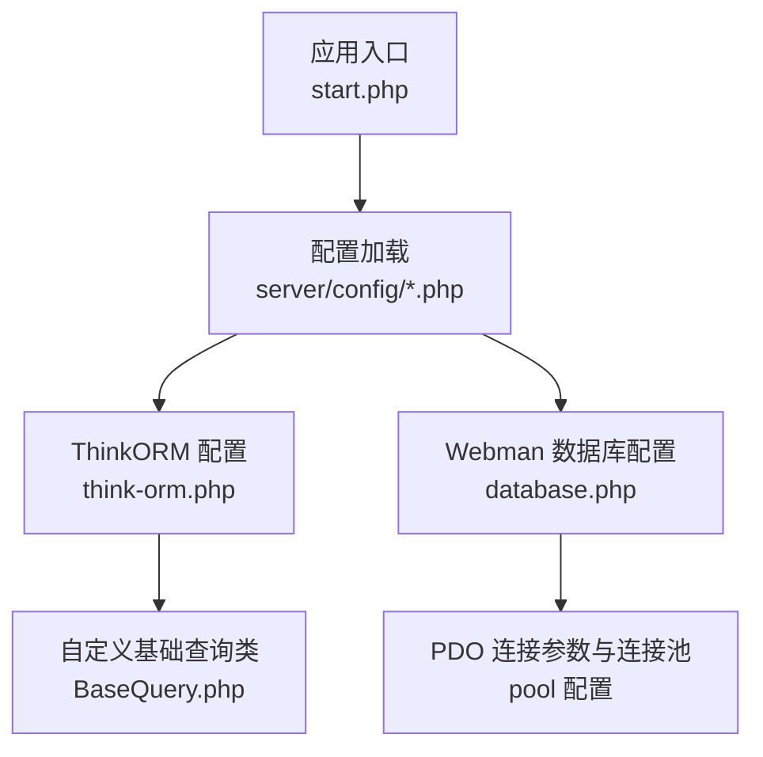
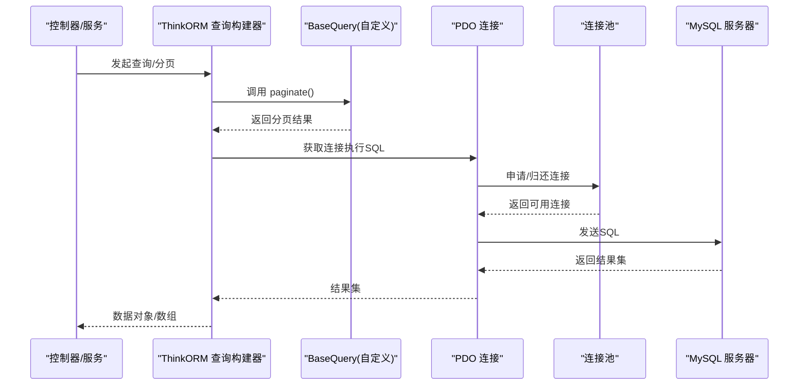
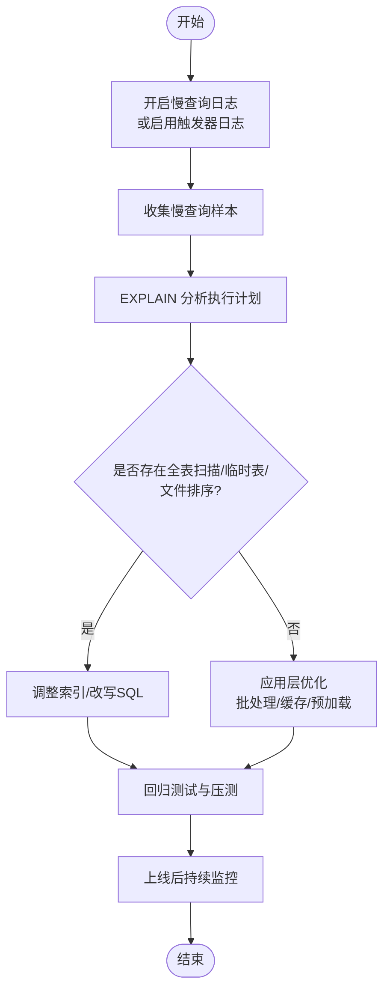
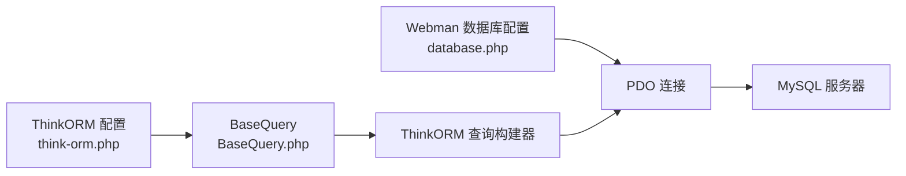

# 数据库优化

<cite>
**本文引用的文件**   
- [server/config/database.php](file://server/config/database.php)
- [server/config/think-orm.php](file://server/config/think-orm.php)
- [server/plugin/xbCode/base/BaseQuery.php](file://server/plugin/xbCode/base/BaseQuery.php)
</cite>

## 目录
1. [简介](#简介)
2. [项目结构](#项目结构)
3. [核心组件](#核心组件)
4. [架构总览](#架构总览)
5. [详细组件分析](#详细组件分析)
6. [依赖关系分析](#依赖关系分析)
7. [性能考虑](#性能考虑)
8. [故障排查指南](#故障排查指南)
9. [结论](#结论)
10. [附录](#附录)

## 简介
本文件面向积木云AI创作平台的后端数据库层，聚焦MySQL查询优化、索引策略设计、连接池配置、慢查询分析与优化，并结合ThinkORM的使用实践给出N+1查询问题解决方案、批量操作与事务管理最佳实践。同时提供分库分表与读写分离的落地建议，以及监控工具使用方法和关键性能指标分析方法，帮助团队在现有代码基础上持续提升数据库性能与稳定性。

## 项目结构
本项目采用插件化架构，数据库相关配置集中在 server/config 目录下，ThinkORM 通过配置文件启用并注入自定义基础查询类 BaseQuery，用于统一分页行为与后续扩展点。

图表来源
- [server/config/think-orm.php:1-40](file://server/config/think-orm.php#L1-L40)
- [server/config/database.php:1-35](file://server/config/database.php#L1-L35)
- [server/plugin/xbCode/base/BaseQuery.php:1-30](file://server/plugin/xbCode/base/BaseQuery.php#L1-L30)

章节来源
- [server/config/think-orm.php:1-40](file://server/config/think-orm.php#L1-L40)
- [server/config/database.php:1-35](file://server/config/database.php#L1-L35)
- [server/plugin/xbCode/base/BaseQuery.php:1-30](file://server/plugin/xbCode/base/BaseQuery.php#L1-L30)

## 核心组件
- ThinkORM 配置：定义默认驱动、连接参数、字符集、前缀、断线重连、SQL日志开关及自定义基础查询类。
- Webman 数据库配置：定义 MySQL 连接信息、严格模式、引擎、PDO选项与连接池参数（最大/最小连接数、等待超时、空闲回收、心跳检测）。
- 自定义基础查询类：重写分页方法，支持从请求参数中读取默认分页大小，便于统一列表接口行为。

章节来源
- [server/config/think-orm.php:1-40](file://server/config/think-orm.php#L1-L40)
- [server/config/database.php:1-35](file://server/config/database.php#L1-L35)
- [server/plugin/xbCode/base/BaseQuery.php:1-30](file://server/plugin/xbCode/base/BaseQuery.php#L1-L30)

## 架构总览
下图展示了从控制器到数据库连接的调用链路，以及 ThinkORM 与底层 PDO 的连接池交互。

图表来源
- [server/config/think-orm.php:1-40](file://server/config/think-orm.php#L1-L40)
- [server/plugin/xbCode/base/BaseQuery.php:1-30](file://server/plugin/xbCode/base/BaseQuery.php#L1-L30)
- [server/config/database.php:1-35](file://server/config/database.php#L1-L35)

## 详细组件分析

### ThinkORM 配置与连接参数
- 默认驱动为 MySQL，主机、端口、数据库名、用户名、密码、字符集与前缀均通过环境变量注入。
- params 中设置连接超时，break_reconnect 开启断线重连，trigger_sql 根据调试开关决定是否监听SQL日志。
- 自定义 query 指向 BaseQuery，使所有查询继承统一的分页逻辑与扩展点。

优化要点
- 生产环境关闭 trigger_sql，避免额外日志开销；仅在需要时临时开启。
- 合理设置连接超时，避免长阻塞。
- 结合 Webman 连接池参数，确保连接生命周期与业务并发匹配。

章节来源
- [server/config/think-orm.php:1-40](file://server/config/think-orm.php#L1-L40)

### Webman 数据库连接池配置
- 连接池参数包括最大/最小连接数、等待超时、空闲回收时间与心跳检测间隔。
- PDO 选项禁用模拟预处理，提升安全性与性能。

优化要点
- max_connections 需结合 MySQL 的 max_connections 与进程数综合评估，避免耗尽系统资源。
- wait_timeout 应小于业务可接受延迟上限，防止协程长时间阻塞。
- idle_timeout 与 heartbeat_interval 配合，及时回收空闲连接，降低连接抖动对性能的影响。

章节来源
- [server/config/database.php:1-35](file://server/config/database.php#L1-L35)

### 自定义基础查询类 BaseQuery
- 重写 paginate 方法，当未显式传入分页大小时，从请求参数 limit 读取默认值，保证列表接口一致性。
- 作为扩展点，可在其中加入统一的查询审计、缓存键生成或慢查询埋点。

优化要点
- 将分页大小限制在合理范围，避免过大导致响应缓慢。
- 可在该方法内记录分页参数与耗时，辅助慢查询定位。

章节来源
- [server/plugin/xbCode/base/BaseQuery.php:1-30](file://server/plugin/xbCode/base/BaseQuery.php#L1-L30)

### ThinkORM 查询优化技巧与实践
- N+1 查询问题
  - 使用关联预加载（如 with）一次性加载关联数据，避免循环内多次查询。
  - 对高频访问的关联字段建立覆盖索引，减少回表。
- 批量操作优化
  - 使用批量插入/更新替代逐条写入，减少事务与网络往返。
  - 大批量写操作拆分为多批次，控制单次事务大小，避免锁竞争与日志膨胀。
- 事务管理最佳实践
  - 明确事务边界，尽量缩短事务持有时间。
  - 避免在事务中进行外部IO或长耗时计算。
  - 对热点行加锁场景，优先使用乐观锁或队列异步处理。
- 分页与排序
  - 避免深分页，必要时使用游标分页或基于上次最大ID的下一页查询。
  - 排序字段需有合适索引，避免 filesort。
- SQL 日志与审计
  - 生产环境默认关闭 trigger_sql，按需开启并限定范围。
  - 结合 BaseQuery 增加分页参数与耗时埋点，形成可观测性。

[本节为通用实践说明，不直接分析具体文件]

### 索引策略设计
- 主键与唯一索引
  - 为外键与常用过滤条件建立索引，避免全表扫描。
  - 对高基数列优先建索引，低基数列谨慎使用。
- 复合索引
  - 遵循最左前缀原则，按等值条件在前、范围条件在后组织字段顺序。
  - 针对常见查询组合创建覆盖索引，减少回表。
- 函数与表达式
  - 尽量避免在 WHERE 中对列使用函数或表达式，必要时使用生成列或冗余字段。
- 统计信息与维护
  - 定期 ANALYZE TABLE，保持统计信息准确。
  - 监控索引使用率，清理无用索引。

[本节为通用实践说明，不直接分析具体文件]

### 慢查询分析与优化流程

[本图为概念流程图，无需图表来源]

### 分库分表策略
- 水平分表
  - 按用户ID或租户ID哈希分表，保证同一会话内数据局部性。
  - 跨分片聚合查询通过应用层合并或引入搜索引擎/OLAP。
- 垂直拆分
  - 将热点表与非热点表拆分至不同库，隔离负载。
- 路由与迁移
  - 使用中间件或ORM层实现透明路由，灰度迁移数据。
- 注意事项
  - 避免跨库事务，改用最终一致性方案。
  - 全局ID生成策略（雪花算法等），避免冲突。

[本节为通用实践说明，不直接分析具体文件]

### 读写分离配置
- 架构建议
  - 主库负责写，从库负责读；通过ORM或代理层进行读写分离。
- 一致性要求
  - 强一致场景仍走主库，弱一致场景可走从库。
- 同步延迟
  - 监控复制延迟，必要时强制回主库读取。
- 负载均衡
  - 多个从库间做读负载均衡，提高吞吐。

[本节为通用实践说明，不直接分析具体文件]

### 数据库监控工具与指标分析
- 监控维度
  - 连接数、活跃连接、等待连接、连接池命中率。
  - QPS/TPS、慢查询数量、平均响应时间、P95/P99。
  - InnoDB缓冲池命中率、磁盘I/O、锁等待与死锁。
- 工具建议
  - MySQL 内置慢查询日志与 performance_schema。
  - 第三方监控：Prometheus + mysqld_exporter + Grafana。
- 指标阈值
  - 连接池等待超时频繁触发需扩容或优化SQL。
  - 慢查询占比超过阈值需重点治理。
  - 缓冲池命中率低于95%需关注内存与索引。

[本节为通用实践说明，不直接分析具体文件]

## 依赖关系分析
- ThinkORM 配置通过自定义 query 指向 BaseQuery，影响所有查询构建器的行为。
- Webman 数据库配置提供底层 PDO 连接与连接池参数，ThinkORM 在其之上构建查询。
- 两者共同决定连接生命周期、重试机制与SQL执行路径。

图表来源
- [server/config/think-orm.php:1-40](file://server/config/think-orm.php#L1-L40)
- [server/config/database.php:1-35](file://server/config/database.php#L1-L35)
- [server/plugin/xbCode/base/BaseQuery.php:1-30](file://server/plugin/xbCode/base/BaseQuery.php#L1-L30)

章节来源
- [server/config/think-orm.php:1-40](file://server/config/think-orm.php#L1-L40)
- [server/config/database.php:1-35](file://server/config/database.php#L1-L35)
- [server/plugin/xbCode/base/BaseQuery.php:1-30](file://server/plugin/xbCode/base/BaseQuery.php#L1-L30)

## 性能考虑
- 连接池调优
  - 根据并发与MySQL容量设定 max_connections，避免连接风暴。
  - 合理设置 wait_timeout 与 idle_timeout，平衡资源占用与响应速度。
- SQL 优化
  - 避免 SELECT *，仅选择必要字段。
  - 合理使用 LIMIT 与 OFFSET，优先使用游标分页。
  - 避免在 WHERE 中使用函数与隐式类型转换。
- 事务与锁
  - 缩小事务范围，减少锁粒度。
  - 热点更新使用队列异步化或批量合并。
- 缓存与离线
  - 对读多写少的数据引入缓存层，降低数据库压力。
  - 报表与复杂分析任务走离线计算。

[本节为通用实践说明，不直接分析具体文件]

## 故障排查指南
- 常见问题
  - 连接池耗尽：检查 max_connections 与业务并发是否匹配，查看等待超时日志。
  - 慢查询增多：开启慢查询日志，定位TOP SQL，EXPLAIN 分析执行计划。
  - 锁等待与死锁：查看锁等待与死锁日志，优化事务与索引。
- 快速定位步骤
  - 确认 trigger_sql 与慢查询日志状态。
  - 抓取慢查询样本，核对索引命中情况。
  - 在 BaseQuery 中增加分页参数与耗时埋点，辅助定位。
- 恢复措施
  - 临时扩容连接池或限流降级。
  - 回滚变更，逐步验证修复效果。

章节来源
- [server/config/think-orm.php:1-40](file://server/config/think-orm.php#L1-L40)
- [server/config/database.php:1-35](file://server/config/database.php#L1-L35)
- [server/plugin/xbCode/base/BaseQuery.php:1-30](file://server/plugin/xbCode/base/BaseQuery.php#L1-L30)

## 结论
通过对 ThinkORM 与 Webman 数据库配置的协同调优、合理的索引设计与慢查询治理、连接池参数的精细化配置，以及分库分表与读写分离的渐进式落地，可以显著提升积木云AI创作平台的数据层性能与稳定性。建议在上线前后建立完善的监控与告警体系，持续追踪关键指标，形成闭环优化。

## 附录
- 环境变量清单（示例）
  - DB_HOST、DB_PORT、DB_NAME、DB_USER、DB_PASS、DB_CHARSET、DB_PREFIX
- 连接池参数参考
  - max_connections、min_connections、wait_timeout、idle_timeout、heartbeat_interval

[本节为通用实践说明，不直接分析具体文件]