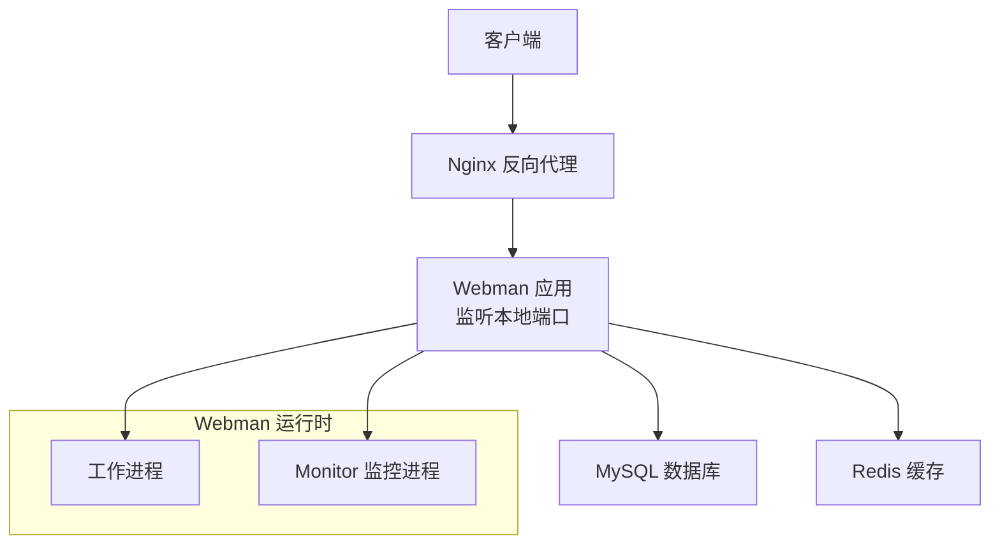
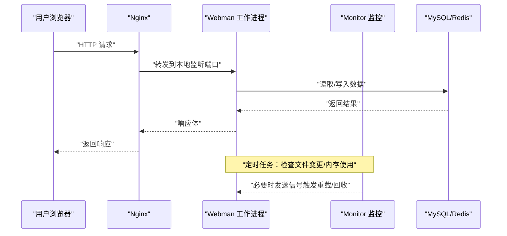
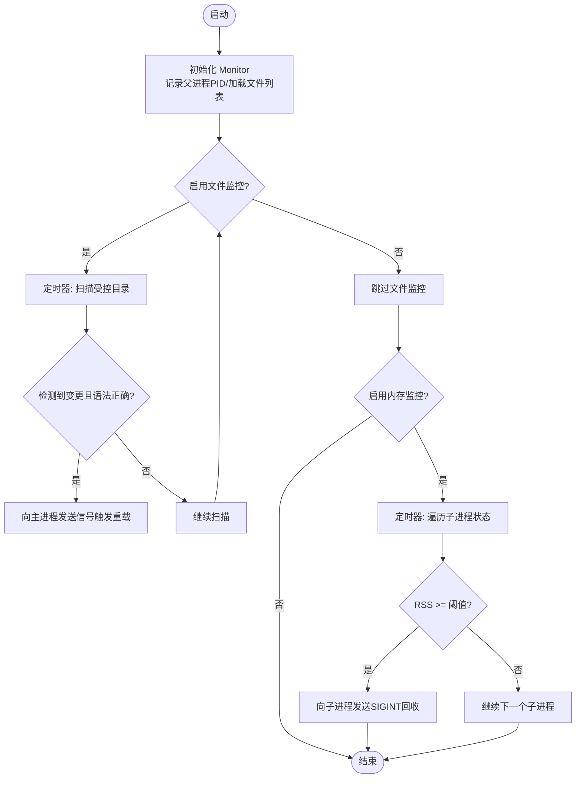
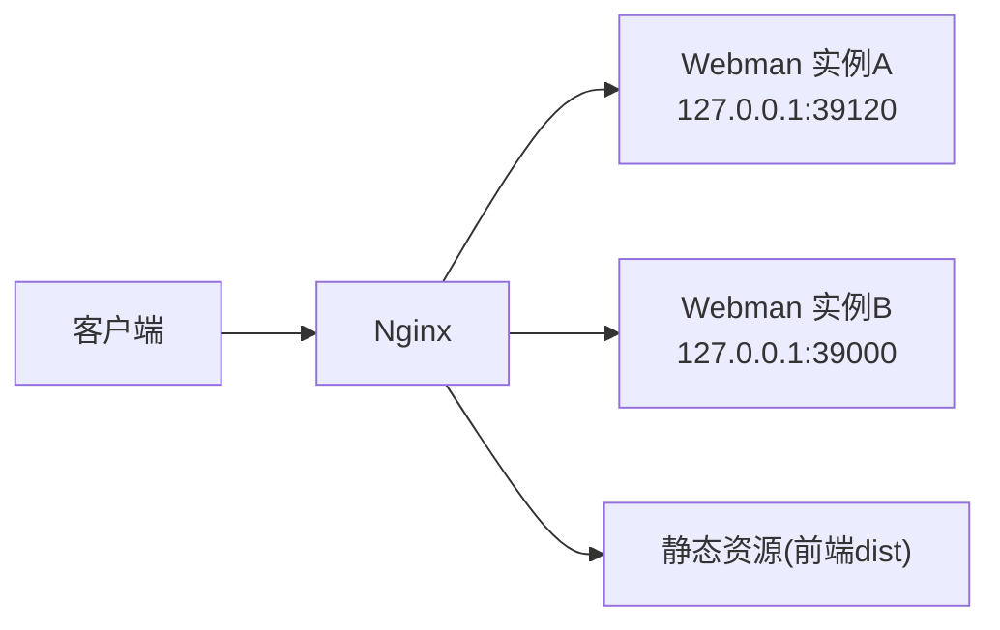
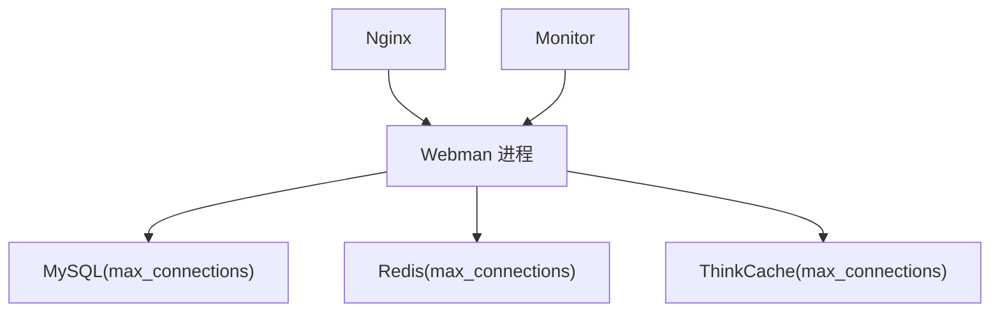

# 服务器性能优化

<cite>
**本文引用的文件**   
- [server/config/server.php](file://server/config/server.php)
- [server/nginx.conf](file://server/nginx.conf)
- [server/plugin/xbCode/nginx.conf](file://server/plugin/xbCode/nginx.conf)
- [server/app/process/Monitor.php](file://server/app/process/Monitor.php)
- [server/config/database.php](file://server/config/database.php)
- [server/config/redis.php](file://server/config/redis.php)
- [server/config/think-cache.php](file://server/config/think-cache.php)
- [server/plugin/xbCode/config/process.php](file://server/plugin/xbCode/config/process.php)
</cite>

## 目录
1. [简介](#简介)
2. [项目结构](#项目结构)
3. [核心组件](#核心组件)
4. [架构总览](#架构总览)
5. [详细组件分析](#详细组件分析)
6. [依赖关系分析](#依赖关系分析)
7. [性能考量](#性能考量)
8. [故障排查指南](#故障排查指南)
9. [结论](#结论)
10. [附录](#附录)

## 简介
本文件面向积木云AI创作平台的服务器性能优化，聚焦以下方面：
- Webman 框架进程管理与内存监控、CPU与事件循环调优建议
- Nginx 反向代理优化（Gzip、Keep-Alive、负载均衡）
- PHP-FPM 进程池与 OPcache 参数调优建议
- 系统级优化（文件描述符、网络内核参数）
- 监控工具与瓶颈分析方法

说明：本项目基于 Webman 运行，未使用 PHP-FPM；但为便于统一运维体系，仍给出 FPM 与 OPcache 的通用优化建议。

## 项目结构
与本次优化直接相关的后端配置与运行时文件如下：
- Webman 服务配置：server/config/server.php
- Nginx 反向代理：server/nginx.conf 与 server/plugin/xbCode/nginx.conf
- 进程监控与内存限制：server/app/process/Monitor.php
- 数据库/缓存连接数：server/config/database.php、server/config/redis.php、server/config/think-cache.php
- 插件端口配置：server/plugin/xbCode/config/process.php

图表来源
- [server/nginx.conf:1-12](file://server/nginx.conf#L1-L12)
- [server/plugin/xbCode/nginx.conf:1-12](file://server/plugin/xbCode/nginx.conf#L1-L12)
- [server/config/server.php:1-12](file://server/config/server.php#L1-L12)
- [server/app/process/Monitor.php:1-306](file://server/app/process/Monitor.php#L1-L306)

章节来源
- [server/config/server.php:1-12](file://server/config/server.php#L1-L12)
- [server/nginx.conf:1-12](file://server/nginx.conf#L1-L12)
- [server/plugin/xbCode/nginx.conf:1-12](file://server/plugin/xbCode/nginx.conf#L1-L12)
- [server/app/process/Monitor.php:1-306](file://server/app/process/Monitor.php#L1-L306)

## 核心组件
- Webman 服务配置
  - 关键项包括事件循环、停止超时、PID/状态/日志路径、最大包体大小等。这些直接影响并发能力、稳定性与可观测性。
- Nginx 反向代理
  - 当前已开启 HTTP/1.1 与 Connection 复用相关设置，并关闭了代理缓冲，适合长连接或流式响应场景。
- 进程监控与内存保护
  - Monitor 提供文件变更热重载与内存超限自动回收子进程的能力，支持通过选项开关。
- 外部资源连接数
  - MySQL、Redis、ThinkCache 均存在 max_connections 配置，需与后端并发和中间件连接池匹配。

章节来源
- [server/config/server.php:1-12](file://server/config/server.php#L1-L12)
- [server/nginx.conf:1-12](file://server/nginx.conf#L1-L12)
- [server/plugin/xbCode/nginx.conf:1-12](file://server/plugin/xbCode/nginx.conf#L1-L12)
- [server/app/process/Monitor.php:1-306](file://server/app/process/Monitor.php#L1-L306)
- [server/config/database.php:22](file://server/config/database.php#L22)
- [server/config/redis.php:8](file://server/config/redis.php#L8)
- [server/config/think-cache.php:26](file://server/config/think-cache.php#L26)

## 架构总览
请求从浏览器经 Nginx 进入 Webman 工作进程，再由业务逻辑访问 MySQL/Redis。Monitor 作为辅助进程周期性扫描文件变化与内存占用，必要时触发主进程热重载或回收异常子进程。

图表来源
- [server/nginx.conf:1-12](file://server/nginx.conf#L1-L12)
- [server/plugin/xbCode/nginx.conf:1-12](file://server/plugin/xbCode/nginx.conf#L1-L12)
- [server/app/process/Monitor.php:1-306](file://server/app/process/Monitor.php#L1-L306)

## 详细组件分析

### Webman 进程与内存监控
- 进程管理要点
  - 合理设置 stop_timeout，避免优雅退出时长时间阻塞。
  - 调整 max_package_size 以适配大文件上传或大响应体。
  - 根据 CPU 核数与工作负载，结合进程管理器（如 systemd/supervisor）启动多实例，配合 Nginx 做负载均衡。
- 内存监控与保护
  - Monitor 支持按周期检测子进程 RSS 内存，超过阈值则向对应 PID 发送 SIGINT 进行回收，防止 OOM。
  - 可通过 options 控制是否启用文件监控与内存监控，以及 memory_limit 的来源与换算策略。

图表来源
- [server/app/process/Monitor.php:1-306](file://server/app/process/Monitor.php#L1-L306)

章节来源
- [server/config/server.php:1-12](file://server/config/server.php#L1-L12)
- [server/app/process/Monitor.php:1-306](file://server/app/process/Monitor.php#L1-L306)

### Nginx 反向代理优化
- 现状
  - 已启用 proxy_http_version 1.1 与 Connection 复用相关设置，有利于减少握手开销。
  - 关闭了 proxy_buffering，适合流式输出或长连接场景。
- 建议增强
  - Gzip 压缩：对文本类响应启用 gzip，降低带宽占用。
  - Keep-Alive：在 upstream 与客户端侧保持长连接，减少 TCP 握手。
  - 负载均衡：将多个 Webman 实例加入 upstream，按权重或轮询分发。
  - 静态资源：将前端静态资源交由 Nginx 直接返回，并开启缓存与压缩。

图表来源
- [server/nginx.conf:1-12](file://server/nginx.conf#L1-L12)
- [server/plugin/xbCode/nginx.conf:1-12](file://server/plugin/xbCode/nginx.conf#L1-L12)

章节来源
- [server/nginx.conf:1-12](file://server/nginx.conf#L1-L12)
- [server/plugin/xbCode/nginx.conf:1-12](file://server/plugin/xbCode/nginx.conf#L1-L12)

### PHP-FPM 与 OPcache 调优（通用建议）
- 适用场景
  - 若平台同时存在传统 PHP-FPM 站点，或需要统一运维规范，可参考以下参数。
- 进程池
  - pm = dynamic，pm.max_children 依据内存与并发估算，pm.start_servers / pm.min_spare_servers / pm.max_spare_servers 平滑扩缩容。
  - request_terminate_timeout 防卡死，slowlog 定位慢脚本。
- OPcache
  - opcache.enable=1，opcache.memory_consumption 与 opcache.max_accelerated_files 按代码量与部署频率调整。
  - opcache.validate_timestamps 与 opcache.revalidate_freq 在生产环境关闭或增大间隔，配合灰度发布。

[本节为通用指导，不直接分析具体源码文件]

### 系统级优化
- 文件描述符
  - 提升系统级 ulimit 与 systemd 的 LimitNOFILE，确保高并发下 socket 与文件句柄充足。
- 网络内核参数
  - 调整 net.core.somaxconn、net.ipv4.tcp_max_syn_backlog、net.ipv4.ip_local_port_range、net.ipv4.tcp_tw_reuse 等，缓解短连接风暴与 TIME_WAIT 堆积。
- I/O 与磁盘
  - 使用 SSD，合理分区，关闭不必要的同步刷新，启用 ext4/xfs 的 noatime 等。

[本节为通用指导，不直接分析具体源码文件]

## 依赖关系分析
- Webman 与 Nginx
  - Nginx 将动态请求转发至 Webman 本地监听端口；静态资源可由 Nginx 直接处理。
- Webman 与数据库/缓存
  - 应用层通过配置中的 max_connections 控制连接上限，需与后端服务容量匹配。
- Monitor 与 Webman
  - Monitor 通过进程树与 /proc 信息监控子进程，必要时触发重载或回收。

图表来源
- [server/nginx.conf:1-12](file://server/nginx.conf#L1-L12)
- [server/plugin/xbCode/nginx.conf:1-12](file://server/plugin/xbCode/nginx.conf#L1-L12)
- [server/config/database.php:22](file://server/config/database.php#L22)
- [server/config/redis.php:8](file://server/config/redis.php#L8)
- [server/config/think-cache.php:26](file://server/config/think-cache.php#L26)
- [server/app/process/Monitor.php:1-306](file://server/app/process/Monitor.php#L1-L306)

章节来源
- [server/config/database.php:22](file://server/config/database.php#L22)
- [server/config/redis.php:8](file://server/config/redis.php#L8)
- [server/config/think-cache.php:26](file://server/config/think-cache.php#L26)
- [server/app/process/Monitor.php:1-306](file://server/app/process/Monitor.php#L1-L306)

## 性能考量
- Webman
  - 事件循环：优先使用默认高效实现；在高 IO 场景避免阻塞调用。
  - 进程模型：按 CPU 核数与 IO 比例配置工作进程数量；配合进程管理器实现弹性伸缩。
  - 包体大小：max_package_size 按需放大，避免大请求被拒。
- Nginx
  - 开启 gzip 与静态缓存；合理设置 keepalive 与 upstream 连接池；对 API 与静态资源分别优化。
- 外部依赖
  - 数据库与 Redis 的 max_connections 应与 Webman 并发规模匹配，避免排队与超时。
- 监控与告警
  - 利用 Monitor 的内存保护与日志输出，结合系统监控（CPU、内存、IO、网络）建立基线与阈值告警。

[本节为通用指导，不直接分析具体源码文件]

## 故障排查指南
- 常见问题定位
  - 大请求失败：检查 max_package_size 与 Nginx client_max_body_size。
  - 内存泄漏/飙升：观察 Monitor 日志与进程 RSS，确认是否触发回收；定位热点对象与长生命周期缓存。
  - 连接耗尽：核对数据库/Redis 的 max_connections 与连接池配置，避免连接泄露。
  - 响应缓慢：开启 slowlog（FPM）、数据库慢查询日志、Redis 慢日志，结合 APM 定位热点接口。
- 快速验证手段
  - 压测：ab/wrk/jmeter 模拟峰值流量，观察 QPS、延迟分布与错误率。
  - 抓包：tcpdump/Wireshark 分析握手、重传与拥塞情况。
  - 系统指标：top/htop、vmstat、iostat、ss/netstat、dmesg 查看内核态瓶颈。

章节来源
- [server/app/process/Monitor.php:1-306](file://server/app/process/Monitor.php#L1-L306)
- [server/config/database.php:22](file://server/config/database.php#L22)
- [server/config/redis.php:8](file://server/config/redis.php#L8)
- [server/config/think-cache.php:26](file://server/config/think-cache.php#L26)

## 结论
- 针对 Webman，重点在于合理的进程模型、内存监控与包体大小配置。
- Nginx 应完善 Gzip、Keep-Alive 与负载均衡策略，并将静态资源就近加速。
- 数据库与缓存的连接上限需与并发规模匹配，避免成为瓶颈。
- 系统级参数与监控体系是稳定运行的保障，建议纳入日常巡检与自动化治理。

[本节为总结性内容，不直接分析具体源码文件]

## 附录
- 常用命令与路径
  - Webman 状态与日志：runtime/webman.status、runtime/logs/workerman.log、runtime/logs/stdout.log
  - 进程监控锁文件：runtime/monitor.lock
- 参考配置位置
  - Webman 服务配置：server/config/server.php
  - Nginx 反向代理：server/nginx.conf、server/plugin/xbCode/nginx.conf
  - 插件端口：server/plugin/xbCode/config/process.php
  - 外部连接数：server/config/database.php、server/config/redis.php、server/config/think-cache.php

章节来源
- [server/config/server.php:1-12](file://server/config/server.php#L1-L12)
- [server/nginx.conf:1-12](file://server/nginx.conf#L1-L12)
- [server/plugin/xbCode/nginx.conf:1-12](file://server/plugin/xbCode/nginx.conf#L1-L12)
- [server/plugin/xbCode/config/process.php:11](file://server/plugin/xbCode/config/process.php#L11)
- [server/config/database.php:22](file://server/config/database.php#L22)
- [server/config/redis.php:8](file://server/config/redis.php#L8)
- [server/config/think-cache.php:26](file://server/config/think-cache.php#L26)