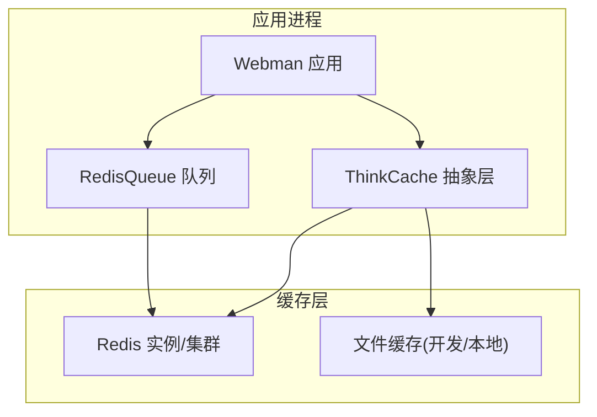
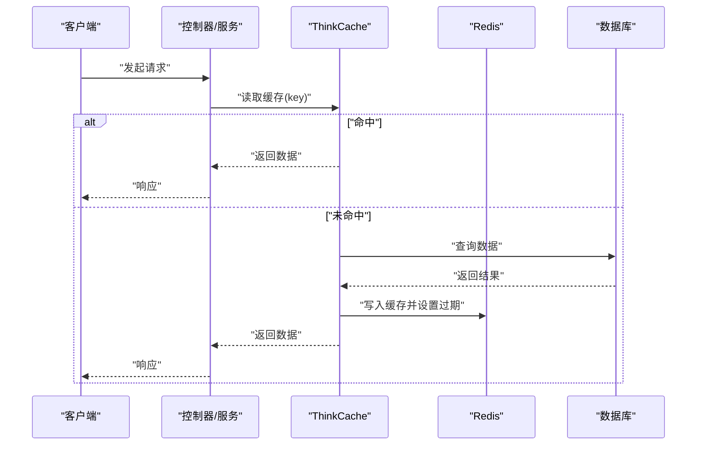
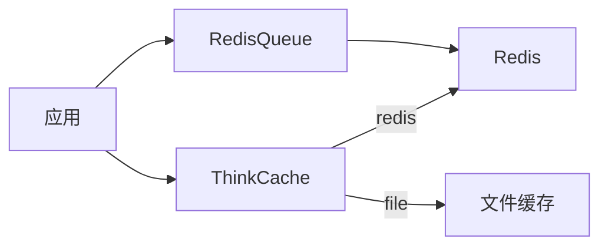

# 缓存优化

<cite>
**本文引用的文件**   
- [server/config/redis.php](file://server/config/redis.php)
- [server/config/think-cache.php](file://server/config/think-cache.php)
- [server/plugin/xbCode/config/cache.php](file://server/plugin/xbCode/config/cache.php)
- [server/plugin/webman/redis-queue/redis.php](file://server/config/plugin/webman/redis-queue/redis.php)
- [server/plugin/xbAiAsset/config/redis.php](file://server/plugin/xbAiAsset/config/redis.php)
- [server/plugin/xbAiModelAgent/config/redis.php](file://server/plugin/xbAiModelAgent/config/redis.php)
- [server/plugin/xbCdKey/config/redis.php](file://server/plugin/xbCdKey/config/redis.php)
- [server/plugin/xbUser/api/CaptchaApi.php](file://server/plugin/xbUser/api/CaptchaApi.php)
- [server/plugin/tinywan/jwt/app.php](file://server/config/plugin/tinywan/jwt/app.php)
</cite>

## 目录
1. [简介](#简介)
2. [项目结构](#项目结构)
3. [核心组件](#核心组件)
4. [架构总览](#架构总览)
5. [详细组件分析](#详细组件分析)
6. [依赖分析](#依赖分析)
7. [性能考虑](#性能考虑)
8. [故障排查指南](#故障排查指南)
9. [结论](#结论)
10. [附录](#附录)

## 简介
本文件面向积木云AI创作平台的后端缓存体系，聚焦Redis与ThinkCache的集成使用，给出可落地的缓存策略、键命名规范、过期时间设计、更新机制、多级缓存架构、预热方案、集群配置、内存与持久化调优，以及命中率监控与性能调优方法。文档同时结合仓库中现有配置与代码片段路径，确保建议与实现一致且可追溯。

## 项目结构
本项目采用多插件化架构，缓存相关配置分布在以下位置：
- 全局Redis连接池配置：server/config/redis.php
- ThinkCache驱动与存储配置：server/config/think-cache.php
- xbCode插件内ThinkCache配置（兼容不同驱动）：server/plugin/xbCode/config/cache.php
- Redis队列驱动配置：server/config/plugin/webman/redis-queue/redis.php
- 各业务插件独立Redis配置（如资产、模型代理、CDKey等）：plugin/*/config/redis.php
- 验证码缓存使用示例：server/plugin/xbUser/api/CaptchaApi.php
- JWT令牌缓存前缀与TTL：server/config/plugin/tinywan/jwt/app.php

图表来源
- [server/config/redis.php:1-17](file://server/config/redis.php#L1-L17)
- [server/config/think-cache.php:1-42](file://server/config/think-cache.php#L1-L42)
- [server/plugin/xbCode/config/cache.php:1-19](file://server/plugin/xbCode/config/cache.php#L1-L19)
- [server/config/plugin/webman/redis-queue/redis.php:1-20](file://server/config/plugin/webman/redis-queue/redis.php#L1-L20)

章节来源
- [server/config/redis.php:1-17](file://server/config/redis.php#L1-L17)
- [server/config/think-cache.php:1-42](file://server/config/think-cache.php#L1-L42)
- [server/plugin/xbCode/config/cache.php:1-19](file://server/plugin/xbCode/config/cache.php#L1-L19)
- [server/config/plugin/webman/redis-queue/redis.php:1-20](file://server/config/plugin/webman/redis-queue/redis.php#L1-L20)

## 核心组件
- Redis连接与连接池
  - 全局默认连接池参数定义在 server/config/redis.php，包含最大/最小连接数、等待超时、空闲回收与心跳间隔。
- ThinkCache统一缓存接口
  - server/config/think-cache.php 定义了默认驱动、stores（redis/file）、Redis前缀、tag前缀、tag_expire、连接池等。
- 插件级缓存配置
  - plugin/xbCode/config/cache.php 提供 file/redis/array 三种驱动选择，便于安装或测试环境切换。
- 队列与缓存
  - webman/redis-queue 通过 redis.php 读取环境变量构建连接，支持密码、库号与前缀。
- 业务侧缓存使用
  - 验证码生成与校验在 CaptchaApi.php 中使用 Cache::get/delete 操作键值对。
  - JWT插件配置了令牌缓存前缀与TTL，用于会话/刷新令牌缓存。

章节来源
- [server/config/redis.php:1-17](file://server/config/redis.php#L1-L17)
- [server/config/think-cache.php:1-42](file://server/config/think-cache.php#L1-L42)
- [server/plugin/xbCode/config/cache.php:1-19](file://server/plugin/xbCode/config/cache.php#L1-L19)
- [server/config/plugin/webman/redis-queue/redis.php:1-20](file://server/config/plugin/webman/redis-queue/redis.php#L1-L20)
- [server/plugin/xbUser/api/CaptchaApi.php:90-110](file://server/plugin/xbUser/api/CaptchaApi.php#L90-L110)
- [server/config/plugin/tinywan/jwt/app.php:15-17](file://server/config/plugin/tinywan/jwt/app.php#L15-L17)

## 架构总览
下图展示请求从控制器到缓存层的典型调用链，涵盖ThinkCache与Redis的连接与读写流程。

图表来源
- [server/config/think-cache.php:1-42](file://server/config/think-cache.php#L1-L42)
- [server/config/redis.php:1-17](file://server/config/redis.php#L1-L17)

## 详细组件分析

### 1) Redis连接与连接池
- 连接参数
  - host/port/database/password 通过环境变量注入，便于多环境部署。
- 连接池
  - max_connections/min_connections/wait_timeout/idle_timeout/heartbeat_interval 控制并发与资源回收，避免连接泄漏与长时间阻塞。
- 建议
  - 生产环境根据QPS与CPU核数调整max_connections；将idle_timeout设置为小于Redis服务端timeout，配合heartbeat_interval保持长连接健康。

章节来源
- [server/config/redis.php:1-17](file://server/config/redis.php#L1-L17)

### 2) ThinkCache驱动与存储
- 默认驱动
  - 可通过CACHE_TYPE环境变量切换为file或redis，便于开发与生产差异化管理。
- Redis存储
  - prefix/tag_prefix/tag_expire 控制键空间隔离与标签清理策略，避免大标签长期占用内存。
  - pool 子项与全局redis.php保持一致，确保连接池行为统一。
- 文件缓存
  - 适用于本地调试或无Redis场景，path指向runtime下的目录。

章节来源
- [server/config/think-cache.php:1-42](file://server/config/think-cache.php#L1-L42)

### 3) 插件级缓存配置（xbCode）
- 提供file/redis/array三种驱动，安装器可根据运行环境自动选择。
- 当选择redis时，connection指向默认连接，复用全局连接池。

章节来源
- [server/plugin/xbCode/config/cache.php:1-19](file://server/plugin/xbCode/config/cache.php#L1-L19)

### 4) 队列与缓存（RedisQueue）
- 通过环境变量构建redis://host:port，支持auth/db/prefix。
- 队列与业务缓存共享同一Redis实例时，需合理划分db或prefix，避免键冲突与相互影响。

章节来源
- [server/config/plugin/webman/redis-queue/redis.php:1-20](file://server/config/plugin/webman/redis-queue/redis.php#L1-L20)

### 5) 业务侧缓存使用示例
- 验证码
  - 使用固定前缀“captcha:”+随机key，获取后删除，防止重放。
- JWT令牌
  - 配置cache_token_ttl与两个前缀（TOKEN/REFRESH_TOKEN），用于短期令牌与刷新令牌的缓存管理。

章节来源
- [server/plugin/xbUser/api/CaptchaApi.php:90-110](file://server/plugin/xbUser/api/CaptchaApi.php#L90-L110)
- [server/config/plugin/tinywan/jwt/app.php:15-17](file://server/config/plugin/tinywan/jwt/app.php#L15-L17)

### 6) 缓存键命名规范
- 原则
  - 分层前缀：模块:子域:实体:标识[:维度]
  - 示例：user:profile:{id}、model:hot:{type}:{page}、captcha:{uuid}
- 隔离
  - 通过REDIS_PREFIX统一前缀，结合tag_prefix区分标签集合。
- 可读性与可观测性
  - 键名应能直接反映业务含义，便于监控与问题定位。

[本节为通用规范说明，不直接分析具体文件]

### 7) 过期时间策略
- 热点数据
  - 短TTL + 异步刷新，降低雪崩风险。
- 非热点数据
  - 较长TTL或永久缓存（配合tag_expire限制标签生命周期）。
- 标签键
  - tag_expire建议大于业务缓存TTL，避免标签提前失效导致批量重建。

章节来源
- [server/config/think-cache.php:1-42](file://server/config/think-cache.php#L1-L42)

### 8) 缓存更新机制
- 写扩散（推荐）
  - 更新数据后主动删除或覆盖对应缓存键，读时再回填。
- 读扩散
  - 仅在读取时计算并回填，适合低频变更数据。
- 一致性
  - 强一致场景可采用分布式锁或双删策略；最终一致场景接受短暂不一致。

[本节为通用策略说明，不直接分析具体文件]

### 9) 多级缓存架构设计
- 层级
  - L1：进程内静态数组/对象缓存（极热、不可跨进程共享）
  - L2：Redis（共享、高性能）
  - L3：数据库/对象存储（权威源）
- 适用场景
  - 字典表、枚举、热门素材索引、用户画像快照等。
- 失效传播
  - 基于消息队列或事件总线触发L1/L2失效，保证一致性。

[本节为通用架构说明，不直接分析具体文件]

### 10) 缓存预热策略
- 启动预热
  - 服务启动后按热点规则预加载关键数据至Redis与进程缓存。
- 增量预热
  - 基于访问日志或排行榜动态发现热点，定时增量预热。
- 灰度预热
  - 小流量验证后再全量预热，降低风险。

[本节为通用策略说明，不直接分析具体文件]

### 11) 缓存穿透、击穿、雪崩治理
- 穿透（不存在的数据被反复请求）
  - 布隆过滤器拦截非法键；空值短TTL缓存；限流降级。
- 击穿（热点键过期瞬间大量请求直达DB）
  - 互斥锁（分布式锁）只允许一个请求重建缓存；逻辑过期+后台异步刷新。
- 雪崩（大量键集中过期）
  - TTL加随机抖动；热点键永不过期+异步刷新；分片过期时间；熔断降级。

[本节为通用策略说明，不直接分析具体文件]

### 12) Redis集群配置
- 模式
  - 主从复制、哨兵高可用、Cluster分片。
- 连接
  - 使用多个节点地址列表；合理设置重试与超时；读写分离按需开启。
- 容量规划
  - 单实例内存上限、分片数量、副本数量与网络带宽匹配。

[本节为通用配置说明，不直接分析具体文件]

### 13) 内存优化与持久化
- 内存
  - 合理设置maxmemory与淘汰策略（allkeys-lru/allkeys-lfu等）；压缩大对象；避免大Hash/List。
- 持久化
  - AOF优先（fsync策略权衡吞吐与可靠性）；RDB作为冷备；定期备份。
- 监控
  - 关注used_memory、mem_fragmentation_ratio、evicted_keys、aof_last_rewrite_status等指标。

[本节为通用运维说明，不直接分析具体文件]

### 14) 缓存命中率监控与性能调优
- 指标
  - 命中率、延迟分布、错误率、连接池利用率、慢查询。
- 采集
  - 在ThinkCache封装层埋点，统计get/set/hits/misses/latency。
- 调优
  - 调整连接池大小、TTL分布、批量操作、序列化方式；热点键拆分；读写分离。

[本节为通用监控与调优说明，不直接分析具体文件]

## 依赖分析
- 组件耦合
  - ThinkCache作为抽象层，屏蔽底层驱动差异；RedisQueue与业务缓存共享Redis实例时需做好键空间隔离。
- 外部依赖
  - Redis实例/集群、环境变量注入、可选的文件缓存。
- 潜在风险
  - 多插件各自维护redis.php可能导致连接参数不一致；建议统一由全局配置接管并通过connection引用。

图表来源
- [server/config/think-cache.php:1-42](file://server/config/think-cache.php#L1-L42)
- [server/config/redis.php:1-17](file://server/config/redis.php#L1-L17)
- [server/config/plugin/webman/redis-queue/redis.php:1-20](file://server/config/plugin/webman/redis-queue/redis.php#L1-L20)

章节来源
- [server/config/think-cache.php:1-42](file://server/config/think-cache.php#L1-L42)
- [server/config/redis.php:1-17](file://server/config/redis.php#L1-L17)
- [server/config/plugin/webman/redis-queue/redis.php:1-20](file://server/config/plugin/webman/redis-queue/redis.php#L1-L20)

## 性能考虑
- 连接池
  - 根据并发与RT目标设定max_connections与wait_timeout，避免排队过长。
- 序列化
  - 使用紧凑格式（如JSON或MessagePack），减少网络与内存开销。
- 批量操作
  - 合并多次读写为pipeline或mget/mset，降低往返次数。
- 热点键
  - 单独分片或本地缓存，避免单键成为瓶颈。
- 超时与重试
  - 设置合理的socket/read/write超时，失败快速失败并走降级路径。

[本节为通用性能建议，不直接分析具体文件]

## 故障排查指南
- 常见问题
  - 连接失败：检查环境变量与网络连通性；确认端口/密码/DB号。
  - 命中率低：核对键命名与过期策略；观察是否频繁重建。
  - 内存飙升：检查大对象与未设置TTL的键；评估淘汰策略。
  - 队列积压：检查消费者消费能力与Redis队列长度。
- 定位手段
  - 查看ThinkCache埋点指标；抓取Redis慢日志；对比前后TTL与键分布。
- 回滚与降级
  - 临时切回文件缓存或内存缓存；关闭非必要缓存功能。

[本节为通用排障建议，不直接分析具体文件]

## 结论
通过统一的ThinkCache抽象层与规范的Redis连接池配置，结合完善的键命名、过期与更新策略，可有效提升系统吞吐与稳定性。在生产环境中，建议引入多级缓存、预热与完善的监控告警，持续优化命中率与延迟，保障AI创作平台在高并发场景下的用户体验。

[本节为总结性内容，不直接分析具体文件]

## 附录
- 环境变量清单（建议）
  - REDIS_HOST、REDIS_PORT、REDIS_PASSWORD、REDIS_DB、REDIS_PREFIX、CACHE_TYPE
- 参考配置路径
  - 全局Redis连接池：server/config/redis.php
  - ThinkCache驱动：server/config/think-cache.php
  - 插件缓存驱动：server/plugin/xbCode/config/cache.php
  - 队列Redis：server/config/plugin/webman/redis-queue/redis.php
  - 业务插件Redis：server/plugin/xbAiAsset/config/redis.php、server/plugin/xbAiModelAgent/config/redis.php、server/plugin/xbCdKey/config/redis.php
  - 验证码缓存使用：server/plugin/xbUser/api/CaptchaApi.php
  - JWT缓存前缀与TTL：server/config/plugin/tinywan/jwt/app.php

章节来源
- [server/config/redis.php:1-17](file://server/config/redis.php#L1-L17)
- [server/config/think-cache.php:1-42](file://server/config/think-cache.php#L1-L42)
- [server/plugin/xbCode/config/cache.php:1-19](file://server/plugin/xbCode/config/cache.php#L1-L19)
- [server/config/plugin/webman/redis-queue/redis.php:1-20](file://server/config/plugin/webman/redis-queue/redis.php#L1-L20)
- [server/plugin/xbAiAsset/config/redis.php:1-11](file://server/plugin/xbAiAsset/config/redis.php#L1-L11)
- [server/plugin/xbAiModelAgent/config/redis.php:1-11](file://server/plugin/xbAiModelAgent/config/redis.php#L1-L11)
- [server/plugin/xbCdKey/config/redis.php:1-11](file://server/plugin/xbCdKey/config/redis.php#L1-L11)
- [server/plugin/xbUser/api/CaptchaApi.php:90-110](file://server/plugin/xbUser/api/CaptchaApi.php#L90-L110)
- [server/config/plugin/tinywan/jwt/app.php:15-17](file://server/config/plugin/tinywan/jwt/app.php#L15-L17)