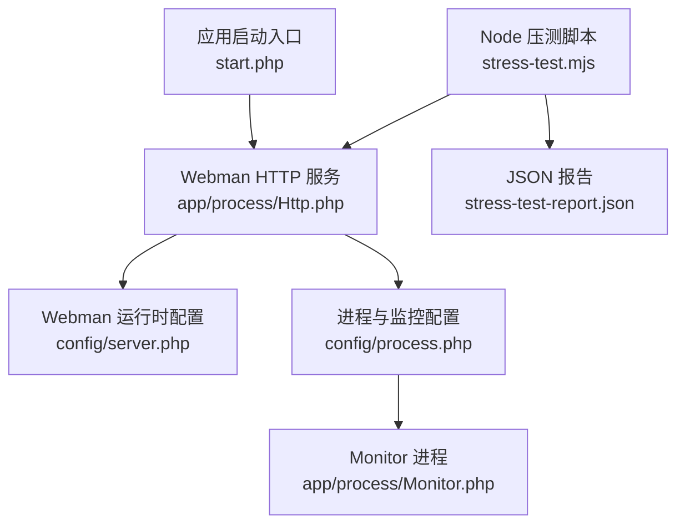
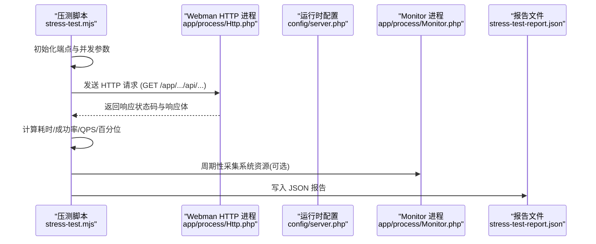
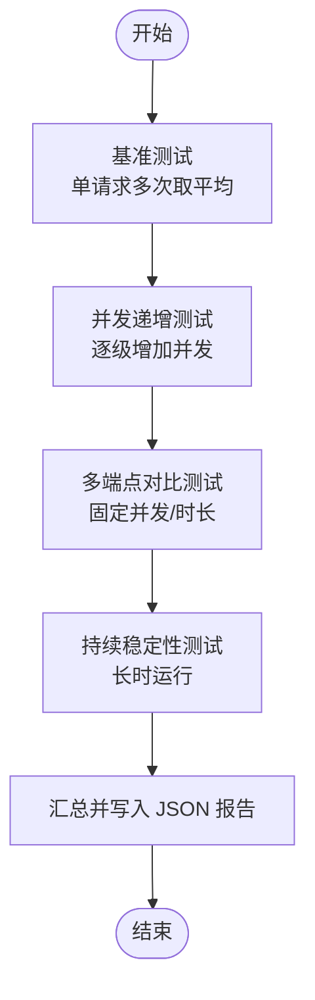
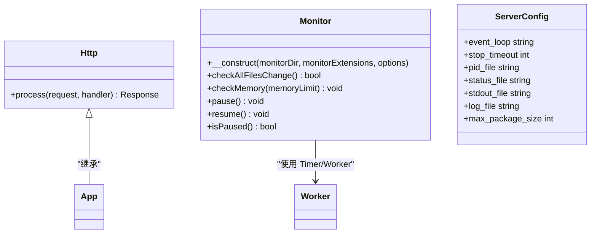
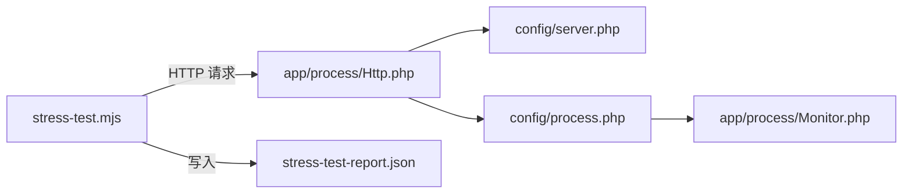

# 性能测试基础设施

<cite>
**本文引用的文件**
- [stress-test.mjs](file://server/stress-test.mjs)
- [stress-test-report.json](file://server/stress-test-report.json)
- [start.php](file://server/start.php)
- [config/server.php](file://server/config/server.php)
- [config/process.php](file://server/config/process.php)
- [app/process/Http.php](file://server/app/process/Http.php)
- [app/process/Monitor.php](file://server/app/process/Monitor.php)
</cite>

## 目录
1. [简介](#简介)
2. [项目结构](#项目结构)
3. [核心组件](#核心组件)
4. [架构总览](#架构总览)
5. [详细组件分析](#详细组件分析)
6. [依赖关系分析](#依赖关系分析)
7. [性能考量](#性能考量)
8. [故障排查指南](#故障排查指南)
9. [结论](#结论)
10. [附录](#附录)

## 简介
本仓库包含一套面向 Webman（基于 Workerman）后端服务的性能测试基础设施，主要提供：
- 基于 Node.js 的 HTTP 压力测试脚本，覆盖基准、并发递增、多端点对比与持续稳定性四类测试。
- 系统资源监控（进程 CPU、内存、系统 CPU、已用内存），并记录到 JSON 报告。
- 针对关键业务端点的代表性压测场景（配置读取、资产列表、市场列表、热门标签、帮助文章等）。

该基础设施便于在本地或 CI 环境中快速评估服务在不同并发下的吞吐、延迟分布与错误率，并输出结构化报告用于回归对比。

## 项目结构
与性能测试直接相关的核心文件位于 server 目录下：
- stress-test.mjs：Node.js 实现的压测主程序，定义端点、并发策略、统计指标与报告生成。
- stress-test-report.json：压测结果 JSON 报告，包含系统信息、各阶段测试结果与时间序列数据。
- start.php：Webman 应用启动入口。
- config/server.php：Webman 运行时配置（端口、日志、包大小等）。
- config/process.php：进程模型与热重载监控配置。
- app/process/Http.php：HTTP 工作进程类。
- app/process/Monitor.php：文件变更监听与内存监控逻辑。

图表来源
- [stress-test.mjs:1-120](file://server/stress-test.mjs#L1-L120)
- [app/process/Http.php:1-10](file://server/app/process/Http.php#L1-L10)
- [config/server.php:1-12](file://server/config/server.php#L1-L12)
- [config/process.php:1-43](file://server/config/process.php#L1-L43)
- [app/process/Monitor.php:1-120](file://server/app/process/Monitor.php#L1-L120)
- [start.php:1-6](file://server/start.php#L1-L6)

章节来源
- [stress-test.mjs:1-120](file://server/stress-test.mjs#L1-L120)
- [start.php:1-6](file://server/start.php#L1-L6)
- [config/server.php:1-12](file://server/config/server.php#L1-L12)
- [config/process.php:1-43](file://server/config/process.php#L1-L43)
- [app/process/Http.php:1-10](file://server/app/process/Http.php#L1-L10)
- [app/process/Monitor.php:1-120](file://server/app/process/Monitor.php#L1-L120)

## 核心组件
- 压测驱动与调度
  - 负责按阶段执行基准、并发递增、多端点对比与稳定性测试，汇总指标并写入 JSON 报告。
- 端点定义与分类
  - 将不同 API 按“无 DB 查询”“DB 分页查询”“DB 条件查询”等类别组织，便于横向对比。
- 并发与计时
  - 使用 Node.js http 模块发起请求，记录成功/失败、响应时长、QPS 历史与资源快照。
- 系统资源采集
  - 通过 PowerShell 命令获取目标进程 PID、CPU、WorkingSet64、线程数，以及系统 CPU 与内存使用情况。
- 报告输出
  - 输出控制台摘要，并将完整 JSON 报告持久化到 stress-test-report.json。

章节来源
- [stress-test.mjs:16-60](file://server/stress-test.mjs#L16-L60)
- [stress-test.mjs:106-161](file://server/stress-test.mjs#L106-L161)
- [stress-test.mjs:167-259](file://server/stress-test.mjs#L167-L259)
- [stress-test.mjs:265-312](file://server/stress-test.mjs#L265-L312)
- [stress-test.mjs:318-362](file://server/stress-test.mjs#L318-L362)
- [stress-test.mjs:368-389](file://server/stress-test.mjs#L368-L389)
- [stress-test.mjs:395-448](file://server/stress-test.mjs#L395-L448)
- [stress-test.mjs:454-524](file://server/stress-test.mjs#L454-L524)

## 架构总览
从调用链看，Node 压测脚本作为客户端向 Webman 服务发起 HTTP 请求；Webman 由 Http 进程承载，受 process.php 中的 Monitor 进程辅助进行热重载与内存监控；最终压测结果以 JSON 形式落盘。

图表来源
- [stress-test.mjs:106-161](file://server/stress-test.mjs#L106-L161)
- [app/process/Http.php:1-10](file://server/app/process/Http.php#L1-L10)
- [config/server.php:1-12](file://server/config/server.php#L1-L12)
- [app/process/Monitor.php:115-126](file://server/app/process/Monitor.php#L115-L126)
- [stress-test.mjs:454-524](file://server/stress-test.mjs#L454-L524)

## 详细组件分析

### 压测脚本（stress-test.mjs）
- 端点定义
  - 站点配置、资产列表、带筛选资产列表、市场列表、热门标签、帮助文章，分别标注查询类型，便于定位瓶颈。
- 并发递增测试
  - 逐步提升并发级别（如 10/50/100/200/500/1000），每级固定时长，自动停止阈值（错误率超过 20% 时提前终止）。
- 多端点对比
  - 在同一并发与时长下对多个端点逐一压测，比较 QPS、P95/P99 与错误率。
- 稳定性测试
  - 长时间稳定负载，记录每秒 QPS 趋势与资源变化，评估内存增长与服务退化情况。
- 指标与统计
  - 平均/最小/最大/百分位（P50/P90/P95/P99）、错误率、QPS、错误明细（超时/连接/HTTP）。
- 资源监控
  - 每 5 秒采集一次系统资源，包括进程 CPU、WorkingSet64、系统 CPU 与已用内存。
- 报告输出
  - 控制台打印阶段性摘要，并在末尾写入 JSON 报告文件。

图表来源
- [stress-test.mjs:265-312](file://server/stress-test.mjs#L265-L312)
- [stress-test.mjs:318-362](file://server/stress-test.mjs#L318-L362)
- [stress-test.mjs:368-389](file://server/stress-test.mjs#L368-L389)
- [stress-test.mjs:395-448](file://server/stress-test.mjs#L395-L448)
- [stress-test.mjs:454-524](file://server/stress-test.mjs#L454-L524)

章节来源
- [stress-test.mjs:16-60](file://server/stress-test.mjs#L16-L60)
- [stress-test.mjs:106-161](file://server/stress-test.mjs#L106-L161)
- [stress-test.mjs:167-259](file://server/stress-test.mjs#L167-L259)
- [stress-test.mjs:265-312](file://server/stress-test.mjs#L265-L312)
- [stress-test.mjs:318-362](file://server/stress-test.mjs#L318-L362)
- [stress-test.mjs:368-389](file://server/stress-test.mjs#L368-L389)
- [stress-test.mjs:395-448](file://server/stress-test.mjs#L395-L448)
- [stress-test.mjs:454-524](file://server/stress-test.mjs#L454-L524)

### Webman 服务进程（Http 与 Monitor）
- Http 进程
  - 继承 Webman\App，承载 HTTP 请求处理。
- Monitor 进程
  - 监听代码与配置变更，触发热重载；支持内存监控，当子进程内存超限时主动回收。
- 进程配置
  - 通过 process.php 注册 monitor 进程，指定监听目录与扩展名，控制是否启用文件与内存监控。

图表来源
- [app/process/Http.php:1-10](file://server/app/process/Http.php#L1-L10)
- [app/process/Monitor.php:96-126](file://server/app/process/Monitor.php#L96-L126)
- [config/process.php:17-42](file://server/config/process.php#L17-L42)
- [config/server.php:1-12](file://server/config/server.php#L1-L12)

章节来源
- [app/process/Http.php:1-10](file://server/app/process/Http.php#L1-L10)
- [app/process/Monitor.php:115-126](file://server/app/process/Monitor.php#L115-L126)
- [config/process.php:17-42](file://server/config/process.php#L17-L42)
- [config/server.php:1-12](file://server/config/server.php#L1-L12)

### 压测报告（stress-test-report.json）
- 结构概览
  - systemInfo：PHP 版本、框架、数据库、缓存、Session、CPU 核数、内存、PID 等。
  - baseline：各端点基准测试结果（平均/最小/最大耗时、响应大小）。
  - concurrencyRamp：并发递增阶段的逐级别结果（含 QPS 历史与资源历史）。
  - multiEndpoint：多端点对比结果（同并发/时长）。
  - stability：稳定性测试结果（含前/后 10 秒 QPS 均值对比与内存增长）。
- 典型指标
  - QPS、错误率、P50/P90/P95/P99、平均/最小/最大耗时、错误明细（超时/连接/HTTP）。
- 用途
  - 用于基线回归、容量规划与问题定位（例如高 P99 与超时占比上升）。

章节来源
- [stress-test-report.json:1-120](file://server/stress-test-report.json#L1-L120)
- [stress-test-report.json:120-360](file://server/stress-test-report.json#L120-L360)
- [stress-test-report.json:360-800](file://server/stress-test-report.json#L360-L800)

## 依赖关系分析
- 外部依赖
  - Node.js 标准库：http、perf_hooks、child_process、fs。
  - 操作系统工具：PowerShell（Windows 环境）用于采集系统资源。
- 内部依赖
  - Webman 服务进程（Http）与 Monitor 进程。
  - 配置文件：server.php（运行时）、process.php（进程模型）。
- 耦合与内聚
  - 压测脚本与具体业务端点解耦，通过 ENDPOINTS 配置集中管理，易于扩展新接口。
  - 资源采集与压测流程分离，便于替换为其他平台工具（Linux 可用 top/ps 替代 PowerShell）。

图表来源
- [stress-test.mjs:106-161](file://server/stress-test.mjs#L106-L161)
- [app/process/Http.php:1-10](file://server/app/process/Http.php#L1-L10)
- [config/server.php:1-12](file://server/config/server.php#L1-L12)
- [config/process.php:17-42](file://server/config/process.php#L17-L42)
- [app/process/Monitor.php:115-126](file://server/app/process/Monitor.php#L115-L126)

章节来源
- [stress-test.mjs:106-161](file://server/stress-test.mjs#L106-L161)
- [config/server.php:1-12](file://server/config/server.php#L1-L12)
- [config/process.php:17-42](file://server/config/process.php#L17-L42)
- [app/process/Monitor.php:115-126](file://server/app/process/Monitor.php#L115-L126)

## 性能考量
- 并发与队列
  - 当前脚本采用并发 workers 并行发请求，未实现令牌桶或滑动窗口限流，在高并发下可能产生突发流量导致服务端抖动。
- 超时与重试
  - 请求超时固定为 10 秒，建议根据端点 SLA 动态调整；可引入指数退避重试以提升鲁棒性。
- 指标粒度
  - QPS 按秒聚合，资源采样间隔为 5 秒；如需更细粒度，可降低采样周期。
- 数据库与连接池
  - 报告中记录了数据库连接池上限（ThinkORM max=5），在高并发下可能成为瓶颈，需结合慢查询与锁等待进一步分析。
- 平台差异
  - 资源采集依赖 PowerShell，跨平台需适配 Linux/macOS 工具链。

[本节为通用指导，不直接分析具体文件]

## 故障排查指南
- 常见错误类型
  - 超时：大量 p99 接近超时阈值，且错误明细中 timeout 占比较高，通常意味着后端处理过慢或数据库阻塞。
  - 连接错误：ECONNRESET/ECONNREFUSED/EPIPE 增多，多为服务端进程崩溃或端口占用不足。
  - HTTP 错误：非 200 状态码增多，需检查业务逻辑与鉴权中间件。
- 定位步骤
  - 查看 JSON 报告的 qpsHistory 与 resourceHistory，观察 QPS 骤降与系统 CPU/内存尖峰的时间点。
  - 核对 Webman 日志（stdout.log/workerman.log）与数据库慢查询日志。
  - 若出现内存持续增长，关注 Monitor 进程的内存监控阈值与子进程回收行为。
- 改进建议
  - 降低并发级别或增加服务端 worker 数量。
  - 优化热点 SQL、引入缓存层、减少大对象序列化。
  - 调整请求超时与重试策略，避免雪崩。

章节来源
- [stress-test.mjs:167-259](file://server/stress-test.mjs#L167-L259)
- [stress-test.mjs:395-448](file://server/stress-test.mjs#L395-L448)
- [app/process/Monitor.php:232-262](file://server/app/process/Monitor.php#L232-L262)

## 结论
该性能测试基础设施提供了端到端的压测能力，覆盖基准、并发递增、多端点对比与稳定性测试，并通过 JSON 报告沉淀关键指标与时间序列数据。配合 Webman 的进程模型与 Monitor 机制，可在开发/预生产环境快速发现性能瓶颈与回归问题。建议在后续迭代中增强限流、重试与跨平台资源采集能力，并结合数据库与缓存层的观测数据形成闭环优化。

[本节为总结性内容，不直接分析具体文件]

## 附录
- 运行方式
  - 确保 Webman 服务已在本地端口 39120 启动。
  - 在 server 目录执行 Node 压测脚本，完成后查看控制台输出与 stress-test-report.json。
- 扩展端点
  - 在 ENDPOINTS 中添加新的路径与方法，即可纳入基准与多端点对比测试。
- 平台适配
  - Windows 使用 PowerShell 采集资源；Linux/macOS 可替换为 top/ps 等命令。

[本节为补充说明，不直接分析具体文件]