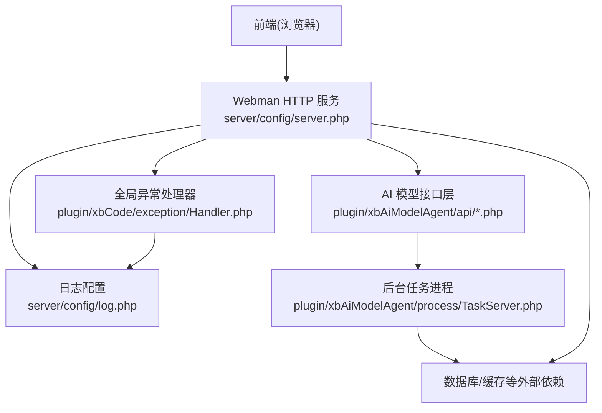
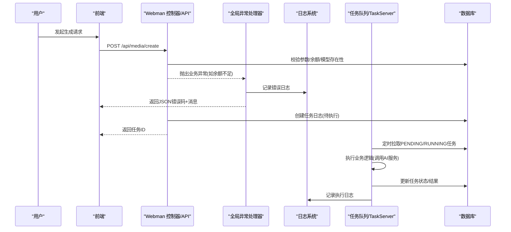
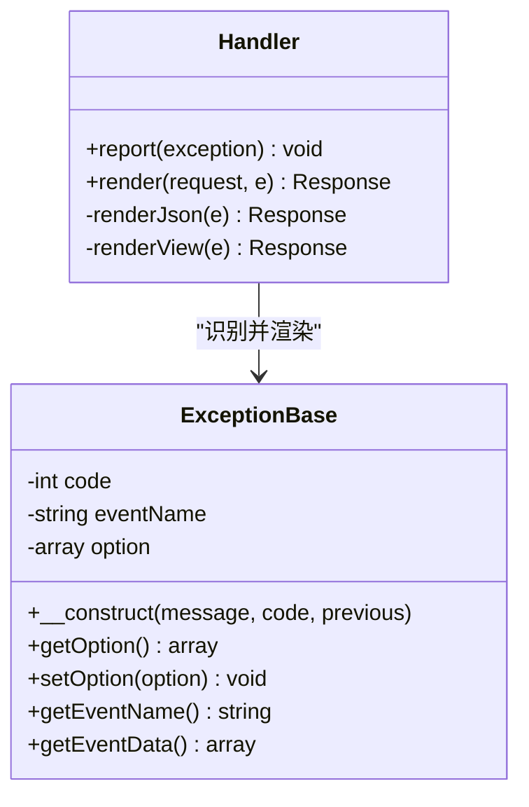
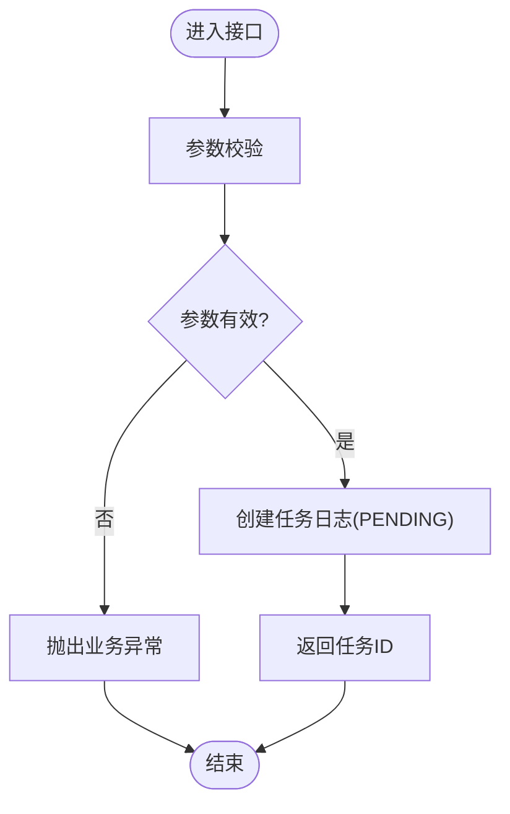
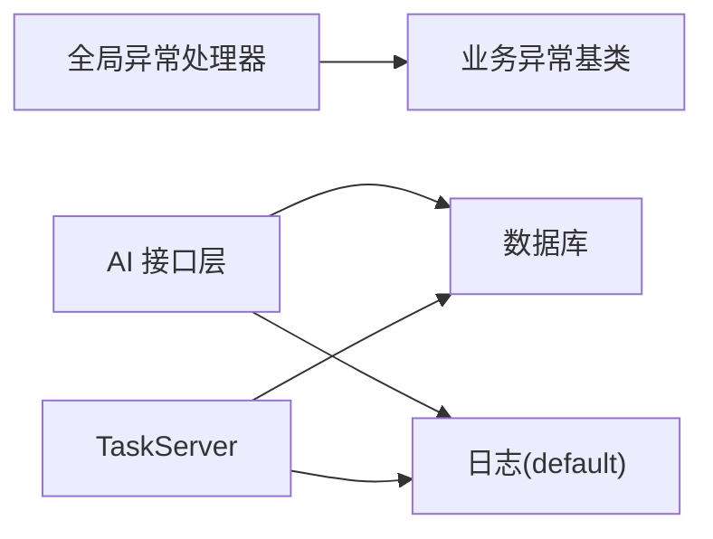

# 故障排查

<cite>
**本文引用的文件**   
- [server/config/log.php](file://server/config/log.php)
- [server/config/exception.php](file://server/config/exception.php)
- [server/plugin/xbCode/exception/Handler.php](file://server/plugin/xbCode/exception/Handler.php)
- [server/plugin/xbCode/exception/business/ExceptionBase.php](file://server/plugin/xbCode/exception/business/ExceptionBase.php)
- [server/plugin/xbAiModelAgent/api/ChatApi.php](file://server/plugin/xbAiModelAgent/api/ChatApi.php)
- [server/plugin/xbAiModelAgent/api/MediaApi.php](file://server/plugin/xbAiModelAgent/api/MediaApi.php)
- [server/plugin/xbAiModelAgent/api/TaskLogApi.php](file://server/plugin/xbAiModelAgent/api/TaskLogApi.php)
- [server/plugin/xbAiModelAgent/process/TaskServer.php](file://server/plugin/xbAiModelAgent/process/TaskServer.php)
- [server/plugin/xbCode/app/functions.php](file://server/plugin/xbCode/app/functions.php)
- [server/plugin/xbCode/base/BasePlugin.php](file://server/plugin/xbCode/base/BasePlugin.php)
- [server/plugin/xbCode/utils/DirUtil.php](file://server/plugin/xbCode/utils/DirUtil.php)
- [server/plugin/xbCode/utils/FrameUtil.php](file://server/plugin/xbCode/utils/FrameUtil.php)
</cite>

## 目录
1. [简介](#简介)
2. [项目结构](#项目结构)
3. [核心组件](#核心组件)
4. [架构总览](#架构总览)
5. [详细组件分析](#详细组件分析)
6. [依赖关系分析](#依赖关系分析)
7. [性能考量](#性能考量)
8. [故障排查指南](#故障排查指南)
9. [结论](#结论)
10. [附录](#附录)

## 简介
本指南面向积木云AI创作平台（前端 + Webman 插件化后端）的运维与研发人员，聚焦以下目标：
- 常见问题诊断方法与日志分析技巧
- 性能问题定位与安全漏洞检测
- 错误码对照与调试工具使用
- 线上应急处理与复盘流程
- 自动化故障检测与自愈机制实现方案

## 项目结构
本项目采用前后端分离、后端基于 Webman 的插件化架构。关键与排障相关的后端配置与异常处理集中在 server 目录下，AI 模型代理与任务调度位于 plugin/xbAiModelAgent，通用异常处理与日志输出在 plugin/xbCode 中提供基础能力。

图表来源
- [server/config/log.php:1-33](file://server/config/log.php#L1-L33)
- [server/plugin/xbCode/exception/Handler.php:1-142](file://server/plugin/xbCode/exception/Handler.php#L1-L142)
- [server/plugin/xbAiModelAgent/api/ChatApi.php:1-200](file://server/plugin/xbAiModelAgent/api/ChatApi.php#L1-L200)
- [server/plugin/xbAiModelAgent/process/TaskServer.php:120-180](file://server/plugin/xbAiModelAgent/process/TaskServer.php#L120-L180)

章节来源
- [server/config/log.php:1-33](file://server/config/log.php#L1-L33)
- [server/config/exception.php:1-17](file://server/config/exception.php#L1-L17)
- [server/plugin/xbCode/exception/Handler.php:1-142](file://server/plugin/xbCode/exception/Handler.php#L1-L142)

## 核心组件
- 全局异常处理：统一将业务异常、系统异常转换为 JSON 或视图响应，支持调试信息开关与事件数据透传。
- 日志系统：基于 Monolog 的文件轮转日志，默认输出到 runtime/logs/webman.log。
- AI 任务链路：HTTP 接口创建任务 -> 持久化任务日志 -> 后台 TaskServer 拉取并执行 -> 更新状态。
- 辅助日志输出：框架内多处通过 support\Log 写入 default 通道，便于集中检索。

章节来源
- [server/plugin/xbCode/exception/Handler.php:1-142](file://server/plugin/xbCode/exception/Handler.php#L1-L142)
- [server/config/log.php:1-33](file://server/config/log.php#L1-L33)
- [server/plugin/xbCode/app/functions.php:29-30](file://server/plugin/xbCode/app/functions.php#L29-L30)
- [server/plugin/xbCode/base/BasePlugin.php:180-290](file://server/plugin/xbCode/base/BasePlugin.php#L180-L290)
- [server/plugin/xbCode/utils/DirUtil.php:310-320](file://server/plugin/xbCode/utils/DirUtil.php#L310-L320)
- [server/plugin/xbCode/utils/FrameUtil.php:115-125](file://server/plugin/xbCode/utils/FrameUtil.php#L115-L125)

## 架构总览
下图展示一次“生成媒体”请求从前端到后端的完整路径，以及异常与日志落盘的关键节点。

图表来源
- [server/plugin/xbAiModelAgent/api/MediaApi.php:50-160](file://server/plugin/xbAiModelAgent/api/MediaApi.php#L50-L160)
- [server/plugin/xbAiModelAgent/api/TaskLogApi.php:60-150](file://server/plugin/xbAiModelAgent/api/TaskLogApi.php#L60-L150)
- [server/plugin/xbAiModelAgent/process/TaskServer.php:130-175](file://server/plugin/xbAiModelAgent/process/TaskServer.php#L130-L175)
- [server/plugin/xbCode/exception/Handler.php:62-114](file://server/plugin/xbCode/exception/Handler.php#L62-L114)
- [server/config/log.php:15-32](file://server/config/log.php#L15-L32)

## 详细组件分析

### 全局异常处理与错误码映射
- 统一入口：全局异常处理器根据请求类型返回 JSON 或 HTML 视图；对业务异常与自定义异常进行差异化处理。
- 调试模式：当开启调试时，可在 JSON 响应中附带文件、行号与堆栈，便于本地联调。
- 事件数据：业务异常可携带 eventName 与 eventData，便于上层告警与审计。

图表来源
- [server/plugin/xbCode/exception/business/ExceptionBase.php:1-109](file://server/plugin/xbCode/exception/business/ExceptionBase.php#L1-L109)
- [server/plugin/xbCode/exception/Handler.php:1-142](file://server/plugin/xbCode/exception/Handler.php#L1-L142)

章节来源
- [server/plugin/xbCode/exception/Handler.php:62-114](file://server/plugin/xbCode/exception/Handler.php#L62-L114)
- [server/plugin/xbCode/exception/business/ExceptionBase.php:45-108](file://server/plugin/xbCode/exception/business/ExceptionBase.php#L45-L108)

### AI 模型接口与任务日志
- ChatApi/MediaApi：负责参数校验、权限检查、业务规则判断（如余额），失败时抛出异常由全局处理器统一返回。
- TaskLogApi：提供任务日志的查询、状态更新、删除等能力，贯穿任务生命周期。
- TaskServer：后台进程周期性扫描 PENDING/RUNNING 任务，执行业务逻辑并回写状态。

图表来源
- [server/plugin/xbAiModelAgent/api/ChatApi.php:60-80](file://server/plugin/xbAiModelAgent/api/ChatApi.php#L60-L80)
- [server/plugin/xbAiModelAgent/api/MediaApi.php:50-160](file://server/plugin/xbAiModelAgent/api/MediaApi.php#L50-L160)
- [server/plugin/xbAiModelAgent/api/TaskLogApi.php:60-150](file://server/plugin/xbAiModelAgent/api/TaskLogApi.php#L60-L150)

章节来源
- [server/plugin/xbAiModelAgent/api/ChatApi.php:60-80](file://server/plugin/xbAiModelAgent/api/ChatApi.php#L60-L80)
- [server/plugin/xbAiModelAgent/api/MediaApi.php:50-160](file://server/plugin/xbAiModelAgent/api/MediaApi.php#L50-L160)
- [server/plugin/xbAiModelAgent/api/TaskLogApi.php:60-150](file://server/plugin/xbAiModelAgent/api/TaskLogApi.php#L60-L150)
- [server/plugin/xbAiModelAgent/process/TaskServer.php:130-175](file://server/plugin/xbAiModelAgent/process/TaskServer.php#L130-L175)

### 日志系统与输出点
- 默认日志通道：Monolog RotatingFileHandler，按天轮转，保留最近若干份。
- 常用输出点：插件安装/卸载、平滑启动、目录操作等场景均通过 support\Log 写入 default 通道。
- 建议：生产环境关闭调试，避免敏感信息泄露；结合日志聚合系统进行检索与告警。

章节来源
- [server/config/log.php:15-32](file://server/config/log.php#L15-L32)
- [server/plugin/xbCode/app/functions.php:29-30](file://server/plugin/xbCode/app/functions.php#L29-L30)
- [server/plugin/xbCode/base/BasePlugin.php:180-290](file://server/plugin/xbCode/base/BasePlugin.php#L180-L290)
- [server/plugin/xbCode/utils/DirUtil.php:310-320](file://server/plugin/xbCode/utils/DirUtil.php#L310-L320)
- [server/plugin/xbCode/utils/FrameUtil.php:115-125](file://server/plugin/xbCode/utils/FrameUtil.php#L115-L125)

## 依赖关系分析
- 异常处理依赖：全局处理器依赖业务异常基类以获取事件数据；同时依赖调试开关控制是否输出堆栈。
- 任务链路依赖：API 层依赖数据库写入任务日志；TaskServer 依赖数据库读取与更新任务状态。
- 日志依赖：所有模块统一通过 support\Log 写入 default 通道，便于集中采集。

图表来源
- [server/plugin/xbCode/exception/Handler.php:1-142](file://server/plugin/xbCode/exception/Handler.php#L1-L142)
- [server/plugin/xbCode/exception/business/ExceptionBase.php:1-109](file://server/plugin/xbCode/exception/business/ExceptionBase.php#L1-L109)
- [server/plugin/xbAiModelAgent/api/TaskLogApi.php:60-150](file://server/plugin/xbAiModelAgent/api/TaskLogApi.php#L60-L150)
- [server/plugin/xbAiModelAgent/process/TaskServer.php:130-175](file://server/plugin/xbAiModelAgent/process/TaskServer.php#L130-L175)

章节来源
- [server/plugin/xbCode/exception/Handler.php:1-142](file://server/plugin/xbCode/exception/Handler.php#L1-L142)
- [server/plugin/xbCode/exception/business/ExceptionBase.php:1-109](file://server/plugin/xbCode/exception/business/ExceptionBase.php#L1-L109)
- [server/plugin/xbAiModelAgent/api/TaskLogApi.php:60-150](file://server/plugin/xbAiModelAgent/api/TaskLogApi.php#L60-L150)
- [server/plugin/xbAiModelAgent/process/TaskServer.php:130-175](file://server/plugin/xbAiModelAgent/process/TaskServer.php#L130-L175)

## 性能考量
- 日志级别与轮转：生产环境建议仅输出 WARNING/ERROR，避免 DEBUG 造成磁盘压力；合理设置轮转数量与大小。
- 任务并发：TaskServer 拉取与执行需考虑并发度与幂等性，避免重复执行与资源争用。
- 数据库访问：批量更新与分页查询应加索引，减少慢查询；长事务尽量拆分。
- 外部依赖：AI 服务调用需增加超时与重试策略，避免雪崩。

[本节为通用指导，不直接分析具体文件]

## 故障排查指南

### 一、常见问题与定位方法
- 接口返回 JSON 错误
  - 现象：前端收到 code/message，可能包含 debug 字段（含 file/line/trace）。
  - 定位：查看全局异常处理器渲染逻辑与调试开关；结合日志 default 通道检索对应时间段的错误堆栈。
  - 参考：
    - [server/plugin/xbCode/exception/Handler.php:62-114](file://server/plugin/xbCode/exception/Handler.php#L62-L114)
    - [server/config/log.php:15-32](file://server/config/log.php#L15-L32)

- 任务未执行或卡住
  - 现象：任务状态长期停留在 PENDING/RUNNING。
  - 定位：检查 TaskServer 进程是否运行；查看数据库任务表状态与更新时间；核对日志中的拉取与更新记录。
  - 参考：
    - [server/plugin/xbAiModelAgent/process/TaskServer.php:130-175](file://server/plugin/xbAiModelAgent/process/TaskServer.php#L130-L175)
    - [server/plugin/xbAiModelAgent/api/TaskLogApi.php:60-150](file://server/plugin/xbAiModelAgent/api/TaskLogApi.php#L60-L150)

- 余额不足/模型不存在/参数错误
  - 现象：立即返回错误，无任务创建。
  - 定位：检查接口参数校验与业务规则分支；确认日志中抛出的业务异常信息。
  - 参考：
    - [server/plugin/xbAiModelAgent/api/ChatApi.php:60-80](file://server/plugin/xbAiModelAgent/api/ChatApi.php#L60-L80)
    - [server/plugin/xbAiModelAgent/api/MediaApi.php:50-160](file://server/plugin/xbAiModelAgent/api/MediaApi.php#L50-L160)

- 插件安装/更新/卸载失败
  - 现象：控制台或页面提示失败。
  - 定位：查看 default 日志通道中的安装/更新/卸载错误信息；必要时开启调试模式复现。
  - 参考：
    - [server/plugin/xbCode/base/BasePlugin.php:180-290](file://server/plugin/xbCode/base/BasePlugin.php#L180-L290)

- 目录操作/平滑启动失败
  - 现象：文件系统相关错误或重启失败。
  - 定位：检查 DirUtil/FrameUtil 的错误日志输出；确认权限与磁盘空间。
  - 参考：
    - [server/plugin/xbCode/utils/DirUtil.php:310-320](file://server/plugin/xbCode/utils/DirUtil.php#L310-L320)
    - [server/plugin/xbCode/utils/FrameUtil.php:115-125](file://server/plugin/xbCode/utils/FrameUtil.php#L115-L125)

### 二、日志分析技巧
- 定位关键字段
  - 时间戳、请求ID（如有）、错误码、消息、文件与行号、堆栈。
- 过滤策略
  - 按时间段、错误级别（WARNING/ERROR）、模块名（如 xbAiModelAgent、xbCode）筛选。
- 关联分析
  - 将接口错误日志与任务日志、数据库变更日志串联，还原调用链。
- 参考位置
  - [server/config/log.php:15-32](file://server/config/log.php#L15-L32)
  - [server/plugin/xbCode/app/functions.php:29-30](file://server/plugin/xbCode/app/functions.php#L29-L30)

### 三、错误码对照表（示例）
说明：以下为常见业务错误码与含义，实际以各接口抛出的异常为准。
- 40001：参数缺失或格式错误（如模型ID为空、消息列表为空）
- 40002：模型不存在
- 40003：余额不足
- 40004：任务日志不存在
- 40005：更新任务状态失败
- 40006：删除任务日志失败
- 40007：批量删除失败
- 40008：用户未登录/鉴权失败
- 500xx：系统内部错误（由全局异常处理器返回）

章节来源
- [server/plugin/xbAiModelAgent/api/ChatApi.php:60-80](file://server/plugin/xbAiModelAgent/api/ChatApi.php#L60-L80)
- [server/plugin/xbAiModelAgent/api/MediaApi.php:50-160](file://server/plugin/xbAiModelAgent/api/MediaApi.php#L50-L160)
- [server/plugin/xbAiModelAgent/api/TaskLogApi.php:60-150](file://server/plugin/xbAiModelAgent/api/TaskLogApi.php#L60-L150)
- [server/plugin/xbCode/exception/Handler.php:62-114](file://server/plugin/xbCode/exception/Handler.php#L62-L114)

### 四、调试工具使用
- 启用调试模式
  - 在全局异常处理器中，当调试开启时，JSON 响应会包含 file/line/trace，便于快速定位。
  - 参考：[server/plugin/xbCode/exception/Handler.php:106-114](file://server/plugin/xbCode/exception/Handler.php#L106-L114)
- 日志通道
  - 使用 support\Log::channel('default') 输出结构化日志，便于检索。
  - 参考：[server/plugin/xbCode/app/functions.php:29-30](file://server/plugin/xbCode/app/functions.php#L29-L30)
- 监控进程
  - 检查 TaskServer 进程状态与日志输出，确保任务被正常拉取与执行。
  - 参考：[server/plugin/xbAiModelAgent/process/TaskServer.php:130-175](file://server/plugin/xbAiModelAgent/process/TaskServer.php#L130-L175)

### 五、线上应急处理
- 快速止血
  - 关闭调试模式，避免敏感信息泄露。
  - 临时降级：暂停非核心功能（如批量任务），优先保障主流程。
- 恢复步骤
  - 重启异常进程（如 TaskServer）。
  - 清理积压任务：将长时间 RUNNING 的任务重置为 PENDING 或 FAILED，并记录原因。
  - 扩容与限流：针对高负载接口增加实例或限流保护。
- 验证与回归
  - 使用最小数据集验证关键路径；观察日志与指标恢复正常。

[本节为通用指导，不直接分析具体文件]

### 六、问题复盘流程
- 收集证据
  - 错误日志、请求上下文、任务日志、数据库快照（脱敏）。
- 根因分析
  - 使用 5Whys 或鱼骨图定位根本原因；区分代码缺陷、配置错误、外部依赖异常。
- 改进措施
  - 补充单元测试与集成测试；完善错误码与日志规范；增加熔断与重试策略。
- 跟踪闭环
  - 制定修复计划与上线窗口；灰度发布与回滚预案；复盘报告归档。

[本节为通用指导，不直接分析具体文件]

### 七、自动化故障检测与自愈机制
- 健康检查
  - 对 TaskServer 进程、数据库连接、外部服务可用性进行定期探测。
- 自动告警
  - 基于日志关键词（如“失败”“异常”“余额不足”）与错误率阈值触发告警。
- 自愈策略
  - 进程崩溃自动拉起；任务堆积超过阈值自动扩容消费者；外部依赖不可用时自动降级。
- 观测体系
  - 指标：QPS、延迟、错误率、任务积压数、CPU/内存/磁盘。
  - 日志：统一格式、结构化字段、关联 ID。
  - 追踪：跨服务调用链路追踪，端到端可视化。

[本节为通用指导，不直接分析具体文件]

## 结论
通过统一异常处理、标准化日志输出与清晰的任务链路，积木云AI创作平台具备完善的故障定位与恢复能力。建议在生产环境强化监控与告警，完善错误码与日志规范，并结合自动化检测与自愈策略提升系统韧性。

## 附录
- 日志文件路径：runtime/logs/webman.log（默认）
- 调试开关：全局异常处理器中根据配置决定是否输出堆栈
- 任务状态：PENDING/RUNNING/SUCCESS/FAILED（以数据库为准）

[本节为通用信息，不直接分析具体文件]