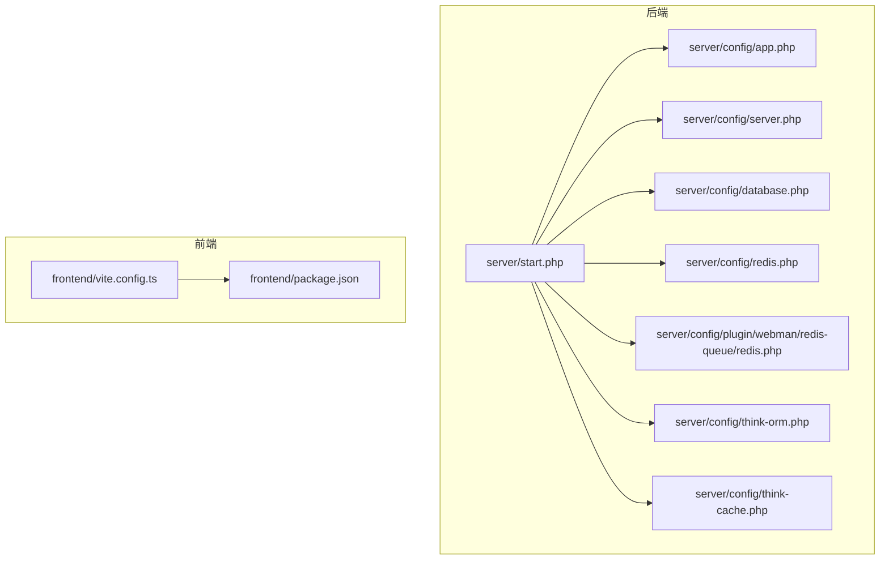
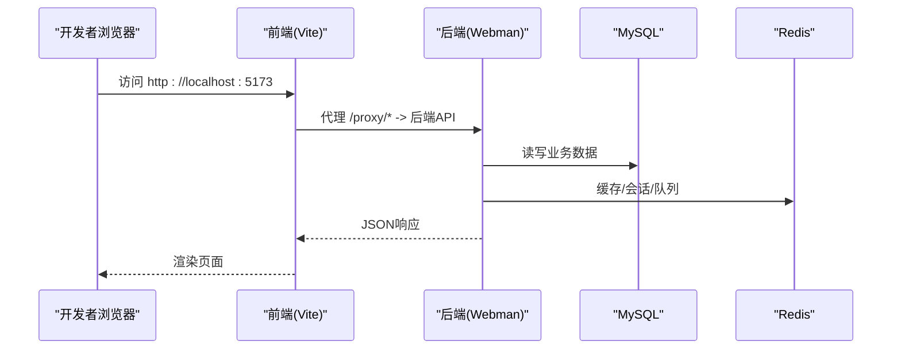
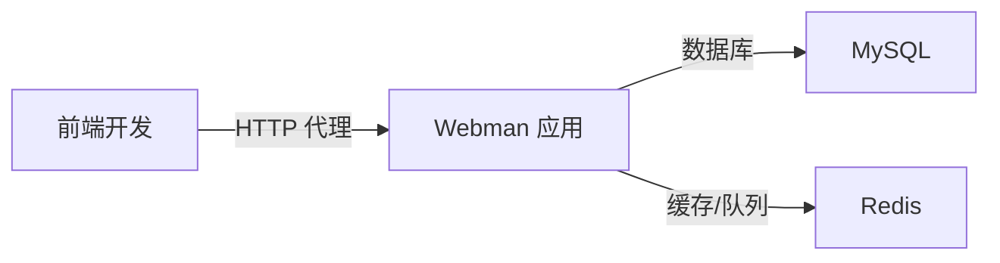

# 环境配置

<cite>
**本文引用的文件**   
- [server/start.php](file://server/start.php)
- [server/config/app.php](file://server/config/app.php)
- [server/config/server.php](file://server/config/server.php)
- [server/config/database.php](file://server/config/database.php)
- [server/config/redis.php](file://server/config/redis.php)
- [server/config/plugin/webman/redis-queue/redis.php](file://server/config/plugin/webman/redis-queue/redis.php)
- [server/config/think-cache.php](file://server/config/think-cache.php)
- [server/config/think-orm.php](file://server/config/think-orm.php)
- [frontend/vite.config.ts](file://frontend/vite.config.ts)
- [frontend/package.json](file://frontend/package.json)
</cite>

## 目录
1. [简介](#简介)
2. [项目结构](#项目结构)
3. [核心组件](#核心组件)
4. [架构总览](#架构总览)
5. [详细组件分析](#详细组件分析)
6. [依赖分析](#依赖分析)
7. [性能考虑](#性能考虑)
8. [故障排查指南](#故障排查指南)
9. [结论](#结论)
10. [附录](#附录)

## 简介
本文件为“积木云AI创作平台”的环境配置文档，覆盖开发环境与生产环境的系统要求、依赖安装（PHP 8.1+、MySQL、Redis、Node.js）、配置文件参数详解与环境变量设置。重点包含数据库连接配置、Redis缓存与队列配置、服务器端口配置以及前端构建与代理配置，并提供不同操作系统下的搭建步骤与常见问题解决方案。

## 项目结构
本项目采用前后端分离：
- 后端基于 Webman（Swoole/Swow 驱动），入口脚本位于 server/start.php，运行时配置集中于 server/config 目录。
- 前端基于 Vite + Vue3，构建与开发代理配置位于 frontend/vite.config.ts，包管理与脚本定义位于 frontend/package.json。

**图示来源** 
- [server/start.php:1-6](file://server/start.php#L1-L6)
- [server/config/app.php:1-13](file://server/config/app.php#L1-L13)
- [server/config/server.php:1-12](file://server/config/server.php#L1-L12)
- [server/config/database.php:1-35](file://server/config/database.php#L1-L35)
- [server/config/redis.php:1-17](file://server/config/redis.php#L1-L17)
- [server/config/plugin/webman/redis-queue/redis.php:1-28](file://server/config/plugin/webman/redis-queue/redis.php#L1-L28)
- [server/config/think-orm.php:1-40](file://server/config/think-orm.php#L1-L40)
- [server/config/think-cache.php:1-30](file://server/config/think-cache.php#L1-L30)
- [frontend/vite.config.ts:1-32](file://frontend/vite.config.ts#L1-L32)
- [frontend/package.json:1-35](file://frontend/package.json#L1-L35)

**章节来源**
- [server/start.php:1-6](file://server/start.php#L1-L6)
- [frontend/vite.config.ts:1-32](file://frontend/vite.config.ts#L1-L32)
- [frontend/package.json:1-35](file://frontend/package.json#L1-L35)

## 核心组件
- 应用运行入口：加载自动加载器并启动应用进程。
- 应用基础配置：调试开关、时区、公共目录、运行时目录等。
- 服务器进程配置：事件循环、PID/状态/日志文件路径、最大包体大小等。
- 数据库连接：MySQL 驱动、连接池参数、字符集与表前缀等。
- Redis 缓存：主机、端口、密码、库号及连接池参数。
- Redis 队列：连接地址、认证、重试策略等。
- ThinkORM/ThinkCache：兼容层配置，读取相同环境变量。
- 前端构建与代理：Vite 插件、别名、开发代理、构建脚本。

**章节来源**
- [server/start.php:1-6](file://server/start.php#L1-L6)
- [server/config/app.php:1-13](file://server/config/app.php#L1-L13)
- [server/config/server.php:1-12](file://server/config/server.php#L1-L12)
- [server/config/database.php:1-35](file://server/config/database.php#L1-L35)
- [server/config/redis.php:1-17](file://server/config/redis.php#L1-L17)
- [server/config/plugin/webman/redis-queue/redis.php:1-28](file://server/config/plugin/webman/redis-queue/redis.php#L1-L28)
- [server/config/think-orm.php:1-40](file://server/config/think-orm.php#L1-L40)
- [server/config/think-cache.php:1-30](file://server/config/think-cache.php#L1-L30)
- [frontend/vite.config.ts:1-32](file://frontend/vite.config.ts#L1-L32)
- [frontend/package.json:1-35](file://frontend/package.json#L1-L35)

## 架构总览
下图展示了后端服务启动、配置加载与外部依赖（MySQL、Redis）的交互关系，以及前端开发代理如何转发请求到后端。

**图示来源** 
- [frontend/vite.config.ts:19-30](file://frontend/vite.config.ts#L19-L30)
- [server/start.php:1-6](file://server/start.php#L1-L6)
- [server/config/database.php:1-35](file://server/config/database.php#L1-L35)
- [server/config/redis.php:1-17](file://server/config/redis.php#L1-L17)
- [server/config/plugin/webman/redis-queue/redis.php:1-28](file://server/config/plugin/webman/redis-queue/redis.php#L1-L28)

## 详细组件分析

### 后端运行与进程模型
- 启动流程：执行入口脚本，加载 Composer 自动加载器，调用框架应用启动方法。
- 进程与日志：PID、状态、标准输出与工作进程日志均写入 runtime 目录；可配置最大包体大小。
- 事件循环：通过配置项指定事件循环类型（留空表示使用默认）。

建议
- 生产环境务必开启进程守护（systemd/supervisor）并合理设置 stop_timeout。
- 调整 max_package_size 以适配大文件上传或流式传输场景。

**章节来源**
- [server/start.php:1-6](file://server/start.php#L1-L6)
- [server/config/server.php:1-12](file://server/config/server.php#L1-L12)

### 应用基础配置
- 调试模式：APP_DEBUG 控制是否开启调试与详细错误信息。
- 时区：默认 Asia/Shanghai。
- 路径：public 与 runtime 目录位置由 base_path/runtime_path 决定。
- 控制器后缀与复用：controller_suffix 与 controller_reuse 影响路由解析与对象复用策略。

**章节来源**
- [server/config/app.php:1-13](file://server/config/app.php#L1-L13)

### 数据库连接配置（MySQL）
关键参数
- 驱动与默认连接名：mysql
- 连接参数：host、port、database、username、password、charset、collation、prefix
- 严格模式：strict
- 引擎：engine（可为空）
- PDO 选项：关闭模拟预处理（在协程环境下必须）
- 连接池：max/min_connections、wait_timeout、idle_timeout、heartbeat_interval

注意事项
- 字符集建议使用 utf8mb4，排序规则 utf8mb4_general_ci。
- 表前缀可通过 DB_PREFIX 统一设置。
- 连接池参数仅在协程环境生效，需根据并发与资源调优。

**章节来源**
- [server/config/database.php:1-35](file://server/config/database.php#L1-L35)

### Redis 缓存配置
通用缓存
- host、password、port、database
- 连接池：max/min_connections、wait_timeout、idle_timeout、heartbeat_interval

说明
- 该配置用于常规缓存与部分中间件。
- 若使用独立队列组件，请同时参考队列配置。

**章节来源**
- [server/config/redis.php:1-17](file://server/config/redis.php#L1-L17)

### Redis 队列配置（webman redis-queue）
关键参数
- 连接地址：redis://{host}:{port}
- 认证：auth
- 库号：db
- 键前缀：prefix
- 消费失败重试：max_attempts、retry_seconds

说明
- 队列与缓存可共用同一 Redis 实例，但建议通过 db/prefix 隔离命名空间。
- 重试次数与间隔应根据任务幂等性与业务容忍度设置。

**章节来源**
- [server/config/plugin/webman/redis-queue/redis.php:1-28](file://server/config/plugin/webman/redis-queue/redis.php#L1-L28)

### ThinkORM 与 ThinkCache 兼容配置
- ThinkORM：读取 DB_HOST、DB_NAME、DB_USER、DB_PASS、DB_PORT 等环境变量，支持 APP_DEBUG 控制 SQL 触发。
- ThinkCache：读取 REDIS_HOST、REDIS_PORT、REDIS_PASSWORD 等环境变量。

说明
- 当项目中存在基于 Think 生态的组件时，确保这些环境变量与主配置一致。

**章节来源**
- [server/config/think-orm.php:1-40](file://server/config/think-orm.php#L1-L40)
- [server/config/think-cache.php:1-30](file://server/config/think-cache.php#L1-L30)

### 前端构建与代理配置
- 构建工具：Vite + Vue3 + TypeScript
- 插件：Vue 插件、自动导入（vue/vue-router/pinia）
- 别名：@ 指向 src
- 开发代理：将 /proxy 前缀的请求转发至 http://127.0.0.1:39120，并去除前缀
- 构建脚本：dev/build/preview 等

注意
- 开发时确保后端监听 39120 端口，或修改代理 target 与实际后端端口一致。
- 生产构建产物位于 dist，部署时需由 Nginx/Apache 提供静态资源。

**章节来源**
- [frontend/vite.config.ts:1-32](file://frontend/vite.config.ts#L1-L32)
- [frontend/package.json:1-35](file://frontend/package.json#L1-L35)

## 依赖分析
- PHP 扩展：PDO MySQL、Redis、Swoole/Swow（取决于 event_loop 选择）、JSON、MBString、OpenSSL、PCRE、Zip 等。
- Node.js：用于前端开发与构建。
- 外部服务：MySQL、Redis。

[此图为概念性依赖图，无需图示来源]

## 性能考虑
- 数据库连接池：根据并发量调整 max/min_connections 与心跳检测间隔，避免频繁创建/销毁连接。
- Redis 连接池：合理设置 idle_timeout 与 heartbeat_interval，降低长连接空闲占用。
- 队列重试：max_attempts 与 retry_seconds 需结合任务幂等性与消费者处理能力评估。
- 前端代理：开发阶段仅用于本地联调，生产应通过反向代理（Nginx）进行跨域与压缩优化。

[本节为通用指导，不直接分析具体文件]

## 故障排查指南
- 无法连接数据库
  - 检查 DB_HOST、DB_PORT、DB_NAME、DB_USER、DB_PASS 是否正确。
  - 确认防火墙与安全组放行 3306 端口。
  - 查看 runtime/logs 下工作进程日志定位连接异常。
- Redis 连接失败
  - 核对 REDIS_HOST、REDIS_PORT、REDIS_DB、REDIS_PASSWORD。
  - 若启用密码，确保 auth 配置一致；队列与缓存建议使用不同 db/prefix 隔离。
- 队列无消费
  - 确认 webman redis-queue 已启用且 Redis 可达。
  - 检查 max_attempts 与 retry_seconds 是否过小导致快速失败。
- 前端代理 404/超时
  - 确认后端实际监听端口与 vite.config.ts 中 proxy.target 一致。
  - 检查 rewrite 规则是否按预期移除 /proxy 前缀。
- 调试模式
  - 开启 APP_DEBUG 可获得更详细的错误栈与 SQL 日志（生产环境谨慎开启）。

**章节来源**
- [server/config/app.php:1-13](file://server/config/app.php#L1-L13)
- [server/config/database.php:1-35](file://server/config/database.php#L1-L35)
- [server/config/redis.php:1-17](file://server/config/redis.php#L1-L17)
- [server/config/plugin/webman/redis-queue/redis.php:1-28](file://server/config/plugin/webman/redis-queue/redis.php#L1-L28)
- [frontend/vite.config.ts:19-30](file://frontend/vite.config.ts#L19-L30)

## 结论
通过统一的配置文件与环境变量，本项目在后端（数据库、缓存、队列、进程）与前端（构建、代理）层面实现了清晰的环境管理。建议在开发环境保持高可观测性（开启调试、完善日志），在生产环境强化安全与稳定性（严格权限、连接池与重试策略调优、反向代理与静态资源托管）。

[本节为总结性内容，不直接分析具体文件]

## 附录

### 环境变量清单与说明
- 应用
  - APP_DEBUG：布尔值，是否开启调试模式
- 数据库
  - DB_HOST：MySQL 主机地址
  - DB_PORT：MySQL 端口
  - DB_NAME：数据库名
  - DB_USER：用户名
  - DB_PASS：密码
  - DB_CHARSET：字符集（推荐 utf8mb4）
  - DB_PREFIX：表前缀
- Redis
  - REDIS_HOST：Redis 主机
  - REDIS_PORT：Redis 端口
  - REDIS_DB：库号
  - REDIS_PASSWORD：密码
  - REDIS_PREFIX：键前缀（队列）
- Think 兼容
  - 同上，ThinkORM/ThinkCache 同样读取上述变量

**章节来源**
- [server/config/app.php:1-13](file://server/config/app.php#L1-L13)
- [server/config/database.php:1-35](file://server/config/database.php#L1-L35)
- [server/config/redis.php:1-17](file://server/config/redis.php#L1-L17)
- [server/config/plugin/webman/redis-queue/redis.php:1-28](file://server/config/plugin/webman/redis-queue/redis.php#L1-L28)
- [server/config/think-orm.php:1-40](file://server/config/think-orm.php#L1-L40)
- [server/config/think-cache.php:1-30](file://server/config/think-cache.php#L1-L30)

### 服务器端口与路径
- 后端监听端口：由 Webman 进程配置决定（通常由启动命令或容器编排指定）
- 前端开发服务器：默认 5173（Vite 默认）
- 后端 API 代理目标：http://127.0.0.1:39120（可在 vite.config.ts 中修改）
- 运行时目录：runtime（含 PID、状态、日志等）

**章节来源**
- [frontend/vite.config.ts:19-30](file://frontend/vite.config.ts#L19-L30)
- [server/config/server.php:1-12](file://server/config/server.php#L1-L12)

### 不同操作系统下的环境搭建步骤

- Windows
  - 安装 PHP 8.1+，启用 PDO MySQL、Redis、Swoole/Swow 扩展
  - 安装 MySQL 与 Redis 服务
  - 安装 Node.js（LTS）
  - 进入 server 目录，安装 PHP 依赖（composer install）
  - 进入 frontend 目录，安装前端依赖（pnpm install）
  - 配置 .env 环境变量（或使用系统级环境变量）
  - 启动后端：php start.php
  - 启动前端：pnpm dev，并在浏览器访问 http://localhost:5173

- Linux/macOS
  - 安装 PHP 8.1+ 及相关扩展（pdo_mysql、redis、swoole/swow）
  - 安装 MySQL 与 Redis，并确保服务自启
  - 安装 Node.js（LTS）
  - 进入 server 目录，执行 composer install
  - 进入 frontend 目录，执行 pnpm install
  - 配置环境变量后，启动后端：php start.php
  - 启动前端：pnpm dev，访问 http://localhost:5173

- Docker（可选）
  - 使用官方 PHP 镜像并安装所需扩展
  - 使用 mysql 与 redis 官方镜像作为依赖服务
  - 将 server 与 frontend 目录挂载到容器内，分别执行依赖安装与启动命令

[本节为通用指导，不直接分析具体文件]

### 常见问题与解决
- 端口冲突
  - 若 39120 被占用，修改 vite.config.ts 中的代理 target 或释放端口。
- 跨域问题
  - 开发阶段通过 Vite 代理解决；生产环境由反向代理统一域名与协议。
- 大文件上传失败
  - 调整 server.php 的 max_package_size 与 PHP 相关上传限制。
- 队列堆积
  - 增加消费者数量，调整 max_attempts 与 retry_seconds，监控 Redis 内存与连接数。

[本节为通用指导，不直接分析具体文件]