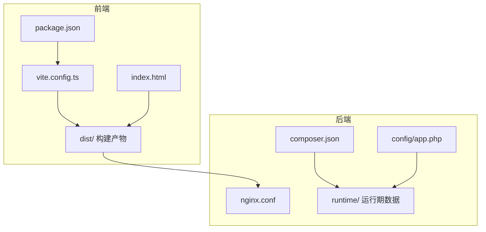
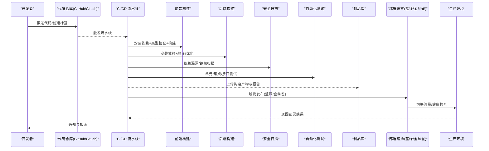
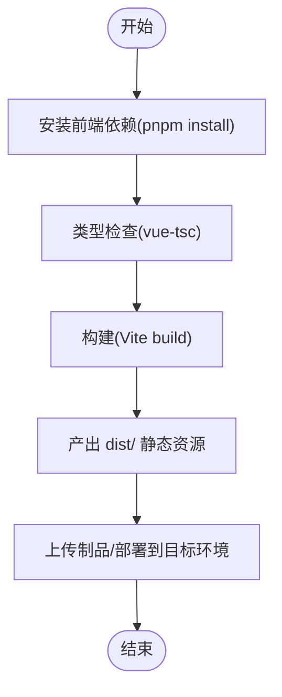
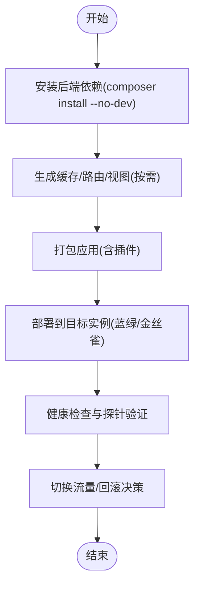
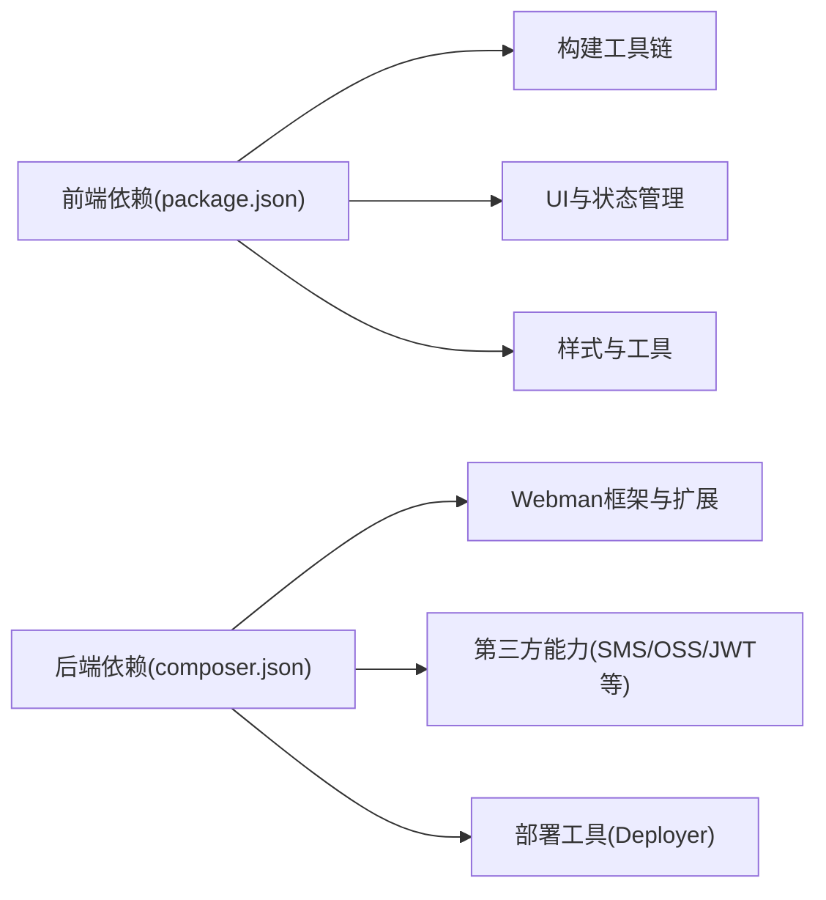

# CI/CD自动化部署

<cite>
**本文引用的文件**
- [frontend/package.json](file://frontend/package.json)
- [frontend/vite.config.ts](file://frontend/vite.config.ts)
- [frontend/index.html](file://frontend/index.html)
- [server/composer.json](file://server/composer.json)
- [server/config/app.php](file://server/config/app.php)
- [server/nginx.conf](file://server/nginx.conf)
</cite>

## 目录
1. [简介](#简介)
2. [项目结构](#项目结构)
3. [核心组件](#核心组件)
4. [架构总览](#架构总览)
5. [详细组件分析](#详细组件分析)
6. [依赖分析](#依赖分析)
7. [性能考虑](#性能考虑)
8. [故障排查指南](#故障排查指南)
9. [结论](#结论)
10. [附录](#附录)

## 简介
本文件为“积木云AI创作平台”提供一套完整的CI/CD自动化部署流水线方案，覆盖代码检查、单元测试、构建打包、安全扫描与自动化测试等关键环节。针对前后端分离的架构，分别给出GitHub Actions、GitLab CI与Jenkins三种流水线的示例配置思路，并详细说明版本管理与发布策略（蓝绿部署、金丝雀发布）、回滚机制与部署状态监控。

## 项目结构
仓库采用前后端分离：
- 前端：Vue 3 + Vite + TypeScript，使用pnpm管理依赖，构建产物输出到dist目录，静态资源由Nginx或Webman静态服务提供。
- 后端：基于Webman框架的PHP应用，通过composer管理依赖，运行时包含runtime目录用于缓存与日志。

图示来源
- [frontend/package.json:1-35](file://frontend/package.json#L1-L35)
- [frontend/vite.config.ts:1-32](file://frontend/vite.config.ts#L1-L32)
- [frontend/index.html:1-15](file://frontend/index.html#L1-L15)
- [server/composer.json:1-99](file://server/composer.json#L1-L99)
- [server/config/app.php:1-13](file://server/config/app.php#L1-L13)
- [server/nginx.conf:1-12](file://server/nginx.conf#L1-L12)

章节来源
- [frontend/package.json:1-35](file://frontend/package.json#L1-L35)
- [frontend/vite.config.ts:1-32](file://frontend/vite.config.ts#L1-L32)
- [frontend/index.html:1-15](file://frontend/index.html#L1-L15)
- [server/composer.json:1-99](file://server/composer.json#L1-L99)
- [server/config/app.php:1-13](file://server/config/app.php#L1-L13)
- [server/nginx.conf:1-12](file://server/nginx.conf#L1-L12)

## 核心组件
- 前端构建脚本：定义开发、构建与预览命令，使用vue-tsc进行类型检查后执行Vite构建。
- 后端依赖与脚本：通过composer管理依赖，并在包安装/更新/卸载时触发插件生命周期钩子。
- 运行时配置：应用调试开关、时区、公共目录与运行时目录等关键路径。
- Web服务器代理：Nginx将非静态请求反向代理至后端进程端口。

章节来源
- [frontend/package.json:6-11](file://frontend/package.json#L6-L11)
- [server/composer.json:80-90](file://server/composer.json#L80-L90)
- [server/config/app.php:4-13](file://server/config/app.php#L4-L13)
- [server/nginx.conf:1-12](file://server/nginx.conf#L1-L12)

## 架构总览
下图展示从代码提交到生产发布的端到端流程，包括多阶段构建、质量门禁、制品归档与灰度发布控制。

[此图为概念性流程图，无需图示来源]

## 详细组件分析

### 前端构建与发布
- 构建入口与脚本：通过package.json中的build脚本完成类型检查与构建；vite.config.ts定义了别名、代理与插件；index.html作为应用入口。
- 构建产物：dist目录下的静态资源，需配合Nginx或Webman静态路由提供服务。
- 环境变量注入：建议在构建阶段注入API基础地址、功能开关等变量，避免硬编码。

图示来源
- [frontend/package.json:6-11](file://frontend/package.json#L6-L11)
- [frontend/vite.config.ts:1-32](file://frontend/vite.config.ts#L1-L32)
- [frontend/index.html:1-15](file://frontend/index.html#L1-L15)

章节来源
- [frontend/package.json:1-35](file://frontend/package.json#L1-L35)
- [frontend/vite.config.ts:1-32](file://frontend/vite.config.ts#L1-L32)
- [frontend/index.html:1-15](file://frontend/index.html#L1-L15)

### 后端构建与发布
- 依赖管理：composer.json声明了Webman框架及相关扩展，支持在包安装/更新/卸载时执行自定义脚本。
- 运行时配置：app.php中定义了调试模式、时区、公共目录与运行时目录等。
- 反向代理：nginx.conf将动态请求转发至后端进程端口，静态资源优先命中本地文件。

图示来源
- [server/composer.json:80-90](file://server/composer.json#L80-L90)
- [server/config/app.php:4-13](file://server/config/app.php#L4-L13)
- [server/nginx.conf:1-12](file://server/nginx.conf#L1-L12)

章节来源
- [server/composer.json:1-99](file://server/composer.json#L1-L99)
- [server/config/app.php:1-13](file://server/config/app.php#L1-L13)
- [server/nginx.conf:1-12](file://server/nginx.conf#L1-L12)

### GitHub Actions 流水线示例
- 触发条件：push到main分支或打tag时触发；PR合并前对feature分支执行质量门禁。
- 阶段划分：
  - 构建前端：pnpm install、vue-tsc、vite build，产出dist。
  - 构建后端：composer install --no-dev，生成必要缓存。
  - 安全扫描：依赖漏洞扫描（如npm audit、composer audit）与容器镜像扫描（可选）。
  - 自动化测试：前端单测、后端PHPUnit/集成测试。
  - 制品归档：上传dist与后端包到制品库。
  - 部署：调用部署工具或SSH执行蓝绿/金丝雀切换。
- 版本管理：以git tag作为版本号，写入前端构建环境变量，便于追踪。
- 回滚：保留最近N个制品，失败自动回滚到上一稳定版本。
- 监控：发布完成后调用健康检查接口，记录状态并发送通知。

[本节为通用配置说明，不直接分析具体文件，故无章节来源]

### GitLab CI 流水线示例
- 触发条件：push与merge request事件。
- 阶段划分：
  - lint与test：并行执行前端与后端检查与测试。
  - build：构建前端dist与后端包。
  - security：依赖与镜像扫描。
  - deploy-staging：部署到预发环境。
  - deploy-production：人工审批后触发生产发布，支持蓝绿/金丝雀。
- 缓存与缓存键：利用pnpm与composer缓存加速构建。
- 制品与报告：保存测试报告与覆盖率，供MR查看。
- 回滚与监控：根据健康检查结果决定是否回滚，并通过Webhook通知。

[本节为通用配置说明，不直接分析具体文件，故无章节来源]

### Jenkins 流水线示例
- 触发方式：SCM轮询或Webhook触发。
- 阶段划分：
  - Stage 1: 拉取代码与缓存恢复。
  - Stage 2: 前端构建与测试。
  - Stage 3: 后端构建与测试。
  - Stage 4: 安全扫描与合规检查。
  - Stage 5: 部署到预发环境并执行冒烟测试。
  - Stage 6: 生产发布（蓝绿/金丝雀），带健康检查与自动回滚。
- 凭据管理：使用Jenkins凭据存储数据库、对象存储、云平台密钥等。
- 并发与隔离：为不同环境分配独立节点，避免相互干扰。
- 审计与回溯：保存每次构建的日志、制品与测试结果。

[本节为通用配置说明，不直接分析具体文件，故无章节来源]

### 版本管理与发布策略
- 版本规范：采用语义化版本（主.次.修订），以git tag驱动构建与发布。
- 分支模型：
  - main：稳定版本，仅接受受控合并与打tag。
  - develop：集成分支，日常开发合并。
  - feature/*：功能分支，PR合并到develop。
  - release/*：发布候选分支，修复问题后打tag进入生产。
- 发布策略：
  - 蓝绿部署：准备两套相同环境，新环境部署成功后切换流量，旧环境保留以便快速回滚。
  - 金丝雀发布：先向小比例用户开放新版本，观察指标后再全量放量。
- 回滚机制：
  - 自动回滚：健康检查失败或错误率阈值超限，立即切回上一版本。
  - 手动回滚：提供一键回滚操作，基于制品库历史版本快速恢复。
- 部署状态监控：
  - 健康检查：访问关键接口与页面，校验响应码与内容。
  - 指标采集：收集QPS、延迟、错误率、资源使用率等指标。
  - 告警通知：失败或异常时通过邮件、IM或短信通知。

[本节为通用策略说明，不直接分析具体文件，故无章节来源]

## 依赖分析
- 前端依赖：
  - 构建与类型检查：vite、vue-tsc、@vitejs/plugin-vue、typescript。
  - UI与状态：vue、pinia、vue-router。
  - 样式与工具：sass、tailwindcss、autoprefixer、postcss。
- 后端依赖：
  - 框架与扩展：workerman/webman-framework、webman/console、event、log、redis、database、redis-queue等。
  - 第三方能力：JWT鉴权、验证码、模板引擎、工作流、队列、短信与对象存储SDK等。
  - 部署辅助：deployer/deployer可用于蓝绿/金丝雀编排。

图示来源
- [frontend/package.json:12-33](file://frontend/package.json#L12-L33)
- [server/composer.json:31-68](file://server/composer.json#L31-L68)

章节来源
- [frontend/package.json:12-33](file://frontend/package.json#L12-L33)
- [server/composer.json:31-68](file://server/composer.json#L31-L68)

## 性能考虑
- 构建优化：
  - 启用依赖缓存（pnpm store、composer cache）。
  - 并行任务：lint/test/build并行执行。
  - 增量构建：合理设置缓存键，减少重复计算。
- 运行时优化：
  - 开启Gzip/Brotli压缩，静态资源加缓存头。
  - 调整Webman进程数与队列消费者数量，匹配CPU与IO特性。
  - 使用Redis缓存热点数据，降低数据库压力。
- 安全与稳定性：
  - 定期扫描依赖漏洞，及时升级。
  - 限制敏感信息暴露，统一日志脱敏。

[本节为通用指导，不直接分析具体文件，故无章节来源]

## 故障排查指南
- 常见问题定位：
  - 前端构建失败：检查node版本、pnpm锁文件一致性、环境变量注入是否正确。
  - 后端启动失败：确认php版本、扩展是否安装、配置文件路径与权限。
  - Nginx代理异常：核对location规则与后端进程端口，检查静态资源命中逻辑。
- 日志与诊断：
  - 前端：浏览器控制台与网络面板，关注API基础地址与跨域配置。
  - 后端：Webman日志与运行时目录，结合错误堆栈定位问题。
- 回滚与恢复：
  - 快速回滚到上一个稳定制品，确保数据库迁移可逆或具备补偿脚本。
  - 灰度期间若出现异常，立即停止流量切换并回退。

章节来源
- [server/config/app.php:4-13](file://server/config/app.php#L4-L13)
- [server/nginx.conf:1-12](file://server/nginx.conf#L1-L12)

## 结论
通过统一的CI/CD流水线与严格的版本管理，可实现前后端分离项目的持续交付与稳定发布。结合蓝绿与金丝雀策略，能够在保证业务连续性的同时降低变更风险。完善的回滚机制与监控体系是保障线上稳定的关键。

## 附录
- 建议的环境变量清单：
  - 前端：API_BASE_URL、FEATURE_FLAGS、BUILD_VERSION。
  - 后端：APP_DEBUG、DB_*、REDIS_*、QUEUE_*、LOG_LEVEL。
- 推荐的安全扫描工具：
  - 前端：npm audit / pnpm audit。
  - 后端：composer audit。
  - 容器镜像：Trivy、Clair（可选）。
- 健康检查接口示例：
  - GET /healthz：返回200表示服务可用。
  - GET /readyz：依赖就绪检查（数据库、缓存、外部服务）。

[本节为补充信息，不直接分析具体文件，故无章节来源]