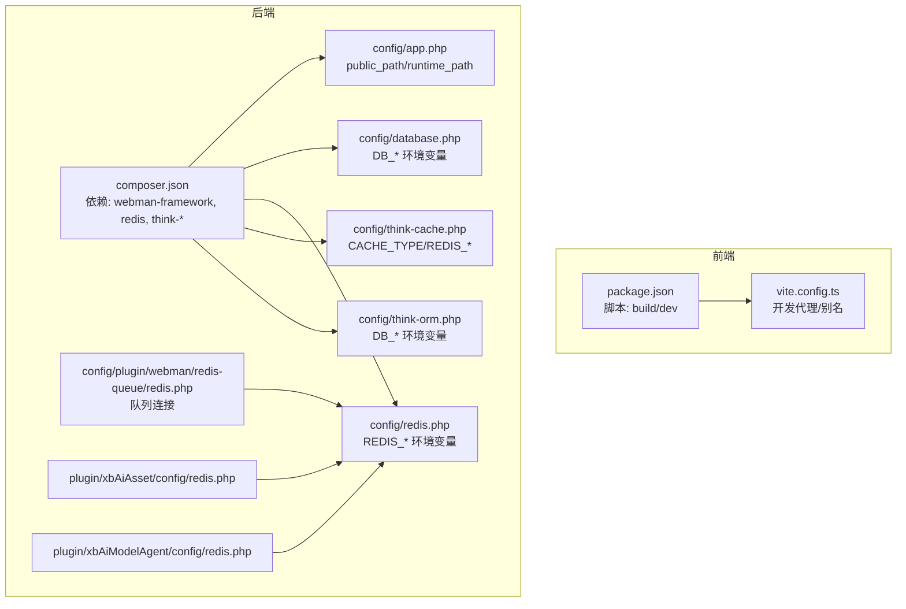
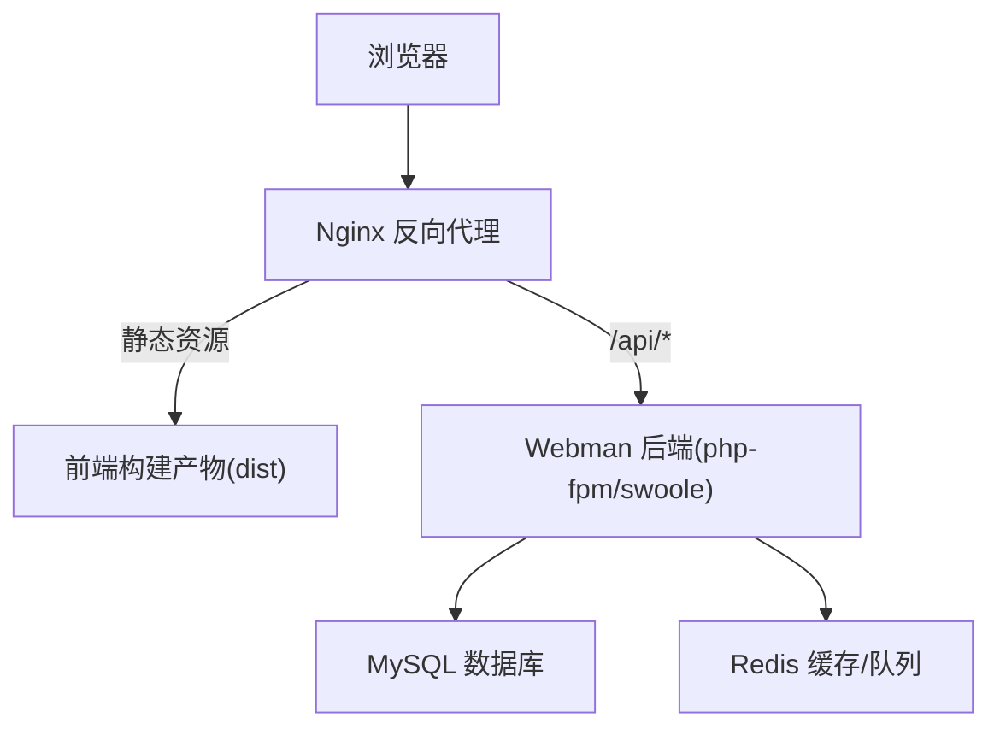
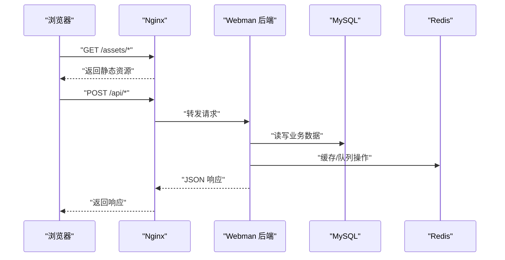
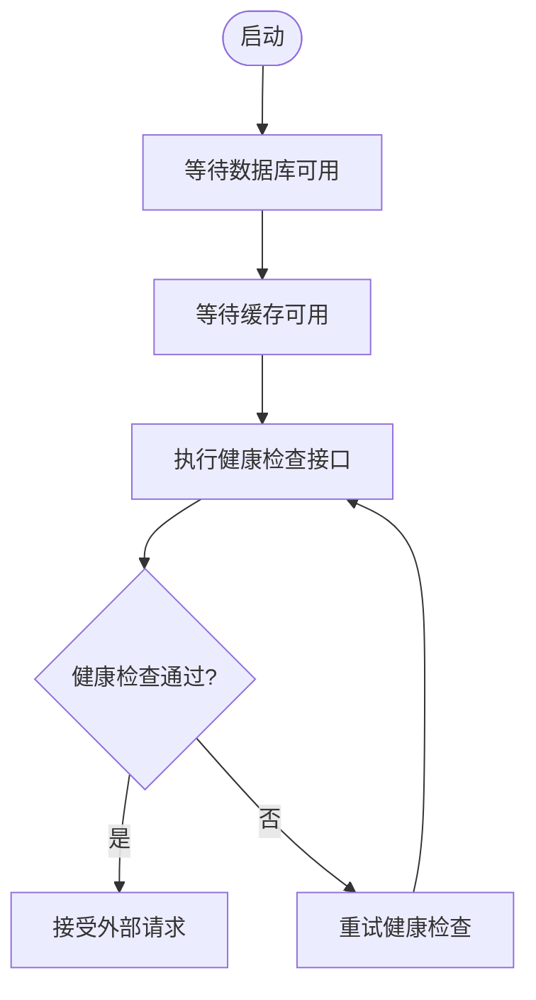
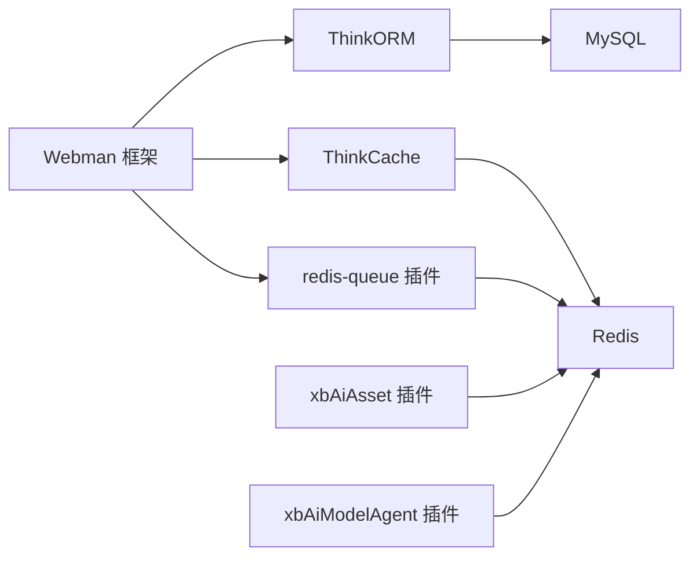

# Docker容器化

<cite>
**本文引用的文件**   
- [frontend/package.json](file://frontend/package.json)
- [frontend/vite.config.ts](file://frontend/vite.config.ts)
- [server/composer.json](file://server/composer.json)
- [server/config/app.php](file://server/config/app.php)
- [server/config/database.php](file://server/config/database.php)
- [server/config/redis.php](file://server/config/redis.php)
- [server/config/think-cache.php](file://server/config/think-cache.php)
- [server/config/think-orm.php](file://server/config/think-orm.php)
- [server/config/plugin/webman/redis-queue/redis.php](file://server/config/plugin/webman/redis-queue/redis.php)
- [server/plugin/xbAiAsset/config/redis.php](file://server/plugin/xbAiAsset/config/redis.php)
- [server/plugin/xbAiModelAgent/config/redis.php](file://server/plugin/xbAiModelAgent/config/redis.php)
</cite>

## 目录
1. [简介](#简介)
2. [项目结构](#项目结构)
3. [核心组件](#核心组件)
4. [架构总览](#架构总览)
5. [详细组件分析](#详细组件分析)
6. [依赖关系分析](#依赖关系分析)
7. [性能考虑](#性能考虑)
8. [故障排查指南](#故障排查指南)
9. [结论](#结论)
10. [附录](#附录)

## 简介
本方案为积木云AI创作平台提供完整的Docker容器化部署设计，采用多阶段构建与镜像分离策略：前端使用独立构建镜像生成静态资源，后端运行镜像仅包含PHP运行时与应用代码。通过Docker Compose编排应用服务、MySQL数据库、Redis缓存与Nginx反向代理，统一环境变量、数据卷挂载与网络通信。同时给出健康检查、日志收集与监控集成建议，便于在生产环境稳定运行。

## 项目结构
仓库包含前后端两个子项目：
- 前端：Vue3 + Vite 工程，构建产物输出到 dist 目录
- 后端：基于 Webman（Workerman）的 PHP 应用，使用 ThinkORM/ThinkCache 等组件，依赖 MySQL 与 Redis

图表来源
- [frontend/package.json:1-35](file://frontend/package.json#L1-L35)
- [frontend/vite.config.ts:1-32](file://frontend/vite.config.ts#L1-L32)
- [server/composer.json:1-99](file://server/composer.json#L1-L99)
- [server/config/app.php:1-13](file://server/config/app.php#L1-L13)
- [server/config/database.php:1-35](file://server/config/database.php#L1-L35)
- [server/config/redis.php:1-17](file://server/config/redis.php#L1-L17)
- [server/config/think-cache.php:1-42](file://server/config/think-cache.php#L1-L42)
- [server/config/think-orm.php:1-40](file://server/config/think-orm.php#L1-L40)
- [server/config/plugin/webman/redis-queue/redis.php:1-28](file://server/config/plugin/webman/redis-queue/redis.php#L1-L28)
- [server/plugin/xbAiAsset/config/redis.php:1-11](file://server/plugin/xbAiAsset/config/redis.php#L1-L11)
- [server/plugin/xbAiModelAgent/config/redis.php:1-11](file://server/plugin/xbAiModelAgent/config/redis.php#L1-L11)

章节来源
- [frontend/package.json:1-35](file://frontend/package.json#L1-L35)
- [frontend/vite.config.ts:1-32](file://frontend/vite.config.ts#L1-L32)
- [server/composer.json:1-99](file://server/composer.json#L1-L99)
- [server/config/app.php:1-13](file://server/config/app.php#L1-L13)
- [server/config/database.php:1-35](file://server/config/database.php#L1-L35)
- [server/config/redis.php:1-17](file://server/config/redis.php#L1-L17)
- [server/config/think-cache.php:1-42](file://server/config/think-cache.php#L1-L42)
- [server/config/think-orm.php:1-40](file://server/config/think-orm.php#L1-L40)
- [server/config/plugin/webman/redis-queue/redis.php:1-28](file://server/config/plugin/webman/redis-queue/redis.php#L1-L28)
- [server/plugin/xbAiAsset/config/redis.php:1-11](file://server/plugin/xbAiAsset/config/redis.php#L1-L11)
- [server/plugin/xbAiModelAgent/config/redis.php:1-11](file://server/plugin/xbAiModelAgent/config/redis.php#L1-L11)

## 核心组件
- 前端构建镜像
  - 基于 Node 镜像，安装依赖并执行构建脚本，产出静态资源至 dist 目录
  - 构建脚本定义见 package.json 的 build 命令
- 后端运行镜像
  - 基于 PHP 镜像，安装 Composer 依赖，启动 Webman 进程
  - 关键依赖包括 webman-framework、webman/redis、think-orm、think-cache 等
- 数据库与缓存
  - MySQL：持久化存储，通过 DB_* 环境变量配置
  - Redis：会话、缓存、队列共享，通过 REDIS_* 环境变量配置
- Nginx 反向代理
  - 将 HTTP 请求转发至后端 API 端口，并将静态资源指向前端构建产物

章节来源
- [frontend/package.json:6-11](file://frontend/package.json#L6-L11)
- [server/composer.json:31-68](file://server/composer.json#L31-L68)
- [server/config/database.php:1-35](file://server/config/database.php#L1-L35)
- [server/config/redis.php:1-17](file://server/config/redis.php#L1-L17)
- [server/config/think-cache.php:1-42](file://server/config/think-cache.php#L1-L42)
- [server/config/think-orm.php:1-40](file://server/config/think-orm.php#L1-L40)

## 架构总览
整体采用四层架构：浏览器访问 Nginx，Nginx 将静态资源直接返回，API 请求转发到后端 PHP 服务；后端通过 MySQL 持久化数据，通过 Redis 实现缓存与队列。

图表来源
- [server/config/app.php:1-13](file://server/config/app.php#L1-L13)
- [server/config/database.php:1-35](file://server/config/database.php#L1-L35)
- [server/config/redis.php:1-17](file://server/config/redis.php#L1-L17)
- [server/config/think-cache.php:1-42](file://server/config/think-cache.php#L1-L42)
- [server/config/think-orm.php:1-40](file://server/config/think-orm.php#L1-L40)

## 详细组件分析

### 多阶段构建与镜像分离
- 前端构建阶段
  - 使用 Node 镜像拉取依赖并执行构建，输出静态资源
  - 构建脚本路径参考 package.json 的 scripts.build
- 后端运行阶段
  - 使用 PHP 镜像，安装 Composer 依赖，拷贝源码与配置文件
  - 启动 Webman 主进程及必要的后台进程（如队列消费者）
- 镜像分层优化
  - 先复制依赖清单再安装依赖，利用镜像层缓存加速重复构建
  - 生产镜像仅包含运行时所需文件，减小体积

章节来源
- [frontend/package.json:6-11](file://frontend/package.json#L6-L11)
- [server/composer.json:31-68](file://server/composer.json#L31-L68)

### Docker Compose 编排与服务通信
- 服务划分
  - app：Webman 后端服务
  - db：MySQL 数据库服务
  - cache：Redis 缓存服务
  - nginx：Nginx 反向代理服务
- 网络与端口
  - 所有服务加入同一自定义网络，内部通过服务名通信
  - Nginx 对外暴露 80/443，后端不直接暴露给外部
- 数据卷
  - MySQL 数据持久化到宿主机或外部存储
  - 上传文件与运行时日志可持久化到宿主机目录
- 环境变量
  - 通过 .env 或 docker-compose.yml 的 environment 注入 DB_* 与 REDIS_* 等变量
  - 后端读取这些变量完成数据库与缓存连接

图表来源
- [server/config/database.php:1-35](file://server/config/database.php#L1-L35)
- [server/config/redis.php:1-17](file://server/config/redis.php#L1-L17)
- [server/config/think-cache.php:1-42](file://server/config/think-cache.php#L1-L42)
- [server/config/think-orm.php:1-40](file://server/config/think-orm.php#L1-L40)

### 环境变量与配置映射
- 数据库相关
  - DB_HOST、DB_PORT、DB_NAME、DB_USER、DB_PASS、DB_CHARSET、DB_PREFIX
  - 对应配置位置：database.php、think-orm.php
- 缓存与队列相关
  - REDIS_HOST、REDIS_PORT、REDIS_PASSWORD、REDIS_DB、REDIS_PREFIX
  - 对应配置位置：redis.php、think-cache.php、redis-queue/redis.php、插件 redis 配置
- 应用运行相关
  - APP_DEBUG、APP_ENV、时区、public_path、runtime_path 等
  - 对应配置位置：app.php

章节来源
- [server/config/database.php:1-35](file://server/config/database.php#L1-L35)
- [server/config/redis.php:1-17](file://server/config/redis.php#L1-L17)
- [server/config/think-cache.php:1-42](file://server/config/think-cache.php#L1-L42)
- [server/config/think-orm.php:1-40](file://server/config/think-orm.php#L1-L40)
- [server/config/plugin/webman/redis-queue/redis.php:1-28](file://server/config/plugin/webman/redis-queue/redis.php#L1-L28)
- [server/plugin/xbAiAsset/config/redis.php:1-11](file://server/plugin/xbAiAsset/config/redis.php#L1-L11)
- [server/plugin/xbAiModelAgent/config/redis.php:1-11](file://server/plugin/xbAiModelAgent/config/redis.php#L1-L11)
- [server/config/app.php:1-13](file://server/config/app.php#L1-L13)

### 健康检查与就绪探针
- 后端健康检查
  - 提供一个轻量接口（如 /health），返回 200 表示服务正常
  - 在 compose 中配置 healthcheck，定期探测该接口
- 数据库健康检查
  - 使用官方 mysql 镜像提供的健康检查脚本
- 缓存健康检查
  - 使用 redis-cli ping 或自定义脚本检测连通性
- 就绪探针
  - 后端启动后等待数据库与缓存可用后再接受流量

图表来源
- [server/config/database.php:1-35](file://server/config/database.php#L1-L35)
- [server/config/redis.php:1-17](file://server/config/redis.php#L1-L17)

### 日志收集与监控集成
- 日志收集
  - 将后端运行时日志目录挂载到宿主机或外部日志系统
  - 结合 filebeat/fluentd 采集容器 stdout/stderr 与文件日志
- 指标与监控
  - 接入 Prometheus 抓取应用指标（QPS、错误率、延迟）
  - 对 MySQL 与 Redis 使用官方 exporter 采集基础指标
- 告警
  - 基于 Alertmanager 设置阈值告警（CPU、内存、磁盘、错误率）

[本节为通用指导，无需具体文件引用]

## 依赖关系分析
后端依赖链清晰：Webman 框架作为入口，ThinkORM/ThinkCache 分别对接 MySQL 与 Redis，队列通过 redis-queue 插件消费任务。插件模块也各自维护 Redis 连接配置。

图表来源
- [server/composer.json:31-68](file://server/composer.json#L31-L68)
- [server/config/database.php:1-35](file://server/config/database.php#L1-L35)
- [server/config/redis.php:1-17](file://server/config/redis.php#L1-L17)
- [server/config/think-cache.php:1-42](file://server/config/think-cache.php#L1-L42)
- [server/config/think-orm.php:1-40](file://server/config/think-orm.php#L1-L40)
- [server/config/plugin/webman/redis-queue/redis.php:1-28](file://server/config/plugin/webman/redis-queue/redis.php#L1-L28)
- [server/plugin/xbAiAsset/config/redis.php:1-11](file://server/plugin/xbAiAsset/config/redis.php#L1-L11)
- [server/plugin/xbAiModelAgent/config/redis.php:1-11](file://server/plugin/xbAiModelAgent/config/redis.php#L1-L11)

章节来源
- [server/composer.json:31-68](file://server/composer.json#L31-L68)
- [server/config/database.php:1-35](file://server/config/database.php#L1-L35)
- [server/config/redis.php:1-17](file://server/config/redis.php#L1-L17)
- [server/config/think-cache.php:1-42](file://server/config/think-cache.php#L1-L42)
- [server/config/think-orm.php:1-40](file://server/config/think-orm.php#L1-L40)
- [server/config/plugin/webman/redis-queue/redis.php:1-28](file://server/config/plugin/webman/redis-queue/redis.php#L1-L28)
- [server/plugin/xbAiAsset/config/redis.php:1-11](file://server/plugin/xbAiAsset/config/redis.php#L1-L11)
- [server/plugin/xbAiModelAgent/config/redis.php:1-11](file://server/plugin/xbAiModelAgent/config/redis.php#L1-L11)

## 性能考虑
- 连接池
  - 数据库与 Redis 均支持连接池配置，合理设置最大/最小连接数与心跳间隔，避免频繁创建销毁连接
- 静态资源
  - 由 Nginx 直接返回前端构建产物，减少后端压力
- 队列与异步
  - 使用 Redis 队列进行异步任务处理，提升吞吐与用户体验
- 缓存策略
  - 合理使用缓存过期时间与标签前缀，避免热点键与内存膨胀

章节来源
- [server/config/database.php:21-32](file://server/config/database.php#L21-L32)
- [server/config/redis.php:8-14](file://server/config/redis.php#L8-L14)
- [server/config/think-cache.php:26-32](file://server/config/think-cache.php#L26-L32)

## 故障排查指南
- 数据库连接失败
  - 检查 DB_* 环境变量是否正确，确认 MySQL 服务可达与账号权限
  - 查看 ThinkORM 与 database.php 的连接参数是否一致
- Redis 连接失败
  - 检查 REDIS_* 环境变量，确认 host/port/password/db 正确
  - 验证 redis-queue 与插件的 Redis 配置一致性
- 静态资源 404
  - 确认 Nginx 已正确映射前端构建产物目录
  - 检查 public_path 与 runtime_path 配置
- 健康检查失败
  - 确认后端健康接口可用，数据库与缓存就绪后再开放流量

章节来源
- [server/config/database.php:1-35](file://server/config/database.php#L1-L35)
- [server/config/redis.php:1-17](file://server/config/redis.php#L1-L17)
- [server/config/think-cache.php:1-42](file://server/config/think-cache.php#L1-L42)
- [server/config/think-orm.php:1-40](file://server/config/think-orm.php#L1-L40)
- [server/config/plugin/webman/redis-queue/redis.php:1-28](file://server/config/plugin/webman/redis-queue/redis.php#L1-L28)
- [server/plugin/xbAiAsset/config/redis.php:1-11](file://server/plugin/xbAiAsset/config/redis.php#L1-L11)
- [server/plugin/xbAiModelAgent/config/redis.php:1-11](file://server/plugin/xbAiModelAgent/config/redis.php#L1-L11)
- [server/config/app.php:1-13](file://server/config/app.php#L1-L13)

## 结论
本方案通过多阶段构建与镜像分离，结合 Docker Compose 完成前后端、数据库、缓存与反向代理的统一编排。通过环境变量集中管理配置，配合健康检查、日志与监控体系，可在生产环境获得高可用与易运维的部署体验。

## 附录
- 环境变量清单（示例）
  - 数据库：DB_HOST、DB_PORT、DB_NAME、DB_USER、DB_PASS、DB_CHARSET、DB_PREFIX
  - 缓存：REDIS_HOST、REDIS_PORT、REDIS_PASSWORD、REDIS_DB、REDIS_PREFIX
  - 应用：APP_DEBUG、APP_ENV、时区、public_path、runtime_path
- 数据卷建议
  - MySQL 数据目录持久化
  - 上传文件目录与运行时日志目录持久化
- 网络建议
  - 自定义桥接网络隔离应用与基础设施
  - 仅 Nginx 暴露 80/443 端口

[本节为通用指导，无需具体文件引用]