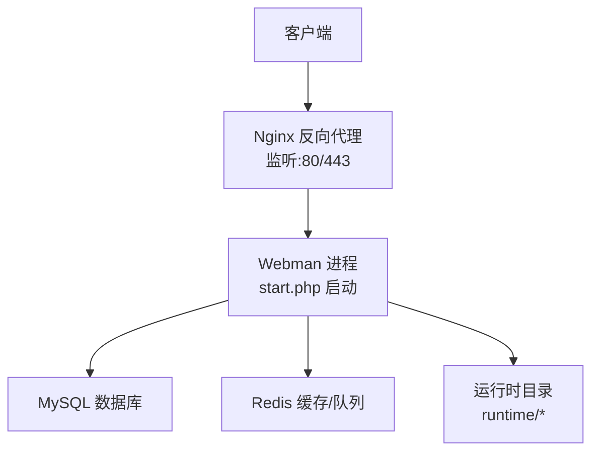
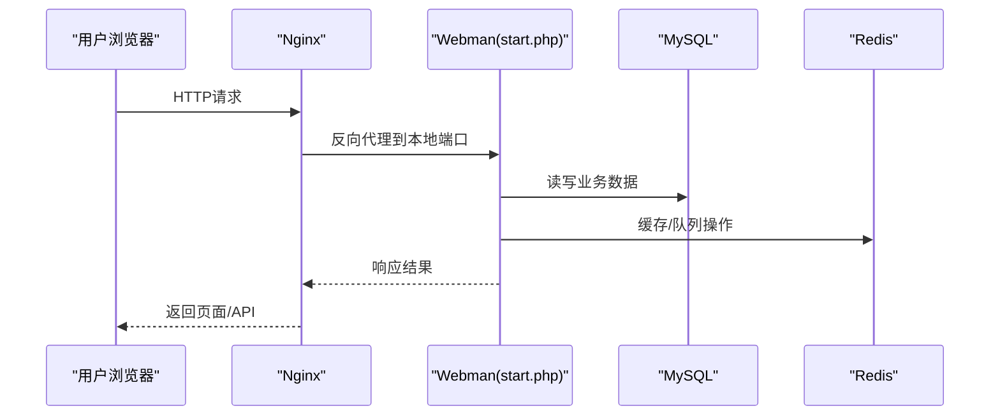
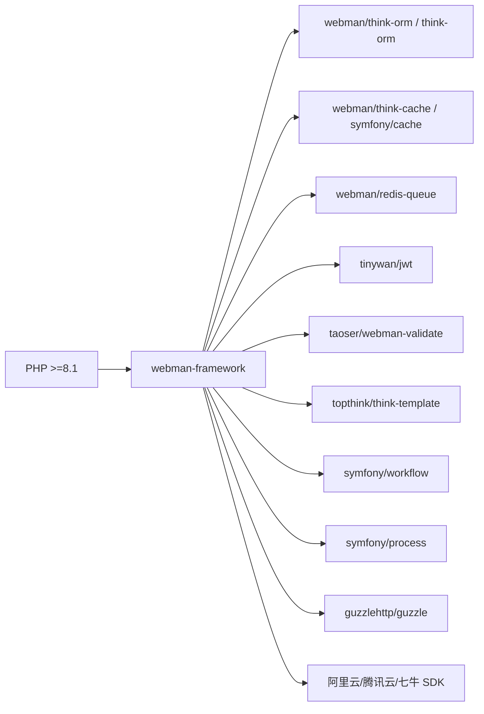

# Linux部署

<cite>
**本文引用的文件**   
- [server/composer.json](file://server/composer.json)
- [server/start.php](file://server/start.php)
- [server/config/server.php](file://server/config/server.php)
- [server/config/database.php](file://server/config/database.php)
- [server/config/redis.php](file://server/config/redis.php)
- [server/config/process.php](file://server/config/process.php)
- [server/nginx.conf](file://server/nginx.conf)
- [server/support/bootstrap.php](file://server/support/bootstrap.php)
- [server/plugin/xbCode/install.sql](file://server/plugin/xbCode/install.sql)
</cite>

## 目录
1. [简介](#简介)
2. [项目结构](#项目结构)
3. [核心组件](#核心组件)
4. [架构总览](#架构总览)
5. [详细组件分析](#详细组件分析)
6. [依赖分析](#依赖分析)
7. [性能考虑](#性能考虑)
8. [故障排查指南](#故障排查指南)
9. [结论](#结论)
10. [附录](#附录)

## 简介
本指南面向在Linux生产环境部署“积木云AI创作平台”的后端服务。后端基于Webman（Workerman）运行，使用PHP 8.1+、MySQL与Redis作为关键依赖，通过Nginx反向代理对外提供服务。文档覆盖CentOS与Ubuntu两大主流发行版的安装步骤、数据库初始化、进程守护与自动重启、日志轮转、监控告警以及常见问题的排查方法。

## 项目结构
后端位于 server 目录，核心入口为 start.php；运行时配置集中在 config 目录；静态资源由Nginx处理并反向代理至Webman进程；数据库与Redis连接信息通过环境变量注入。

**图示来源** 
- [server/start.php:1-6](file://server/start.php#L1-L6)
- [server/config/server.php:1-12](file://server/config/server.php#L1-L12)
- [server/nginx.conf:1-12](file://server/nginx.conf#L1-L12)

**章节来源**
- [server/start.php:1-6](file://server/start.php#L1-L6)
- [server/config/server.php:1-12](file://server/config/server.php#L1-L12)
- [server/nginx.conf:1-12](file://server/nginx.conf#L1-L12)

## 核心组件
- 应用入口：start.php 加载自动加载器并启动Webman应用。
- 服务器配置：config/server.php 定义PID文件、状态文件、标准输出与日志路径、最大包大小等。
- 数据库配置：config/database.php 通过环境变量读取MySQL连接参数，支持连接池。
- Redis配置：config/redis.php 通过环境变量读取Redis连接参数，支持连接池。
- 进程与热重载：config/process.php 定义文件监控与扩展名监听，便于开发期热重载。
- 前端构建产物：frontend/dist 静态资源由Nginx直接返回。

**章节来源**
- [server/start.php:1-6](file://server/start.php#L1-L6)
- [server/config/server.php:1-12](file://server/config/server.php#L1-L12)
- [server/config/database.php:1-35](file://server/config/database.php#L1-L35)
- [server/config/redis.php:1-17](file://server/config/redis.php#L1-L17)
- [server/config/process.php:1-43](file://server/config/process.php#L1-L43)

## 架构总览
整体采用“Nginx + Webman(Workerman) + MySQL + Redis”的经典高并发架构。Nginx负责静态资源与反向代理，Webman常驻内存提供高性能API，MySQL持久化数据，Redis用于缓存与异步任务队列。

**图示来源** 
- [server/nginx.conf:1-12](file://server/nginx.conf#L1-L12)
- [server/start.php:1-6](file://server/start.php#L1-L6)
- [server/config/database.php:1-35](file://server/config/database.php#L1-L35)
- [server/config/redis.php:1-17](file://server/config/redis.php#L1-L17)

## 详细组件分析

### PHP环境与Composer依赖
- PHP版本要求：>=8.1（见composer.json）。
- 推荐扩展：event（可选，提升性能）。
- Composer包管理：webman框架、数据库、缓存、队列、JWT、验证码、模板引擎、工作流、HTTP客户端、短信/邮件/对象存储SDK等。

建议步骤（通用）：
- 安装PHP 8.1+及常用扩展（pdo_mysql、redis、openssl、mbstring、json、zip、bcmath、ctype、curl、gd等）。
- 安装Composer。
- 进入 server 目录执行依赖安装。

**章节来源**
- [server/composer.json:31-68](file://server/composer.json#L31-L68)
- [server/composer.json:69-71](file://server/composer.json#L69-L71)

### 数据库初始化
- 默认驱动：mysql，字符集utf8mb4，表前缀可配置。
- 基础表结构：插件 xbCode 的 install.sql 包含管理员、角色、菜单、配置、插件管理等核心表。
- 初始化流程：创建数据库与用户后，导入install.sql。

注意：
- 其他插件可能包含各自的install.sql，按需导入。
- 生产环境建议启用严格模式与合适的连接池参数。

**章节来源**
- [server/config/database.php:1-35](file://server/config/database.php#L1-L35)
- [server/plugin/xbCode/install.sql:1-91](file://server/plugin/xbCode/install.sql#L1-L91)

### Redis与队列
- Redis连接通过环境变量配置，支持连接池。
- 队列使用 webman/redis-queue，需确保Redis可用且网络可达。
- 队列消费者可通过Webman进程或独立命令启动（具体以插件配置为准）。

**章节来源**
- [server/config/redis.php:1-17](file://server/config/redis.php#L1-L17)

### 环境变量与配置加载
- 应用启动时若存在 .env 文件，将自动加载环境变量。
- 数据库与Redis相关参数均从环境变量读取。

**章节来源**
- [server/support/bootstrap.php:44](file://server/support/bootstrap.php#L44)
- [server/config/database.php:1-35](file://server/config/database.php#L1-L35)
- [server/config/redis.php:1-17](file://server/config/redis.php#L1-L17)

### 进程管理与热重载
- 进程监控目录：app、config、process、support、resource、.env 以及插件目录（调试模式下）。
- 监听扩展名：php、html、htm、env。
- 非守护模式（-d）下可在Linux启用文件监控与内存监控。

**章节来源**
- [server/config/process.php:1-43](file://server/config/process.php#L1-L43)

### Nginx反向代理
- 静态资源优先由Nginx直接返回。
- 动态请求反向代理至本地Webman进程端口（示例中为39120）。
- 开启proxy_buffering关闭以支持长连接/流式响应场景。

**章节来源**
- [server/nginx.conf:1-12](file://server/nginx.conf#L1-L12)

## 依赖分析
- 运行时依赖：PHP 8.1+、MySQL、Redis、Nginx。
- 可选依赖：event扩展（提升性能）。
- 关键第三方库：webman框架生态、think-orm/think-cache、symfony/workflow/process、guzzlehttp/guzzle、各云厂商SDK。

**图示来源** 
- [server/composer.json:31-68](file://server/composer.json#L31-L68)

**章节来源**
- [server/composer.json:31-68](file://server/composer.json#L31-L68)

## 性能考虑
- 启用event扩展以提升事件循环性能。
- 合理设置数据库与Redis连接池参数（最大/最小连接数、空闲超时、心跳间隔）。
- 调整Nginx与Webman的最大包大小，避免大文件上传被截断。
- 对静态资源启用Gzip/Brotli压缩与缓存头。
- 使用CDN加速静态资源与对象存储访问。

[本节为通用指导，无需源码引用]

## 故障排查指南
- 无法加载.env：确认bootstrap阶段是否检测到.env文件，检查路径与权限。
- 数据库连接失败：核对DB_HOST/DB_PORT/DB_NAME/DB_USER/DB_PASS等环境变量，检查防火墙与白名单。
- Redis不可用：核对REDIS_*环境变量，检查Redis服务状态与密码。
- 进程未启动或频繁重启：查看server.php中的pid_file/status_file/stdout_file/log_file路径是否存在并可写。
- 静态资源404：确认Nginx location规则与静态目录映射是否正确。
- 队列无消费：检查Redis连接与队列消费者进程是否启动。

**章节来源**
- [server/support/bootstrap.php:44](file://server/support/bootstrap.php#L44)
- [server/config/server.php:1-12](file://server/config/server.php#L1-L12)
- [server/nginx.conf:1-12](file://server/nginx.conf#L1-L12)

## 结论
按照本指南完成环境准备、依赖安装、数据库初始化、进程守护与Nginx配置后，即可在生产环境稳定运行“积木云AI创作平台”。结合日志轮转与监控告警策略，可进一步提升系统的可观测性与可靠性。

[本节为总结性内容，无需源码引用]

## 附录

### CentOS 7/8 安装步骤（参考）
- 安装EPEL与Remi源，启用PHP 8.1。
- 安装PHP扩展：pdo_mysql、redis、openssl、mbstring、json、zip、bcmath、ctype、curl、gd等。
- 安装Nginx、MySQL 8.0、Redis。
- 安装Composer。
- 进入 server 目录执行依赖安装。
- 配置环境变量（.env），初始化数据库。
- 启动Webman进程并配置systemd。
- 配置Nginx反向代理与SSL证书。

[本节为通用指导，无需源码引用]

### Ubuntu 20.04/22.04 安装步骤（参考）
- 添加ondrej/php PPA，安装PHP 8.1及相关扩展。
- 安装Nginx、MySQL 8.0、Redis。
- 安装Composer。
- 进入 server 目录执行依赖安装。
- 配置环境变量（.env），初始化数据库。
- 启动Webman进程并配置systemd。
- 配置Nginx反向代理与SSL证书。

[本节为通用指导，无需源码引用]

### systemd服务配置（示例要点）
- 服务类型：simple或exec。
- ExecStart指向 server/start.php。
- Restart=always，RestartSec=3。
- User/Group设置为专用运行账户。
- EnvironmentFile指向 .env 所在路径。
- 启用并开机自启服务。

[本节为通用指导，无需源码引用]

### 防火墙与安全
- 仅开放80/443端口，禁止直接暴露Webman端口。
- 限制MySQL与Redis仅本机或内网访问。
- 使用强密码与最小权限原则。

[本节为通用指导，无需源码引用]

### 日志轮转与监控告警
- 使用logrotate对stdout.log、workerman.log、队列日志进行轮转。
- 配置Prometheus/Grafana或Zabbix采集系统指标与应用指标。
- 针对错误日志阈值与关键接口可用性设置告警。

[本节为通用指导，无需源码引用]

### 完整部署脚本（说明）
- 可将上述步骤整合为Shell脚本，实现一键部署。
- 脚本应包含：环境检测、依赖安装、配置文件生成、数据库初始化、服务注册与启动、健康检查等。
- 建议在CI/CD流水线中集成，保证一致性。

[本节为通用指导，无需源码引用]