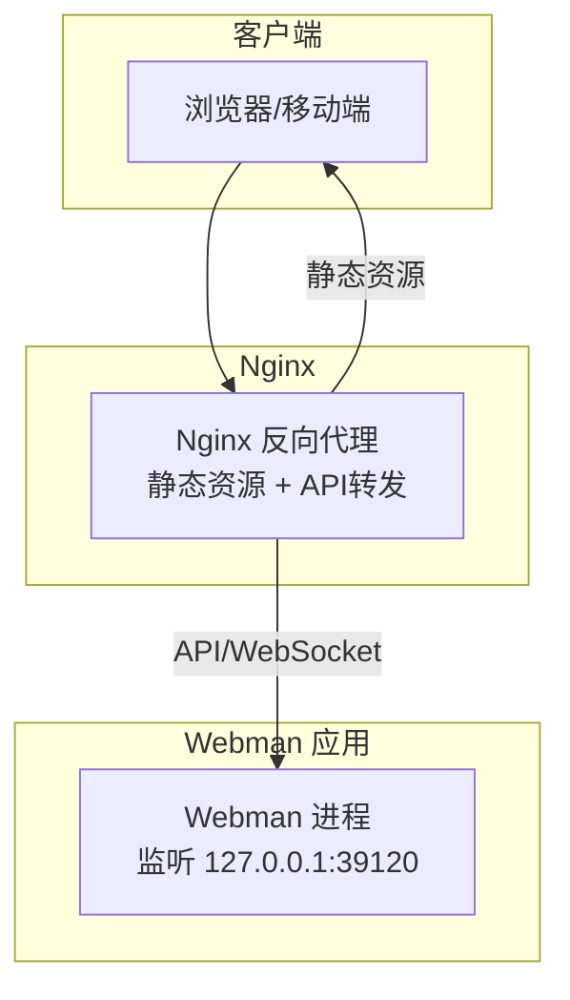
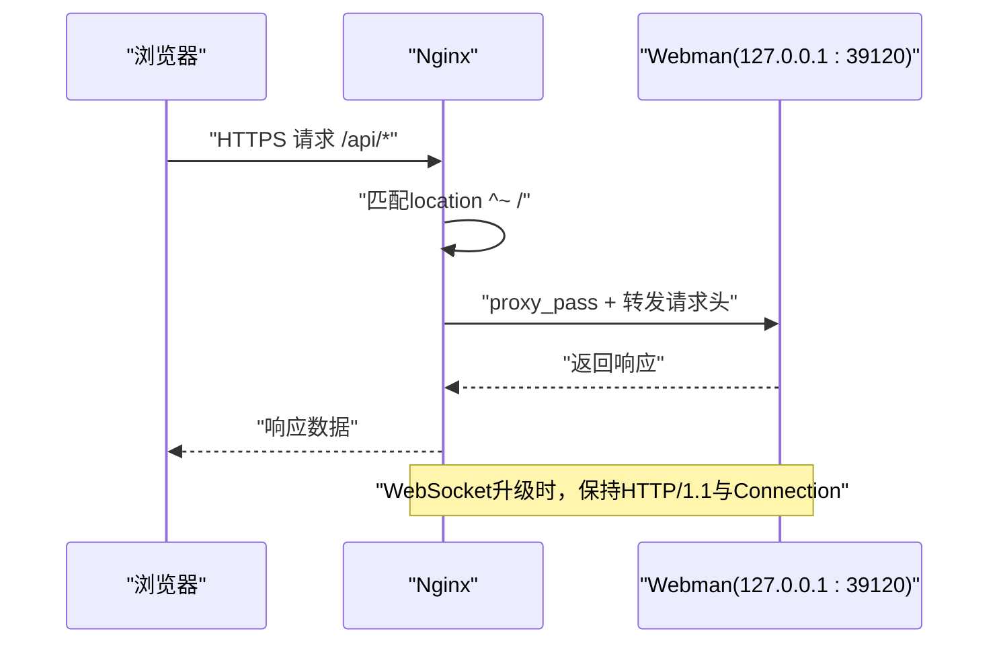
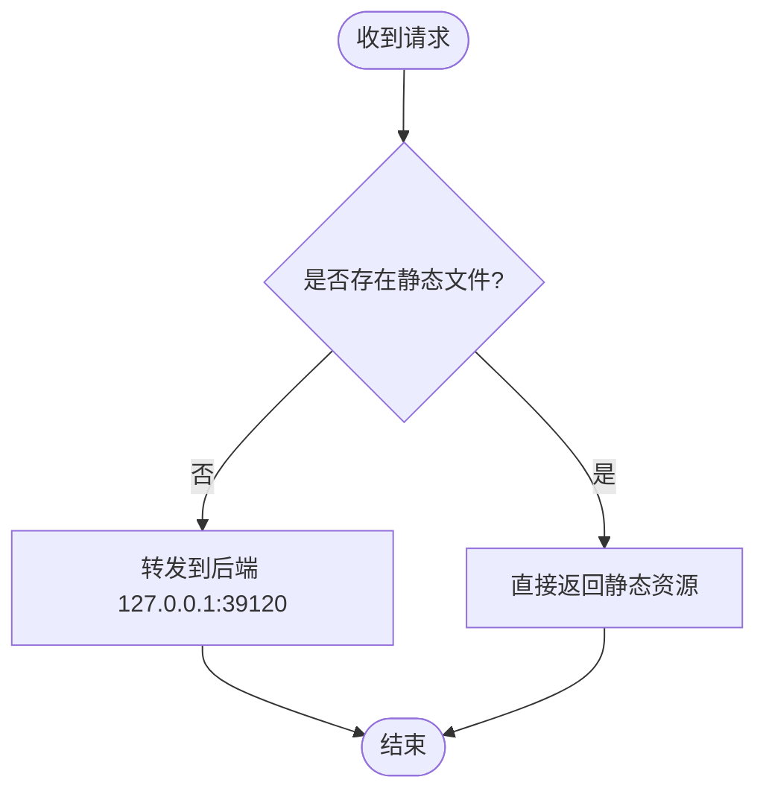
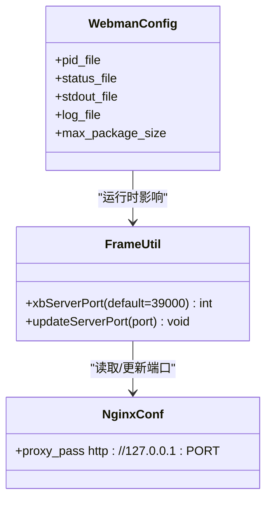
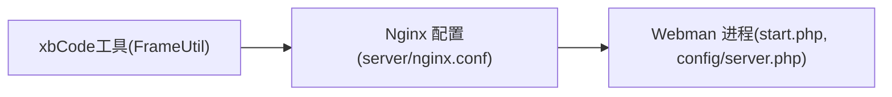

# Web服务器配置

<cite>
**本文引用的文件**   
- [server/nginx.conf](file://server/nginx.conf)
- [server/plugin/xbCode/nginx.conf](file://server/plugin/xbCode/nginx.conf)
- [server/config/server.php](file://server/config/server.php)
- [server/start.php](file://server/start.php)
- [server/plugin/xbCode/utils/FrameUtil.php](file://server/plugin/xbCode/utils/FrameUtil.php)
</cite>

## 目录
1. [简介](#简介)
2. [项目结构](#项目结构)
3. [核心组件](#核心组件)
4. [架构总览](#架构总览)
5. [详细组件分析](#详细组件分析)
6. [依赖关系分析](#依赖关系分析)
7. [性能与优化](#性能与优化)
8. [故障排查指南](#故障排查指南)
9. [结论](#结论)
10. [附录](#附录)

## 简介
本指南面向积木云AI创作平台的Web服务器部署，重点说明Nginx反向代理在生产环境的最佳实践，包括伪静态规则、WebSocket支持、SSL证书配置与域名绑定；深入解释proxy_pass、请求头转发、连接保持与性能参数；并提供完整的Nginx配置示例。同时给出Webman进程启动与端口管理建议，确保前后端稳定高效运行。

## 项目结构
本项目采用前后端分离：
- 前端构建产物位于 frontend/dist（由Vite构建），通常由Nginx直接提供静态资源。
- 后端基于Webman（Workerman内核）运行PHP应用，监听本地端口，由Nginx反向代理至后端服务。
- Nginx伪静态与反向代理配置位于 server/nginx.conf；插件 xbCode 也包含一份示例配置用于其独立服务场景。

**图示来源** 
- [server/nginx.conf:1-12](file://server/nginx.conf#L1-L12)
- [server/config/server.php:1-12](file://server/config/server.php#L1-L12)

**章节来源**
- [server/nginx.conf:1-12](file://server/nginx.conf#L1-L12)
- [server/plugin/xbCode/nginx.conf:1-12](file://server/plugin/xbCode/nginx.conf#L1-L12)
- [server/config/server.php:1-12](file://server/config/server.php#L1-L12)

## 核心组件
- Nginx反向代理与伪静态：负责将非静态请求转发到Webman，并设置必要的HTTP头以正确传递客户端信息。
- Webman进程：基于Workerman的高性能PHP应用服务器，通过 start.php 启动，监听本地端口处理业务请求。
- 端口管理工具：xbCode插件提供的工具类可读取或更新Nginx配置文件中的后端端口，便于自动化部署与运维。

**章节来源**
- [server/nginx.conf:1-12](file://server/nginx.conf#L1-L12)
- [server/start.php:1-6](file://server/start.php#L1-L6)
- [server/plugin/xbCode/utils/FrameUtil.php:190-233](file://server/plugin/xbCode/utils/FrameUtil.php#L190-L233)

## 架构总览
下图展示了生产环境典型的数据流：浏览器访问域名，Nginx根据路径判断是否静态资源；否则将请求转发给Webman。对于长连接（如WebSocket），需启用HTTP/1.1并保持连接。

**图示来源** 
- [server/nginx.conf:1-12](file://server/nginx.conf#L1-L12)

## 详细组件分析

### Nginx反向代理与伪静态
- 基本策略：当请求对应磁盘上不存在真实文件时，将请求转发到Webman后端。
- 关键行为：
  - 关闭缓冲以提升实时性（尤其对SSE/流式输出）。
  - 设置 X-Real-IP、Host、X-Forwarded-Proto 等头部，使后端能感知真实客户端信息与协议。
  - 使用 HTTP/1.1 并将 Connection 置空，以便复用连接与长连接（WebSocket）。
- 注意：当前配置未显式开启 WebSocket 升级头，若业务需要WebSocket，请补充 Upgrade 与 Connection 的透传。

**图示来源** 
- [server/nginx.conf:1-12](file://server/nginx.conf#L1-L12)

**章节来源**
- [server/nginx.conf:1-12](file://server/nginx.conf#L1-L12)

### SSL证书与域名绑定（生产环境建议）
- 在Nginx中为站点启用HTTPS，配置证书与私钥路径，并强制HTTP跳转到HTTPS。
- 建议开启HSTS、安全相关响应头（如X-Frame-Options、X-Content-Type-Options等）。
- 针对WebSocket场景，确保TLS终止后，上游仍使用HTTP/1.1与正确的Upgrade头透传。

[本节为通用配置建议，不直接分析具体文件]

### WebSocket支持（建议）
- 在Nginx location块中透传以下头部：
  - proxy_set_header Upgrade $http_upgrade;
  - proxy_set_header Connection "upgrade";
- 结合已有的 HTTP/1.1 与 Connection 设置，可实现稳定的WebSocket长连接。

[本节为通用配置建议，不直接分析具体文件]

### proxy_pass与请求头转发
- proxy_pass 指向本地回环地址与Webman监听端口，避免对外暴露后端端口。
- 请求头转发确保后端能获取真实IP、主机名与协议，有利于鉴权、日志与路由逻辑。

**章节来源**
- [server/nginx.conf:1-12](file://server/nginx.conf#L1-L12)

### 连接保持与性能参数
- proxy_http_version 1.1：启用HTTP/1.1，利于连接复用与长连接。
- proxy_set_header Connection ""：清空默认Connection，配合HTTP/1.1实现Keep-Alive。
- proxy_buffering off：关闭缓冲，适合流式响应（如SSE/大文件下载）。

**章节来源**
- [server/nginx.conf:1-12](file://server/nginx.conf#L1-L12)

### Webman进程启动与端口管理
- 启动入口：start.php 作为CLI入口，加载框架并启动应用。
- 运行时配置：server.php 定义PID文件、状态文件、日志路径、最大包大小等。
- 端口管理：xbCode插件的工具类可从Nginx配置中解析后端端口，或在运行时动态更新Nginx配置中的端口映射，便于多实例或灰度发布。

**图示来源** 
- [server/plugin/xbCode/utils/FrameUtil.php:190-233](file://server/plugin/xbCode/utils/FrameUtil.php#L190-L233)
- [server/config/server.php:1-12](file://server/config/server.php#L1-L12)

**章节来源**
- [server/start.php:1-6](file://server/start.php#L1-L6)
- [server/config/server.php:1-12](file://server/config/server.php#L1-L12)
- [server/plugin/xbCode/utils/FrameUtil.php:190-233](file://server/plugin/xbCode/utils/FrameUtil.php#L190-L233)

### 插件xbCode的独立Nginx配置
- 该插件自带一份Nginx配置，默认将请求转发到 127.0.0.1:39000，适用于独立部署或测试场景。
- 若与主站共用Nginx，请将此片段合并至主站配置，并确保端口不与主站冲突。

**章节来源**
- [server/plugin/xbCode/nginx.conf:1-12](file://server/plugin/xbCode/nginx.conf#L1-L12)

## 依赖关系分析
- Nginx → Webman：通过 proxy_pass 建立反向代理链路。
- 工具类 → Nginx配置：xbCode的FrameUtil会读写Nginx配置文件中的端口映射，形成“配置即代码”的联动。
- Webman运行时 → 文件系统：PID、状态、日志均写入 runtime 目录，便于进程管理与监控。

**图示来源** 
- [server/nginx.conf:1-12](file://server/nginx.conf#L1-L12)
- [server/start.php:1-6](file://server/start.php#L1-L6)
- [server/config/server.php:1-12](file://server/config/server.php#L1-L12)
- [server/plugin/xbCode/utils/FrameUtil.php:190-233](file://server/plugin/xbCode/utils/FrameUtil.php#L190-L233)

**章节来源**
- [server/nginx.conf:1-12](file://server/nginx.conf#L1-L12)
- [server/plugin/xbCode/nginx.conf:1-12](file://server/plugin/xbCode/nginx.conf#L1-L12)
- [server/start.php:1-6](file://server/start.php#L1-L6)
- [server/config/server.php:1-12](file://server/config/server.php#L1-L12)
- [server/plugin/xbCode/utils/FrameUtil.php:190-233](file://server/plugin/xbCode/utils/FrameUtil.php#L190-L233)

## 性能与优化
- 静态资源缓存：为前端dist下的静态资源设置较长的Cache-Control与Expires，减少重复请求。
- Gzip/Brotli压缩：对文本类资源启用压缩，降低带宽占用。
- 连接复用：保持HTTP/1.1与Keep-Alive，减少握手开销。
- 缓冲区与超时：根据业务调整proxy_read_timeout、proxy_send_timeout，避免长耗时任务被提前中断。
- 限流与防护：结合Nginx限流模块与WAF策略，提升抗攻击能力。

[本节为通用优化建议，不直接分析具体文件]

## 故障排查指南
- 无法访问API：检查Nginx location匹配与proxy_pass目标端口是否与Webman一致。
- WebSocket失败：确认已透传Upgrade与Connection头，且Nginx与后端均使用HTTP/1.1。
- 端口冲突：使用xbCode工具类读取或更新Nginx配置中的端口，避免多实例冲突。
- 日志定位：查看Webman stdout与workerman日志，以及Nginx错误日志，快速定位问题。

**章节来源**
- [server/plugin/xbCode/utils/FrameUtil.php:190-233](file://server/plugin/xbCode/utils/FrameUtil.php#L190-L233)
- [server/config/server.php:1-12](file://server/config/server.php#L1-L12)

## 结论
通过将Nginx作为统一入口，结合合理的伪静态与反向代理策略，可将静态资源与动态API解耦，提升整体性能与可维护性。配合Webman的高并发特性与xbCode的端口管理能力，可在生产环境实现稳定、可扩展的服务架构。建议在上线前完成SSL、WebSocket、缓存与限流的完整验证。

[本节为总结性内容，不直接分析具体文件]

## 附录
- 生产环境Nginx配置清单（建议项）
  - HTTPS与证书配置
  - HSTS与安全响应头
  - 静态资源缓存与压缩
  - WebSocket升级头透传
  - 超时与重试策略
  - 访问与错误日志轮转
- Webman进程管理建议
  - 使用systemd或Supervisor托管进程
  - 合理设置max_package_size与worker数量
  - 定期清理runtime日志与临时文件

[本节为通用建议，不直接分析具体文件]