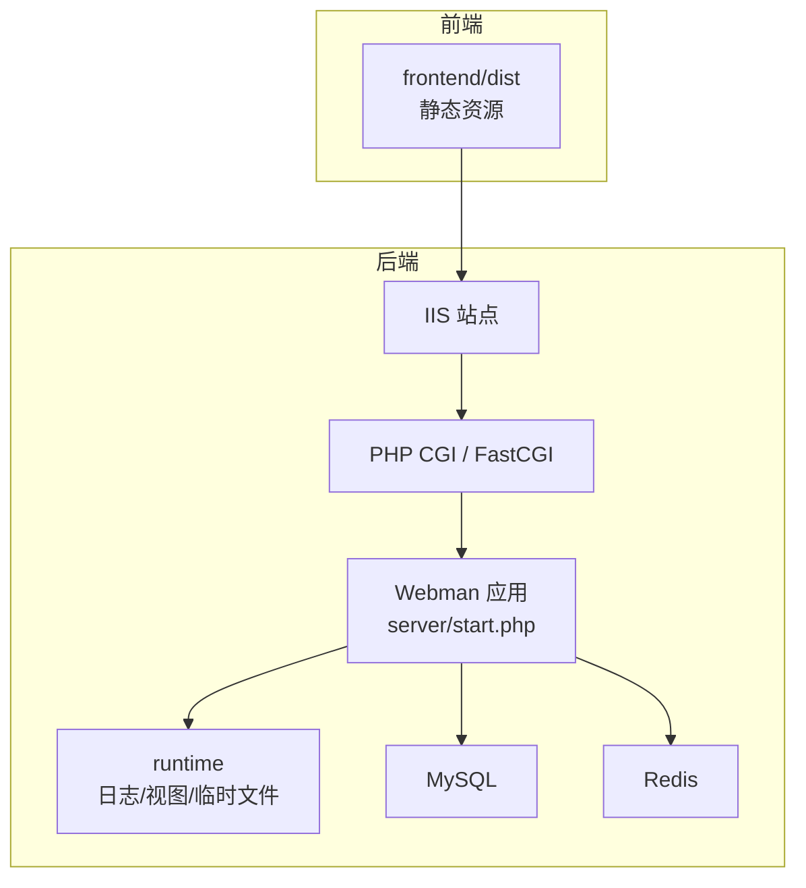
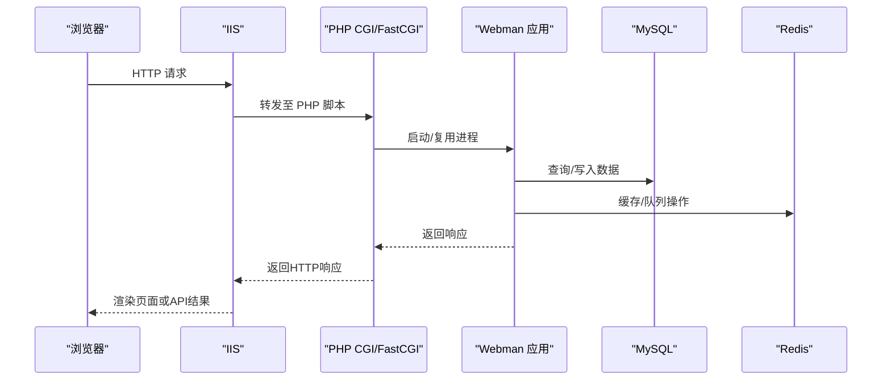
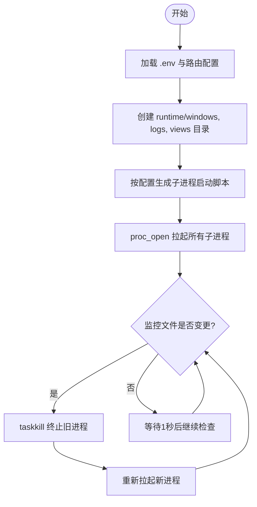
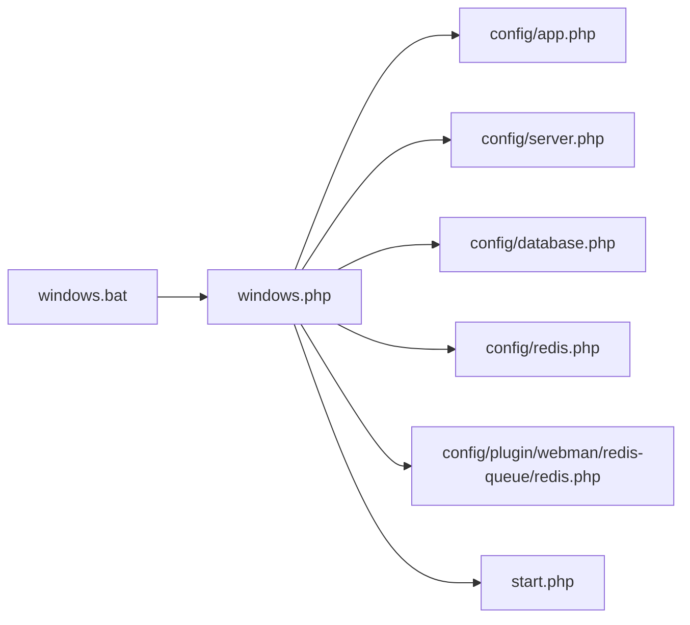

# Windows部署

<cite>
**本文引用的文件**   
- [windows.bat](file://server/windows.bat)
- [windows.php](file://server/windows.php)
- [start.php](file://server/start.php)
- [config/app.php](file://server/config/app.php)
- [config/server.php](file://server/config/server.php)
- [config/database.php](file://server/config/database.php)
- [config/redis.php](file://server/config/redis.php)
- [config/plugin/webman/redis-queue/redis.php](file://server/config/plugin/webman/redis-queue/redis.php)
</cite>

## 目录
1. [简介](#简介)
2. [项目结构](#项目结构)
3. [核心组件](#核心组件)
4. [架构总览](#架构总览)
5. [详细组件分析](#详细组件分析)
6. [依赖关系分析](#依赖关系分析)
7. [性能考虑](#性能考虑)
8. [故障排查指南](#故障排查指南)
9. [结论](#结论)
10. [附录](#附录)

## 简介
本指南面向在Windows Server上生产部署“积木云AI创作平台”的后端服务。后端基于Webman（Workerman）运行，采用PHP进程模型；前端为静态资源，可通过IIS直接托管。本文提供Windows环境准备、IIS配置、PHP CGI模式设置、MySQL与Redis安装配置、批处理脚本使用说明、Windows服务注册与开机自启动、环境变量与路径权限管理、常见问题与性能调优建议等完整流程。

## 项目结构
- 前端：构建产物位于 frontend/dist，作为静态站点由IIS托管。
- 后端：位于 server 目录，使用 Webman 框架，通过 PHP CLI 启动工作进程；Windows 下提供 windows.bat 和 windows.php 作为启动入口，运行时文件写入 runtime 目录。
- 配置：应用、服务器、数据库、缓存、队列等配置集中在 config 目录，支持 .env 环境变量注入。

[本节为概念性说明，不直接分析具体文件，故无“章节来源”]

## 核心组件
- 启动入口
  - windows.bat：设置控制台编码并调用 PHP 执行 windows.php。
  - windows.php：加载 .env 与路由配置，创建必要目录，生成各子进程启动脚本，统一拉起所有进程，并在文件变更时自动重启。
  - start.php：标准启动入口，加载框架并运行主进程。
- 配置中心
  - app.php：调试开关、错误报告级别、默认时区、public/runtime 路径等。
  - server.php：事件循环、停止超时、PID/状态/日志文件路径、最大包大小等。
  - database.php：MySQL连接池与连接参数，均从环境变量读取。
  - redis.php：Redis连接与连接池参数，均从环境变量读取。
  - plugin/webman/redis-queue/redis.php：队列使用的Redis连接与重试策略。

章节来源
- [windows.bat:1-3](file://server/windows.bat#L1-L3)
- [windows.php:1-137](file://server/windows.php#L1-L137)
- [start.php:1-6](file://server/start.php#L1-L6)
- [config/app.php:1-13](file://server/config/app.php#L1-L13)
- [config/server.php:1-12](file://server/config/server.php#L1-L12)
- [config/database.php:1-35](file://server/config/database.php#L1-L35)
- [config/redis.php:1-17](file://server/config/redis.php#L1-L17)
- [config/plugin/webman/redis-queue/redis.php:1-28](file://server/config/plugin/webman/redis-queue/redis.php#L1-L28)

## 架构总览
下图展示了Windows生产环境的请求链路：浏览器访问IIS站点，IIS将PHP请求转发给PHP CGI/FastCGI，再由Webman应用处理业务逻辑，读写MySQL与Redis，并将日志输出到runtime/logs。

[本节为概念性说明，不直接分析具体文件，故无“图表来源”]

## 详细组件分析

### Windows 启动流程与进程模型
- windows.bat 负责设置控制台编码并调用 PHP 执行 windows.php。
- windows.php 完成以下关键步骤：
  - 加载 .env 与路由配置，初始化应用。
  - 确保 runtime 目录下 windows、logs、views 等目录存在。
  - 根据配置动态生成各子进程启动脚本到 runtime/windows。
  - 使用 proc_open 拉起所有子进程，并通过 shell_exec(taskkill) 实现监控与热重载。
- start.php 是标准的Webman启动入口，用于实际业务进程。

图表来源
- [windows.php:15-21](file://server/windows.php#L15-L21)
- [windows.php:30-40](file://server/windows.php#L30-L40)
- [windows.php:42-62](file://server/windows.php#L42-L62)
- [windows.php:114-136](file://server/windows.php#L114-L136)

章节来源
- [windows.bat:1-3](file://server/windows.bat#L1-L3)
- [windows.php:1-137](file://server/windows.php#L1-L137)
- [start.php:1-6](file://server/start.php#L1-L6)

### 环境变量与路径配置
- 应用与环境
  - APP_DEBUG：控制调试模式。
  - 时区：Asia/Shanghai（可在 app.php 中确认）。
  - public_path、runtime_path：分别指向 public 与 runtime 目录。
- 服务器
  - pid_file、status_file、stdout_file、log_file：位于 runtime 目录下的不同位置。
  - max_package_size：默认10MB。
- 数据库（MySQL）
  - DB_HOST、DB_PORT、DB_NAME、DB_USER、DB_PASS、DB_CHARSET、DB_PREFIX。
  - 连接池参数：max_connections、min_connections、wait_timeout、idle_timeout、heartbeat_interval。
- Redis
  - REDIS_HOST、REDIS_PASSWORD、REDIS_PORT、REDIS_DB、REDIS_PREFIX。
  - 连接池参数：同上。
- 队列（webman redis-queue）
  - 使用相同的环境变量，并支持重试次数与间隔。

章节来源
- [config/app.php:1-13](file://server/config/app.php#L1-L13)
- [config/server.php:1-12](file://server/config/server.php#L1-L12)
- [config/database.php:1-35](file://server/config/database.php#L1-L35)
- [config/redis.php:1-17](file://server/config/redis.php#L1-L17)
- [config/plugin/webman/redis-queue/redis.php:1-28](file://server/config/plugin/webman/redis-queue/redis.php#L1-L28)

### 数据库与缓存集成
- MySQL
  - 驱动为 mysql，字符集 utf8mb4，前缀 xb_。
  - 连接池参数适用于协程环境，需确保PDO预编译关闭以兼容。
- Redis
  - 默认本地连接，可配置密码与库号。
  - 队列插件支持 auth、db、prefix 以及失败重试策略。

章节来源
- [config/database.php:1-35](file://server/config/database.php#L1-L35)
- [config/redis.php:1-17](file://server/config/redis.php#L1-L17)
- [config/plugin/webman/redis-queue/redis.php:1-28](file://server/config/plugin/webman/redis-queue/redis.php#L1-L28)

### IIS 与 PHP CGI 配置要点
- 站点根目录
  - 前端静态站点：指向 frontend/dist。
  - API 站点：指向 server/public（若需要反向代理到Webman端口，请结合后续“反向代理”小节）。
- PHP CGI/FastCGI
  - 添加处理器映射，将 .php 请求交由 php-cgi.exe 处理。
  - 指定可执行路径与模块名称。
- URL重写
  - 如需统一入口，可配置规则将所有非静态资源请求转发至 index.php。
- 静态文件
  - 启用静态内容模块，压缩可选开启以提升带宽效率。

[本节为通用配置指导，不直接分析具体文件，故无“章节来源”]

### 反向代理与端口规划
- 方案A：IIS仅托管静态前端，API由Webman独立监听端口（如8080），通过IIS反向代理将 /api 转发到后端。
- 方案B：IIS同时托管静态与PHP接口（传统方式），但本项目主要使用Webman进程模型，推荐方案A。

[本节为通用配置指导，不直接分析具体文件，故无“章节来源”]

### 批处理脚本使用说明
- 双击运行 server/windows.bat 即可在当前控制台窗口启动所有子进程。
- 该脚本会设置UTF-8编码并调用 PHP 执行 windows.php。
- 适合开发与测试环境快速验证；生产环境建议使用Windows服务或任务计划程序。

章节来源
- [windows.bat:1-3](file://server/windows.bat#L1-L3)
- [windows.php:1-137](file://server/windows.php#L1-L137)

### Windows 服务注册与开机自启动
- 使用 nssm 将 PHP 进程注册为系统服务：
  - 下载并安装 nssm。
  - 以服务形式注册 PHP 执行器，指向 windows.php 所在目录，并设置工作目录为 server。
  - 配置服务账户为具有足够权限的本地账户或专用服务账户。
  - 设置为“自动”启动类型，确保开机自启。
- 或使用任务计划程序：
  - 新建任务，触发器选择“计算机启动时”，操作选择“启动程序”，程序填写 php.exe，参数填写 windows.php，起始于填写 server 目录。
- 注意：
  - 确保服务账户对 runtime 目录具备读写权限。
  - 防火墙放行Webman监听端口（若使用反向代理）。

[本节为通用配置指导，不直接分析具体文件，故无“章节来源”]

### 权限管理与路径要求
- 必须可写目录
  - runtime（含 logs、views、windows、tmp 等子目录）。
  - 上传目录（若使用本地存储，需在对应插件配置中指定可写路径）。
- 建议权限
  - 为服务账户授予“修改”权限，避免每次部署后手动赋权。
  - 禁止对外暴露 runtime 目录。

[本节为通用配置指导，不直接分析具体文件，故无“章节来源”]

## 依赖关系分析
- 外部依赖
  - PHP：需启用必要的扩展（如 PDO_MySQL、Redis、OpenSSL、PCNTL等，视插件需求而定）。
  - MySQL：提供数据库连接。
  - Redis：提供缓存与队列能力。
- 内部依赖
  - windows.php 依赖 config/* 中的各项配置。
  - 数据库与Redis连接参数均来自 .env 环境变量。

图表来源
- [windows.bat:1-3](file://server/windows.bat#L1-L3)
- [windows.php:1-137](file://server/windows.php#L1-L137)
- [config/app.php:1-13](file://server/config/app.php#L1-L13)
- [config/server.php:1-12](file://server/config/server.php#L1-L12)
- [config/database.php:1-35](file://server/config/database.php#L1-L35)
- [config/redis.php:1-17](file://server/config/redis.php#L1-L17)
- [config/plugin/webman/redis-queue/redis.php:1-28](file://server/config/plugin/webman/redis-queue/redis.php#L1-L28)
- [start.php:1-6](file://server/start.php#L1-L6)

章节来源
- [windows.php:1-137](file://server/windows.php#L1-L137)
- [config/app.php:1-13](file://server/config/app.php#L1-L13)
- [config/server.php:1-12](file://server/config/server.php#L1-L12)
- [config/database.php:1-35](file://server/config/database.php#L1-L35)
- [config/redis.php:1-17](file://server/config/redis.php#L1-L17)
- [config/plugin/webman/redis-queue/redis.php:1-28](file://server/config/plugin/webman/redis-queue/redis.php#L1-L28)
- [start.php:1-6](file://server/start.php#L1-L6)

## 性能考虑
- 进程与线程
  - 合理设置Webman工作进程数，依据CPU核数与负载调整。
  - 避免过多进程导致上下文切换开销。
- 连接池
  - MySQL与Redis连接池参数需根据并发量与实例规格调优，防止连接耗尽或空闲浪费。
- 日志与磁盘IO
  - 生产环境建议关闭不必要的调试日志，定期轮转日志文件。
  - 将runtime目录置于高性能磁盘（SSD）。
- 网络与IIS
  - 启用HTTP压缩、静态缓存、Keep-Alive。
  - 反向代理层优化缓冲与超时参数。
- 内存与GC
  - 监控PHP内存使用，必要时调整opcache与GC阈值。

[本节为通用性能建议，不直接分析具体文件，故无“章节来源”]

## 故障排查指南
- 无法加载 .env
  - 确认 .env 位于 server 根目录，且Dotenv可用。
- 目录权限不足
  - 检查 runtime 及其子目录是否可写。
- 数据库连接失败
  - 核对 DB_* 环境变量与MySQL服务状态、防火墙规则。
- Redis连接失败
  - 核对 REDIS_* 环境变量与Redis服务状态。
- 进程未拉起或频繁重启
  - 查看 runtime/logs 下的 stdout.log 与 workerman.log。
  - 检查 windows.php 监控逻辑是否正确终止旧进程。
- 端口冲突
  - 确认Webman监听端口未被占用，IIS反向代理端口正确。

章节来源
- [windows.php:15-21](file://server/windows.php#L15-L21)
- [windows.php:30-40](file://server/windows.php#L30-L40)
- [windows.php:114-136](file://server/windows.php#L114-L136)
- [config/server.php:1-12](file://server/config/server.php#L1-L12)
- [config/database.php:1-35](file://server/config/database.php#L1-L35)
- [config/redis.php:1-17](file://server/config/redis.php#L1-L17)

## 结论
通过在Windows Server上正确配置IIS、PHP CGI、MySQL与Redis，并使用提供的启动脚本或服务化方案，可实现稳定高效的“积木云AI创作平台”生产部署。建议在生产环境中采用Windows服务或任务计划程序进行进程管理，严格管理环境变量与目录权限，并结合监控与日志进行持续优化。

[本节为总结性内容，不直接分析具体文件，故无“章节来源”]

## 附录
- 常用环境变量清单
  - APP_DEBUG、DB_HOST、DB_PORT、DB_NAME、DB_USER、DB_PASS、DB_CHARSET、DB_PREFIX
  - REDIS_HOST、REDIS_PASSWORD、REDIS_PORT、REDIS_DB、REDIS_PREFIX
- 关键路径
  - public：静态资源根目录
  - runtime：日志、视图、临时文件与进程脚本输出目录
- 参考文件
  - 启动脚本：server/windows.bat、server/windows.php、server/start.php
  - 配置：server/config/app.php、server/config/server.php、server/config/database.php、server/config/redis.php、server/config/plugin/webman/redis-queue/redis.php

章节来源
- [windows.bat:1-3](file://server/windows.bat#L1-L3)
- [windows.php:1-137](file://server/windows.php#L1-L137)
- [start.php:1-6](file://server/start.php#L1-L6)
- [config/app.php:1-13](file://server/config/app.php#L1-L13)
- [config/server.php:1-12](file://server/config/server.php#L1-L12)
- [config/database.php:1-35](file://server/config/database.php#L1-L35)
- [config/redis.php:1-17](file://server/config/redis.php#L1-L17)
- [config/plugin/webman/redis-queue/redis.php:1-28](file://server/config/plugin/webman/redis-queue/redis.php#L1-L28)