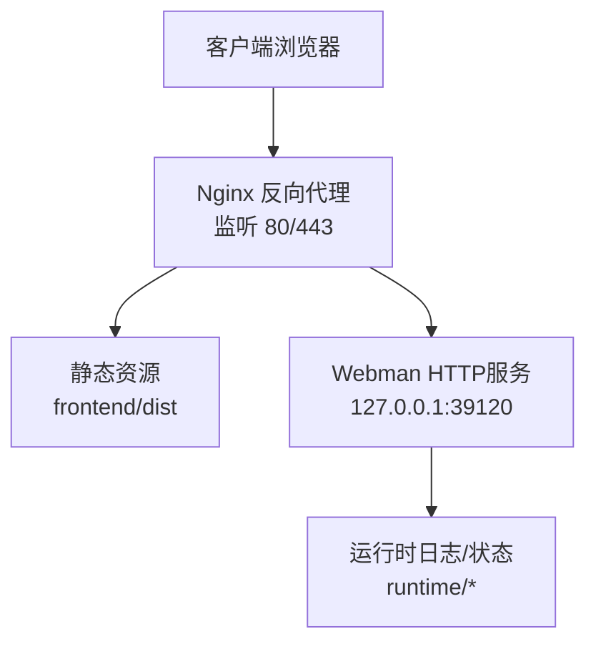
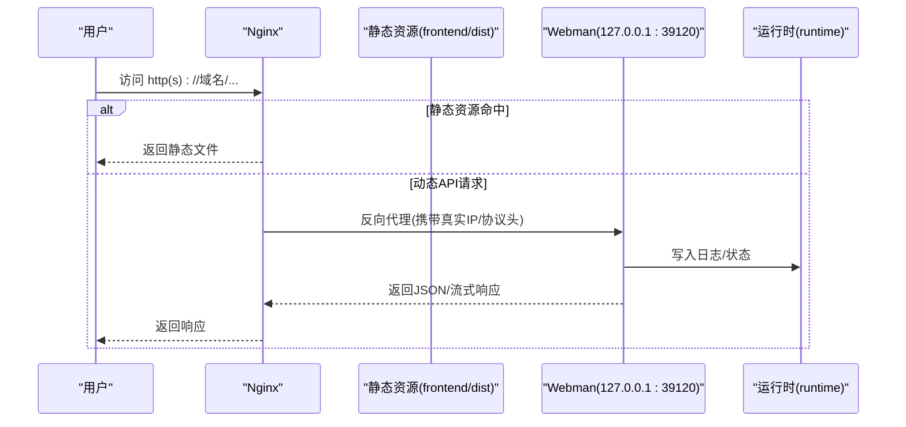
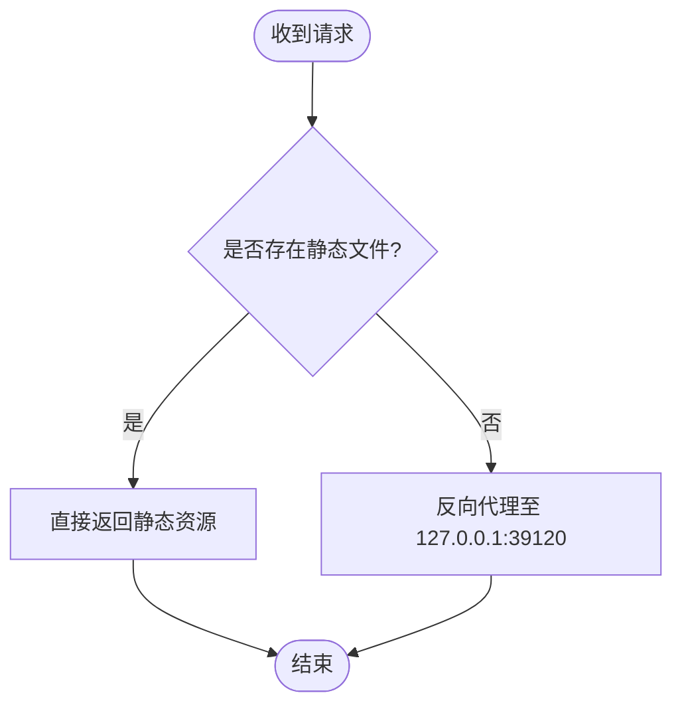
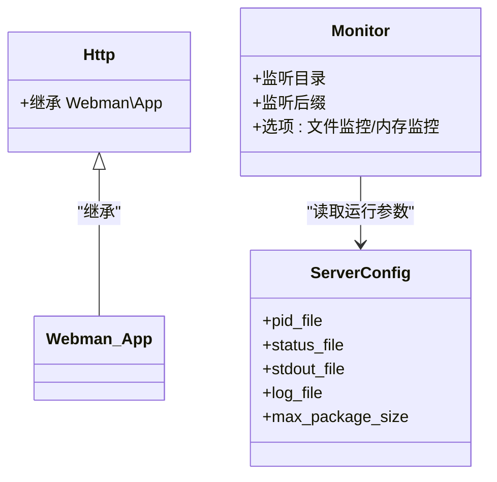
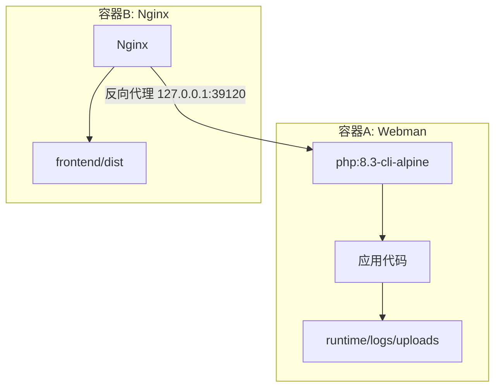
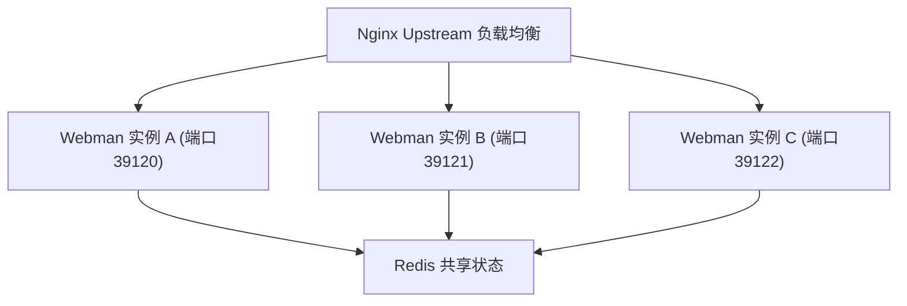
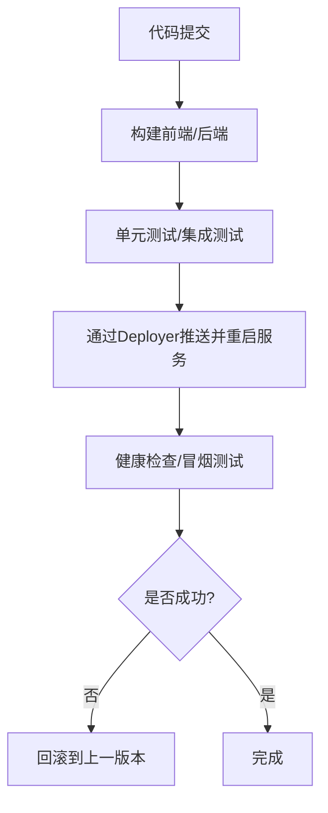
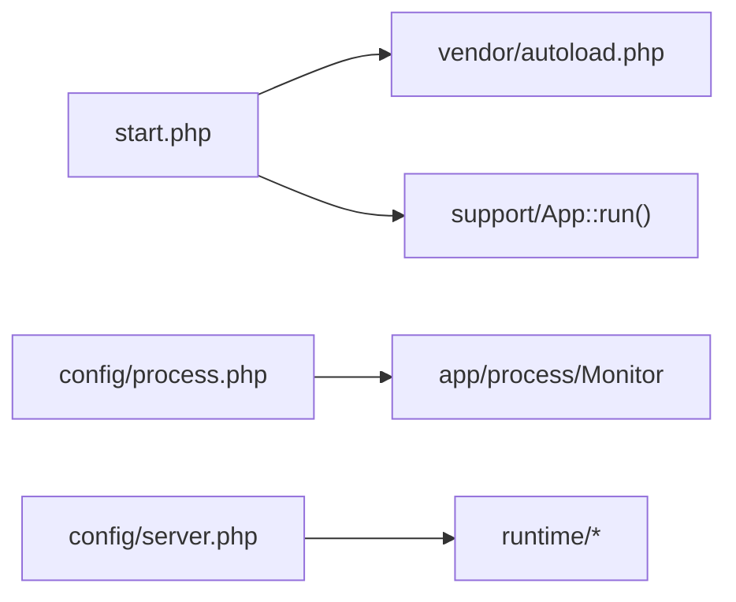

# 生产部署

<cite>
**本文引用的文件**   
- [server/nginx.conf](file://server/nginx.conf)
- [server/config/server.php](file://server/config/server.php)
- [server/start.php](file://server/start.php)
- [server/config/process.php](file://server/config/process.php)
- [server/app/process/Http.php](file://server/app/process/Http.php)
- [server/windows.bat](file://server/windows.bat)
- [server/vendor/deployer/deployer/Dockerfile](file://server/vendor/deployer/deployer/Dockerfile)
</cite>

## 目录
1. [简介](#简介)
2. [项目结构](#项目结构)
3. [核心组件](#核心组件)
4. [架构总览](#架构总览)
5. [详细组件分析](#详细组件分析)
6. [依赖分析](#依赖分析)
7. [性能考虑](#性能考虑)
8. [故障排查指南](#故障排查指南)
9. [结论](#结论)
10. [附录](#附录)

## 简介
本指南面向“积木云AI创作平台”的生产环境部署，覆盖以下关键主题：
- Nginx反向代理与静态资源优化
- Webman进程管理与监控
- SSL证书配置与域名绑定
- Linux与Windows服务器部署步骤
- Docker容器化方案
- 负载均衡与高可用架构设计
- 自动化部署脚本与CI/CD流水线示例

说明：本文所有技术细节均基于仓库内现有配置文件与启动入口进行解读与扩展建议，不包含未在本仓库中出现的代码片段。

## 项目结构
本项目采用前后端分离的常见形态：
- 前端：构建产物位于 frontend/dist，由Nginx直接提供静态资源
- 后端：Webman应用位于 server 目录，通过 start.php 启动，监听本地端口（默认39120）
- 反向代理：server/nginx.conf 提供伪静态与反向代理规则，将动态请求转发至Webman

图示来源
- [server/nginx.conf:1-12](file://server/nginx.conf#L1-L12)
- [server/config/server.php:1-12](file://server/config/server.php#L1-L12)

章节来源
- [server/nginx.conf:1-12](file://server/nginx.conf#L1-L12)
- [server/config/server.php:1-12](file://server/config/server.php#L1-L12)

## 核心组件
- Nginx反向代理与伪静态
  - 作用：对外暴露HTTP/HTTPS，静态资源直出，非静态请求反向代理到Webman
  - 关键点：关闭proxy_buffering以支持长连接/流式响应；设置X-Real-IP、Host、X-Forwarded-Proto等头部；当请求路径不存在对应静态文件时转发至后端
- Webman进程管理
  - 启动入口：start.php
  - 进程配置：process.php 定义monitor进程，用于开发期热重载与内存监控
  - 运行参数：server.php 定义pid_file、status_file、stdout_file、log_file、max_package_size等
- Windows启动脚本
  - windows.bat 调用 windows.php 启动Webman

章节来源
- [server/nginx.conf:1-12](file://server/nginx.conf#L1-L12)
- [server/start.php:1-6](file://server/start.php#L1-L6)
- [server/config/process.php:1-43](file://server/config/process.php#L1-L43)
- [server/config/server.php:1-12](file://server/config/server.php#L1-L12)
- [server/windows.bat:1-3](file://server/windows.bat#L1-L3)

## 架构总览
下图展示生产环境的典型数据流：Nginx作为统一入口，静态资源直接返回，API请求经反向代理进入Webman进程，Webman读写数据库、缓存与对象存储（根据插件配置）。

图示来源
- [server/nginx.conf:1-12](file://server/nginx.conf#L1-L12)
- [server/config/server.php:1-12](file://server/config/server.php#L1-L12)

## 详细组件分析

### Nginx反向代理与静态资源优化
- 反向代理策略
  - 当请求路径在磁盘上存在对应静态文件时，直接返回
  - 否则将请求转发至本地Webman服务（127.0.0.1:39120）
- 关键头部
  - X-Real-IP、Host、X-Forwarded-Proto 确保后端能感知真实客户端信息与协议
- 流式/长连接
  - 关闭 proxy_buffering 有利于SSE/流式输出场景
- 静态资源优化建议
  - 启用Gzip/Brotli压缩
  - 为静态资源设置长期缓存与版本化文件名
  - 使用CDN加速前端资源
  - 合理设置expires/Cache-Control

图示来源
- [server/nginx.conf:1-12](file://server/nginx.conf#L1-L12)

章节来源
- [server/nginx.conf:1-12](file://server/nginx.conf#L1-L12)

### Webman进程管理与监控
- 启动流程
  - 执行 start.php 加载自动加载器并启动应用
- 进程模型
  - process.php 注册 monitor 进程，监听应用目录、配置、插件目录（调试模式）及特定后缀变更，实现热重载
  - 在非调试或Windows环境下可禁用文件/内存监控以提升稳定性
- 运行参数
  - server.php 指定PID文件、状态文件、标准输出与日志文件路径，以及最大包大小
- 进程类
  - app/process/Http.php 继承Webman\App，作为HTTP服务进程基类

图示来源
- [server/app/process/Http.php:1-10](file://server/app/process/Http.php#L1-L10)
- [server/config/process.php:1-43](file://server/config/process.php#L1-L43)
- [server/config/server.php:1-12](file://server/config/server.php#L1-L12)

章节来源
- [server/start.php:1-6](file://server/start.php#L1-L6)
- [server/config/process.php:1-43](file://server/config/process.php#L1-L43)
- [server/config/server.php:1-12](file://server/config/server.php#L1-L12)
- [server/app/process/Http.php:1-10](file://server/app/process/Http.php#L1-L10)

### Windows服务器部署
- 使用 windows.bat 启动Webman（内部调用windows.php）
- 注意事项
  - 确保PHP CLI已加入系统PATH
  - 确认端口39120未被占用
  - 如需开机自启，可使用任务计划程序或第三方进程守护工具

章节来源
- [server/windows.bat:1-3](file://server/windows.bat#L1-L3)

### Docker容器化方案
- 基础镜像
  - 使用 php:8.3-cli-alpine 作为基础镜像
- 安装依赖
  - 安装 bash、git、openssh-client、rsync 等常用工具
- 工作目录与入口
  - 工作目录 /app，入口为 deployer.phar（用于自动化部署）
- 建议
  - 将Webman应用与Nginx拆分为两个容器，通过Docker Compose编排
  - 将 runtime、logs、uploads 等持久化目录挂载到宿主机或卷

图示来源
- [server/vendor/deployer/deployer/Dockerfile:1-10](file://server/vendor/deployer/deployer/Dockerfile#L1-L10)

章节来源
- [server/vendor/deployer/deployer/Dockerfile:1-10](file://server/vendor/deployer/deployer/Dockerfile#L1-L10)

### 负载均衡与高可用架构设计
- 多实例部署
  - 在同一台或多台服务器上启动多个Webman实例（不同端口），由Nginx upstream轮询分发
- 会话与状态共享
  - 使用Redis集中存储Session/队列/缓存，避免进程间状态不一致
- 健康检查与滚动更新
  - 结合Nginx健康检查与灰度发布策略，逐步替换旧实例
- 日志与监控
  - 集中收集Nginx与Webman日志，接入ELK/ Loki等
  - 采集进程状态与指标，配合告警

[此图为概念性架构图，不直接映射具体源码文件]

### 自动化部署脚本与CI/CD流水线示例
- 部署工具
  - 仓库包含 Deployer 的Docker镜像定义，可用于构建部署环境
- 建议流水线
  - 代码提交触发CI
  - 构建前端静态资源并上传至对象存储/CDN
  - 打包后端代码，通过Deployer推送到目标服务器
  - 重启Webman进程并验证健康检查
  - 回滚策略：保留上一版本快照，失败即回滚

[此图为概念性流程图，不直接映射具体源码文件]

## 依赖分析
- 外部依赖
  - Nginx：负责反向代理与静态资源服务
  - PHP CLI：运行Webman
  - Redis/MySQL/对象存储：根据插件配置使用（如xbUpload系列、xbUser等）
- 内部依赖
  - start.php 依赖 vendor/autoload.php 与应用引导
  - process.php 依赖应用目录结构与环境变量
  - server.php 定义运行时路径与日志位置

图示来源
- [server/start.php:1-6](file://server/start.php#L1-L6)
- [server/config/process.php:1-43](file://server/config/process.php#L1-L43)
- [server/config/server.php:1-12](file://server/config/server.php#L1-L12)

章节来源
- [server/start.php:1-6](file://server/start.php#L1-L6)
- [server/config/process.php:1-43](file://server/config/process.php#L1-L43)
- [server/config/server.php:1-12](file://server/config/server.php#L1-L12)

## 性能考虑
- Nginx层
  - 开启Gzip/Brotli压缩，合理设置expires与Cache-Control
  - 对大文件上传启用分块传输与超时调优
  - 调整worker_processes与worker_connections
- Webman层
  - 根据CPU核数调整进程数
  - 合理设置 max_package_size 与缓冲区
  - 关闭不必要的监控（生产环境）
- 中间件与插件
  - 减少同步阻塞操作，异步任务放入队列
  - 热点数据缓存至Redis
- 资源与I/O
  - 静态资源走CDN
  - 日志落盘与轮转，避免磁盘IO瓶颈

[本节为通用指导，不直接分析具体文件]

## 故障排查指南
- 无法访问站点
  - 检查Nginx是否监听80/443，SSL证书是否正确
  - 检查反向代理地址与端口是否与Webman一致
- 动态请求返回404
  - 确认静态文件路径与Nginx location匹配
  - 检查Webman是否正常运行且端口可达
- 日志定位
  - 查看Webman stdout与workerman日志路径
  - 查看Nginx错误日志与访问日志
- 进程异常退出
  - 检查PID文件与权限
  - 检查内存监控与OOM情况

章节来源
- [server/config/server.php:1-12](file://server/config/server.php#L1-L12)
- [server/nginx.conf:1-12](file://server/nginx.conf#L1-L12)

## 结论
通过Nginx反向代理与Webman进程模型的组合，可实现高性能、可扩展的后端服务。结合静态资源优化、SSL与域名绑定、Docker容器化与CI/CD流水线，能够构建稳定可靠的生产环境。建议在大规模场景下引入多实例负载均衡与集中化监控日志体系，进一步提升可用性。

[本节为总结性内容，不直接分析具体文件]

## 附录
- 快速核对清单
  - Nginx反向代理指向 127.0.0.1:39120
  - 静态资源路径正确且缓存策略生效
  - Webman进程正常启动，PID/状态文件可写
  - 日志路径存在并可轮转
  - 防火墙放行80/443端口
  - 域名解析与SSL证书配置正确

[本节为补充信息，不直接分析具体文件]