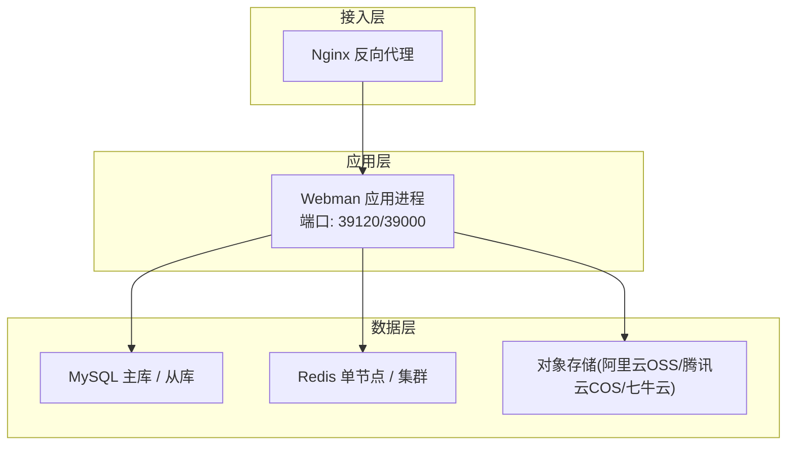
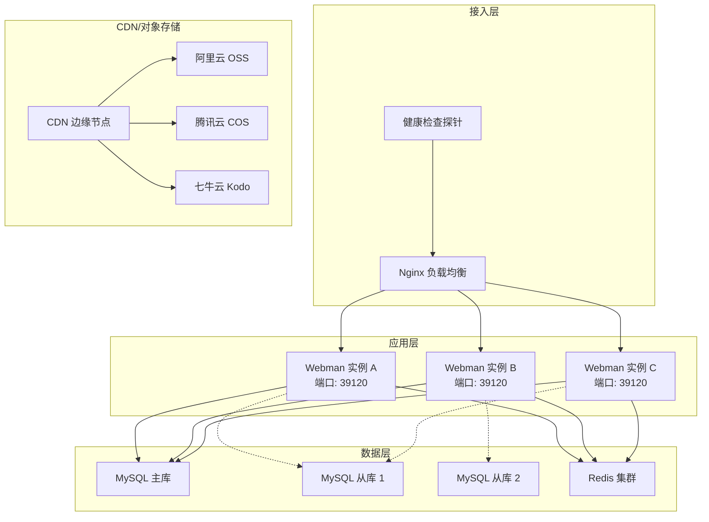
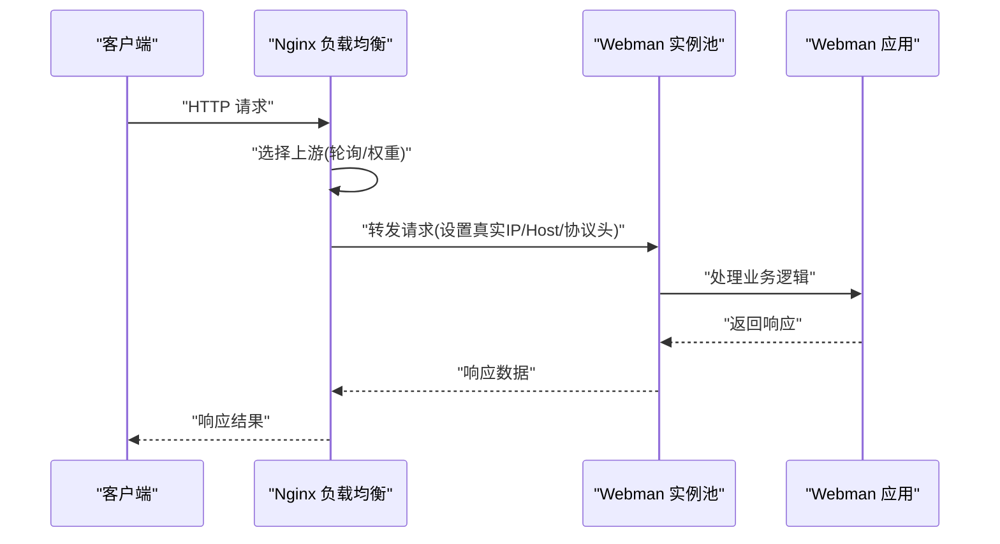
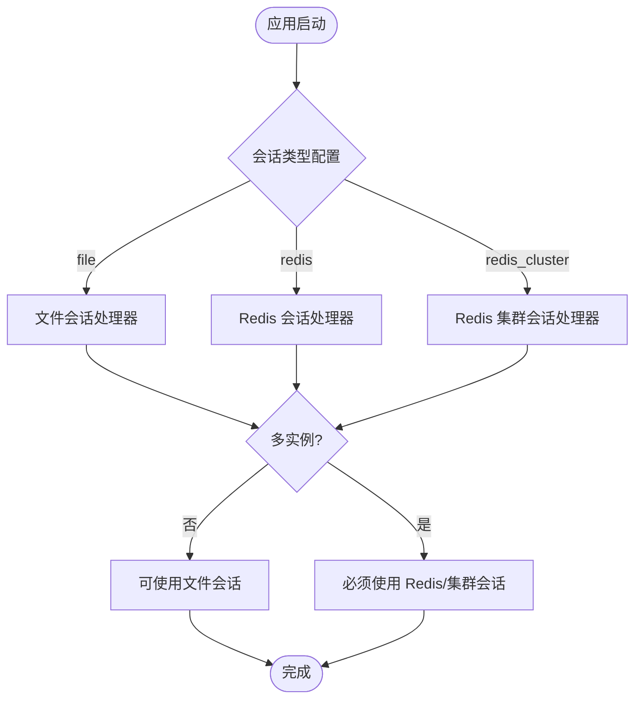
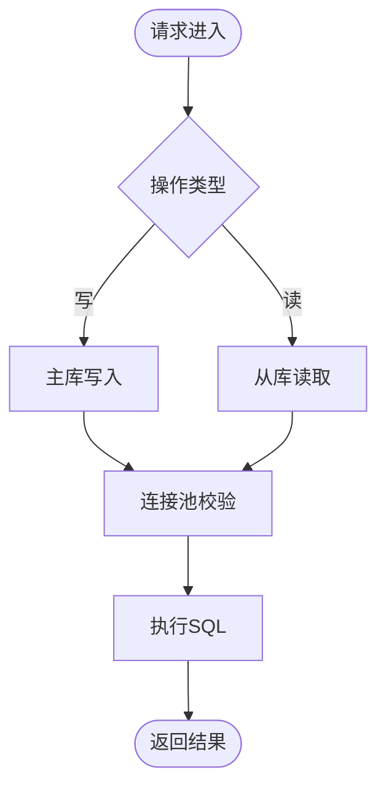
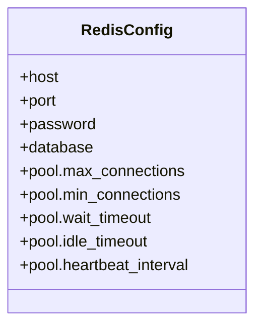
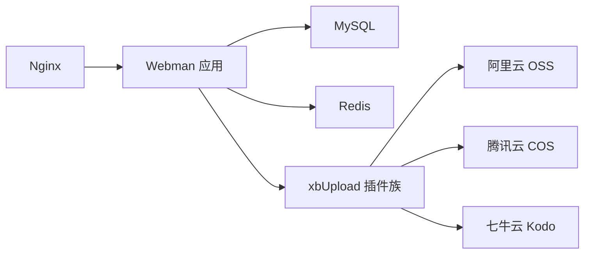

# 负载均衡与高可用

<cite>
**本文引用的文件**
- [server/nginx.conf](file://server/nginx.conf)
- [server/plugin/xbCode/nginx.conf](file://server/plugin/xbCode/nginx.conf)
- [server/config/database.php](file://server/config/database.php)
- [server/config/redis.php](file://server/config/redis.php)
- [server/config/session.php](file://server/config/session.php)
- [server/config/server.php](file://server/config/server.php)
- [server/plugin/xbUploadCos/README.md](file://server/plugin/xbUploadCos/README.md)
- [server/plugin/xbUploadOss/README.md](file://server/plugin/xbUploadOss/README.md)
- [server/plugin/xbUploadQiniu/README.md](file://server/plugin/xbUploadQiniu/README.md)
</cite>

## 目录
1. [引言](#引言)
2. [项目结构](#项目结构)
3. [核心组件](#核心组件)
4. [架构总览](#架构总览)
5. [详细组件分析](#详细组件分析)
6. [依赖关系分析](#依赖关系分析)
7. [性能考量](#性能考量)
8. [故障排查指南](#故障排查指南)
9. [结论](#结论)
10. [附录](#附录)

## 引言
本方案面向积木云AI创作平台，围绕“负载均衡与高可用”目标，给出基于 Nginx 的负载均衡配置、多实例部署架构、会话共享、数据库主从复制与 Redis 集群方案，并补充 CDN 静态资源加速、反向代理优化与故障转移策略。同时提供监控告警体系搭建与自动化扩缩容建议，帮助平台在流量增长与故障场景下保持稳定与高性能。

## 项目结构
仓库包含前端构建产物与后端 Webman 应用，以及若干插件（如存储引擎、用户、任务队列等）。与负载均衡和高可用直接相关的配置集中在 server 目录下：
- Nginx 反向代理与伪静态规则位于 server/nginx.conf 与 server/plugin/xbCode/nginx.conf
- 数据库连接池与连接参数位于 server/config/database.php
- Redis 连接与连接池位于 server/config/redis.php
- 会话存储类型与处理器位于 server/config/session.php
- Webman 进程与日志路径位于 server/config/server.php
- 对象存储插件文档说明支持 CDN 加速与高可用能力

图表来源
- [server/nginx.conf:1-12](file://server/nginx.conf#L1-L12)
- [server/plugin/xbCode/nginx.conf:1-12](file://server/plugin/xbCode/nginx.conf#L1-L12)
- [server/config/database.php:1-35](file://server/config/database.php#L1-L35)
- [server/config/redis.php:1-17](file://server/config/redis.php#L1-L17)
- [server/config/session.php:1-66](file://server/config/session.php#L1-L66)
- [server/config/server.php:1-12](file://server/config/server.php#L1-L12)

章节来源
- [server/nginx.conf:1-12](file://server/nginx.conf#L1-L12)
- [server/plugin/xbCode/nginx.conf:1-12](file://server/plugin/xbCode/nginx.conf#L1-L12)
- [server/config/database.php:1-35](file://server/config/database.php#L1-L35)
- [server/config/redis.php:1-17](file://server/config/redis.php#L1-L17)
- [server/config/session.php:1-66](file://server/config/session.php#L1-L66)
- [server/config/server.php:1-12](file://server/config/server.php#L1-L12)

## 核心组件
- Nginx 反向代理：负责将请求转发至后端 Webman 进程，设置真实 IP、Host、协议头，关闭缓冲以提升长连接与流式响应体验。
- Webman 应用：基于协程的高性能 PHP 框架，通过配置文件管理数据库、Redis、会话、进程与日志。
- 数据库连接池：通过 PDO 选项与连接池参数控制最大/最小连接数、等待超时、空闲回收与心跳检测。
- Redis 连接池：为缓存、队列与会话提供快速访问，支持连接池参数调优。
- 会话存储：默认文件型，可切换为 Redis 或 Redis 集群以实现多实例会话共享。
- 对象存储与 CDN：通过 xbUpload 系列插件对接阿里云 OSS、腾讯云 COS、七牛云 Kodo，结合 CDN 实现静态资源加速与高可用。

章节来源
- [server/nginx.conf:1-12](file://server/nginx.conf#L1-L12)
- [server/plugin/xbCode/nginx.conf:1-12](file://server/plugin/xbCode/nginx.conf#L1-L12)
- [server/config/database.php:1-35](file://server/config/database.php#L1-L35)
- [server/config/redis.php:1-17](file://server/config/redis.php#L1-L17)
- [server/config/session.php:1-66](file://server/config/session.php#L1-L66)
- [server/config/server.php:1-12](file://server/config/server.php#L1-L12)
- [server/plugin/xbUploadCos/README.md:1-183](file://server/plugin/xbUploadCos/README.md#L1-L183)
- [server/plugin/xbUploadOss/README.md:1-220](file://server/plugin/xbUploadOss/README.md#L1-L220)
- [server/plugin/xbUploadQiniu/README.md:1-194](file://server/plugin/xbUploadQiniu/README.md#L1-L194)

## 架构总览
下图展示生产环境推荐的多实例部署与高可用拓扑：Nginx 作为入口，轮询多个 Webman 实例；数据库采用主从复制，读多写少场景可引入只读从库；Redis 使用集群模式保障缓存与会话的高可用；静态资源通过对象存储与 CDN 分发。

图表来源
- [server/nginx.conf:1-12](file://server/nginx.conf#L1-L12)
- [server/plugin/xbCode/nginx.conf:1-12](file://server/plugin/xbCode/nginx.conf#L1-L12)
- [server/config/database.php:1-35](file://server/config/database.php#L1-L35)
- [server/config/redis.php:1-17](file://server/config/redis.php#L1-L17)
- [server/config/session.php:1-66](file://server/config/session.php#L1-L66)
- [server/plugin/xbUploadCos/README.md:1-183](file://server/plugin/xbUploadCos/README.md#L1-L183)
- [server/plugin/xbUploadOss/README.md:1-220](file://server/plugin/xbUploadOss/README.md#L1-L220)
- [server/plugin/xbUploadQiniu/README.md:1-194](file://server/plugin/xbUploadQiniu/README.md#L1-L194)

## 详细组件分析

### Nginx 负载均衡与健康检查
- 当前配置以反向代理方式将非静态文件请求转发到本地 Webman 进程（端口 39120 或 39000），并设置 X-Real-IP、Host、X-Forwarded-Proto 等关键头部，关闭 proxy_buffering 以适配流式响应。
- 生产环境建议：
  - 定义 upstream 组，包含多个 Webman 实例地址，启用轮询或加权轮询。
  - 添加健康检查（主动探测或被动剔除）与故障转移，确保异常实例自动摘除。
  - 针对长连接与 WebSocket 场景，保持 HTTP/1.1 与 Connection 头透传。

图表来源
- [server/nginx.conf:1-12](file://server/nginx.conf#L1-L12)
- [server/plugin/xbCode/nginx.conf:1-12](file://server/plugin/xbCode/nginx.conf#L1-L12)

章节来源
- [server/nginx.conf:1-12](file://server/nginx.conf#L1-L12)
- [server/plugin/xbCode/nginx.conf:1-12](file://server/plugin/xbCode/nginx.conf#L1-L12)

### 多实例部署与会话共享
- 多实例部署：在同一主机或不同主机上启动多个 Webman 进程，监听相同端口，由 Nginx 进行负载分担。
- 会话共享：
  - 默认使用文件型会话处理器，不适合多实例共享。
  - 建议切换为 Redis 或 Redis 集群会话处理器，使所有实例共享同一会话存储，避免跨实例登录态丢失。
  - 会话生命周期、Cookie 作用域与安全属性可在 session 配置中统一调整。

图表来源
- [server/config/session.php:1-66](file://server/config/session.php#L1-L66)

章节来源
- [server/config/session.php:1-66](file://server/config/session.php#L1-L66)

### 数据库主从复制与读写分离
- 当前数据库配置包含连接池参数（最大/最小连接数、等待超时、空闲回收、心跳间隔），适用于高并发场景下的连接复用与稳定性。
- 主从复制建议：
  - 主库承担写入，从库承担读取，应用层根据操作类型路由到对应库。
  - 通过环境变量或配置中心动态切换读写库地址，保证弹性与一致性。
  - 关注主从延迟对读一致性的影响，必要时引入强一致读或缓存兜底。

图表来源
- [server/config/database.php:1-35](file://server/config/database.php#L1-L35)

章节来源
- [server/config/database.php:1-35](file://server/config/database.php#L1-L35)

### Redis 集群配置
- 当前 Redis 配置提供单节点连接与连接池参数，适合中小规模场景。
- 生产环境建议：
  - 使用 Redis 集群模式，提升吞吐与可用性，避免单点故障。
  - 合理设置 max/min 连接数、等待超时、空闲回收与心跳间隔，匹配业务峰值。
  - 对于会话、热点缓存与分布式锁，优先使用集群以避免热点倾斜。

图表来源
- [server/config/redis.php:1-17](file://server/config/redis.php#L1-L17)

章节来源
- [server/config/redis.php:1-17](file://server/config/redis.php#L1-L17)

### CDN 静态资源加速与反向代理优化
- 静态资源建议托管至对象存储（阿里云 OSS、腾讯云 COS、七牛云 Kodo），并通过 CDN 边缘节点加速，降低源站压力与延迟。
- 反向代理优化要点：
  - 关闭 proxy_buffering 以适配流式输出与长连接。
  - 透传真实客户端 IP、Host 与协议头，便于鉴权与审计。
  - 针对大文件上传/下载，考虑分片与断点续传，配合对象存储直传。

章节来源
- [server/plugin/xbUploadCos/README.md:1-183](file://server/plugin/xbUploadCos/README.md#L1-L183)
- [server/plugin/xbUploadOss/README.md:1-220](file://server/plugin/xbUploadOss/README.md#L1-L220)
- [server/plugin/xbUploadQiniu/README.md:1-194](file://server/plugin/xbUploadQiniu/README.md#L1-L194)
- [server/nginx.conf:1-12](file://server/nginx.conf#L1-L12)
- [server/plugin/xbCode/nginx.conf:1-12](file://server/plugin/xbCode/nginx.conf#L1-L12)

### 故障转移策略
- Nginx 层：
  - 对上游实例进行健康检查，失败时自动剔除，恢复后自动加入。
  - 配置重试与降级策略，对关键接口设置超时与熔断阈值。
- 应用层：
  - 数据库连接失败时回退到只读从库或缓存，避免雪崩。
  - Redis 不可用时，降级为本地缓存或跳过非关键功能。
- 对象存储：
  - 多厂商或多区域冗余，结合 CDN 智能调度，提升可用性。

[本节为通用策略说明，不直接分析具体文件]

## 依赖关系分析
- Nginx 与 Webman：Nginx 仅做反向代理与静态资源过滤，业务逻辑由 Webman 处理。
- Webman 与数据库/Redis：通过配置驱动连接池，提高并发处理能力。
- Webman 与对象存储：通过 xbUpload 插件统一抽象，支持多后端无缝切换。
- 会话与会话存储：文件型与会话共享型在不同部署形态下选择不同处理器。

图表来源
- [server/nginx.conf:1-12](file://server/nginx.conf#L1-L12)
- [server/plugin/xbCode/nginx.conf:1-12](file://server/plugin/xbCode/nginx.conf#L1-L12)
- [server/config/database.php:1-35](file://server/config/database.php#L1-L35)
- [server/config/redis.php:1-17](file://server/config/redis.php#L1-L17)
- [server/plugin/xbUploadCos/README.md:1-183](file://server/plugin/xbUploadCos/README.md#L1-L183)
- [server/plugin/xbUploadOss/README.md:1-220](file://server/plugin/xbUploadOss/README.md#L1-L220)
- [server/plugin/xbUploadQiniu/README.md:1-194](file://server/plugin/xbUploadQiniu/README.md#L1-L194)

章节来源
- [server/nginx.conf:1-12](file://server/nginx.conf#L1-L12)
- [server/plugin/xbCode/nginx.conf:1-12](file://server/plugin/xbCode/nginx.conf#L1-L12)
- [server/config/database.php:1-35](file://server/config/database.php#L1-L35)
- [server/config/redis.php:1-17](file://server/config/redis.php#L1-L17)
- [server/plugin/xbUploadCos/README.md:1-183](file://server/plugin/xbUploadCos/README.md#L1-L183)
- [server/plugin/xbUploadOss/README.md:1-220](file://server/plugin/xbUploadOss/README.md#L1-L220)
- [server/plugin/xbUploadQiniu/README.md:1-194](file://server/plugin/xbUploadQiniu/README.md#L1-L194)

## 性能考量
- 连接池调优：根据 CPU 核数与内存大小，合理设置数据库与 Redis 的最大/最小连接数、等待超时与心跳间隔，避免连接耗尽或频繁创建销毁。
- 反向代理优化：关闭缓冲、保持 HTTP/1.1 与长连接，减少握手开销；对静态资源启用 gzip/brotli 压缩与缓存头。
- 会话与缓存：使用 Redis/集群承载会话与热点数据，降低数据库压力；注意键空间隔离与过期策略。
- 对象存储与 CDN：开启 CDN 缓存与预热，利用边缘节点就近访问；对大文件启用分片与断点续传。

[本节为通用指导，不直接分析具体文件]

## 故障排查指南
- Nginx 层：
  - 检查反向代理是否成功转发到 Webman 进程，确认端口与 upstream 列表。
  - 查看 Nginx 错误日志与状态页，定位 502/504 等网关错误。
- Webman 层：
  - 查看 stdout 与工作进程日志，定位业务异常与超时。
  - 检查数据库与 Redis 连接池状态，确认连接数与心跳是否正常。
- 会话问题：
  - 若切换为 Redis 会话，确认 Redis 连通性与密码/端口配置。
  - 多实例下验证 Cookie 作用域与 SameSite 策略是否符合预期。
- 对象存储与 CDN：
  - 核对 Bucket 权限与域名绑定，确认 CDN 缓存命中与回源链路。
  - 检查签名 URL 有效期与防盗链配置。

章节来源
- [server/config/server.php:1-12](file://server/config/server.php#L1-L12)
- [server/config/session.php:1-66](file://server/config/session.php#L1-L66)
- [server/config/database.php:1-35](file://server/config/database.php#L1-L35)
- [server/config/redis.php:1-17](file://server/config/redis.php#L1-L17)
- [server/plugin/xbUploadCos/README.md:1-183](file://server/plugin/xbUploadCos/README.md#L1-L183)
- [server/plugin/xbUploadOss/README.md:1-220](file://server/plugin/xbUploadOss/README.md#L1-L220)
- [server/plugin/xbUploadQiniu/README.md:1-194](file://server/plugin/xbUploadQiniu/README.md#L1-L194)

## 结论
通过在接入层引入 Nginx 负载均衡与健康检查、在多实例间实现会话共享、在数据层采用数据库主从与 Redis 集群，并结合对象存储与 CDN 的静态资源加速，积木云 AI 创作平台可获得更高的吞吐、更低的延迟与更强的容灾能力。配合完善的监控告警与自动化扩缩容机制，平台能够在业务高峰与故障场景下持续稳定运行。

[本节为总结性内容，不直接分析具体文件]

## 附录
- 监控告警体系建议：
  - 指标采集：Nginx 访问/错误日志、Webman 进程状态、数据库连接池与慢查询、Redis 命中率与延迟、对象存储用量与错误率。
  - 告警策略：基于阈值与趋势预测，覆盖可用性、性能与容量维度。
- 自动化扩缩容建议：
  - 基于 CPU/内存/请求队列长度触发水平扩展，增加 Webman 实例数量。
  - 数据库与 Redis 扩容需考虑数据迁移与一致性保障，采用灰度发布与回滚预案。

[本节为通用建议，不直接分析具体文件]