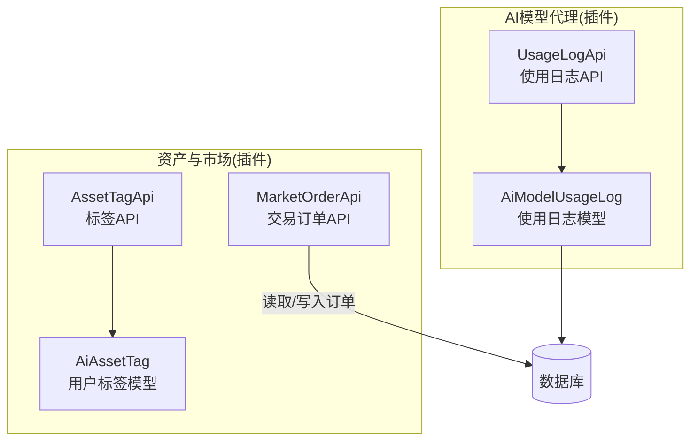
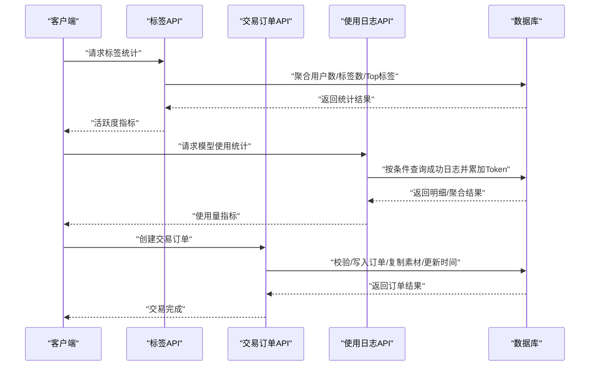
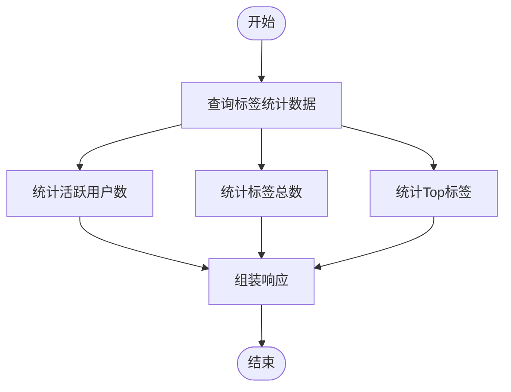
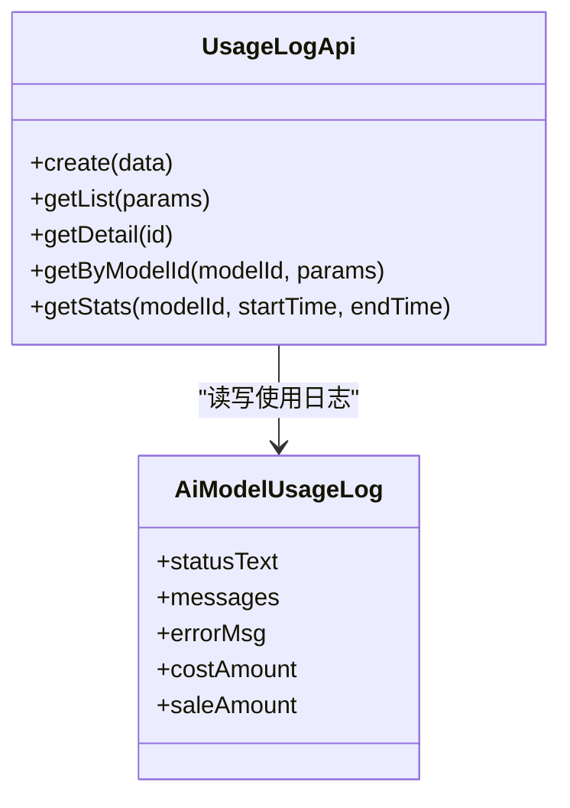
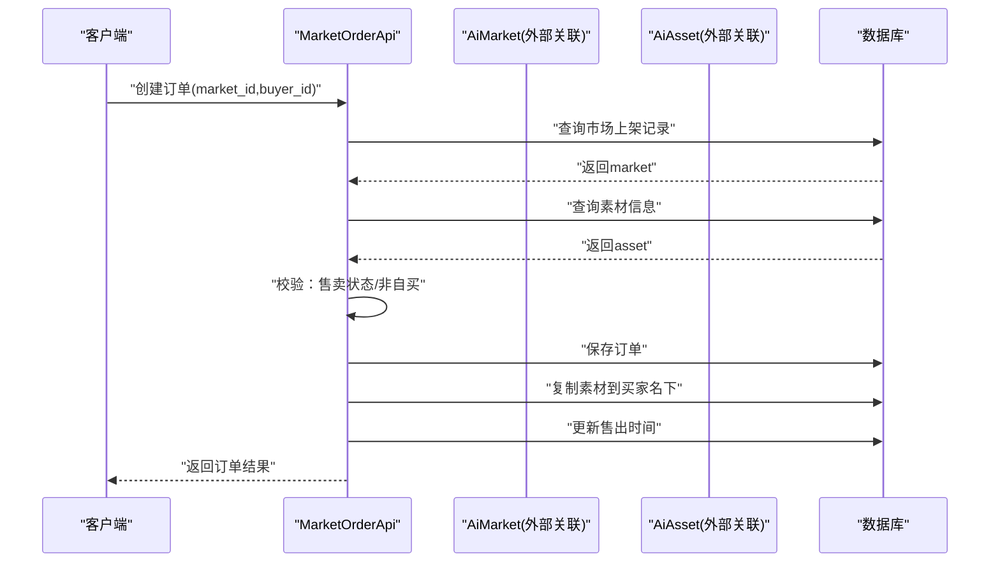
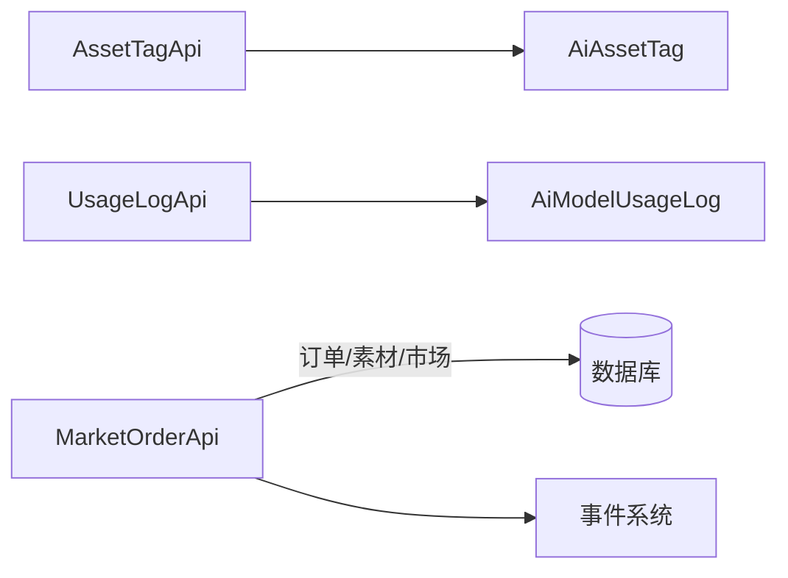

# 业务指标统计

<cite>
**本文引用的文件**
- [AssetTagApi.php](file://server/plugin/xbAiAsset/api/AssetTagApi.php)
- [AiAssetTag.php](file://server/plugin/xbAiAsset/app/model/AiAssetTag.php)
- [MarketOrderApi.php](file://server/plugin/xbAiAsset/api/MarketOrderApi.php)
- [UsageLogApi.php](file://server/plugin/xbAiModelAgent/api/UsageLogApi.php)
- [AiModelUsageLog.php](file://server/plugin/xbAiModelAgent/app/model/AiModelUsageLog.php)
</cite>

## 目录
1. [引言](#引言)
2. [项目结构](#项目结构)
3. [核心组件](#核心组件)
4. [架构总览](#架构总览)
5. [详细组件分析](#详细组件分析)
6. [依赖关系分析](#依赖关系分析)
7. [性能考虑](#性能考虑)
8. [故障排查指南](#故障排查指南)
9. [结论](#结论)
10. [附录](#附录)

## 引言
本文件面向积木云AI创作平台的“业务指标统计”能力，聚焦以下核心指标的采集与计算：
- 用户活跃度：基于标签创建行为、模型使用日志等事件进行聚合。
- AI模型使用量：基于模型使用日志的调用次数、输入/输出Token累计等。
- 资产交易数据：基于市场交易记录（订单）的成交笔数、金额等。
- 收入统计：基于交易订单的销售金额汇总。

同时提供实时数据统计、历史数据分析、趋势预测的实现思路，以及数据可视化展示与报表生成方案建议。

## 项目结构
围绕业务指标统计，后端主要涉及两个插件模块：
- xbAiAsset（资产与市场）：提供标签统计、市场交易记录等能力。
- xbAiModelAgent（AI模型代理）：提供模型使用日志的写入与查询统计。

图表来源
- [AssetTagApi.php:1-172](file://server/plugin/xbAiAsset/api/AssetTagApi.php#L1-L172)
- [AiAssetTag.php:1-30](file://server/plugin/xbAiAsset/app/model/AiAssetTag.php#L1-L30)
- [MarketOrderApi.php:1-144](file://server/plugin/xbAiAsset/api/MarketOrderApi.php#L1-L144)
- [UsageLogApi.php:1-153](file://server/plugin/xbAiModelAgent/api/UsageLogApi.php#L1-L153)
- [AiModelUsageLog.php:1-111](file://server/plugin/xbAiModelAgent/app/model/AiModelUsageLog.php#L1-L111)

章节来源
- [AssetTagApi.php:1-172](file://server/plugin/xbAiAsset/api/AssetTagApi.php#L1-L172)
- [AiAssetTag.php:1-30](file://server/plugin/xbAiAsset/app/model/AiAssetTag.php#L1-L30)
- [MarketOrderApi.php:1-144](file://server/plugin/xbAiAsset/api/MarketOrderApi.php#L1-L144)
- [UsageLogApi.php:1-153](file://server/plugin/xbAiModelAgent/api/UsageLogApi.php#L1-L153)
- [AiModelUsageLog.php:1-111](file://server/plugin/xbAiModelAgent/app/model/AiModelUsageLog.php#L1-L111)

## 核心组件
- 标签统计（用户活跃度参考）
  - 通过标签API获取活跃用户数、标签总数、热门标签TopN等基础指标。
  - 可结合时间范围筛选，形成日/周/月维度活跃度趋势。
- 模型使用统计（AI使用量）
  - 支持按模型ID、时间范围过滤，统计成功调用次数、输入/输出Token总量。
- 市场交易统计（资产与收入）
  - 支持按买家/卖家/素材/上架记录筛选交易列表。
  - 交易创建流程包含前置校验、事件触发、复制素材到买家名下、更新售出时间等。

章节来源
- [AssetTagApi.php:136-156](file://server/plugin/xbAiAsset/api/AssetTagApi.php#L136-L156)
- [UsageLogApi.php:112-152](file://server/plugin/xbAiModelAgent/api/UsageLogApi.php#L112-L152)
- [MarketOrderApi.php:48-142](file://server/plugin/xbAiAsset/api/MarketOrderApi.php#L48-L142)

## 架构总览
下图展示了“业务指标统计”的关键数据流与处理路径：
- 用户活跃度：由标签创建与查询驱动，聚合得到用户规模与热门标签。
- AI使用量：由模型使用日志写入与查询驱动，聚合得到调用次数与Token消耗。
- 资产交易与收入：由交易订单创建与查询驱动，聚合得到成交笔数与销售额。

图表来源
- [AssetTagApi.php:136-156](file://server/plugin/xbAiAsset/api/AssetTagApi.php#L136-L156)
- [UsageLogApi.php:112-152](file://server/plugin/xbAiModelAgent/api/UsageLogApi.php#L112-L152)
- [MarketOrderApi.php:82-142](file://server/plugin/xbAiAsset/api/MarketOrderApi.php#L82-L142)

## 详细组件分析

### 用户活跃度统计（标签维度）
- 数据来源
  - 用户标签表：用于统计活跃用户数、标签总数、热门标签TopN。
- 关键方法
  - 获取标签统计信息：返回活跃用户数、标签总数、Top标签列表。
- 指标定义
  - 活跃用户数：去重后的uid数量。
  - 标签总数：标签记录总数。
  - 热门标签TopN：按使用次数降序取前N个标签。
- 扩展建议
  - 增加时间窗口过滤，形成日/周/月活跃度曲线。
  - 将标签创建事件作为活跃度信号之一，结合登录/创作等行为综合评估。

图表来源
- [AssetTagApi.php:136-156](file://server/plugin/xbAiAsset/api/AssetTagApi.php#L136-L156)

章节来源
- [AssetTagApi.php:136-156](file://server/plugin/xbAiAsset/api/AssetTagApi.php#L136-L156)
- [AiAssetTag.php:1-30](file://server/plugin/xbAiAsset/app/model/AiAssetTag.php#L1-L30)

### AI模型使用量统计
- 数据来源
  - 模型使用日志表：记录每次调用的状态、输入/输出Token、总Token等。
- 关键方法
  - 获取模型使用统计：按模型ID与时间范围过滤，仅统计成功状态，累计输入/输出/总Token与调用次数。
- 指标定义
  - 调用次数：成功状态的日志条数。
  - 输入Token总量：input_tokens之和。
  - 输出Token总量：output_tokens之和。
  - 总Token：total_tokens之和。
- 复杂度说明
  - 当前实现为全量拉取后在内存中累加，适用于中小规模数据；大数据量场景建议改为服务端聚合或引入预聚合表。

图表来源
- [UsageLogApi.php:1-153](file://server/plugin/xbAiModelAgent/api/UsageLogApi.php#L1-L153)
- [AiModelUsageLog.php:1-111](file://server/plugin/xbAiModelAgent/app/model/AiModelUsageLog.php#L1-L111)

章节来源
- [UsageLogApi.php:112-152](file://server/plugin/xbAiModelAgent/api/UsageLogApi.php#L112-L152)
- [AiModelUsageLog.php:1-111](file://server/plugin/xbAiModelAgent/app/model/AiModelUsageLog.php#L1-L111)

### 资产交易与收入统计
- 数据来源
  - 市场交易订单表：记录买家、卖家、素材、价格等信息。
- 关键方法
  - 获取交易记录列表：支持按买家/卖家/上架记录/素材筛选，分页返回。
  - 创建交易订单：校验市场上架状态、禁止自买、创建订单、复制素材至买家、更新售出时间、触发事件。
- 指标定义
  - 成交笔数：订单记录数。
  - 销售收入：订单price字段之和（需确保销售金额口径一致）。
- 业务流程要点
  - 前置校验：市场上架状态必须为可售，且买家不能是卖家本人。
  - 事件机制：创建前后触发事件，便于审计与联动处理。
  - 资产复制：购买后将素材复制到买家名下，标记来源为“市场购买”。

图表来源
- [MarketOrderApi.php:82-142](file://server/plugin/xbAiAsset/api/MarketOrderApi.php#L82-L142)

章节来源
- [MarketOrderApi.php:48-142](file://server/plugin/xbAiAsset/api/MarketOrderApi.php#L48-L142)

## 依赖关系分析
- 组件内聚与耦合
  - AssetTagApi与AiAssetTag强内聚，负责标签维度的活跃度统计。
  - UsageLogApi与AiModelUsageLog强内聚，负责模型使用量统计。
  - MarketOrderApi依赖外部资源（市场、素材），但通过API封装降低耦合。
- 外部依赖
  - 数据库：所有统计均依赖持久化存储。
  - 事件系统：交易订单创建前后触发事件，便于扩展统计与审计。

图表来源
- [AssetTagApi.php:1-172](file://server/plugin/xbAiAsset/api/AssetTagApi.php#L1-L172)
- [AiAssetTag.php:1-30](file://server/plugin/xbAiAsset/app/model/AiAssetTag.php#L1-L30)
- [UsageLogApi.php:1-153](file://server/plugin/xbAiModelAgent/api/UsageLogApi.php#L1-L153)
- [AiModelUsageLog.php:1-111](file://server/plugin/xbAiModelAgent/app/model/AiModelUsageLog.php#L1-L111)
- [MarketOrderApi.php:1-144](file://server/plugin/xbAiAsset/api/MarketOrderApi.php#L1-L144)

章节来源
- [AssetTagApi.php:1-172](file://server/plugin/xbAiAsset/api/AssetTagApi.php#L1-L172)
- [UsageLogApi.php:1-153](file://server/plugin/xbAiModelAgent/api/UsageLogApi.php#L1-L153)
- [MarketOrderApi.php:1-144](file://server/plugin/xbAiAsset/api/MarketOrderApi.php#L1-L144)

## 性能考虑
- 标签统计
  - 当前实现为分组计数与TopN排序，建议在uid/name上建立索引以提升聚合效率。
- 模型使用统计
  - 当前实现为拉取明细后内存累加，存在大结果集时的内存与网络开销风险。建议：
    - 在服务端使用聚合函数（如SUM/COUNT）直接返回统计值。
    - 对model_id、status、create_at建立复合索引以优化过滤与聚合。
- 交易统计
  - 交易列表分页查询已具备基础过滤能力，建议对buyer_id/seller_id/market_id/asset_id建立索引。
  - 收入统计建议采用服务端聚合，避免前端拉取全量订单再计算。

## 故障排查指南
- 标签统计异常
  - 检查是否存在空name导致无效记录。
  - 确认分组与排序逻辑是否符合预期。
- 模型使用统计偏差
  - 确认仅统计成功状态，失败记录不应计入。
  - 核对input/output/total tokens字段是否完整且数值类型正确。
- 交易订单创建失败
  - 检查市场上架状态是否为可售。
  - 确认买家与卖家不为同一用户。
  - 核查素材是否存在及字段完整性。
  - 关注事件触发是否被拦截或异常。

章节来源
- [AssetTagApi.php:88-116](file://server/plugin/xbAiAsset/api/AssetTagApi.php#L88-L116)
- [UsageLogApi.php:119-152](file://server/plugin/xbAiModelAgent/api/UsageLogApi.php#L119-L152)
- [MarketOrderApi.php:82-142](file://server/plugin/xbAiAsset/api/MarketOrderApi.php#L82-L142)

## 结论
- 现有代码已提供用户活跃度（标签）、AI使用量（日志）、资产交易（订单）三大类指标的基础采集与统计能力。
- 建议进一步在服务端实现聚合统计、完善索引与缓存策略，以满足实时性与大规模数据的性能要求。
- 结合事件系统与定时任务，可实现更丰富的趋势分析与报表生成。

## 附录

### 指标定义与计算方法
- 用户活跃度
  - 活跃用户数：标签表中不同uid的数量。
  - 标签总数：标签表记录总数。
  - 热门标签TopN：按标签使用次数降序取前N。
- AI模型使用量
  - 调用次数：成功状态的日志条数。
  - 输入Token总量：input_tokens之和。
  - 输出Token总量：output_tokens之和。
  - 总Token：total_tokens之和。
- 资产交易与收入
  - 成交笔数：订单记录数。
  - 销售收入：订单price字段之和（需统一货币单位与汇率规则）。

章节来源
- [AssetTagApi.php:136-156](file://server/plugin/xbAiAsset/api/AssetTagApi.php#L136-L156)
- [UsageLogApi.php:112-152](file://server/plugin/xbAiModelAgent/api/UsageLogApi.php#L112-L152)
- [MarketOrderApi.php:48-142](file://server/plugin/xbAiAsset/api/MarketOrderApi.php#L48-L142)

### 实时数据统计与历史分析方案
- 实时统计
  - 使用Redis计数器或增量聚合表，按分钟/小时粒度累积指标，接口直接读取聚合结果。
- 历史分析
  - 每日定时任务将当日明细归档至历史表，并提供按天/周/月的聚合查询接口。
- 趋势预测
  - 基于历史聚合序列，采用移动平均、指数平滑或回归模型进行短期趋势预测。

### 数据可视化与报表生成方案
- 可视化
  - 折线图：活跃度、调用次数、Token消耗随时间变化。
  - 柱状图：热门标签TopN、各模型使用占比。
  - 饼图：收入来源构成（按商品类别/卖家）。
- 报表
  - 导出CSV/PDF，支持按时间范围、模型、卖家等维度筛选。
  - 定时生成日报/周报/月报，推送至管理后台或邮箱。