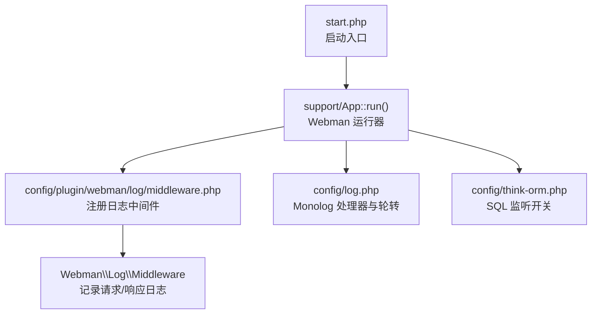
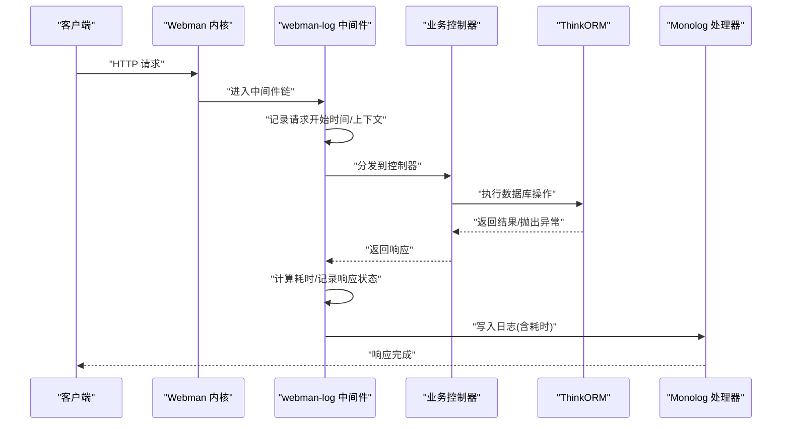
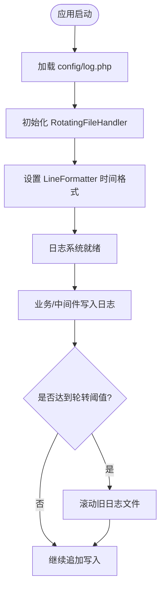
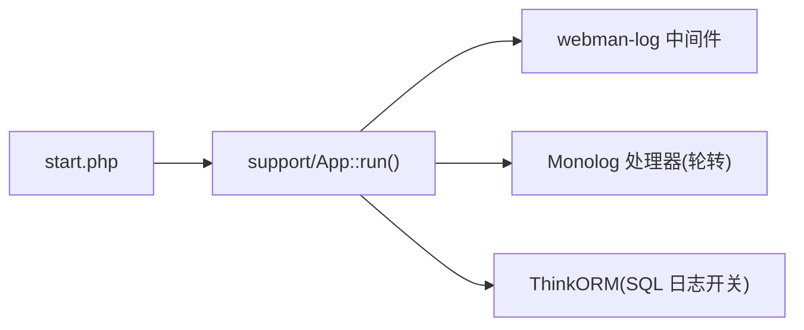

# 应用性能监控

<cite>
**本文引用的文件**   
- [server/config/log.php](file://server/config/log.php)
- [server/config/plugin/webman/log/middleware.php](file://server/config/plugin/webman/log/middleware.php)
- [server/config/app.php](file://server/config/app.php)
- [server/start.php](file://server/start.php)
- [server/support/Request.php](file://server/support/Request.php)
- [server/config/think-orm.php](file://server/config/think-orm.php)
</cite>

## 目录
1. [简介](#简介)
2. [项目结构](#项目结构)
3. [核心组件](#核心组件)
4. [架构总览](#架构总览)
5. [详细组件分析](#详细组件分析)
6. [依赖分析](#依赖分析)
7. [性能考虑](#性能考虑)
8. [故障排查指南](#故障排查指南)
9. [结论](#结论)
10. [附录](#附录)

## 简介
本文件面向积木云AI创作平台的后端（基于 Webman），提供一套可落地的应用性能监控方案，覆盖以下关键目标：
- Webman 日志配置、Monolog 处理器与日志轮转机制
- 请求响应时间采集与统计
- 数据库查询性能分析与慢查询识别
- API 接口调用统计与错误率监控
- 自定义埋点指标与性能瓶颈定位方法

## 项目结构
本项目采用多插件化架构，Webman 作为 HTTP 内核，通过中间件链处理请求；日志系统基于 Monolog，默认使用 RotatingFileHandler 实现按天或按数量轮转。ThinkORM 用于数据库访问，并支持在调试模式下输出 SQL 日志。

图表来源
- [server/start.php:1-6](file://server/start.php#L1-L6)
- [server/config/plugin/webman/log/middleware.php:1-22](file://server/config/plugin/webman/log/middleware.php#L1-L22)
- [server/config/log.php:1-33](file://server/config/log.php#L1-L33)
- [server/config/think-orm.php:1-40](file://server/config/think-orm.php#L1-L40)

章节来源
- [server/start.php:1-6](file://server/start.php#L1-L6)
- [server/config/plugin/webman/log/middleware.php:1-22](file://server/config/plugin/webman/log/middleware.php#L1-L22)
- [server/config/log.php:1-33](file://server/config/log.php#L1-L33)
- [server/config/think-orm.php:1-40](file://server/config/think-orm.php#L1-L40)

## 核心组件
- 日志配置与轮转
  - 默认日志通道使用 Monolog 的 RotatingFileHandler，将日志写入 runtime/logs/webman.log，保留最近若干份并按级别过滤。
  - 格式化器使用 LineFormatter，统一时间格式便于检索与分析。
- 请求日志中间件
  - 通过 webman-log 插件的 Middleware 自动记录进入与返回的 HTTP 请求信息，便于计算响应时间与统计接口调用量。
- ThinkORM 数据库日志
  - 在 APP_DEBUG 开启时，触发 SQL 日志输出，便于定位慢查询与异常语句。

章节来源
- [server/config/log.php:15-31](file://server/config/log.php#L15-L31)
- [server/config/plugin/webman/log/middleware.php:15-21](file://server/config/plugin/webman/log/middleware.php#L15-L21)
- [server/config/think-orm.php:31-33](file://server/config/think-orm.php#L31-L33)

## 架构总览
下图展示了从请求进入到日志落盘的关键路径，以及数据库 SQL 日志的触发条件。

图表来源
- [server/config/plugin/webman/log/middleware.php:15-21](file://server/config/plugin/webman/log/middleware.php#L15-L21)
- [server/config/log.php:15-31](file://server/config/log.php#L15-L31)
- [server/config/think-orm.php:31-33](file://server/config/think-orm.php#L31-L33)

## 详细组件分析

### 日志系统与轮转机制
- 处理器与轮转
  - 使用 RotatingFileHandler 进行文件级轮转，参数包含日志路径、保留份数与最小日志级别。
  - 建议根据磁盘容量与合规要求调整保留份数与级别，生产环境通常使用 WARNING 及以上。
- 格式化器
  - 使用 LineFormatter 指定时间格式，便于后续聚合与可视化。
- 日志路径
  - 默认写入 runtime/logs/webman.log，可通过 app.php 中的 runtime_path 调整运行时目录。

图表来源
- [server/config/log.php:15-31](file://server/config/log.php#L15-L31)
- [server/config/app.php:10-10](file://server/config/app.php#L10-L10)

章节来源
- [server/config/log.php:15-31](file://server/config/log.php#L15-L31)
- [server/config/app.php:4-12](file://server/config/app.php#L4-L12)

### 请求响应时间监控
- 中间件能力
  - webman-log 中间件会在请求进入与返回时记录日志，结合时间戳可计算单次请求耗时。
- 指标建议
  - 响应时间分位（P50/P90/P99）
  - 接口 QPS 与错误率（按状态码分类）
  - 慢请求占比（如超过阈值的请求比例）
- 落地方式
  - 利用中间件输出的日志字段，解析出请求开始与结束时间差，汇总至监控系统（如 Prometheus + Grafana）。

章节来源
- [server/config/plugin/webman/log/middleware.php:15-21](file://server/config/plugin/webman/log/middleware.php#L15-L21)

### 数据库查询性能分析
- SQL 日志开关
  - ThinkORM 的 trigger_sql 受 APP_DEBUG 控制，开启后输出 SQL 执行信息，便于定位慢查询。
- 指标建议
  - 慢查询数量与 Top N 慢语句
  - 连接池命中率与重连次数
  - 事务平均耗时
- 落地方式
  - 在开发/预发环境开启 SQL 日志，收集后做离线分析；生产环境建议仅对特定路由或模块开启，避免性能损耗。

章节来源
- [server/config/think-orm.php:31-33](file://server/config/think-orm.php#L31-L33)

### API 接口调用统计
- 维度建议
  - 按路由/方法分组统计 QPS、成功率、平均耗时、P99 耗时
  - 按用户/租户维度统计调用量与配额使用情况
- 数据来源
  - webman-log 中间件日志中已包含请求方法与路径，可据此聚合统计
- 告警策略
  - 错误率突增、P99 飙升、QPS 异常下降等

章节来源
- [server/config/plugin/webman/log/middleware.php:15-21](file://server/config/plugin/webman/log/middleware.php#L15-L21)

### 自定义监控指标埋点方案
- 通用埋点模式
  - 在关键业务节点（如外部 API 调用、队列任务、缓存命中/未命中）记录结构化日志，包含指标名、数值与标签（如接口名、模型名、区域等）。
- 指标类型
  - 计数器（Counter）：如生成任务成功/失败次数
  - 计时器（Timer/Histogram）：如模型推理耗时、文件上传耗时
  - 仪表盘（Gauge）：如当前并发、队列长度、内存占用
- 采集与上报
  - 将结构化日志经日志采集器（如 Filebeat/Fluent Bit）转发至时序数据库或日志平台，再构建看板与告警规则。

[本节为概念性说明，不直接分析具体文件]

### 性能瓶颈识别技巧
- 快速定位
  - 优先查看 P99 与慢请求分布，结合中间件日志定位热点接口
  - 关联数据库慢查询日志，确认是否存在全表扫描或缺少索引
- 资源层面
  - 关注 CPU/内存/IO 峰值，结合进程监控判断是否为单核瓶颈或锁竞争
- 链路追踪
  - 引入分布式追踪（如 OpenTelemetry），串联网关、服务、DB、缓存与第三方调用，形成端到端视图

[本节为概念性说明，不直接分析具体文件]

## 依赖分析
- 启动与运行
  - start.php 加载 autoloader 并启动 Webman 应用
- 中间件与日志
  - webman-log 中间件在应用启动时注册，贯穿所有 HTTP 请求
- ORM 与 SQL 日志
  - ThinkORM 配置项控制 SQL 日志输出，受 APP_DEBUG 影响

图表来源
- [server/start.php:1-6](file://server/start.php#L1-L6)
- [server/config/plugin/webman/log/middleware.php:15-21](file://server/config/plugin/webman/log/middleware.php#L15-L21)
- [server/config/log.php:15-31](file://server/config/log.php#L15-L31)
- [server/config/think-orm.php:31-33](file://server/config/think-orm.php#L31-L33)

章节来源
- [server/start.php:1-6](file://server/start.php#L1-L6)
- [server/config/plugin/webman/log/middleware.php:15-21](file://server/config/plugin/webman/log/middleware.php#L15-L21)
- [server/config/log.php:15-31](file://server/config/log.php#L15-L31)
- [server/config/think-orm.php:31-33](file://server/config/think-orm.php#L31-L33)

## 性能考虑
- 日志级别与采样
  - 生产环境建议将默认级别提升至 WARNING 或以上，并对高频 DEBUG/INFO 日志进行采样，降低 I/O 压力
- 轮转策略
  - 合理设置保留份数与文件大小上限，避免磁盘爆满；配合压缩归档策略
- 中间件开销
  - 避免在中间件中执行重型逻辑；如需额外统计，尽量异步上报
- 数据库日志
  - 仅在必要场景开启 SQL 日志，或使用采样输出，防止拖慢主流程

[本节为通用指导，不直接分析具体文件]

## 故障排查指南
- 日志无法写入
  - 检查运行时目录权限与磁盘空间；确认 log.php 中路径与轮转参数是否正确
- 缺少请求耗时
  - 确认 webman-log 中间件已注册且生效；核对日志时间戳字段是否完整
- 无 SQL 日志
  - 确认 APP_DEBUG 已开启；检查 think-orm.php 中 trigger_sql 配置
- 日志过多导致性能问题
  - 调整日志级别与采样策略；对热点接口单独降频输出

章节来源
- [server/config/log.php:15-31](file://server/config/log.php#L15-L31)
- [server/config/plugin/webman/log/middleware.php:15-21](file://server/config/plugin/webman/log/middleware.php#L15-L21)
- [server/config/think-orm.php:31-33](file://server/config/think-orm.php#L31-L33)

## 结论
通过在 Webman 中启用 webman-log 中间件、配置 Monolog 轮转处理器，并结合 ThinkORM 的 SQL 日志开关，可以低成本地建立请求耗时、接口调用与数据库性能的观测体系。在此基础上，补充自定义埋点与统一的采集上报链路，即可实现对关键指标的持续监控与告警，快速定位性能瓶颈并优化用户体验。

[本节为总结性内容，不直接分析具体文件]

## 附录
- 环境变量参考
  - APP_DEBUG：控制调试模式与 SQL 日志输出
  - DB_*：数据库连接相关配置（host、port、name、user、pass、charset、prefix 等）
- 建议的监控看板指标
  - 接口 QPS、成功率、P50/P90/P99 耗时
  - 慢请求占比、错误率趋势
  - 慢查询数量与 Top N 语句
  - 外部依赖（模型服务、对象存储、短信/邮件）调用耗时与失败率

章节来源
- [server/config/app.php:4-12](file://server/config/app.php#L4-L12)
- [server/config/think-orm.php:7-33](file://server/config/think-orm.php#L7-L33)