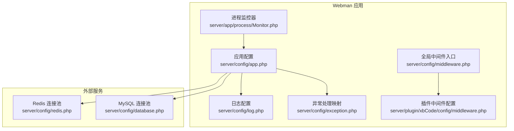
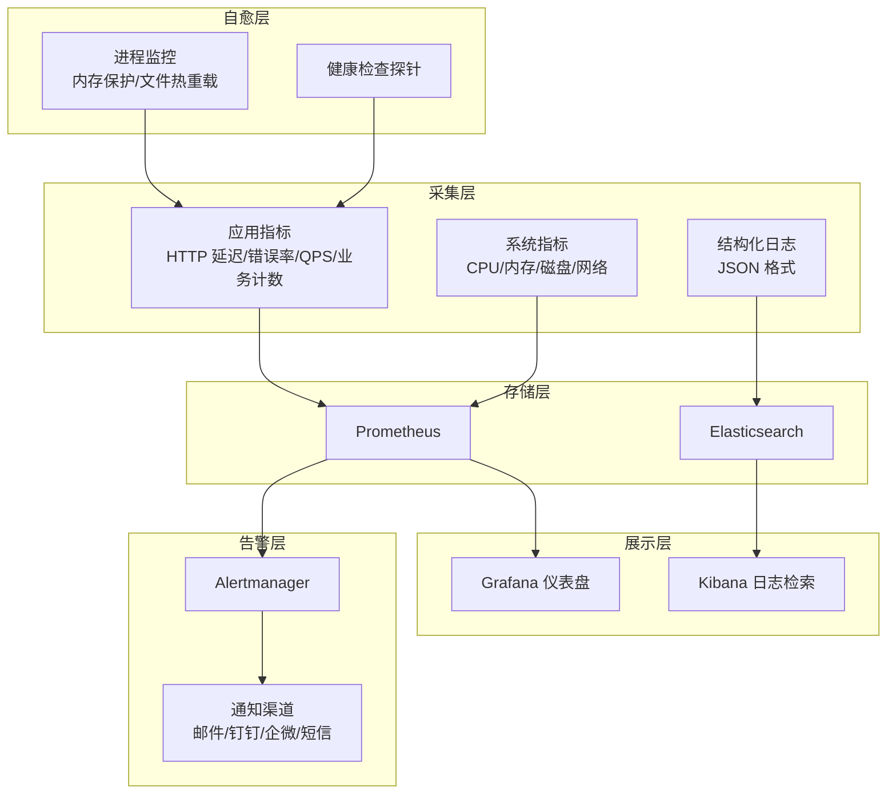
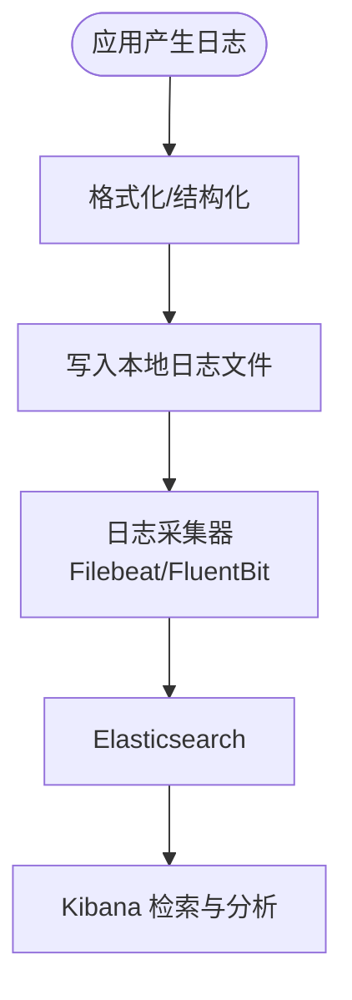
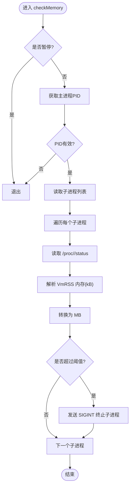
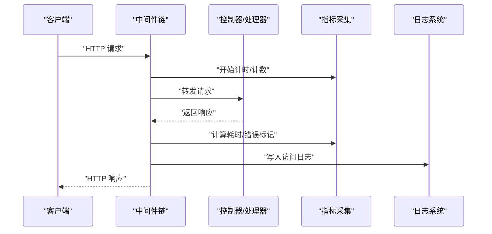
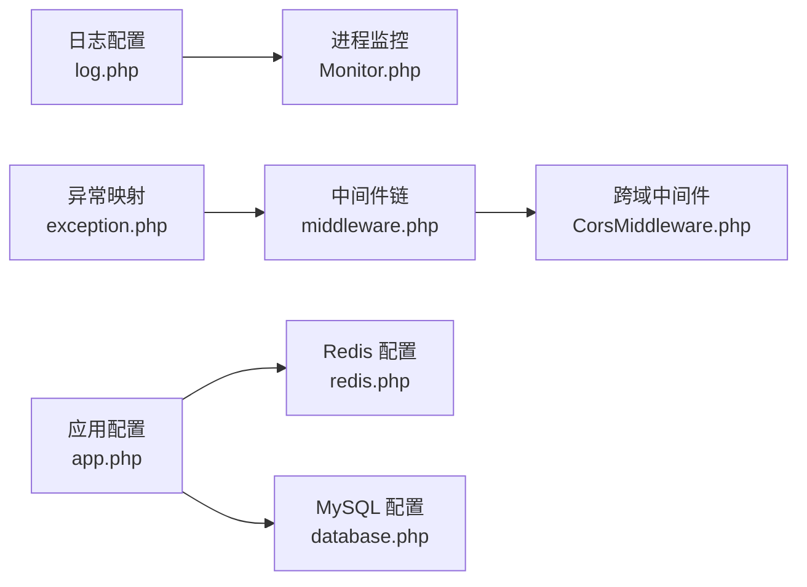

# 监控告警

<cite>
**本文引用的文件**   
- [server/config/log.php](file://server/config/log.php)
- [server/app/process/Monitor.php](file://server/app/process/Monitor.php)
- [server/config/app.php](file://server/config/app.php)
- [server/config/exception.php](file://server/config/exception.php)
- [server/config/middleware.php](file://server/config/middleware.php)
- [server/plugin\xbCode\app\middleware\CorsMiddleware.php](file://server/plugin\xbCode\app\middleware\CorsMiddleware.php)
- [server/plugin\xbCode\config\middleware.php](file://server/plugin\xbCode\config\middleware.php)
- [server/config/redis.php](file://server/config/redis.php)
- [server/config/database.php](file://server/config/database.php)
</cite>

## 目录
1. [简介](#简介)
2. [项目结构](#项目结构)
3. [核心组件](#核心组件)
4. [架构总览](#架构总览)
5. [详细组件分析](#详细组件分析)
6. [依赖关系分析](#依赖关系分析)
7. [性能考虑](#性能考虑)
8. [故障排查指南](#故障排查指南)
9. [结论](#结论)
10. [附录](#附录)

## 简介
本文件为“积木云AI创作平台”的监控与告警系统设计与落地文档，覆盖应用性能监控、错误日志收集、业务指标统计与系统资源监控。方案包含：
- 应用侧埋点与指标采集（Prometheus）
- 日志统一输出与结构化（ELK Stack）
- 可视化与仪表盘（Grafana）
- 告警规则与通知渠道（Prometheus Alertmanager）
- 自动恢复机制（进程级内存保护、健康检查与自愈）

## 项目结构
后端基于 Webman 框架运行，当前仓库已具备基础日志与进程监控能力，可作为监控体系的基础设施。关键位置如下：
- 日志配置：server/config/log.php
- 进程监控（文件变更与内存保护）：server/app/process/Monitor.php
- 全局异常处理器映射：server/config/exception.php
- 中间件注册入口：server/config/middleware.php 与各插件中间件配置
- 外部依赖：Redis、MySQL 连接池配置

图示来源
- [server/config/log.php:1-33](file://server/config/log.php#L1-L33)
- [server/app/process/Monitor.php:1-306](file://server/app/process/Monitor.php#L1-L306)
- [server/config/app.php:1-13](file://server/config/app.php#L1-L13)
- [server/config/exception.php:1-17](file://server/config/exception.php#L1-L17)
- [server/config/middleware.php:1-12](file://server/config/middleware.php#L1-L12)
- [server/plugin\xbCode\config\middleware.php:1-11](file://server/plugin\xbCode\config\middleware.php#L1-L11)
- [server/config/redis.php:1-17](file://server/config/redis.php#L1-L17)
- [server/config/database.php:1-35](file://server/config/database.php#L1-L35)

章节来源
- [server/config/log.php:1-33](file://server/config/log.php#L1-L33)
- [server/app/process/Monitor.php:1-306](file://server/app/process/Monitor.php#L1-L306)
- [server/config/app.php:1-13](file://server/config/app.php#L1-L13)
- [server/config/exception.php:1-17](file://server/config/exception.php#L1-L17)
- [server/config/middleware.php:1-12](file://server/config/middleware.php#L1-L12)
- [server/plugin\xbCode\config\middleware.php:1-11](file://server/plugin\xbCode\config\middleware.php#L1-L11)
- [server/config/redis.php:1-17](file://server/config/redis.php#L1-L17)
- [server/config/database.php:1-35](file://server/config/database.php#L1-L35)

## 核心组件
- 日志子系统
  - 使用 Monolog 的 RotatingFileHandler 将日志写入 runtime/logs/webman.log，支持按天轮转与格式化。
  - 建议扩展为多通道输出（文件 + 网络），以便接入 ELK。
- 进程监控
  - Monitor 进程周期性扫描受控目录的文件变更并触发重载；同时提供内存阈值检测，超限则向子进程发送信号以重启。
- 异常处理
  - 通过 exception.php 映射到 support\exception\Handler，便于统一捕获、记录与上报。
- 中间件链
  - 在 middleware.php 中注册全局中间件，可在请求链路中注入指标采集、访问日志、限流等逻辑。
- 外部依赖
  - Redis 与 MySQL 均提供连接池配置，可结合连接池状态进行可用性监控。

章节来源
- [server/config/log.php:1-33](file://server/config/log.php#L1-L33)
- [server/app/process/Monitor.php:1-306](file://server/app/process/Monitor.php#L1-L306)
- [server/config/exception.php:1-17](file://server/config/exception.php#L1-L17)
- [server/config/middleware.php:1-12](file://server/config/middleware.php#L1-L12)
- [server/config/redis.php:1-17](file://server/config/redis.php#L1-L17)
- [server/config/database.php:1-35](file://server/config/database.php#L1-L35)

## 架构总览
整体监控告警架构由“采集层—存储层—展示层—告警层—自愈层”构成。采集层负责从应用、数据库、缓存与操作系统拉取指标；存储层由 Prometheus 与 ELK 承担；展示层由 Grafana 提供；告警层由 Alertmanager 驱动；自愈层通过进程监控与健康检查实现。

[此图为概念性架构图，不直接映射具体源码文件]

## 详细组件分析

### 组件一：日志子系统（Monolog → 文件 → ELK）
- 现状
  - 默认使用 RotatingFileHandler 输出到 runtime/logs/webman.log，采用 LineFormatter 格式化时间戳。
- 演进建议
  - 新增 Logstash/Filebeat 或 Fluent Bit 作为日志采集器，将本地日志推送至 Elasticsearch。
  - 将日志格式升级为 JSON，便于字段化检索与聚合。
  - 在中间件中追加结构化访问日志（方法、路径、耗时、状态码、用户标识）。
- 关键配置参考
  - 日志处理器与轮转策略：[server/config/log.php:1-33](file://server/config/log.php#L1-L33)

图示来源
- [server/config/log.php:1-33](file://server/config/log.php#L1-L33)

章节来源
- [server/config/log.php:1-33](file://server/config/log.php#L1-L33)

### 组件二：进程监控与内存保护（Monitor）
- 功能要点
  - 文件变更监听：定时扫描指定目录，匹配扩展名，校验语法后向主进程发送信号触发重载。
  - 内存保护：定期读取子进程状态，超过阈值则发送信号终止，交由进程管理器拉起。
  - 暂停/恢复：通过锁文件控制是否启用监控。
- 关键流程（内存保护）

图示来源
- [server/app/process/Monitor.php:232-262](file://server/app/process/Monitor.php#L232-L262)

章节来源
- [server/app/process/Monitor.php:1-306](file://server/app/process/Monitor.php#L1-L306)

### 组件三：异常处理与错误上报
- 现状
  - 通过 exception.php 将未捕获异常路由到 support\exception\Handler。
- 演进建议
  - 在 Handler 中统一记录错误上下文（请求ID、用户、接口、参数摘要、堆栈）。
  - 将严重错误上报到 APM/告警系统（如 Sentry、Prometheus 计数器）。
- 关键配置参考
  - 异常处理器映射：[server/config/exception.php:1-17](file://server/config/exception.php#L1-L17)

章节来源
- [server/config/exception.php:1-17](file://server/config/exception.php#L1-L17)

### 组件四：中间件链与指标采集
- 现状
  - 全局中间件入口位于 server/config/middleware.php，插件中间件在各自 config/middleware.php 中定义。
- 演进建议
  - 在中间件链中插入“指标采集中间件”，统计 HTTP 请求数、延迟分布、错误率、业务计数（如生成任务量、模型调用次数）。
  - 在跨域中间件基础上增加响应头注入（如请求ID），便于链路追踪。
- 关键配置参考
  - 全局中间件入口：[server/config/middleware.php:1-12](file://server/config/middleware.php#L1-L12)
  - 插件中间件配置：[server/plugin\xbCode\config\middleware.php:1-11](file://server/plugin\xbCode\config\middleware.php#L1-L11)
  - 示例中间件（跨域）：[server/plugin\xbCode\app\middleware\CorsMiddleware.php:1-45](file://server/plugin\xbCode\app\middleware\CorsMiddleware.php#L1-L45)

[此图为概念性时序图，不直接映射具体源码文件]

### 组件五：外部依赖监控（Redis/MySQL）
- 现状
  - Redis 与 MySQL 均提供连接池配置（最大/最小连接、等待超时、空闲超时、心跳间隔）。
- 演进建议
  - 暴露连接池状态指标（活跃连接、等待队列、失败重试次数）。
  - 对慢查询、连接失败、超时进行告警。
- 关键配置参考
  - Redis 连接池：[server/config/redis.php:1-17](file://server/config/redis.php#L1-L17)
  - MySQL 连接池：[server/config/database.php:1-35](file://server/config/database.php#L1-L35)

章节来源
- [server/config/redis.php:1-17](file://server/config/redis.php#L1-L17)
- [server/config/database.php:1-35](file://server/config/database.php#L1-L35)

## 依赖关系分析
- 组件耦合
  - Monitor 依赖运行时路径与系统进程信息，用于文件监控与内存保护。
  - 日志子系统依赖 Monolog 处理器与格式化器。
  - 中间件链贯穿请求生命周期，适合注入指标与日志。
- 外部依赖
  - Redis/MySQL 连接池影响可用性与性能，需纳入监控范围。

图示来源
- [server/config/log.php:1-33](file://server/config/log.php#L1-L33)
- [server/app/process/Monitor.php:1-306](file://server/app/process/Monitor.php#L1-L306)
- [server/config/exception.php:1-17](file://server/config/exception.php#L1-L17)
- [server/config/middleware.php:1-12](file://server/config/middleware.php#L1-L12)
- [server/plugin\xbCode\app\middleware\CorsMiddleware.php:1-45](file://server/plugin\xbCode\app\middleware\CorsMiddleware.php#L1-L45)
- [server/config/app.php:1-13](file://server/config/app.php#L1-L13)
- [server/config/redis.php:1-17](file://server/config/redis.php#L1-L17)
- [server/config/database.php:1-35](file://server/config/database.php#L1-L35)

章节来源
- [server/config/log.php:1-33](file://server/config/log.php#L1-L33)
- [server/app/process/Monitor.php:1-306](file://server/app/process/Monitor.php#L1-L306)
- [server/config/exception.php:1-17](file://server/config/exception.php#L1-L17)
- [server/config/middleware.php:1-12](file://server/config/middleware.php#L1-L12)
- [server/plugin\xbCode\app\middleware\CorsMiddleware.php:1-45](file://server/plugin\xbCode\app\middleware\CorsMiddleware.php#L1-L45)
- [server/config/app.php:1-13](file://server/config/app.php#L1-L13)
- [server/config/redis.php:1-17](file://server/config/redis.php#L1-L17)
- [server/config/database.php:1-35](file://server/config/database.php#L1-L35)

## 性能考虑
- 指标采样
  - 对高频指标采用降采样或直方图分桶，避免过度写入导致 I/O 压力。
- 日志吞吐
  - 使用异步写入与批量发送，降低对主线程的影响。
- 连接池
  - 合理设置 Redis/MySQL 连接池大小与心跳间隔，避免连接风暴与泄漏。
- 监控开销
  - 文件监控与内存监控应限制扫描范围与频率，避免在高并发场景下放大开销。

[本节为通用指导，不直接分析具体文件]

## 故障排查指南
- 日志定位
  - 查看本地日志文件路径与轮转策略，确认日志是否按预期输出。
  - 若接入 ELK，检查采集器状态与索引命名规范。
- 进程问题
  - 当出现内存增长时，观察 Monitor 的内存保护是否触发，必要时调整阈值。
  - 文件热重载失败时，检查 exec 函数是否被禁用以及语法校验结果。
- 异常与错误
  - 通过异常处理器统一记录错误上下文，结合请求ID快速定位。
- 外部依赖
  - 关注 Redis/MySQL 连接池指标，识别慢查询与连接失败。

章节来源
- [server/config/log.php:1-33](file://server/config/log.php#L1-L33)
- [server/app/process/Monitor.php:1-306](file://server/app/process/Monitor.php#L1-L306)
- [server/config/exception.php:1-17](file://server/config/exception.php#L1-L17)
- [server/config/redis.php:1-17](file://server/config/redis.php#L1-L17)
- [server/config/database.php:1-35](file://server/config/database.php#L1-L35)

## 结论
本项目已具备日志与进程监控的基础能力。在此基础上，建议逐步完善：
- 应用指标采集与 Prometheus 集成
- 结构化日志与 ELK 集成
- Grafana 仪表盘与 Alertmanager 告警
- 健康检查与自动恢复机制
从而形成完整的“采集—存储—展示—告警—自愈”闭环，提升平台的稳定性与可观测性。

[本节为总结性内容，不直接分析具体文件]

## 附录

### 配置清单与步骤（实施指引）
- Prometheus 集成
  - 在中间件或控制器中暴露 /metrics 端点，输出 HTTP 延迟、QPS、错误率与业务计数。
  - 部署 node_exporter 采集系统指标，配置 Prometheus 抓取目标。
- Grafana 集成
  - 添加 Prometheus 数据源，导入或自建仪表盘，展示关键指标。
- ELK 集成
  - 将日志格式改为 JSON，部署 Filebeat/Fluent Bit 采集本地日志，推送到 Elasticsearch。
  - 在 Kibana 创建索引模式与看板，建立错误与慢请求检索视图。
- 告警规则与通知
  - 在 Prometheus 中定义告警规则（如错误率、延迟、内存、连接池异常）。
  - 配置 Alertmanager 路由与静默策略，对接邮件、钉钉、企业微信、短信等渠道。
- 自动恢复
  - 利用 Monitor 的内存保护与进程管理器（systemd/supervisor）实现崩溃自愈。
  - 引入健康检查探针，配合负载均衡或编排平台进行滚动重启。

[本节为通用实施指引，不直接分析具体文件]