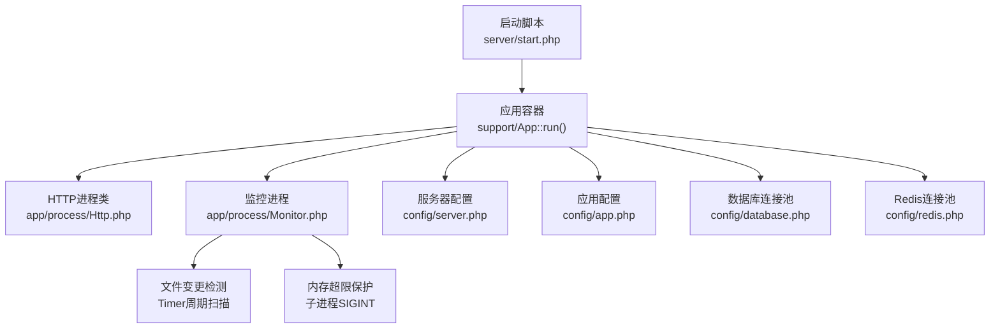
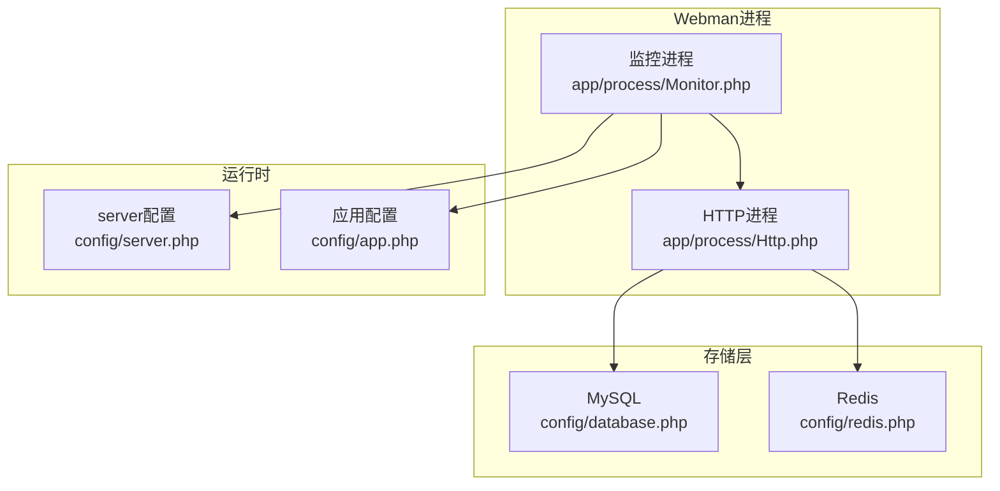
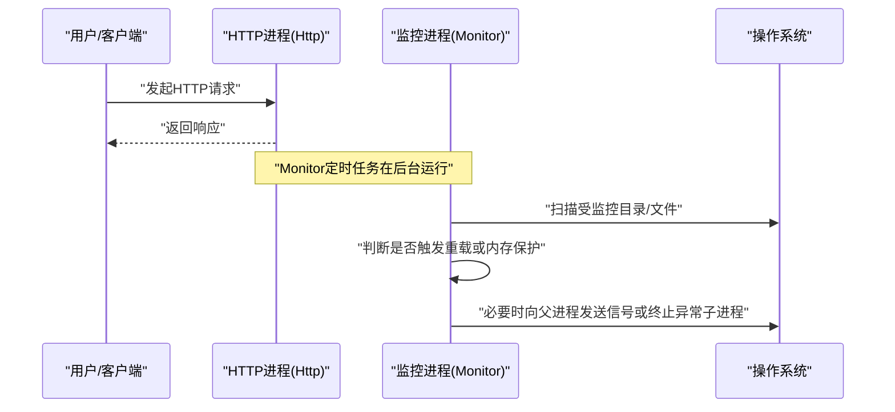
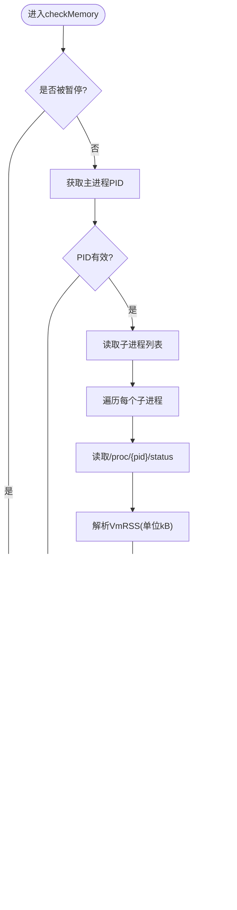
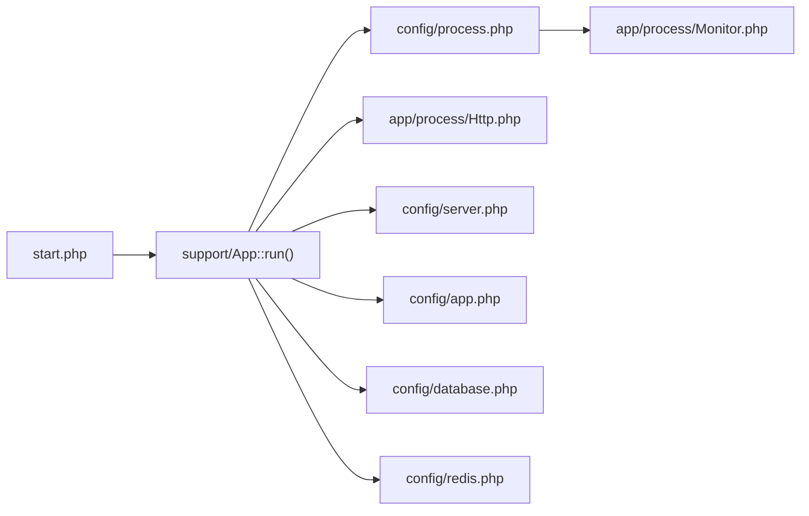

# 系统资源监控

<cite>
**本文引用的文件**   
- [server/start.php](file://server/start.php)
- [server/config/process.php](file://server/config/process.php)
- [server/app/process/Http.php](file://server/app/process/Http.php)
- [server/app/process/Monitor.php](file://server/app/process/Monitor.php)
- [server/config/database.php](file://server/config/database.php)
- [server/config/redis.php](file://server/config/redis.php)
- [server/config/server.php](file://server/config/server.php)
- [server/config/app.php](file://server/config/app.php)
</cite>

## 目录
1. [简介](#简介)
2. [项目结构](#项目结构)
3. [核心组件](#核心组件)
4. [架构总览](#架构总览)
5. [详细组件分析](#详细组件分析)
6. [依赖关系分析](#依赖关系分析)
7. [性能与容量规划](#性能与容量规划)
8. [故障排查指南](#故障排查指南)
9. [结论](#结论)
10. [附录：阈值与告警建议](#附录阈值与告警建议)

## 简介
本文件面向“积木云AI创作平台”的后端运行环境，聚焦系统级资源的监控与治理，包括：
- CPU使用率、内存占用、磁盘空间、网络带宽等系统指标采集与告警策略
- Webman进程管理与自动重载机制
- Redis缓存连接池与健康检查
- MySQL数据库连接池配置与健康检查
- 资源使用阈值告警与自动扩容策略（基于进程重启与外部编排）

说明：
- 本项目已内置Webman的进程监控与内存保护能力；数据库与Redis采用连接池配置。
- 当前仓库未包含CPU、磁盘、网络等系统指标的采集与告警实现，本文提供落地方案与集成建议。

## 项目结构
后端服务基于Webman框架，关键入口与配置如下：
- 启动入口：server/start.php
- 进程与监控：server/config/process.php、server/app/process/Monitor.php、server/app/process/Http.php
- 运行时与日志：server/config/server.php、server/config/app.php
- 数据层：server/config/database.php（MySQL）、server/config/redis.php（Redis）

图示来源
- [server/start.php:1-6](file://server/start.php#L1-L6)
- [server/app/process/Http.php:1-10](file://server/app/process/Http.php#L1-L10)
- [server/app/process/Monitor.php:1-306](file://server/app/process/Monitor.php#L1-L306)
- [server/config/server.php:1-12](file://server/config/server.php#L1-L12)
- [server/config/app.php:1-13](file://server/config/app.php#L1-L13)
- [server/config/database.php:1-35](file://server/config/database.php#L1-L35)
- [server/config/redis.php:1-17](file://server/config/redis.php#L1-L17)

章节来源
- [server/start.php:1-6](file://server/start.php#L1-L6)
- [server/config/process.php:1-43](file://server/config/process.php#L1-L43)
- [server/app/process/Http.php:1-10](file://server/app/process/Http.php#L1-L10)
- [server/app/process/Monitor.php:1-306](file://server/app/process/Monitor.php#L1-L306)
- [server/config/server.php:1-12](file://server/config/server.php#L1-L12)
- [server/config/app.php:1-13](file://server/config/app.php#L1-L13)
- [server/config/database.php:1-35](file://server/config/database.php#L1-L35)
- [server/config/redis.php:1-17](file://server/config/redis.php#L1-L17)

## 核心组件
- Webman HTTP进程：继承自Webman\App，作为主请求处理进程。
- Monitor监控进程：负责文件变更监听与内存保护，周期性触发健康动作。
- 数据库连接池：MySQL连接池参数（最大/最小连接数、等待超时、空闲回收、心跳）。
- Redis连接池：Redis连接池参数（最大/最小连接数、等待超时、空闲回收、心跳）。
- 服务器运行时：PID、状态文件、日志路径、包大小限制等。

章节来源
- [server/app/process/Http.php:1-10](file://server/app/process/Http.php#L1-L10)
- [server/app/process/Monitor.php:1-306](file://server/app/process/Monitor.php#L1-L306)
- [server/config/database.php:1-35](file://server/config/database.php#L1-L35)
- [server/config/redis.php:1-17](file://server/config/redis.php#L1-L17)
- [server/config/server.php:1-12](file://server/config/server.php#L1-L12)

## 架构总览
下图展示了Webman进程、Monitor监控、数据库与Redis的连接关系及监控点。

图示来源
- [server/app/process/Http.php:1-10](file://server/app/process/Http.php#L1-L10)
- [server/app/process/Monitor.php:1-306](file://server/app/process/Monitor.php#L1-L306)
- [server/config/database.php:1-35](file://server/config/database.php#L1-L35)
- [server/config/redis.php:1-17](file://server/config/redis.php#L1-L17)
- [server/config/server.php:1-12](file://server/config/server.php#L1-L12)
- [server/config/app.php:1-13](file://server/config/app.php#L1-L13)

## 详细组件分析

### Webman进程管理
- 进程模型：HTTP进程继承Webman\App，承载业务请求。
- 进程生命周期：由start.php引导，读取server.php中的pid/status/log等运行时信息。
- 监控进程：process.php注册Monitor为独立进程，支持文件变更热重载与内存保护。

图示来源
- [server/start.php:1-6](file://server/start.php#L1-L6)
- [server/config/process.php:1-43](file://server/config/process.php#L1-L43)
- [server/app/process/Http.php:1-10](file://server/app/process/Http.php#L1-L10)
- [server/app/process/Monitor.php:1-306](file://server/app/process/Monitor.php#L1-L306)
- [server/config/server.php:1-12](file://server/config/server.php#L1-L12)

章节来源
- [server/config/process.php:1-43](file://server/config/process.php#L1-L43)
- [server/app/process/Http.php:1-10](file://server/app/process/Http.php#L1-L10)
- [server/app/process/Monitor.php:1-306](file://server/app/process/Monitor.php#L1-L306)
- [server/config/server.php:1-12](file://server/config/server.php#L1-L12)

### Monitor监控进程（文件监控与内存保护）
- 文件监控：周期性遍历受监控目录，匹配扩展名并校验语法，触发主进程重载。
- 内存保护：按周期读取子进程状态，超过阈值则向子进程发送中断信号以自愈。
- 可暂停/恢复：通过锁文件控制监控开关。

图示来源
- [server/app/process/Monitor.php:1-306](file://server/app/process/Monitor.php#L1-L306)

章节来源
- [server/app/process/Monitor.php:1-306](file://server/app/process/Monitor.php#L1-L306)

### MySQL数据库连接池与健康检查
- 连接池参数：最大/最小连接数、等待超时、空闲回收、心跳间隔。
- 健康检查建议：
  - 心跳间隔内执行轻量查询（如SELECT 1），失败即标记不可用并触发告警。
  - 统计活跃连接数、等待队列长度、慢查询比例。
  - 当连接池耗尽或错误率突增时，触发告警并可联动外部编排进行水平扩容。

章节来源
- [server/config/database.php:1-35](file://server/config/database.php#L1-L35)

### Redis缓存连接池与健康检查
- 连接池参数：最大/最小连接数、等待超时、空闲回收、心跳间隔。
- 健康检查建议：
  - 定期PING命令探测连通性与时延。
  - 统计命中率、键空间大小、阻塞操作次数。
  - 连接池耗尽或延迟突增时告警，并联动扩容或限流降级。

章节来源
- [server/config/redis.php:1-17](file://server/config/redis.php#L1-L17)

### 服务器运行时与日志
- PID与状态文件：便于外部进程管理器（systemd/supervisor/K8s）监控存活与优雅退出。
- 标准输出与Workerman日志：用于定位问题与审计。
- 最大包体限制：影响大文件上传与媒体生成链路。

章节来源
- [server/config/server.php:1-12](file://server/config/server.php#L1-L12)
- [server/config/app.php:1-13](file://server/config/app.php#L1-L13)

## 依赖关系分析
- 启动依赖：start.php加载框架与应用，初始化进程树。
- 进程依赖：process.php将Monitor注册为独立进程，与HTTP进程并行运行。
- 运行时依赖：server.php定义PID/状态/日志路径，供外部工具读取。
- 数据依赖：database.php与redis.php分别提供MySQL与Redis连接池配置。

图示来源
- [server/start.php:1-6](file://server/start.php#L1-L6)
- [server/config/process.php:1-43](file://server/config/process.php#L1-L43)
- [server/app/process/Monitor.php:1-306](file://server/app/process/Monitor.php#L1-L306)
- [server/app/process/Http.php:1-10](file://server/app/process/Http.php#L1-L10)
- [server/config/server.php:1-12](file://server/config/server.php#L1-L12)
- [server/config/app.php:1-13](file://server/config/app.php#L1-L13)
- [server/config/database.php:1-35](file://server/config/database.php#L1-L35)
- [server/config/redis.php:1-17](file://server/config/redis.php#L1-L17)

章节来源
- [server/start.php:1-6](file://server/start.php#L1-L6)
- [server/config/process.php:1-43](file://server/config/process.php#L1-L43)
- [server/app/process/Monitor.php:1-306](file://server/app/process/Monitor.php#L1-L306)
- [server/app/process/Http.php:1-10](file://server/app/process/Http.php#L1-L10)
- [server/config/server.php:1-12](file://server/config/server.php#L1-L12)
- [server/config/app.php:1-13](file://server/config/app.php#L1-L13)
- [server/config/database.php:1-35](file://server/config/database.php#L1-L35)
- [server/config/redis.php:1-17](file://server/config/redis.php#L1-L17)

## 性能与容量规划
- CPU使用率
  - 采集方式：系统层面（Linux可使用top/htop/vmstat/prometheus node_exporter；Windows可用性能计数器）。
  - 告警阈值：单核持续>80%或整体>70%持续5分钟告警；突发短时峰值可放宽至>90%。
  - 优化建议：热点接口加缓存、异步化耗时任务、合理设置Webman worker数量。
- 内存占用
  - 已有保护：Monitor进程会按阈值对子进程发SIGINT进行自愈。
  - 建议阈值：结合php.ini memory_limit与业务特征设定，通常取memory_limit的70%-80%。
  - 泄漏排查：关注长驻进程内存单调增长，配合Xdebug/Profiler定位。
- 磁盘空间
  - 监控点：runtime/logs、public/uploads、数据库与Redis持久化目录。
  - 告警阈值：使用率>80%预警，>90%紧急；保留策略与轮转需完善。
- 网络带宽
  - 监控点：网卡入出流量、TCP连接数、重传率、丢包率。
  - 告警阈值：带宽利用率>70%持续5分钟告警；连接数突增关联限流与熔断。
- 自动扩容策略
  - 进程级：根据CPU/内存阈值动态增减Webman worker数量（需外部编排器支持）。
  - 实例级：Pod/VM水平扩容，结合HPA或自定义指标（QPS、P99延迟、错误率、连接池耗尽）。
  - 数据层：读写分离、分库分表、Redis集群与哨兵高可用。

[本节为通用指导，不直接分析具体文件]

## 故障排查指南
- 监控进程未生效
  - 确认process.php中monitor处理器已注册且非reloadable。
  - 检查enable_file_monitor与enable_memory_monitor开关与环境差异。
- 内存保护未触发
  - 确认getMemoryLimit计算逻辑与阈值设置；检查/proc可读性与子进程列表。
- 数据库连接池耗尽
  - 观察wait_timeout与idle_timeout配置；检查慢查询与事务未释放。
- Redis连接池异常
  - PING连通性与时延；检查密码、端口、DB索引与防火墙策略。
- 日志定位
  - 查看server.php配置的stdout与workerman日志路径，结合PID与状态文件定位进程。

章节来源
- [server/config/process.php:1-43](file://server/config/process.php#L1-L43)
- [server/app/process/Monitor.php:1-306](file://server/app/process/Monitor.php#L1-L306)
- [server/config/database.php:1-35](file://server/config/database.php#L1-L35)
- [server/config/redis.php:1-17](file://server/config/redis.php#L1-L17)
- [server/config/server.php:1-12](file://server/config/server.php#L1-L12)

## 结论
- 本项目已具备Webman进程监控、文件热重载与内存保护的基础能力。
- 数据库与Redis均提供连接池配置，建议补充健康检查与告警。
- 针对CPU、磁盘、网络等系统级指标，推荐引入统一采集与告警体系，并结合外部编排实现自动扩容。

[本节为总结，不直接分析具体文件]

## 附录：阈值与告警建议
- 系统级
  - CPU：>80%持续5分钟预警；>90%持续2分钟严重。
  - 内存：进程常驻内存>阈值的80%预警；OOM风险>95%严重。
  - 磁盘：使用率>80%预警；>90%严重。
  - 网络：带宽>70%持续5分钟预警；连接数突增>基线2倍预警。
- 中间件
  - MySQL：连接池使用率>80%预警；慢查询占比>5%预警；错误率>1%严重。
  - Redis：命中率<90%预警；P99延迟>5ms预警；连接池使用率>80%预警。
- 自动扩容
  - 触发条件：CPU>80%或连接池使用率>80%持续5分钟。
  - 扩缩容步长：每次增加20%-30%实例或worker数量。
  - 冷却时间：扩容后至少10分钟再评估，避免抖动。

[本节为通用建议，不直接分析具体文件]