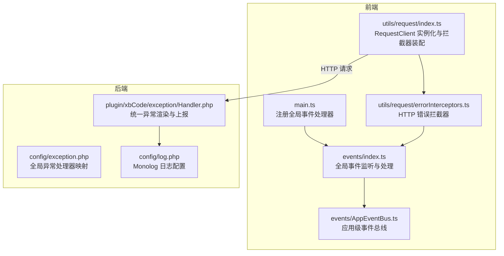
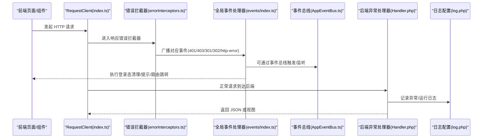
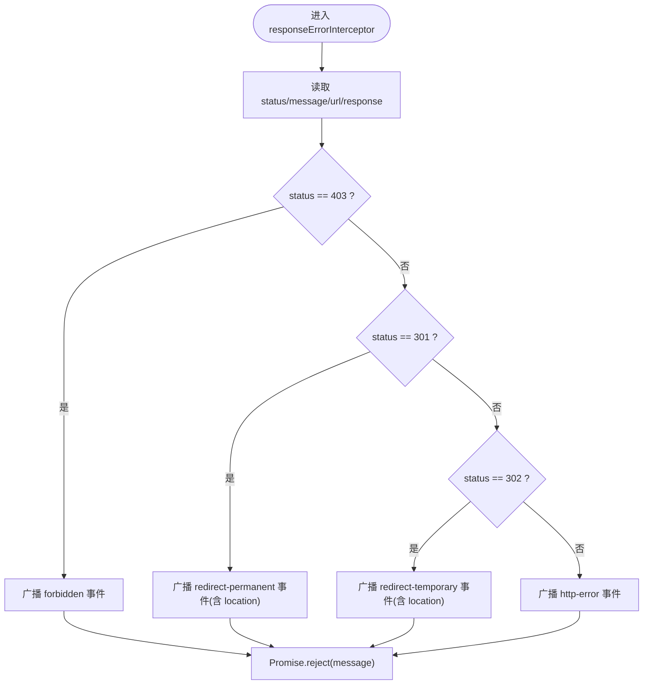
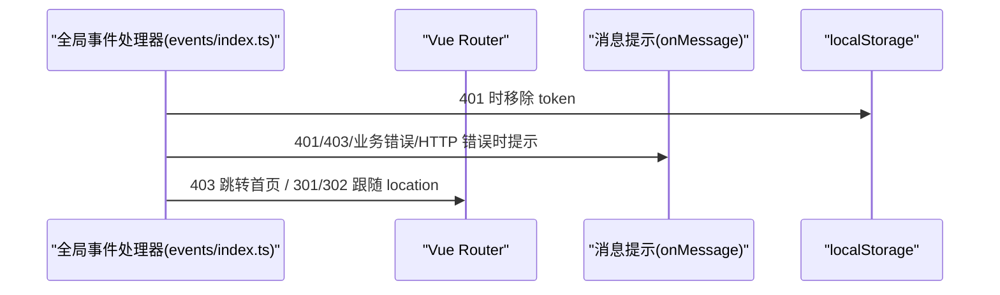
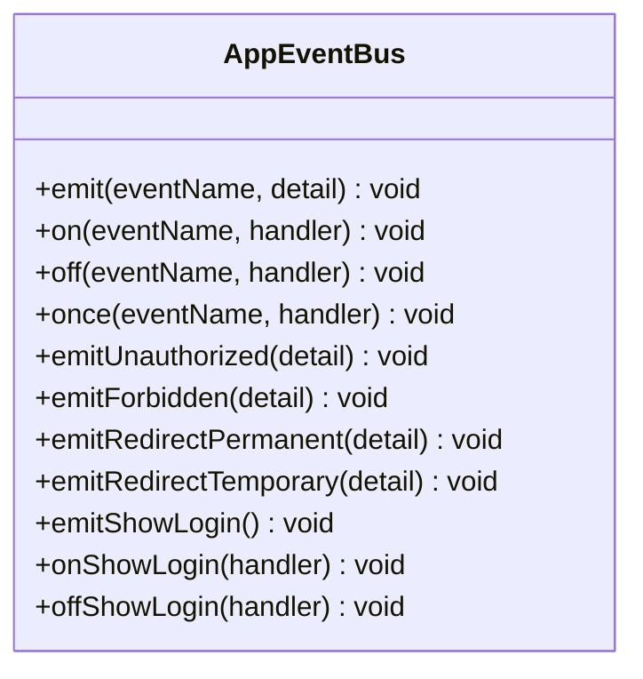
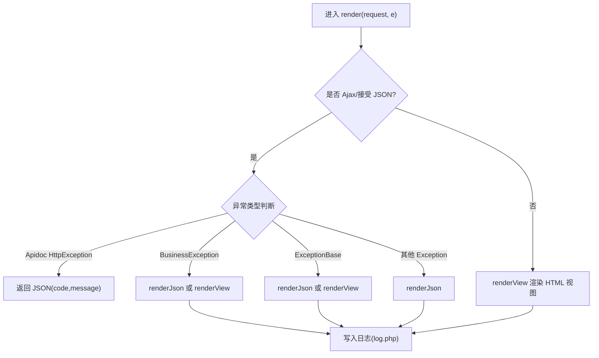
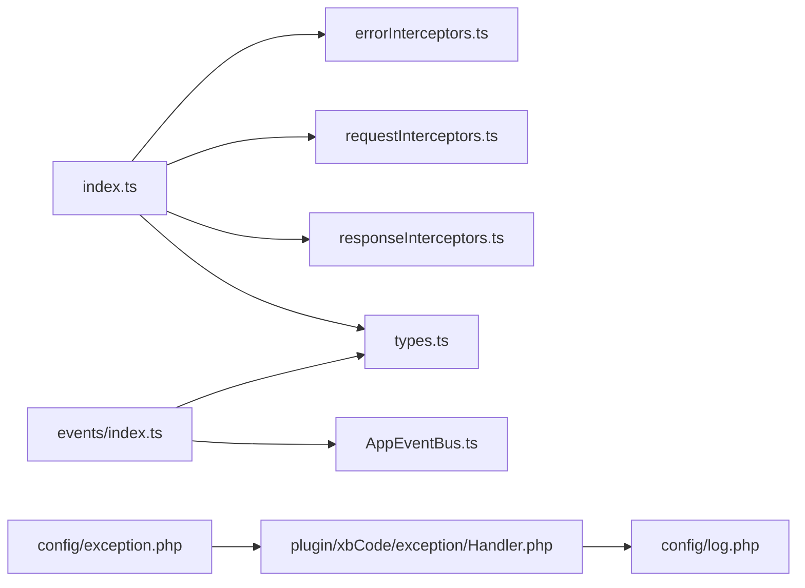

# 错误日志收集

<cite>
**本文引用的文件**   
- [server/config/exception.php](file://server/config/exception.php)
- [server/config/log.php](file://server/config/log.php)
- [server/plugin/xbCode/exception/Handler.php](file://server/plugin/xbCode/exception/Handler.php)
- [frontend/src/utils/request/index.ts](file://frontend/src/utils/request/index.ts)
- [frontend/src/utils/request/errorInterceptors.ts](file://frontend/src/utils/request/errorInterceptors.ts)
- [frontend/src/utils/request/types.ts](file://frontend/src/utils/request/types.ts)
- [frontend/src/events/index.ts](file://frontend/src/events/index.ts)
- [frontend/src/events/AppEventBus.ts](file://frontend/src/events/AppEventBus.ts)
- [frontend/src/main.ts](file://frontend/src/main.ts)
</cite>

## 目录
1. [简介](#简介)
2. [项目结构](#项目结构)
3. [核心组件](#核心组件)
4. [架构总览](#架构总览)
5. [详细组件分析](#详细组件分析)
6. [依赖关系分析](#依赖关系分析)
7. [性能与可靠性](#性能与可靠性)
8. [故障排查指南](#故障排查指南)
9. [结论](#结论)
10. [附录：错误分类与严重级别规范](#附录错误分类与严重级别规范)

## 简介
本文件为“积木云AI创作平台”的错误日志收集系统文档，覆盖前后端错误捕获机制、异常处理策略与错误日志格式化规范。内容包含：
- PHP 后端异常统一处理与日志输出
- JavaScript 前端 HTTP 请求错误拦截与事件广播
- 全局事件总线与路由联动（如 401/403/重定向）
- 错误分类、严重级别定义与聚合分析方法建议

## 项目结构
本项目采用前后端分离架构：
- 前端基于 Vue + Axios，通过统一的 RequestClient 封装网络请求，集中拦截并广播错误事件
- 后端基于 Webman 框架，使用全局异常处理器将业务异常与系统异常统一返回 JSON 或视图，并通过 Monolog 写入日志

图表来源
- [frontend/src/main.ts:1-21](file://frontend/src/main.ts#L1-L21)
- [frontend/src/utils/request/index.ts:1-237](file://frontend/src/utils/request/index.ts#L1-L237)
- [frontend/src/utils/request/errorInterceptors.ts:1-57](file://frontend/src/utils/request/errorInterceptors.ts#L1-L57)
- [frontend/src/events/index.ts:1-119](file://frontend/src/events/index.ts#L1-L119)
- [frontend/src/events/AppEventBus.ts:1-109](file://frontend/src/events/AppEventBus.ts#L1-L109)
- [server/config/exception.php:1-17](file://server/config/exception.php#L1-L17)
- [server/plugin/xbCode/exception/Handler.php:1-142](file://server/plugin/xbCode/exception/Handler.php#L1-L142)
- [server/config/log.php:1-33](file://server/config/log.php#L1-L33)

章节来源
- [frontend/src/main.ts:1-21](file://frontend/src/main.ts#L1-L21)
- [frontend/src/utils/request/index.ts:1-237](file://frontend/src/utils/request/index.ts#L1-L237)
- [frontend/src/utils/request/errorInterceptors.ts:1-57](file://frontend/src/utils/request/errorInterceptors.ts#L1-L57)
- [frontend/src/events/index.ts:1-119](file://frontend/src/events/index.ts#L1-L119)
- [frontend/src/events/AppEventBus.ts:1-109](file://frontend/src/events/AppEventBus.ts#L1-L109)
- [server/config/exception.php:1-17](file://server/config/exception.php#L1-L17)
- [server/plugin/xbCode/exception/Handler.php:1-142](file://server/plugin/xbCode/exception/Handler.php#L1-L142)
- [server/config/log.php:1-33](file://server/config/log.php#L1-L33)

## 核心组件
- 前端 RequestClient：统一创建 Axios 实例，装配请求/响应拦截器，提供 get/post/put/delete/upload/ssePost 等方法，并在错误时广播事件
- 前端错误拦截器：按 HTTP 状态码分发到不同事件（401/403/301/302/通用 http-error），携带 message/status/url/response 等上下文
- 前端全局事件处理器：监听上述事件，执行登录态清理、提示、路由跳转等动作；支持注入 onShowLogin/onMessage 回调
- 前端事件总线：封装 window CustomEvent，提供 emit/on/off/once 及快捷方法（如 emitUnauthorized/emitForbidden）
- 后端全局异常处理器：根据请求类型返回 JSON 或视图，区分业务异常与系统异常，可选输出调试信息
- 后端日志配置：使用 Monolog RotatingFileHandler 将日志写入 runtime/logs/webman.log，保留最近 7 份，格式为行式时间戳

章节来源
- [frontend/src/utils/request/index.ts:1-237](file://frontend/src/utils/request/index.ts#L1-L237)
- [frontend/src/utils/request/errorInterceptors.ts:1-57](file://frontend/src/utils/request/errorInterceptors.ts#L1-L57)
- [frontend/src/events/index.ts:1-119](file://frontend/src/events/index.ts#L1-L119)
- [frontend/src/events/AppEventBus.ts:1-109](file://frontend/src/events/AppEventBus.ts#L1-L109)
- [server/plugin/xbCode/exception/Handler.php:1-142](file://server/plugin/xbCode/exception/Handler.php#L1-L142)
- [server/config/log.php:1-33](file://server/config/log.php#L1-L33)

## 架构总览
下图展示了从前端发起请求到后端异常处理的完整链路，以及错误在前后端的传播路径。

图表来源
- [frontend/src/utils/request/index.ts:1-237](file://frontend/src/utils/request/index.ts#L1-L237)
- [frontend/src/utils/request/errorInterceptors.ts:1-57](file://frontend/src/utils/request/errorInterceptors.ts#L1-L57)
- [frontend/src/events/index.ts:1-119](file://frontend/src/events/index.ts#L1-L119)
- [frontend/src/events/AppEventBus.ts:1-109](file://frontend/src/events/AppEventBus.ts#L1-L109)
- [server/plugin/xbCode/exception/Handler.php:1-142](file://server/plugin/xbCode/exception/Handler.php#L1-L142)
- [server/config/log.php:1-33](file://server/config/log.php#L1-L33)

## 详细组件分析

### 前端 HTTP 错误拦截与事件广播
- 拦截器在响应错误分支中读取 status/message/url/response，并按状态码分发到不同事件名称
- 对 301/302 额外附加 location 头信息，便于后续处理
- 所有错误最终 Promise.reject，调用方可统一 catch

图表来源
- [frontend/src/utils/request/errorInterceptors.ts:1-57](file://frontend/src/utils/request/errorInterceptors.ts#L1-L57)
- [frontend/src/utils/request/types.ts:1-40](file://frontend/src/utils/request/types.ts#L1-L40)

章节来源
- [frontend/src/utils/request/errorInterceptors.ts:1-57](file://frontend/src/utils/request/errorInterceptors.ts#L1-L57)
- [frontend/src/utils/request/types.ts:1-40](file://frontend/src/utils/request/types.ts#L1-L40)

### 全局事件处理器与路由联动
- 注册后监听 UNAUTHORIZED/FORBIDDEN/REDIRECT_PERMANENT/REDIRECT_TEMPORARY/BUSINESS_ERROR/HTTP_ERROR
- 401：清除 token，弹出登录框或跳转登录页
- 403：提示权限不足并重定向至首页
- 301/302：解析 location，站内路径走 router，外部链接直接跳转
- 业务错误/HTTP 错误：统一提示

图表来源
- [frontend/src/events/index.ts:1-119](file://frontend/src/events/index.ts#L1-L119)

章节来源
- [frontend/src/events/index.ts:1-119](file://frontend/src/events/index.ts#L1-L119)

### 应用级事件总线
- 封装 window CustomEvent，提供 emit/on/off/once
- 提供便捷方法：emitUnauthorized/emitForbidden/emitRedirectPermanent/emitRedirectTemporary/emitShowLogin 等
- 单例 appEventBus 供全局使用

图表来源
- [frontend/src/events/AppEventBus.ts:1-109](file://frontend/src/events/AppEventBus.ts#L1-L109)

章节来源
- [frontend/src/events/AppEventBus.ts:1-109](file://frontend/src/events/AppEventBus.ts#L1-L109)

### 后端全局异常处理与日志输出
- 全局异常处理器根据请求是否为 AJAX/JSON 决定返回 JSON 或视图
- 区分 Apidoc 异常、业务异常、自定义业务基类异常与普通异常
- 可输出调试信息（文件、行号、堆栈），受 DebugApi 开关控制
- 日志通过 Monolog 写入文件，按天轮转，保留最近 7 份

图表来源
- [server/plugin/xbCode/exception/Handler.php:1-142](file://server/plugin/xbCode/exception/Handler.php#L1-L142)
- [server/config/log.php:1-33](file://server/config/log.php#L1-L33)

章节来源
- [server/plugin/xbCode/exception/Handler.php:1-142](file://server/plugin/xbCode/exception/Handler.php#L1-L142)
- [server/config/log.php:1-33](file://server/config/log.php#L1-L33)
- [server/config/exception.php:1-17](file://server/config/exception.php#L1-L17)

### 前端初始化与全局处理器注册
- main.ts 中创建应用、安装插件与路由后，注册全局 HTTP 状态码事件处理器
- 注入 router 与 onShowLogin 回调，实现登录弹窗联动

章节来源
- [frontend/src/main.ts:1-21](file://frontend/src/main.ts#L1-L21)
- [frontend/src/events/index.ts:1-119](file://frontend/src/events/index.ts#L1-L119)

## 依赖关系分析
- 前端
  - index.ts 依赖 errorInterceptors.ts、requestInterceptors.ts、responseInterceptors.ts、types.ts
  - events/index.ts 依赖 types.ts 中的事件常量与负载类型
  - AppEventBus.ts 独立封装，被 events/index.ts 重新导出
- 后端
  - config/exception.php 指向 support\exception\Handler::class
  - plugin/xbCode/exception/Handler.php 继承框架异常处理器，负责具体渲染逻辑
  - config/log.php 配置 Monolog 处理器与格式化器

图表来源
- [frontend/src/utils/request/index.ts:1-237](file://frontend/src/utils/request/index.ts#L1-L237)
- [frontend/src/utils/request/errorInterceptors.ts:1-57](file://frontend/src/utils/request/errorInterceptors.ts#L1-L57)
- [frontend/src/utils/request/types.ts:1-40](file://frontend/src/utils/request/types.ts#L1-L40)
- [frontend/src/events/index.ts:1-119](file://frontend/src/events/index.ts#L1-L119)
- [frontend/src/events/AppEventBus.ts:1-109](file://frontend/src/events/AppEventBus.ts#L1-L109)
- [server/config/exception.php:1-17](file://server/config/exception.php#L1-L17)
- [server/plugin/xbCode/exception/Handler.php:1-142](file://server/plugin/xbCode/exception/Handler.php#L1-L142)
- [server/config/log.php:1-33](file://server/config/log.php#L1-L33)

章节来源
- [frontend/src/utils/request/index.ts:1-237](file://frontend/src/utils/request/index.ts#L1-L237)
- [frontend/src/utils/request/errorInterceptors.ts:1-57](file://frontend/src/utils/request/errorInterceptors.ts#L1-L57)
- [frontend/src/utils/request/types.ts:1-40](file://frontend/src/utils/request/types.ts#L1-L40)
- [frontend/src/events/index.ts:1-119](file://frontend/src/events/index.ts#L1-L119)
- [frontend/src/events/AppEventBus.ts:1-109](file://frontend/src/events/AppEventBus.ts#L1-L109)
- [server/config/exception.php:1-17](file://server/config/exception.php#L1-L17)
- [server/plugin/xbCode/exception/Handler.php:1-142](file://server/plugin/xbCode/exception/Handler.php#L1-L142)
- [server/config/log.php:1-33](file://server/config/log.php#L1-L33)

## 性能与可靠性
- 前端
  - 错误拦截器仅做轻量判断与事件广播，避免阻塞主流程
  - 上传接口关闭超时，防止大文件上传误判失败
  - 事件监听在注册前会先卸载旧监听，避免重复绑定导致内存泄漏
- 后端
  - 日志采用轮转文件处理器，限制保留数量，避免磁盘写满
  - 仅在调试模式开启时输出详细堆栈，生产环境减少敏感信息泄露风险

[本节为通用指导，不直接分析具体文件]

## 故障排查指南
- 前端 401/403/重定向未生效
  - 检查是否在 main.ts 中正确注册了全局事件处理器
  - 确认 onShowLogin 已注入且能触发登录弹窗
  - 查看浏览器控制台是否有 request:* 事件派发
- 前端错误无提示
  - 检查 onMessage 回调是否正确接入全局消息组件
  - 确认拦截器未被上层 try/catch 吞掉 Promise.reject
- 后端异常未落盘
  - 确认 log.php 的 handlers 配置有效，runtime/logs 目录可写
  - 检查异常是否属于 dontReport 列表或被中间件提前返回
- 日志过大或丢失
  - 调整轮转数量与日志级别
  - 监控磁盘空间与进程权限

章节来源
- [frontend/src/main.ts:1-21](file://frontend/src/main.ts#L1-L21)
- [frontend/src/events/index.ts:1-119](file://frontend/src/events/index.ts#L1-L119)
- [frontend/src/utils/request/errorInterceptors.ts:1-57](file://frontend/src/utils/request/errorInterceptors.ts#L1-L57)
- [server/config/log.php:1-33](file://server/config/log.php#L1-L33)
- [server/plugin/xbCode/exception/Handler.php:1-142](file://server/plugin/xbCode/exception/Handler.php#L1-L142)

## 结论
本方案通过“前端事件驱动 + 后端统一异常处理 + 结构化日志”的组合，实现了多维度错误采集与一致的用户体验反馈。建议在后续迭代中：
- 在前端增加错误上报 SDK（如 Sentry/自研上报接口），将关键上下文（用户、设备、URL、参数摘要）异步上报
- 在后端扩展结构化日志字段（trace_id、user_id、耗时、上游服务标识），便于跨服务追踪
- 建立告警规则与看板，对高频错误与严重级别进行实时预警

[本节为总结性内容，不直接分析具体文件]

## 附录：错误分类与严重级别规范

- 错误分类
  - 认证类：401 未登录、Token 过期
  - 授权类：403 权限不足
  - 重定向类：301 永久重定向、302 临时重定向
  - 业务错误：后端返回的业务状态码非成功
  - HTTP 错误：网络异常、超时、CORS 等
  - 系统异常：PHP 运行时异常、数据库连接失败、第三方服务不可用等

- 严重级别定义（建议）
  - P0 致命：系统崩溃、核心功能不可用、数据损坏
  - P1 严重：主要功能受阻、影响范围大
  - P2 重要：部分功能受限、影响范围中等
  - P3 一般：轻微问题、影响范围小
  - P4 提示：用户体验优化建议

- 错误聚合分析方法（建议）
  - 维度：错误类型、状态码、模块/接口、用户角色、地域/设备、版本
  - 指标：错误率、峰值时段、Top N 错误堆栈、复现率
  - 工具：日志聚合（ELK/Loki）、APM（SkyWalking/Jaeger）、前端错误上报平台
  - 流程：采集 → 清洗 → 去重/指纹 → 聚合 → 告警 → 工单 → 复盘

[本节为通用规范与建议，不直接分析具体文件]