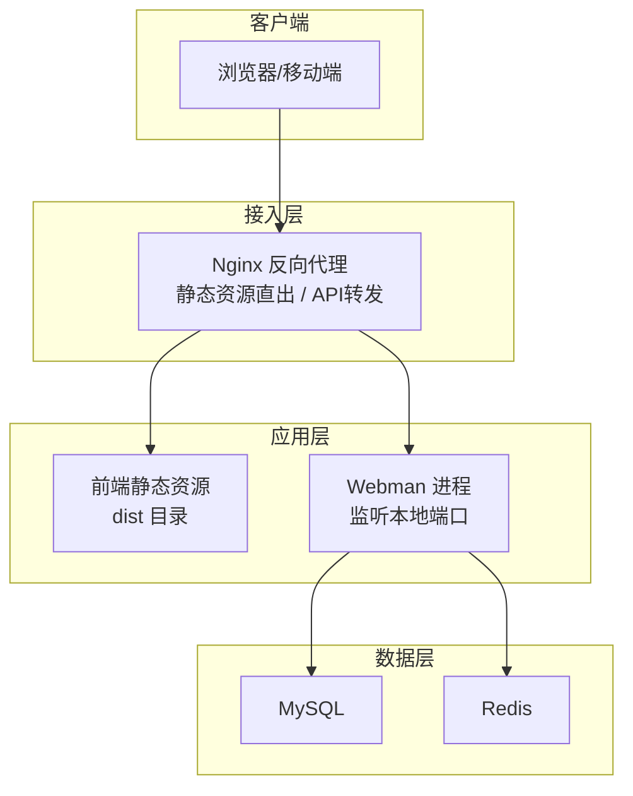
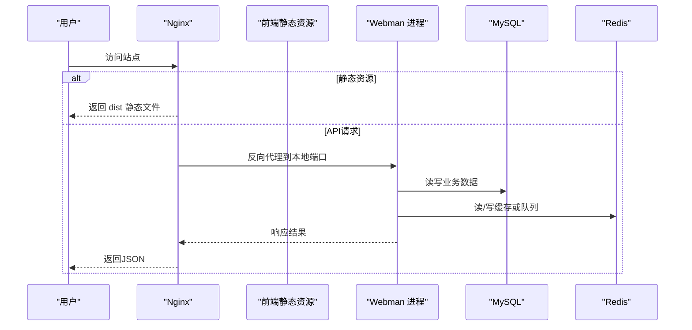
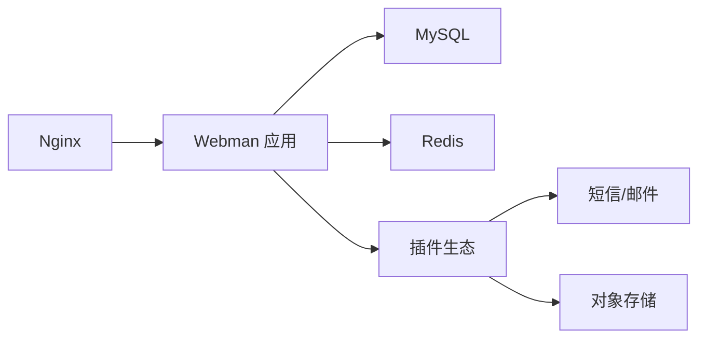

# 部署运维

<cite>
**本文引用的文件**   
- [server/README.md](file://server/README.md)
- [server/nginx.conf](file://server/nginx.conf)
- [server/config/server.php](file://server/config/server.php)
- [server/config/database.php](file://server/config/database.php)
- [server/config/redis.php](file://server/config/redis.php)
- [server/start.php](file://server/start.php)
- [frontend/package.json](file://frontend/package.json)
- [frontend/vite.config.ts](file://frontend/vite.config.ts)
- [server/plugin/xbCode/nginx.conf](file://server/plugin/xbCode/nginx.conf)
</cite>

## 目录
1. [简介](#简介)
2. [项目结构](#项目结构)
3. [核心组件](#核心组件)
4. [架构总览](#架构总览)
5. [详细组件分析](#详细组件分析)
6. [依赖关系分析](#依赖关系分析)
7. [性能考虑](#性能考虑)
8. [故障排查指南](#故障排查指南)
9. [结论](#结论)
10. [附录](#附录)

## 简介
本运维文档面向积木云AI创作平台的生产环境部署与日常运维，覆盖Nginx反向代理、Webman进程管理、数据库与缓存连接池、静态资源构建与发布、监控告警、日志策略、负载均衡、安全加固、备份恢复与自动化部署等主题。文档基于仓库内现有配置与说明进行系统化整理，并提供可落地的最佳实践建议。

## 项目结构
本项目采用前后端分离：
- 前端：Vue + Vite 工程，构建产物为静态资源，适合由Nginx直接托管或CDN分发。
- 后端：基于 Webman（PHP）的插件化应用，提供API服务；通过Nginx将动态请求反向代理至本地端口。
- 中间件：MySQL 作为持久化存储，Redis 用于缓存与队列等能力。

图表来源
- [server/nginx.conf](file://server/nginx.conf)
- [server/config/server.php](file://server/config/server.php)
- [server/config/database.php](file://server/config/database.php)
- [server/config/redis.php](file://server/config/redis.php)

章节来源
- [server/README.md](file://server/README.md)

## 核心组件
- Webman 应用进程
  - 启动命令参考：php webman start
  - 进程PID、状态文件、标准输出与日志路径在服务器配置中定义
  - 最大包体大小限制需结合业务场景调整
- Nginx 反向代理
  - 伪静态规则将非静态文件请求转发到本地Webman进程
  - 支持设置真实IP、Host、协议头，便于鉴权与审计
- 数据库连接池
  - MySQL 连接池参数包括最大/最小连接数、等待超时、空闲回收与心跳检测
- Redis 连接池
  - 默认库、密码、端口及连接池参数与数据库类似

章节来源
- [server/README.md](file://server/README.md)
- [server/config/server.php](file://server/config/server.php)
- [server/nginx.conf](file://server/nginx.conf)
- [server/config/database.php](file://server/config/database.php)
- [server/config/redis.php](file://server/config/redis.php)

## 架构总览
生产环境推荐分层部署：
- 接入层：Nginx 负责HTTPS终止、静态资源缓存、限流与访问控制，并将API请求反向代理至后端。
- 应用层：Webman 多进程运行，按CPU核数合理设置worker数量；插件按需启用。
- 数据层：MySQL主从或高可用集群；Redis哨兵或集群模式；对象存储用于大文件与媒体资源。

图表来源
- [server/nginx.conf](file://server/nginx.conf)
- [server/config/server.php](file://server/config/server.php)
- [server/config/database.php](file://server/config/database.php)
- [server/config/redis.php](file://server/config/redis.php)

## 详细组件分析

### Nginx 反向代理与静态资源
- 作用
  - 将非静态文件请求转发到本地Webman进程
  - 透传客户端真实IP、Host与协议头，便于后端鉴权与审计
- 关键点
  - 关闭proxy_buffering以适配长连接或流式响应场景
  - 根据站点目录正确include伪静态配置
- 建议
  - 开启Gzip/Brotli压缩
  - 对静态资源设置长期缓存与版本化文件名
  - 增加速率限制与白名单策略

章节来源
- [server/nginx.conf](file://server/nginx.conf)
- [server/README.md](file://server/README.md)
- [server/plugin/xbCode/nginx.conf](file://server/plugin/xbCode/nginx.conf)

### Webman 进程与服务配置
- 启动方式
  - 使用 php webman start 启动常驻进程
- 关键配置项
  - PID文件、状态文件、标准输出与日志文件路径
  - 最大请求包体大小限制
- 建议
  - 使用systemd或Supervisor管理进程生命周期
  - 根据CPU核数设置合理的worker数量
  - 定期轮转日志并归档

章节来源
- [server/config/server.php](file://server/config/server.php)
- [server/README.md](file://server/README.md)

### 数据库连接池与高可用
- 连接池参数
  - 最大/最小连接数、获取连接等待超时、空闲回收、心跳检测间隔
- 建议
  - 根据并发量与慢查询情况调优max_connections与wait_timeout
  - 使用只读副本分担读压力
  - 开启慢查询日志与索引优化

章节来源
- [server/config/database.php](file://server/config/database.php)

### Redis 缓存与队列
- 连接池参数
  - 最大/最小连接数、等待超时、空闲回收、心跳检测间隔
- 建议
  - 热点Key加短TTL与随机抖动
  - 队列消费者独立进程，避免阻塞主请求链路
  - 使用AOF+RDB双持久化策略

章节来源
- [server/config/redis.php](file://server/config/redis.php)

### 前端构建与发布
- 构建产物
  - 使用Vite构建生成静态资源，部署到Nginx静态目录或通过CDN分发
- 环境变量
  - 通过构建期变量注入API地址、功能开关等
- 建议
  - 开启代码分割与懒加载
  - 资源指纹化与HTTP缓存策略配合
  - 构建失败时回滚到上一稳定版本

章节来源
- [frontend/package.json](file://frontend/package.json)
- [frontend/vite.config.ts](file://frontend/vite.config.ts)

### 插件体系与扩展点
- 插件化架构
  - 系统支持在线安装/卸载插件，具备路由、配置、队列、视图等扩展点
- 建议
  - 插件间解耦，通过事件与消息队列通信
  - 插件升级前进行兼容性测试与灰度发布

章节来源
- [server/README.md](file://server/README.md)

## 依赖关系分析
- 运行时依赖
  - PHP 8.1+、Nginx、MySQL、Redis
- 应用依赖
  - Webman框架、ThinkORM/Cache、JWT、队列等插件
- 外部集成
  - 短信、邮件、对象存储等第三方服务

图表来源
- [server/README.md](file://server/README.md)

章节来源
- [server/README.md](file://server/README.md)

## 性能考虑
- 接入层
  - 开启HTTP/2与TLS会话复用
  - 静态资源开启Brotli/Gzip与强缓存
  - 针对API路径设置合理的keepalive与超时
- 应用层
  - 合理设置Webman worker数量与进程内存上限
  - 关闭不必要的调试与日志级别
  - 使用连接池与异步任务处理耗时操作
- 数据层
  - MySQL开启缓冲池、调整innodb_io_capacity与log_file_size
  - Redis使用合适的数据结构与过期策略，避免大Key
- 前端
  - 资源分包、图片压缩与懒加载
  - 使用CDN就近分发静态资源

[本节为通用性能建议，不直接分析具体文件]

## 故障排查指南
- 常见问题定位
  - 无法访问API：检查Nginx伪静态是否include正确、Webman进程是否存活、端口是否被占用
  - 数据库连接失败：核对主机、端口、用户名、密码与字符集；检查连接池等待超时
  - Redis异常：核对密码、端口、数据库编号；查看连接池等待与心跳检测
  - 静态资源404：确认站点根目录指向public或dist，且include伪静态配置
- 日志与诊断
  - 查看Webman标准输出与错误日志
  - 收集Nginx访问与错误日志
  - 导出MySQL慢查询与Redis监控指标
- 快速恢复
  - 重启Webman进程
  - 清理临时缓存与编译缓存
  - 回滚到上一个稳定版本

章节来源
- [server/config/server.php](file://server/config/server.php)
- [server/config/database.php](file://server/config/database.php)
- [server/config/redis.php](file://server/config/redis.php)
- [server/README.md](file://server/README.md)

## 结论
通过Nginx统一接入、Webman高性能进程模型、数据库与Redis连接池以及完善的日志与监控策略，积木云AI创作平台可在生产环境获得稳定、可扩展的运行表现。建议在上线前完成容量评估、压测与安全加固，并建立自动化部署与回滚流程，持续提升交付效率与稳定性。

## 附录

### 生产环境部署流程（步骤清单）
- 准备环境
  - 安装Nginx、PHP 8.1+、MySQL、Redis
  - 创建数据库与用户，导入初始化脚本
  - 配置Redis密码与网络访问控制
- 部署后端
  - 拉取源码并安装依赖
  - 配置数据库与Redis连接信息
  - 启动Webman进程并加入系统服务管理
- 部署前端
  - 构建静态资源并上传至Nginx静态目录或CDN
  - 配置环境变量与API域名
- 配置Nginx
  - include伪静态配置，确保静态资源与API转发正确
  - 开启HTTPS、压缩与缓存策略
- 验证与监控
  - 冒烟测试核心接口与页面
  - 接入日志采集与基础监控指标

章节来源
- [server/README.md](file://server/README.md)
- [server/nginx.conf](file://server/nginx.conf)
- [server/config/server.php](file://server/config/server.php)
- [server/config/database.php](file://server/config/database.php)
- [server/config/redis.php](file://server/config/redis.php)

### Nginx 服务器配置要点
- 反向代理
  - 将非静态请求转发到本地Webman进程
  - 透传X-Real-IP、Host、X-Forwarded-Proto
- 静态资源
  - 站点根目录指向public或dist
  - 开启压缩与缓存
- 安全
  - 仅开放必要端口
  - 启用WAF与访问频率限制

章节来源
- [server/nginx.conf](file://server/nginx.conf)
- [server/README.md](file://server/README.md)
- [server/plugin/xbCode/nginx.conf](file://server/plugin/xbCode/nginx.conf)

### Docker 容器化方案
- 镜像选择
  - 使用官方PHP CLI镜像为基础镜像
  - 安装必要工具链（bash、git、rsync等）
- 部署工具
  - 引入部署器工具以简化发布流程
- 建议
  - 将配置文件与密钥通过环境变量或挂载卷注入
  - 使用Docker Compose编排Nginx、Webman、MySQL、Redis

章节来源
- [server/vendor/deployer/deployer/Dockerfile](file://server/vendor/deployer/deployer/Dockerfile)

### 性能调优配置
- Webman
  - 调整最大包体大小与日志路径
  - 合理设置worker数量与进程内存上限
- 数据库
  - 调整连接池大小与心跳间隔
  - 开启慢查询日志并优化索引
- Redis
  - 调整连接池与持久化策略
  - 避免大Key与热Key集中

章节来源
- [server/config/server.php](file://server/config/server.php)
- [server/config/database.php](file://server/config/database.php)
- [server/config/redis.php](file://server/config/redis.php)

### 监控告警设置
- 指标采集
  - 系统级：CPU、内存、磁盘、网络
  - 应用级：QPS、延迟、错误率、队列积压
  - 数据层：连接数、慢查询、命中率
- 告警策略
  - 阈值告警与趋势预测
  - 分级通知与自动恢复预案

[本节为通用监控建议，不直接分析具体文件]

### 日志管理策略
- 日志分类
  - 访问日志、错误日志、业务日志、审计日志
- 采集与存储
  - 集中采集到日志平台，按天滚动与保留周期
- 检索与分析
  - 关键字检索、错误堆栈聚合、慢请求追踪

章节来源
- [server/config/server.php](file://server/config/server.php)

### 负载均衡配置
- 多实例部署
  - 同一后端多实例，Nginx upstream轮询或加权
- 健康检查
  - 配置健康检查与故障剔除
- 会话保持
  - 优先无状态设计，必要时使用Redis共享会话

[本节为通用负载均衡建议，不直接分析具体文件]

### 缓存优化
- 多级缓存
  - 浏览器/CDN -> Nginx -> Redis -> MySQL
- 缓存一致性
  - 更新后失效或延迟双写
- 热点保护
  - 限流、熔断与降级

[本节为通用缓存建议，不直接分析具体文件]

### 数据库备份恢复
- 备份策略
  - 全量+增量组合，异地容灾
- 恢复演练
  - 定期演练恢复流程，验证RPO/RTO
- 权限控制
  - 最小权限原则与审计

[本节为通用备份建议，不直接分析具体文件]

### 安全加固
- 传输安全
  - HTTPS强制跳转与HSTS
- 访问控制
  - 白名单、IP限制、CSRF/XSS防护
- 敏感信息
  - 密钥与证书外置，禁止硬编码

[本节为通用安全建议，不直接分析具体文件]

### 自动化部署脚本与最佳实践
- CI/CD流水线
  - 代码提交触发构建、测试、打包与发布
- 灰度与回滚
  - 蓝绿或金丝雀发布，一键回滚
- 基础设施即代码
  - 使用配置模板与环境变量管理差异

[本节为通用自动化建议，不直接分析具体文件]