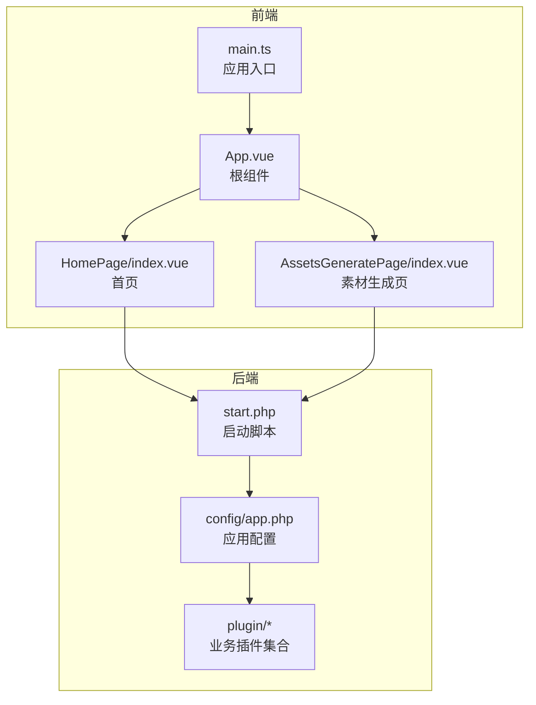
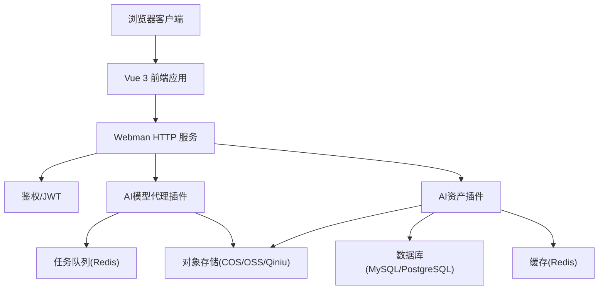
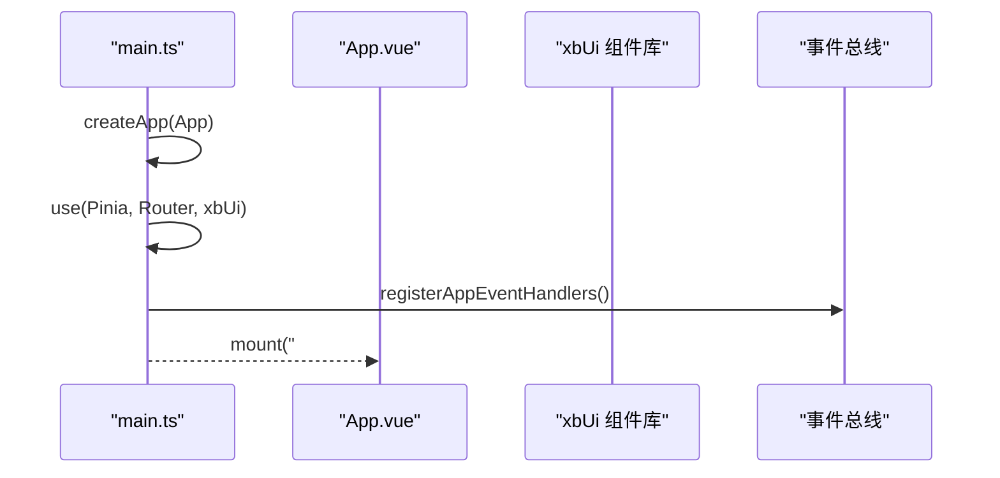
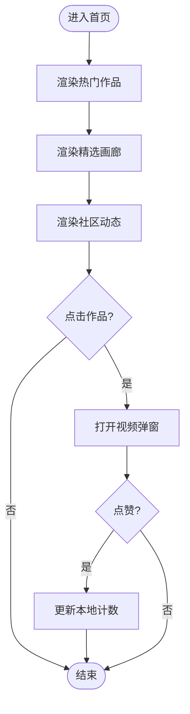
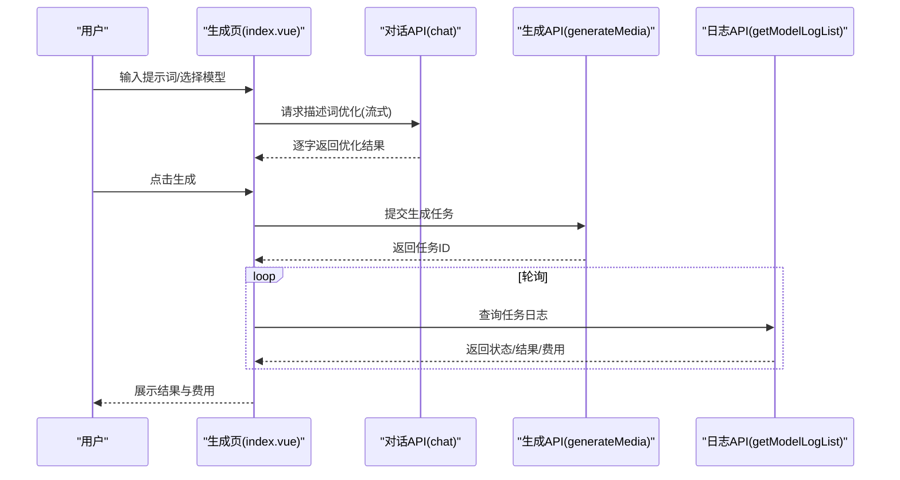
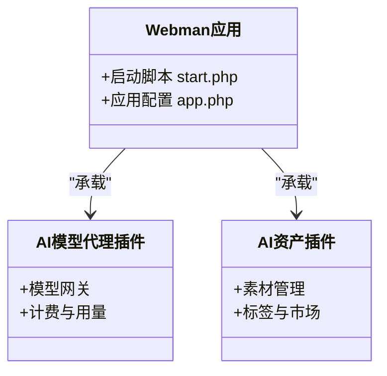
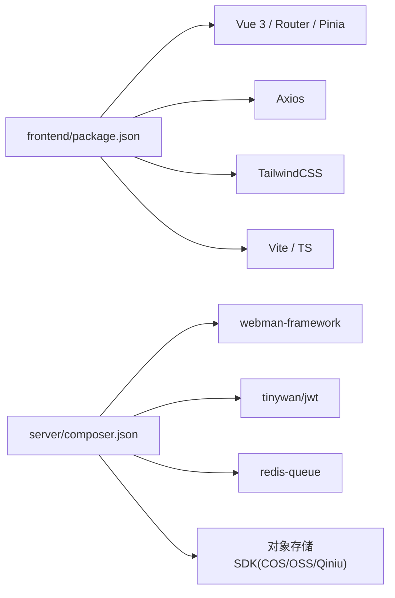

# 项目概述

<cite>
**本文引用的文件**   
- [frontend/package.json](file://frontend/package.json)
- [frontend/src/main.ts](file://frontend/src/main.ts)
- [frontend/src/App.vue](file://frontend/src/App.vue)
- [frontend/src/views/HomePage/index.vue](file://frontend/src/views/HomePage/index.vue)
- [frontend/src/views/AssetsGeneratePage/index.vue](file://frontend/src/views/AssetsGeneratePage/index.vue)
- [server/composer.json](file://server/composer.json)
- [server/start.php](file://server/start.php)
- [server/config/app.php](file://server/config/app.php)
- [server/plugin/xbAiModelAgent/README.md](file://server/plugin/xbAiModelAgent/README.md)
- [server/plugin/xbAiAsset/README.md](file://server/plugin/xbAiAsset/README.md)
</cite>

## 目录
1. [简介](#简介)
2. [项目结构](#项目结构)
3. [核心组件](#核心组件)
4. [架构总览](#架构总览)
5. [详细组件分析](#详细组件分析)
6. [依赖分析](#依赖分析)
7. [性能考量](#性能考量)
8. [故障排查指南](#故障排查指南)
9. [结论](#结论)
10. [附录](#附录)

## 简介
积木云AI创作平台是一个现代化的AI内容创作平台，面向创作者、工作室与内容团队，提供文本、图像、视频等多模态内容的智能生成能力。平台采用前后端分离架构：前端基于Vue 3构建，强调响应式交互与可复用UI；后端基于PHP Webman框架，具备高并发、插件化扩展能力，并通过任务队列与外部存储（对象存储）协同工作，支撑大规模媒体资产的生产与管理。

核心价值主张
- 一站式AI创作：从提示词优化到多模态生成，再到资产沉淀与分发，形成完整闭环。
- 高性能与可扩展：Webman事件驱动模型+插件体系，便于快速接入新模型与新业务。
- 多端体验一致：桌面与移动端统一设计语言，提升创作效率与协作体验。

目标用户群体
- 个人创作者与自媒体作者
- 动画、短视频、广告等创意团队
- 企业营销与品牌内容部门
- 需要批量生产素材的运营与投放团队

主要业务场景
- 文本到图片/视频的批量生成与版本管理
- 角色、场景、道具等资产的标签化组织与检索
- 社区作品展示与热门排行
- 任务日志追踪与结果回放

技术选型理由
- Vue 3 + Vite：现代前端工程化，开发体验与打包性能优异。
- Pinia + Vue Router：轻量状态管理与路由方案，易于维护。
- Webman：基于Workerman的高性能HTTP服务器，适合高并发API服务。
- 插件化架构：通过xbCode生态与自定义插件（如xbAiModelAgent、xbAiAsset）实现能力解耦与快速迭代。
- 任务队列与对象存储：异步处理耗时任务，结合COS/OSS/Qiniu等存储，保障稳定性与扩展性。

## 项目结构
仓库采用前后端分离的组织方式：
- frontend：Vue 3前端应用，包含页面、组件、状态、路由、API封装与工具库。
- server：Webman后端应用，包含基础配置、进程、中间件以及多个业务插件（AI模型代理、AI资产、用户、上传、短信、邮件等）。

图表来源
- [frontend/src/main.ts:1-21](file://frontend/src/main.ts#L1-L21)
- [frontend/src/App.vue:1-4](file://frontend/src/App.vue#L1-L4)
- [frontend/src/views/HomePage/index.vue:1-189](file://frontend/src/views/HomePage/index.vue#L1-L189)
- [frontend/src/views/AssetsGeneratePage/index.vue:1-599](file://frontend/src/views/AssetsGeneratePage/index.vue#L1-L599)
- [server/start.php:1-6](file://server/start.php#L1-L6)
- [server/config/app.php:1-13](file://server/config/app.php#L1-L13)

章节来源
- [frontend/package.json:1-35](file://frontend/package.json#L1-L35)
- [frontend/src/main.ts:1-21](file://frontend/src/main.ts#L1-L21)
- [frontend/src/App.vue:1-4](file://frontend/src/App.vue#L1-L4)
- [server/start.php:1-6](file://server/start.php#L1-L6)
- [server/config/app.php:1-13](file://server/config/app.php#L1-L13)

## 核心组件
- 前端应用入口与全局初始化
  - 应用创建、Pinia状态管理、路由与自定义UI组件库注册。
  - 全局HTTP状态码事件处理（如登录态失效跳转）。
- 首页与社区展示
  - 作品榜单、精选画廊、社区动态与视频播放器弹窗。
- 素材生成工作台
  - 图片/视频双Tab，支持提示词优化（流式）、参数枚举、参考图、生成任务提交与结果轮询。
- 后端服务与插件
  - Webman启动流程与应用配置。
  - AI模型代理插件：对外暴露模型网关能力，统一管理模型调用与计费。
  - AI资产插件：素材资产管理、标签、市场与订单等能力。

章节来源
- [frontend/src/main.ts:1-21](file://frontend/src/main.ts#L1-L21)
- [frontend/src/views/HomePage/index.vue:1-189](file://frontend/src/views/HomePage/index.vue#L1-L189)
- [frontend/src/views/AssetsGeneratePage/index.vue:1-599](file://frontend/src/views/AssetsGeneratePage/index.vue#L1-L599)
- [server/start.php:1-6](file://server/start.php#L1-L6)
- [server/config/app.php:1-13](file://server/config/app.php#L1-L13)
- [server/plugin/xbAiModelAgent/README.md:1-38](file://server/plugin/xbAiModelAgent/README.md#L1-L38)
- [server/plugin/xbAiAsset/README.md:1-38](file://server/plugin/xbAiAsset/README.md#L1-L38)

## 架构总览
系统采用“前端SPA + 后端微插件化”的架构模式。前端通过REST API与后端通信，后端以Webman为HTTP内核，结合事件、队列与缓存等基础设施，将AI模型调用、资产存储、消息通知等能力以插件形式解耦。

图表来源
- [server/start.php:1-6](file://server/start.php#L1-L6)
- [server/config/app.php:1-13](file://server/config/app.php#L1-L13)
- [server/plugin/xbAiModelAgent/README.md:1-38](file://server/plugin/xbAiModelAgent/README.md#L1-L38)
- [server/plugin/xbAiAsset/README.md:1-38](file://server/plugin/xbAiAsset/README.md#L1-L38)

## 详细组件分析

### 前端应用入口与全局初始化
- 职责
  - 创建Vue应用实例，挂载Pinia、Router与自定义UI组件库。
  - 注册全局HTTP拦截器事件（如401/403/301/302），统一处理登录态与重定向。
- 关键点
  - 使用createApp、use进行模块化装配。
  - 通过事件总线触发登录弹窗或全局消息提示。

图表来源
- [frontend/src/main.ts:1-21](file://frontend/src/main.ts#L1-L21)
- [frontend/src/App.vue:1-4](file://frontend/src/App.vue#L1-L4)

章节来源
- [frontend/src/main.ts:1-21](file://frontend/src/main.ts#L1-L21)
- [frontend/src/App.vue:1-4](file://frontend/src/App.vue#L1-L4)

### 首页与社区展示
- 职责
  - 展示热门作品、精选画廊与社区动态。
  - 提供视频播放弹窗，支持点赞与导航至创作页。
- 关键点
  - 数据以本地示例为主，便于演示与快速上手。
  - 通过路由跳转到创作工作台。

图表来源
- [frontend/src/views/HomePage/index.vue:1-189](file://frontend/src/views/HomePage/index.vue#L1-L189)

章节来源
- [frontend/src/views/HomePage/index.vue:1-189](file://frontend/src/views/HomePage/index.vue#L1-L189)

### 素材生成工作台（图片/视频）
- 职责
  - 提供图片与视频两种生成模式，支持提示词优化、参数枚举、参考图、任务提交与结果轮询。
- 关键流程
  - 加载模型列表与枚举配置。
  - 调用对话模型对提示词进行流式优化。
  - 提交生成任务并轮询任务日志，映射状态与费用信息。
- 复杂度与优化
  - 轮询间隔固定，存在待执行/运行中任务时自动启停。
  - 结果映射考虑多种字段回退策略，保证显示一致性。

图表来源
- [frontend/src/views/AssetsGeneratePage/index.vue:1-599](file://frontend/src/views/AssetsGeneratePage/index.vue#L1-L599)

章节来源
- [frontend/src/views/AssetsGeneratePage/index.vue:1-599](file://frontend/src/views/AssetsGeneratePage/index.vue#L1-L599)

### 后端服务与插件
- 启动与配置
  - 通过启动脚本加载依赖并运行应用。
  - 应用配置包括调试开关、时区、公共路径与运行时路径等。
- 插件体系
  - AI模型代理插件：提供模型网关能力，统一对接不同厂商模型。
  - AI资产插件：提供素材资产的管理、标签、市场与订单等能力。
- 扩展点
  - 通过composer脚本在安装/更新/卸载时执行插件生命周期方法。

图表来源
- [server/start.php:1-6](file://server/start.php#L1-L6)
- [server/config/app.php:1-13](file://server/config/app.php#L1-L13)
- [server/plugin/xbAiModelAgent/README.md:1-38](file://server/plugin/xbAiModelAgent/README.md#L1-L38)
- [server/plugin/xbAiAsset/README.md:1-38](file://server/plugin/xbAiAsset/README.md#L1-L38)

章节来源
- [server/start.php:1-6](file://server/start.php#L1-L6)
- [server/config/app.php:1-13](file://server/config/app.php#L1-L13)
- [server/plugin/xbAiModelAgent/README.md:1-38](file://server/plugin/xbAiModelAgent/README.md#L1-L38)
- [server/plugin/xbAiAsset/README.md:1-38](file://server/plugin/xbAiAsset/README.md#L1-L38)

## 依赖分析
- 前端依赖
  - Vue 3、Vue Router、Pinia、Axios、TailwindCSS、Vite、TypeScript等。
  - 图标库与拖拽组件用于增强交互体验。
- 后端依赖
  - Webman框架、JWT鉴权、验证码、APIDoc文档、ThinkORM/Cache、Redis队列、Workflow、Guzzle、部署工具、Markdown解析、短信/邮件/对象存储SDK等。

图表来源
- [frontend/package.json:1-35](file://frontend/package.json#L1-L35)
- [server/composer.json:1-99](file://server/composer.json#L1-L99)

章节来源
- [frontend/package.json:1-35](file://frontend/package.json#L1-L35)
- [server/composer.json:1-99](file://server/composer.json#L1-L99)

## 性能考量
- 前端
  - 使用Vite进行快速开发与构建，按需引入与Tree Shaking减少包体。
  - 列表与轮询控制：仅在存在待执行/运行中任务时开启轮询，避免无效请求。
- 后端
  - Webman事件驱动模型，适合高并发场景。
  - 任务队列异步处理耗时操作，降低请求阻塞。
  - 对象存储直传与CDN加速，减轻服务端压力。
- 建议
  - 对热点接口增加缓存层（Redis）。
  - 大文件上传采用分片与断点续传。
  - 前端图片懒加载与缩略图优先展示。

## 故障排查指南
- 前端常见问题
  - 登录态失效：检查全局HTTP状态码事件是否触发登录弹窗与跳转逻辑。
  - 生成失败：查看控制台错误信息与确认模型/参数是否正确。
  - 轮询未停止：确认是否存在pending/running状态的任务。
- 后端常见问题
  - 启动失败：检查启动脚本与依赖安装情况。
  - 插件异常：核对插件安装/更新脚本与配置文件。
  - 队列消费异常：检查Redis连接与消费者进程状态。

章节来源
- [frontend/src/main.ts:1-21](file://frontend/src/main.ts#L1-L21)
- [frontend/src/views/AssetsGeneratePage/index.vue:1-599](file://frontend/src/views/AssetsGeneratePage/index.vue#L1-L599)
- [server/start.php:1-6](file://server/start.php#L1-L6)

## 结论
积木云AI创作平台以Vue 3与Webman为核心，构建了高可用、可扩展的多模态AI内容创作体系。通过插件化架构与完善的任务队列、对象存储集成，平台能够高效支撑从提示词优化到资产沉淀的全链路业务。未来可在模型接入、多端适配与数据分析方面持续演进，进一步提升创作效率与商业价值。

## 附录
- 术语说明
  - 模型代理：统一对外提供AI模型调用能力的网关层。
  - 资产：平台内管理的文本、图片、视频等媒体资源。
  - 任务日志：记录每次生成任务的参数、状态与结果。
- 相关插件
  - xbAiModelAgent：AI模型网关代理。
  - xbAiAsset：AI素材资产管理。

章节来源
- [server/plugin/xbAiModelAgent/README.md:1-38](file://server/plugin/xbAiModelAgent/README.md#L1-L38)
- [server/plugin/xbAiAsset/README.md:1-38](file://server/plugin/xbAiAsset/README.md#L1-L38)